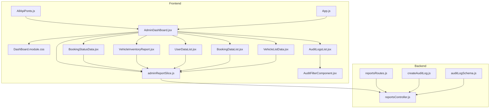
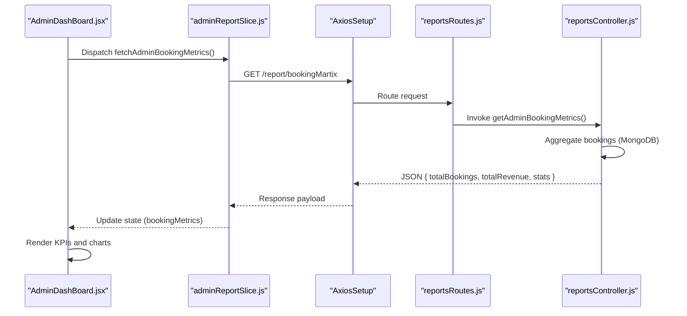
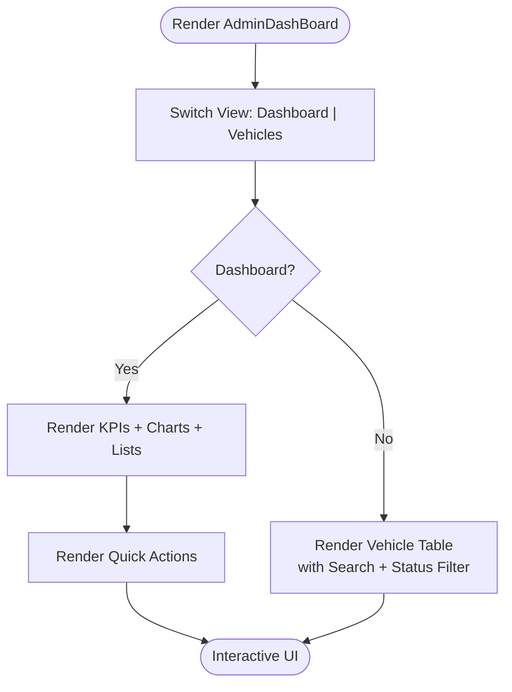
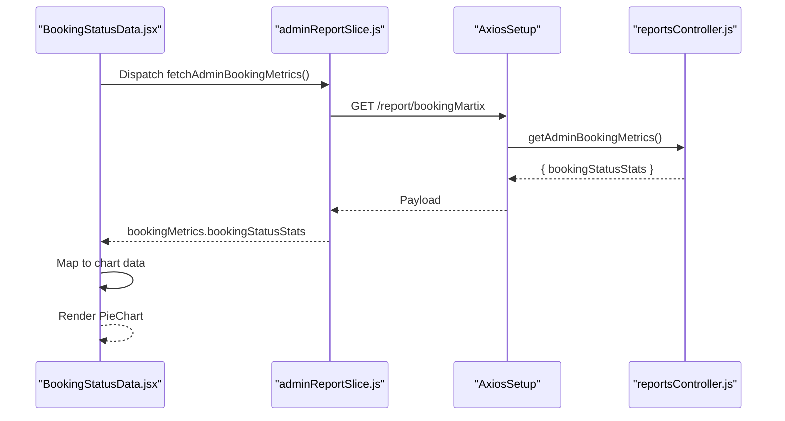
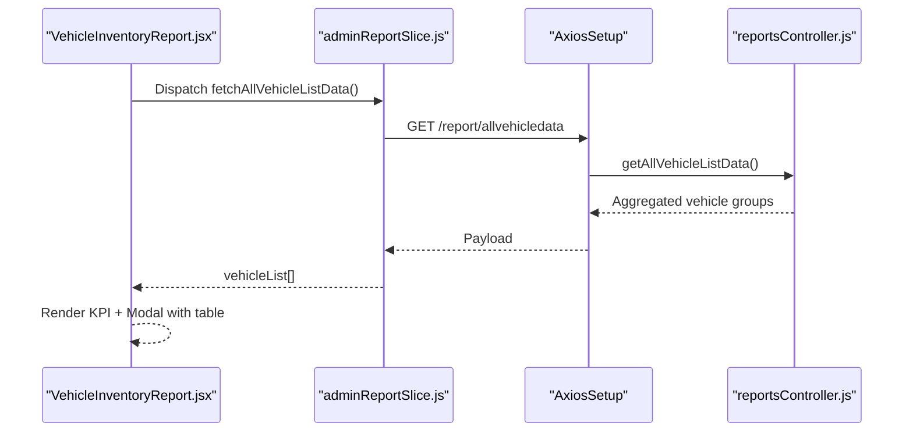
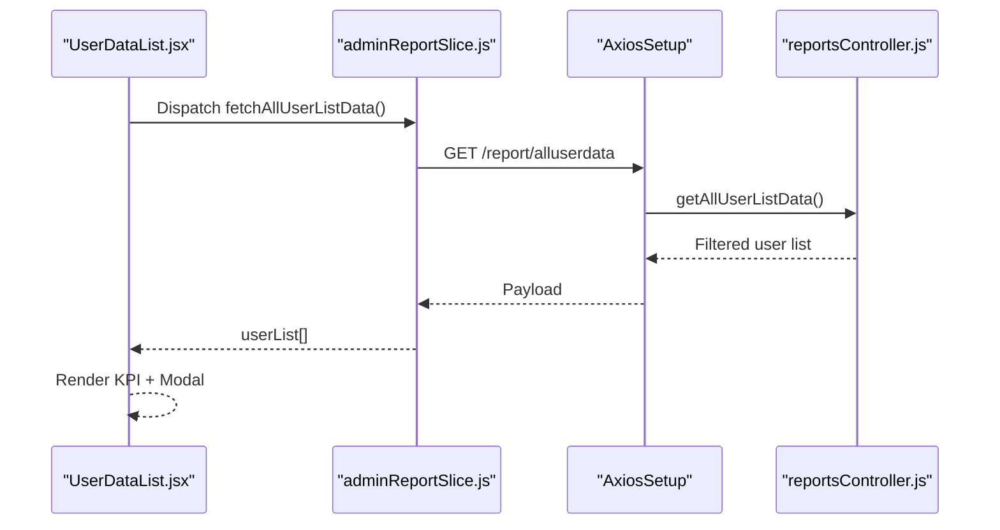
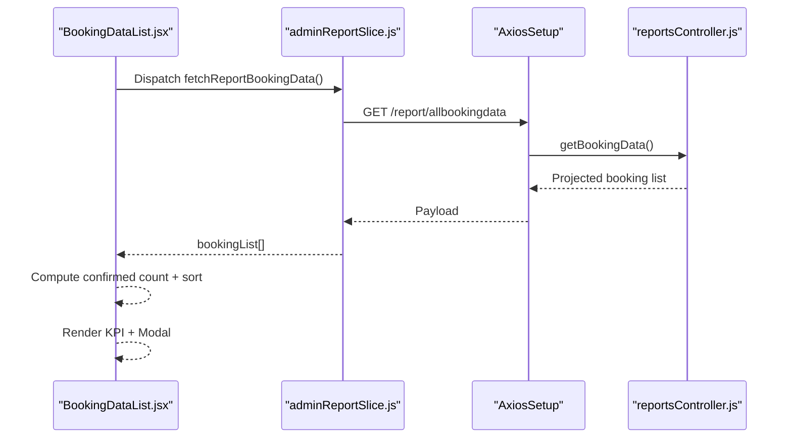
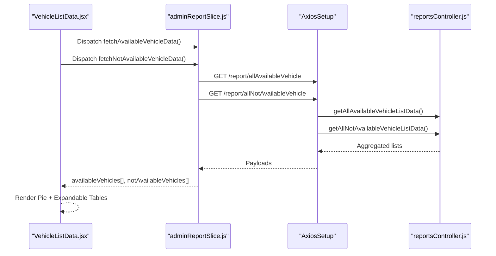
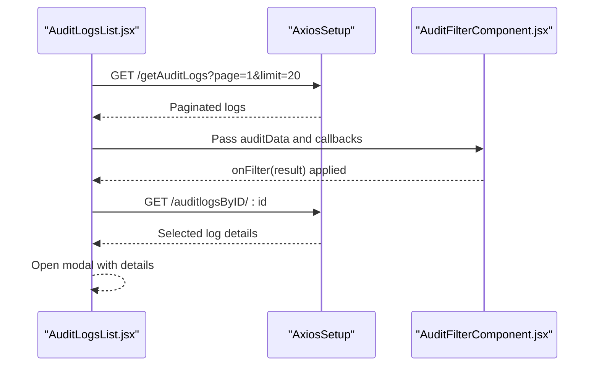
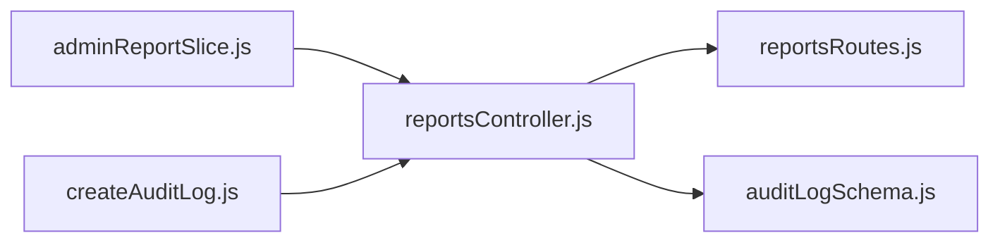

# Admin Dashboard & Analytics

<cite>
**Referenced Files in This Document**
- [AdminDashBoard.jsx](file://frontend/src/pages/adminDashboard/AdminDashBoard.jsx)
- [DashBoard.module.css](file://frontend/src/pages/adminDashboard/DashBoard.module.css)
- [adminReportSlice.js](file://frontend/src/appRedux/redux/reportSlice/adminReportSlice.js)
- [reportsController.js](file://backend/Controller/reportsController.js)
- [reportsRoutes.js](file://backend/router/reportsRoutes.js)
- [BookingStatusData.jsx](file://frontend/src/pages/adminDashboard/reportComponent/BookingStatusData.jsx)
- [VehicleInventoryReport.jsx](file://frontend/src/pages/adminDashboard/reportComponent/VehicleInventoryReport.jsx)
- [UserDataList.jsx](file://frontend/src/pages/adminDashboard/reportComponent/UserDataList.jsx)
- [BookingDataList.jsx](file://frontend/src/pages/adminDashboard/reportComponent/BookingDataList.jsx)
- [VehicleListData.jsx](file://frontend/src/pages/adminDashboard/reportComponent/VehicleListData.jsx)
- [AuditLogsList.jsx](file://frontend/src/pages/adminDashboard/reportComponent/AuditLogsList.jsx)
- [AuditFilterComponent.jsx](file://frontend/src/pages/adminDashboard/reportComponent/AuditFilterComponent.jsx)
- [AllApiPonts.js](file://frontend/src/APIPoints/AllApiPonts.js)
- [App.js](file://frontend/src/App.js)
- [auditLogSchema.js](file://backend/model/auditLogSchema.js)
- [createAuditLog.js](file://backend/utils/createAuditLog.js)
</cite>

## Table of Contents
1. [Introduction](#introduction)
2. [Project Structure](#project-structure)
3. [Core Components](#core-components)
4. [Architecture Overview](#architecture-overview)
5. [Detailed Component Analysis](#detailed-component-analysis)
6. [Dependency Analysis](#dependency-analysis)
7. [Performance Considerations](#performance-considerations)
8. [Troubleshooting Guide](#troubleshooting-guide)
9. [Conclusion](#conclusion)
10. [Appendices](#appendices)

## Introduction
This document provides comprehensive documentation for the admin dashboard and analytics functionality. It covers the dashboard layout, component organization, real-time data visualization, analytics widgets (booking statistics, vehicle inventory metrics, user activity charts, and audit log summaries), data aggregation processes, interactive filtering, module structure with CSS styling and responsive design, and integration with backend reporting APIs. It also outlines potential pathways for real-time updates via WebSocket and live analytics.

## Project Structure
The admin dashboard spans the frontend and backend:
- Frontend: React-based dashboard with Redux Toolkit slices for analytics data, Recharts for visualizations, and modular CSS for styling.
- Backend: Express routes and controllers exposing analytics endpoints, with MongoDB aggregation pipelines for efficient data computation.

**Diagram sources**
- [AdminDashBoard.jsx](file://frontend/src/pages/adminDashboard/AdminDashBoard.jsx#L1-L308)
- [DashBoard.module.css](file://frontend/src/pages/adminDashboard/DashBoard.module.css#L1-L678)
- [adminReportSlice.js](file://frontend/src/appRedux/redux/reportSlice/adminReportSlice.js#L1-L233)
- [reportsController.js](file://backend/Controller/reportsController.js#L1-L641)
- [reportsRoutes.js](file://backend/router/reportsRoutes.js#L1-L51)
- [BookingStatusData.jsx](file://frontend/src/pages/adminDashboard/reportComponent/BookingStatusData.jsx#L1-L77)
- [VehicleInventoryReport.jsx](file://frontend/src/pages/adminDashboard/reportComponent/VehicleInventoryReport.jsx#L1-L146)
- [UserDataList.jsx](file://frontend/src/pages/adminDashboard/reportComponent/UserDataList.jsx#L1-L104)
- [BookingDataList.jsx](file://frontend/src/pages/adminDashboard/reportComponent/BookingDataList.jsx#L1-L148)
- [VehicleListData.jsx](file://frontend/src/pages/adminDashboard/reportComponent/VehicleListData.jsx#L1-L204)
- [AuditLogsList.jsx](file://frontend/src/pages/adminDashboard/reportComponent/AuditLogsList.jsx#L1-L331)
- [AuditFilterComponent.jsx](file://frontend/src/pages/adminDashboard/reportComponent/AuditFilterComponent.jsx#L1-L222)
- [AllApiPonts.js](file://frontend/src/APIPoints/AllApiPonts.js#L1-L3)
- [App.js](file://frontend/src/App.js#L1-L79)
- [auditLogSchema.js](file://backend/model/auditLogSchema.js#L1-L64)
- [createAuditLog.js](file://backend/utils/createAuditLog.js#L1-L31)

**Section sources**
- [AdminDashBoard.jsx](file://frontend/src/pages/adminDashboard/AdminDashBoard.jsx#L1-L308)
- [DashBoard.module.css](file://frontend/src/pages/adminDashboard/DashBoard.module.css#L1-L678)
- [adminReportSlice.js](file://frontend/src/appRedux/redux/reportSlice/adminReportSlice.js#L1-L233)
- [reportsController.js](file://backend/Controller/reportsController.js#L1-L641)
- [reportsRoutes.js](file://backend/router/reportsRoutes.js#L1-L51)

## Core Components
- Admin dashboard container orchestrating tabs, quick actions, and analytics widgets.
- Analytics widgets:
  - Booking statistics (pie chart of booking statuses).
  - Vehicle inventory metrics (vehicle groups and availability).
  - User activity list (user details and booking metrics).
  - Booking list (active bookings with status sorting).
  - Vehicle availability list (available vs unavailable).
- Audit log dashboard with pagination and advanced filters.
- Redux slice managing analytics data lifecycle and state.

**Section sources**
- [AdminDashBoard.jsx](file://frontend/src/pages/adminDashboard/AdminDashBoard.jsx#L70-L308)
- [adminReportSlice.js](file://frontend/src/appRedux/redux/reportSlice/adminReportSlice.js#L133-L233)
- [BookingStatusData.jsx](file://frontend/src/pages/adminDashboard/reportComponent/BookingStatusData.jsx#L20-L77)
- [VehicleInventoryReport.jsx](file://frontend/src/pages/adminDashboard/reportComponent/VehicleInventoryReport.jsx#L8-L146)
- [UserDataList.jsx](file://frontend/src/pages/adminDashboard/reportComponent/UserDataList.jsx#L8-L104)
- [BookingDataList.jsx](file://frontend/src/pages/adminDashboard/reportComponent/BookingDataList.jsx#L16-L148)
- [VehicleListData.jsx](file://frontend/src/pages/adminDashboard/reportComponent/VehicleListData.jsx#L144-L204)
- [AuditLogsList.jsx](file://frontend/src/pages/adminDashboard/reportComponent/AuditLogsList.jsx#L7-L331)

## Architecture Overview
The dashboard follows a layered architecture:
- Presentation layer: React components render KPI cards, charts, tables, and modals.
- State layer: Redux slices manage analytics data, loading, and errors.
- Data access layer: Axios interceptors call backend analytics endpoints.
- Business logic layer: Backend controllers compute aggregates via MongoDB aggregation pipelines.
- Persistence layer: Mongoose models define audit logs and vehicle/user schemas.

**Diagram sources**
- [AdminDashBoard.jsx](file://frontend/src/pages/adminDashboard/AdminDashBoard.jsx#L80-L86)
- [adminReportSlice.js](file://frontend/src/appRedux/redux/reportSlice/adminReportSlice.js#L115-L129)
- [reportsRoutes.js](file://backend/router/reportsRoutes.js#L43-L48)
- [reportsController.js](file://backend/Controller/reportsController.js#L533-L640)

## Detailed Component Analysis

### Dashboard Container and Layout
- Tabs: Switches between dashboard and vehicle services views.
- Quick actions: Buttons for common administrative tasks.
- Grid layouts: Responsive KPI grid and chart grid.
- Vehicle table: Search and status filtering with local state.

**Diagram sources**
- [AdminDashBoard.jsx](file://frontend/src/pages/adminDashboard/AdminDashBoard.jsx#L110-L308)
- [DashBoard.module.css](file://frontend/src/pages/adminDashboard/DashBoard.module.css#L61-L97)

**Section sources**
- [AdminDashBoard.jsx](file://frontend/src/pages/adminDashboard/AdminDashBoard.jsx#L70-L308)
- [DashBoard.module.css](file://frontend/src/pages/adminDashboard/DashBoard.module.css#L1-L678)

### Analytics Widgets

#### Booking Statistics Widget
- Purpose: Visualize booking status distribution using a pie chart.
- Data source: Redux state populated by fetchAdminBookingMetrics thunk.
- Behavior: Converts backend stats to chart data with predefined colors.

**Diagram sources**
- [BookingStatusData.jsx](file://frontend/src/pages/adminDashboard/reportComponent/BookingStatusData.jsx#L20-L77)
- [adminReportSlice.js](file://frontend/src/appRedux/redux/reportSlice/adminReportSlice.js#L115-L129)
- [reportsController.js](file://backend/Controller/reportsController.js#L533-L640)

**Section sources**
- [BookingStatusData.jsx](file://frontend/src/pages/adminDashboard/reportComponent/BookingStatusData.jsx#L1-L77)
- [adminReportSlice.js](file://frontend/src/appRedux/redux/reportSlice/adminReportSlice.js#L115-L129)
- [reportsController.js](file://backend/Controller/reportsController.js#L533-L640)

#### Vehicle Inventory Metrics Widget
- Purpose: Summarize vehicle groups and expandable details in a modal.
- Data source: Redux state from fetchAllVehicleListData thunk.
- Behavior: Clickable KPI card opens a modal with grouped vehicle details and pricing tiers.

**Diagram sources**
- [VehicleInventoryReport.jsx](file://frontend/src/pages/adminDashboard/reportComponent/VehicleInventoryReport.jsx#L8-L146)
- [adminReportSlice.js](file://frontend/src/appRedux/redux/reportSlice/adminReportSlice.js#L28-L42)
- [reportsController.js](file://backend/Controller/reportsController.js#L56-L96)

**Section sources**
- [VehicleInventoryReport.jsx](file://frontend/src/pages/adminDashboard/reportComponent/VehicleInventoryReport.jsx#L1-L146)
- [adminReportSlice.js](file://frontend/src/appRedux/redux/reportSlice/adminReportSlice.js#L28-L42)
- [reportsController.js](file://backend/Controller/reportsController.js#L56-L96)

#### User Activity Widget
- Purpose: Display total number of users and expandable user details in a modal.
- Data source: Redux state from fetchAllUserListData thunk.
- Behavior: Clickable KPI card opens a modal with user metrics.

**Diagram sources**
- [UserDataList.jsx](file://frontend/src/pages/adminDashboard/reportComponent/UserDataList.jsx#L8-L104)
- [adminReportSlice.js](file://frontend/src/appRedux/redux/reportSlice/adminReportSlice.js#L45-L59)
- [reportsController.js](file://backend/Controller/reportsController.js#L98-L131)

**Section sources**
- [UserDataList.jsx](file://frontend/src/pages/adminDashboard/reportComponent/UserDataList.jsx#L1-L104)
- [adminReportSlice.js](file://frontend/src/appRedux/redux/reportSlice/adminReportSlice.js#L45-L59)
- [reportsController.js](file://backend/Controller/reportsController.js#L98-L131)

#### Booking List Widget
- Purpose: Show active bookings and sort by status priority.
- Data source: Redux state from fetchReportBookingData thunk.
- Behavior: Clickable KPI card opens a modal with sorted booking details.

**Diagram sources**
- [BookingDataList.jsx](file://frontend/src/pages/adminDashboard/reportComponent/BookingDataList.jsx#L16-L148)
- [adminReportSlice.js](file://frontend/src/appRedux/redux/reportSlice/adminReportSlice.js#L12-L25)
- [reportsController.js](file://backend/Controller/reportsController.js#L8-L54)

**Section sources**
- [BookingDataList.jsx](file://frontend/src/pages/adminDashboard/reportComponent/BookingDataList.jsx#L1-L148)
- [adminReportSlice.js](file://frontend/src/appRedux/redux/reportSlice/adminReportSlice.js#L12-L25)
- [reportsController.js](file://backend/Controller/reportsController.js#L8-L54)

#### Vehicle Availability Widget
- Purpose: Show available vs unavailable vehicles with grouped lists.
- Data source: Redux state from fetchAvailableVehicleData and fetchNotAvailableVehicleData thunks.
- Behavior: Pie chart plus expandable tables for available and unavailable vehicles.

**Diagram sources**
- [VehicleListData.jsx](file://frontend/src/pages/adminDashboard/reportComponent/VehicleListData.jsx#L144-L204)
- [adminReportSlice.js](file://frontend/src/appRedux/redux/reportSlice/adminReportSlice.js#L80-L95)
- [reportsController.js](file://backend/Controller/reportsController.js#L306-L378)

**Section sources**
- [VehicleListData.jsx](file://frontend/src/pages/adminDashboard/reportComponent/VehicleListData.jsx#L1-L204)
- [adminReportSlice.js](file://frontend/src/appRedux/redux/reportSlice/adminReportSlice.js#L80-L95)
- [reportsController.js](file://backend/Controller/reportsController.js#L306-L378)

### Audit Log Dashboard
- Pagination: Fetches paginated audit logs with configurable limits.
- Filtering: Advanced filter panel supports action, entity, user, user type, and date range.
- Details modal: Displays old/new values and metadata for a selected log.

**Diagram sources**
- [AuditLogsList.jsx](file://frontend/src/pages/adminDashboard/reportComponent/AuditLogsList.jsx#L7-L331)
- [AuditFilterComponent.jsx](file://frontend/src/pages/adminDashboard/reportComponent/AuditFilterComponent.jsx#L22-L222)

**Section sources**
- [AuditLogsList.jsx](file://frontend/src/pages/adminDashboard/reportComponent/AuditLogsList.jsx#L1-L331)
- [AuditFilterComponent.jsx](file://frontend/src/pages/adminDashboard/reportComponent/AuditFilterComponent.jsx#L1-L222)

## Dependency Analysis
- Frontend-to-backend dependencies:
  - Redux thunks call Express routes under /report.
  - Audit log endpoints are separate from analytics routes.
- Backend dependencies:
  - Controllers depend on Mongoose models and aggregation pipelines.
  - Audit logging utility creates entries with request metadata.

**Diagram sources**
- [adminReportSlice.js](file://frontend/src/appRedux/redux/reportSlice/adminReportSlice.js#L1-L233)
- [reportsController.js](file://backend/Controller/reportsController.js#L1-L641)
- [reportsRoutes.js](file://backend/router/reportsRoutes.js#L1-L51)
- [auditLogSchema.js](file://backend/model/auditLogSchema.js#L1-L64)
- [createAuditLog.js](file://backend/utils/createAuditLog.js#L1-L31)

**Section sources**
- [adminReportSlice.js](file://frontend/src/appRedux/redux/reportSlice/adminReportSlice.js#L1-L233)
- [reportsController.js](file://backend/Controller/reportsController.js#L1-L641)
- [reportsRoutes.js](file://backend/router/reportsRoutes.js#L1-L51)
- [auditLogSchema.js](file://backend/model/auditLogSchema.js#L1-L64)
- [createAuditLog.js](file://backend/utils/createAuditLog.js#L1-L31)

## Performance Considerations
- Backend aggregation:
  - Use $unwind, $match, $project, and $facet to minimize client-side processing.
  - Index fields used in filters (e.g., booking status, dates).
- Frontend rendering:
  - Memoize derived computations (e.g., confirmed booking count, chart data).
  - Lazy-load modals and large tables to reduce initial render cost.
- Network:
  - Paginate audit logs and throttle filter updates to avoid excessive requests.

[No sources needed since this section provides general guidance]

## Troubleshooting Guide
- Redux state resets:
  - Use resetAdminReportState to clear analytics data when switching contexts.
- Error handling:
  - Thunks return rejectWithValue with error messages; display user-friendly messages.
- Authentication and permissions:
  - Routes enforce admin role; ensure tokens are attached to requests.
- Audit logs:
  - Verify audit actions and schemas; confirm IP and user agent capture.

**Section sources**
- [adminReportSlice.js](file://frontend/src/appRedux/redux/reportSlice/adminReportSlice.js#L147-L159)
- [reportsRoutes.js](file://backend/router/reportsRoutes.js#L7-L48)
- [auditLogSchema.js](file://backend/model/auditLogSchema.js#L1-L64)
- [createAuditLog.js](file://backend/utils/createAuditLog.js#L1-L31)

## Conclusion
The admin dashboard integrates modular React components with Redux for state management and Recharts for visualizations. Backend analytics leverage MongoDB aggregation for efficient computation, while audit logging captures system changes with metadata. The current implementation focuses on REST-based data retrieval; future enhancements can integrate WebSocket for real-time updates and expand interactive filtering capabilities.

[No sources needed since this section summarizes without analyzing specific files]

## Appendices

### Real-time Updates and WebSocket Integration
- Current state: REST endpoints serve analytics data.
- Recommended approach:
  - Establish WebSocket connection using environment-provided server URL.
  - Subscribe to analytics channels (e.g., booking updates, inventory changes).
  - On events, dispatch Redux actions to update state and re-render charts.

**Section sources**
- [AllApiPonts.js](file://frontend/src/APIPoints/AllApiPonts.js#L1-L3)
- [App.js](file://frontend/src/App.js#L1-L79)

### Data Presentation Formats
- Booking metrics:
  - Total bookings, total revenue, upcoming pickups, active bookings, booking status breakdown.
- Vehicle inventory:
  - Vehicle groups with pricing tiers and availability indicators.
- User activity:
  - User details, booking counts, spending metrics.
- Audit logs:
  - Action, entity, performed by, timestamps, old/new values, device info.

**Section sources**
- [reportsController.js](file://backend/Controller/reportsController.js#L533-L640)
- [reportsController.js](file://backend/Controller/reportsController.js#L56-L96)
- [reportsController.js](file://backend/Controller/reportsController.js#L98-L131)
- [AuditLogsList.jsx](file://frontend/src/pages/adminDashboard/reportComponent/AuditLogsList.jsx#L220-L290)