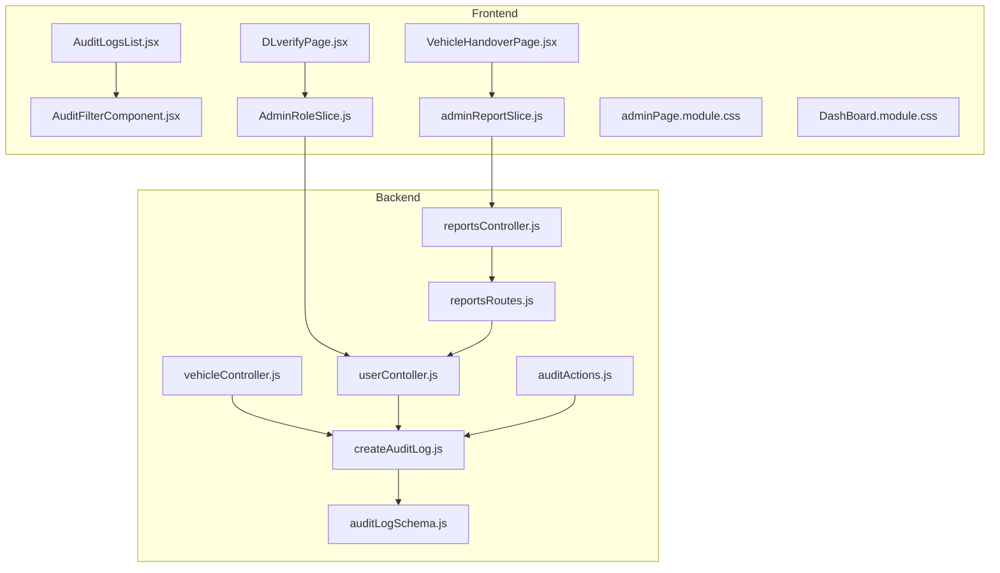
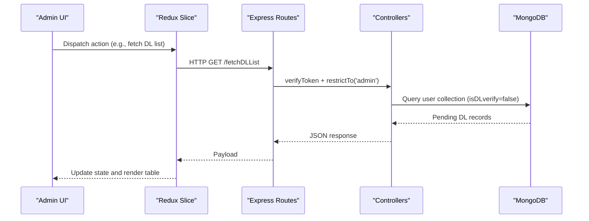
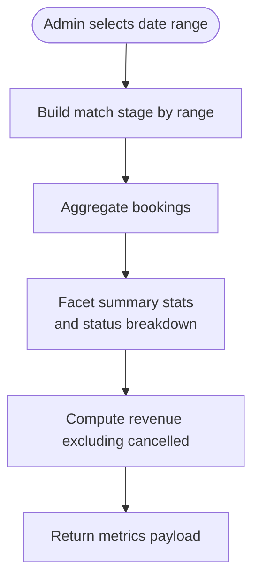
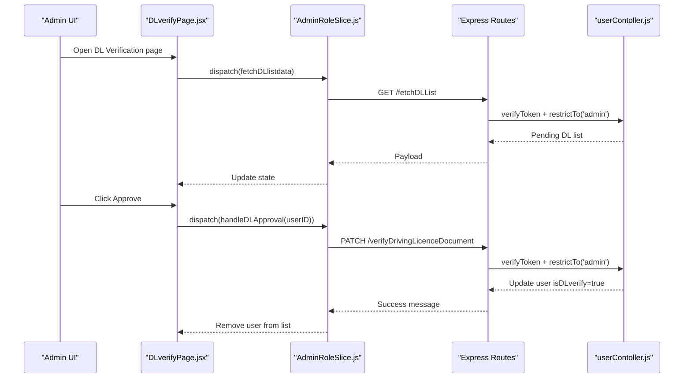
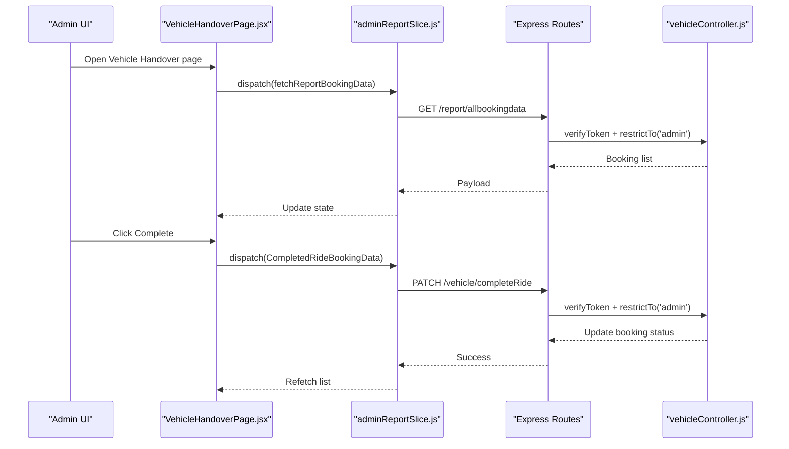
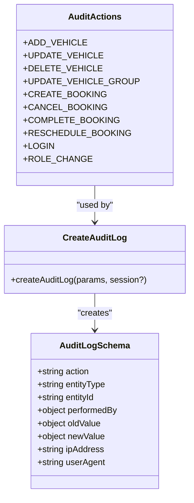
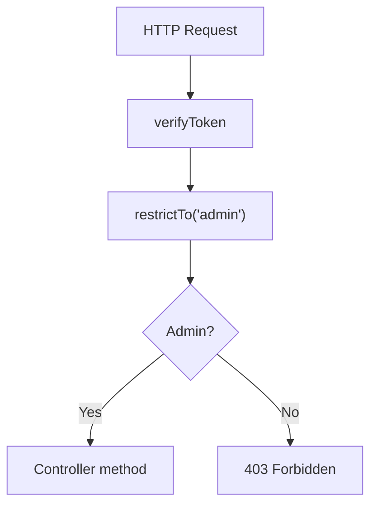
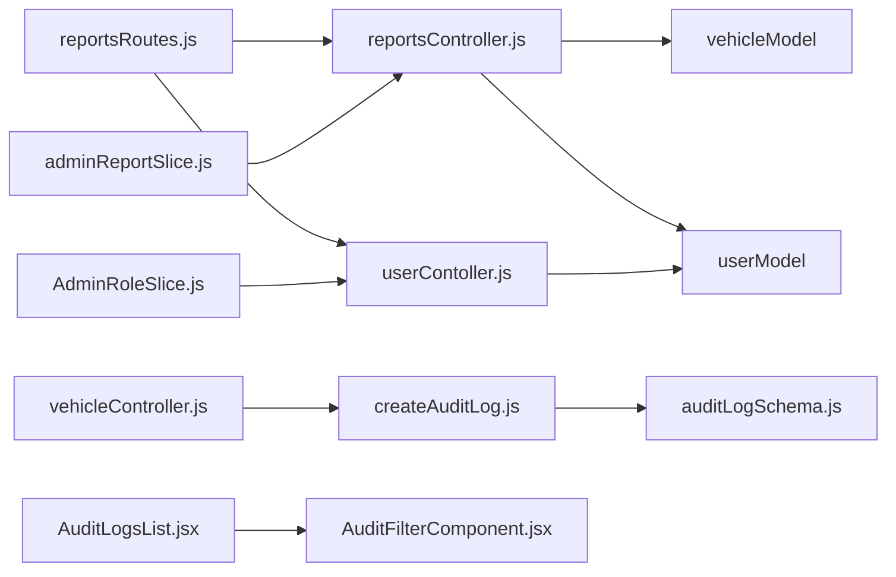

# Administrative Features

<cite>
**Referenced Files in This Document**
- [reportsController.js](file://backend/Controller/reportsController.js)
- [reportsRoutes.js](file://backend/router/reportsRoutes.js)
- [userContoller.js](file://backend/Controller/userContoller.js)
- [vehicleController.js](file://backend/Controller/vehicleController.js)
- [auditLogSchema.js](file://backend/model/auditLogSchema.js)
- [createAuditLog.js](file://backend/utils/createAuditLog.js)
- [auditActions.js](file://backend/config/auditActions.js)
- [DLverifyPage.jsx](file://frontend/src/pages/AdminPages/DLverifyPage.jsx)
- [VehicleHandoverPage.jsx](file://frontend/src/pages/AdminPages/VehicleHandoverPage.jsx)
- [AuditLogsList.jsx](file://frontend/src/pages/adminDashboard/reportComponent/AuditLogsList.jsx)
- [AuditFilterComponent.jsx](file://frontend/src/pages/adminDashboard/reportComponent/AuditFilterComponent.jsx)
- [AdminRoleSlice.js](file://frontend/src/appRedux/redux/adminSlice/AdminRoleSlice.js)
- [adminReportSlice.js](file://frontend/src/appRedux/redux/reportSlice/adminReportSlice.js)
- [adminPage.module.css](file://frontend/src/pages/AdminPages/adminPage.module.css)
- [DashBoard.module.css](file://frontend/src/pages/adminDashboard/DashBoard.module.css)
</cite>

## Table of Contents
1. [Introduction](#introduction)
2. [Project Structure](#project-structure)
3. [Core Components](#core-components)
4. [Architecture Overview](#architecture-overview)
5. [Detailed Component Analysis](#detailed-component-analysis)
6. [Dependency Analysis](#dependency-analysis)
7. [Performance Considerations](#performance-considerations)
8. [Troubleshooting Guide](#troubleshooting-guide)
9. [Conclusion](#conclusion)

## Introduction
This document explains the administrative features and dashboard functionality of the vehicle rental platform. It covers:
- Admin dashboard analytics and reporting
- Vehicle handover and ride completion workflows
- Driver license verification workflows
- Reporting system: audit logs, booking statistics, vehicle inventory reports, and user activity tracking
- Administrative controls: user management, vehicle approval processes, and system monitoring
- Export and filtering capabilities
- Compliance reporting and audit trails

## Project Structure
The administrative features span backend controllers and models, frontend pages and Redux slices, and shared configuration for audit actions.

**Diagram sources**
- [reportsController.js](file://backend/Controller/reportsController.js#L1-L641)
- [reportsRoutes.js](file://backend/router/reportsRoutes.js#L1-L51)
- [userContoller.js](file://backend/Controller/userContoller.js#L1-L832)
- [vehicleController.js](file://backend/Controller/vehicleController.js#L1-L824)
- [auditLogSchema.js](file://backend/model/auditLogSchema.js#L1-L64)
- [createAuditLog.js](file://backend/utils/createAuditLog.js#L1-L31)
- [auditActions.js](file://backend/config/auditActions.js#L1-L18)
- [DLverifyPage.jsx](file://frontend/src/pages/AdminPages/DLverifyPage.jsx#L1-L182)
- [VehicleHandoverPage.jsx](file://frontend/src/pages/AdminPages/VehicleHandoverPage.jsx#L1-L143)
- [AuditLogsList.jsx](file://frontend/src/pages/adminDashboard/reportComponent/AuditLogsList.jsx#L1-L331)
- [AuditFilterComponent.jsx](file://frontend/src/pages/adminDashboard/reportComponent/AuditFilterComponent.jsx#L1-L222)
- [AdminRoleSlice.js](file://frontend/src/appRedux/redux/adminSlice/AdminRoleSlice.js#L1-L106)
- [adminReportSlice.js](file://frontend/src/appRedux/redux/reportSlice/adminReportSlice.js#L1-L233)
- [adminPage.module.css](file://frontend/src/pages/AdminPages/adminPage.module.css#L1-L215)
- [DashBoard.module.css](file://frontend/src/pages/adminDashboard/DashBoard.module.css#L1-L678)

**Section sources**
- [reportsController.js](file://backend/Controller/reportsController.js#L1-L641)
- [reportsRoutes.js](file://backend/router/reportsRoutes.js#L1-L51)
- [userContoller.js](file://backend/Controller/userContoller.js#L1-L832)
- [vehicleController.js](file://backend/Controller/vehicleController.js#L1-L824)
- [auditLogSchema.js](file://backend/model/auditLogSchema.js#L1-L64)
- [createAuditLog.js](file://backend/utils/createAuditLog.js#L1-L31)
- [auditActions.js](file://backend/config/auditActions.js#L1-L18)
- [DLverifyPage.jsx](file://frontend/src/pages/AdminPages/DLverifyPage.jsx#L1-L182)
- [VehicleHandoverPage.jsx](file://frontend/src/pages/AdminPages/VehicleHandoverPage.jsx#L1-L143)
- [AuditLogsList.jsx](file://frontend/src/pages/adminDashboard/reportComponent/AuditLogsList.jsx#L1-L331)
- [AuditFilterComponent.jsx](file://frontend/src/pages/adminDashboard/reportComponent/AuditFilterComponent.jsx#L1-L222)
- [AdminRoleSlice.js](file://frontend/src/appRedux/redux/adminSlice/AdminRoleSlice.js#L1-L106)
- [adminReportSlice.js](file://frontend/src/appRedux/redux/reportSlice/adminReportSlice.js#L1-L233)
- [adminPage.module.css](file://frontend/src/pages/AdminPages/adminPage.module.css#L1-L215)
- [DashBoard.module.css](file://frontend/src/pages/adminDashboard/DashBoard.module.css#L1-L678)

## Core Components
- Reports and Analytics
  - Booking data aggregation with optional filters
  - Vehicle inventory lists (available/not available)
  - User listing with booking metrics
  - Vehicle type distribution
  - Booking metrics by date range
- Driver License Verification
  - Admin view of pending DL verification requests
  - Preview of uploaded documents
  - Approval workflow
- Vehicle Handover and Completion
  - Listing of active confirmed bookings
  - Ride completion action
- Audit Trail and Compliance
  - Centralized audit log schema
  - Audit action constants
  - Audit creation utility supporting transactions
  - Audit log dashboard with pagination and filters
- Administrative Controls
  - Admin-only routes protected by middleware
  - Redux slices orchestrating admin workflows

**Section sources**
- [reportsController.js](file://backend/Controller/reportsController.js#L8-L641)
- [reportsRoutes.js](file://backend/router/reportsRoutes.js#L7-L48)
- [userContoller.js](file://backend/Controller/userContoller.js#L435-L492)
- [vehicleController.js](file://backend/Controller/vehicleController.js#L20-L203)
- [auditLogSchema.js](file://backend/model/auditLogSchema.js#L3-L61)
- [createAuditLog.js](file://backend/utils/createAuditLog.js#L3-L30)
- [auditActions.js](file://backend/config/auditActions.js#L1-L18)
- [DLverifyPage.jsx](file://frontend/src/pages/AdminPages/DLverifyPage.jsx#L10-L182)
- [VehicleHandoverPage.jsx](file://frontend/src/pages/AdminPages/VehicleHandoverPage.jsx#L10-L143)
- [AuditLogsList.jsx](file://frontend/src/pages/adminDashboard/reportComponent/AuditLogsList.jsx#L7-L331)
- [AuditFilterComponent.jsx](file://frontend/src/pages/adminDashboard/reportComponent/AuditFilterComponent.jsx#L22-L222)
- [AdminRoleSlice.js](file://frontend/src/appRedux/redux/adminSlice/AdminRoleSlice.js#L4-L106)
- [adminReportSlice.js](file://frontend/src/appRedux/redux/reportSlice/adminReportSlice.js#L12-L233)

## Architecture Overview
The admin dashboard integrates frontend pages and Redux slices with backend controllers and models. Admin-only routes enforce role-based access. Audit logs capture administrative actions consistently across vehicle and user operations.

**Diagram sources**
- [reportsRoutes.js](file://backend/router/reportsRoutes.js#L1-L51)
- [userContoller.js](file://backend/Controller/userContoller.js#L435-L492)
- [AdminRoleSlice.js](file://frontend/src/appRedux/redux/adminSlice/AdminRoleSlice.js#L4-L39)
- [DLverifyPage.jsx](file://frontend/src/pages/AdminPages/DLverifyPage.jsx#L26-L55)

## Detailed Component Analysis

### Reporting System and Analytics
- Booking Data
  - Endpoint: GET /report/allbookingdata
  - Filters: bookingStatus via query param
  - Aggregation projects booking details and user/vehicle metadata
- Vehicle Inventory Reports
  - GET /report/allvehicledata: Projects vehicle groups and nested vehicle details
  - GET /report/allAvailableVehicle: Returns available vehicles with counts
  - GET /report/allNotAvailableVehicle: Returns unavailable vehicles with counts
- User Activity Tracking
  - GET /report/alluserdata: Returns user list with booking metrics and DL verification status
- Vehicle Type Distribution
  - GET /report/getVehicleType: Groups by vehicleType and counts
- Booking Metrics
  - GET /report/bookingMartix: Computes totals, revenue, upcoming pickups, active bookings, and breakdown by status with date range filtering

**Diagram sources**
- [reportsController.js](file://backend/Controller/reportsController.js#L533-L640)

**Section sources**
- [reportsController.js](file://backend/Controller/reportsController.js#L8-L131)
- [reportsController.js](file://backend/Controller/reportsController.js#L133-L305)
- [reportsController.js](file://backend/Controller/reportsController.js#L306-L408)
- [reportsController.js](file://backend/Controller/reportsController.js#L410-L498)
- [reportsController.js](file://backend/Controller/reportsController.js#L500-L641)
- [reportsRoutes.js](file://backend/router/reportsRoutes.js#L7-L48)

### Driver License Verification Workflow
- Admin view displays pending DL verification requests with user details and document previews
- Approve action updates user verification flag and removes the user from the pending list
- Preview supports images and PDFs

**Diagram sources**
- [DLverifyPage.jsx](file://frontend/src/pages/AdminPages/DLverifyPage.jsx#L26-L55)
- [AdminRoleSlice.js](file://frontend/src/appRedux/redux/adminSlice/AdminRoleSlice.js#L4-L39)
- [reportsRoutes.js](file://backend/router/reportsRoutes.js#L1-L51)
- [userContoller.js](file://backend/Controller/userContoller.js#L435-L461)

**Section sources**
- [DLverifyPage.jsx](file://frontend/src/pages/AdminPages/DLverifyPage.jsx#L10-L182)
- [AdminRoleSlice.js](file://frontend/src/appRedux/redux/adminSlice/AdminRoleSlice.js#L4-L106)
- [userContoller.js](file://backend/Controller/userContoller.js#L435-L492)

### Vehicle Handover and Ride Completion
- Lists active confirmed bookings
- Completes a ride by updating booking status to completed
- Refreshes the list upon successful completion

**Diagram sources**
- [VehicleHandoverPage.jsx](file://frontend/src/pages/AdminPages/VehicleHandoverPage.jsx#L24-L53)
- [adminReportSlice.js](file://frontend/src/appRedux/redux/reportSlice/adminReportSlice.js#L12-L25)
- [reportsRoutes.js](file://backend/router/reportsRoutes.js#L1-L51)
- [vehicleController.js](file://backend/Controller/vehicleController.js#L20-L203)

**Section sources**
- [VehicleHandoverPage.jsx](file://frontend/src/pages/AdminPages/VehicleHandoverPage.jsx#L10-L143)
- [adminReportSlice.js](file://frontend/src/appRedux/redux/reportSlice/adminReportSlice.js#L12-L233)

### Audit Trail and Compliance
- Audit log schema captures action, entity, identifiers, actor, IP, user agent, and old/new values
- Audit actions centralized in constants
- Audit creation utility supports MongoDB sessions for transaction safety
- Admin audit log dashboard with pagination and advanced filters

**Diagram sources**
- [auditLogSchema.js](file://backend/model/auditLogSchema.js#L3-L61)
- [auditActions.js](file://backend/config/auditActions.js#L1-L18)
- [createAuditLog.js](file://backend/utils/createAuditLog.js#L3-L30)

**Section sources**
- [auditLogSchema.js](file://backend/model/auditLogSchema.js#L1-L64)
- [auditActions.js](file://backend/config/auditActions.js#L1-L18)
- [createAuditLog.js](file://backend/utils/createAuditLog.js#L1-L31)
- [AuditLogsList.jsx](file://frontend/src/pages/adminDashboard/reportComponent/AuditLogsList.jsx#L7-L331)
- [AuditFilterComponent.jsx](file://frontend/src/pages/adminDashboard/reportComponent/AuditFilterComponent.jsx#L22-L222)

### Administrative Controls and Security
- Admin-only routes enforced with token verification and role restriction
- Vehicle CRUD operations and group updates emit audit logs
- User DL verification controlled by admin actions

**Diagram sources**
- [reportsRoutes.js](file://backend/router/reportsRoutes.js#L7-L48)
- [userContoller.js](file://backend/Controller/userContoller.js#L435-L461)
- [vehicleController.js](file://backend/Controller/vehicleController.js#L20-L203)

**Section sources**
- [reportsRoutes.js](file://backend/router/reportsRoutes.js#L1-L51)
- [userContoller.js](file://backend/Controller/userContoller.js#L435-L461)
- [vehicleController.js](file://backend/Controller/vehicleController.js#L20-L203)

### Frontend Styles and UX
- Shared module CSS defines table layouts, modals, badges, and responsive grids
- Admin pages leverage these styles for consistent presentation

**Section sources**
- [adminPage.module.css](file://frontend/src/pages/AdminPages/adminPage.module.css#L1-L215)
- [DashBoard.module.css](file://frontend/src/pages/adminDashboard/DashBoard.module.css#L1-L678)

## Dependency Analysis
- Backend
  - Controllers depend on models and utilities for audit logging
  - Routes depend on controllers and middleware for admin access
- Frontend
  - Pages depend on Redux slices for data fetching and state updates
  - Audit dashboard depends on filter component and pagination logic

**Diagram sources**
- [reportsRoutes.js](file://backend/router/reportsRoutes.js#L1-L51)
- [reportsController.js](file://backend/Controller/reportsController.js#L1-L641)
- [userContoller.js](file://backend/Controller/userContoller.js#L1-L832)
- [vehicleController.js](file://backend/Controller/vehicleController.js#L1-L824)
- [createAuditLog.js](file://backend/utils/createAuditLog.js#L1-L31)
- [auditLogSchema.js](file://backend/model/auditLogSchema.js#L1-L64)
- [AdminRoleSlice.js](file://frontend/src/appRedux/redux/adminSlice/AdminRoleSlice.js#L1-L106)
- [adminReportSlice.js](file://frontend/src/appRedux/redux/reportSlice/adminReportSlice.js#L1-L233)
- [AuditLogsList.jsx](file://frontend/src/pages/adminDashboard/reportComponent/AuditLogsList.jsx#L1-L331)
- [AuditFilterComponent.jsx](file://frontend/src/pages/adminDashboard/reportComponent/AuditFilterComponent.jsx#L1-L222)

**Section sources**
- [reportsRoutes.js](file://backend/router/reportsRoutes.js#L1-L51)
- [reportsController.js](file://backend/Controller/reportsController.js#L1-L641)
- [userContoller.js](file://backend/Controller/userContoller.js#L1-L832)
- [vehicleController.js](file://backend/Controller/vehicleController.js#L1-L824)
- [createAuditLog.js](file://backend/utils/createAuditLog.js#L1-L31)
- [auditLogSchema.js](file://backend/model/auditLogSchema.js#L1-L64)
- [AdminRoleSlice.js](file://frontend/src/appRedux/redux/adminSlice/AdminRoleSlice.js#L1-L106)
- [adminReportSlice.js](file://frontend/src/appRedux/redux/reportSlice/adminReportSlice.js#L1-L233)
- [AuditLogsList.jsx](file://frontend/src/pages/adminDashboard/reportComponent/AuditLogsList.jsx#L1-L331)
- [AuditFilterComponent.jsx](file://frontend/src/pages/adminDashboard/reportComponent/AuditFilterComponent.jsx#L1-L222)

## Performance Considerations
- Aggregation pipelines in reportsController use unwinds, matches, projections, and facets to minimize client-side processing
- Pagination in audit logs reduces payload sizes
- Redis caching for vehicle listings improves read performance

[No sources needed since this section provides general guidance]

## Troubleshooting Guide
- Admin route access denied
  - Ensure token verification and role restriction middleware are applied to admin routes
- Audit logs not appearing
  - Verify audit creation utility receives request context and runs within transactions when needed
- DL verification not updating
  - Confirm admin-only endpoint is invoked and user verification field is updated
- Booking completion errors
  - Check controller method for ride completion and ensure proper status transitions

**Section sources**
- [reportsRoutes.js](file://backend/router/reportsRoutes.js#L7-L48)
- [createAuditLog.js](file://backend/utils/createAuditLog.js#L3-L30)
- [userContoller.js](file://backend/Controller/userContoller.js#L435-L461)
- [vehicleController.js](file://backend/Controller/vehicleController.js#L20-L203)

## Conclusion
The administrative features provide a robust foundation for analytics, compliance, and operational oversight. Admins can monitor bookings, manage vehicle inventories, verify driver licenses, and track system activity through a centralized audit trail. The modular frontend-backend design enables scalable enhancements for export, filtering, and compliance reporting.