# Audit & Compliance

<cite>
**Referenced Files in This Document**
- [auditActions.js](file://backend/config/auditActions.js)
- [auditLogSchema.js](file://backend/model/auditLogSchema.js)
- [createAuditLog.js](file://backend/utils/createAuditLog.js)
- [userContoller.js](file://backend/Controller/userContoller.js)
- [userRoutes.js](file://backend/router/userRoutes.js)
- [vehicleController.js](file://backend/Controller/vehicleController.js)
- [vehicleRoute.js](file://backend/router/vehicleRoute.js)
- [AuditLogsList.jsx](file://frontend/src/pages/adminDashboard/reportComponent/AuditLogsList.jsx)
- [AuditFilterComponent.jsx](file://frontend/src/pages/adminDashboard/reportComponent/AuditFilterComponent.jsx)
- [reportsController.js](file://backend/Controller/reportsController.js)
- [reportsRoutes.js](file://backend/router/reportsRoutes.js)
- [restrictTo.js](file://backend/utils/restrictTo.js)
- [verifyToken.js](file://backend/utils/verifyToken.js)
- [logger.js](file://backend/utils/logger.js)
</cite>

## Table of Contents
1. [Introduction](#introduction)
2. [Project Structure](#project-structure)
3. [Core Components](#core-components)
4. [Architecture Overview](#architecture-overview)
5. [Detailed Component Analysis](#detailed-component-analysis)
6. [Dependency Analysis](#dependency-analysis)
7. [Performance Considerations](#performance-considerations)
8. [Troubleshooting Guide](#troubleshooting-guide)
9. [Conclusion](#conclusion)
10. [Appendices](#appendices)

## Introduction
This document describes the audit and compliance management system implemented in the project. It covers audit action configuration, audit log schema, audit trail functionality (filtering, search, pagination), admin alert readiness, compliance reporting features, data privacy and access controls, and integration points for external compliance tools. It also outlines lifecycle management, archiving strategies, and legal compliance requirements.

## Project Structure
The audit and compliance system spans backend models, utilities, controllers, routers, and frontend dashboards:
- Backend configuration defines audit action constants.
- Backend models define the audit log schema.
- Backend utilities provide audit logging helpers and middleware for access control and authentication.
- Controllers expose endpoints to fetch audit logs and details.
- Routers secure and expose audit endpoints.
- Frontend dashboards render audit trails, support filtering, and pagination.

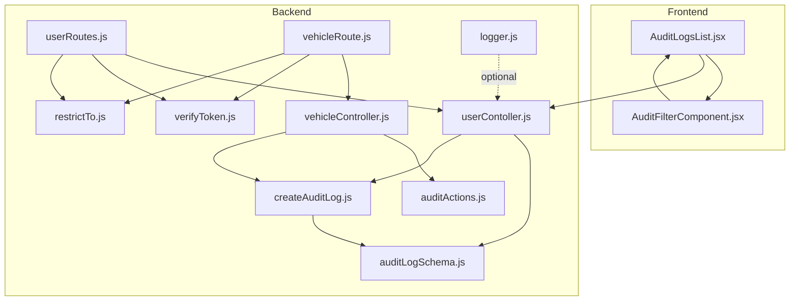

**Diagram sources**
- [AuditLogsList.jsx](file://frontend/src/pages/adminDashboard/reportComponent/AuditLogsList.jsx#L1-L331)
- [AuditFilterComponent.jsx](file://frontend/src/pages/adminDashboard/reportComponent/AuditFilterComponent.jsx#L1-L222)
- [auditActions.js](file://backend/config/auditActions.js#L1-L18)
- [auditLogSchema.js](file://backend/model/auditLogSchema.js#L1-L64)
- [createAuditLog.js](file://backend/utils/createAuditLog.js#L1-L31)
- [userContoller.js](file://backend/Controller/userContoller.js#L788-L832)
- [userRoutes.js](file://backend/router/userRoutes.js#L104-L116)
- [vehicleController.js](file://backend/Controller/vehicleController.js#L75-L175)
- [vehicleRoute.js](file://backend/router/vehicleRoute.js#L8-L37)
- [restrictTo.js](file://backend/utils/restrictTo.js#L1-L18)
- [verifyToken.js](file://backend/utils/verifyToken.js#L1-L33)
- [logger.js](file://backend/utils/logger.js#L1-L68)

**Section sources**
- [auditActions.js](file://backend/config/auditActions.js#L1-L18)
- [auditLogSchema.js](file://backend/model/auditLogSchema.js#L1-L64)
- [createAuditLog.js](file://backend/utils/createAuditLog.js#L1-L31)
- [userContoller.js](file://backend/Controller/userContoller.js#L788-L832)
- [userRoutes.js](file://backend/router/userRoutes.js#L104-L116)
- [vehicleController.js](file://backend/Controller/vehicleController.js#L75-L175)
- [vehicleRoute.js](file://backend/router/vehicleRoute.js#L8-L37)
- [AuditLogsList.jsx](file://frontend/src/pages/adminDashboard/reportComponent/AuditLogsList.jsx#L1-L331)
- [AuditFilterComponent.jsx](file://frontend/src/pages/adminDashboard/reportComponent/AuditFilterComponent.jsx#L1-L222)

## Core Components
- Audit action configuration: Centralized constants for actions such as adding, updating, deleting vehicles, and role changes.
- Audit log schema: Defines fields for action, entity type, entity identifier, actor identity, old/new values, IP address, user agent, and timestamps.
- Audit logging utility: Creates audit records with optional transaction support and captures request metadata.
- Audit endpoints: Fetch paginated audit logs and a single audit log by ID.
- Access control and authentication: Middleware to verify tokens and restrict endpoints to admins.
- Frontend audit dashboard: Renders audit trails, supports filtering, and pagination.

**Section sources**
- [auditActions.js](file://backend/config/auditActions.js#L1-L18)
- [auditLogSchema.js](file://backend/model/auditLogSchema.js#L1-L64)
- [createAuditLog.js](file://backend/utils/createAuditLog.js#L1-L31)
- [userContoller.js](file://backend/Controller/userContoller.js#L788-L832)
- [userRoutes.js](file://backend/router/userRoutes.js#L104-L116)
- [verifyToken.js](file://backend/utils/verifyToken.js#L1-L33)
- [restrictTo.js](file://backend/utils/restrictTo.js#L1-L18)
- [AuditLogsList.jsx](file://frontend/src/pages/adminDashboard/reportComponent/AuditLogsList.jsx#L1-L331)
- [AuditFilterComponent.jsx](file://frontend/src/pages/adminDashboard/reportComponent/AuditFilterComponent.jsx#L1-L222)

## Architecture Overview
The system follows a layered architecture:
- Presentation layer: React components render audit dashboards and filters.
- Application layer: Express routes and controllers orchestrate requests and responses.
- Domain layer: Audit logging and access control utilities encapsulate cross-cutting concerns.
- Persistence layer: Mongoose model stores audit logs with indexed fields for efficient querying.

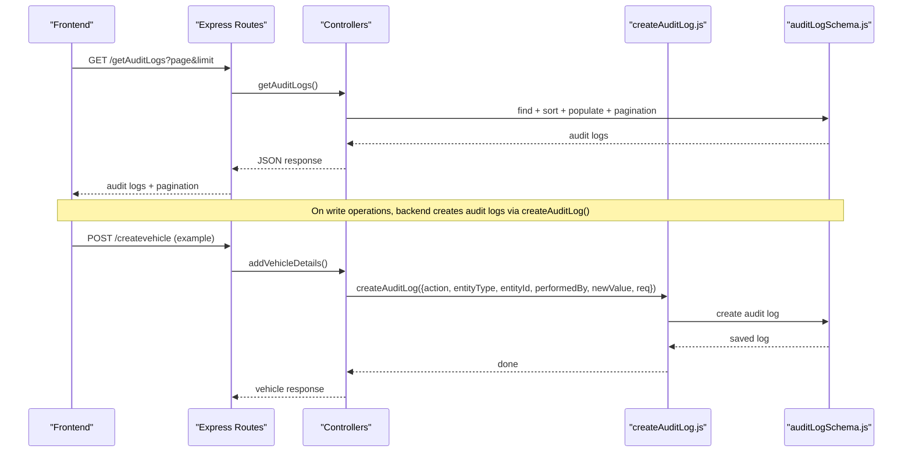

**Diagram sources**
- [AuditLogsList.jsx](file://frontend/src/pages/adminDashboard/reportComponent/AuditLogsList.jsx#L23-L53)
- [userRoutes.js](file://backend/router/userRoutes.js#L104-L116)
- [userContoller.js](file://backend/Controller/userContoller.js#L788-L832)
- [createAuditLog.js](file://backend/utils/createAuditLog.js#L3-L30)
- [auditLogSchema.js](file://backend/model/auditLogSchema.js#L1-L64)

## Detailed Component Analysis

### Audit Action Configuration
- Purpose: Define canonical audit actions for the system.
- Coverage: Vehicles (add/update/delete/update group), bookings (create/reschedule/cancel/complete), user/admin (login, role change).
- Usage: Controllers select appropriate action constants when invoking the audit logging utility.

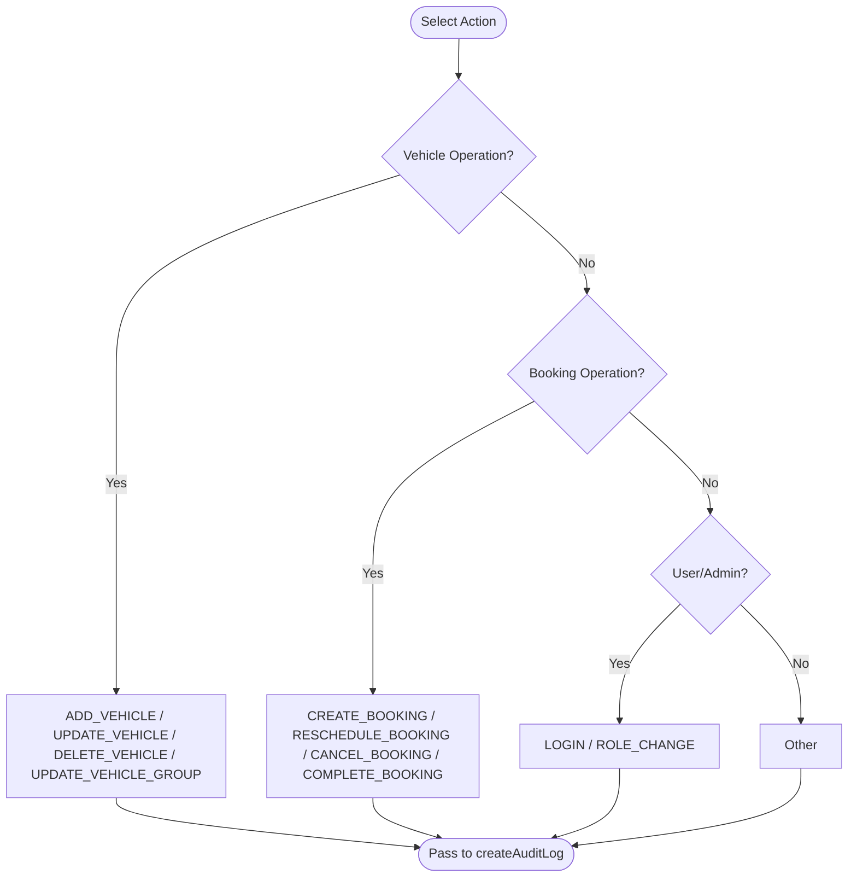

**Diagram sources**
- [auditActions.js](file://backend/config/auditActions.js#L1-L18)

**Section sources**
- [auditActions.js](file://backend/config/auditActions.js#L1-L18)

### Audit Log Schema
- Fields:
  - action: Canonical action constant.
  - entityType: Entity category (e.g., VEHICLE).
  - entityId: String identifier of the affected record.
  - performedBy: userId, userType, email.
  - oldValue/newValue: Objects capturing changes.
  - ipAddress/userAgent: Request metadata.
  - createdAt/updatedAt: Timestamps managed by Mongoose.
- Indexes: action, entityType, entityId for efficient querying.
- Populations: performedBy.userId can be populated to enrich actor details.

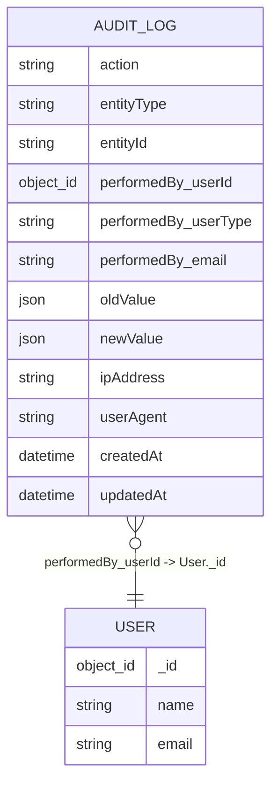

**Diagram sources**
- [auditLogSchema.js](file://backend/model/auditLogSchema.js#L3-L61)

**Section sources**
- [auditLogSchema.js](file://backend/model/auditLogSchema.js#L1-L64)

### Audit Logging Utility
- Functionality:
  - Accepts action, entityType, entityId, performedBy, oldValue, newValue, request metadata, and optional session.
  - Supports MongoDB transactions by passing a session to the model creation.
  - Captures client IP and user agent from the request.
- Integration: Controllers invoke this utility after completing domain operations.

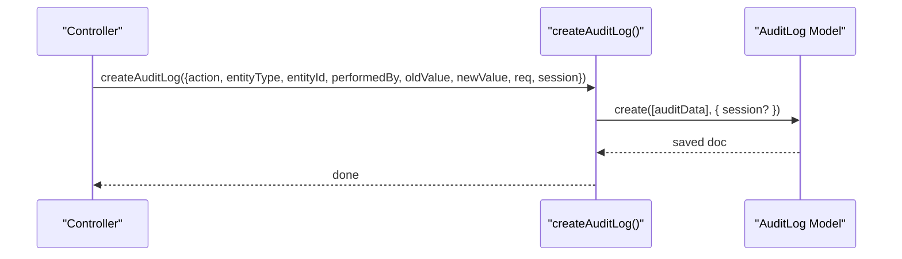

**Diagram sources**
- [createAuditLog.js](file://backend/utils/createAuditLog.js#L3-L30)
- [auditLogSchema.js](file://backend/model/auditLogSchema.js#L1-L64)

**Section sources**
- [createAuditLog.js](file://backend/utils/createAuditLog.js#L1-L31)

### Audit Trail Endpoint and Pagination
- Endpoint: GET /getAuditLogs?page&limit
- Behavior:
  - Paginates results by skipping documents and limiting per page.
  - Sorts by creation time descending.
  - Selects a subset of fields and populates actor details.
  - Returns pagination metadata (totalPages, totalRecords).
- Access control: Routes currently expose endpoints without enforced auth; controllers enforce admin-only access in other modules.

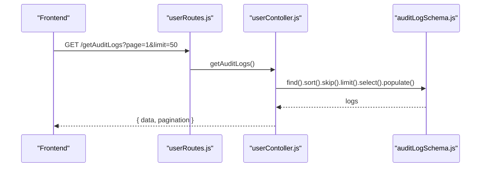

**Diagram sources**
- [userRoutes.js](file://backend/router/userRoutes.js#L104-L116)
- [userContoller.js](file://backend/Controller/userContoller.js#L788-L814)
- [auditLogSchema.js](file://backend/model/auditLogSchema.js#L1-L64)

**Section sources**
- [userContoller.js](file://backend/Controller/userContoller.js#L788-L814)
- [userRoutes.js](file://backend/router/userRoutes.js#L104-L116)

### Audit Detail Endpoint
- Endpoint: GET /auditlogsByID/:id
- Behavior:
  - Retrieves a single audit log by ID.
  - Populates actor details.
  - Returns 404 if not found.

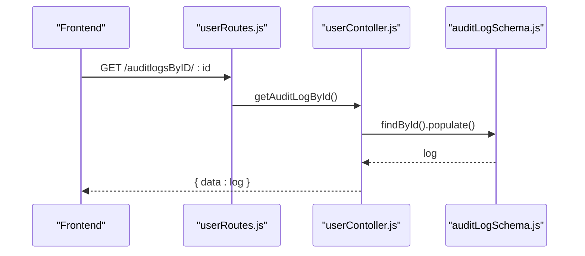

**Diagram sources**
- [userRoutes.js](file://backend/router/userRoutes.js#L111-L116)
- [userContoller.js](file://backend/Controller/userContoller.js#L817-L831)
- [auditLogSchema.js](file://backend/model/auditLogSchema.js#L1-L64)

**Section sources**
- [userContoller.js](file://backend/Controller/userContoller.js#L817-L831)
- [userRoutes.js](file://backend/router/userRoutes.js#L111-L116)

### Frontend Audit Dashboard and Filtering
- Features:
  - Pagination with configurable page size.
  - Modal to view detailed audit entries including old/new values.
  - Filtering by action, entity type, user email, user type, and date range.
- Data flow:
  - Fetches paginated logs from backend.
  - Applies client-side filters and updates display accordingly.

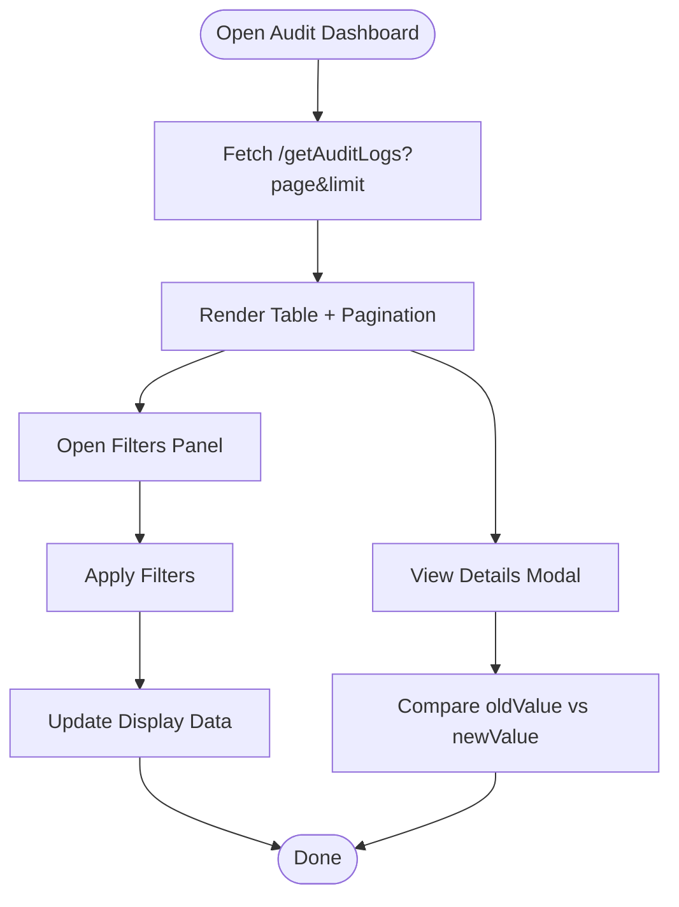

**Diagram sources**
- [AuditLogsList.jsx](file://frontend/src/pages/adminDashboard/reportComponent/AuditLogsList.jsx#L23-L53)
- [AuditFilterComponent.jsx](file://frontend/src/pages/adminDashboard/reportComponent/AuditFilterComponent.jsx#L59-L98)

**Section sources**
- [AuditLogsList.jsx](file://frontend/src/pages/adminDashboard/reportComponent/AuditLogsList.jsx#L1-L331)
- [AuditFilterComponent.jsx](file://frontend/src/pages/adminDashboard/reportComponent/AuditFilterComponent.jsx#L1-L222)

### Access Control and Authentication
- Token verification: Decodes refresh token from cookies and attaches user to request.
- Role restriction: Ensures only admin users can access protected endpoints.
- Current state: Audit endpoints are exposed without enforced auth in routes; controllers rely on separate admin-only modules.

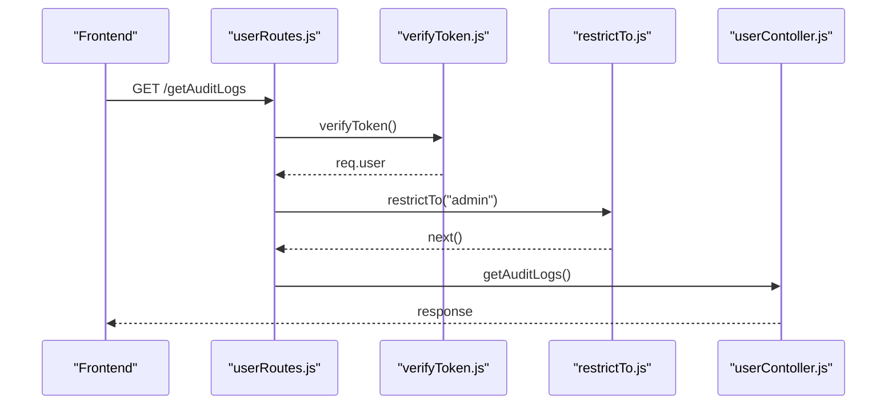

**Diagram sources**
- [userRoutes.js](file://backend/router/userRoutes.js#L104-L116)
- [verifyToken.js](file://backend/utils/verifyToken.js#L5-L29)
- [restrictTo.js](file://backend/utils/restrictTo.js#L3-L15)
- [userContoller.js](file://backend/Controller/userContoller.js#L788-L814)

**Section sources**
- [verifyToken.js](file://backend/utils/verifyToken.js#L1-L33)
- [restrictTo.js](file://backend/utils/restrictTo.js#L1-L18)
- [userRoutes.js](file://backend/router/userRoutes.js#L104-L116)

### Example Workflows

#### Audit Log Creation on Vehicle Add/Update
- Controller determines whether to append or create a vehicle.
- After successful persistence, invokes the audit logging utility with action, entity type, entity ID, actor details, and new values.

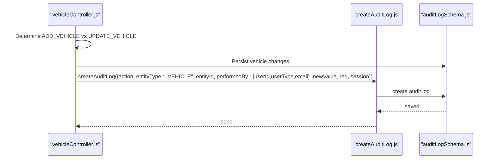

**Diagram sources**
- [vehicleController.js](file://backend/Controller/vehicleController.js#L75-L175)
- [createAuditLog.js](file://backend/utils/createAuditLog.js#L3-L30)
- [auditLogSchema.js](file://backend/model/auditLogSchema.js#L1-L64)

**Section sources**
- [vehicleController.js](file://backend/Controller/vehicleController.js#L75-L175)
- [createAuditLog.js](file://backend/utils/createAuditLog.js#L1-L31)

#### Compliance Monitoring Workflow
- Periodically fetch audit logs via GET /getAuditLogs?page&limit.
- Filter by date range and user type to identify anomalies.
- Export or archive logs for compliance retention.

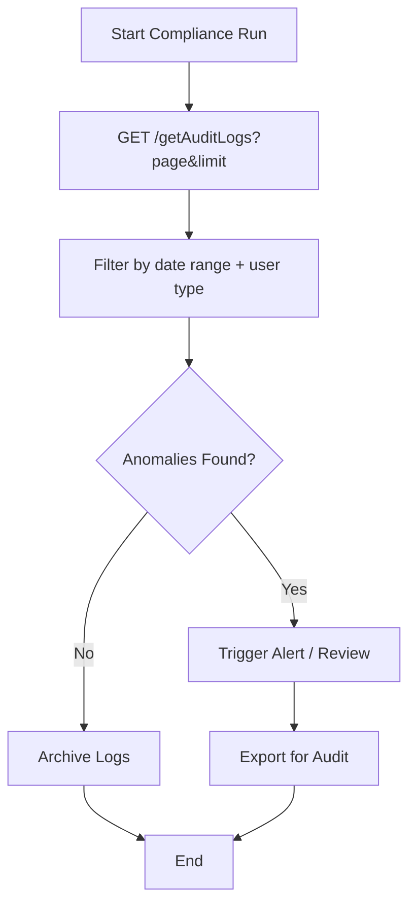

[No sources needed since this diagram shows conceptual workflow, not actual code structure]

### Admin Alert System
- Current implementation: No explicit alerting service exists in the repository.
- Recommended approach:
  - Integrate a message broker or notification service to emit alerts for critical actions or policy violations.
  - Trigger alerts based on audit log filters (e.g., repeated failed login attempts, bulk deletions).
  - Store alert events separately and link to audit logs for traceability.

[No sources needed since this section provides general guidance]

### Compliance Reporting Features
- Reporting endpoints (admin-only):
  - Booking data, vehicle lists, user lists, availability metrics, and booking matrices.
- Audit reporting:
  - Paginated retrieval of audit logs with filtering and population of actor details.
- Regulatory alignment:
  - Maintain immutable audit trails with timestamps and actor identities.
  - Enforce access controls and secure token handling.

**Section sources**
- [reportsController.js](file://backend/Controller/reportsController.js#L8-L131)
- [reportsRoutes.js](file://backend/router/reportsRoutes.js#L7-L48)
- [userContoller.js](file://backend/Controller/userContoller.js#L788-L831)

### Data Privacy and Access Controls
- Access control:
  - Use verifyToken and restrictTo middleware to protect sensitive endpoints.
- Data minimization:
  - Expose only necessary fields in audit listings; populate actor details selectively.
- Logging hygiene:
  - Avoid logging sensitive data; sanitize logs where applicable.

**Section sources**
- [verifyToken.js](file://backend/utils/verifyToken.js#L1-L33)
- [restrictTo.js](file://backend/utils/restrictTo.js#L1-L18)
- [userContoller.js](file://backend/Controller/userContoller.js#L788-L814)

### Integration with External Compliance Tools
- Export capability:
  - Extend audit listing endpoints to support CSV/JSON export for third-party systems.
- Audit trail preservation:
  - Archive older logs to external storage with immutable retention policies.
- Audit trail linking:
  - Maintain references between audit logs and related entities for traceability.

[No sources needed since this section provides general guidance]

### Audit Log Lifecycle Management and Legal Compliance
- Lifecycle stages:
  - Creation during write operations.
  - Retention per policy (e.g., minimum 7 years depending on jurisdiction).
  - Archival to immutable storage.
  - Deletion per legal requirements.
- Legal compliance:
  - Ensure audit logs are admissible, complete, and tamper-evident.
  - Enforce strict access controls and audit the access logs themselves.

[No sources needed since this section provides general guidance]

## Dependency Analysis
- Controllers depend on the audit log model and the audit logging utility.
- Routes depend on middleware for authentication and authorization.
- Frontend depends on backend endpoints for audit data and filtering UI.

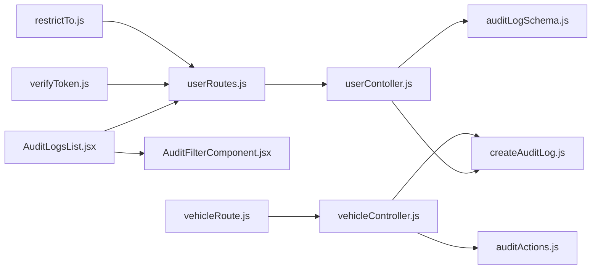

**Diagram sources**
- [AuditLogsList.jsx](file://frontend/src/pages/adminDashboard/reportComponent/AuditLogsList.jsx#L1-L331)
- [AuditFilterComponent.jsx](file://frontend/src/pages/adminDashboard/reportComponent/AuditFilterComponent.jsx#L1-L222)
- [userRoutes.js](file://backend/router/userRoutes.js#L104-L116)
- [userContoller.js](file://backend/Controller/userContoller.js#L788-L832)
- [auditLogSchema.js](file://backend/model/auditLogSchema.js#L1-L64)
- [createAuditLog.js](file://backend/utils/createAuditLog.js#L1-L31)
- [vehicleRoute.js](file://backend/router/vehicleRoute.js#L8-L37)
- [vehicleController.js](file://backend/Controller/vehicleController.js#L75-L175)
- [auditActions.js](file://backend/config/auditActions.js#L1-L18)
- [verifyToken.js](file://backend/utils/verifyToken.js#L1-L33)
- [restrictTo.js](file://backend/utils/restrictTo.js#L1-L18)

**Section sources**
- [userRoutes.js](file://backend/router/userRoutes.js#L104-L116)
- [vehicleRoute.js](file://backend/router/vehicleRoute.js#L8-L37)
- [userContoller.js](file://backend/Controller/userContoller.js#L788-L832)
- [vehicleController.js](file://backend/Controller/vehicleController.js#L75-L175)
- [auditLogSchema.js](file://backend/model/auditLogSchema.js#L1-L64)
- [createAuditLog.js](file://backend/utils/createAuditLog.js#L1-L31)
- [verifyToken.js](file://backend/utils/verifyToken.js#L1-L33)
- [restrictTo.js](file://backend/utils/restrictTo.js#L1-L18)

## Performance Considerations
- Indexes: action, entityType, and entityId are indexed to speed up filtering and lookup.
- Pagination: Use page and limit parameters to avoid large result sets.
- Population: Populate only necessary fields to reduce payload size.
- Transactions: Use sessions when creating audit logs inside larger transactions to maintain consistency.

[No sources needed since this section provides general guidance]

## Troubleshooting Guide
- Missing or empty audit logs:
  - Verify that controllers invoke the audit logging utility after successful operations.
  - Confirm that endpoints are reachable and that pagination parameters are valid.
- Authentication failures:
  - Ensure refresh tokens are present and valid; check token expiration and secret configuration.
- Authorization errors:
  - Confirm that the user type is admin and that restrictTo middleware is applied.

**Section sources**
- [userContoller.js](file://backend/Controller/userContoller.js#L788-L831)
- [verifyToken.js](file://backend/utils/verifyToken.js#L1-L33)
- [restrictTo.js](file://backend/utils/restrictTo.js#L1-L18)

## Conclusion
The system provides a solid foundation for audit and compliance with structured action definitions, a comprehensive audit log schema, and a functional audit dashboard with filtering and pagination. To meet advanced compliance needs, integrate robust access controls, implement alerting for critical events, and establish clear lifecycle and archival policies aligned with regulatory requirements.

## Appendices
- Audit action constants reference: [auditActions.js](file://backend/config/auditActions.js#L1-L18)
- Audit log schema reference: [auditLogSchema.js](file://backend/model/auditLogSchema.js#L1-L64)
- Audit logging utility reference: [createAuditLog.js](file://backend/utils/createAuditLog.js#L1-L31)
- Audit endpoints reference: [userRoutes.js](file://backend/router/userRoutes.js#L104-L116), [userContoller.js](file://backend/Controller/userContoller.js#L788-L831)
- Frontend dashboard references: [AuditLogsList.jsx](file://frontend/src/pages/adminDashboard/reportComponent/AuditLogsList.jsx#L1-L331), [AuditFilterComponent.jsx](file://frontend/src/pages/adminDashboard/reportComponent/AuditFilterComponent.jsx#L1-L222)
- Access control references: [verifyToken.js](file://backend/utils/verifyToken.js#L1-L33), [restrictTo.js](file://backend/utils/restrictTo.js#L1-L18)
- Logging utility reference: [logger.js](file://backend/utils/logger.js#L1-L68)