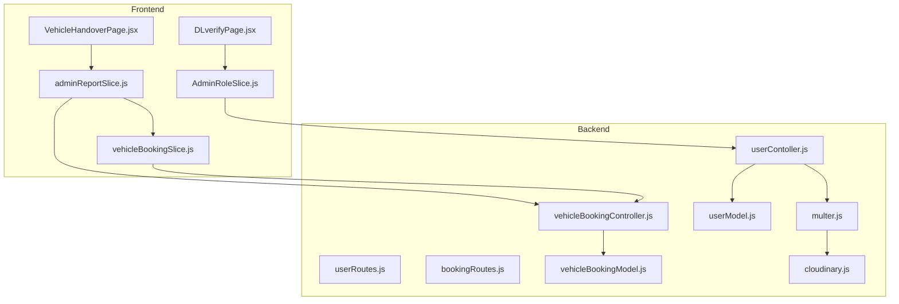
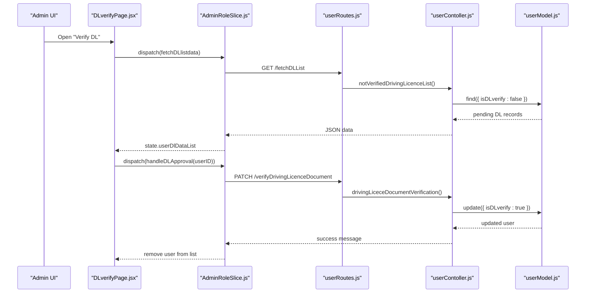
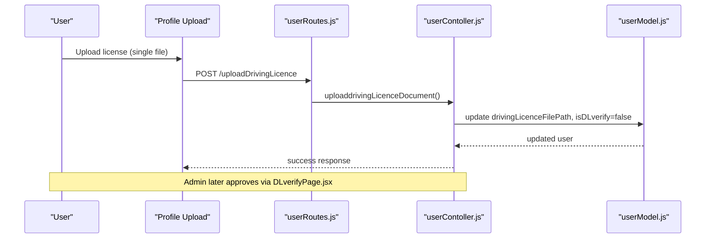
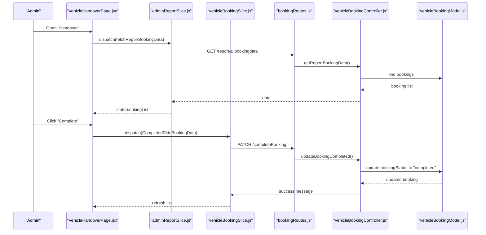
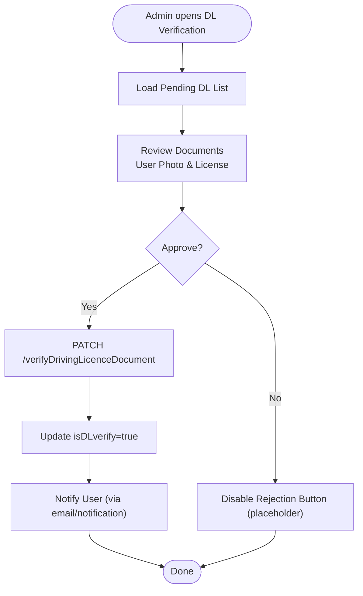
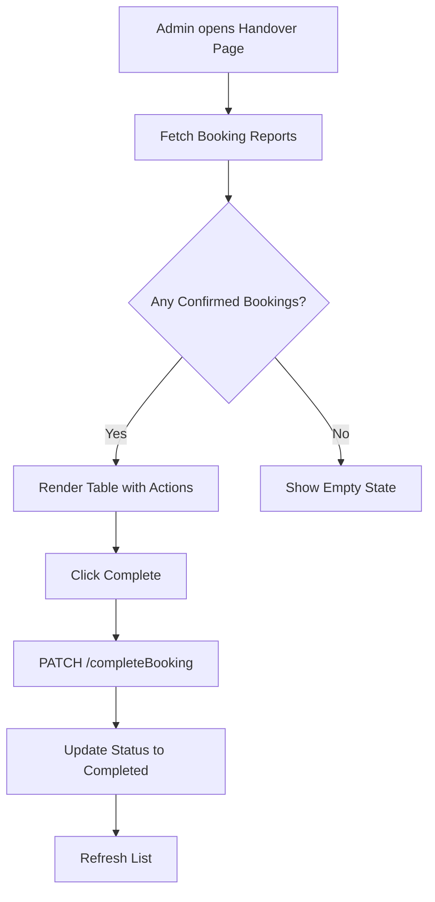
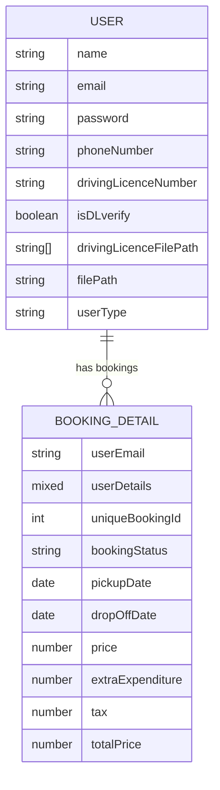
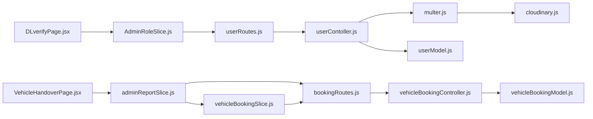

# Driver License Verification

<cite>
**Referenced Files in This Document**
- [DLverifyPage.jsx](file://frontend/src/pages/AdminPages/DLverifyPage.jsx)
- [VehicleHandoverPage.jsx](file://frontend/src/pages/AdminPages/VehicleHandoverPage.jsx)
- [AdminRoleSlice.js](file://frontend/src/appRedux/redux/adminSlice/AdminRoleSlice.js)
- [adminReportSlice.js](file://frontend/src/appRedux/redux/reportSlice/adminReportSlice.js)
- [vehicleBookingSlice.js](file://frontend/src/appRedux/redux/bookingSlice/vehicleBookingSlice.js)
- [userContoller.js](file://backend/Controller/userContoller.js)
- [vehicleBookingController.js](file://backend/Controller/vehicleBookingController.js)
- [userModel.js](file://backend/model/userModel.js)
- [vehicleBookingModel.js](file://backend/model/vehicleBookingModel.js)
- [userRoutes.js](file://backend/router/userRoutes.js)
- [bookingRoutes.js](file://backend/router/bookingRoutes.js)
- [multer.js](file://backend/utils/multer.js)
- [cloudinary.js](file://backend/config/cloudinary.js)
</cite>

## Table of Contents
1. [Introduction](#introduction)
2. [Project Structure](#project-structure)
3. [Core Components](#core-components)
4. [Architecture Overview](#architecture-overview)
5. [Detailed Component Analysis](#detailed-component-analysis)
6. [Dependency Analysis](#dependency-analysis)
7. [Performance Considerations](#performance-considerations)
8. [Troubleshooting Guide](#troubleshooting-guide)
9. [Conclusion](#conclusion)

## Introduction
This document describes the driver license verification and vehicle handover system. It covers:
- Driver license verification workflow: document upload by users, identity validation, and admin approval.
- Vehicle handover procedures: confirming completed bookings and preparing vehicles for return.
- Admin interface capabilities: reviewing documents, updating statuses, and managing handovers.
- Integrations: user profiles, booking systems, and notifications.
- Security and compliance considerations for sensitive document handling.
- Examples and troubleshooting guidance for verification failures and handover issues.

## Project Structure
The system spans a frontend (React + Redux Toolkit) and a backend (Node.js + Express) with MongoDB and Cloudinary for file storage. Routes and controllers implement the verification and handover flows, while Redux slices manage UI state and asynchronous actions.

**Diagram sources**
- [DLverifyPage.jsx](file://frontend/src/pages/AdminPages/DLverifyPage.jsx#L1-L182)
- [VehicleHandoverPage.jsx](file://frontend/src/pages/AdminPages/VehicleHandoverPage.jsx#L1-L143)
- [AdminRoleSlice.js](file://frontend/src/appRedux/redux/adminSlice/AdminRoleSlice.js#L1-L106)
- [adminReportSlice.js](file://frontend/src/appRedux/redux/reportSlice/adminReportSlice.js#L1-L233)
- [vehicleBookingSlice.js](file://frontend/src/appRedux/redux/bookingSlice/vehicleBookingSlice.js#L1-L203)
- [userRoutes.js](file://backend/router/userRoutes.js#L1-L119)
- [bookingRoutes.js](file://backend/router/bookingRoutes.js#L1-L31)
- [userContoller.js](file://backend/Controller/userContoller.js#L1-L832)
- [vehicleBookingController.js](file://backend/Controller/vehicleBookingController.js#L1-L861)
- [userModel.js](file://backend/model/userModel.js#L1-L162)
- [vehicleBookingModel.js](file://backend/model/vehicleBookingModel.js#L1-L105)
- [multer.js](file://backend/utils/multer.js#L1-L52)
- [cloudinary.js](file://backend/config/cloudinary.js#L1-L12)

**Section sources**
- [DLverifyPage.jsx](file://frontend/src/pages/AdminPages/DLverifyPage.jsx#L1-L182)
- [VehicleHandoverPage.jsx](file://frontend/src/pages/AdminPages/VehicleHandoverPage.jsx#L1-L143)
- [userRoutes.js](file://backend/router/userRoutes.js#L1-L119)
- [bookingRoutes.js](file://backend/router/bookingRoutes.js#L1-L31)

## Core Components
- Driver License Verification Page (Admin): Lists pending verifications, previews documents, and approves licenses.
- Vehicle Handover Page (Admin): Lists confirmed bookings and marks them as completed.
- Redux Slices:
  - AdminRoleSlice: manages fetching pending DL lists and handling approvals.
  - adminReportSlice: fetches booking data for reporting and handover.
  - vehicleBookingSlice: handles booking lifecycle actions (create, cancel, complete).
- Backend Controllers and Models:
  - userContoller: handles user profile, document upload, and admin verification.
  - vehicleBookingController: handles booking creation, cancellation, rescheduling, and completion.
  - userModel and vehicleBookingModel: define schema and indexes for users and bookings.
- File Upload Utilities:
  - multer with Cloudinary integration for secure, scalable storage.

**Section sources**
- [AdminRoleSlice.js](file://frontend/src/appRedux/redux/adminSlice/AdminRoleSlice.js#L1-L106)
- [adminReportSlice.js](file://frontend/src/appRedux/redux/reportSlice/adminReportSlice.js#L1-L233)
- [vehicleBookingSlice.js](file://frontend/src/appRedux/redux/bookingSlice/vehicleBookingSlice.js#L1-L203)
- [userContoller.js](file://backend/Controller/userContoller.js#L332-L492)
- [vehicleBookingController.js](file://backend/Controller/vehicleBookingController.js#L235-L800)
- [userModel.js](file://backend/model/userModel.js#L1-L162)
- [vehicleBookingModel.js](file://backend/model/vehicleBookingModel.js#L1-L105)
- [multer.js](file://backend/utils/multer.js#L1-L52)
- [cloudinary.js](file://backend/config/cloudinary.js#L1-L12)

## Architecture Overview
The system follows a layered architecture:
- Frontend: React components with Redux for state management and API interactions.
- Backend: Express routes delegate to controllers; controllers interact with models and external services.
- Persistence: MongoDB stores user and booking data; Cloudinary stores uploaded images/PDFs.
- Notifications: Message broker utilities trigger emails and in-app notifications.

**Diagram sources**
- [DLverifyPage.jsx](file://frontend/src/pages/AdminPages/DLverifyPage.jsx#L25-L55)
- [AdminRoleSlice.js](file://frontend/src/appRedux/redux/adminSlice/AdminRoleSlice.js#L4-L39)
- [userRoutes.js](file://backend/router/userRoutes.js#L89-L102)
- [userContoller.js](file://backend/Controller/userContoller.js#L436-L461)
- [userModel.js](file://backend/model/userModel.js#L52-L58)

**Section sources**
- [userRoutes.js](file://backend/router/userRoutes.js#L89-L102)
- [userContoller.js](file://backend/Controller/userContoller.js#L436-L461)
- [userModel.js](file://backend/model/userModel.js#L52-L58)

## Detailed Component Analysis

### Driver License Verification Workflow
- User uploads license photo/PDF via profile upload endpoint.
- Admin reviews pending verifications and approves; system sets verification flag.
- Preview modal supports image and PDF rendering.

**Diagram sources**
- [userRoutes.js](file://backend/router/userRoutes.js#L76-L87)
- [userContoller.js](file://backend/Controller/userContoller.js#L332-L377)
- [userModel.js](file://backend/model/userModel.js#L56-L58)

**Section sources**
- [DLverifyPage.jsx](file://frontend/src/pages/AdminPages/DLverifyPage.jsx#L30-L55)
- [AdminRoleSlice.js](file://frontend/src/appRedux/redux/adminSlice/AdminRoleSlice.js#L20-L39)
- [userRoutes.js](file://backend/router/userRoutes.js#L89-L102)
- [userContoller.js](file://backend/Controller/userContoller.js#L436-L461)
- [userModel.js](file://backend/model/userModel.js#L52-L58)

### Vehicle Handover Procedures
- Admin views confirmed bookings and completes them.
- On completion, the system updates booking status and triggers notifications.

**Diagram sources**
- [VehicleHandoverPage.jsx](file://frontend/src/pages/AdminPages/VehicleHandoverPage.jsx#L23-L53)
- [adminReportSlice.js](file://frontend/src/appRedux/redux/reportSlice/adminReportSlice.js#L11-L25)
- [vehicleBookingSlice.js](file://frontend/src/appRedux/redux/bookingSlice/vehicleBookingSlice.js#L62-L78)
- [bookingRoutes.js](file://backend/router/bookingRoutes.js#L23-L28)
- [vehicleBookingController.js](file://backend/Controller/vehicleBookingController.js#L760-L800)
- [vehicleBookingModel.js](file://backend/model/vehicleBookingModel.js#L32-L36)

**Section sources**
- [VehicleHandoverPage.jsx](file://frontend/src/pages/AdminPages/VehicleHandoverPage.jsx#L28-L53)
- [vehicleBookingSlice.js](file://frontend/src/appRedux/redux/bookingSlice/vehicleBookingSlice.js#L62-L78)
- [bookingRoutes.js](file://backend/router/bookingRoutes.js#L23-L28)
- [vehicleBookingController.js](file://backend/Controller/vehicleBookingController.js#L760-L800)

### Admin Interface for License Verification
- Fetch pending DL list and approve selections.
- Preview user photo and license file.
- Rejection workflow placeholder present in UI.

**Diagram sources**
- [DLverifyPage.jsx](file://frontend/src/pages/AdminPages/DLverifyPage.jsx#L10-L55)
- [AdminRoleSlice.js](file://frontend/src/appRedux/redux/adminSlice/AdminRoleSlice.js#L20-L39)
- [userRoutes.js](file://backend/router/userRoutes.js#L96-L102)
- [userContoller.js](file://backend/Controller/userContoller.js#L436-L461)

**Section sources**
- [DLverifyPage.jsx](file://frontend/src/pages/AdminPages/DLverifyPage.jsx#L10-L131)
- [AdminRoleSlice.js](file://frontend/src/appRedux/redux/adminSlice/AdminRoleSlice.js#L20-L39)

### Handover Page Functionality
- Filters confirmed bookings and allows completion.
- Displays booking metadata and status badges.
- Uses Redux to manage loading and error states.

**Diagram sources**
- [VehicleHandoverPage.jsx](file://frontend/src/pages/AdminPages/VehicleHandoverPage.jsx#L10-L72)
- [adminReportSlice.js](file://frontend/src/appRedux/redux/reportSlice/adminReportSlice.js#L11-L25)
- [vehicleBookingSlice.js](file://frontend/src/appRedux/redux/bookingSlice/vehicleBookingSlice.js#L62-L78)
- [bookingRoutes.js](file://backend/router/bookingRoutes.js#L23-L28)

**Section sources**
- [VehicleHandoverPage.jsx](file://frontend/src/pages/AdminPages/VehicleHandoverPage.jsx#L55-L139)
- [adminReportSlice.js](file://frontend/src/appRedux/redux/reportSlice/adminReportSlice.js#L11-L25)
- [vehicleBookingSlice.js](file://frontend/src/appRedux/redux/bookingSlice/vehicleBookingSlice.js#L62-L78)

### Data Models and Indexes
- User model tracks license number, verification flag, and file paths.
- Booking model enforces unique booking IDs and maintains vehicle details and statuses.

**Diagram sources**
- [userModel.js](file://backend/model/userModel.js#L6-L130)
- [vehicleBookingModel.js](file://backend/model/vehicleBookingModel.js#L9-L72)

**Section sources**
- [userModel.js](file://backend/model/userModel.js#L47-L88)
- [vehicleBookingModel.js](file://backend/model/vehicleBookingModel.js#L32-L52)

## Dependency Analysis
- Frontend depends on:
  - Redux slices for async actions and state.
  - Axios interceptors for authenticated requests.
- Backend depends on:
  - Multer + Cloudinary for file uploads.
  - MongoDB models for persistence.
  - Controllers for orchestration and transactions.

**Diagram sources**
- [DLverifyPage.jsx](file://frontend/src/pages/AdminPages/DLverifyPage.jsx#L1-L182)
- [VehicleHandoverPage.jsx](file://frontend/src/pages/AdminPages/VehicleHandoverPage.jsx#L1-L143)
- [AdminRoleSlice.js](file://frontend/src/appRedux/redux/adminSlice/AdminRoleSlice.js#L1-L106)
- [adminReportSlice.js](file://frontend/src/appRedux/redux/reportSlice/adminReportSlice.js#L1-L233)
- [vehicleBookingSlice.js](file://frontend/src/appRedux/redux/bookingSlice/vehicleBookingSlice.js#L1-L203)
- [userRoutes.js](file://backend/router/userRoutes.js#L1-L119)
- [bookingRoutes.js](file://backend/router/bookingRoutes.js#L1-L31)
- [userContoller.js](file://backend/Controller/userContoller.js#L1-L832)
- [vehicleBookingController.js](file://backend/Controller/vehicleBookingController.js#L1-L861)
- [userModel.js](file://backend/model/userModel.js#L1-L162)
- [vehicleBookingModel.js](file://backend/model/vehicleBookingModel.js#L1-L105)
- [multer.js](file://backend/utils/multer.js#L1-L52)
- [cloudinary.js](file://backend/config/cloudinary.js#L1-L12)

**Section sources**
- [userRoutes.js](file://backend/router/userRoutes.js#L1-L119)
- [bookingRoutes.js](file://backend/router/bookingRoutes.js#L1-L31)
- [multer.js](file://backend/utils/multer.js#L1-L52)
- [cloudinary.js](file://backend/config/cloudinary.js#L1-L12)

## Performance Considerations
- File upload limits and allowed formats are configured to balance quality and size.
- Unique booking ID generation uses a counter to avoid collisions.
- Transactions are used for booking creation and updates to maintain consistency.
- Pagination and indexing on audit logs reduce load on admin queries.

[No sources needed since this section provides general guidance]

## Troubleshooting Guide
Common issues and resolutions:
- Upload fails or rejected:
  - Verify file type and size constraints.
  - Check Cloudinary configuration and credentials.
- Approval not reflected:
  - Confirm admin role restrictions and token validity.
  - Ensure the user’s verification flag is updated.
- Handover not completing:
  - Validate booking status is “confirmed”.
  - Confirm unique booking ID matches and transaction succeeds.
- Notifications not received:
  - Check message broker connectivity and routing keys.
  - Verify email queue and templates.

**Section sources**
- [multer.js](file://backend/utils/multer.js#L22-L44)
- [cloudinary.js](file://backend/config/cloudinary.js#L4-L9)
- [userRoutes.js](file://backend/router/userRoutes.js#L96-L102)
- [bookingRoutes.js](file://backend/router/bookingRoutes.js#L23-L28)
- [userContoller.js](file://backend/Controller/userContoller.js#L436-L461)
- [vehicleBookingController.js](file://backend/Controller/vehicleBookingController.js#L760-L800)

## Conclusion
The system provides a secure, auditable pipeline for driver license verification and vehicle handover. Users can upload documents, admins can review and approve, and the booking system integrates seamlessly with handover actions. Robust file handling, transactions, and notifications underpin reliability and compliance readiness.