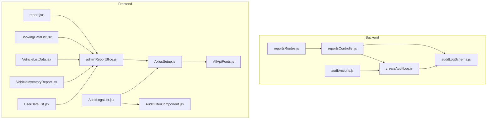
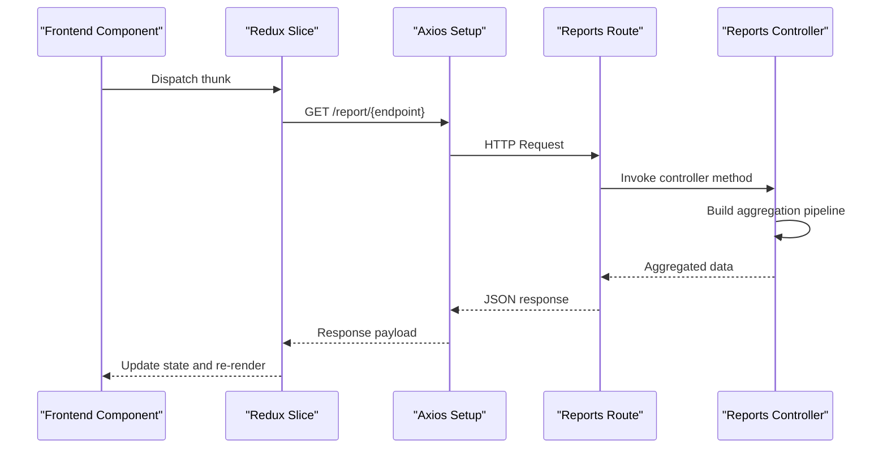
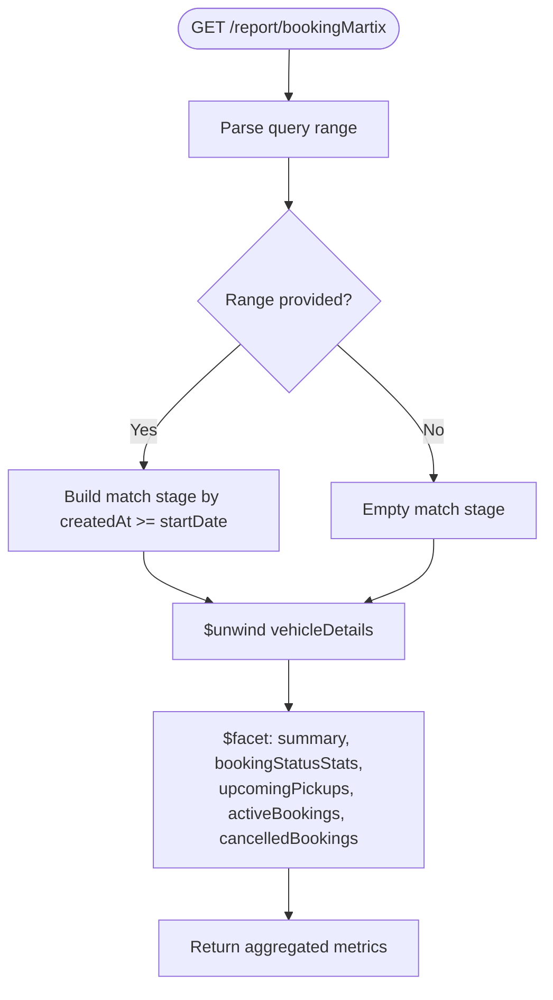
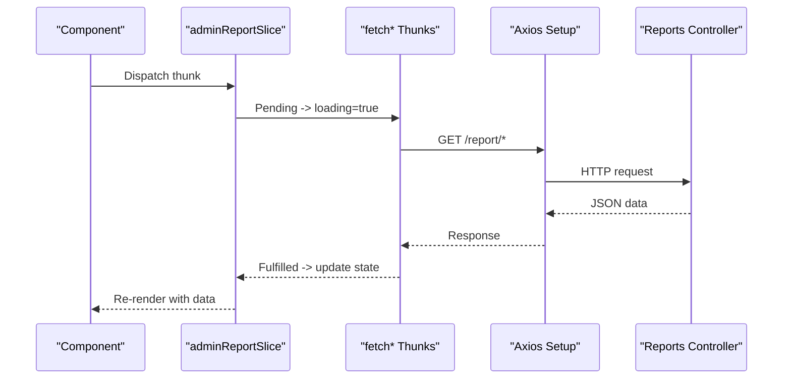
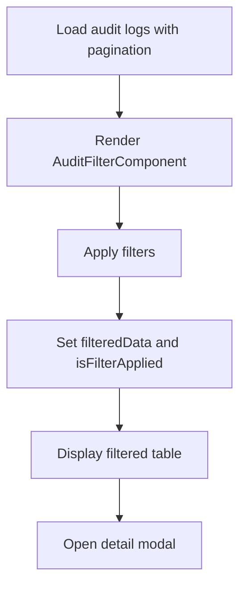
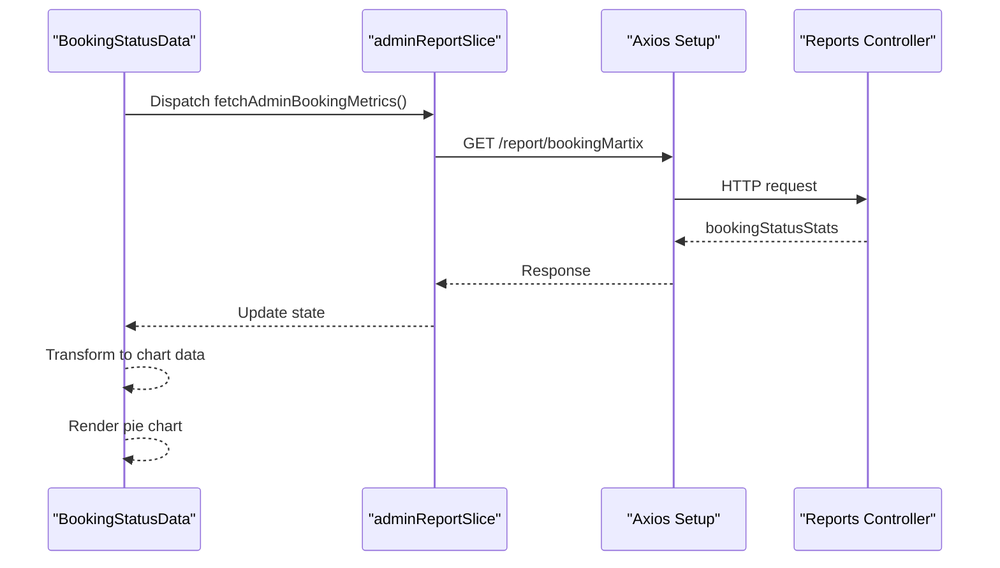
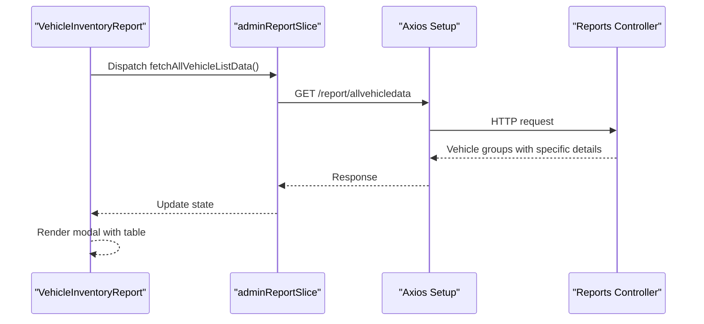
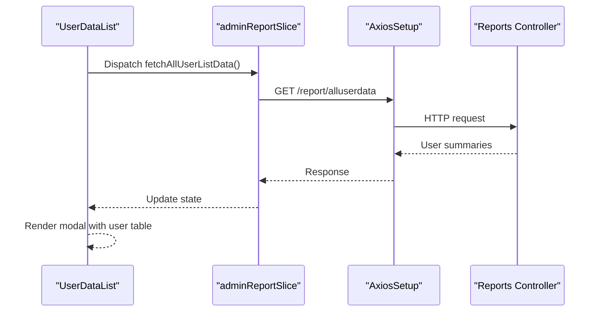
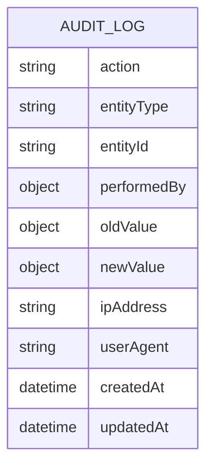
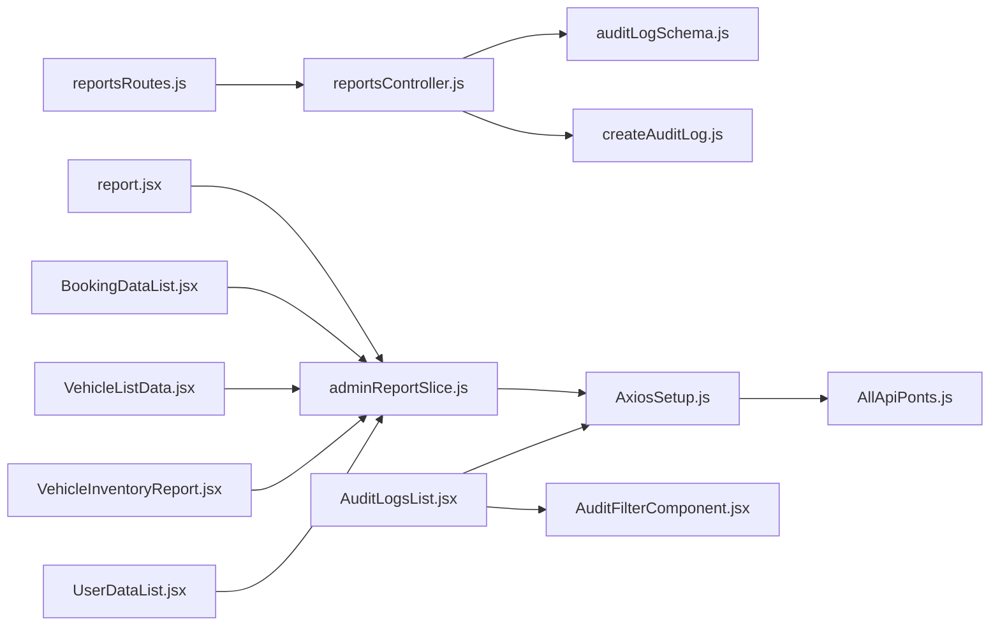

# Reporting System

<cite>
**Referenced Files in This Document**
- [reportsController.js](file://backend/Controller/reportsController.js)
- [reportsRoutes.js](file://backend/router/reportsRoutes.js)
- [adminReportSlice.js](file://frontend/src/appRedux/redux/reportSlice/adminReportSlice.js)
- [report.jsx](file://frontend/src/pages/reports/report.jsx)
- [AuditFilterComponent.jsx](file://frontend/src/pages/adminDashboard/reportComponent/AuditFilterComponent.jsx)
- [AuditLogsList.jsx](file://frontend/src/pages/adminDashboard/reportComponent/AuditLogsList.jsx)
- [BookingDataList.jsx](file://frontend/src/pages/adminDashboard/reportComponent/BookingDataList.jsx)
- [VehicleListData.jsx](file://frontend/src/pages/adminDashboard/reportComponent/VehicleListData.jsx)
- [VehicleInventoryReport.jsx](file://frontend/src/pages/adminDashboard/reportComponent/VehicleInventoryReport.jsx)
- [UserDataList.jsx](file://frontend/src/pages/adminDashboard/reportComponent/UserDataList.jsx)
- [auditLogSchema.js](file://backend/model/auditLogSchema.js)
- [auditActions.js](file://backend/config/auditActions.js)
- [createAuditLog.js](file://backend/utils/createAuditLog.js)
- [AxiosSetup.js](file://frontend/src/axiosInterceptors/AxiosSetup.js)
- [AllApiPonts.js](file://frontend/src/APIPoints/AllApiPonts.js)
- [cornJob.js](file://backend/cornJob/cornJob.js)
</cite>

## Table of Contents
1. [Introduction](#introduction)
2. [Project Structure](#project-structure)
3. [Core Components](#core-components)
4. [Architecture Overview](#architecture-overview)
5. [Detailed Component Analysis](#detailed-component-analysis)
6. [Dependency Analysis](#dependency-analysis)
7. [Performance Considerations](#performance-considerations)
8. [Troubleshooting Guide](#troubleshooting-guide)
9. [Conclusion](#conclusion)
10. [Appendices](#appendices)

## Introduction
This document describes the comprehensive reporting system for the vehicle rental platform. It covers the backend reporting controller with data aggregation endpoints, filtering mechanisms, and export capabilities. On the frontend, it documents reporting components including audit filters, booking status reports, vehicle inventory reports, and user activity dashboards. It also explains report generation workflows, export formats (PDF, CSV), scheduling capabilities, filtering systems (date ranges, status filters, category-based searches), report templates and customization, automated report delivery, performance considerations for large datasets, and caching strategies.

## Project Structure
The reporting system spans backend and frontend modules:
- Backend: Express routes and controllers expose reporting endpoints, backed by MongoDB aggregations and audit logging.
- Frontend: Redux slices orchestrate data fetching, while React components render dashboards, filters, and lists.

**Diagram sources**
- [reportsController.js](file://backend/Controller/reportsController.js#L1-L641)
- [reportsRoutes.js](file://backend/router/reportsRoutes.js#L1-L51)
- [auditLogSchema.js](file://backend/model/auditLogSchema.js#L1-L64)
- [createAuditLog.js](file://backend/utils/createAuditLog.js#L1-L31)
- [auditActions.js](file://backend/config/auditActions.js#L1-L18)
- [adminReportSlice.js](file://frontend/src/appRedux/redux/reportSlice/adminReportSlice.js#L1-L233)
- [AxiosSetup.js](file://frontend/src/axiosInterceptors/AxiosSetup.js#L1-L214)
- [AllApiPonts.js](file://frontend/src/APIPoints/AllApiPonts.js#L1-L3)
- [report.jsx](file://frontend/src/pages/reports/report.jsx#L1-L293)
- [AuditLogsList.jsx](file://frontend/src/pages/adminDashboard/reportComponent/AuditLogsList.jsx#L1-L331)
- [AuditFilterComponent.jsx](file://frontend/src/pages/adminDashboard/reportComponent/AuditFilterComponent.jsx#L1-L222)
- [BookingDataList.jsx](file://frontend/src/pages/adminDashboard/reportComponent/BookingDataList.jsx#L1-L148)
- [VehicleListData.jsx](file://frontend/src/pages/adminDashboard/reportComponent/VehicleListData.jsx#L1-L204)
- [VehicleInventoryReport.jsx](file://frontend/src/pages/adminDashboard/reportComponent/VehicleInventoryReport.jsx#L1-L146)
- [UserDataList.jsx](file://frontend/src/pages/adminDashboard/reportComponent/UserDataList.jsx#L1-L104)

**Section sources**
- [reportsController.js](file://backend/Controller/reportsController.js#L1-L641)
- [reportsRoutes.js](file://backend/router/reportsRoutes.js#L1-L51)
- [adminReportSlice.js](file://frontend/src/appRedux/redux/reportSlice/adminReportSlice.js#L1-L233)
- [report.jsx](file://frontend/src/pages/reports/report.jsx#L1-L293)
- [AuditFilterComponent.jsx](file://frontend/src/pages/adminDashboard/reportComponent/AuditFilterComponent.jsx#L1-L222)
- [AuditLogsList.jsx](file://frontend/src/pages/adminDashboard/reportComponent/AuditLogsList.jsx#L1-L331)
- [BookingDataList.jsx](file://frontend/src/pages/adminDashboard/reportComponent/BookingDataList.jsx#L1-L148)
- [VehicleListData.jsx](file://frontend/src/pages/adminDashboard/reportComponent/VehicleListData.jsx#L1-L204)
- [VehicleInventoryReport.jsx](file://frontend/src/pages/adminDashboard/reportComponent/VehicleInventoryReport.jsx#L1-L146)
- [UserDataList.jsx](file://frontend/src/pages/adminDashboard/reportComponent/UserDataList.jsx#L1-L104)
- [auditLogSchema.js](file://backend/model/auditLogSchema.js#L1-L64)
- [auditActions.js](file://backend/config/auditActions.js#L1-L18)
- [createAuditLog.js](file://backend/utils/createAuditLog.js#L1-L31)
- [AxiosSetup.js](file://frontend/src/axiosInterceptors/AxiosSetup.js#L1-L214)
- [AllApiPonts.js](file://frontend/src/APIPoints/AllApiPonts.js#L1-L3)

## Core Components
- Backend reporting controller: Exposes endpoints for booking data, vehicle lists, user data, availability analytics, and booking metrics with date-range filtering.
- Frontend reporting Redux slice: Defines async thunks and reducers to fetch and manage reporting data.
- Frontend reporting components: Dashboards, filters, and data tables for audit logs, bookings, vehicle inventory, and user details.
- Audit logging: Schema and utilities to capture actions, entities, and user context for compliance and traceability.

Key backend endpoints:
- GET /report/allbookingdata
- GET /report/allvehicledata
- GET /report/alluserdata
- GET /report/allAvailableVehicle
- GET /report/allNotAvailableVehicle
- GET /report/getVehicleType
- GET /report/bookingMartix

Frontend Redux thunks:
- fetchReportBookingData
- fetchAllVehicleListData
- fetchAllUserListData
- fetchAvailableVehicleData
- fetchNotAvailableVehicleData
- fetchVehicleTypeCount
- fetchAdminBookingMetrics

**Section sources**
- [reportsController.js](file://backend/Controller/reportsController.js#L8-L641)
- [reportsRoutes.js](file://backend/router/reportsRoutes.js#L7-L48)
- [adminReportSlice.js](file://frontend/src/appRedux/redux/reportSlice/adminReportSlice.js#L12-L129)

## Architecture Overview
The reporting architecture follows a clear separation of concerns:
- Controllers perform MongoDB aggregations and return structured JSON responses.
- Routes enforce authentication and role-based access (admin).
- Frontend Redux slices encapsulate data fetching and state updates.
- Components render dashboards, filters, and tables with Recharts for visualizations.

**Diagram sources**
- [reportsRoutes.js](file://backend/router/reportsRoutes.js#L7-L48)
- [reportsController.js](file://backend/Controller/reportsController.js#L8-L641)
- [adminReportSlice.js](file://frontend/src/appRedux/redux/reportSlice/adminReportSlice.js#L12-L129)
- [AxiosSetup.js](file://frontend/src/axiosInterceptors/AxiosSetup.js#L110-L214)

## Detailed Component Analysis

### Backend Reporting Controller
The controller implements robust aggregation pipelines for:
- Booking data with optional status filtering.
- Vehicle inventory with nested arrays unwound and projected.
- User summaries with booking metrics.
- Availability analytics (available/not available) using facet for counts.
- Booking metrics with date-range filtering and status breakdown.

**Diagram sources**
- [reportsController.js](file://backend/Controller/reportsController.js#L533-L640)

**Section sources**
- [reportsController.js](file://backend/Controller/reportsController.js#L8-L641)

### Frontend Reporting Redux Slice
The slice defines async thunks for each endpoint and manages loading/error states. It normalizes responses into domain-specific slices (bookingList, vehicleList, userList, availableVehicles, notAvailableVehicles, vehicleTypeCount, bookingMetrics).

**Diagram sources**
- [adminReportSlice.js](file://frontend/src/appRedux/redux/reportSlice/adminReportSlice.js#L12-L129)
- [AxiosSetup.js](file://frontend/src/axiosInterceptors/AxiosSetup.js#L110-L214)
- [reportsRoutes.js](file://backend/router/reportsRoutes.js#L7-L48)

**Section sources**
- [adminReportSlice.js](file://frontend/src/appRedux/redux/reportSlice/adminReportSlice.js#L1-L233)

### Audit Logs Dashboard and Filters
The audit logs dashboard integrates pagination, advanced filters, and a modal for detailed views. Filtering supports action, entity, user, userType, and date ranges.

**Diagram sources**
- [AuditLogsList.jsx](file://frontend/src/pages/adminDashboard/reportComponent/AuditLogsList.jsx#L22-L104)
- [AuditFilterComponent.jsx](file://frontend/src/pages/adminDashboard/reportComponent/AuditFilterComponent.jsx#L22-L121)

**Section sources**
- [AuditLogsList.jsx](file://frontend/src/pages/adminDashboard/reportComponent/AuditLogsList.jsx#L1-L331)
- [AuditFilterComponent.jsx](file://frontend/src/pages/adminDashboard/reportComponent/AuditFilterComponent.jsx#L1-L222)

### Booking Status Reports
The booking status component fetches metrics and renders a pie chart. It transforms backend status stats into labeled segments with colors.

**Diagram sources**
- [BookingStatusData.jsx](file://frontend/src/pages/adminDashboard/reportComponent/BookingStatusData.jsx#L20-L77)
- [adminReportSlice.js](file://frontend/src/appRedux/redux/reportSlice/adminReportSlice.js#L115-L129)
- [reportsController.js](file://backend/Controller/reportsController.js#L533-L640)

**Section sources**
- [BookingStatusData.jsx](file://frontend/src/pages/adminDashboard/reportComponent/BookingStatusData.jsx#L1-L77)

### Vehicle Inventory Reports
The vehicle inventory component fetches grouped vehicle data and displays counts and details. It includes a modal with tabular data and status indicators.

**Diagram sources**
- [VehicleInventoryReport.jsx](file://frontend/src/pages/adminDashboard/reportComponent/VehicleInventoryReport.jsx#L8-L146)
- [adminReportSlice.js](file://frontend/src/appRedux/redux/reportSlice/adminReportSlice.js#L27-L42)
- [reportsController.js](file://backend/Controller/reportsController.js#L56-L96)

**Section sources**
- [VehicleInventoryReport.jsx](file://frontend/src/pages/adminDashboard/reportComponent/VehicleInventoryReport.jsx#L1-L146)

### User Activity Dashboards
The user list component fetches user summaries and displays counts and details in a modal table.

**Diagram sources**
- [UserDataList.jsx](file://frontend/src/pages/adminDashboard/reportComponent/UserDataList.jsx#L8-L104)
- [adminReportSlice.js](file://frontend/src/appRedux/redux/reportSlice/adminReportSlice.js#L44-L59)
- [reportsController.js](file://backend/Controller/reportsController.js#L98-L131)

**Section sources**
- [UserDataList.jsx](file://frontend/src/pages/adminDashboard/reportComponent/UserDataList.jsx#L1-L104)

### Audit Logging Schema and Utilities
The audit log schema captures action, entity, performedBy, old/new values, IP, and user agent. Utilities create audit entries with optional transaction support.

**Diagram sources**
- [auditLogSchema.js](file://backend/model/auditLogSchema.js#L3-L63)

**Section sources**
- [auditLogSchema.js](file://backend/model/auditLogSchema.js#L1-L64)
- [auditActions.js](file://backend/config/auditActions.js#L1-L18)
- [createAuditLog.js](file://backend/utils/createAuditLog.js#L3-L31)

## Dependency Analysis
- Routes depend on the reports controller and middleware for authentication and authorization.
- Controllers depend on models and utilities for audit logging.
- Frontend Redux slices depend on Axios for HTTP communication and environment variables for base URLs.
- Components depend on Redux slices and Recharts for visualization.

**Diagram sources**
- [reportsRoutes.js](file://backend/router/reportsRoutes.js#L1-L51)
- [reportsController.js](file://backend/Controller/reportsController.js#L1-L641)
- [auditLogSchema.js](file://backend/model/auditLogSchema.js#L1-L64)
- [createAuditLog.js](file://backend/utils/createAuditLog.js#L1-L31)
- [adminReportSlice.js](file://frontend/src/appRedux/redux/reportSlice/adminReportSlice.js#L1-L233)
- [AxiosSetup.js](file://frontend/src/axiosInterceptors/AxiosSetup.js#L1-L214)
- [AllApiPonts.js](file://frontend/src/APIPoints/AllApiPonts.js#L1-L3)
- [report.jsx](file://frontend/src/pages/reports/report.jsx#L1-L293)
- [AuditLogsList.jsx](file://frontend/src/pages/adminDashboard/reportComponent/AuditLogsList.jsx#L1-L331)
- [AuditFilterComponent.jsx](file://frontend/src/pages/adminDashboard/reportComponent/AuditFilterComponent.jsx#L1-L222)
- [BookingDataList.jsx](file://frontend/src/pages/adminDashboard/reportComponent/BookingDataList.jsx#L1-L148)
- [VehicleListData.jsx](file://frontend/src/pages/adminDashboard/reportComponent/VehicleListData.jsx#L1-L204)
- [VehicleInventoryReport.jsx](file://frontend/src/pages/adminDashboard/reportComponent/VehicleInventoryReport.jsx#L1-L146)
- [UserDataList.jsx](file://frontend/src/pages/adminDashboard/reportComponent/UserDataList.jsx#L1-L104)

**Section sources**
- [reportsRoutes.js](file://backend/router/reportsRoutes.js#L1-L51)
- [reportsController.js](file://backend/Controller/reportsController.js#L1-L641)
- [adminReportSlice.js](file://frontend/src/appRedux/redux/reportSlice/adminReportSlice.js#L1-L233)
- [AxiosSetup.js](file://frontend/src/axiosInterceptors/AxiosSetup.js#L1-L214)
- [AllApiPonts.js](file://frontend/src/APIPoints/AllApiPonts.js#L1-L3)

## Performance Considerations
- Aggregation pipelines: Use $unwind early, filter with $match before projections, and leverage $facet for counts to minimize downstream processing.
- Pagination: Implement server-side pagination for audit logs and large lists to avoid oversized payloads.
- Caching: Cache frequently accessed reports (e.g., booking metrics) with TTL; invalidate on data changes.
- Indexes: Ensure indexes on audit log fields (action, entityType, performedBy.userType, timestamps) to speed up filtering.
- Lazy loading: Load modals and detailed views on demand to reduce initial payload sizes.
- Compression: Enable gzip/brotli on the API gateway/proxy to reduce bandwidth for large datasets.

[No sources needed since this section provides general guidance]

## Troubleshooting Guide
Common issues and resolutions:
- Authentication failures: Ensure withCredentials is enabled and Authorization header is set via interceptors.
- Empty or missing data: Verify Redux state initialization and confirm thunks are dispatched on component mount.
- Filter not applied: Confirm filter handlers update state and that memoized filtered data is used for rendering.
- Audit logs pagination: Check page number updates and total pages calculation from the response.

**Section sources**
- [AxiosSetup.js](file://frontend/src/axiosInterceptors/AxiosSetup.js#L126-L211)
- [adminReportSlice.js](file://frontend/src/appRedux/redux/reportSlice/adminReportSlice.js#L160-L229)
- [AuditFilterComponent.jsx](file://frontend/src/pages/adminDashboard/reportComponent/AuditFilterComponent.jsx#L102-L121)
- [AuditLogsList.jsx](file://frontend/src/pages/adminDashboard/reportComponent/AuditLogsList.jsx#L22-L40)

## Conclusion
The reporting system combines efficient backend aggregations with a responsive frontend to deliver actionable insights. It supports comprehensive filtering, rich visualizations, and scalable data retrieval. Extending export capabilities (PDF/CSV) and implementing automated scheduling would further enhance operational efficiency.

[No sources needed since this section summarizes without analyzing specific files]

## Appendices

### Report Generation Workflows
- Booking metrics: Date range selection drives aggregation filters; facets compute totals and status breakdowns.
- Vehicle availability: Separate endpoints for available and not-available fleets; modal displays grouped details.
- User summaries: Flat projection of user booking metrics for quick dashboards.

**Section sources**
- [reportsController.js](file://backend/Controller/reportsController.js#L533-L640)
- [VehicleListData.jsx](file://frontend/src/pages/adminDashboard/reportComponent/VehicleListData.jsx#L144-L204)
- [UserDataList.jsx](file://frontend/src/pages/adminDashboard/reportComponent/UserDataList.jsx#L8-L104)

### Export Capabilities
Current implementation focuses on dashboard rendering and data fetching. To add exports:
- Backend: Add endpoints to stream CSV/PDF using libraries like fast-csv or pdfmake; include filters and date ranges.
- Frontend: Integrate download buttons and trigger export endpoints with current filters.

[No sources needed since this section proposes future enhancements]

### Scheduling Capabilities
- Cron jobs: Implement scheduled report generation and delivery using cron-based tasks.
- Audit: Use audit actions to track who generated and delivered reports.

**Section sources**
- [auditActions.js](file://backend/config/auditActions.js#L1-L18)
- [cornJob.js](file://backend/cornJob/cornJob.js#L1-L122)

### Filtering System
- Date ranges: Today, week, month, year, all supported in booking metrics.
- Status filters: Booking status filtering in booking data aggregation.
- Category-based searches: Audit filters by action, entity, user, userType, and date windows.

**Section sources**
- [reportsController.js](file://backend/Controller/reportsController.js#L501-L531)
- [AuditFilterComponent.jsx](file://frontend/src/pages/adminDashboard/reportComponent/AuditFilterComponent.jsx#L59-L98)
- [BookingDataList.jsx](file://frontend/src/pages/adminDashboard/reportComponent/BookingDataList.jsx#L46-L55)

### Report Templates and Customization
- Templates: Use Recharts components for consistent visuals; customize colors and legends per report type.
- Customization: Allow users to select date ranges and toggle views (tables vs charts).

**Section sources**
- [report.jsx](file://frontend/src/pages/reports/report.jsx#L1-L293)
- [BookingStatusData.jsx](file://frontend/src/pages/adminDashboard/reportComponent/BookingStatusData.jsx#L12-L18)

### Integration with External Reporting Tools
- Audit trail: Export audit logs for third-party compliance tools via CSV/PDF endpoints.
- Metrics: Expose booking metrics and fleet status to BI dashboards via REST endpoints.

[No sources needed since this section provides general guidance]