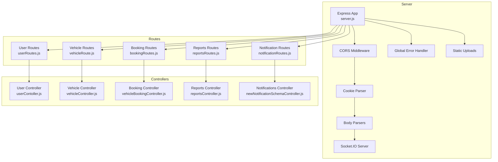
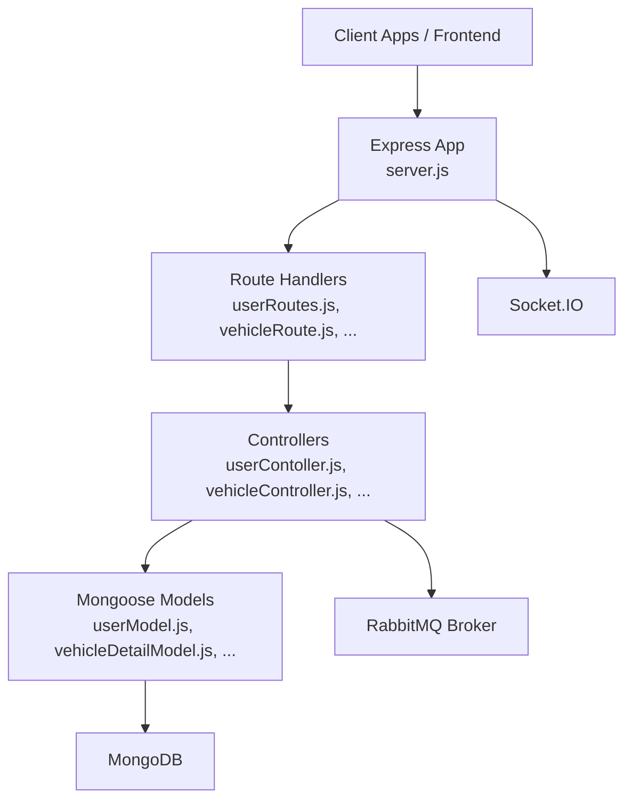
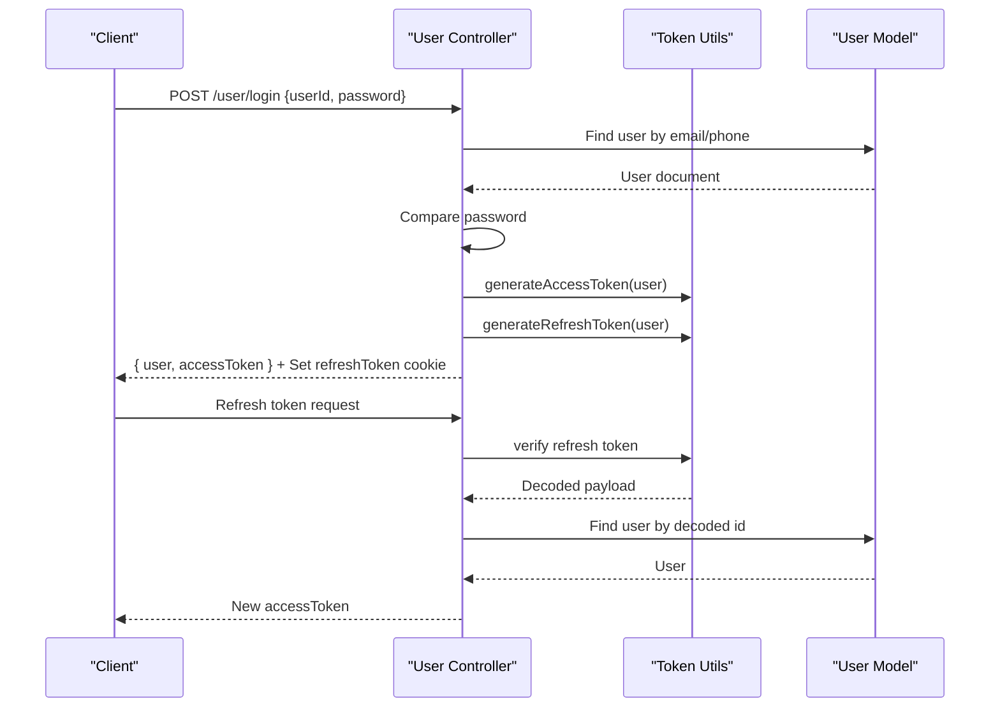
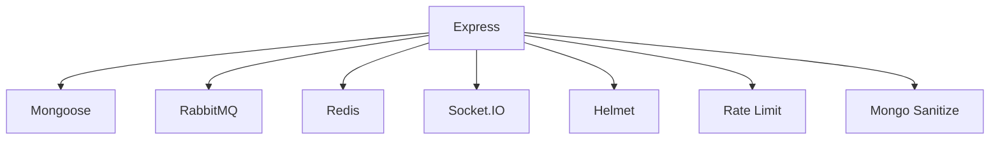

# Backend API Documentation

<cite>
**Referenced Files in This Document**
- [server.js](file://backend/server.js)
- [package.json](file://backend/package.json)
- [userRoutes.js](file://backend/router/userRoutes.js)
- [vehicleRoute.js](file://backend/router/vehicleRoute.js)
- [bookingRoutes.js](file://backend/router/bookingRoutes.js)
- [reportsRoutes.js](file://backend/router/reportsRoutes.js)
- [notificationRoutes.js](file://backend/router/notificationRoutes.js)
- [userContoller.js](file://backend/Controller/userContoller.js)
- [vehicleController.js](file://backend/Controller/vehicleController.js)
- [vehicleBookingController.js](file://backend/Controller/vehicleBookingController.js)
- [reportsController.js](file://backend/Controller/reportsController.js)
- [newNotificationSchemaController.js](file://backend/Controller/newNotificationSchemaController.js)
- [generateToken.js](file://backend/utils/generateToken.js)
- [verifyToken.js](file://backend/utils/verifyToken.js)
- [restrictTo.js](file://backend/utils/restrictTo.js)
- [userModel.js](file://backend/model/userModel.js)
- [vehicleDetailModel.js](file://backend/model/vehicleDetailModel.js)
</cite>

## Table of Contents
1. [Introduction](#introduction)
2. [Project Structure](#project-structure)
3. [Core Components](#core-components)
4. [Architecture Overview](#architecture-overview)
5. [Detailed Component Analysis](#detailed-component-analysis)
6. [Dependency Analysis](#dependency-analysis)
7. [Performance Considerations](#performance-considerations)
8. [Troubleshooting Guide](#troubleshooting-guide)
9. [Conclusion](#conclusion)

## Introduction
This document provides comprehensive API documentation for the Vehicle Management System backend REST API. It covers all HTTP endpoints organized by functional areas: user management (authentication, profile), vehicle management (CRUD operations), booking system (reservation handling), reporting (administrative analytics), and notifications (real-time alerts). For each endpoint, you will find HTTP methods, URL patterns, request/response schemas, authentication requirements, and error responses. It also documents JWT-based authentication flow, role-based access control implementation, and security measures, along with usage examples, integration patterns, and troubleshooting guidance.

## Project Structure
The backend is an Express.js application with modular routing and controller-based handlers. Middleware includes CORS, cookie parsing, JSON body parsing, and a global error handler. Socket.IO is configured for real-time capabilities. Routes are mounted under distinct namespaces for user, vehicle, booking, reports, and notifications.

**Diagram sources**
- [server.js](file://backend/server.js#L34-L76)
- [userRoutes.js](file://backend/router/userRoutes.js#L1-L119)
- [vehicleRoute.js](file://backend/router/vehicleRoute.js#L1-L42)
- [bookingRoutes.js](file://backend/router/bookingRoutes.js#L1-L31)
- [reportsRoutes.js](file://backend/router/reportsRoutes.js#L1-L51)
- [notificationRoutes.js](file://backend/router/notificationRoutes.js#L1-L14)

**Section sources**
- [server.js](file://backend/server.js#L34-L76)
- [package.json](file://backend/package.json#L1-L37)

## Core Components
- Authentication and Authorization
  - JWT access tokens (short-lived) and refresh tokens (longer-lived) are used for authentication.
  - Access tokens are validated via a refresh token middleware that verifies the refresh token cookie and decodes the payload to attach user info to the request.
  - Role-based access control restricts endpoints to admin users using a role-checking middleware.
- Controllers
  - Each functional area has dedicated controllers implementing business logic, validation, transactions, and notifications.
- Models
  - Mongoose models define schemas for users, vehicles, bookings, and notifications.
- Utilities
  - Token generation helpers, rate limiting, multer for uploads, and audit logging utilities.

**Section sources**
- [generateToken.js](file://backend/utils/generateToken.js#L1-L28)
- [verifyToken.js](file://backend/utils/verifyToken.js#L1-L33)
- [restrictTo.js](file://backend/utils/restrictTo.js#L1-L18)
- [userModel.js](file://backend/model/userModel.js#L1-L162)
- [vehicleDetailModel.js](file://backend/model/vehicleDetailModel.js#L1-L145)

## Architecture Overview
The API follows a layered architecture:
- Entry points: Express routes
- Business logic: Controllers
- Persistence: MongoDB via Mongoose
- Messaging: RabbitMQ integration for emails and notifications
- Real-time: Socket.IO for live updates

**Diagram sources**
- [server.js](file://backend/server.js#L34-L76)
- [userRoutes.js](file://backend/router/userRoutes.js#L1-L119)
- [vehicleRoute.js](file://backend/router/vehicleRoute.js#L1-L42)
- [bookingRoutes.js](file://backend/router/bookingRoutes.js#L1-L31)
- [reportsRoutes.js](file://backend/router/reportsRoutes.js#L1-L51)
- [notificationRoutes.js](file://backend/router/notificationRoutes.js#L1-L14)
- [userContoller.js](file://backend/Controller/userContoller.js#L1-L832)
- [vehicleController.js](file://backend/Controller/vehicleController.js#L1-L824)
- [vehicleBookingController.js](file://backend/Controller/vehicleBookingController.js#L1-L861)
- [reportsController.js](file://backend/Controller/reportsController.js#L1-L641)
- [newNotificationSchemaController.js](file://backend/Controller/newNotificationSchemaController.js#L1-L112)
- [userModel.js](file://backend/model/userModel.js#L1-L162)
- [vehicleDetailModel.js](file://backend/model/vehicleDetailModel.js#L1-L145)

## Detailed Component Analysis

### User Management API
Functional area covering authentication, profile management, password operations, OTP, and administrative actions.

- Base Path: `/api`
- Mounted Routes:
  - `/user/createuser` (POST)
  - `/user/login` (POST)
  - `/user/download/:id` (POST)
  - `/user/changepassword` (PATCH)
  - `/user/addaltmob` (PATCH)
  - `/user/logout` (POST)
  - `/user/protectedroute` (POST)
  - `/user/checkAuth` (POST)
  - `/user/ContactUs` (POST)
  - `/user/myprofile` (GET)
  - `/user/updateuserdetails` (PATCH)
  - `/user/forgotPasswordemail` (POST)
  - `/user/resetpassword` (POST)
  - `/user/sendnotification` (POST)
  - `/user/getalladmin` (GET)
  - `/user/sendOtp` (POST)
  - `/user/verifyOtp` (POST)
  - `/user/refresh-token` (POST)
  - `/user/uploadProfilePhoto` (POST)
  - `/user/uploadDrivingLicence` (POST)
  - `/user/downloadDrivingLicence` (GET)
  - `/user/fetchDLList` (GET)
  - `/user/verifyDrivingLicenceDocument` (PATCH)
  - `/user/getAuditLogs` (GET)
  - `/user/auditlogsByID/:id` (GET)

Authentication and Authorization
- Access tokens are validated using refresh tokens stored in an HTTP-only, secure cookie.
- Protected routes use a middleware that verifies the refresh token and attaches user info to the request.
- Administrative endpoints are protected by a role-based middleware restricting access to admin users.

Endpoints

- POST /user/createuser
  - Description: Register a new user.
  - Authentication: No authentication required.
  - Request Body: name*, email*, password*, confirmPassword*, phoneNumber*, drivingLicenceNumber?, userType?
  - Responses:
    - 201 Created: User created successfully.
    - 400 Bad Request: Validation errors or mismatched passwords.
    - 409 Conflict: User already exists.
  - Notes: Requires file upload for profile photo.

- POST /user/login
  - Description: Authenticate user and issue access/refresh tokens.
  - Authentication: No authentication required.
  - Request Body: userId* (email or phone), password*
  - Responses:
    - 200 OK: { user: { id, name, email, phoneNumber, userType }, accessToken }
    - 400 Bad Request: Invalid credentials.
  - Security: Refresh token stored as HTTP-only, secure cookie.

- POST /user/refresh-token
  - Description: Refresh access token using refresh token from cookie.
  - Authentication: Requires refresh token cookie.
  - Responses:
    - 200 OK: { success: true, accessToken }
    - 401 Unauthorized: No refresh token provided.
    - 403 Forbidden: Invalid or expired refresh token.

- PATCH /user/changepassword
  - Description: Change user password.
  - Authentication: Requires valid refresh token.
  - Request Body: oldPassword*, newPassword*, confirmNewPassword*
  - Responses:
    - 200 OK: Password updated successfully.
    - 400 Bad Request: Validation or mismatch errors.
    - 401 Unauthorized: Old password incorrect.

- PATCH /user/addaltmob
  - Description: Add alternate mobile number.
  - Authentication: Requires valid refresh token.
  - Request Body: altMobileNumber*
  - Responses:
    - 200 OK: Alternate mobile number added.
    - 400 Bad Request: Validation errors.
    - 404 Not Found: User not found.

- POST /user/logout
  - Description: Logout user and clear refresh token cookie.
  - Authentication: Requires valid refresh token.
  - Responses:
    - 200 OK: Logged out successfully.
    - 401 Unauthorized: Not authenticated.

- GET /user/myprofile
  - Description: Retrieve current user profile.
  - Authentication: Requires valid refresh token.
  - Responses:
    - 200 OK: { message: "Success", user: {...fields...} }
    - 400 Bad Request: Invalid login.

- PATCH /user/updateuserdetails
  - Description: Update profile details (name, driving license number, alternate mobile, current location).
  - Authentication: Requires valid refresh token.
  - Request Body: name?, drivingLicenceNumber?, altMobileNumber?, currentLocation?
  - Responses:
    - 200 OK: Updated user details.
    - 400 Bad Request: Validation errors.
    - 404 Not Found: User not found.

- POST /user/forgotPasswordemail
  - Description: Send password reset link to email.
  - Authentication: No authentication required.
  - Request Body: email*
  - Responses:
    - 200 OK: Reset link sent.
    - 400 Bad Request: Missing email.
    - 404 Not Found: User not found.

- POST /user/resetpassword
  - Description: Reset password using token and email.
  - Authentication: No authentication required.
  - Request Body: token*, email*, password*, confirmPassword*
  - Responses:
    - 200 OK: Password reset successfully.
    - 400 Bad Request: Invalid/expired token or mismatched passwords.

- POST /user/sendOtp
  - Description: Send OTP to email for verification.
  - Authentication: No authentication required.
  - Request Body: email*
  - Responses:
    - 200 OK: OTP sent.
    - 400 Bad Request: Missing email.
    - 404 Not Found: User not found.

- POST /user/verifyOtp
  - Description: Verify OTP and log in the user.
  - Authentication: No authentication required.
  - Request Body: email*, otp*
  - Responses:
    - 200 OK: OTP verified and user logged in.
    - 400 Bad Request: Invalid/expired OTP.
    - 404 Not Found: User not found.

- POST /user/uploadProfilePhoto
  - Description: Upload profile photo.
  - Authentication: Requires valid refresh token.
  - Request Body: File upload (single image).
  - Responses:
    - 200 OK: Profile photo uploaded.
    - 400 Bad Request: Missing file or validation errors.
    - 401 Unauthorized: Not authorized.

- POST /user/uploadDrivingLicence
  - Description: Upload driving license document.
  - Authentication: Requires valid refresh token.
  - Request Body: File upload (document).
  - Responses:
    - 200 OK: Driving license uploaded.
    - 400 Bad Request: Missing file or validation errors.
    - 404 Not Found: User not found.

- GET /user/downloadDrivingLicence
  - Description: Download driving license document.
  - Authentication: Requires valid refresh token.
  - Responses:
    - 200 OK: { fileUrl }
    - 404 Not Found: Document not found.

- GET /user/fetchDLList
  - Description: Fetch list of users with unverified driving licenses (admin).
  - Authentication: Requires valid refresh token + admin role.
  - Responses:
    - 200 OK: List of users with unverified DL.
    - 404 Not Found: No data found.

- PATCH /user/verifyDrivingLicenceDocument
  - Description: Verify a user’s driving license (admin).
  - Authentication: Requires valid refresh token + admin role.
  - Request Body: userID*
  - Responses:
    - 200 OK: Driving license verified.
    - 404 Not Found: User not found.

- GET /user/getAuditLogs
  - Description: Fetch audit logs (admin).
  - Authentication: Optional (no explicit auth enforced in route).
  - Query Params: page, limit
  - Responses:
    - 200 OK: Paginated audit logs.

- GET /user/auditlogsByID/:id
  - Description: Fetch audit log by ID (admin).
  - Authentication: Optional (no explicit auth enforced in route).
  - Responses:
    - 200 OK: Audit log details.

- POST /user/sendnotification
  - Description: Send notification to all admin users (admin).
  - Authentication: Requires valid refresh token + admin role.
  - Request Body: message*
  - Responses:
    - 200 OK: Notifications sent to all admins.

- GET /user/getalladmin
  - Description: Get all admin users.
  - Authentication: Requires valid refresh token.
  - Responses:
    - 200 OK: Admin users list.

- POST /user/download/:id
  - Description: Download user file by ID.
  - Authentication: Requires valid refresh token.
  - Responses:
    - 200 OK: File download.
    - 404 Not Found: User not found.

Security Measures
- Password hashing via bcrypt.
- Email validation and phone number validation.
- Rate limiting applied to user creation endpoint.
- Refresh token stored in HTTP-only, secure cookie.
- Role-based access control for admin-only endpoints.

**Section sources**
- [userRoutes.js](file://backend/router/userRoutes.js#L1-L119)
- [userContoller.js](file://backend/Controller/userContoller.js#L24-L832)
- [generateToken.js](file://backend/utils/generateToken.js#L1-L28)
- [verifyToken.js](file://backend/utils/verifyToken.js#L1-L33)
- [restrictTo.js](file://backend/utils/restrictTo.js#L1-L18)
- [userModel.js](file://backend/model/userModel.js#L1-L162)

### Vehicle Management API
Functional area covering CRUD operations for vehicles and vehicle groups.

- Base Path: `/api`
- Mounted Routes:
  - `/vehicle/createvehicle` (POST)
  - `/vehicle/updatevehicle/:uniqueId` (PATCH)
  - `/vehicle/deletevehicle/:uniqueId` (DELETE)
  - `/vehicle/getallvehicle` (GET)
  - `/vehicle/getvehiclebyname` (GET)
  - `/vehicle/getvehicledatabymodel` (GET)
  - `/vehicle/getvehiclebytype` (GET)
  - `/vehicle/updatevehiclegroup/:groupId` (PATCH)
  - `/vehicle/verify` (POST)

Endpoints

- POST /vehicle/createvehicle
  - Description: Add or append vehicle details (admin).
  - Authentication: Requires valid refresh token + admin role.
  - Request Body: name*, description?, vehicleType*, model*, vehicleNumber*, location?, vehicleStatus?, vehicleMilage?, notAvailableReason?, bookingPrice* (array of { range, price }), Files (images)
  - Responses:
    - 201 Created: Vehicle added/updated.
    - 400 Bad Request: Validation errors or duplicate vehicle number.
    - 401 Unauthorized: Not logged in.
    - 403 Forbidden: Admin access required.
  - Notes: Uses MongoDB transactions and audit logging.

- PATCH /vehicle/updatevehicle/:uniqueId
  - Description: Update specific vehicle details (admin).
  - Authentication: Requires valid refresh token + admin role.
  - Path Params: uniqueId*
  - Request Body: location?, vehicleStatus?, vehicleNumber?, vehicleMilage?, notAvailableReason?
  - Responses:
    - 200 OK: Vehicle updated with changed fields.
    - 400 Bad Request: Validation errors.
    - 404 Not Found: Vehicle not found.

- DELETE /vehicle/deletevehicle/:uniqueId
  - Description: Delete specific vehicle; if group becomes empty, delete group (admin).
  - Authentication: Requires valid refresh token + admin role.
  - Path Params: uniqueId*
  - Responses:
    - 200 OK: Vehicle deleted; if group empty, group deleted.
    - 404 Not Found: Vehicle not found.

- GET /vehicle/getallvehicle
  - Description: Get all vehicle data with Redis caching.
  - Authentication: No authentication required.
  - Responses:
    - 200 OK: Vehicles list (source indicates cache/db).
    - 404 Not Found: No vehicles found.

- GET /vehicle/getvehiclebyname
  - Description: Search vehicle by name.
  - Authentication: No authentication required.
  - Request Body: name*
  - Responses:
    - 200 OK: Vehicle data.
    - 400 Bad Request: Missing name.
    - 404 Not Found: No vehicle found.

- GET /vehicle/getvehicledatabymodel
  - Description: Search vehicles by model.
  - Authentication: No authentication required.
  - Request Body: model*
  - Responses:
    - 200 OK: Vehicle data.
    - 400 Bad Request: Missing model.
    - 404 Not Found: No vehicle found.

- GET /vehicle/getvehiclebytype
  - Description: Search vehicles by type.
  - Authentication: No authentication required.
  - Request Body: vehicleType*
  - Responses:
    - 200 OK: Vehicle data.
    - 400 Bad Request: Missing type.
    - 404 Not Found: No vehicle found.

- PATCH /vehicle/updatevehiclegroup/:groupId
  - Description: Update vehicle group pricing and metadata (admin).
  - Authentication: Requires valid refresh token + admin role.
  - Path Params: groupId*
  - Request Body: bookingPrice? (array), name?, model?, vehicleType?
  - Responses:
    - 200 OK: Group updated.
    - 400 Bad Request: Invalid bookingPrice format.
    - 404 Not Found: Vehicle not found.

- POST /vehicle/verify
  - Description: Trigger verification notification (admin).
  - Authentication: Requires valid refresh token + admin role.
  - Responses:
    - 200 OK: Verification triggered.

Security and Validation
- Admin-only endpoints enforced via role middleware.
- MongoDB transactions for atomicity during add/update/delete.
- Redis caching for listing endpoints.

**Section sources**
- [vehicleRoute.js](file://backend/router/vehicleRoute.js#L1-L42)
- [vehicleController.js](file://backend/Controller/vehicleController.js#L20-L824)
- [vehicleDetailModel.js](file://backend/model/vehicleDetailModel.js#L1-L145)

### Booking System API
Functional area covering reservation lifecycle and rescheduling.

- Base Path: `/api`
- Mounted Routes:
  - `/booking/addbooking` (POST)
  - `/booking/getBookingdetails` (GET)
  - `/booking/updateBookingDetails` (PATCH)
  - `/booking/rescheduleBooking` (PATCH)
  - `/booking/completeBooking` (PATCH)

Endpoints

- POST /booking/addbooking
  - Description: Create a booking with transactional guarantees.
  - Authentication: Requires valid refresh token.
  - Request Body: pickupDate*, dropOffDate*, price*, extraExpenditure*, tax*, totalPrice*, bookingStatus*, uniqueGroupId*
  - Responses:
    - 200 OK: Booking created successfully.
    - 400 Bad Request: Validation errors or no available vehicle.
    - 404 Not Found: Vehicle group not found.
    - 422 Unprocessable Entity: Existing confirmed booking prevents new booking.
  - Notes: Blocks vehicle dates, updates user stats, sends notifications and emails.

- GET /booking/getBookingdetails
  - Description: Retrieve booking details for the authenticated user with optional status filter.
  - Authentication: Requires valid refresh token.
  - Query Params: Status (optional)
  - Responses:
    - 200 OK: Filtered booking details.
    - 400 Bad Request: Unauthorized for action.
    - 404 Not Found: No booking found.

- PATCH /booking/updateBookingDetails
  - Description: Cancel a booking (admin or user with eligibility).
  - Authentication: Requires valid refresh token.
  - Request Body: uniqueBookingId*, bookingStatus* ("cancelled")
  - Responses:
    - 200 OK: Booking cancelled.
    - 400 Bad Request: Already cancelled or invalid status.
    - 403 Forbidden: Cancellation window closed.
    - 404 Not Found: Booking not found.
  - Notes: Frees vehicle slots and updates user stats.

- PATCH /booking/rescheduleBooking
  - Description: Reschedule booking to new dates.
  - Authentication: Requires valid refresh token.
  - Request Body: uniqueBookingId*, pickupDate*, dropOffDate*
  - Responses:
    - 200 OK: Booking rescheduled.
    - 400 Bad Request: Missing fields.
    - 409 Conflict: Vehicle not available for new dates.
  - Notes: Transactionally blocks new slot and frees old slot.

- PATCH /booking/completeBooking
  - Description: Mark booking as completed (admin).
  - Authentication: Requires valid refresh token + admin role.
  - Request Body: uniqueBookingId*, bookingStatus* ("completed")
  - Responses:
    - 200 OK: Booking completed.
    - 400 Bad Request: Invalid status or already completed.
    - 404 Not Found: Booking not found.

Validation Rules
- Pickup date must be earlier than drop-off date.
- Cancellation allowed only if more than 12 hours before pickup (admin bypass).
- Rescheduling requires availability for new dates excluding the current booking.

**Section sources**
- [bookingRoutes.js](file://backend/router/bookingRoutes.js#L1-L31)
- [vehicleBookingController.js](file://backend/Controller/vehicleBookingController.js#L16-L861)

### Reporting API
Administrative analytics endpoints for bookings, vehicles, users, and metrics.

- Base Path: `/api/report`
- Mounted Routes:
  - `/report/allbookingdata` (GET)
  - `/report/allvehicledata` (GET)
  - `/report/alluserdata` (GET)
  - `/report/allNotAvailableVehicle` (GET)
  - `/report/allAvailableVehicle` (GET)
  - `/report/getVehicleType` (GET)
  - `/report/bookingMartix` (GET)

Endpoints

- GET /report/allbookingdata
  - Description: Get aggregated booking data with optional status filter.
  - Authentication: Requires valid refresh token + admin role.
  - Query Params: bookingStatus (optional)
  - Responses:
    - 200 OK: Booking list with selected fields.
    - 404 Not Found: No bookings found.

- GET /report/allvehicledata
  - Description: Get vehicle inventory with counts.
  - Authentication: Requires valid refresh token + admin role.
  - Responses:
    - 200 OK: Vehicle list with counts.
    - 404 Not Found: No vehicles found.

- GET /report/alluserdata
  - Description: Get user list with booking statistics.
  - Authentication: Requires valid refresh token + admin role.
  - Responses:
    - 200 OK: Users with booking info.
    - 404 Not Found: No users found.

- GET /report/allNotAvailableVehicle
  - Description: Get unavailable vehicles with counts.
  - Authentication: Requires valid refresh token + admin role.
  - Responses:
    - 200 OK: Unavailable vehicles grouped by vehicle group.
    - 404 Not Found: No unavailable vehicles found.

- GET /report/allAvailableVehicle
  - Description: Get available vehicles with counts.
  - Authentication: Requires valid refresh token + admin role.
  - Responses:
    - 200 OK: Available vehicles grouped by vehicle group.
    - 404 Not Found: No available vehicles found.

- GET /report/getVehicleType
  - Description: Get vehicle type counts.
  - Authentication: Requires valid refresh token + admin role.
  - Responses:
    - 200 OK: Counts per vehicle type and total.
    - 404 Not Found: No vehicles found.

- GET /report/bookingMartix
  - Description: Get booking metrics by date range.
  - Authentication: Requires valid refresh token + admin role.
  - Query Params: range (today|week|month|year|all), defaults to "all"
  - Responses:
    - 200 OK: Metrics including total bookings, total revenue, upcoming pickups, active bookings, and booking status stats.

**Section sources**
- [reportsRoutes.js](file://backend/router/reportsRoutes.js#L1-L51)
- [reportsController.js](file://backend/Controller/reportsController.js#L1-L641)

### Notifications API
Real-time and persistent notification endpoints.

- Base Path: `/api`
- Mounted Routes:
  - `/notification/createnotification` (POST)
  - `/notification/notification` (GET)
  - `/notification/readNotifications` (POST)
  - `/notification/readAllNotifications` (POST)

Endpoints

- POST /notification/createnotification
  - Description: Create a notification.
  - Authentication: No authentication required.
  - Request Body: notificationId*, userId*, rolename*, message*, title*, type*
  - Responses:
    - 201 Created: Notification created.
    - 400 Bad Request: Missing fields.

- GET /notification/notification
  - Description: Get notifications for the authenticated user.
  - Authentication: Requires valid refresh token.
  - Responses:
    - 200 OK: Notifications sorted by read/unread, unread count included.
    - 400 Bad Request: Login required.
    - 404 Not Found: Notification not found.

- POST /notification/readNotifications
  - Description: Mark a single notification as read/unread.
  - Authentication: Requires valid refresh token.
  - Request Body: notificationId*, isRead? (default true)
  - Responses:
    - 200 OK: Notification marked.
    - 400 Bad Request: Missing fields.
    - 404 Not Found: Notification not found.

- POST /notification/readAllNotifications
  - Description: Mark all notifications as read/unread.
  - Authentication: Requires valid refresh token.
  - Request Body: isRead? (default true)
  - Responses:
    - 200 OK: Count of updated notifications.

**Section sources**
- [notificationRoutes.js](file://backend/router/notificationRoutes.js#L1-L14)
- [newNotificationSchemaController.js](file://backend/Controller/newNotificationSchemaController.js#L1-L112)

### Authentication Flow and Security

JWT-Based Authentication Flow

**Diagram sources**
- [userContoller.js](file://backend/Controller/userContoller.js#L128-L185)
- [generateToken.js](file://backend/utils/generateToken.js#L1-L28)
- [verifyToken.js](file://backend/utils/verifyToken.js#L1-L33)
- [userModel.js](file://backend/model/userModel.js#L1-L162)

Role-Based Access Control
- Admin-only endpoints are protected by a middleware that checks the user type attached to the request after token verification.
- Examples: vehicle management, reporting, DL verification, sending notifications to admins.

Security Measures
- HTTP-only, secure refresh token cookie.
- Rate limiting for user registration.
- Input validation and sanitization via schema validators and manual checks.
- Transactions for critical operations (vehicle CRUD, booking creation/cancellation).
- Audit logging for admin actions.

**Section sources**
- [restrictTo.js](file://backend/utils/restrictTo.js#L1-L18)
- [userRoutes.js](file://backend/router/userRoutes.js#L1-L119)
- [vehicleRoute.js](file://backend/router/vehicleRoute.js#L1-L42)
- [reportsRoutes.js](file://backend/router/reportsRoutes.js#L1-L51)

## Dependency Analysis
External dependencies and integrations:
- Express.js for routing and middleware.
- MongoDB via Mongoose for persistence.
- RabbitMQ for asynchronous email and notification delivery.
- Redis for caching vehicle listings.
- Socket.IO for real-time features.
- Helmet, rate limiting, and sanitization for security and resilience.

**Diagram sources**
- [package.json](file://backend/package.json#L1-L37)
- [server.js](file://backend/server.js#L1-L204)

**Section sources**
- [package.json](file://backend/package.json#L1-L37)
- [server.js](file://backend/server.js#L1-L204)

## Performance Considerations
- Redis caching for vehicle listings to reduce DB load.
- Aggregation pipelines for reporting endpoints to minimize client-side processing.
- Transactions for atomic operations to maintain consistency.
- Rate limiting to prevent abuse.
- Efficient date/time handling with timezone awareness.

[No sources needed since this section provides general guidance]

## Troubleshooting Guide
Common issues and resolutions:
- Authentication failures
  - Ensure refresh token cookie is present and valid.
  - Verify token expiration and regenerate access token via refresh endpoint.
- Authorization errors
  - Admin-only endpoints require admin role; verify user type.
- Validation errors
  - Check required fields and formats (emails, phone numbers, dates).
  - Vehicle number uniqueness constraints apply.
- Booking conflicts
  - Ensure pickup date is before drop-off date.
  - Verify vehicle availability for requested dates.
- Cancellation policy
  - Cancellations allowed only if more than 12 hours before pickup (admin can override).
- Reporting data
  - Use appropriate query params (status, range) for filtered results.

**Section sources**
- [userContoller.js](file://backend/Controller/userContoller.js#L128-L185)
- [vehicleController.js](file://backend/Controller/vehicleController.js#L20-L824)
- [vehicleBookingController.js](file://backend/Controller/vehicleBookingController.js#L16-L861)
- [reportsController.js](file://backend/Controller/reportsController.js#L1-L641)

## Conclusion
The Vehicle Management System backend provides a robust, secure, and scalable REST API with clear separation of concerns across functional domains. It implements JWT-based authentication with refresh tokens, role-based access control, comprehensive validation, and transactional integrity for critical operations. The API supports real-time notifications, efficient caching, and rich reporting capabilities, enabling seamless integration with frontend clients and administrative dashboards.