# Booking System API

<cite>
**Referenced Files in This Document**
- [bookingRoutes.js](file://backend/router/bookingRoutes.js)
- [vehicleBookingController.js](file://backend/Controller/vehicleBookingController.js)
- [vehicleBookingModel.js](file://backend/model/vehicleBookingModel.js)
- [vehicleDetailModel.js](file://backend/model/vehicleDetailModel.js)
- [bookingIDCounerSchema.js](file://backend/model/bookingIDCounerSchema.js)
- [generateunuiquebookingId.js](file://backend/utils/generateunuiquebookingId.js)
- [runTransaction.js](file://backend/model/runTransaction.js)
- [notificationThroughMessageBroker.js](file://backend/utils/notificationThroughMessageBroker.js)
- [MessageService.js](file://backend/NotificationServices/MessageService.js)
- [server.js](file://backend/server.js)
- [vehicleBookingSlice.js](file://frontend/src/appRedux/redis/bookingSlice/vehicleBookingSlice.js)
- [VehicleBookingDetails.jsx](file://frontend/src/pages/VehicleBookingPage/VehicleBookingDetails.jsx)
</cite>

## Table of Contents
1. [Introduction](#introduction)
2. [Project Structure](#project-structure)
3. [Core Components](#core-components)
4. [Architecture Overview](#architecture-overview)
5. [Detailed Component Analysis](#detailed-component-analysis)
6. [Dependency Analysis](#dependency-analysis)
7. [Performance Considerations](#performance-considerations)
8. [Troubleshooting Guide](#troubleshooting-guide)
9. [Conclusion](#conclusion)
10. [Appendices](#appendices)

## Introduction
This document provides comprehensive API documentation for the Vehicle Booking System. It covers the booking lifecycle operations, including reservation creation, modification, retrieval, and management. It also documents schemas for booking requests, date validation, availability checking logic, payment processing integration points, booking status transitions, unique booking ID generation, confirmation email integration, cancellation policies, and error handling for conflicts and availability issues.

## Project Structure
The booking system is implemented as a Node.js/Express application with Mongoose-based MongoDB models. The backend exposes REST endpoints under the booking routes, backed by controllers that orchestrate transactions, validations, notifications, and email delivery. The frontend integrates with Redux Thunks to call these endpoints.

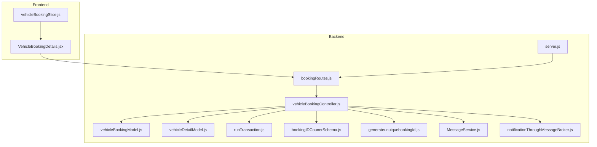

**Diagram sources**
- [server.js](file://backend/server.js#L66-L71)
- [bookingRoutes.js](file://backend/router/bookingRoutes.js#L1-L31)
- [vehicleBookingController.js](file://backend/Controller/vehicleBookingController.js#L1-L15)
- [vehicleBookingModel.js](file://backend/model/vehicleBookingModel.js#L1-L105)
- [vehicleDetailModel.js](file://backend/model/vehicleDetailModel.js#L1-L145)
- [runTransaction.js](file://backend/model/runTransaction.js#L1-L43)
- [bookingIDCounerSchema.js](file://backend/model/bookingIDCounerSchema.js#L1-L17)
- [generateunuiquebookingId.js](file://backend/utils/generateunuiquebookingId.js#L1-L23)
- [MessageService.js](file://backend/NotificationServices/MessageService.js#L1-L65)
- [notificationThroughMessageBroker.js](file://backend/utils/notificationThroughMessageBroker.js#L1-L69)

**Section sources**
- [server.js](file://backend/server.js#L66-L71)
- [bookingRoutes.js](file://backend/router/bookingRoutes.js#L1-L31)

## Core Components
- Booking Routes: Define endpoints for booking operations and apply middleware for authentication and authorization.
- Booking Controller: Implements business logic for creating, updating, retrieving, rescheduling, and completing bookings, including validations, transactions, notifications, and emails.
- Booking Model: Defines the schema for booking records, including embedded vehicle details and unique booking ID enforcement.
- Vehicle Model: Defines vehicle groups and embedded vehicle details with availability periods.
- Transaction Utility: Ensures atomicity across multiple database operations.
- Unique Booking ID Generator: Generates monotonically increasing IDs per day.
- Notification and Email Services: Integrate with RabbitMQ for notifications and email queuing.

**Section sources**
- [bookingRoutes.js](file://backend/router/bookingRoutes.js#L1-L31)
- [vehicleBookingController.js](file://backend/Controller/vehicleBookingController.js#L1-L15)
- [vehicleBookingModel.js](file://backend/model/vehicleBookingModel.js#L9-L97)
- [vehicleDetailModel.js](file://backend/model/vehicleDetailModel.js#L6-L105)
- [runTransaction.js](file://backend/model/runTransaction.js#L4-L18)
- [generateunuiquebookingId.js](file://backend/utils/generateunuiquebookingId.js#L7-L20)
- [notificationThroughMessageBroker.js](file://backend/utils/notificationThroughMessageBroker.js#L33-L64)
- [MessageService.js](file://backend/NotificationServices/MessageService.js#L36-L60)

## Architecture Overview
The booking system follows a layered architecture:
- Presentation Layer: Frontend Redux slices call backend endpoints.
- Routing Layer: Express routes map HTTP methods to controller actions.
- Controller Layer: Orchestrates validations, transactions, and integrations.
- Persistence Layer: Mongoose models manage MongoDB collections.
- Integration Layer: RabbitMQ handles notifications and email delivery.

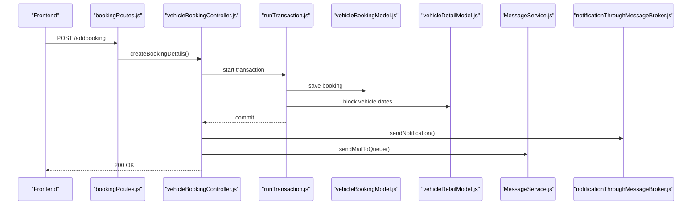

**Diagram sources**
- [bookingRoutes.js](file://backend/router/bookingRoutes.js#L7-L7)
- [vehicleBookingController.js](file://backend/Controller/vehicleBookingController.js#L235-L466)
- [runTransaction.js](file://backend/model/runTransaction.js#L4-L18)
- [vehicleBookingModel.js](file://backend/model/vehicleBookingModel.js#L99-L104)
- [vehicleDetailModel.js](file://backend/model/vehicleDetailModel.js#L6-L53)
- [notificationThroughMessageBroker.js](file://backend/utils/notificationThroughMessageBroker.js#L33-L64)
- [MessageService.js](file://backend/NotificationServices/MessageService.js#L36-L60)

## Detailed Component Analysis

### Endpoint Definitions and Behaviors

#### POST /addbooking
- Purpose: Create a new booking reservation.
- Authentication: Required (verifyToken).
- Request Body Schema:
  - pickupDate: ISO date string (required)
  - dropOffDate: ISO date string (required)
  - price: number (required)
  - extraExpenditure: number (required)
  - tax: number (required)
  - totalPrice: number (required)
  - bookingStatus: enum ["pending", "confirmed", "cancelled", "completed"] (required)
  - uniqueGroupId: number (required)
- Validation:
  - All required fields must be present.
  - pickupDate must be earlier than dropOffDate.
  - User must exist and be authenticated.
  - Vehicle group must exist.
  - Availability check ensures no overlapping bookedPeriods for the selected vehicle.
- Transaction:
  - Atomic operations across saving booking, blocking vehicle dates, and updating user stats.
- Notifications and Emails:
  - Notification sent via RabbitMQ exchange.
  - Confirmation email queued via RabbitMQ exchange.
- Responses:
  - 200 OK with booking data on success.
  - Appropriate error codes on validation or availability failures.

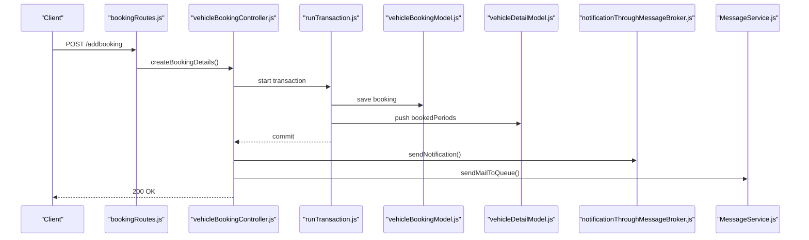

**Diagram sources**
- [bookingRoutes.js](file://backend/router/bookingRoutes.js#L7-L7)
- [vehicleBookingController.js](file://backend/Controller/vehicleBookingController.js#L235-L466)
- [runTransaction.js](file://backend/model/runTransaction.js#L4-L18)
- [vehicleBookingModel.js](file://backend/model/vehicleBookingModel.js#L99-L104)
- [vehicleDetailModel.js](file://backend/model/vehicleDetailModel.js#L38-L43)
- [notificationThroughMessageBroker.js](file://backend/utils/notificationThroughMessageBroker.js#L33-L64)
- [MessageService.js](file://backend/NotificationServices/MessageService.js#L36-L60)

**Section sources**
- [bookingRoutes.js](file://backend/router/bookingRoutes.js#L7-L7)
- [vehicleBookingController.js](file://backend/Controller/vehicleBookingController.js#L235-L466)
- [vehicleBookingModel.js](file://backend/model/vehicleBookingModel.js#L9-L97)
- [vehicleDetailModel.js](file://backend/model/vehicleDetailModel.js#L6-L53)
- [notificationThroughMessageBroker.js](file://backend/utils/notificationThroughMessageBroker.js#L33-L64)
- [MessageService.js](file://backend/NotificationServices/MessageService.js#L36-L60)

#### PATCH /updateBookingDetails
- Purpose: Cancel a booking.
- Authentication: Required (verifyToken).
- Authorization: Admin can cancel any booking; regular users can cancel their own bookings.
- Request Body Schema:
  - uniqueBookingId: number (required)
  - bookingStatus: must be "cancelled" (required)
- Validation:
  - Only cancellation is allowed via this endpoint.
  - Booking must exist and belong to the user (or admin).
  - Booking must not already be cancelled.
  - Cancellation policy enforced: at least 12 hours before pickup (with buffer).
- Transaction:
  - Atomic operations across updating booking status, freeing vehicle slot, and adjusting user stats.
- Notifications and Emails:
  - Notification sent via RabbitMQ exchange.
  - Cancellation email queued via RabbitMQ exchange.
- Responses:
  - 200 OK with updated booking data on success.
  - Appropriate error codes for unauthorized, not found, already cancelled, or outside cancellation window.

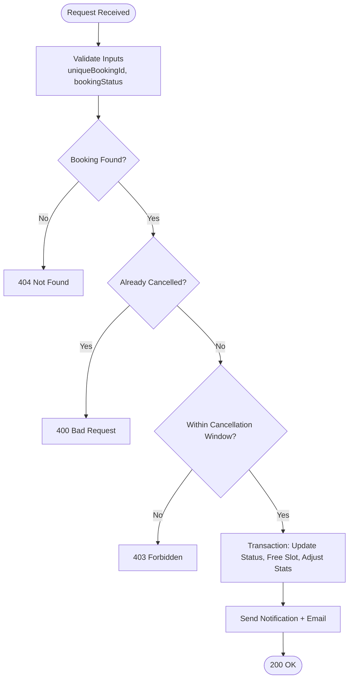

**Diagram sources**
- [vehicleBookingController.js](file://backend/Controller/vehicleBookingController.js#L480-L632)

**Section sources**
- [vehicleBookingController.js](file://backend/Controller/vehicleBookingController.js#L480-L632)

#### PATCH /rescheduleBooking
- Purpose: Reschedule an existing booking to new dates.
- Authentication: Required (verifyToken).
- Authorization: Admin or user with ownership.
- Request Body Schema:
  - uniqueBookingId: number (required)
  - pickupDate: ISO date string (required)
  - dropOffDate: ISO date string (required)
- Validation:
  - All fields required.
  - Booking must exist.
  - New slot must not overlap with existing bookings for the same vehicle (excluding current booking).
- Transaction:
  - Atomic operations across blocking new slot, freeing old slot, and updating booking record.
- Responses:
  - 200 OK on success.
  - 409 Conflict if vehicle unavailable for new dates.

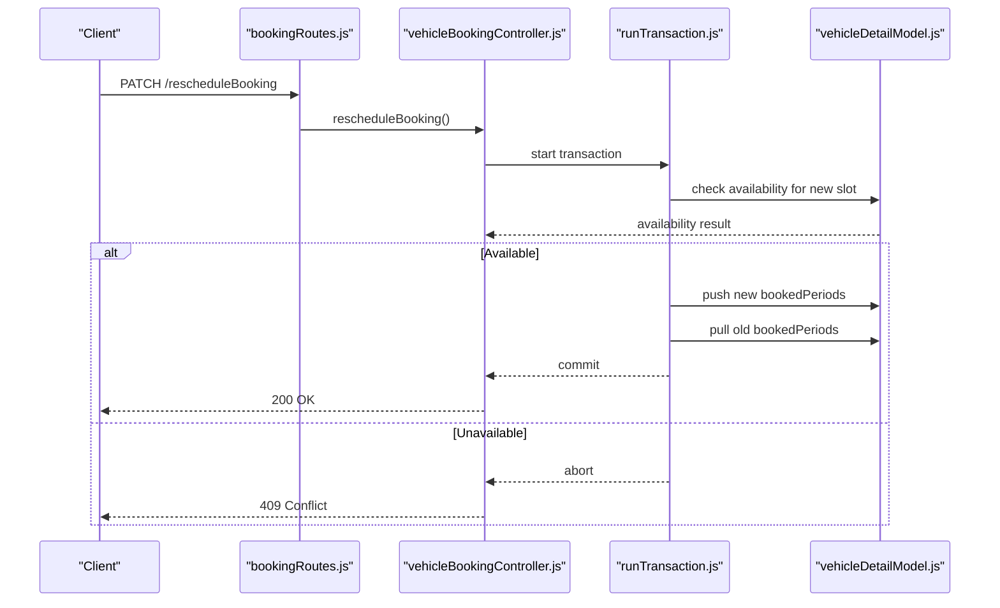

**Diagram sources**
- [bookingRoutes.js](file://backend/router/bookingRoutes.js#L18-L22)
- [vehicleBookingController.js](file://backend/Controller/vehicleBookingController.js#L664-L758)
- [runTransaction.js](file://backend/model/runTransaction.js#L4-L18)
- [vehicleDetailModel.js](file://backend/model/vehicleDetailModel.js#L38-L43)

**Section sources**
- [bookingRoutes.js](file://backend/router/bookingRoutes.js#L18-L22)
- [vehicleBookingController.js](file://backend/Controller/vehicleBookingController.js#L664-L758)

#### PATCH /completeBooking
- Purpose: Mark a booking as completed (admin-only).
- Authentication: Required (verifyToken).
- Authorization: Admin role required.
- Request Body Schema:
  - uniqueBookingId: number (required)
  - bookingStatus: must be "completed" (required)
- Validation:
  - Only completion is allowed via this endpoint.
  - Booking must exist and not be cancelled or already completed.
- Transaction:
  - Atomic operations across updating status and adjusting user stats.
- Notifications and Emails:
  - Notification sent via RabbitMQ exchange.
  - Completion email queued via RabbitMQ exchange.
- Responses:
  - 200 OK with updated booking data on success.
  - Appropriate error codes for invalid status, not found, already completed, or cancelled.

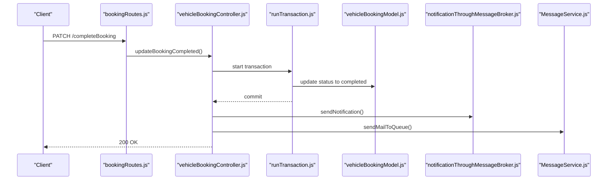

**Diagram sources**
- [bookingRoutes.js](file://backend/router/bookingRoutes.js#L23-L28)
- [vehicleBookingController.js](file://backend/Controller/vehicleBookingController.js#L760-L860)
- [runTransaction.js](file://backend/model/runTransaction.js#L4-L18)
- [vehicleBookingModel.js](file://backend/model/vehicleBookingModel.js#L99-L104)
- [notificationThroughMessageBroker.js](file://backend/utils/notificationThroughMessageBroker.js#L33-L64)
- [MessageService.js](file://backend/NotificationServices/MessageService.js#L36-L60)

**Section sources**
- [bookingRoutes.js](file://backend/router/bookingRoutes.js#L23-L28)
- [vehicleBookingController.js](file://backend/Controller/vehicleBookingController.js#L760-L860)

#### GET /getBookingdetails
- Purpose: Retrieve booking details for the authenticated user, optionally filtered by status.
- Authentication: Required (verifyToken).
- Query Parameters:
  - Status: filter by bookingStatus (optional)
- Validation:
  - User must be authenticated.
  - Booking document must exist for the user.
- Responses:
  - 200 OK with filtered booking details array.
  - 400/404 if no booking found or unauthorized.

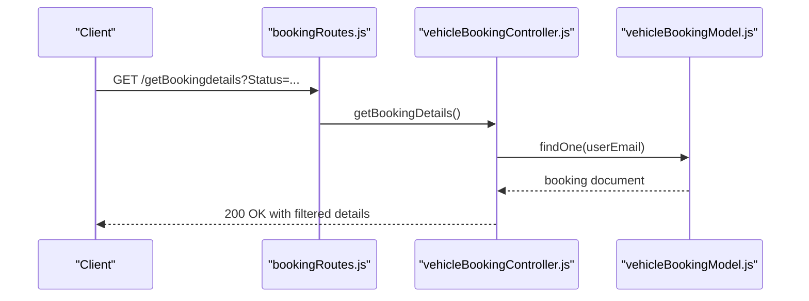

**Diagram sources**
- [bookingRoutes.js](file://backend/router/bookingRoutes.js#L8-L12)
- [vehicleBookingController.js](file://backend/Controller/vehicleBookingController.js#L635-L662)
- [vehicleBookingModel.js](file://backend/model/vehicleBookingModel.js#L99-L104)

**Section sources**
- [bookingRoutes.js](file://backend/router/bookingRoutes.js#L8-L12)
- [vehicleBookingController.js](file://backend/Controller/vehicleBookingController.js#L635-L662)

### Booking Lifecycle and Status Transitions
- Initial Status: "pending" or "confirmed" upon creation.
- Modification:
  - "cancelled" via cancellation endpoint (subject to policy).
  - "completed" via admin endpoint.
- Constraints:
  - Cancelled bookings cannot be completed.
  - Already completed bookings cannot be modified further.

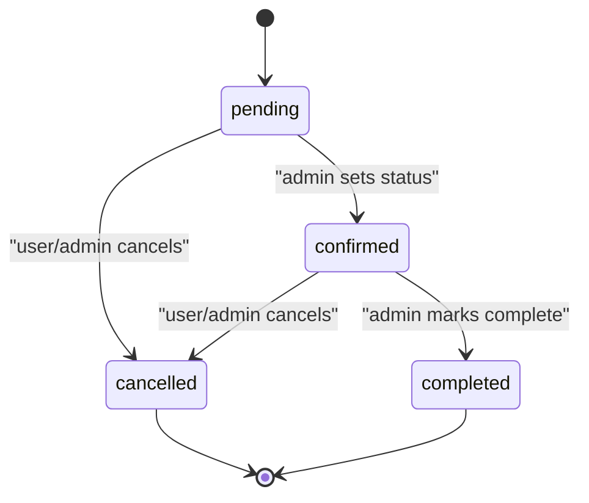

**Diagram sources**
- [vehicleBookingModel.js](file://backend/model/vehicleBookingModel.js#L32-L36)
- [vehicleBookingController.js](file://backend/Controller/vehicleBookingController.js#L760-L801)

**Section sources**
- [vehicleBookingModel.js](file://backend/model/vehicleBookingModel.js#L32-L36)
- [vehicleBookingController.js](file://backend/Controller/vehicleBookingController.js#L760-L801)

### Data Models and Schemas

#### Booking Model (vehicleBookingModel.js)
- Top-level fields:
  - userEmail: string (required)
  - vehicleDetails: array of embedded booking details
  - userDetails: mixed type
- Embedded vehicleDetails schema:
  - name, model, description, vehicleType: strings
  - uniqueVehicleId: number (required)
  - vehicleStatus: boolean (required)
  - location, vehicleNumber, vehicleMilage: string/number
  - filePath: array of strings
  - bookingStatus: enum ["pending", "confirmed", "cancelled", "completed"]
  - pickupDate, dropOffDate: dates (required)
  - price, extraExpenditure, tax, totalPrice: numbers (required)
  - damage: number (default 0)
  - uniqueBookingId: immutable number
  - createdAt: date (default now)
- Indexes:
  - Unique index on vehicleDetails.uniqueBookingId for uniqueness enforcement.

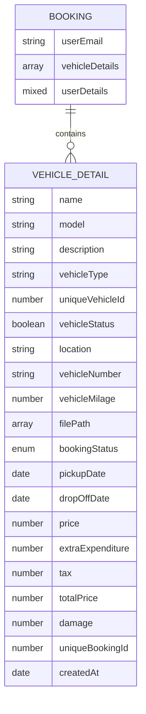

**Diagram sources**
- [vehicleBookingModel.js](file://backend/model/vehicleBookingModel.js#L9-L97)

**Section sources**
- [vehicleBookingModel.js](file://backend/model/vehicleBookingModel.js#L9-L97)

#### Vehicle Model (vehicleDetailModel.js)
- Top-level fields:
  - name, description, vehicleType, model: strings
  - bookingPrice: array of {range: number, price: number}
  - specificVehicleDetails: embedded array of vehicle instances
  - uniqueGroupId: unique number (required)
  - filePath: array of strings
  - createdBy: mixed
  - timestamps
- Embedded specificVehicleDetails schema:
  - location, vehicleNumber, vehicleMilage: string/number
  - notAvailableReason: enum ["In Repair", "Accident", "Other", "Booking"]
  - uniqueVehicleId: unique number
  - bookedPeriods: array of {startDate, endDate}

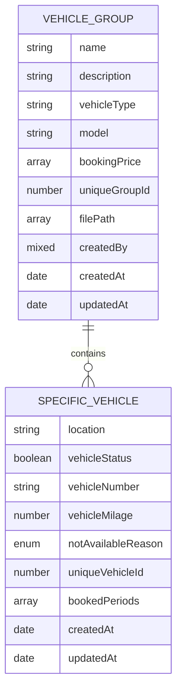

**Diagram sources**
- [vehicleDetailModel.js](file://backend/model/vehicleDetailModel.js#L55-L105)

**Section sources**
- [vehicleDetailModel.js](file://backend/model/vehicleDetailModel.js#L55-L105)

### Unique Booking ID Generation
- Daily counter increments per new booking without a uniqueBookingId.
- Counter resets at midnight IST.
- ID format: concatenation of YYMMDD date and a 3-digit zero-padded counter.
- Enforced uniqueness via MongoDB index on vehicleDetails.uniqueBookingId.

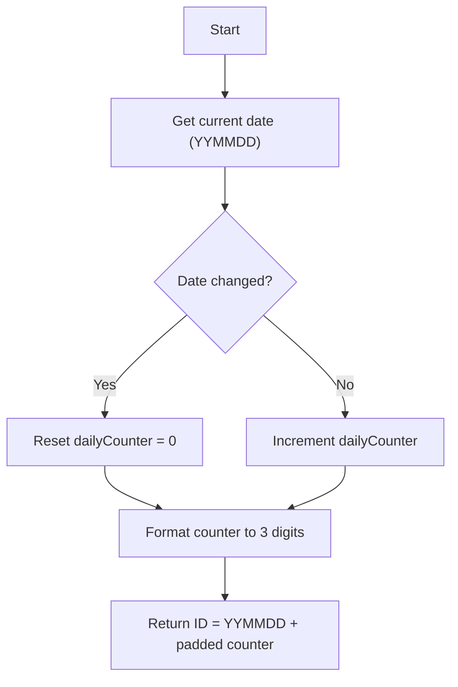

**Diagram sources**
- [generateunuiquebookingId.js](file://backend/utils/generateunuiquebookingId.js#L7-L20)
- [vehicleBookingModel.js](file://backend/model/vehicleBookingModel.js#L68-L97)
- [bookingIDCounerSchema.js](file://backend/model/bookingIDCounerSchema.js#L4-L14)

**Section sources**
- [generateunuiquebookingId.js](file://backend/utils/generateunuiquebookingId.js#L7-L20)
- [vehicleBookingModel.js](file://backend/model/vehicleBookingModel.js#L68-L97)
- [bookingIDCounerSchema.js](file://backend/model/bookingIDCounerSchema.js#L4-L14)

### Availability Checking Logic
- During creation: Controller scans vehicleGroup.specificVehicleDetails for a vehicle with vehicleStatus true and no overlapping bookedPeriods.
- During rescheduling: Controller queries vehicle model to ensure the new slot does not conflict with existing bookings for the same vehicle (excluding the current booking’s old slot).

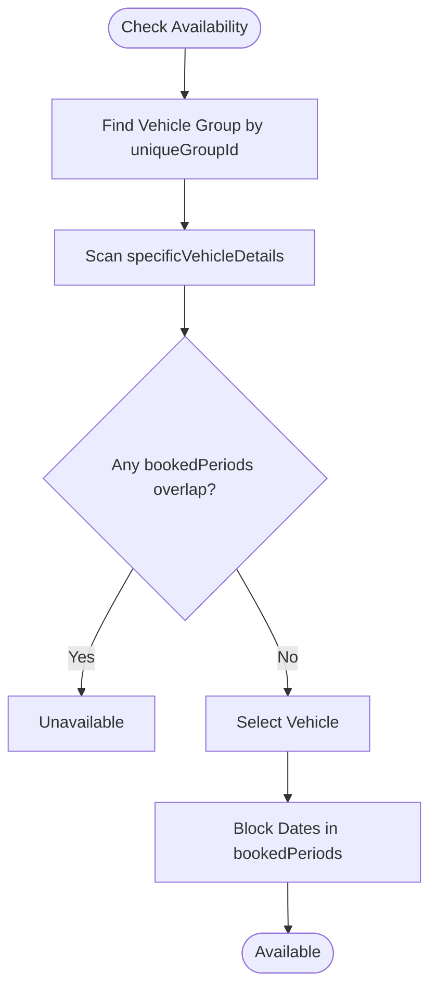

**Diagram sources**
- [vehicleBookingController.js](file://backend/Controller/vehicleBookingController.js#L292-L321)
- [vehicleDetailModel.js](file://backend/model/vehicleDetailModel.js#L38-L43)

**Section sources**
- [vehicleBookingController.js](file://backend/Controller/vehicleBookingController.js#L292-L321)
- [vehicleDetailModel.js](file://backend/model/vehicleDetailModel.js#L38-L43)

### Payment Processing Integration
- The booking request includes price, extraExpenditure, tax, and totalPrice fields.
- Payment processing is not implemented in the provided code; integration points include:
  - totalPrice field for amount settlement.
  - User stats updates (moneySpend) occur after successful booking or cancellation.
- Recommended integration pattern:
  - Invoke external payment gateway during booking creation.
  - On success, proceed with booking persistence; on failure, abort transaction and return error.

**Section sources**
- [vehicleBookingController.js](file://backend/Controller/vehicleBookingController.js#L346-L347)
- [vehicleBookingController.js](file://backend/Controller/vehicleBookingController.js#L415-L422)

### Confirmation Email Integration
- After successful booking creation, an email is queued via RabbitMQ with:
  - Exchange: "bookingemailExchange"
  - Routing Key: "bookingtask.userbookedvehicle"
  - Template data includes user and vehicle details, pickup/dropoff dates.

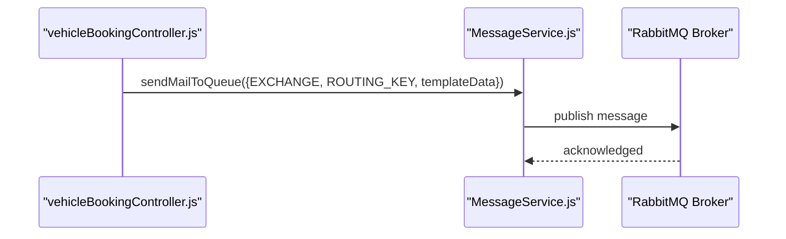

**Diagram sources**
- [vehicleBookingController.js](file://backend/Controller/vehicleBookingController.js#L441-L457)
- [MessageService.js](file://backend/NotificationServices/MessageService.js#L36-L60)

**Section sources**
- [vehicleBookingController.js](file://backend/Controller/vehicleBookingController.js#L441-L457)
- [MessageService.js](file://backend/NotificationServices/MessageService.js#L36-L60)

### Cancellation Policies
- Cancellation allowed if at least 12 hours remain before pickup (with buffer).
- Admin can cancel any booking regardless of timing.
- On cancellation:
  - Booking status updated to "cancelled".
  - Vehicle slot freed in vehicle model.
  - User stats adjusted (activeBooking decremented, cancelbooking incremented, moneySpend reduced).

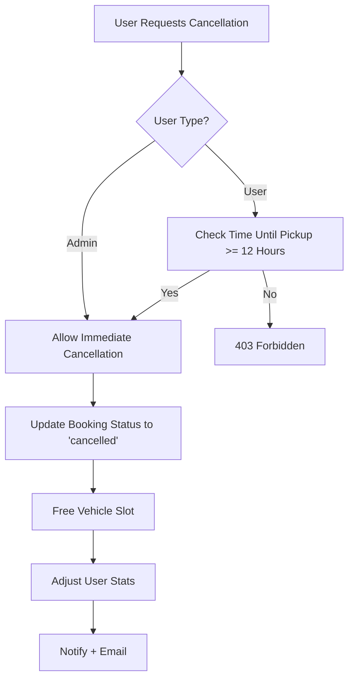

**Diagram sources**
- [vehicleBookingController.js](file://backend/Controller/vehicleBookingController.js#L470-L476)
- [vehicleBookingController.js](file://backend/Controller/vehicleBookingController.js#L542-L544)
- [vehicleBookingController.js](file://backend/Controller/vehicleBookingController.js#L573-L583)

**Section sources**
- [vehicleBookingController.js](file://backend/Controller/vehicleBookingController.js#L470-L476)
- [vehicleBookingController.js](file://backend/Controller/vehicleBookingController.js#L542-L544)
- [vehicleBookingController.js](file://backend/Controller/vehicleBookingController.js#L573-L583)

### Frontend Integration Examples
- Redux Thunks:
  - getBookingListData: fetches booking details for the authenticated user.
  - createBooking: posts booking data to /addbooking.
- Frontend booking page:
  - Computes totals and final payable amounts based on selected price range and helmet charges.
  - Dispatches createBooking thunk on submission.

**Section sources**
- [vehicleBookingSlice.js](file://frontend/src/appRedux/redis/bookingSlice/vehicleBookingSlice.js#L7-L19)
- [vehicleBookingSlice.js](file://frontend/src/appRedux/redis/bookingSlice/vehicleBookingSlice.js#L24-L37)
- [VehicleBookingDetails.jsx](file://frontend/src/pages/VehicleBookingPage/VehicleBookingDetails.jsx#L116-L124)

## Dependency Analysis
- Controllers depend on:
  - Models for data persistence.
  - runTransaction for ACID guarantees.
  - Notification and email services for integrations.
- Routes depend on controllers and middleware (authentication/authorization).
- Frontend depends on Redux Thunks to call backend endpoints.

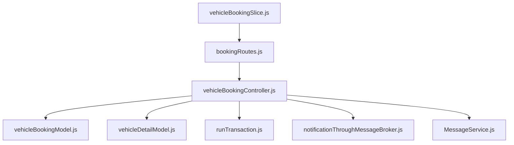

**Diagram sources**
- [bookingRoutes.js](file://backend/router/bookingRoutes.js#L1-L31)
- [vehicleBookingController.js](file://backend/Controller/vehicleBookingController.js#L1-L15)
- [vehicleBookingModel.js](file://backend/model/vehicleBookingModel.js#L1-L105)
- [vehicleDetailModel.js](file://backend/model/vehicleDetailModel.js#L1-L145)
- [runTransaction.js](file://backend/model/runTransaction.js#L1-L43)
- [notificationThroughMessageBroker.js](file://backend/utils/notificationThroughMessageBroker.js#L1-L69)
- [MessageService.js](file://backend/NotificationServices/MessageService.js#L1-L65)
- [vehicleBookingSlice.js](file://frontend/src/appRedux/redis/bookingSlice/vehicleBookingSlice.js#L1-L41)

**Section sources**
- [bookingRoutes.js](file://backend/router/bookingRoutes.js#L1-L31)
- [vehicleBookingController.js](file://backend/Controller/vehicleBookingController.js#L1-L15)
- [vehicleBookingModel.js](file://backend/model/vehicleBookingModel.js#L1-L105)
- [vehicleDetailModel.js](file://backend/model/vehicleDetailModel.js#L1-L145)
- [runTransaction.js](file://backend/model/runTransaction.js#L1-L43)
- [notificationThroughMessageBroker.js](file://backend/utils/notificationThroughMessageBroker.js#L1-L69)
- [MessageService.js](file://backend/NotificationServices/MessageService.js#L1-L65)
- [vehicleBookingSlice.js](file://frontend/src/appRedux/redis/bookingSlice/vehicleBookingSlice.js#L1-L41)

## Performance Considerations
- Transactions:
  - runTransaction ensures consistency but adds overhead; use judiciously for operations that must succeed atomically.
- Indexes:
  - Unique index on vehicleDetails.uniqueBookingId prevents duplicate IDs and speeds lookups.
- Availability checks:
  - Scanning specificVehicleDetails for overlaps is O(n) per vehicle group; consider indexing bookedPeriods if performance becomes a concern.
- Email and notifications:
  - RabbitMQ integration decouples I/O; ensure broker health and queue throughput for high load.

[No sources needed since this section provides general guidance]

## Troubleshooting Guide
- Common Errors:
  - 400 Bad Request: Missing required fields, invalid date order, existing confirmed booking, invalid status transitions.
  - 401 Unauthorized: Missing or invalid authentication token.
  - 403 Forbidden: Outside cancellation window or insufficient permissions.
  - 404 Not Found: Booking or vehicle group not found.
  - 409 Conflict: Vehicle not available for requested dates during rescheduling.
  - 500 Internal Server Error: Operational errors captured by global error handler.
- Logging:
  - Development mode logs full error details; production mode logs unexpected errors and returns generic messages.

**Section sources**
- [vehicleBookingController.js](file://backend/Controller/vehicleBookingController.js#L262-L283)
- [vehicleBookingController.js](file://backend/Controller/vehicleBookingController.js#L319-L321)
- [vehicleBookingController.js](file://backend/Controller/vehicleBookingController.js#L524-L544)
- [vehicleBookingController.js](file://backend/Controller/vehicleBookingController.js#L681-L714)
- [errorHandlingMiddleware.js](file://backend/utils/errorHandlingMiddleware.js#L117-L232)

## Conclusion
The Vehicle Booking System provides a robust, transactional API for managing vehicle reservations. It enforces strict validations, supports cancellation policies, integrates notifications and email delivery, and maintains data integrity through MongoDB transactions. The frontend integrates seamlessly via Redux Thunks to call the backend endpoints, enabling a smooth booking experience.

[No sources needed since this section summarizes without analyzing specific files]

## Appendices

### API Reference Summary
- POST /addbooking
  - Description: Create a new booking.
  - Auth: Required.
  - Body: pickupDate, dropOffDate, price, extraExpenditure, tax, totalPrice, bookingStatus, uniqueGroupId.
  - Responses: 200 OK on success; 400/404/409/500 on error.
- PATCH /updateBookingDetails
  - Description: Cancel a booking.
  - Auth: Required; Admin or booking owner.
  - Body: uniqueBookingId, bookingStatus = "cancelled".
  - Responses: 200 OK on success; 400/401/403/404 on error.
- PATCH /rescheduleBooking
  - Description: Reschedule a booking to new dates.
  - Auth: Required; Admin or booking owner.
  - Body: uniqueBookingId, pickupDate, dropOffDate.
  - Responses: 200 OK on success; 409 Conflict if unavailable.
- PATCH /completeBooking
  - Description: Mark a booking as completed.
  - Auth: Required; Admin.
  - Body: uniqueBookingId, bookingStatus = "completed".
  - Responses: 200 OK on success; 400/404 on error.
- GET /getBookingdetails
  - Description: Retrieve booking details for the authenticated user.
  - Auth: Required.
  - Query: Status (optional).
  - Responses: 200 OK with filtered details; 400/404 on error.

**Section sources**
- [bookingRoutes.js](file://backend/router/bookingRoutes.js#L7-L28)
- [vehicleBookingController.js](file://backend/Controller/vehicleBookingController.js#L235-L860)