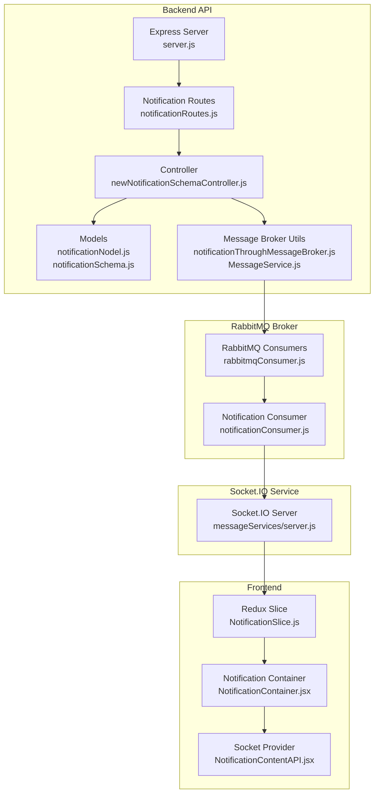
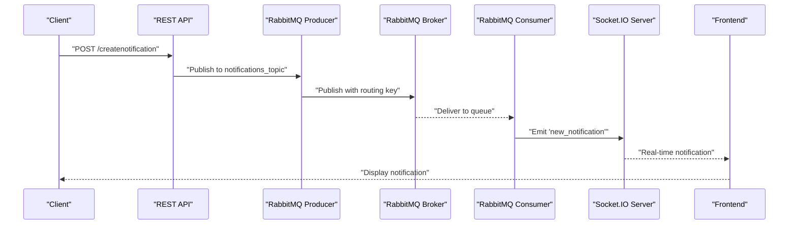
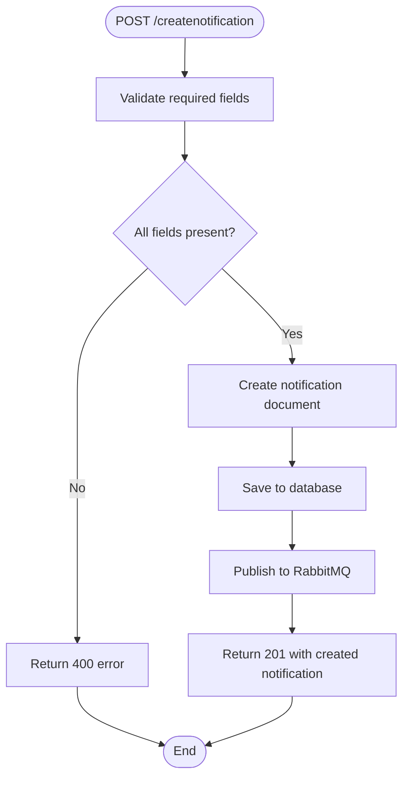
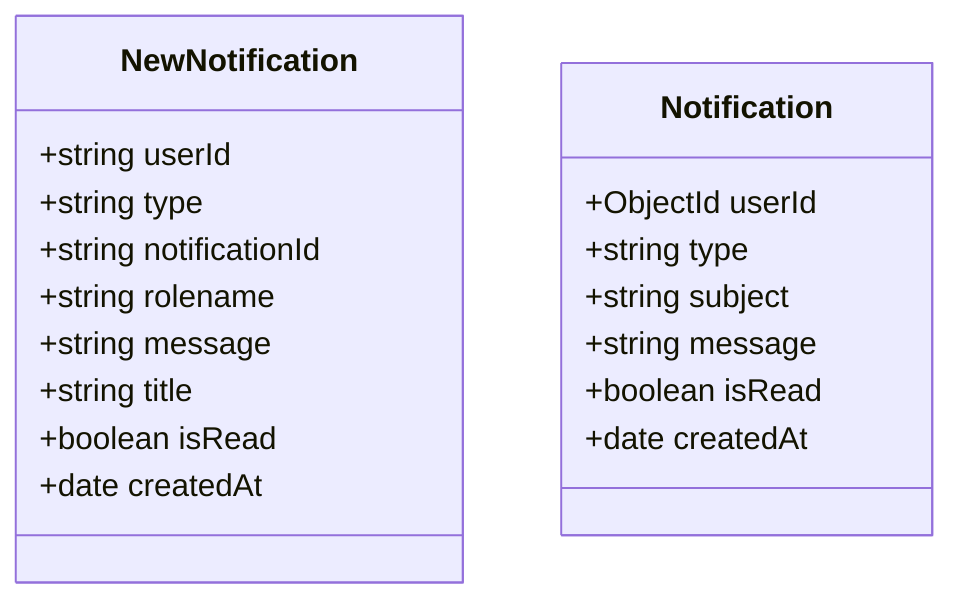
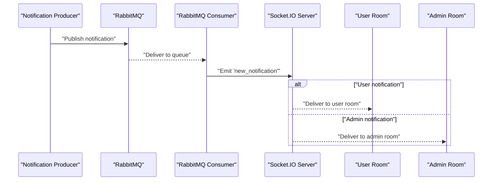
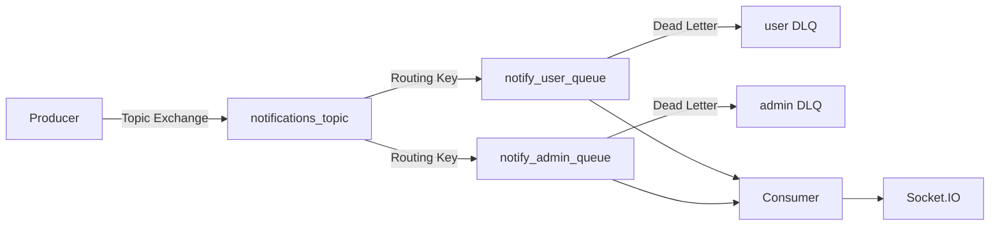
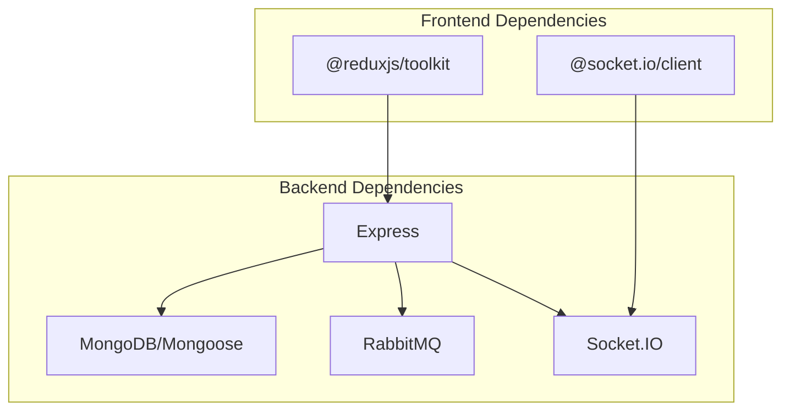

# Notification System API

<cite>
**Referenced Files in This Document**
- [notificationRoutes.js](file://backend/router/notificationRoutes.js)
- [newNotificationSchemaController.js](file://backend/Controller/newNotificationSchemaController.js)
- [notificationNodel.js](file://backend/model/notificationNodel.js)
- [notificationSchema.js](file://backend/model/notificationSchema.js)
- [NotificationTemplete.js](file://backend/utils/NotificationTemplete.js)
- [notificationThroughMessageBroker.js](file://backend/utils/notificationThroughMessageBroker.js)
- [MessageService.js](file://backend/NotificationServices/MessageService.js)
- [rabbitmqConsumer.js](file://messageServices/controller/rabbitmqConsumer.js)
- [notificationConsumer.js](file://messageServices/controller/notificationConsumer.js)
- [server.js](file://messageServices/server.js)
- [NotificationSlice.js](file://frontend/src/appRedux/redux/notificationSlice/NotificationSlice.js)
- [NotificationContainer.jsx](file://frontend/src/comoponent/navBar/NotificationContainer.jsx)
- [NotificationContentAPI.jsx](file://frontend/src/ContextApi/NotificationContentAPI.jsx)
- [server.js](file://backend/server.js)
- [package.json](file://backend/package.json)
</cite>

## Table of Contents
1. [Introduction](#introduction)
2. [Project Structure](#project-structure)
3. [Core Components](#core-components)
4. [Architecture Overview](#architecture-overview)
5. [Detailed Component Analysis](#detailed-component-analysis)
6. [Dependency Analysis](#dependency-analysis)
7. [Performance Considerations](#performance-considerations)
8. [Troubleshooting Guide](#troubleshooting-guide)
9. [Conclusion](#conclusion)
10. [Appendices](#appendices)

## Introduction
This document provides comprehensive API documentation for the Notification System endpoints. It covers notification management operations, notification preferences, notification creation, schemas for notification types and delivery channels, real-time notification integration with Socket.IO, and RabbitMQ message queues. It also includes examples for different notification scenarios, bulk notification operations, and notification template management.

## Project Structure
The notification system spans three major areas:
- Backend REST API for CRUD operations on notifications and user preferences
- RabbitMQ message broker for asynchronous notification delivery
- Socket.IO service for real-time notification delivery to clients

**Diagram sources**
- [server.js](file://backend/server.js#L34-L76)
- [notificationRoutes.js](file://backend/router/notificationRoutes.js#L1-L14)
- [newNotificationSchemaController.js](file://backend/Controller/newNotificationSchemaController.js#L1-L112)
- [notificationNodel.js](file://backend/model/notificationNodel.js#L1-L12)
- [notificationSchema.js](file://backend/model/notificationSchema.js#L1-L13)
- [notificationThroughMessageBroker.js](file://backend/utils/notificationThroughMessageBroker.js#L1-L69)
- [MessageService.js](file://backend/NotificationServices/MessageService.js#L1-L65)
- [rabbitmqConsumer.js](file://messageServices/controller/rabbitmqConsumer.js#L1-L216)
- [notificationConsumer.js](file://messageServices/controller/notificationConsumer.js#L43-L90)
- [server.js](file://messageServices/server.js#L1-L83)
- [NotificationSlice.js](file://frontend/src/appRedux/redux/notificationSlice/NotificationSlice.js#L1-L133)
- [NotificationContainer.jsx](file://frontend/src/comoponent/navBar/NotificationContainer.jsx#L1-L115)
- [NotificationContentAPI.jsx](file://frontend/src/ContextApi/NotificationContentAPI.jsx#L1-L60)

**Section sources**
- [server.js](file://backend/server.js#L34-L76)
- [notificationRoutes.js](file://backend/router/notificationRoutes.js#L1-L14)
- [notificationNodel.js](file://backend/model/notificationNodel.js#L1-L12)
- [notificationSchema.js](file://backend/model/notificationSchema.js#L1-L13)
- [notificationThroughMessageBroker.js](file://backend/utils/notificationThroughMessageBroker.js#L1-L69)
- [MessageService.js](file://backend/NotificationServices/MessageService.js#L1-L65)
- [rabbitmqConsumer.js](file://messageServices/controller/rabbitmqConsumer.js#L1-L216)
- [notificationConsumer.js](file://messageServices/controller/notificationConsumer.js#L43-L90)
- [server.js](file://messageServices/server.js#L1-L83)
- [NotificationSlice.js](file://frontend/src/appRedux/redux/notificationSlice/NotificationSlice.js#L1-L133)
- [NotificationContainer.jsx](file://frontend/src/comoponent/navBar/NotificationContainer.jsx#L1-L115)
- [NotificationContentAPI.jsx](file://frontend/src/ContextApi/NotificationContentAPI.jsx#L1-L60)

## Core Components
- Notification Management Endpoints
  - POST /createnotification: Create a notification with fields userId, rolename, message, title, type, notificationId
  - GET /notification: Retrieve notifications for the authenticated user, sorted by read status and creation date
  - POST /readNotifications: Mark a specific notification as read/unread
  - POST /readAllNotifications: Mark all notifications as read/unread
- Notification Preferences
  - Not implemented in the current codebase
- Notification Creation
  - Producers publish notifications to RabbitMQ exchanges with routing keys based on role (admin or user)
- Real-time Delivery
  - RabbitMQ consumers emit notifications via Socket.IO to user-specific rooms or admin room
- Templates
  - Notification templates are defined for various system events

**Section sources**
- [notificationRoutes.js](file://backend/router/notificationRoutes.js#L7-L10)
- [newNotificationSchemaController.js](file://backend/Controller/newNotificationSchemaController.js#L6-L111)
- [notificationNodel.js](file://backend/model/notificationNodel.js#L2-L11)
- [notificationThroughMessageBroker.js](file://backend/utils/notificationThroughMessageBroker.js#L33-L64)
- [notificationConsumer.js](file://messageServices/controller/notificationConsumer.js#L63-L87)
- [NotificationTemplete.js](file://backend/utils/NotificationTemplete.js#L1-L35)

## Architecture Overview
The notification system follows an asynchronous, event-driven architecture:
- REST API receives requests and persists notifications to MongoDB
- Producers publish notifications to RabbitMQ exchanges
- Consumers subscribe to queues and emit real-time notifications via Socket.IO
- Frontend connects to Socket.IO and Redux to manage notification state

**Diagram sources**
- [newNotificationSchemaController.js](file://backend/Controller/newNotificationSchemaController.js#L6-L29)
- [notificationThroughMessageBroker.js](file://backend/utils/notificationThroughMessageBroker.js#L33-L64)
- [rabbitmqConsumer.js](file://messageServices/controller/rabbitmqConsumer.js#L132-L213)
- [notificationConsumer.js](file://messageServices/controller/notificationConsumer.js#L63-L87)
- [server.js](file://messageServices/server.js#L34-L53)

## Detailed Component Analysis

### Notification Management Endpoints

#### POST /createnotification
- Purpose: Create a notification record
- Authentication: None (public endpoint)
- Request body fields:
  - userId: string (required)
  - rolename: string (required)
  - message: string (required)
  - title: string (required)
  - type: string (required)
  - notificationId: string (required)
- Response: Created notification object
- Validation: All fields required; returns error if missing

#### GET /notification
- Purpose: Retrieve notifications for the authenticated user
- Authentication: Required (verifyToken middleware)
- Query behavior: Returns all notifications for the user, sorted by read status ascending and creation date descending
- Response includes:
  - data: array of notifications
  - count: number of unread notifications
- Edge cases: Returns empty array with count 0 if no notifications found

#### POST /readNotifications
- Purpose: Mark a specific notification as read/unread
- Authentication: Required
- Request body fields:
  - notificationId: string (required)
  - isRead: boolean (default: true)
- Response: Success message indicating operation outcome
- Edge cases: Returns error if notification not found for the user

#### POST /readAllNotifications
- Purpose: Mark all notifications as read/unread
- Authentication: Required
- Request body fields:
  - isRead: boolean (default: true)
- Response: Success message with count of modified notifications

**Diagram sources**
- [newNotificationSchemaController.js](file://backend/Controller/newNotificationSchemaController.js#L6-L29)
- [notificationNodel.js](file://backend/model/notificationNodel.js#L2-L11)

**Section sources**
- [notificationRoutes.js](file://backend/router/notificationRoutes.js#L7-L10)
- [newNotificationSchemaController.js](file://backend/Controller/newNotificationSchemaController.js#L6-L111)
- [notificationNodel.js](file://backend/model/notificationNodel.js#L1-L12)

### Notification Schemas

#### Notification Model (notificationNodel.js)
- Fields:
  - userId: string (required)
  - type: string (default: "general")
  - notificationId: string (required)
  - rolename: string (required)
  - message: string (required)
  - title: string (required)
  - isRead: boolean (default: false)
  - createdAt: date (default: now)

#### Legacy Notification Schema (notificationSchema.js)
- Fields:
  - userId: ObjectId (required)
  - type: string (required)
  - subject: string (required)
  - message: string (required)
  - isRead: boolean (default: false)
  - createdAt: date (default: now)

**Diagram sources**
- [notificationNodel.js](file://backend/model/notificationNodel.js#L2-L11)
- [notificationSchema.js](file://backend/model/notificationSchema.js#L3-L10)

**Section sources**
- [notificationNodel.js](file://backend/model/notificationNodel.js#L1-L12)
- [notificationSchema.js](file://backend/model/notificationSchema.js#L1-L13)

### Real-time Notification Integration

#### Socket.IO Setup
- Backend server initializes Socket.IO with CORS configuration
- Frontend connects to Socket.IO server and registers user/admin rooms
- Events:
  - register_user(userId): Join user-specific room
  - register_admin: Join admin room
  - new_notification: Receive real-time notifications

#### RabbitMQ Consumer to Socket.IO Bridge
- Consumers bind queues to routing keys based on role
- On successful processing, emit "new_notification" to appropriate room
- Save processed notifications to backend database

**Diagram sources**
- [notificationThroughMessageBroker.js](file://backend/utils/notificationThroughMessageBroker.js#L33-L64)
- [notificationConsumer.js](file://messageServices/controller/notificationConsumer.js#L63-L87)
- [server.js](file://messageServices/server.js#L34-L53)

**Section sources**
- [server.js](file://backend/server.js#L52-L59)
- [NotificationContentAPI.jsx](file://frontend/src/ContextApi/NotificationContentAPI.jsx#L10-L51)
- [notificationConsumer.js](file://messageServices/controller/notificationConsumer.js#L63-L87)
- [server.js](file://messageServices/server.js#L34-L53)

### RabbitMQ Message Broker

#### Producer Configuration
- Exchange: "notifications_topic" (topic type)
- Routing keys:
  - notify.admin (admin notifications)
  - notify.user.{userId} (user-specific notifications)
- Persistent messages with retry mechanism

#### Consumer Configuration
- Exchanges: "notifications_topic" (topic), DLX (fanout)
- Queues: notify_user, notify_admin
- Dead letter queues for failed deliveries
- Automatic retry with exponential backoff

**Diagram sources**
- [notificationThroughMessageBroker.js](file://backend/utils/notificationThroughMessageBroker.js#L21-L54)
- [notificationConsumer.js](file://messageServices/controller/notificationConsumer.js#L44-L61)
- [rabbitmqConsumer.js](file://messageServices/controller/rabbitmqConsumer.js#L96-L130)

**Section sources**
- [notificationThroughMessageBroker.js](file://backend/utils/notificationThroughMessageBroker.js#L1-L69)
- [notificationConsumer.js](file://messageServices/controller/notificationConsumer.js#L43-L90)
- [rabbitmqConsumer.js](file://messageServices/controller/rabbitmqConsumer.js#L1-L216)

### Notification Templates
Notification templates define standardized subjects and messages for common system events:
- newVehicleAdded: Ticket icon, identity "newVehicle"
- vehicleDelete: Trash icon, identity "vehicleDelete"
- updateVehicle: Wrench icon, identity "updateVehicle"
- updateGroupVehicle: Wrench icon, identity "updateGroupVehicle"
- new_booking: Car icon, identity "newBooking"

**Section sources**
- [NotificationTemplete.js](file://backend/utils/NotificationTemplete.js#L1-L35)

### Frontend Integration
- Redux slice manages notifications state, loading, and errors
- Notification container displays live Socket.IO notifications and database-backed notifications
- Socket provider handles connection lifecycle and room registration

**Section sources**
- [NotificationSlice.js](file://frontend/src/appRedux/redux/notificationSlice/NotificationSlice.js#L1-L133)
- [NotificationContainer.jsx](file://frontend/src/comoponent/navBar/NotificationContainer.jsx#L1-L115)
- [NotificationContentAPI.jsx](file://frontend/src/ContextApi/NotificationContentAPI.jsx#L1-L60)

## Dependency Analysis
The notification system exhibits clear separation of concerns:
- Backend API depends on MongoDB for persistence
- RabbitMQ provides loose coupling between producers and consumers
- Socket.IO enables real-time communication
- Frontend integrates via Redux and Socket.IO client

**Diagram sources**
- [package.json](file://backend/package.json#L12-L30)
- [NotificationContentAPI.jsx](file://frontend/src/ContextApi/NotificationContentAPI.jsx#L2-L3)

**Section sources**
- [package.json](file://backend/package.json#L1-L37)
- [NotificationContentAPI.jsx](file://frontend/src/ContextApi/NotificationContentAPI.jsx#L1-L60)

## Performance Considerations
- Asynchronous processing: RabbitMQ decouples notification generation from delivery
- Real-time updates: Socket.IO minimizes latency for immediate user feedback
- Database indexing: Consider adding indexes on userId, isRead, and createdAt for optimal query performance
- Message durability: Persistent messages ensure reliability but impact throughput
- Consumer scaling: RabbitMQ consumers can be scaled horizontally for high-volume scenarios

## Troubleshooting Guide
Common issues and resolutions:
- RabbitMQ connection failures: Verify RABBITMQURL environment variable and network connectivity
- Socket.IO disconnections: Check CORS configuration and reconnection attempts
- Missing notifications: Validate routing keys match user/admin roles
- Database write failures: Monitor MongoDB connection and collection permissions

**Section sources**
- [rabbitmqConsumer.js](file://messageServices/controller/rabbitmqConsumer.js#L30-L48)
- [server.js](file://messageServices/server.js#L13-L18)
- [NotificationContentAPI.jsx](file://frontend/src/ContextApi/NotificationContentAPI.jsx#L15-L21)

## Conclusion
The notification system provides a robust, scalable solution for managing notifications across multiple channels. Its asynchronous architecture ensures reliable delivery while maintaining system responsiveness. The real-time capabilities enhance user experience through immediate feedback, and the template system standardizes communication across the platform.

## Appendices

### API Endpoint Reference

#### Notification Management
- POST /createnotification
  - Description: Create a new notification
  - Authentication: None
  - Body: { userId, rolename, message, title, type, notificationId }
  - Response: 201 with created notification

- GET /notification
  - Description: Retrieve user notifications
  - Authentication: Required
  - Query: None
  - Response: 200 with data array and unread count

- POST /readNotifications
  - Description: Mark specific notification as read/unread
  - Authentication: Required
  - Body: { notificationId, isRead: boolean }
  - Response: 200 with success message

- POST /readAllNotifications
  - Description: Mark all notifications as read/unread
  - Authentication: Required
  - Body: { isRead: boolean }
  - Response: 200 with modification count

#### Notification Preferences
- Not implemented in current codebase

#### Notification Creation
- Internal API for publishing notifications to RabbitMQ
- Uses topic exchange with routing keys based on role
- Supports admin and user-specific notifications

### Example Scenarios
- User booking confirmation: Send notification with type "booking", rolename "user", and user-specific routing key
- Admin system alerts: Send notification with rolename "admin" and broadcast to admin room
- Bulk notifications: Use batch processing with RabbitMQ producers for high-volume scenarios
- Template-based notifications: Utilize predefined templates for standardized messaging

### Scheduling Options
- Immediate delivery: Notifications published directly to RabbitMQ
- Future delivery: Extend system to support delayed message processing
- Recurring notifications: Implement periodic tasks for recurring alerts