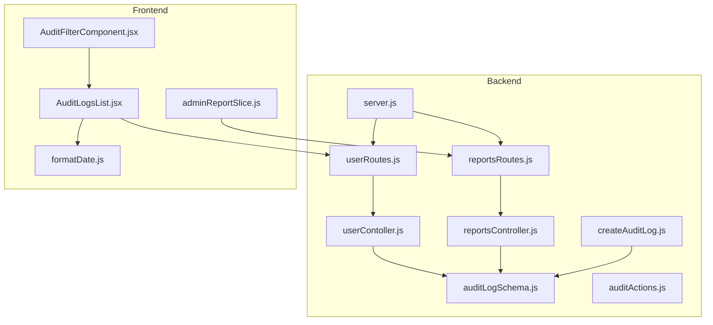
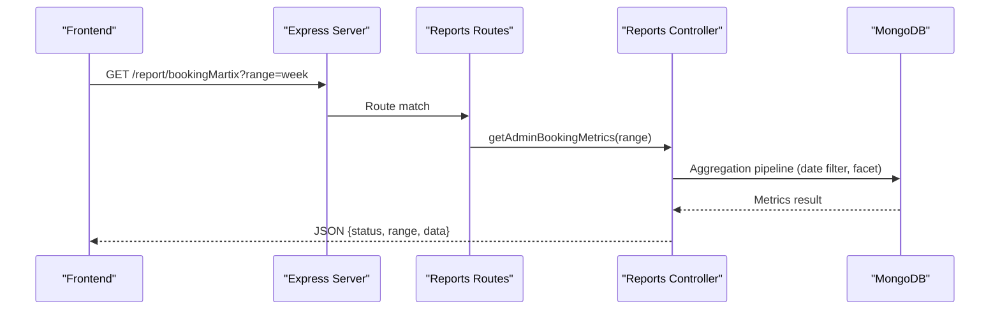
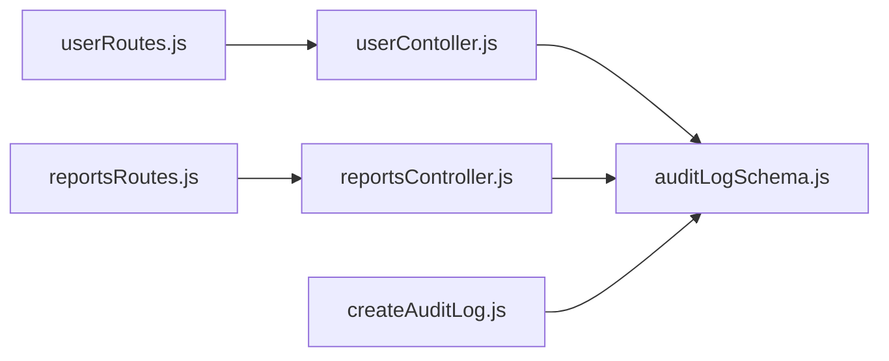

# Reporting & Analytics API

<cite>
**Referenced Files in This Document**
- [server.js](file://backend/server.js)
- [reportsRoutes.js](file://backend/router/reportsRoutes.js)
- [reportsController.js](file://backend/Controller/reportsController.js)
- [userRoutes.js](file://backend/router/userRoutes.js)
- [userContoller.js](file://backend/Controller/userContoller.js)
- [auditLogSchema.js](file://backend/model/auditLogSchema.js)
- [auditActions.js](file://backend/config/auditActions.js)
- [createAuditLog.js](file://backend/utils/createAuditLog.js)
- [adminReportSlice.js](file://frontend/src/appRedux/redux/reportSlice/adminReportSlice.js)
- [AuditLogsList.jsx](file://frontend/src/pages/adminDashboard/reportComponent/AuditLogsList.jsx)
- [AuditFilterComponent.jsx](file://frontend/src/pages/adminDashboard/reportComponent/AuditFilterComponent.jsx)
- [formatDate.js](file://frontend/src/utils/formatDate.js)
</cite>

## Table of Contents
1. [Introduction](#introduction)
2. [Project Structure](#project-structure)
3. [Core Components](#core-components)
4. [Architecture Overview](#architecture-overview)
5. [Detailed Component Analysis](#detailed-component-analysis)
6. [Dependency Analysis](#dependency-analysis)
7. [Performance Considerations](#performance-considerations)
8. [Troubleshooting Guide](#troubleshooting-guide)
9. [Conclusion](#conclusion)

## Introduction
This document provides comprehensive API documentation for the Reporting and Analytics system endpoints. It covers administrative reporting endpoints, audit log retrieval, and data export capabilities. The documentation includes endpoint definitions, query parameters, response formats, authorization requirements, and practical examples for generating custom reports and filtering by time periods.

## Project Structure
The Reporting and Analytics system spans backend routes/controllers, MongoDB models, and frontend Redux slices/components. The backend exposes REST endpoints under the `/report` and `/` base paths, while the frontend integrates with Redux to fetch and render analytics data.

**Diagram sources**
- [server.js](file://backend/server.js#L66-L76)
- [reportsRoutes.js](file://backend/router/reportsRoutes.js#L1-L50)
- [reportsController.js](file://backend/Controller/reportsController.js#L1-L641)
- [userRoutes.js](file://backend/router/userRoutes.js#L104-L116)
- [userContoller.js](file://backend/Controller/userContoller.js#L792-L831)
- [auditLogSchema.js](file://backend/model/auditLogSchema.js#L1-L64)
- [auditActions.js](file://backend/config/auditActions.js#L1-L18)
- [createAuditLog.js](file://backend/utils/createAuditLog.js#L1-L31)
- [adminReportSlice.js](file://frontend/src/appRedux/redux/reportSlice/adminReportSlice.js#L1-L233)
- [AuditLogsList.jsx](file://frontend/src/pages/adminDashboard/reportComponent/AuditLogsList.jsx#L1-L301)
- [AuditFilterComponent.jsx](file://frontend/src/pages/adminDashboard/reportComponent/AuditFilterComponent.jsx#L59-L98)
- [formatDate.js](file://frontend/src/utils/formatDate.js#L1-L11)

**Section sources**
- [server.js](file://backend/server.js#L66-L76)
- [reportsRoutes.js](file://backend/router/reportsRoutes.js#L1-L50)
- [userRoutes.js](file://backend/router/userRoutes.js#L104-L116)

## Core Components
- Administrative Reporting Endpoints: Retrieve booking data, vehicle lists, user summaries, availability status, and booking metrics.
- Audit Log Endpoints: Fetch paginated audit logs and retrieve a specific audit log by ID.
- Data Export Capability: Frontend UI supports exporting reports; backend does not expose explicit CSV endpoints.

Key authorization requirement: All administrative endpoints require a valid JWT and admin role.

**Section sources**
- [reportsRoutes.js](file://backend/router/reportsRoutes.js#L7-L48)
- [userRoutes.js](file://backend/router/userRoutes.js#L104-L116)
- [reportsController.js](file://backend/Controller/reportsController.js#L8-L641)
- [userContoller.js](file://backend/Controller/userContoller.js#L792-L831)

## Architecture Overview
The system follows a layered architecture:
- HTTP Layer: Express routes define endpoint contracts.
- Controller Layer: Business logic orchestrates data retrieval and aggregation.
- Data Access Layer: Mongoose models and aggregation pipelines query MongoDB.
- Frontend Integration: Redux slices fetch data and manage state; components render charts and tables.

**Diagram sources**
- [reportsRoutes.js](file://backend/router/reportsRoutes.js#L43-L47)
- [reportsController.js](file://backend/Controller/reportsController.js#L533-L640)

## Detailed Component Analysis

### Administrative Reporting Endpoints

#### GET /report/allbookingdata
- Purpose: Retrieve booking records with optional filtering by booking status.
- Authentication: JWT required, admin role required.
- Query Parameters:
  - bookingStatus: string (optional). Filters bookings by status.
- Response Format:
  - status: string
  - count: number
  - data: array of booking objects containing user and vehicle details
- Example Request:
  - GET /report/allbookingdata?bookingStatus=confirmed
- Example Response:
  - 200 OK with an array of booking entries and metadata

**Section sources**
- [reportsRoutes.js](file://backend/router/reportsRoutes.js#L7-L12)
- [reportsController.js](file://backend/Controller/reportsController.js#L8-L54)

#### GET /report/allvehicledata
- Purpose: Retrieve all vehicles with detailed vehicle-specific information.
- Authentication: JWT required, admin role required.
- Response Format:
  - status: string
  - count: number
  - data: array of vehicle objects with nested specificVehicleDetails
- Example Request:
  - GET /report/allvehicledata
- Example Response:
  - 200 OK with vehicle inventory list

**Section sources**
- [reportsRoutes.js](file://backend/router/reportsRoutes.js#L13-L18)
- [reportsController.js](file://backend/Controller/reportsController.js#L56-L96)

#### GET /report/alluserdata
- Purpose: Retrieve all users with booking-related statistics.
- Authentication: JWT required, admin role required.
- Response Format:
  - status: string
  - data: array of user objects with bookingInfo fields
  - count: number
- Example Request:
  - GET /report/alluserdata
- Example Response:
  - 200 OK with user list and counts

**Section sources**
- [reportsRoutes.js](file://backend/router/reportsRoutes.js#L19-L24)
- [reportsController.js](file://backend/Controller/reportsController.js#L98-L131)

#### GET /report/allNotAvailableVehicle
- Purpose: Retrieve vehicles marked as not available with counts.
- Authentication: JWT required, admin role required.
- Response Format:
  - status: string
  - vehicleGroupCount: number
  - count: number (total not available vehicles)
  - data: array of grouped vehicle entries
- Example Request:
  - GET /report/allNotAvailableVehicle
- Example Response:
  - 200 OK with grouped unavailable vehicles

**Section sources**
- [reportsRoutes.js](file://backend/router/reportsRoutes.js#L25-L30)
- [reportsController.js](file://backend/Controller/reportsController.js#L233-L305)

#### GET /report/allAvailableVehicle
- Purpose: Retrieve vehicles marked as available with counts.
- Authentication: JWT required, admin role required.
- Response Format:
  - status: string
  - vehicleGroupCount: number
  - count: number (total available vehicles)
  - data: array of grouped vehicle entries
- Example Request:
  - GET /report/allAvailableVehicle
- Example Response:
  - 200 OK with grouped available vehicles

**Section sources**
- [reportsRoutes.js](file://backend/router/reportsRoutes.js#L31-L36)
- [reportsController.js](file://backend/Controller/reportsController.js#L306-L378)

#### GET /report/getVehicleType
- Purpose: Retrieve counts of vehicles grouped by type.
- Authentication: JWT required, admin role required.
- Response Format:
  - status: string
  - totalVehicles: number
  - counts: object mapping vehicleType to count
- Example Request:
  - GET /report/getVehicleType
- Example Response:
  - 200 OK with counts object

**Section sources**
- [reportsRoutes.js](file://backend/router/reportsRoutes.js#L37-L42)
- [reportsController.js](file://backend/Controller/reportsController.js#L380-L408)

#### GET /report/bookingMartix
- Purpose: Retrieve administrative booking metrics with optional date range filtering.
- Authentication: JWT required, admin role required.
- Query Parameters:
  - range: string. Supported values: today, week, month, year, all. Defaults to all.
- Response Format:
  - status: string
  - range: string (passed parameter)
  - data:
    - totalBookings: number
    - totalRevenue: number
    - upcomingPickups: number
    - activeBookings: number
    - bookingStatusStats: array of { _id: status, count: number, revenue: number }
- Example Request:
  - GET /report/bookingMartix?range=month
- Example Response:
  - 200 OK with metrics and breakdown

**Section sources**
- [reportsRoutes.js](file://backend/router/reportsRoutes.js#L43-L48)
- [reportsController.js](file://backend/Controller/reportsController.js#L533-L640)

### Audit Log Retrieval Endpoints

#### GET /getAuditLogs
- Purpose: Retrieve paginated audit logs with basic fields and user info.
- Authentication: Not enforced in routes (commented middleware).
- Query Parameters:
  - page: number (default 1)
  - limit: number (default 20)
- Response Format:
  - status: string
  - data: array of audit log entries
  - pagination: { page, limit, totalPages, totalRecords }
- Example Request:
  - GET /getAuditLogs?page=1&limit=20
- Example Response:
  - 200 OK with logs and pagination metadata

**Section sources**
- [userRoutes.js](file://backend/router/userRoutes.js#L104-L110)
- [userContoller.js](file://backend/Controller/userContoller.js#L792-L814)

#### GET /auditlogsByID/:id
- Purpose: Retrieve a specific audit log by ID with populated user info.
- Authentication: Not enforced in routes (commented middleware).
- Path Parameter:
  - id: string (MongoDB ObjectId)
- Response Format:
  - status: string
  - data: audit log object with performedBy populated
- Example Request:
  - GET /auditlogsByID/654321098765432109876543
- Example Response:
  - 200 OK with detailed audit log

**Section sources**
- [userRoutes.js](file://backend/router/userRoutes.js#L111-L116)
- [userContoller.js](file://backend/Controller/userContoller.js#L817-L831)

### Data Export Functionality
- Current Implementation: The frontend UI includes an export button and date range selector for dashboards. No backend CSV export endpoints are exposed in the provided routes.
- Usage Pattern: The frontend components demonstrate export UI; backend integration would require adding CSV generation endpoints.

**Section sources**
- [report.jsx](file://frontend/src/pages/reports/report.jsx#L90-L102)
- [report.jsx](file://frontend/src/report.jsx#L121-L142)

## Dependency Analysis
Administrative endpoints depend on:
- Reports routes for routing and middleware enforcement.
- Reports controller for aggregation pipelines and business logic.
- Audit log endpoints depend on the user controller and audit log model.

**Diagram sources**
- [reportsRoutes.js](file://backend/router/reportsRoutes.js#L1-L50)
- [reportsController.js](file://backend/Controller/reportsController.js#L1-L641)
- [userRoutes.js](file://backend/router/userRoutes.js#L104-L116)
- [userContoller.js](file://backend/Controller/userContoller.js#L792-L831)
- [auditLogSchema.js](file://backend/model/auditLogSchema.js#L1-L64)
- [createAuditLog.js](file://backend/utils/createAuditLog.js#L1-L31)

**Section sources**
- [reportsRoutes.js](file://backend/router/reportsRoutes.js#L1-L50)
- [userRoutes.js](file://backend/router/userRoutes.js#L104-L116)

## Performance Considerations
- Aggregation Pipelines: Controllers use unwind, match, project, facet, and group stages to compute metrics efficiently. Ensure indexes on frequently queried fields (e.g., timestamps, statuses).
- Pagination: Audit logs support pagination to avoid large payloads.
- Middleware Order: CORS and cookies are configured early; ensure route-specific middleware ordering remains consistent.

[No sources needed since this section provides general guidance]

## Troubleshooting Guide
- Authorization Errors:
  - Ensure a valid JWT is included in requests to administrative endpoints.
  - Confirm the user has the admin role.
- Empty Results:
  - Administrative endpoints return 404 when no data is found for specific queries (e.g., unavailable vehicles).
- Audit Logs:
  - If audit log retrieval fails, verify the ObjectId format and that the log exists.

**Section sources**
- [reportsController.js](file://backend/Controller/reportsController.js#L295-L297)
- [userContoller.js](file://backend/Controller/userContoller.js#L823-L825)

## Conclusion
The Reporting and Analytics system provides robust administrative reporting and audit log retrieval capabilities. Administrative endpoints offer flexible filtering and aggregation, while audit log endpoints enable oversight of system activities. The frontend integrates seamlessly with Redux to present analytics data. To enhance usability, consider adding explicit CSV export endpoints and enforcing authentication on audit log routes.