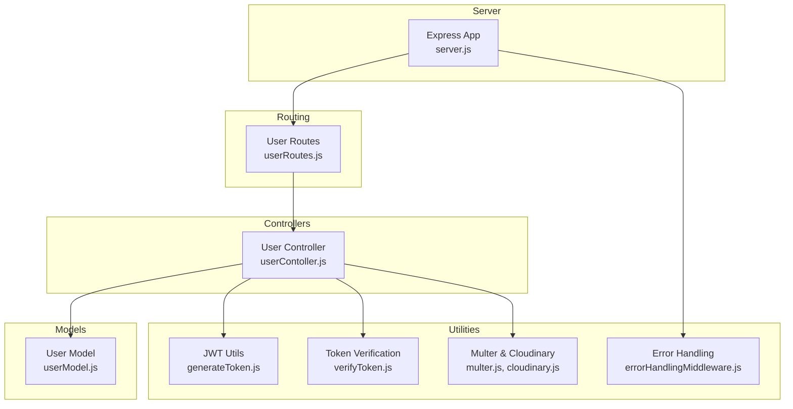
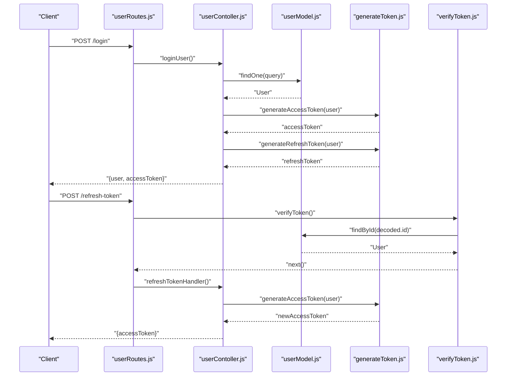
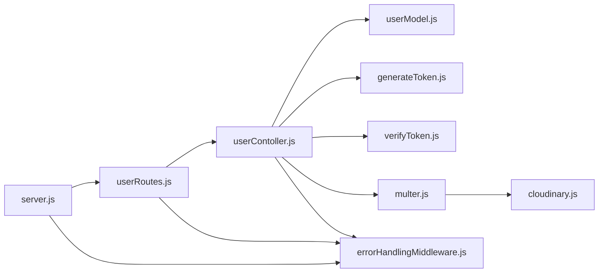

# User Management API

<cite>
**Referenced Files in This Document**
- [userRoutes.js](file://backend/router/userRoutes.js)
- [userContoller.js](file://backend/Controller/userContoller.js)
- [userModel.js](file://backend/model/userModel.js)
- [generateToken.js](file://backend/utils/generateToken.js)
- [verifyToken.js](file://backend/utils/verifyToken.js)
- [multer.js](file://backend/utils/multer.js)
- [cloudinary.js](file://backend/config/cloudinary.js)
- [errorHandlingMiddleware.js](file://backend/utils/errorHandlingMiddleware.js)
- [appError.js](file://backend/utils/appError.js)
- [catchAsync.js](file://backend/utils/catchAsync.js)
- [server.js](file://backend/server.js)
- [AllApiPonts.js](file://frontend/src/APIPoints/AllApiPonts.js)
- [package.json](file://frontend/package.json)
</cite>

## Table of Contents
1. [Introduction](#introduction)
2. [Project Structure](#project-structure)
3. [Core Components](#core-components)
4. [Architecture Overview](#architecture-overview)
5. [Detailed Component Analysis](#detailed-component-analysis)
6. [Dependency Analysis](#dependency-analysis)
7. [Performance Considerations](#performance-considerations)
8. [Troubleshooting Guide](#troubleshooting-guide)
9. [Conclusion](#conclusion)
10. [Appendices](#appendices)

## Introduction
This document provides comprehensive API documentation for the User Management system. It covers authentication endpoints, profile and password management, file upload operations, OTP functionality, and administrative features. For each endpoint, you will find request/response schemas, JWT authentication requirements, file upload specifications, rate limiting details, and error handling patterns. Practical examples are included to guide proper usage with correct authentication headers and payload structures.

## Project Structure
The backend follows a layered architecture:
- Router layer defines endpoints and applies middleware (rate limiting, file upload, authentication).
- Controller layer implements business logic and integrates with models and external services.
- Model layer defines Mongoose schemas and validations.
- Utilities provide shared functionality (JWT generation/verification, file upload via Cloudinary, error handling).
- Server initializes the Express app, middleware, routes, and error handlers.

**Diagram sources**
- [server.js](file://backend/server.js#L34-L76)
- [userRoutes.js](file://backend/router/userRoutes.js#L1-L119)
- [userContoller.js](file://backend/Controller/userContoller.js#L1-L832)
- [userModel.js](file://backend/model/userModel.js#L1-L162)
- [generateToken.js](file://backend/utils/generateToken.js#L1-L28)
- [verifyToken.js](file://backend/utils/verifyToken.js#L1-L33)
- [multer.js](file://backend/utils/multer.js#L1-L52)
- [cloudinary.js](file://backend/config/cloudinary.js#L1-L12)
- [errorHandlingMiddleware.js](file://backend/utils/errorHandlingMiddleware.js#L117-L232)

**Section sources**
- [server.js](file://backend/server.js#L34-L76)
- [userRoutes.js](file://backend/router/userRoutes.js#L1-L119)

## Core Components
- Authentication and Authorization
  - Access tokens are short-lived (15 minutes).
  - Refresh tokens are long-lived (7 days) and stored in HTTP-only cookies.
  - Middleware verifies refresh tokens and attaches user info to the request.
- File Uploads
  - Uses Cloudinary via multer-storage-cloudinary.
  - Configured for user-specific folders and file size limits.
- Rate Limiting
  - Registration endpoint is rate-limited per IP.
- Error Handling
  - Centralized error handler with environment-aware responses.
  - Operational errors are separated from unexpected server errors.

**Section sources**
- [generateToken.js](file://backend/utils/generateToken.js#L3-L27)
- [verifyToken.js](file://backend/utils/verifyToken.js#L5-L28)
- [multer.js](file://backend/utils/multer.js#L33-L44)
- [errorHandlingMiddleware.js](file://backend/utils/errorHandlingMiddleware.js#L117-L232)

## Architecture Overview
The User Management API is exposed under the user routes and protected by middleware. Controllers orchestrate interactions with the database and external services (email notifications). File uploads leverage Cloudinary storage.

**Diagram sources**
- [userRoutes.js](file://backend/router/userRoutes.js#L27-L67)
- [userContoller.js](file://backend/Controller/userContoller.js#L129-L185)
- [userModel.js](file://backend/model/userModel.js#L1-L162)
- [generateToken.js](file://backend/utils/generateToken.js#L3-L27)
- [verifyToken.js](file://backend/utils/verifyToken.js#L5-L28)

## Detailed Component Analysis

### Authentication Endpoints

#### POST /createuser
- Purpose: Register a new user.
- Authentication: None (registration open).
- Rate Limiting: Yes (max 200 per minute per IP).
- Request
  - Content-Type: multipart/form-data
  - Fields:
    - name (required)
    - email (required)
    - password (required)
    - confirmPassword (required)
    - phoneNumber (required)
    - drivingLicenceNumber (optional)
    - userType (optional)
    - File: files (single image/document)
- Response
  - 201 Created: "User is created"
  - 400 Bad Request: Validation errors
  - 409 Conflict: User already exists
- Notes
  - File is stored via Cloudinary under the users folder.
  - Password hashing occurs in the model pre-save hook.

**Section sources**
- [userRoutes.js](file://backend/router/userRoutes.js#L21-L26)
- [userContoller.js](file://backend/Controller/userContoller.js#L25-L92)
- [userModel.js](file://backend/model/userModel.js#L134-L139)
- [multer.js](file://backend/utils/multer.js#L41-L44)

#### POST /login
- Purpose: Authenticate user and issue access/refresh tokens.
- Authentication: None.
- Request
  - Content-Type: application/json
  - Body: { userId, password }
    - userId can be email or phone number.
- Response
  - 200 OK: { user, accessToken }
  - 400 Bad Request: Invalid credentials
- Cookies
  - refreshToken: HTTP-only, secure, sameSite strict, 7-day expiry.

**Section sources**
- [userRoutes.js](file://backend/router/userRoutes.js#L27-L28)
- [userContoller.js](file://backend/Controller/userContoller.js#L129-L161)
- [generateToken.js](file://backend/utils/generateToken.js#L3-L27)

#### POST /refresh-token
- Purpose: Generate a new access token using a valid refresh token.
- Authentication: Requires refresh token cookie.
- Request
  - Cookie: refreshToken
- Response
  - 200 OK: { accessToken }
  - 401 Unauthorized: No refresh token or invalid
  - 403 Forbidden: Expired refresh token

**Section sources**
- [userRoutes.js](file://backend/router/userRoutes.js#L66-L67)
- [userContoller.js](file://backend/Controller/userContoller.js#L164-L185)
- [verifyToken.js](file://backend/utils/verifyToken.js#L5-L28)

#### POST /logout
- Purpose: Clear refresh token cookie and reset user OTP/flags.
- Authentication: Requires refresh token verification.
- Response
  - 200 OK: { message }
  - Clears refreshToken cookie.

**Section sources**
- [userRoutes.js](file://backend/router/userRoutes.js#L41-L41)
- [userContoller.js](file://backend/Controller/userContoller.js#L609-L632)

#### POST /checkAuth
- Purpose: Verify current authentication state.
- Authentication: Requires refresh token verification.
- Response
  - 200 OK: { data: { user } }
  - 401 Unauthorized: Not authenticated

**Section sources**
- [userRoutes.js](file://backend/router/userRoutes.js#L44-L44)
- [userContoller.js](file://backend/Controller/userContoller.js#L645-L658)
- [verifyToken.js](file://backend/utils/verifyToken.js#L5-L28)

### Profile Management

#### GET /myprofile
- Purpose: Retrieve authenticated user’s profile.
- Authentication: Requires refresh token verification.
- Response
  - 200 OK: { message, user }
  - Selected fields include name, email, phoneNumber, userType, altMobileNumber, filePath, bookingInfo, drivingLicenceNumber, drivingLicenceFilePath, isDLverify, currentLocation.

**Section sources**
- [userRoutes.js](file://backend/router/userRoutes.js#L48-L48)
- [userContoller.js](file://backend/Controller/userContoller.js#L272-L285)
- [userModel.js](file://backend/model/userModel.js#L6-L128)

#### PATCH /updateuserdetails
- Purpose: Update user details (name, driving license number, alternate mobile number, current location).
- Authentication: Requires refresh token verification.
- Request
  - Content-Type: application/json
  - Body: { name, drivingLicenceNumber, altMobileNumber, currentLocation }
- Response
  - 200 OK: { message, user }
  - 400 Bad Request: Validation errors (e.g., alternate mobile number must be 10 digits)

**Section sources**
- [userRoutes.js](file://backend/router/userRoutes.js#L49-L53)
- [userContoller.js](file://backend/Controller/userContoller.js#L287-L330)
- [userModel.js](file://backend/model/userModel.js#L76-L83)

### Password Management

#### PATCH /changepassword
- Purpose: Change user password.
- Authentication: Requires refresh token verification.
- Request
  - Content-Type: application/json
  - Body: { oldPassword, newPassword, confirmNewPassword }
- Response
  - 200 OK: { message, user }
  - 400 Bad Request: Validation errors (e.g., old password incorrect, mismatched new passwords)

**Section sources**
- [userRoutes.js](file://backend/router/userRoutes.js#L33-L33)
- [userContoller.js](file://backend/Controller/userContoller.js#L495-L557)
- [userModel.js](file://backend/model/userModel.js#L155-L158)

#### POST /forgotPasswordemail
- Purpose: Send a password reset link to the user’s email.
- Authentication: None.
- Request
  - Content-Type: application/json
  - Body: { email }
- Response
  - 200 OK: { status, message }
  - Reset token expires in 1 hour.

**Section sources**
- [userRoutes.js](file://backend/router/userRoutes.js#L55-L58)
- [userContoller.js](file://backend/Controller/userContoller.js#L661-L703)

#### POST /resetpassword
- Purpose: Reset password using the token from the reset link.
- Authentication: None.
- Request
  - Content-Type: application/json
  - Body: { token, email, password, confirmPassword }
- Response
  - 200 OK: { status, message }
  - 400 Bad Request: Invalid/expired token or mismatched passwords

**Section sources**
- [userRoutes.js](file://backend/router/userRoutes.js#L59-L59)
- [userContoller.js](file://backend/Controller/userContoller.js#L706-L739)

### File Upload Operations

#### POST /uploadProfilePhoto
- Purpose: Upload user profile photo.
- Authentication: Requires refresh token verification.
- Request
  - Content-Type: multipart/form-data
  - Field: files (single image)
- Response
  - 200 OK: { status, message, data: { filePath } }
  - 400 Bad Request: Missing file or validation errors
  - 401 Unauthorized: Not authorized
  - 404 Not Found: User not found

**Section sources**
- [userRoutes.js](file://backend/router/userRoutes.js#L70-L75)
- [userContoller.js](file://backend/Controller/userContoller.js#L378-L418)
- [multer.js](file://backend/utils/multer.js#L41-L44)
- [cloudinary.js](file://backend/config/cloudinary.js#L5-L9)

#### POST /uploadDrivingLicence
- Purpose: Upload driving license document.
- Authentication: Requires refresh token verification.
- Request
  - Content-Type: multipart/form-data
  - Field: files (single document/image)
- Response
  - 200 OK: { status, message, data: { drivingLicenceFilePath, isDLverify } }
  - 400 Bad Request: Missing file
  - 401 Unauthorized: Not authorized
  - 404 Not Found: User not found

**Section sources**
- [userRoutes.js](file://backend/router/userRoutes.js#L77-L82)
- [userContoller.js](file://backend/Controller/userContoller.js#L333-L377)
- [multer.js](file://backend/utils/multer.js#L41-L44)
- [cloudinary.js](file://backend/config/cloudinary.js#L5-L9)

#### GET /downloadDrivingLicence
- Purpose: Retrieve the URL of the uploaded driving license document.
- Authentication: Requires refresh token verification.
- Response
  - 200 OK: { fileUrl }
  - 404 Not Found: Document not found

**Section sources**
- [userRoutes.js](file://backend/router/userRoutes.js#L83-L87)
- [userContoller.js](file://backend/Controller/userContoller.js#L421-L433)

#### POST /download/:id
- Purpose: Download a user’s file by ID.
- Authentication: Requires refresh token verification.
- Response
  - 200 OK: File stream
  - 404 Not Found: User not found

**Section sources**
- [userRoutes.js](file://backend/router/userRoutes.js#L29-L30)
- [userContoller.js](file://backend/Controller/userContoller.js#L599-L606)

### OTP Functionality

#### POST /sendOtp
- Purpose: Send OTP to the user’s email.
- Authentication: None.
- Request
  - Content-Type: application/json
  - Body: { email }
- Response
  - 200 OK: { status, message }
  - 400 Bad Request: Missing email or invalid user
  - OTP expires in 10 minutes.

**Section sources**
- [userRoutes.js](file://backend/router/userRoutes.js#L64-L64)
- [userContoller.js](file://backend/Controller/userContoller.js#L95-L126)

#### POST /verifyOtp
- Purpose: Verify OTP and log the user in upon success.
- Authentication: None.
- Request
  - Content-Type: application/json
  - Body: { email, otp }
- Response
  - 200 OK: { user, accessToken } and sets refreshToken cookie
  - 400 Bad Request: Invalid/missing email/otp or expired OTP
  - 404 Not Found: User not found

**Section sources**
- [userRoutes.js](file://backend/router/userRoutes.js#L65-L65)
- [userContoller.js](file://backend/Controller/userContoller.js#L219-L269)

### Administrative Features

#### GET /fetchDLList
- Purpose: Fetch all users whose driving licenses are not yet verified.
- Authentication: Requires refresh token verification.
- Authorization: admin role required.
- Response
  - 200 OK: { status, message, data: [users] }
  - 200 OK: { status, message, data: [] } if none found

**Section sources**
- [userRoutes.js](file://backend/router/userRoutes.js#L89-L95)
- [userContoller.js](file://backend/Controller/userContoller.js#L463-L492)
- [userModel.js](file://backend/model/userModel.js#L52-L58)

#### PATCH /verifyDrivingLicenceDocument
- Purpose: Mark a user’s driving license as verified.
- Authentication: Requires refresh token verification.
- Authorization: admin role required.
- Request
  - Content-Type: application/json
  - Body: { userID }
- Response
  - 200 OK: { status, message }
  - 404 Not Found: User not found

**Section sources**
- [userRoutes.js](file://backend/router/userRoutes.js#L97-L102)
- [userContoller.js](file://backend/Controller/userContoller.js#L436-L461)

### Request/Response Schemas

- Common Request Headers
  - Content-Type: application/json (for JSON endpoints)
  - Content-Type: multipart/form-data (for file uploads)
  - Cookie: refreshToken (for protected endpoints requiring refresh token verification)

- Common Responses
  - Success: { status: "success", ... }
  - Client Error: { status: "fail", error: "..." }
  - Server Error: { status: "error", message: "..." }

- Example Payloads
  - POST /createuser
    - Body: { name, email, password, confirmPassword, phoneNumber, drivingLicenceNumber?, userType? }
    - File: files (image/document)
  - POST /login
    - Body: { userId, password }
  - PATCH /updateuserdetails
    - Body: { name?, drivingLicenceNumber?, altMobileNumber?, currentLocation? }
  - PATCH /changepassword
    - Body: { oldPassword, newPassword, confirmNewPassword }
  - POST /forgotPasswordemail
    - Body: { email }
  - POST /resetpassword
    - Body: { token, email, password, confirmPassword }
  - POST /uploadProfilePhoto
    - Form-Data: files (image)
  - POST /uploadDrivingLicence
    - Form-Data: files (document/image)
  - POST /sendOtp
    - Body: { email }
  - POST /verifyOtp
    - Body: { email, otp }
  - PATCH /verifyDrivingLicenceDocument
    - Body: { userID }

- Authentication Examples
  - After successful login, use the returned accessToken for subsequent requests (where applicable) or rely on refresh token verification for protected endpoints.
  - For endpoints requiring refresh token verification, ensure the refreshToken cookie is present.

**Section sources**
- [userRoutes.js](file://backend/router/userRoutes.js#L1-L119)
- [userContoller.js](file://backend/Controller/userContoller.js#L25-L92)
- [userContoller.js](file://backend/Controller/userContoller.js#L129-L185)
- [userContoller.js](file://backend/Controller/userContoller.js#L287-L330)
- [userContoller.js](file://backend/Controller/userContoller.js#L495-L557)
- [userContoller.js](file://backend/Controller/userContoller.js#L661-L739)
- [userContoller.js](file://backend/Controller/userContoller.js#L333-L418)
- [userContoller.js](file://backend/Controller/userContoller.js#L95-L126)
- [userContoller.js](file://backend/Controller/userContoller.js#L219-L269)
- [userContoller.js](file://backend/Controller/userContoller.js#L436-L492)

## Dependency Analysis

**Diagram sources**
- [userRoutes.js](file://backend/router/userRoutes.js#L1-L119)
- [userContoller.js](file://backend/Controller/userContoller.js#L1-L832)
- [userModel.js](file://backend/model/userModel.js#L1-L162)
- [generateToken.js](file://backend/utils/generateToken.js#L1-L28)
- [verifyToken.js](file://backend/utils/verifyToken.js#L1-L33)
- [multer.js](file://backend/utils/multer.js#L1-L52)
- [cloudinary.js](file://backend/config/cloudinary.js#L1-L12)
- [errorHandlingMiddleware.js](file://backend/utils/errorHandlingMiddleware.js#L117-L232)
- [server.js](file://backend/server.js#L34-L76)

**Section sources**
- [userRoutes.js](file://backend/router/userRoutes.js#L1-L119)
- [userContoller.js](file://backend/Controller/userContoller.js#L1-L832)
- [server.js](file://backend/server.js#L34-L76)

## Performance Considerations
- Rate Limiting
  - Registration endpoint is rate-limited to prevent abuse.
- File Upload Limits
  - Single file upload limit: 10 MB.
  - Array uploads: up to 5 files with 5 MB each.
- Token Lifetimes
  - Access tokens expire quickly (15 minutes) to minimize risk.
  - Refresh tokens are long-lived (7 days) and stored securely in HTTP-only cookies.
- Pagination
  - Audit logs endpoint supports pagination via page and limit query parameters.

**Section sources**
- [userRoutes.js](file://backend/router/userRoutes.js#L13-L18)
- [multer.js](file://backend/utils/multer.js#L25-L44)
- [generateToken.js](file://backend/utils/generateToken.js#L11-L26)
- [userContoller.js](file://backend/Controller/userContoller.js#L789-L814)

## Troubleshooting Guide
- Authentication Failures
  - 401 Unauthorized: No refresh token provided or invalid token.
  - 403 Forbidden: Expired refresh token.
- Validation Errors
  - 400 Bad Request: Missing required fields, invalid input (e.g., phone number length), mismatched passwords.
- Resource Not Found
  - 404 Not Found: User not found, document not found, audit log not found.
- Operational vs Unexpected Errors
  - Operational errors are returned with a concise message.
  - Unexpected server errors return a generic message in production.

**Section sources**
- [verifyToken.js](file://backend/utils/verifyToken.js#L8-L28)
- [errorHandlingMiddleware.js](file://backend/utils/errorHandlingMiddleware.js#L134-L138)
- [userContoller.js](file://backend/Controller/userContoller.js#L49-L50)
- [userContoller.js](file://backend/Controller/userContoller.js#L503-L511)
- [userContoller.js](file://backend/Controller/userContoller.js#L668-L670)

## Conclusion
The User Management API provides robust authentication, secure file handling via Cloudinary, comprehensive profile and password management, OTP-based verification, and administrative controls for driving license verification. The documented endpoints, schemas, and error patterns enable reliable integration with clients while maintaining strong security and operational hygiene.

## Appendices

### JWT and Cookie Details
- Access Token
  - Expires: 15 minutes
  - Used for short-lived operations where applicable
- Refresh Token
  - Expires: 7 days
  - Stored as HTTP-only, secure cookie
  - Used to obtain new access tokens

**Section sources**
- [generateToken.js](file://backend/utils/generateToken.js#L11-L26)
- [userContoller.js](file://backend/Controller/userContoller.js#L144-L149)
- [userContoller.js](file://backend/Controller/userContoller.js#L622-L626)

### File Upload Specifications
- Allowed Formats: jpg, jpeg, png, pdf
- Size Limits:
  - Single file: 10 MB
  - Array of files: up to 5 files, 5 MB each
- Storage: Cloudinary users folder

**Section sources**
- [multer.js](file://backend/utils/multer.js#L14-L14)
- [multer.js](file://backend/utils/multer.js#L35-L36)
- [multer.js](file://backend/utils/multer.js#L43-L44)
- [cloudinary.js](file://backend/config/cloudinary.js#L5-L9)

### Frontend Environment and Base URLs
- Frontend reads the server API base URL from environment variables.
- Ensure REACT_APP_API_SERVER_URL is configured appropriately for development and production.

**Section sources**
- [AllApiPonts.js](file://frontend/src/APIPoints/AllApiPonts.js#L1-L2)
- [package.json](file://frontend/package.json#L38-L42)