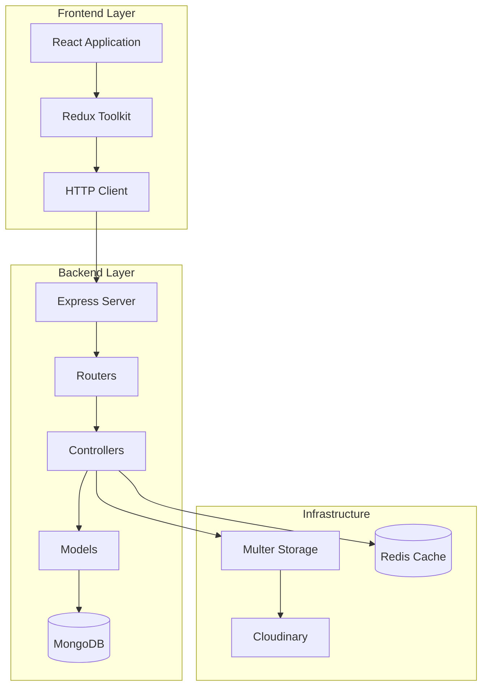
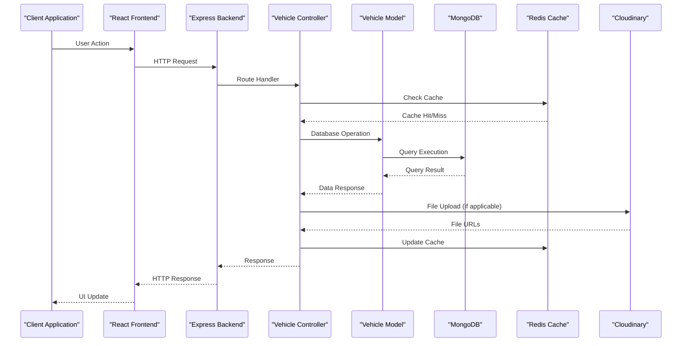
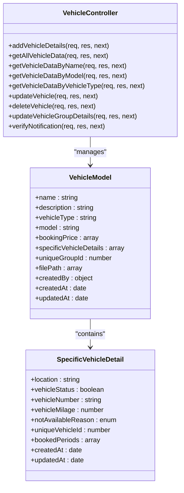
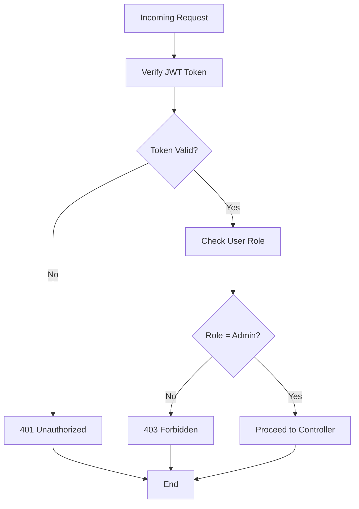
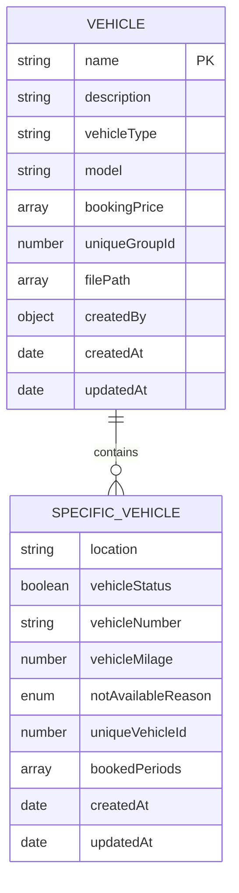
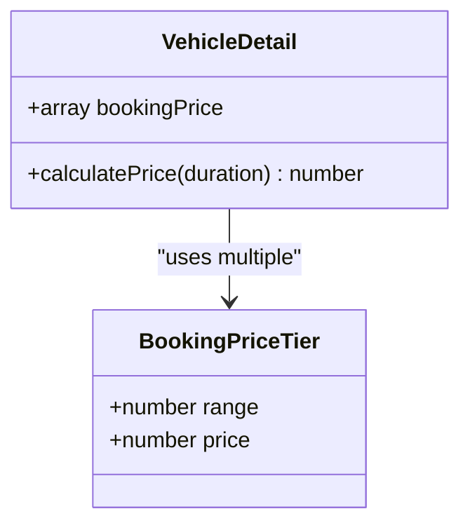
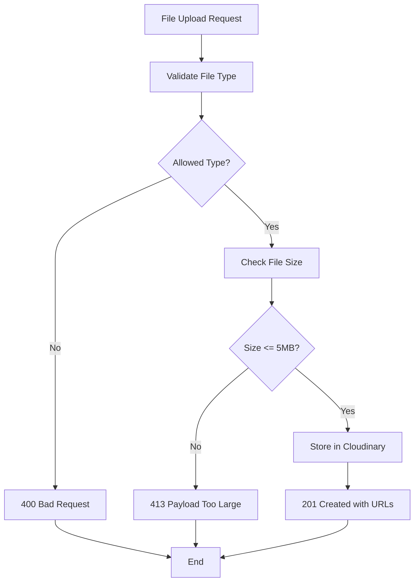

# Vehicle Management API

<cite>
**Referenced Files in This Document**
- [vehicleRoute.js](file://backend/router/vehicleRoute.js)
- [vehicleController.js](file://backend/Controller/vehicleController.js)
- [vehicleDetailModel.js](file://backend/model/vehicleDetailModel.js)
- [multer.js](file://backend/utils/multer.js)
- [cloudinary.js](file://backend/config/cloudinary.js)
- [server.js](file://backend/server.js)
- [getvehicleSlice.js](file://frontend/src/appRedux/redux/vehicleSlice/getvehicleSlice.js)
- [addVehicleSlice.js](file://frontend/src/appRedux/redux/vehicleSlice/addVehicleSlice.js)
- [deletevehicleSlice.js](file://frontend/src/appRedux/redux/vehicleSlice/deletevehicleSlice.js)
- [groupVehicleUpdateSlice.js](file://frontend/src/appRedux/redux/vehicleSlice/groupVehicleUpdateSlice.js)
- [AxiosSetup.js](file://frontend/src/axiosInterceptors/AxiosSetup.js)
</cite>

## Table of Contents
1. [Introduction](#introduction)
2. [Project Structure](#project-structure)
3. [Core Components](#core-components)
4. [Architecture Overview](#architecture-overview)
5. [Detailed Component Analysis](#detailed-component-analysis)
6. [API Reference](#api-reference)
7. [Data Models](#data-models)
8. [File Upload Specifications](#file-upload-specifications)
9. [Response Formats](#response-formats)
10. [Examples and Scenarios](#examples-and-scenarios)
11. [Performance Considerations](#performance-considerations)
12. [Troubleshooting Guide](#troubleshooting-guide)
13. [Conclusion](#conclusion)

## Introduction
This document provides comprehensive API documentation for the Vehicle Management system. It covers vehicle CRUD operations, listing and filtering capabilities, batch operations for vehicle groups, and status management. The documentation includes request schemas, response formats, file upload specifications, and practical examples for different vehicle categories and operational scenarios.

## Project Structure
The Vehicle Management system follows a layered architecture with clear separation of concerns:
- Backend: Express.js server with MongoDB/Mongoose for data persistence
- Frontend: React application with Redux Toolkit for state management
- Middleware: Multer for file uploads, Cloudinary for image storage
- Authentication: JWT token verification and role-based access control



**Diagram sources**
- [server.js](file://backend/server.js#L34-L76)
- [vehicleRoute.js](file://backend/router/vehicleRoute.js#L1-L42)

**Section sources**
- [server.js](file://backend/server.js#L1-L204)
- [vehicleRoute.js](file://backend/router/vehicleRoute.js#L1-L42)

## Core Components
The system consists of several key components working together:

### Backend Controllers
- Vehicle Controller: Handles all vehicle-related operations including CRUD, grouping, and status management
- Reports Controller: Manages vehicle availability reporting and analytics
- User Controller: Handles user management and authentication

### Data Models
- Vehicle Detail Model: Defines the vehicle schema with embedded specific vehicle details
- User Model: Manages user accounts and authentication
- Booking Model: Handles vehicle booking and reservation management

### Middleware and Utilities
- Multer Configuration: Manages file uploads with Cloudinary integration
- Authentication Middleware: Validates JWT tokens and enforces role-based access
- Error Handling: Centralized error management with appropriate HTTP status codes

**Section sources**
- [vehicleController.js](file://backend/Controller/vehicleController.js#L1-L824)
- [vehicleDetailModel.js](file://backend/model/vehicleDetailModel.js#L1-L145)

## Architecture Overview
The system implements a microservice-like architecture with clear separation between frontend and backend:



**Diagram sources**
- [server.js](file://backend/server.js#L34-L76)
- [vehicleController.js](file://backend/Controller/vehicleController.js#L211-L240)
- [multer.js](file://backend/utils/multer.js#L25-L28)

## Detailed Component Analysis

### Vehicle Controller Operations
The vehicle controller implements comprehensive CRUD operations with transaction support and audit logging:



**Diagram sources**
- [vehicleController.js](file://backend/Controller/vehicleController.js#L21-L203)
- [vehicleDetailModel.js](file://backend/model/vehicleDetailModel.js#L55-L105)

**Section sources**
- [vehicleController.js](file://backend/Controller/vehicleController.js#L21-L824)
- [vehicleDetailModel.js](file://backend/model/vehicleDetailModel.js#L1-L145)

### Authentication and Authorization Flow
The system implements JWT-based authentication with role-based access control:



**Diagram sources**
- [vehicleRoute.js](file://backend/router/vehicleRoute.js#L8-L14)
- [vehicleRoute.js](file://backend/router/vehicleRoute.js#L16-L21)

**Section sources**
- [vehicleRoute.js](file://backend/router/vehicleRoute.js#L1-L42)

## API Reference

### Base URL
The API is served from the backend server configured in the environment variables. The frontend communicates with the backend through the configured API endpoint.

### Authentication Headers
All protected endpoints require:
- Authorization: Bearer <JWT_TOKEN>
- Content-Type: application/json
- Cookie: withCredentials enabled for cross-origin requests

### Response Format
Standard response structure:
```javascript
{
  "status": "success" | "error",
  "message": "string",
  "data": {},
  "source": "cache" | "db" // for caching-enabled endpoints
}
```

### Vehicle CRUD Operations

#### GET /getallvehicle
Retrieves all vehicles with caching support.

**Request:**
- Method: GET
- Headers: Authorization, Content-Type
- Query Parameters: None

**Response:**
- Status: 200
- Body: Vehicle list with cache source indicator

**Section sources**
- [vehicleRoute.js](file://backend/router/vehicleRoute.js#L28-L28)
- [vehicleController.js](file://backend/Controller/vehicleController.js#L211-L240)

#### POST /createvehicle
Creates a new vehicle with image upload support.

**Request:**
- Method: POST
- Headers: Authorization, Content-Type (multipart/form-data)
- Form Fields:
  - files: Array of vehicle images (up to 5 files)
  - name: Required string
  - description: Optional string
  - vehicleType: Required string
  - model: Required string
  - vehicleNumber: Required unique string
  - location: Optional string
  - vehicleStatus: Optional boolean (default: true)
  - vehicleMilage: Optional number
  - notAvailableReason: Optional enum
  - bookingPrice: Required array of pricing tiers

**Response:**
- Status: 201
- Body: Created vehicle data with audit trail

**Section sources**
- [vehicleRoute.js](file://backend/router/vehicleRoute.js#L8-L14)
- [vehicleController.js](file://backend/Controller/vehicleController.js#L21-L203)

#### GET /getvehiclebyname
Searches vehicles by name.

**Request:**
- Method: GET
- Headers: Authorization, Content-Type
- Body: { name: "string" }

**Response:**
- Status: 200
- Body: Matching vehicle data

**Section sources**
- [vehicleRoute.js](file://backend/router/vehicleRoute.js#L29-L29)
- [vehicleController.js](file://backend/Controller/vehicleController.js#L243-L256)

#### GET /getvehicledatabymodel
Searches vehicles by model.

**Request:**
- Method: GET
- Headers: Authorization, Content-Type
- Body: { model: "string" }

**Response:**
- Status: 200
- Body: Array of matching vehicles

**Section sources**
- [vehicleRoute.js](file://backend/router/vehicleRoute.js#L30-L30)
- [vehicleController.js](file://backend/Controller/vehicleController.js#L259-L274)

#### GET /getvehiclebytype
Searches vehicles by type.

**Request:**
- Method: GET
- Headers: Authorization, Content-Type
- Body: { vehicleType: "string" }

**Response:**
- Status: 200
- Body: Array of matching vehicles

**Section sources**
- [vehicleRoute.js](file://backend/router/vehicleRoute.js#L31-L31)
- [vehicleController.js](file://backend/Controller/vehicleController.js#L276-L291)

#### PATCH /updatevehicle/:uniqueId
Updates specific vehicle details.

**Request:**
- Method: PATCH
- Headers: Authorization, Content-Type
- Path Parameters: uniqueId (vehicle identifier)
- Body: Partial vehicle details to update

**Response:**
- Status: 200
- Body: Updated vehicle data with changed fields list

**Section sources**
- [vehicleRoute.js](file://backend/router/vehicleRoute.js#L16-L21)
- [vehicleController.js](file://backend/Controller/vehicleController.js#L295-L446)

#### DELETE /deletevehicle/:uniqueId
Deletes specific vehicle details.

**Request:**
- Method: DELETE
- Headers: Authorization, Content-Type
- Path Parameters: uniqueId (vehicle identifier)

**Response:**
- Status: 200
- Body: Deletion confirmation and deleted vehicle details

**Section sources**
- [vehicleRoute.js](file://backend/router/vehicleRoute.js#L22-L27)
- [vehicleController.js](file://backend/Controller/vehicleController.js#L552-L667)

### Batch Operations

#### PATCH /updatevehiclegroup/:groupId
Updates entire vehicle group with bulk pricing changes.

**Request:**
- Method: PATCH
- Headers: Authorization, Content-Type
- Path Parameters: groupId (vehicle group identifier)
- Body: Group-level updates (name, model, vehicleType, bookingPrice)

**Response:**
- Status: 200
- Body: Updated group data with changed fields list

**Section sources**
- [vehicleRoute.js](file://backend/router/vehicleRoute.js#L32-L37)
- [vehicleController.js](file://backend/Controller/vehicleController.js#L671-L808)

### Vehicle Status Management

#### Availability Filtering
The system supports vehicle availability filtering through database queries and aggregation pipelines. While direct endpoints for availability filtering are not explicitly defined in the current implementation, the underlying data model supports:

- Vehicle status tracking (true/false)
- Not available reasons (In Repair, Accident, Other, Booking)
- Booking period management
- Location-based filtering

**Section sources**
- [vehicleDetailModel.js](file://backend/model/vehicleDetailModel.js#L6-L53)

## Data Models

### Vehicle Schema
The vehicle data model uses MongoDB's embedded document pattern for efficient querying:



**Diagram sources**
- [vehicleDetailModel.js](file://backend/model/vehicleDetailModel.js#L55-L105)

### Pricing Structure
Booking prices are defined as tiered pricing with range-based calculations:



**Diagram sources**
- [vehicleDetailModel.js](file://backend/model/vehicleDetailModel.js#L75-L86)

**Section sources**
- [vehicleDetailModel.js](file://backend/model/vehicleDetailModel.js#L1-L145)

## File Upload Specifications

### Upload Configuration
The system uses Multer with Cloudinary integration for secure file handling:



**Diagram sources**
- [multer.js](file://backend/utils/multer.js#L25-L28)
- [cloudinary.js](file://backend/config/cloudinary.js#L1-L12)

### Supported File Types
- Images: JPG, JPEG, PNG
- Maximum file size: 5MB per image
- Maximum images per upload: 5
- Storage location: Cloudinary 'vehicles' folder

**Section sources**
- [multer.js](file://backend/utils/multer.js#L1-L52)
- [cloudinary.js](file://backend/config/cloudinary.js#L1-L12)

## Response Formats

### Standard Success Response
```javascript
{
  "status": "success",
  "message": "string",
  "data": {},
  "source": "cache" | "db" // optional
}
```

### Standard Error Response
```javascript
{
  "status": "error",
  "message": "string",
  "error": "string"
}
```

### Vehicle List Response
```javascript
{
  "message": "All Vehicle Data (from cache)",
  "source": "redis",
  "data": [
    {
      "name": "string",
      "vehicleType": "string", 
      "model": "string",
      "bookingPrice": [
        {"range": 60, "price": 600}
      ],
      "specificVehicleDetails": [
        {
          "vehicleNumber": "string",
          "vehicleStatus": true,
          "location": "string",
          "uniqueVehicleId": 123456789
        }
      ]
    }
  ]
}
```

**Section sources**
- [vehicleController.js](file://backend/Controller/vehicleController.js#L211-L240)
- [vehicleController.js](file://backend/Controller/vehicleController.js#L441-L446)

## Examples and Scenarios

### Example 1: Adding a New Bike
**Request:**
- Endpoint: POST /createvehicle
- Form data includes:
  - name: "Honda CB Hornet"
  - vehicleType: "Bike"
  - model: "2023"
  - vehicleNumber: "KA03CD1234"
  - bookingPrice: [{"range": 24, "price": 1200}, {"range": 48, "price": 2200}]
  - files: [bike_image.jpg]

**Expected Response:**
- Status: 201
- Data includes vehicle details with unique identifiers

### Example 2: Updating Vehicle Availability
**Request:**
- Endpoint: PATCH /updatevehicle/:uniqueId
- Path parameter: uniqueId = vehicle identifier
- Body: { vehicleStatus: false, notAvailableReason: "In Repair" }

**Expected Response:**
- Status: 200
- Includes changedFields array showing modifications

### Example 3: Bulk Group Update
**Request:**
- Endpoint: PATCH /updatevehiclegroup/:groupId
- Path parameter: groupId = vehicle group identifier
- Body: { bookingPrice: [{"range": 24, "price": 1100}] }

**Expected Response:**
- Status: 200
- Includes updated group data and changed fields

### Example 4: Vehicle Search Operations
**Request:** GET /getvehicledatabymodel
- Body: { model: "2023" }

**Expected Response:**
- Status: 200
- Array of all vehicles matching the model year

**Section sources**
- [vehicleController.js](file://backend/Controller/vehicleController.js#L21-L203)
- [vehicleController.js](file://backend/Controller/vehicleController.js#L295-L446)
- [vehicleController.js](file://backend/Controller/vehicleController.js#L671-L808)

## Performance Considerations

### Caching Strategy
The system implements Redis caching for frequently accessed vehicle data:
- Cache key: "vehicles:all"
- TTL: 600 seconds (10 minutes)
- Automatic cache invalidation on data changes
- Dual-source retrieval (cache → database fallback)

### Database Indexing
Recommended indexes for optimal performance:
- uniqueVehicleId: unique index
- vehicleNumber: unique index  
- uniqueGroupId: unique index
- specificVehicleDetails.vehicleStatus: compound index
- specificVehicleDetails.vehicleNumber: text index

### File Storage Optimization
- Cloudinary CDN for global content delivery
- Automatic image optimization
- Support for responsive image variants

**Section sources**
- [vehicleController.js](file://backend/Controller/vehicleController.js#L211-L240)
- [vehicleDetailModel.js](file://backend/model/vehicleDetailModel.js#L107-L115)

## Troubleshooting Guide

### Common Error Scenarios

#### Authentication Issues
- **401 Unauthorized**: Missing or invalid JWT token
- **403 Forbidden**: User lacks admin privileges
- **Cause**: Expired token or incorrect user role

#### Data Validation Errors
- **400 Bad Request**: Missing required fields or invalid data format
- **400 Bad Request**: Duplicate vehicle number
- **400 Bad Request**: Invalid booking price format

#### Resource Not Found
- **404 Not Found**: Vehicle or vehicle group not found
- **404 Not Found**: Specific vehicle details not found

#### File Upload Issues
- **413 Payload Too Large**: File exceeds 5MB limit
- **400 Bad Request**: Unsupported file type
- **400 Bad Request**: No files provided

### Debugging Steps
1. Verify JWT token in Authorization header
2. Check user role is "admin" for protected endpoints
3. Validate request payload against schema requirements
4. Confirm file upload meets size and type restrictions
5. Monitor Redis cache status for caching-related issues

**Section sources**
- [vehicleController.js](file://backend/Controller/vehicleController.js#L37-L43)
- [vehicleController.js](file://backend/Controller/vehicleController.js#L41-L43)
- [multer.js](file://backend/utils/multer.js#L27-L28)

## Conclusion
The Vehicle Management API provides a comprehensive solution for vehicle lifecycle management with robust CRUD operations, efficient caching, secure file handling, and role-based access control. The system's modular architecture supports scalability and maintainability while providing flexible vehicle management capabilities for various operational scenarios.

Key strengths include:
- Complete vehicle lifecycle management
- Efficient caching and database optimization
- Secure file upload with Cloudinary integration
- Comprehensive error handling and validation
- Flexible search and filtering capabilities
- Audit logging and transaction support

The API is designed to handle diverse vehicle categories and operational requirements while maintaining performance and reliability standards.