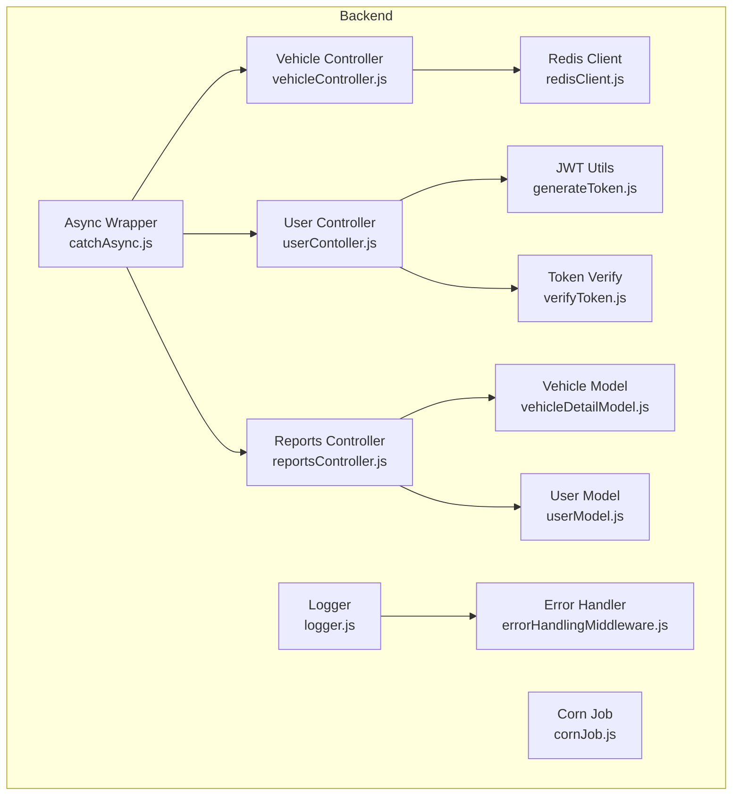
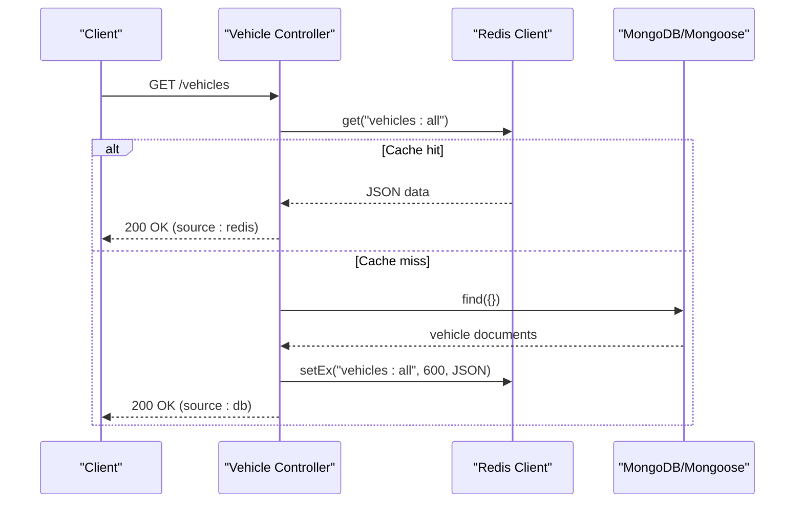
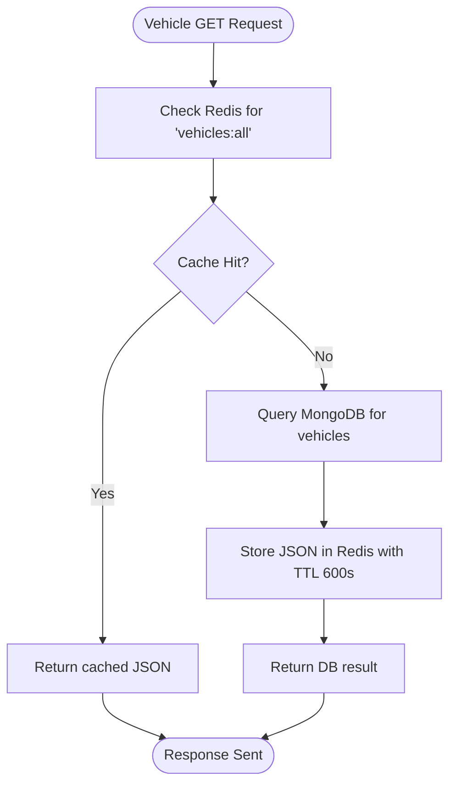
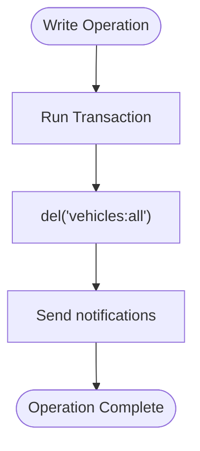
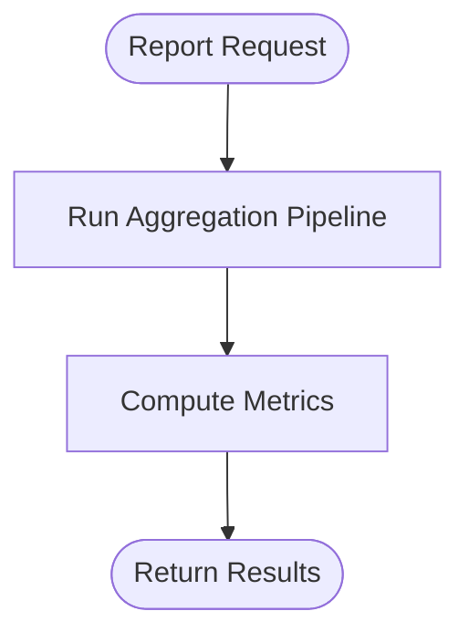
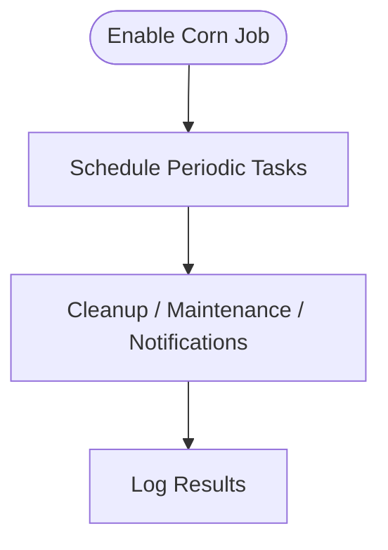
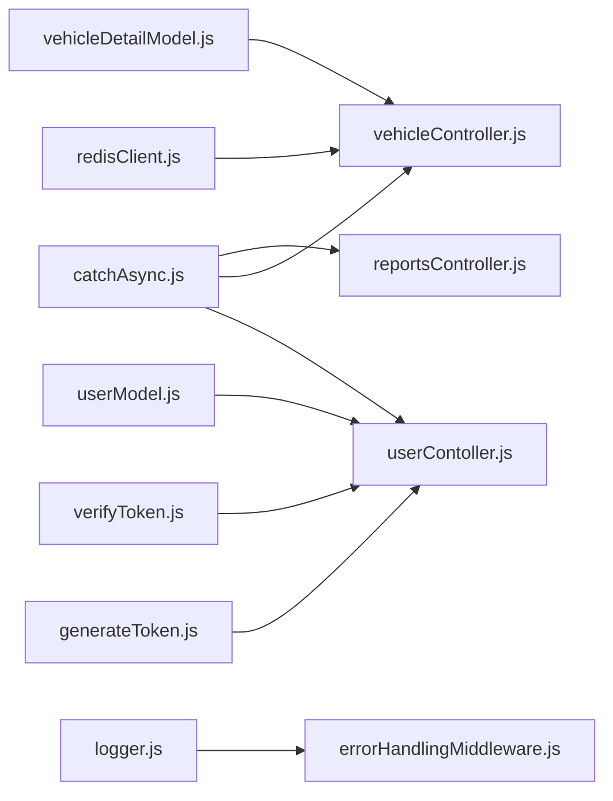

# Caching & Performance

<cite>
**Referenced Files in This Document**
- [redisClient.js](file://backend/config/redisClient.js)
- [generateToken.js](file://backend/utils/generateToken.js)
- [verifyToken.js](file://backend/utils/verifyToken.js)
- [userModel.js](file://backend/model/userModel.js)
- [vehicleDetailModel.js](file://backend/model/vehicleDetailModel.js)
- [userContoller.js](file://backend/Controller/userContoller.js)
- [vehicleController.js](file://backend/Controller/vehicleController.js)
- [reportsController.js](file://backend/Controller/reportsController.js)
- [logger.js](file://backend/utils/logger.js)
- [errorHandlingMiddleware.js](file://backend/utils/errorHandlingMiddleware.js)
- [catchAsync.js](file://backend/utils/catchAsync.js)
- [package.json](file://backend/package.json)
- [cornJob.js](file://backend/cornJob/cornJob.js)
</cite>

## Table of Contents
1. [Introduction](#introduction)
2. [Project Structure](#project-structure)
3. [Core Components](#core-components)
4. [Architecture Overview](#architecture-overview)
5. [Detailed Component Analysis](#detailed-component-analysis)
6. [Dependency Analysis](#dependency-analysis)
7. [Performance Considerations](#performance-considerations)
8. [Troubleshooting Guide](#troubleshooting-guide)
9. [Conclusion](#conclusion)
10. [Appendices](#appendices)

## Introduction
This document explains the caching strategies and performance optimization implemented in the backend service. It focuses on Redis-backed caching for frequently accessed data, JWT token handling, cache invalidation, and operational automation via a scheduled job. It also outlines performance monitoring, load balancing, horizontal scaling, cache warming, backups, and troubleshooting methodologies.

## Project Structure
The backend leverages Redis for caching, JWT for authentication, and aggregation pipelines for reporting. Controllers coordinate data retrieval and updates, while models define schemas and indexes. Utility modules centralize logging, error handling, and async wrappers. A corn job file is present for future automation.



**Diagram sources**
- [redisClient.js](file://backend/config/redisClient.js#L1-L20)
- [userContoller.js](file://backend/Controller/userContoller.js#L129-L185)
- [vehicleController.js](file://backend/Controller/vehicleController.js#L211-L240)
- [reportsController.js](file://backend/Controller/reportsController.js#L1-L641)
- [userModel.js](file://backend/model/userModel.js#L1-L162)
- [vehicleDetailModel.js](file://backend/model/vehicleDetailModel.js#L1-L145)
- [generateToken.js](file://backend/utils/generateToken.js#L1-L28)
- [verifyToken.js](file://backend/utils/verifyToken.js#L1-L33)
- [logger.js](file://backend/utils/logger.js#L1-L68)
- [errorHandlingMiddleware.js](file://backend/utils/errorHandlingMiddleware.js#L1-L233)
- [catchAsync.js](file://backend/utils/catchAsync.js#L1-L6)
- [cornJob.js](file://backend/cornJob/cornJob.js#L1-L122)

**Section sources**
- [redisClient.js](file://backend/config/redisClient.js#L1-L20)
- [vehicleController.js](file://backend/Controller/vehicleController.js#L211-L240)
- [reportsController.js](file://backend/Controller/reportsController.js#L1-L641)
- [userModel.js](file://backend/model/userModel.js#L1-L162)
- [vehicleDetailModel.js](file://backend/model/vehicleDetailModel.js#L1-L145)
- [generateToken.js](file://backend/utils/generateToken.js#L1-L28)
- [verifyToken.js](file://backend/utils/verifyToken.js#L1-L33)
- [logger.js](file://backend/utils/logger.js#L1-L68)
- [errorHandlingMiddleware.js](file://backend/utils/errorHandlingMiddleware.js#L1-L233)
- [catchAsync.js](file://backend/utils/catchAsync.js#L1-L6)
- [package.json](file://backend/package.json#L1-L37)
- [cornJob.js](file://backend/cornJob/cornJob.js#L1-L122)

## Core Components
- Redis client initialization and connection events for session and cache persistence.
- JWT generation and refresh token verification for secure user sessions.
- Vehicle inventory caching with TTL and cache invalidation on write operations.
- Aggregation-based reporting optimized for counts and grouped metrics.
- Logging and error handling utilities for observability and resilience.
- Async wrapper to simplify error propagation to global error handler.

**Section sources**
- [redisClient.js](file://backend/config/redisClient.js#L1-L20)
- [generateToken.js](file://backend/utils/generateToken.js#L1-L28)
- [verifyToken.js](file://backend/utils/verifyToken.js#L1-L33)
- [vehicleController.js](file://backend/Controller/vehicleController.js#L211-L240)
- [reportsController.js](file://backend/Controller/reportsController.js#L306-L378)
- [logger.js](file://backend/utils/logger.js#L1-L68)
- [errorHandlingMiddleware.js](file://backend/utils/errorHandlingMiddleware.js#L117-L232)
- [catchAsync.js](file://backend/utils/catchAsync.js#L1-L6)

## Architecture Overview
The backend integrates Redis for caching, JWT for authentication, and MongoDB for persistence. Controllers fetch data from Redis when available, otherwise from MongoDB, and populate caches with TTL. Write operations invalidate caches to maintain consistency. Reporting endpoints use aggregation pipelines for efficient computation.



**Diagram sources**
- [vehicleController.js](file://backend/Controller/vehicleController.js#L211-L240)
- [redisClient.js](file://backend/config/redisClient.js#L1-L20)

## Detailed Component Analysis

### Redis Session and Data Cache
- Initialization connects to the configured Redis URL and logs connect/error events.
- Vehicle inventory is cached under a single key with a 10-minute TTL.
- Cache invalidation occurs on add/update/delete vehicle operations.



**Diagram sources**
- [vehicleController.js](file://backend/Controller/vehicleController.js#L211-L240)
- [redisClient.js](file://backend/config/redisClient.js#L1-L20)

**Section sources**
- [redisClient.js](file://backend/config/redisClient.js#L1-L20)
- [vehicleController.js](file://backend/Controller/vehicleController.js#L211-L240)

### JWT Token Caching and Session Storage
- Access tokens are short-lived and generated per login/refresh.
- Refresh tokens are stored in HTTP-only cookies with secure attributes.
- Token verification uses refresh tokens to issue new access tokens.

```mermaid
sequenceDiagram
participant Client as "Client"
participant UC as "User Controller"
participant GT as "JWT Utils"
participant VT as "Token Verify"
participant UM as "User Model"
Client->>UC : POST /login
UC->>GT : generateAccessToken(user)
UC->>GT : generateRefreshToken(user)
UC-->>Client : {accessToken}; set cookie refreshToken
Client->>UC : POST /refresh
UC->>VT : verify refresh token
VT->>UM : findById(decoded.id)
UM-->>VT : user
VT-->>UC : user
UC->>GT : generateAccessToken(user)
UC-->>Client : {accessToken}
```

**Diagram sources**
- [userContoller.js](file://backend/Controller/userContoller.js#L129-L185)
- [generateToken.js](file://backend/utils/generateToken.js#L1-L28)
- [verifyToken.js](file://backend/utils/verifyToken.js#L1-L33)
- [userModel.js](file://backend/model/userModel.js#L141-L153)

**Section sources**
- [userContoller.js](file://backend/Controller/userContoller.js#L129-L185)
- [generateToken.js](file://backend/utils/generateToken.js#L1-L28)
- [verifyToken.js](file://backend/utils/verifyToken.js#L1-L33)
- [userModel.js](file://backend/model/userModel.js#L141-L153)

### Cache Invalidation and Data Consistency
- On successful add/update/delete vehicle operations, the vehicles cache key is invalidated.
- This ensures subsequent reads fetch fresh data from the database.



**Diagram sources**
- [vehicleController.js](file://backend/Controller/vehicleController.js#L170-L172)
- [vehicleController.js](file://backend/Controller/vehicleController.js#L379-L381)
- [vehicleController.js](file://backend/Controller/vehicleController.js#L594-L596)

**Section sources**
- [vehicleController.js](file://backend/Controller/vehicleController.js#L170-L172)
- [vehicleController.js](file://backend/Controller/vehicleController.js#L379-L381)
- [vehicleController.js](file://backend/Controller/vehicleController.js#L594-L596)

### Frequently Accessed Reports Caching
- Aggregation pipelines compute counts and grouped metrics efficiently.
- While not explicitly cached in the shown code, adding Redis caching with appropriate keys and TTL is recommended for high-frequency report endpoints.



**Diagram sources**
- [reportsController.js](file://backend/Controller/reportsController.js#L306-L378)
- [reportsController.js](file://backend/Controller/reportsController.js#L533-L640)

**Section sources**
- [reportsController.js](file://backend/Controller/reportsController.js#L306-L378)
- [reportsController.js](file://backend/Controller/reportsController.js#L533-L640)

### Corn Job Scheduler for Automated Tasks
- The corn job file is currently commented out and inactive.
- It can be enabled to schedule periodic maintenance, cleanup, and background tasks.



**Diagram sources**
- [cornJob.js](file://backend/cornJob/cornJob.js#L1-L122)

**Section sources**
- [cornJob.js](file://backend/cornJob/cornJob.js#L1-L122)

## Dependency Analysis
- Redis is used for caching vehicle inventory and can be extended for JWT token blacklisting or session stores.
- JWT utilities depend on environment secrets for signing.
- Controllers depend on Redis client and Mongoose models.
- Error handling and logging are centralized for consistent diagnostics.



**Diagram sources**
- [redisClient.js](file://backend/config/redisClient.js#L1-L20)
- [vehicleController.js](file://backend/Controller/vehicleController.js#L211-L240)
- [generateToken.js](file://backend/utils/generateToken.js#L1-L28)
- [verifyToken.js](file://backend/utils/verifyToken.js#L1-L33)
- [userModel.js](file://backend/model/userModel.js#L1-L162)
- [vehicleDetailModel.js](file://backend/model/vehicleDetailModel.js#L1-L145)
- [logger.js](file://backend/utils/logger.js#L1-L68)
- [errorHandlingMiddleware.js](file://backend/utils/errorHandlingMiddleware.js#L117-L232)
- [catchAsync.js](file://backend/utils/catchAsync.js#L1-L6)
- [reportsController.js](file://backend/Controller/reportsController.js#L1-L641)

**Section sources**
- [package.json](file://backend/package.json#L1-L37)
- [redisClient.js](file://backend/config/redisClient.js#L1-L20)
- [vehicleController.js](file://backend/Controller/vehicleController.js#L211-L240)
- [userContoller.js](file://backend/Controller/userContoller.js#L129-L185)
- [reportsController.js](file://backend/Controller/reportsController.js#L1-L641)
- [logger.js](file://backend/utils/logger.js#L1-L68)
- [errorHandlingMiddleware.js](file://backend/utils/errorHandlingMiddleware.js#L117-L232)
- [catchAsync.js](file://backend/utils/catchAsync.js#L1-L6)

## Performance Considerations
- Caching
  - Cache vehicle inventory with a 10-minute TTL to reduce database load.
  - Invalidate cache on write operations to ensure freshness.
  - Consider adding report-specific cache keys with TTLs for high-frequency dashboards.
- Database Indexes
  - User model defines an index supporting verification workflows.
  - Add indexes for vehicle availability queries and report filters to improve aggregation performance.
- Query Optimization
  - Use aggregation pipelines for counts and grouped metrics to minimize round trips.
  - Apply early filtering stages to reduce intermediate document sizes.
- Response Time Improvements
  - Serve cached responses for read-heavy endpoints.
  - Minimize payload sizes by selecting only required fields in projections.
- Load Balancing and Scaling
  - Horizontal scaling: deploy multiple backend instances behind a load balancer.
  - Use sticky sessions if required; otherwise rely on shared Redis for distributed caching/session storage.
- Monitoring
  - Use structured logging to capture request latencies, cache hits/misses, and error rates.
  - Track Redis connectivity and latency; monitor database query durations and slow queries.

[No sources needed since this section provides general guidance]

## Troubleshooting Guide
- Redis Connectivity
  - Verify Redis URL and network accessibility; check connection and error logs.
- JWT Issues
  - Ensure refresh token cookie is present and valid; confirm secret keys are configured.
  - On token expiration, clients should refresh tokens via the refresh endpoint.
- Caching Problems
  - If stale data appears, confirm cache invalidation on write operations.
  - For cache misses, inspect TTL and key naming consistency.
- Error Handling
  - Global error handler distinguishes operational vs unexpected errors and logs accordingly.
  - Use async wrapper to route unhandled promise rejections to the error handler.

**Section sources**
- [redisClient.js](file://backend/config/redisClient.js#L1-L20)
- [userContoller.js](file://backend/Controller/userContoller.js#L164-L185)
- [verifyToken.js](file://backend/utils/verifyToken.js#L1-L33)
- [vehicleController.js](file://backend/Controller/vehicleController.js#L170-L172)
- [errorHandlingMiddleware.js](file://backend/utils/errorHandlingMiddleware.js#L117-L232)
- [catchAsync.js](file://backend/utils/catchAsync.js#L1-L6)

## Conclusion
The backend implements targeted caching for vehicle inventory, robust JWT-based session management, and aggregation-driven reporting. Cache invalidation maintains consistency, while logging and error handling improve reliability. Extending Redis coverage to reports, enabling the corn job for maintenance, and adding database indexes will further enhance performance and scalability.

[No sources needed since this section summarizes without analyzing specific files]

## Appendices
- Cache Warming Strategies
  - Warm the primary cache key after deployment by triggering a read operation.
  - Seed frequently accessed report results periodically to reduce cold-start latency.
- Backup Procedures
  - Back up Redis snapshots regularly; retain recent snapshots for quick rollbacks.
  - Back up MongoDB collections and indexes; test restore procedures periodically.
- Performance Troubleshooting Methodologies
  - Measure cache hit ratio and latency; adjust TTLs based on access patterns.
  - Profile slow queries and add missing indexes; optimize aggregation stages.
  - Monitor backend instance CPU/memory and Redis resource utilization.

[No sources needed since this section provides general guidance]