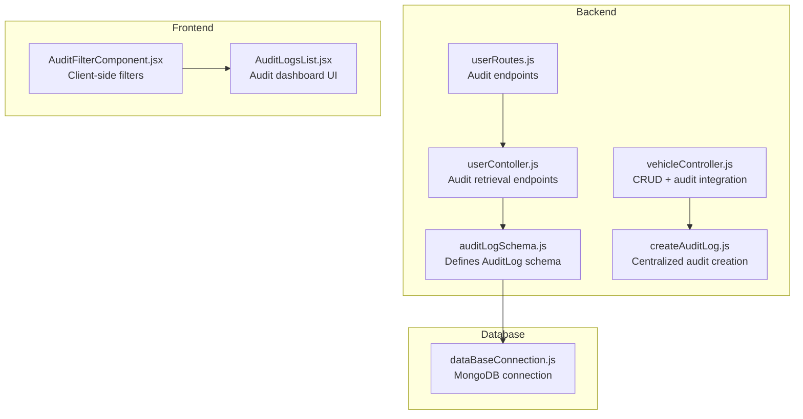
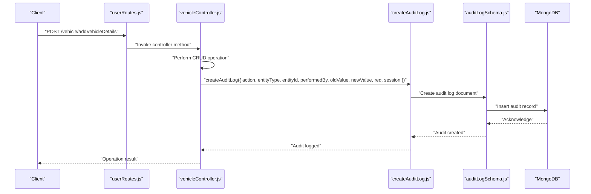
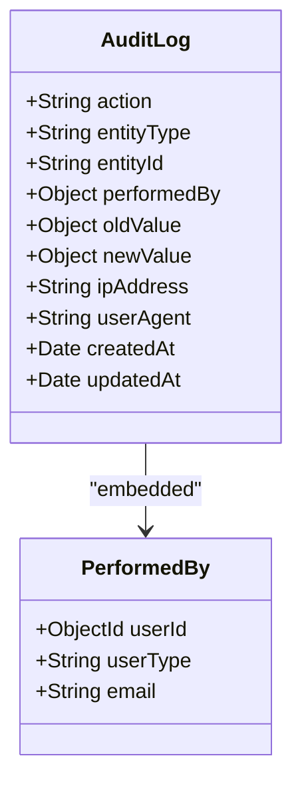
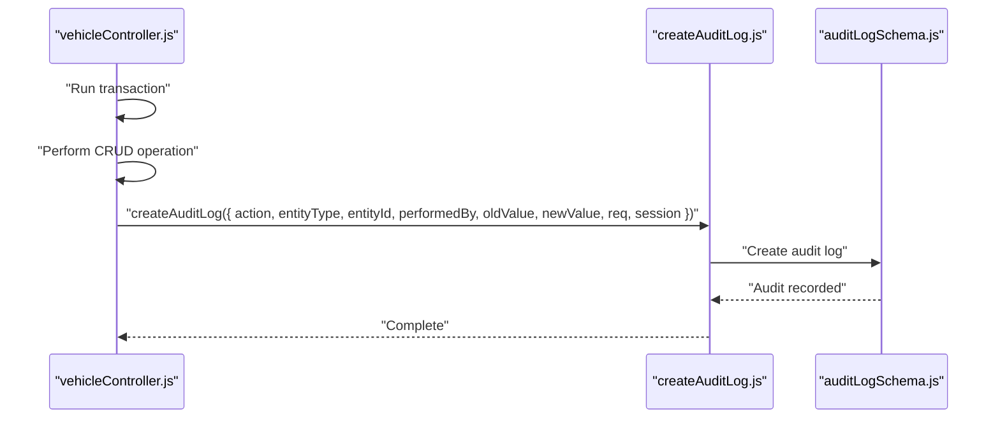
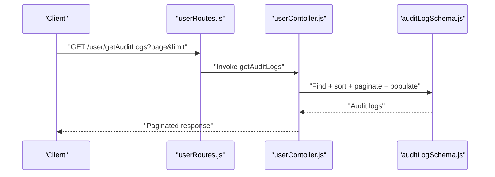
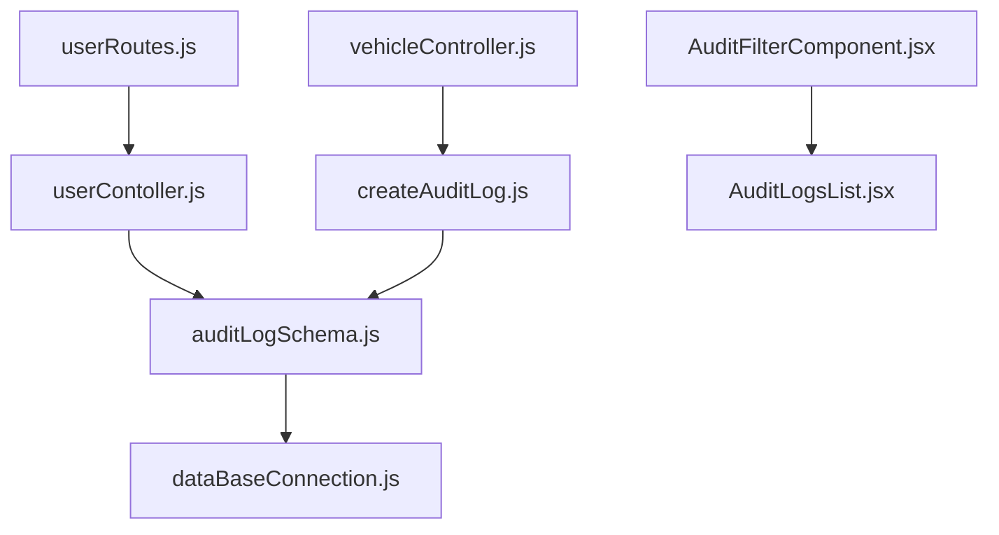

# Audit Log Model Schema

<cite>
**Referenced Files in This Document**
- [auditLogSchema.js](file://backend/model/auditLogSchema.js)
- [createAuditLog.js](file://backend/utils/createAuditLog.js)
- [auditActions.js](file://backend/config/auditActions.js)
- [vehicleController.js](file://backend/Controller/vehicleController.js)
- [userContoller.js](file://backend/Controller/userContoller.js)
- [userRoutes.js](file://backend/router/userRoutes.js)
- [AuditFilterComponent.jsx](file://frontend/src/pages/adminDashboard/reportComponent/AuditFilterComponent.jsx)
- [AuditLogsList.jsx](file://frontend/src/pages/adminDashboard/reportComponent/AuditLogsList.jsx)
- [dataBaseConnection.js](file://backend/DatabaseConnection/dataBaseConnection.js)
</cite>

## Table of Contents
1. [Introduction](#introduction)
2. [Project Structure](#project-structure)
3. [Core Components](#core-components)
4. [Architecture Overview](#architecture-overview)
5. [Detailed Component Analysis](#detailed-component-analysis)
6. [Dependency Analysis](#dependency-analysis)
7. [Performance Considerations](#performance-considerations)
8. [Troubleshooting Guide](#troubleshooting-guide)
9. [Conclusion](#conclusion)

## Introduction
This document provides comprehensive data model documentation for the Audit Log entity schema used to track system activities and changes across the application. It covers the audit log document structure, field definitions, validation rules, change tracking mechanisms, data integrity requirements, indexing strategies, filtering capabilities, and automated audit logging for CRUD operations. It also includes practical examples for queries, compliance reporting, change tracking analysis, and security monitoring workflows.

## Project Structure
The audit logging system spans the backend data model, utility functions, controllers, routing, and frontend components:
- Backend data model defines the AuditLog schema with required fields and indexes.
- Utility function centralizes audit creation with transaction support.
- Controllers integrate audit logging into CRUD operations and expose audit retrieval endpoints.
- Frontend components enable filtering and viewing of audit logs.

**Diagram sources**
- [auditLogSchema.js](file://backend/model/auditLogSchema.js#L1-L63)
- [createAuditLog.js](file://backend/utils/createAuditLog.js#L1-L31)
- [vehicleController.js](file://backend/Controller/vehicleController.js#L1-L824)
- [userContoller.js](file://backend/Controller/userContoller.js#L788-L832)
- [userRoutes.js](file://backend/router/userRoutes.js#L104-L116)
- [AuditFilterComponent.jsx](file://frontend/src/pages/adminDashboard/reportComponent/AuditFilterComponent.jsx#L1-L221)
- [AuditLogsList.jsx](file://frontend/src/pages/adminDashboard/reportComponent/AuditLogsList.jsx#L40-L301)
- [dataBaseConnection.js](file://backend/DatabaseConnection/dataBaseConnection.js#L1-L17)

**Section sources**
- [auditLogSchema.js](file://backend/model/auditLogSchema.js#L1-L63)
- [createAuditLog.js](file://backend/utils/createAuditLog.js#L1-L31)
- [vehicleController.js](file://backend/Controller/vehicleController.js#L1-L824)
- [userContoller.js](file://backend/Controller/userContoller.js#L788-L832)
- [userRoutes.js](file://backend/router/userRoutes.js#L104-L116)
- [AuditFilterComponent.jsx](file://frontend/src/pages/adminDashboard/reportComponent/AuditFilterComponent.jsx#L1-L221)
- [AuditLogsList.jsx](file://frontend/src/pages/adminDashboard/reportComponent/AuditLogsList.jsx#L40-L301)
- [dataBaseConnection.js](file://backend/DatabaseConnection/dataBaseConnection.js#L1-L17)

## Core Components
- AuditLog Schema: Defines the structure and constraints for audit records, including action type, entity association, user identity, change data, and metadata.
- Audit Creation Utility: Provides a centralized function to create audit logs with optional MongoDB transaction support.
- Audit Action Mapping: Enumerates standardized action types for vehicles, bookings, and user/admin operations.
- Controller Integration: Integrates audit logging into CRUD operations and exposes endpoints to retrieve audit logs.
- Frontend Audit Dashboard: Enables filtering and pagination of audit logs for administrative review.

**Section sources**
- [auditLogSchema.js](file://backend/model/auditLogSchema.js#L1-L63)
- [createAuditLog.js](file://backend/utils/createAuditLog.js#L1-L31)
- [auditActions.js](file://backend/config/auditActions.js#L1-L18)
- [vehicleController.js](file://backend/Controller/vehicleController.js#L150-L165)
- [userContoller.js](file://backend/Controller/userContoller.js#L788-L832)
- [AuditFilterComponent.jsx](file://frontend/src/pages/adminDashboard/reportComponent/AuditFilterComponent.jsx#L1-L221)
- [AuditLogsList.jsx](file://frontend/src/pages/adminDashboard/reportComponent/AuditLogsList.jsx#L40-L301)

## Architecture Overview
The audit logging architecture ensures that every significant operation is captured consistently and efficiently. The flow below illustrates how audit logs are generated during CRUD operations and retrieved for administrative review.

**Diagram sources**
- [userRoutes.js](file://backend/router/userRoutes.js#L1-L119)
- [vehicleController.js](file://backend/Controller/vehicleController.js#L150-L165)
- [createAuditLog.js](file://backend/utils/createAuditLog.js#L1-L31)
- [auditLogSchema.js](file://backend/model/auditLogSchema.js#L1-L63)

## Detailed Component Analysis

### AuditLog Schema Definition
The AuditLog schema defines the core structure and constraints for audit records:
- action: String, required, indexed. Standardized action type mapped via auditActions.js.
- entityType: String, required, indexed. Identifies the affected domain (e.g., VEHICLE, BOOKING, USER).
- entityId: String, required, indexed. Stores the identifier of the affected resource.
- performedBy: Embedded object containing:
  - userId: ObjectId, required, references User.
  - userType: String, required, enum ["admin", "user"].
  - email: String, required.
- oldValue: Object, default null. Captures previous state for updates.
- newValue: Object, default null. Captures new state for updates.
- ipAddress: String. Optional client IP address.
- userAgent: String. Optional user agent string.
- Timestamps: createdAt and updatedAt managed automatically.

**Diagram sources**
- [auditLogSchema.js](file://backend/model/auditLogSchema.js#L3-L61)

**Section sources**
- [auditLogSchema.js](file://backend/model/auditLogSchema.js#L1-L63)

### Audit Action Mapping System
Standardized action types are defined centrally to ensure consistency across the application:
- Vehicle actions: ADD_VEHICLE, UPDATE_VEHICLE, DELETE_VEHICLE, UPDATE_VEHICLE_GROUP
- Booking actions: CREATE_BOOKING, CANCEL_BOOKING, COMPLETE_BOOKING, RESCHEDULE_BOOKING
- User/Admin actions: LOGIN, ROLE_CHANGE

These constants are imported and used in controllers to populate the action field in audit logs.

**Section sources**
- [auditActions.js](file://backend/config/auditActions.js#L1-L18)
- [vehicleController.js](file://backend/Controller/vehicleController.js#L110-L111)
- [vehicleController.js](file://backend/Controller/vehicleController.js#L386-L387)
- [vehicleController.js](file://backend/Controller/vehicleController.js#L601-L602)

### Automated Audit Logging for CRUD Operations
Controllers integrate audit logging into CRUD operations using the createAuditLog utility:
- Add Vehicle: Logs ADD_VEHICLE with newValue set to the created vehicle document snapshot.
- Update Vehicle: Computes changed fields and logs UPDATE_VEHICLE with oldValue/newValue diffs.
- Delete Vehicle: Logs DELETE_VEHICLE with oldValue capturing the deleted vehicle details and documentDeleted flag.
- Update Vehicle Group: Logs UPDATE_VEHICLE_GROUP with oldValue/newValue diffs.

**Diagram sources**
- [vehicleController.js](file://backend/Controller/vehicleController.js#L150-L165)
- [vehicleController.js](file://backend/Controller/vehicleController.js#L385-L398)
- [vehicleController.js](file://backend/Controller/vehicleController.js#L600-L616)
- [createAuditLog.js](file://backend/utils/createAuditLog.js#L1-L31)
- [auditLogSchema.js](file://backend/model/auditLogSchema.js#L1-L63)

**Section sources**
- [vehicleController.js](file://backend/Controller/vehicleController.js#L150-L165)
- [vehicleController.js](file://backend/Controller/vehicleController.js#L385-L398)
- [vehicleController.js](file://backend/Controller/vehicleController.js#L600-L616)
- [createAuditLog.js](file://backend/utils/createAuditLog.js#L1-L31)

### Audit Retrieval Endpoints and Frontend Integration
Administrators can retrieve audit logs via dedicated endpoints:
- GET /user/getAuditLogs: Paginated retrieval with sorting by createdAt descending and population of performedBy.userId.
- GET /user/auditlogsByID/:id: Retrieve a specific audit log by ID with user population.

Frontend components provide filtering and pagination:
- AuditFilterComponent: Allows filtering by action, entity type, user email, user type, and date range.
- AuditLogsList: Displays audit logs in a table with pagination and modal details view.

**Diagram sources**
- [userRoutes.js](file://backend/router/userRoutes.js#L104-L116)
- [userContoller.js](file://backend/Controller/userContoller.js#L788-L832)
- [auditLogSchema.js](file://backend/model/auditLogSchema.js#L1-L63)

**Section sources**
- [userRoutes.js](file://backend/router/userRoutes.js#L104-L116)
- [userContoller.js](file://backend/Controller/userContoller.js#L788-L832)
- [AuditFilterComponent.jsx](file://frontend/src/pages/adminDashboard/reportComponent/AuditFilterComponent.jsx#L1-L221)
- [AuditLogsList.jsx](file://frontend/src/pages/adminDashboard/reportComponent/AuditLogsList.jsx#L40-L301)

### Validation Rules and Data Integrity
- Required Fields: action, entityType, entityId, performedBy.userId, performedBy.userType, performedBy.email.
- Enum Constraints: performedBy.userType restricted to ["admin", "user"].
- Embedded References: performedBy.userId references the User model.
- Transaction Safety: Audit creation supports MongoDB sessions to ensure atomicity alongside CRUD operations.
- Timestamps: createdAt and updatedAt are automatically maintained by the schema.

**Section sources**
- [auditLogSchema.js](file://backend/model/auditLogSchema.js#L5-L37)
- [createAuditLog.js](file://backend/utils/createAuditLog.js#L24-L29)

### Indexing Strategies for Audit Queries
Indexes are defined on frequently queried fields to optimize performance:
- action: Indexed to accelerate filtering by action type.
- entityType: Indexed to accelerate filtering by entity type.
- entityId: Indexed to accelerate lookups by entity identifier.
- createdAt: Automatically indexed by Mongoose timestamps; used for chronological sorting and range queries.

These indexes support efficient filtering and pagination commonly used in compliance and security workflows.

**Section sources**
- [auditLogSchema.js](file://backend/model/auditLogSchema.js#L8-L21)
- [auditLogSchema.js](file://backend/model/auditLogSchema.js#L59-L60)

### Filtering by User, Action Type, and Time Ranges
Frontend filtering enables administrators to narrow audit logs by:
- Action: Dropdown selection of action types.
- Entity Type: Dropdown selection of entity types.
- User: Text filter on performedBy.email.
- User Type: Dropdown selection of performedBy.userType.
- Time Range: From/To date pickers on createdAt.

The filtering logic applies client-side filtering against the loaded dataset, enabling quick analysis and compliance reporting.

**Section sources**
- [AuditFilterComponent.jsx](file://frontend/src/pages/adminDashboard/reportComponent/AuditFilterComponent.jsx#L1-L221)
- [AuditLogsList.jsx](file://frontend/src/pages/adminDashboard/reportComponent/AuditLogsList.jsx#L40-L301)

### Examples of Audit Log Queries and Workflows
- Compliance Reporting: Use GET /user/getAuditLogs with pagination and populate performedBy.userId to produce a chronological list of actions for regulatory review.
- Change Tracking Analysis: For UPDATE_VEHICLE and UPDATE_VEHICLE_GROUP actions, compare oldValue and newValue to identify modified fields and values.
- Security Monitoring: Filter by action types like LOGIN and ROLE_CHANGE, and by time ranges to detect suspicious activity patterns.

**Section sources**
- [userRoutes.js](file://backend/router/userRoutes.js#L104-L116)
- [userContoller.js](file://backend/Controller/userContoller.js#L788-L832)
- [AuditFilterComponent.jsx](file://frontend/src/pages/adminDashboard/reportComponent/AuditFilterComponent.jsx#L59-L98)

## Dependency Analysis
The audit logging system exhibits clear separation of concerns:
- Controllers depend on the audit creation utility and schema.
- The utility depends on the schema and optionally on a session for transactions.
- Routes expose endpoints that controllers implement.
- Frontend components consume backend endpoints to render and filter audit logs.
- Database connection is configured globally and supports audit storage.

**Diagram sources**
- [vehicleController.js](file://backend/Controller/vehicleController.js#L1-L824)
- [createAuditLog.js](file://backend/utils/createAuditLog.js#L1-L31)
- [userContoller.js](file://backend/Controller/userContoller.js#L788-L832)
- [auditLogSchema.js](file://backend/model/auditLogSchema.js#L1-L63)
- [userRoutes.js](file://backend/router/userRoutes.js#L104-L116)
- [AuditFilterComponent.jsx](file://frontend/src/pages/adminDashboard/reportComponent/AuditFilterComponent.jsx#L1-L221)
- [AuditLogsList.jsx](file://frontend/src/pages/adminDashboard/reportComponent/AuditLogsList.jsx#L40-L301)
- [dataBaseConnection.js](file://backend/DatabaseConnection/dataBaseConnection.js#L1-L17)

**Section sources**
- [vehicleController.js](file://backend/Controller/vehicleController.js#L1-L824)
- [createAuditLog.js](file://backend/utils/createAuditLog.js#L1-L31)
- [userContoller.js](file://backend/Controller/userContoller.js#L788-L832)
- [auditLogSchema.js](file://backend/model/auditLogSchema.js#L1-L63)
- [userRoutes.js](file://backend/router/userRoutes.js#L104-L116)
- [AuditFilterComponent.jsx](file://frontend/src/pages/adminDashboard/reportComponent/AuditFilterComponent.jsx#L1-L221)
- [AuditLogsList.jsx](file://frontend/src/pages/adminDashboard/reportComponent/AuditLogsList.jsx#L40-L301)
- [dataBaseConnection.js](file://backend/DatabaseConnection/dataBaseConnection.js#L1-L17)

## Performance Considerations
- Indexes: action, entityType, entityId, and createdAt indexes improve query performance for filtering and sorting.
- Pagination: Use page and limit parameters to avoid loading large datasets.
- Population: Populate performedBy.userId only when needed to reduce payload size.
- Transactions: Use sessions for audit creation alongside CRUD operations to maintain atomicity and consistency.
- Frontend Filtering: Client-side filtering reduces server load for ad-hoc analysis.

[No sources needed since this section provides general guidance]

## Troubleshooting Guide
- Missing Required Fields: Ensure action, entityType, entityId, and performedBy fields are populated when creating audit logs.
- User Reference Issues: Verify that performedBy.userId references a valid User document.
- Transaction Errors: When using sessions, ensure the session is passed to createAuditLog to maintain atomicity.
- Empty Results: Confirm that filters (action, entity type, user, date range) are appropriate and that data exists for the selected time frame.
- Endpoint Access: Note that audit endpoints are currently not protected by authentication middleware; ensure proper access controls are applied as needed.

**Section sources**
- [auditLogSchema.js](file://backend/model/auditLogSchema.js#L5-L37)
- [createAuditLog.js](file://backend/utils/createAuditLog.js#L24-L29)
- [userRoutes.js](file://backend/router/userRoutes.js#L104-L116)

## Conclusion
The Audit Log model schema provides a robust foundation for tracking system activities, ensuring data integrity, and supporting compliance and security workflows. With standardized action types, embedded user identity, change tracking, and optimized indexes, the system enables efficient querying and analysis. The centralized audit creation utility and controller integrations streamline automated logging for CRUD operations, while frontend components facilitate administration and oversight.