# Booking Model Schema

<cite>
**Referenced Files in This Document**
- [vehicleBookingModel.js](file://backend/model/vehicleBookingModel.js)
- [bookingIDCounerSchema.js](file://backend/model/bookingIDCounerSchema.js)
- [vehicleDetailModel.js](file://backend/model/vehicleDetailModel.js)
- [userModel.js](file://backend/model/userModel.js)
- [vehicleBookingController.js](file://backend/Controller/vehicleBookingController.js)
- [bookingRoutes.js](file://backend/router/bookingRoutes.js)
- [runTransaction.js](file://backend/model/runTransaction.js)
- [generateunuiquebookingId.js](file://backend/utils/generateunuiquebookingId.js)
- [catchAsync.js](file://backend/utils/catchAsync.js)
- [appError.js](file://backend/utils/appError.js)
</cite>

## Table of Contents
1. [Introduction](#introduction)
2. [Project Structure](#project-structure)
3. [Core Components](#core-components)
4. [Architecture Overview](#architecture-overview)
5. [Detailed Component Analysis](#detailed-component-analysis)
6. [Dependency Analysis](#dependency-analysis)
7. [Performance Considerations](#performance-considerations)
8. [Troubleshooting Guide](#troubleshooting-guide)
9. [Conclusion](#conclusion)
10. [Appendices](#appendices)

## Introduction
This document provides comprehensive data model documentation for the Booking entity schema. It details the booking document structure, including identification mechanisms, vehicle and user relationships, booking periods, pricing calculations, and status tracking. It also explains the booking ID counter mechanism for unique and sequential numbering, validation rules for date ranges and availability, and the relationships between bookings and vehicles/users. Finally, it outlines examples of booking creation, status updates, payment processing, and cancellation workflows with transaction management.

## Project Structure
The booking system spans several backend modules:
- Data models define the schema for bookings, vehicles, and users.
- Controllers implement business logic for booking creation, updates, rescheduling, and completion.
- Routes expose endpoints for client interactions.
- Utilities provide transaction management, error handling, and unique booking ID generation.

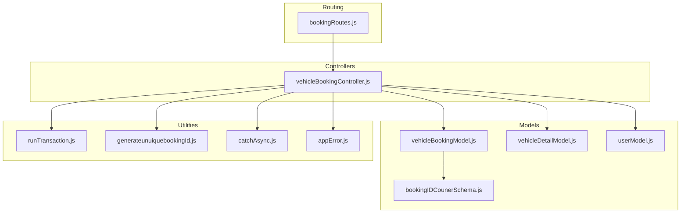

**Diagram sources**
- [vehicleBookingModel.js](file://backend/model/vehicleBookingModel.js#L1-L105)
- [vehicleDetailModel.js](file://backend/model/vehicleDetailModel.js#L1-L145)
- [userModel.js](file://backend/model/userModel.js#L1-L162)
- [bookingIDCounerSchema.js](file://backend/model/bookingIDCounerSchema.js#L1-L17)
- [vehicleBookingController.js](file://backend/Controller/vehicleBookingController.js#L1-L861)
- [bookingRoutes.js](file://backend/router/bookingRoutes.js#L1-L31)
- [runTransaction.js](file://backend/model/runTransaction.js#L1-L43)
- [generateunuiquebookingId.js](file://backend/utils/generateunuiquebookingId.js#L1-L23)
- [catchAsync.js](file://backend/utils/catchAsync.js#L1-L6)
- [appError.js](file://backend/utils/appError.js#L1-L12)

**Section sources**
- [vehicleBookingModel.js](file://backend/model/vehicleBookingModel.js#L1-L105)
- [vehicleDetailModel.js](file://backend/model/vehicleDetailModel.js#L1-L145)
- [userModel.js](file://backend/model/userModel.js#L1-L162)
- [bookingIDCounerSchema.js](file://backend/model/bookingIDCounerSchema.js#L1-L17)
- [vehicleBookingController.js](file://backend/Controller/vehicleBookingController.js#L1-L861)
- [bookingRoutes.js](file://backend/router/bookingRoutes.js#L1-L31)
- [runTransaction.js](file://backend/model/runTransaction.js#L1-L43)
- [generateunuiquebookingId.js](file://backend/utils/generateunuiquebookingId.js#L1-L23)
- [catchAsync.js](file://backend/utils/catchAsync.js#L1-L6)
- [appError.js](file://backend/utils/appError.js#L1-L12)

## Core Components
- Booking document schema: Defines the structure for user email, embedded vehicle details, and user details with timestamps.
- Vehicle details schema: Defines vehicle groups, specific vehicles, pricing tiers, and booked periods.
- User schema: Defines user profile and booking statistics.
- Counter model: Provides auto-increment sequencing for unique booking IDs.
- Controller logic: Implements booking creation, cancellation, rescheduling, and completion with transactions.
- Routing: Exposes endpoints for booking operations.
- Utilities: Transaction wrapper, unique booking ID generator, async error handling, and custom error class.

**Section sources**
- [vehicleBookingModel.js](file://backend/model/vehicleBookingModel.js#L9-L66)
- [vehicleDetailModel.js](file://backend/model/vehicleDetailModel.js#L6-L105)
- [userModel.js](file://backend/model/userModel.js#L6-L129)
- [bookingIDCounerSchema.js](file://backend/model/bookingIDCounerSchema.js#L4-L14)
- [vehicleBookingController.js](file://backend/Controller/vehicleBookingController.js#L16-L466)
- [bookingRoutes.js](file://backend/router/bookingRoutes.js#L7-L28)
- [runTransaction.js](file://backend/model/runTransaction.js#L4-L18)
- [generateunuiquebookingId.js](file://backend/utils/generateunuiquebookingId.js#L7-L20)
- [catchAsync.js](file://backend/utils/catchAsync.js#L1-L6)
- [appError.js](file://backend/utils/appError.js#L1-L12)

## Architecture Overview
The booking system follows a layered architecture:
- Presentation layer: Express routes.
- Application layer: Controllers handle requests, orchestrate transactions, and call models.
- Data layer: Mongoose models define schemas and indexes; counters manage unique IDs.
- Utility layer: Transactions, error handling, and unique ID generation.

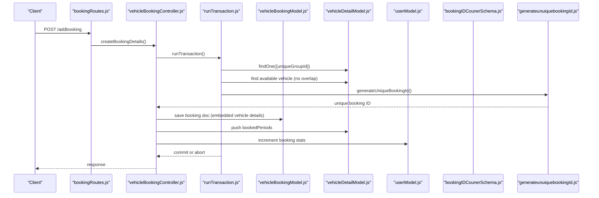

**Diagram sources**
- [bookingRoutes.js](file://backend/router/bookingRoutes.js#L7-L7)
- [vehicleBookingController.js](file://backend/Controller/vehicleBookingController.js#L235-L466)
- [runTransaction.js](file://backend/model/runTransaction.js#L4-L18)
- [vehicleDetailModel.js](file://backend/model/vehicleDetailModel.js#L28-L43)
- [vehicleBookingModel.js](file://backend/model/vehicleBookingModel.js#L74-L97)
- [bookingIDCounerSchema.js](file://backend/model/bookingIDCounerSchema.js#L4-L14)
- [generateunuiquebookingId.js](file://backend/utils/generateunuiquebookingId.js#L7-L20)

## Detailed Component Analysis

### Booking Document Schema
The booking document aggregates user and vehicle details in a single collection. Key aspects:
- Identification: The booking document stores the user’s email and embeds an array of vehicle details. Each vehicle detail includes a unique booking ID generated during save.
- Vehicle associations: Embedded vehicle details include name, model, description, vehicle type, unique vehicle ID, status, location, vehicle number, mileage, file paths, and booking status.
- Periods: Each vehicle detail includes pickup and drop-off dates.
- Pricing: Each vehicle detail includes base price, extra expenditure, tax, and total price.
- Uniqueness: A compound index enforces uniqueness on the embedded unique booking ID to prevent duplicates.

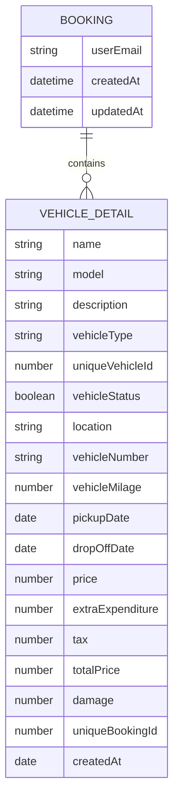

**Diagram sources**
- [vehicleBookingModel.js](file://backend/model/vehicleBookingModel.js#L9-L66)

**Section sources**
- [vehicleBookingModel.js](file://backend/model/vehicleBookingModel.js#L9-L66)
- [vehicleBookingModel.js](file://backend/model/vehicleBookingModel.js#L68-L72)

### Vehicle Details Schema
Vehicle details are embedded within the vehicle group schema:
- Unique identifiers: Groups have a unique group ID; specific vehicles have a unique vehicle ID.
- Availability: Booked periods are tracked as arrays of date ranges.
- Pricing tiers: Price ranges with associated rates are defined per group.
- Status and metadata: Location, status, mileage, and file paths are maintained.

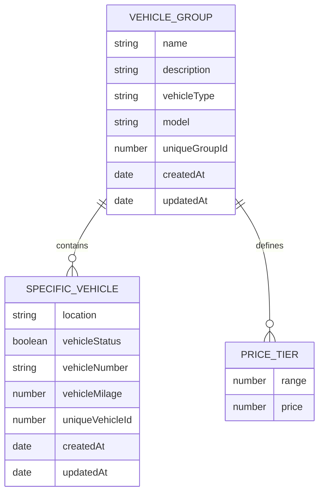

**Diagram sources**
- [vehicleDetailModel.js](file://backend/model/vehicleDetailModel.js#L55-L105)

**Section sources**
- [vehicleDetailModel.js](file://backend/model/vehicleDetailModel.js#L6-L53)
- [vehicleDetailModel.js](file://backend/model/vehicleDetailModel.js#L55-L105)

### User Schema and Booking Statistics
User profiles include booking-related statistics:
- Counts: Total bookings, canceled bookings, active bookings, and total money spent.
- Identity: Name, email, phone numbers, driving license info, and roles.

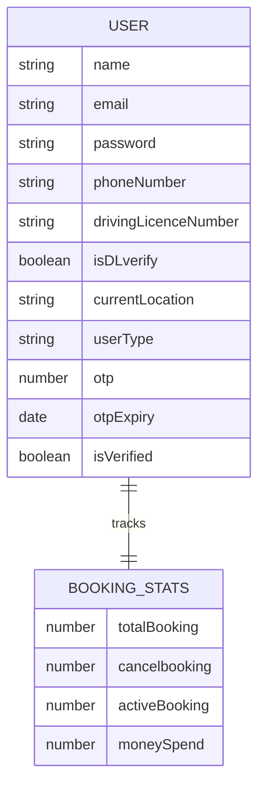

**Diagram sources**
- [userModel.js](file://backend/model/userModel.js#L6-L129)

**Section sources**
- [userModel.js](file://backend/model/userModel.js#L109-L127)

### Booking ID Counter Mechanism
Two mechanisms ensure unique booking IDs:
- Auto-increment counter: A dedicated counter document increments per save for new booking details.
- Daily unique ID generator: A utility generates a daily sequential ID with a YYMMDD prefix.

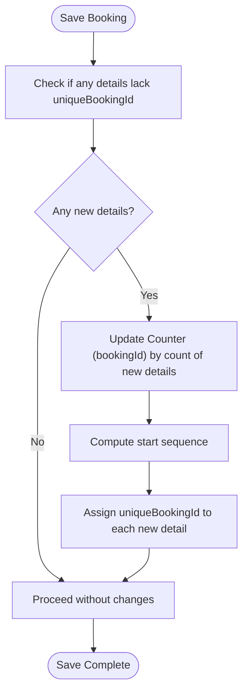

**Diagram sources**
- [vehicleBookingModel.js](file://backend/model/vehicleBookingModel.js#L74-L97)
- [bookingIDCounerSchema.js](file://backend/model/bookingIDCounerSchema.js#L4-L14)

**Section sources**
- [vehicleBookingModel.js](file://backend/model/vehicleBookingModel.js#L74-L97)
- [bookingIDCounerSchema.js](file://backend/model/bookingIDCounerSchema.js#L4-L14)
- [generateunuiquebookingId.js](file://backend/utils/generateunuiquebookingId.js#L7-L20)

### Validation Rules and Business Logic
- Date range validation: Pickup date must be earlier than drop-off date.
- Availability checks: Vehicles are checked for overlapping booked periods; a new booking slot is blocked only if available.
- Pricing calculations: Prices are embedded per vehicle detail; totals include price, extra expenditure, and tax.
- Cancellation policy: Cancellations are allowed only if the pickup window is at least 12 hours away; admins can cancel at any time.
- Rescheduling: New slots must not overlap with existing bookings; old slots are freed and new ones are blocked.

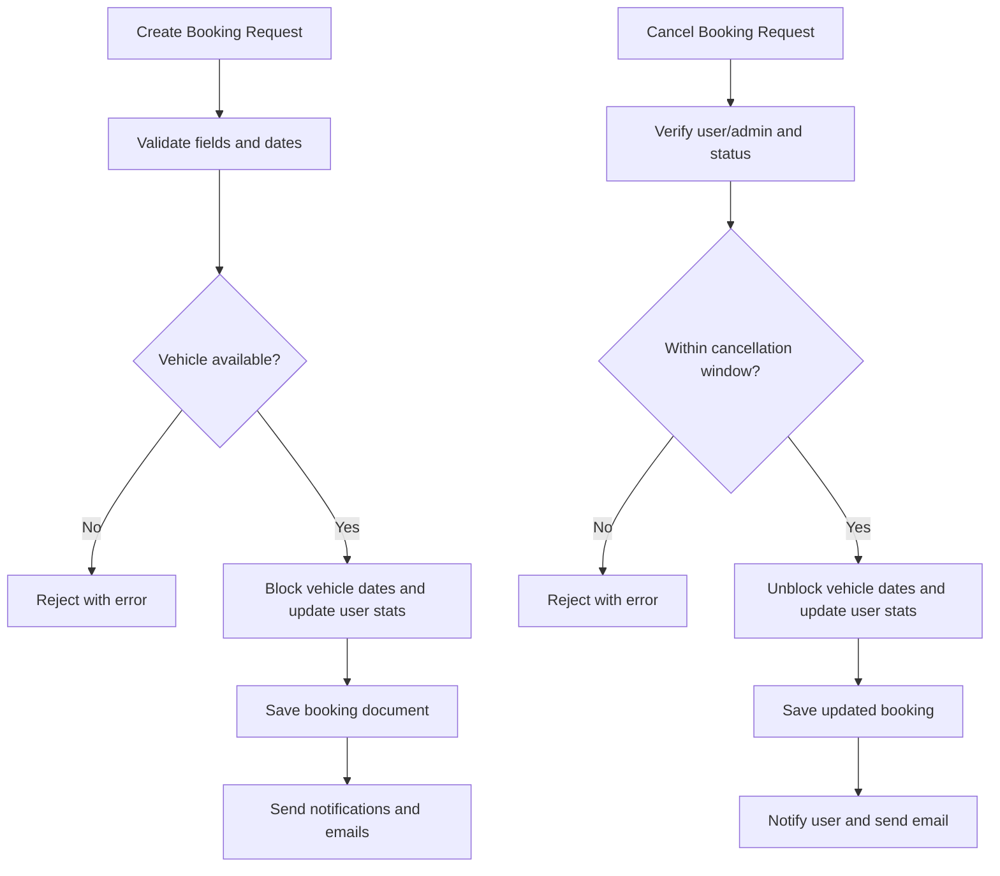

**Diagram sources**
- [vehicleBookingController.js](file://backend/Controller/vehicleBookingController.js#L279-L425)
- [vehicleBookingController.js](file://backend/Controller/vehicleBookingController.js#L506-L586)

**Section sources**
- [vehicleBookingController.js](file://backend/Controller/vehicleBookingController.js#L279-L425)
- [vehicleBookingController.js](file://backend/Controller/vehicleBookingController.js#L506-L586)
- [vehicleDetailModel.js](file://backend/model/vehicleDetailModel.js#L38-L43)

### Transaction Management
All critical booking operations are wrapped in MongoDB transactions to ensure atomicity:
- Create booking: Vehicle availability check, booking save, vehicle date blocking, and user stats update.
- Cancel booking: Status update, vehicle date unblocking, and user stats adjustment.
- Reschedule booking: Availability check, new slot blocking, old slot removal, and booking update.
- Complete booking: Status update and user stats adjustment.

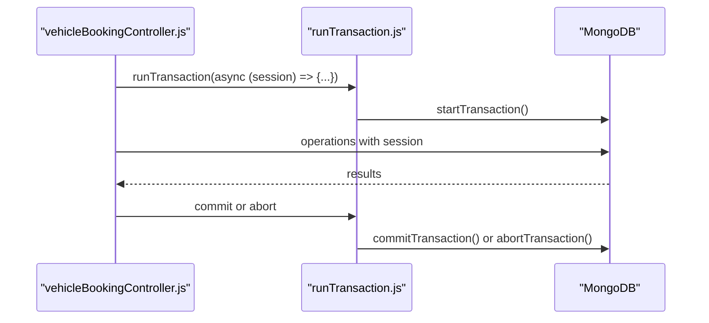

**Diagram sources**
- [runTransaction.js](file://backend/model/runTransaction.js#L4-L18)
- [vehicleBookingController.js](file://backend/Controller/vehicleBookingController.js#L288-L425)

**Section sources**
- [runTransaction.js](file://backend/model/runTransaction.js#L4-L18)
- [vehicleBookingController.js](file://backend/Controller/vehicleBookingController.js#L288-L425)

### Relationship Between Bookings and Vehicles/Users
- User-to-bookings: One-to-many via user email in the booking document.
- Vehicle-to-bookings: Embedded within booking documents; each booking detail references a specific vehicle by unique vehicle ID.
- Availability: Vehicle availability is enforced by checking booked periods and updating them atomically with transactions.

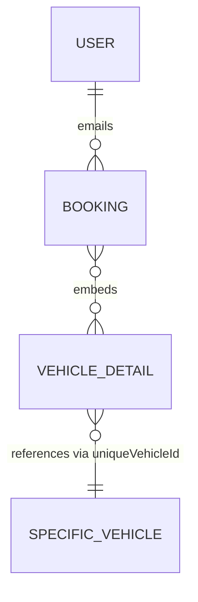

**Diagram sources**
- [vehicleBookingModel.js](file://backend/model/vehicleBookingModel.js#L11-L14)
- [vehicleDetailModel.js](file://backend/model/vehicleDetailModel.js#L33-L37)

**Section sources**
- [vehicleBookingModel.js](file://backend/model/vehicleBookingModel.js#L11-L14)
- [vehicleDetailModel.js](file://backend/model/vehicleDetailModel.js#L33-L37)

### Examples and Workflows

#### Booking Creation Workflow
- Endpoint: POST /addbooking
- Steps:
  - Validate required fields and date order.
  - Find vehicle group and select an available vehicle.
  - Prepare booking detail with pricing and unique booking ID.
  - Save booking document and block vehicle dates.
  - Update user booking statistics.
  - Send notifications and emails.

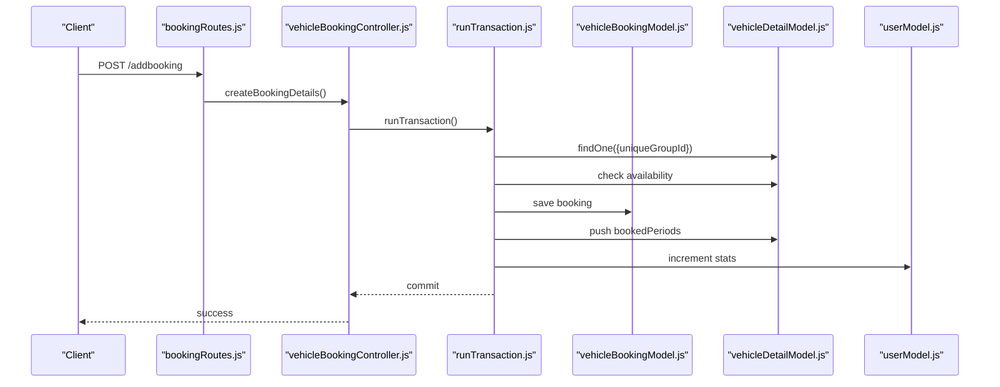

**Diagram sources**
- [bookingRoutes.js](file://backend/router/bookingRoutes.js#L7-L7)
- [vehicleBookingController.js](file://backend/Controller/vehicleBookingController.js#L235-L466)
- [runTransaction.js](file://backend/model/runTransaction.js#L4-L18)
- [vehicleBookingModel.js](file://backend/model/vehicleBookingModel.js#L74-L97)
- [vehicleDetailModel.js](file://backend/model/vehicleDetailModel.js#L38-L43)
- [userModel.js](file://backend/model/userModel.js#L109-L127)

**Section sources**
- [bookingRoutes.js](file://backend/router/bookingRoutes.js#L7-L7)
- [vehicleBookingController.js](file://backend/Controller/vehicleBookingController.js#L235-L466)
- [runTransaction.js](file://backend/model/runTransaction.js#L4-L18)
- [vehicleBookingModel.js](file://backend/model/vehicleBookingModel.js#L74-L97)
- [vehicleDetailModel.js](file://backend/model/vehicleDetailModel.js#L38-L43)
- [userModel.js](file://backend/model/userModel.js#L109-L127)

#### Cancellation Workflow
- Endpoint: PATCH /updateBookingDetails
- Steps:
  - Validate request and user permissions.
  - Check cancellation window.
  - Update booking status to cancelled.
  - Unblock vehicle dates.
  - Adjust user booking statistics.
  - Notify user and send email.

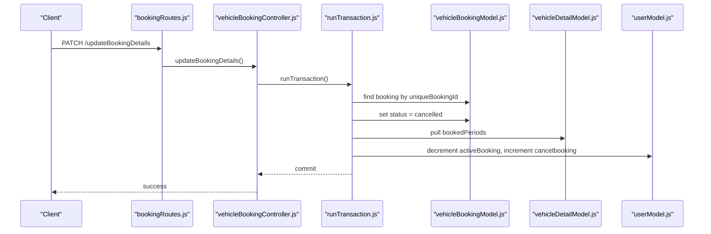

**Diagram sources**
- [bookingRoutes.js](file://backend/router/bookingRoutes.js#L13-L17)
- [vehicleBookingController.js](file://backend/Controller/vehicleBookingController.js#L480-L632)
- [runTransaction.js](file://backend/model/runTransaction.js#L4-L18)
- [vehicleBookingModel.js](file://backend/model/vehicleBookingModel.js#L52-L52)
- [vehicleDetailModel.js](file://backend/model/vehicleDetailModel.js#L38-L43)
- [userModel.js](file://backend/model/userModel.js#L109-L127)

**Section sources**
- [bookingRoutes.js](file://backend/router/bookingRoutes.js#L13-L17)
- [vehicleBookingController.js](file://backend/Controller/vehicleBookingController.js#L480-L632)
- [runTransaction.js](file://backend/model/runTransaction.js#L4-L18)
- [vehicleDetailModel.js](file://backend/model/vehicleDetailModel.js#L38-L43)
- [userModel.js](file://backend/model/userModel.js#L109-L127)

#### Rescheduling Workflow
- Endpoint: PATCH /rescheduleBooking
- Steps:
  - Validate inputs.
  - Verify availability for new slot.
  - Block new slot and remove old slot.
  - Update booking detail dates.

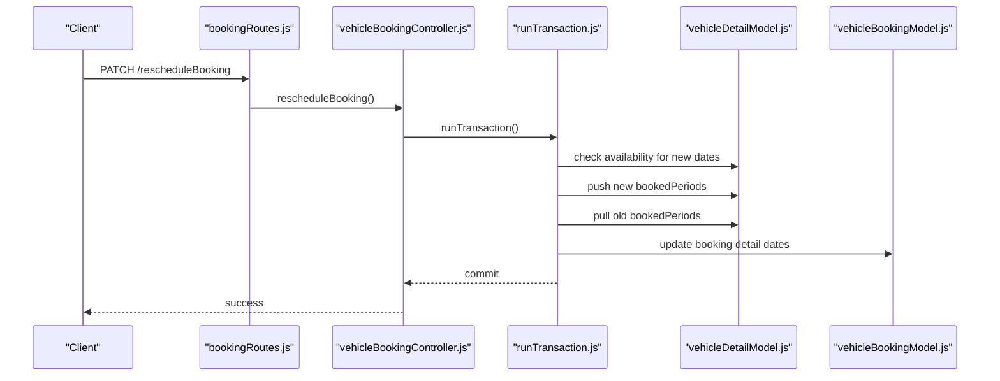

**Diagram sources**
- [bookingRoutes.js](file://backend/router/bookingRoutes.js#L18-L22)
- [vehicleBookingController.js](file://backend/Controller/vehicleBookingController.js#L664-L758)
- [runTransaction.js](file://backend/model/runTransaction.js#L4-L18)
- [vehicleDetailModel.js](file://backend/model/vehicleDetailModel.js#L38-L43)
- [vehicleBookingModel.js](file://backend/model/vehicleBookingModel.js#L740-L750)

**Section sources**
- [bookingRoutes.js](file://backend/router/bookingRoutes.js#L18-L22)
- [vehicleBookingController.js](file://backend/Controller/vehicleBookingController.js#L664-L758)
- [runTransaction.js](file://backend/model/runTransaction.js#L4-L18)
- [vehicleDetailModel.js](file://backend/model/vehicleDetailModel.js#L38-L43)
- [vehicleBookingModel.js](file://backend/model/vehicleBookingModel.js#L740-L750)

#### Completion Workflow
- Endpoint: PATCH /completeBooking (admin-only)
- Steps:
  - Validate inputs and admin role.
  - Update booking status to completed.
  - Decrement active booking count.
  - Notify user and send email.

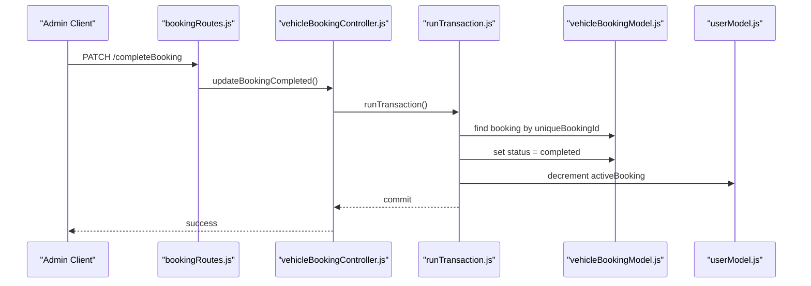

**Diagram sources**
- [bookingRoutes.js](file://backend/router/bookingRoutes.js#L23-L28)
- [vehicleBookingController.js](file://backend/Controller/vehicleBookingController.js#L760-L860)
- [runTransaction.js](file://backend/model/runTransaction.js#L4-L18)
- [vehicleBookingModel.js](file://backend/model/vehicleBookingModel.js#L52-L52)
- [userModel.js](file://backend/model/userModel.js#L109-L127)

**Section sources**
- [bookingRoutes.js](file://backend/router/bookingRoutes.js#L23-L28)
- [vehicleBookingController.js](file://backend/Controller/vehicleBookingController.js#L760-L860)
- [runTransaction.js](file://backend/model/runTransaction.js#L4-L18)
- [userModel.js](file://backend/model/userModel.js#L109-L127)

## Dependency Analysis
- Controllers depend on models, utilities, and routing.
- Models depend on Mongoose and each other (booking embeds vehicle details).
- Utilities provide shared transaction and error handling capabilities.
- Routes depend on controllers and middleware for authentication and authorization.

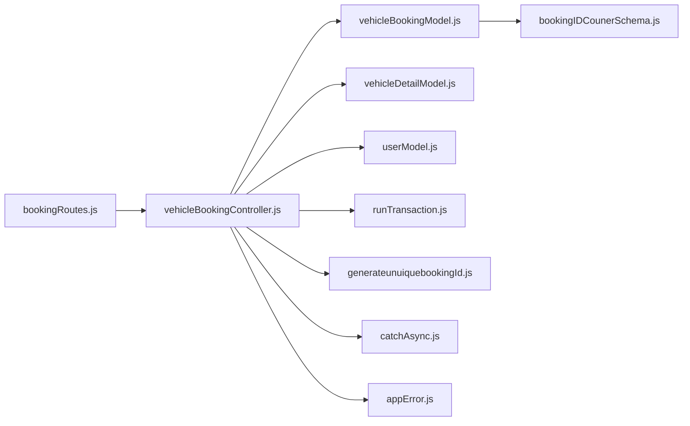

**Diagram sources**
- [bookingRoutes.js](file://backend/router/bookingRoutes.js#L1-L31)
- [vehicleBookingController.js](file://backend/Controller/vehicleBookingController.js#L1-L15)
- [vehicleBookingModel.js](file://backend/model/vehicleBookingModel.js#L1-L105)
- [vehicleDetailModel.js](file://backend/model/vehicleDetailModel.js#L1-L145)
- [userModel.js](file://backend/model/userModel.js#L1-L162)
- [runTransaction.js](file://backend/model/runTransaction.js#L1-L43)
- [generateunuiquebookingId.js](file://backend/utils/generateunuiquebookingId.js#L1-L23)
- [catchAsync.js](file://backend/utils/catchAsync.js#L1-L6)
- [appError.js](file://backend/utils/appError.js#L1-L12)
- [bookingIDCounerSchema.js](file://backend/model/bookingIDCounerSchema.js#L1-L17)

**Section sources**
- [bookingRoutes.js](file://backend/router/bookingRoutes.js#L1-L31)
- [vehicleBookingController.js](file://backend/Controller/vehicleBookingController.js#L1-L15)
- [vehicleBookingModel.js](file://backend/model/vehicleBookingModel.js#L1-L105)
- [vehicleDetailModel.js](file://backend/model/vehicleDetailModel.js#L1-L145)
- [userModel.js](file://backend/model/userModel.js#L1-L162)
- [runTransaction.js](file://backend/model/runTransaction.js#L1-L43)
- [generateunuiquebookingId.js](file://backend/utils/generateunuiquebookingId.js#L1-L23)
- [catchAsync.js](file://backend/utils/catchAsync.js#L1-L6)
- [appError.js](file://backend/utils/appError.js#L1-L12)
- [bookingIDCounerSchema.js](file://backend/model/bookingIDCounerSchema.js#L1-L17)

## Performance Considerations
- Indexes: A unique index on the embedded unique booking ID prevents duplicates and speeds up lookups.
- Transactions: Using sessions ensures consistency but adds overhead; keep transaction scopes minimal.
- Embedded vs. referenced: Embedding vehicle details reduces joins but can increase document size; monitor update frequency and document size limits.
- Availability checks: Efficiently compute overlaps using date comparisons; consider indexing booked periods if the dataset grows large.
- Unique ID generation: The counter-based approach avoids race conditions; ensure the counter collection remains small and indexed.

[No sources needed since this section provides general guidance]

## Troubleshooting Guide
Common issues and resolutions:
- Duplicate booking IDs: Ensure the pre-save hook runs and the counter is updated atomically.
- Overlapping bookings: Verify availability checks and that vehicle date blocks are updated within the same transaction.
- Unauthorized actions: Confirm authentication and authorization middleware are applied to protected routes.
- Transaction failures: Review error handling and ensure rollback occurs on exceptions.

**Section sources**
- [vehicleBookingModel.js](file://backend/model/vehicleBookingModel.js#L68-L72)
- [vehicleBookingController.js](file://backend/Controller/vehicleBookingController.js#L279-L425)
- [bookingRoutes.js](file://backend/router/bookingRoutes.js#L4-L5)
- [runTransaction.js](file://backend/model/runTransaction.js#L13-L16)
- [appError.js](file://backend/utils/appError.js#L1-L12)

## Conclusion
The booking model schema integrates user, vehicle, and booking data efficiently while enforcing strong validation and consistency through embedded documents and MongoDB transactions. The dual unique ID mechanisms ensure robust identification, and the controller logic covers creation, cancellation, rescheduling, and completion workflows with clear transaction boundaries and notifications.

[No sources needed since this section summarizes without analyzing specific files]

## Appendices

### Field Definitions
- bookingId (auto-generated): Unique identifier for each booking detail, generated via a counter and embedded in the booking document.
- startDate: Pickup date/time for the booking.
- endDate: Drop-off date/time for the booking.
- totalAmount: Calculated total price for the booking detail.
- bookingStatus: Enumerated status reflecting lifecycle stages.
- paymentInfo: Embedded pricing breakdown (price, extraExpenditure, tax, totalPrice).
- cancellation policies: Cancellation allowed only within a 12-hour window unless admin overrides.

[No sources needed since this section provides general guidance]