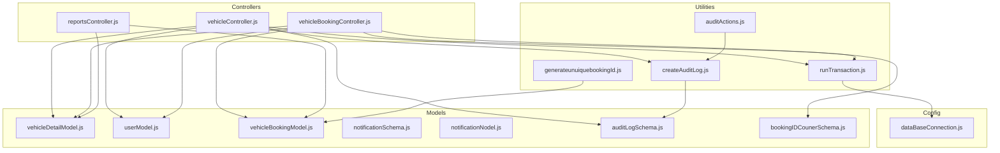
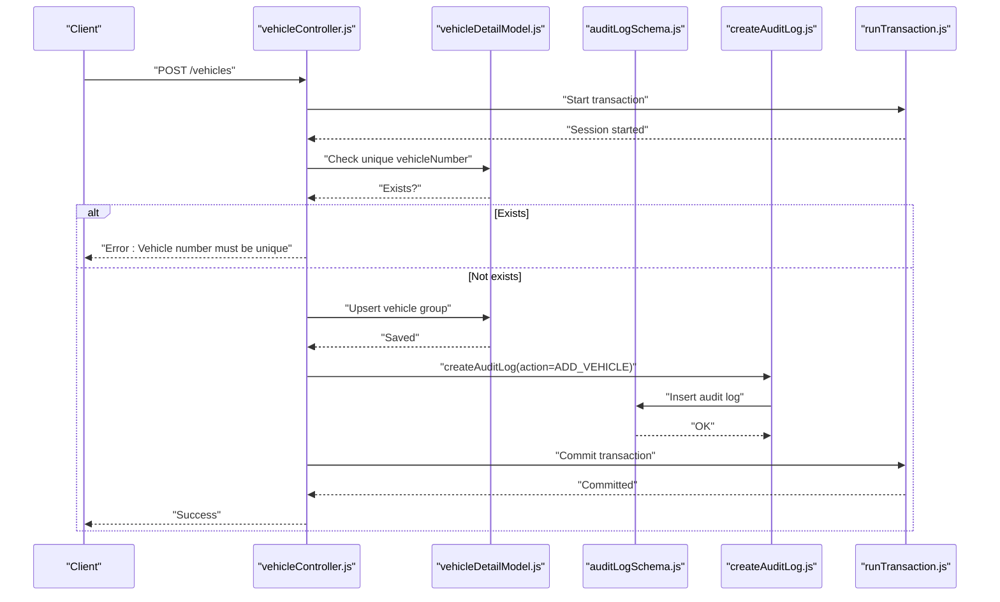
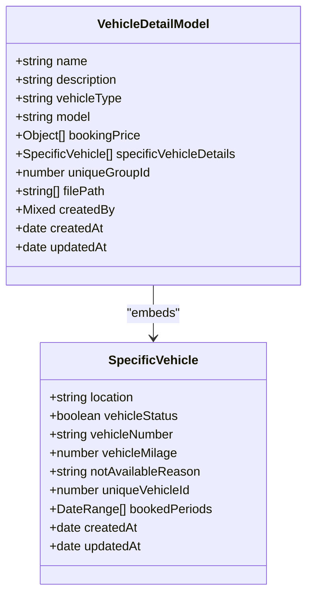
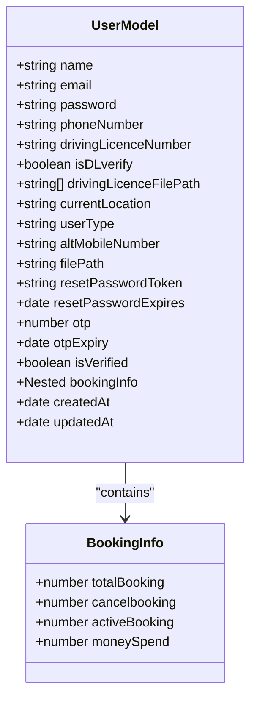
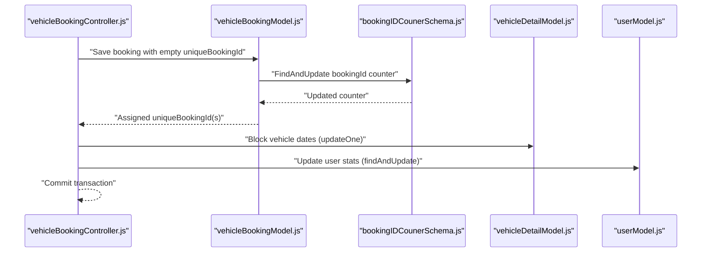
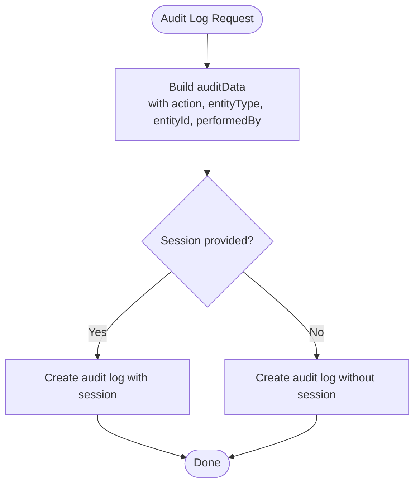
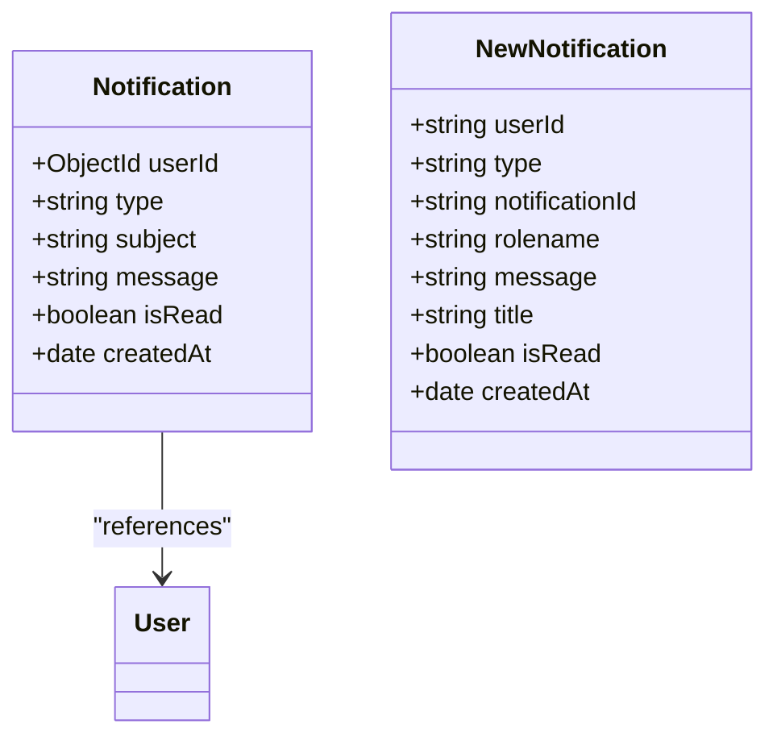
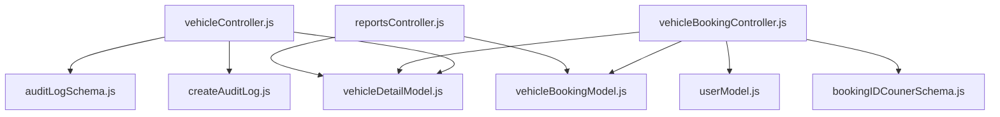
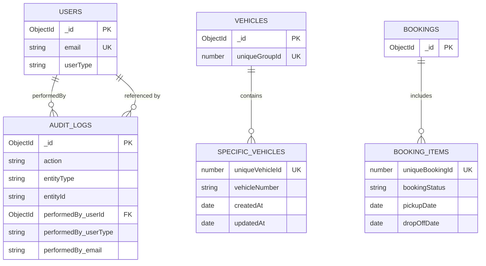

# Data Models & Schema

<cite>
**Referenced Files in This Document**
- [vehicleDetailModel.js](file://backend/model/vehicleDetailModel.js)
- [userModel.js](file://backend/model/userModel.js)
- [vehicleBookingModel.js](file://backend/model/vehicleBookingModel.js)
- [notificationSchema.js](file://backend/model/notificationSchema.js)
- [notificationNodel.js](file://backend/model/notificationNodel.js)
- [auditLogSchema.js](file://backend/model/auditLogSchema.js)
- [bookingIDCounerSchema.js](file://backend/model/bookingIDCounerSchema.js)
- [auditActions.js](file://backend/config/auditActions.js)
- [createAuditLog.js](file://backend/utils/createAuditLog.js)
- [runTransaction.js](file://backend/model/runTransaction.js)
- [dataBaseConnection.js](file://backend/DatabaseConnection/dataBaseConnection.js)
- [generateunuiquebookingId.js](file://backend/utils/generateunuiquebookingId.js)
- [vehicleController.js](file://backend/Controller/vehicleController.js)
- [vehicleBookingController.js](file://backend/Controller/vehicleBookingController.js)
- [reportsController.js](file://backend/Controller/reportsController.js)
</cite>

## Table of Contents
1. [Introduction](#introduction)
2. [Project Structure](#project-structure)
3. [Core Components](#core-components)
4. [Architecture Overview](#architecture-overview)
5. [Detailed Component Analysis](#detailed-component-analysis)
6. [Dependency Analysis](#dependency-analysis)
7. [Performance Considerations](#performance-considerations)
8. [Troubleshooting Guide](#troubleshooting-guide)
9. [Conclusion](#conclusion)
10. [Appendices](#appendices)

## Introduction
This document provides comprehensive data model documentation for the Vehicle Management System. It details the entities and their relationships among vehicles, users, bookings, notifications, and audit logs. It also documents field definitions, data types, validation rules, business constraints, primary/foreign key relationships, indexing strategies, query optimization patterns, data access patterns, aggregation pipelines, transaction management, data lifecycle policies, retention requirements, archival strategies, data security measures, access control, and privacy compliance. Sample data structures and common query examples are included to demonstrate typical data operations.

## Project Structure
The data models are implemented using Mongoose ODM with MongoDB. The models are organized under the backend/model directory, with supporting utilities and configuration under backend/utils, backend/config, and backend/Controller. Database connection is centralized in backend/DatabaseConnection.

**Diagram sources**
- [vehicleDetailModel.js](file://backend/model/vehicleDetailModel.js#L1-L145)
- [userModel.js](file://backend/model/userModel.js#L1-L162)
- [vehicleBookingModel.js](file://backend/model/vehicleBookingModel.js#L1-L105)
- [notificationSchema.js](file://backend/model/notificationSchema.js#L1-L13)
- [notificationNodel.js](file://backend/model/notificationNodel.js#L1-L12)
- [auditLogSchema.js](file://backend/model/auditLogSchema.js#L1-L64)
- [bookingIDCounerSchema.js](file://backend/model/bookingIDCounerSchema.js#L1-L17)
- [createAuditLog.js](file://backend/utils/createAuditLog.js#L1-L31)
- [runTransaction.js](file://backend/model/runTransaction.js#L1-L43)
- [generateunuiquebookingId.js](file://backend/utils/generateunuiquebookingId.js#L1-L23)
- [auditActions.js](file://backend/config/auditActions.js#L1-L18)
- [vehicleController.js](file://backend/Controller/vehicleController.js#L1-L200)
- [vehicleBookingController.js](file://backend/Controller/vehicleBookingController.js#L1-L433)
- [reportsController.js](file://backend/Controller/reportsController.js#L1-L91)
- [dataBaseConnection.js](file://backend/DatabaseConnection/dataBaseConnection.js#L1-L17)

**Section sources**
- [vehicleDetailModel.js](file://backend/model/vehicleDetailModel.js#L1-L145)
- [userModel.js](file://backend/model/userModel.js#L1-L162)
- [vehicleBookingModel.js](file://backend/model/vehicleBookingModel.js#L1-L105)
- [notificationSchema.js](file://backend/model/notificationSchema.js#L1-L13)
- [notificationNodel.js](file://backend/model/notificationNodel.js#L1-L12)
- [auditLogSchema.js](file://backend/model/auditLogSchema.js#L1-L64)
- [bookingIDCounerSchema.js](file://backend/model/bookingIDCounerSchema.js#L1-L17)
- [createAuditLog.js](file://backend/utils/createAuditLog.js#L1-L31)
- [runTransaction.js](file://backend/model/runTransaction.js#L1-L43)
- [generateunuiquebookingId.js](file://backend/utils/generateunuiquebookingId.js#L1-L23)
- [auditActions.js](file://backend/config/auditActions.js#L1-L18)
- [vehicleController.js](file://backend/Controller/vehicleController.js#L1-L200)
- [vehicleBookingController.js](file://backend/Controller/vehicleBookingController.js#L1-L433)
- [reportsController.js](file://backend/Controller/reportsController.js#L1-L91)
- [dataBaseConnection.js](file://backend/DatabaseConnection/dataBaseConnection.js#L1-L17)

## Core Components
This section defines the core entities and their attributes, constraints, and relationships.

- Vehicles
  - Purpose: Stores vehicle groups and embedded specific vehicle instances.
  - Key fields:
    - name: String, required
    - description: String, default null
    - vehicleType: String, required
    - model: String, required
    - bookingPrice: Array of objects with range and price, required
    - specificVehicleDetails: Array of embedded documents with:
      - location: String, default "abc"
      - vehicleStatus: Boolean, default true
      - vehicleNumber: String, required, unique enforced at application level
      - vehicleMilage: Number, default null
      - notAvailableReason: Enum ["In Repair", "Accident", "Other", "Booking"], default null
      - uniqueVehicleId: Number, unique
      - bookedPeriods: Array of { startDate: Date, endDate: Date }
      - createdAt/updatedAt: Dates
    - uniqueGroupId: Number, unique, required
    - filePath: Array of Strings
    - createdBy: Mixed object
    - createdAt/updatedAt: Dates
  - Validation rules:
    - Embedded vehicleNumber uniqueness enforced via application logic.
    - Pre-validate hook sets uniqueGroupId for new vehicle documents.
  - Indexes:
    - None explicitly defined on vehicleDetailModel.js; consider adding compound indexes for frequent queries (e.g., vehicleType + model, uniqueGroupId).
  - Business constraints:
    - uniqueGroupId is generated from current date/time to ensure uniqueness across creation sessions.
    - specificVehicleDetails maintains per-instance availability and scheduling.

- Users
  - Purpose: Manages user and admin profiles.
  - Key fields:
    - name: String, required
    - email: String, unique, required, validated as email
    - password: String, required, min length 6
    - phoneNumber: String, required, validated as 10 digits
    - drivingLicenceNumber: String, unique
    - isDLverify: Boolean, default false
    - drivingLicenceFilePath: Array of Strings, default []
    - currentLocation: String, default "Bengaluru"
    - userType: Enum ["user", "admin"], default "user"
    - altMobileNumber: String, optional, validated as 10 digits if present
    - filePath: String, default null
    - resetPasswordToken/resetPasswordExpires: For password reset workflow
    - otp/otpExpiry: For OTP-based verification
    - isVerified: Boolean, default false
    - bookingInfo: Nested counters:
      - totalBooking: Number, default 0
      - cancelbooking: Number, default 0
      - activeBooking: Number, default 0
      - moneySpend: Number, default 0
    - createdAt/updatedAt: Dates
  - Validation rules:
    - Email and phone number validations via regex.
    - Password hashed before save via pre-save hook.
    - Index on { isDLverify: 1, createdAt: -1 } to optimize driver license verification queries.
  - Business constraints:
    - Unique constraints on email and drivingLicenceNumber.
    - userType controls access to administrative actions.

- Bookings
  - Purpose: Tracks booking records with embedded vehicle details and auto-generated unique booking identifiers.
  - Key fields:
    - userEmail: String, required
    - vehicleDetails: Array of embedded objects with:
      - name, model, description, vehicleType: Strings
      - uniqueVehicleId: Number, required
      - vehicleStatus: Boolean, required
      - location, vehicleNumber, vehicleMilage: Strings/Numbers
      - filePath: Array of Strings
      - bookingStatus: Enum ["pending", "confirmed", "cancelled", "completed"], required
      - pickupDate/dropOffDate: Dates, required
      - price, extraExpenditure, tax, totalPrice: Numbers, required
      - damage: Number, default 0
      - uniqueBookingId: Number, immutable, auto-assigned
      - createdAt: Date, default now
    - userDetails: Mixed object
    - createdAt/updatedAt: Dates
  - Validation rules:
    - Embedded uniqueBookingId uniqueness enforced via a database index on the nested field.
    - Pre-save hook assigns uniqueBookingId using a Counter collection.
  - Business constraints:
    - uniqueBookingId is generated using a counter to ensure global uniqueness across documents.
    - Immutable flag prevents updates after creation.

- Notifications
  - Legacy notification model:
    - userId: ObjectId referencing User, required
    - type: String, required
    - subject: String, required
    - message: String, required
    - isRead: Boolean, default false
    - createdAt: Date, default now
  - New notification model:
    - userId: String, required
    - type: String, default "general"
    - notificationId: String, default "general"
    - rolename: String, required
    - message: String, required
    - title: String, required
    - isRead: Boolean, default false
    - createdAt: Date, default now

- Audit Logs
  - Purpose: Captures administrative and operational actions with metadata.
  - Key fields:
    - action: String, required, indexed
    - entityType: String, required, indexed ("VEHICLE", "BOOKING", "USER")
    - entityId: String, required, indexed
    - performedBy: Nested object with:
      - userId: ObjectId referencing User, required
      - userType: Enum ["admin", "user"], required
      - email: String, required
    - oldValue/newValue: Objects, defaults null
    - ipAddress: String
    - userAgent: String
    - createdAt/updatedAt: Dates
  - Indexes:
    - action, entityType, entityId are indexed for efficient filtering and reporting.

- Counter (Booking ID)
  - Purpose: Provides auto-increment sequences for unique booking IDs.
  - Fields:
    - name: String, unique, required
    - seq: Number, default 0

**Section sources**
- [vehicleDetailModel.js](file://backend/model/vehicleDetailModel.js#L6-L105)
- [userModel.js](file://backend/model/userModel.js#L6-L128)
- [vehicleBookingModel.js](file://backend/model/vehicleBookingModel.js#L9-L66)
- [notificationSchema.js](file://backend/model/notificationSchema.js#L3-L10)
- [notificationNodel.js](file://backend/model/notificationNodel.js#L2-L11)
- [auditLogSchema.js](file://backend/model/auditLogSchema.js#L3-L57)
- [bookingIDCounerSchema.js](file://backend/model/bookingIDCounerSchema.js#L4-L14)

## Architecture Overview
The system uses MongoDB collections mapped by Mongoose models. Controllers orchestrate business logic, enforce validation, manage transactions, and trigger notifications and audit logging. Aggregation pipelines are used for reporting and analytics.

**Diagram sources**
- [vehicleController.js](file://backend/Controller/vehicleController.js#L73-L168)
- [vehicleDetailModel.js](file://backend/model/vehicleDetailModel.js#L108-L115)
- [auditLogSchema.js](file://backend/model/auditLogSchema.js#L3-L57)
- [createAuditLog.js](file://backend/utils/createAuditLog.js#L3-L30)
- [runTransaction.js](file://backend/model/runTransaction.js#L4-L18)

## Detailed Component Analysis

### Vehicle Model Analysis
- Embedding strategy:
  - specificVehicleDetails embeds per-unit attributes, enabling single-document reads for vehicle groups.
- Uniqueness enforcement:
  - vehicleNumber uniqueness is enforced at application level via a pre-save/pre-validate hook and a uniqueGroupId is generated during validation.
- Indexing:
  - Consider adding compound indexes for frequent filters (e.g., vehicleType + model, uniqueGroupId) to improve query performance.

**Diagram sources**
- [vehicleDetailModel.js](file://backend/model/vehicleDetailModel.js#L6-L105)

**Section sources**
- [vehicleDetailModel.js](file://backend/model/vehicleDetailModel.js#L6-L115)

### User Model Analysis
- Security:
  - Password hashing via bcrypt before save.
  - Email and phone validations ensure data quality.
- Access control:
  - userType determines role-based permissions.
- Analytics:
  - bookingInfo counters enable quick reporting on user activity.

**Diagram sources**
- [userModel.js](file://backend/model/userModel.js#L6-L128)

**Section sources**
- [userModel.js](file://backend/model/userModel.js#L6-L158)

### Booking Model Analysis
- Auto-increment logic:
  - uniqueBookingId is assigned using a Counter document, ensuring global uniqueness across documents.
- Embedded arrays:
  - vehicleDetails stores per-booking vehicle snapshots, preserving historical pricing and metadata.
- Constraints:
  - bookingStatus enum enforces valid lifecycle states.
  - Immutable uniqueBookingId prevents tampering.

**Diagram sources**
- [vehicleBookingModel.js](file://backend/model/vehicleBookingModel.js#L74-L97)
- [bookingIDCounerSchema.js](file://backend/model/bookingIDCounerSchema.js#L4-L14)
- [vehicleBookingController.js](file://backend/Controller/vehicleBookingController.js#L393-L422)

**Section sources**
- [vehicleBookingModel.js](file://backend/model/vehicleBookingModel.js#L9-L97)
- [vehicleBookingController.js](file://backend/Controller/vehicleBookingController.js#L378-L422)

### Audit Log Analysis
- Audit actions:
  - Defined in auditActions.js covering vehicle, booking, and user/admin actions.
- Transaction-safe logging:
  - createAuditLog supports passing a session to ensure audit entries are committed atomically with other operations.
- Indexing:
  - action, entityType, entityId are indexed to accelerate reporting and filtering.

**Diagram sources**
- [createAuditLog.js](file://backend/utils/createAuditLog.js#L3-L30)
- [auditLogSchema.js](file://backend/model/auditLogSchema.js#L3-L57)
- [auditActions.js](file://backend/config/auditActions.js#L1-L18)

**Section sources**
- [createAuditLog.js](file://backend/utils/createAuditLog.js#L3-L30)
- [auditLogSchema.js](file://backend/model/auditLogSchema.js#L3-L61)
- [auditActions.js](file://backend/config/auditActions.js#L1-L18)

### Notifications Analysis
- Legacy model:
  - References User via userId and includes basic fields for notification delivery.
- New model:
  - Simplified fields for internal notifications with role targeting.

**Diagram sources**
- [notificationSchema.js](file://backend/model/notificationSchema.js#L3-L10)
- [notificationNodel.js](file://backend/model/notificationNodel.js#L2-L11)

**Section sources**
- [notificationSchema.js](file://backend/model/notificationSchema.js#L3-L12)
- [notificationNodel.js](file://backend/model/notificationNodel.js#L2-L11)

## Dependency Analysis
- Controllers depend on models and utilities to enforce business rules, manage transactions, and produce audit trails.
- Models define schema-level constraints and indexes; controllers apply application-level validations and hooks.
- Aggregation pipelines in reportsController.js demonstrate cross-entity projections and computations.

**Diagram sources**
- [vehicleController.js](file://backend/Controller/vehicleController.js#L1-L20)
- [vehicleBookingController.js](file://backend/Controller/vehicleBookingController.js#L1-L20)
- [reportsController.js](file://backend/Controller/reportsController.js#L1-L20)
- [vehicleDetailModel.js](file://backend/model/vehicleDetailModel.js#L1-L10)
- [vehicleBookingModel.js](file://backend/model/vehicleBookingModel.js#L1-L10)
- [userModel.js](file://backend/model/userModel.js#L1-L10)
- [auditLogSchema.js](file://backend/model/auditLogSchema.js#L1-L10)
- [bookingIDCounerSchema.js](file://backend/model/bookingIDCounerSchema.js#L1-L10)

**Section sources**
- [vehicleController.js](file://backend/Controller/vehicleController.js#L1-L20)
- [vehicleBookingController.js](file://backend/Controller/vehicleBookingController.js#L1-L20)
- [reportsController.js](file://backend/Controller/reportsController.js#L1-L20)

## Performance Considerations
- Indexing strategies:
  - Add compound indexes for frequent queries:
    - Vehicles: { vehicleType: 1, model: 1 }, { uniqueGroupId: 1 }
    - Users: { isDLverify: 1, createdAt: -1 } (already defined)
    - Bookings: { "vehicleDetails.uniqueBookingId": 1 } (already defined)
    - Audit logs: { action: 1, entityType: 1, entityId: 1 } (already defined)
- Aggregation optimization:
  - Use $lookup judiciously; prefer embedding where appropriate (as seen in vehicleDetailModel.js).
  - Apply $match early in aggregation pipelines to reduce document size.
- Transactions:
  - Use runTransaction for multi-step operations to maintain consistency and avoid partial writes.
- Caching:
  - Invalidate cache keys after write operations (e.g., vehicles:all) to keep cached views consistent.

[No sources needed since this section provides general guidance]

## Troubleshooting Guide
- Duplicate vehicle number errors:
  - Occur when vehicleNumber is not unique; ensure application-level checks before insert/update.
- Booking ID generation failures:
  - Verify Counter document exists and increment logic runs; check for race conditions and retry if necessary.
- Audit log insertion failures:
  - Ensure session is passed when performing transactional writes; confirm indexes exist for filtered fields.
- User validation errors:
  - Confirm email and phone number formats; verify password strength and confirmation match.

**Section sources**
- [vehicleController.js](file://backend/Controller/vehicleController.js#L74-L83)
- [vehicleBookingModel.js](file://backend/model/vehicleBookingModel.js#L74-L97)
- [createAuditLog.js](file://backend/utils/createAuditLog.js#L24-L29)
- [userModel.js](file://backend/model/userModel.js#L135-L158)

## Conclusion
The Vehicle Management System employs embedded documents for vehicles to simplify reads and maintain consistency, while leveraging separate collections for users, bookings, notifications, and audit logs. Strong validation rules, explicit indexes, and transactional operations ensure data integrity. Aggregation pipelines support reporting needs, and audit logging captures critical operational events. Proper indexing, caching invalidation, and security measures (password hashing, role-based access) contribute to a robust and scalable data layer.

[No sources needed since this section summarizes without analyzing specific files]

## Appendices

### Entity Relationship Diagram

**Diagram sources**
- [userModel.js](file://backend/model/userModel.js#L14-L108)
- [vehicleDetailModel.js](file://backend/model/vehicleDetailModel.js#L33-L53)
- [vehicleBookingModel.js](file://backend/model/vehicleBookingModel.js#L49-L65)
- [auditLogSchema.js](file://backend/model/auditLogSchema.js#L24-L38)

### Data Access Patterns and Aggregation Pipelines
- Reports: Projection and aggregation to summarize vehicle inventory and booking metrics.
- Example pipeline highlights:
  - $project to select fields and map embedded arrays.
  - $addFields to compute derived metrics (e.g., count of specific vehicles).
  - Early $match and $sort for performance.

**Section sources**
- [reportsController.js](file://backend/Controller/reportsController.js#L56-L91)

### Transaction Management
- runTransaction utility:
  - Starts a session, executes a callback, commits on success, aborts on error.
  - Supports MongoDB transactions for multi-step operations.

**Section sources**
- [runTransaction.js](file://backend/model/runTransaction.js#L4-L18)

### Data Lifecycle Policies, Retention, and Archival
- Audit logs:
  - Retain for compliance; consider partitioning by time and purging older entries according to policy.
- Bookings:
  - Archive completed or canceled records after retention period; retain minimal metadata for reporting.
- Users:
  - Anonymize or purge personal data per privacy regulations after inactivity or upon request.

[No sources needed since this section provides general guidance]

### Data Security Measures, Access Control, and Privacy Compliance
- Authentication and authorization:
  - JWT tokens for session management; refresh tokens stored securely.
  - Role-based access control via userType.
- Data protection:
  - Passwords hashed with bcrypt; sensitive fields masked in logs and notifications.
  - Transport security via HTTPS and secure cookies.
- Privacy:
  - Minimize data collection; provide user controls for data deletion and access.

**Section sources**
- [userModel.js](file://backend/model/userModel.js#L142-L158)
- [vehicleController.js](file://backend/Controller/vehicleController.js#L129-L161)

### Sample Data Structures and Common Queries
- Vehicle creation payload:
  - Includes name, description, vehicleType, model, bookingPrice, and specificVehicleDetails with location, vehicleStatus, vehicleNumber, vehicleMilage, notAvailableReason.
- Booking creation payload:
  - Includes userEmail, vehicleDetails with snapshot fields, bookingStatus, pickupDate, dropOffDate, pricing fields, and uniqueBookingId assignment via counter.
- Typical queries:
  - Find available vehicles within a date range by checking specificVehicleDetails.bookedPeriods.
  - Aggregate booking statistics grouped by vehicle or user.
  - Filter audit logs by action and entityType for compliance reporting.

**Section sources**
- [vehicleController.js](file://backend/Controller/vehicleController.js#L20-L67)
- [vehicleBookingController.js](file://backend/Controller/vehicleBookingController.js#L326-L339)
- [reportsController.js](file://backend/Controller/reportsController.js#L34-L54)