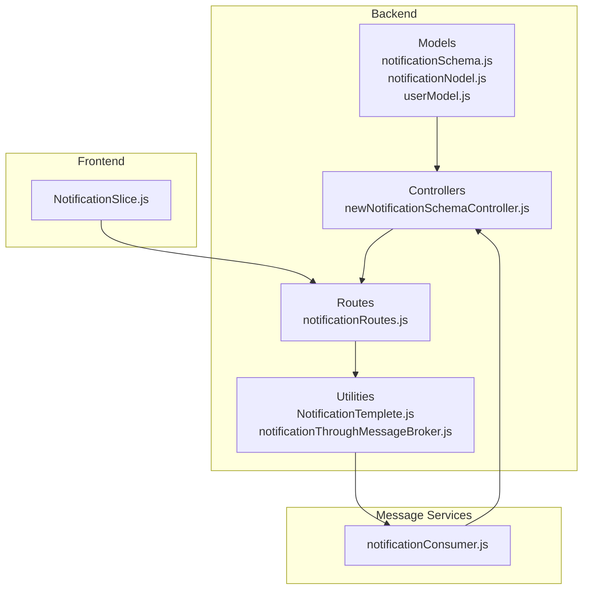
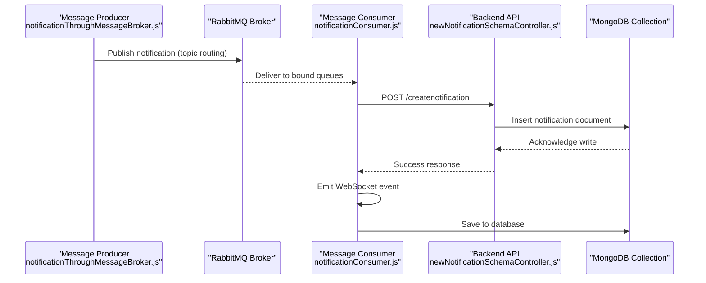
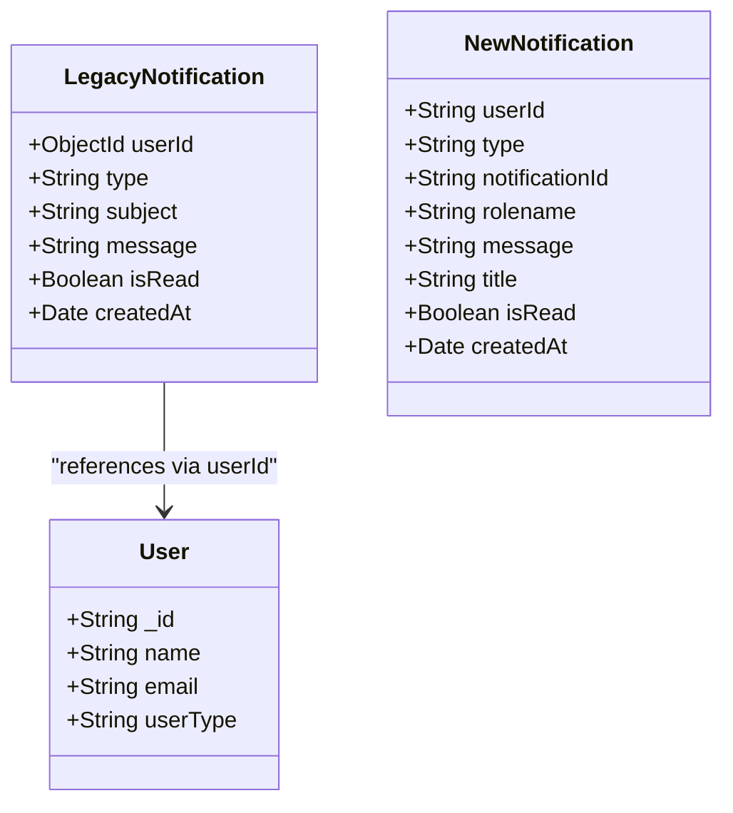
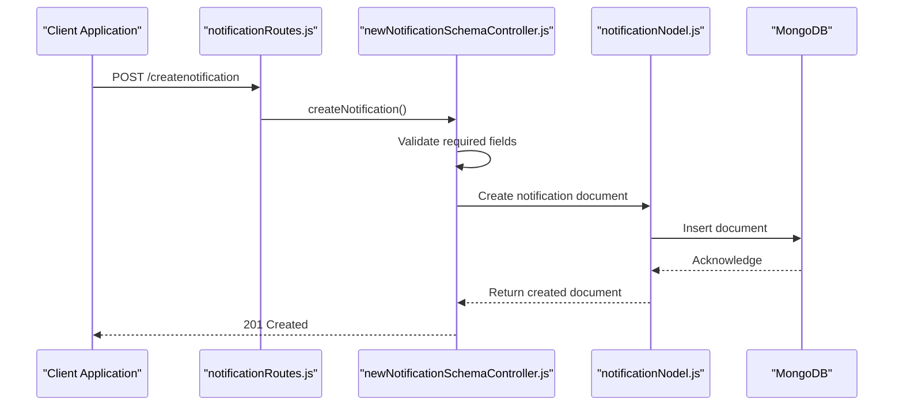
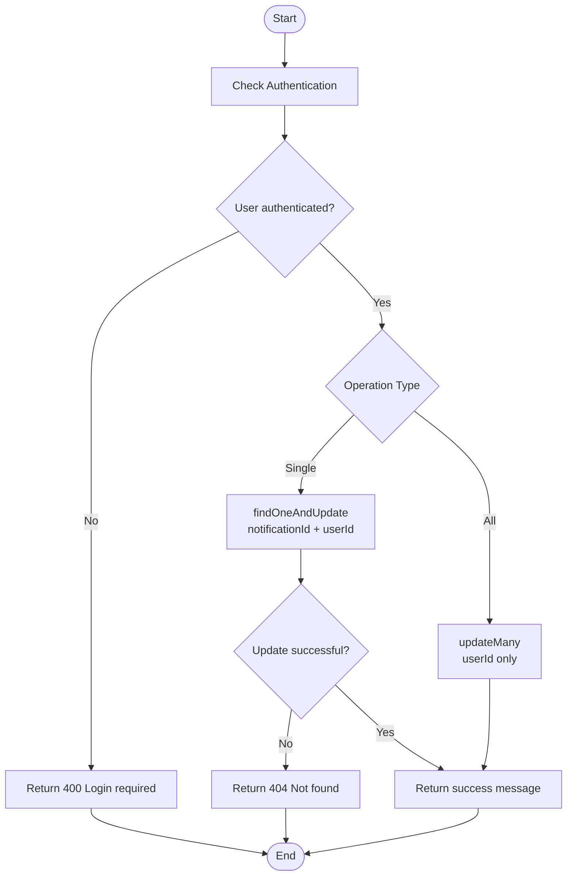
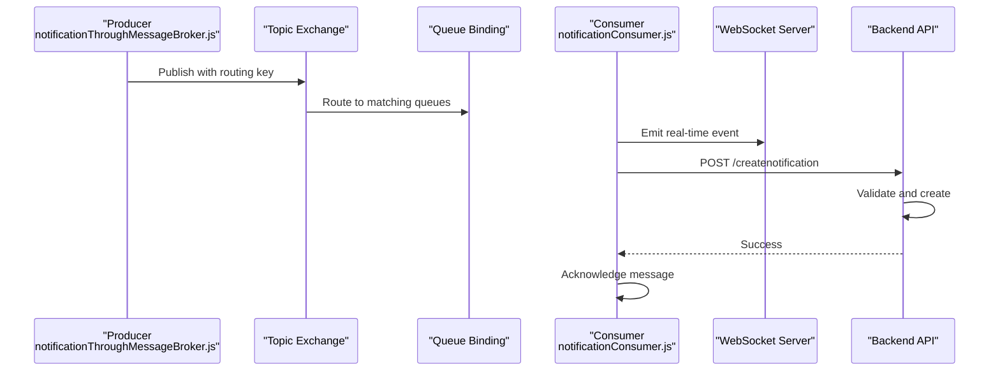
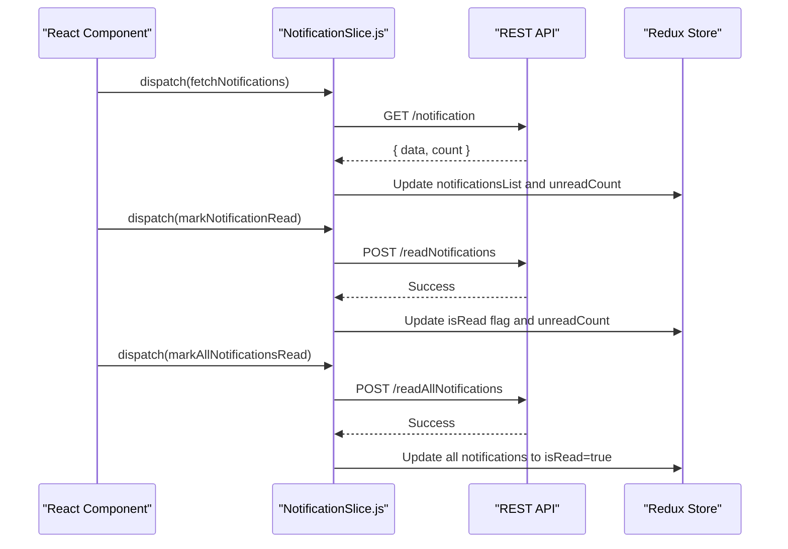
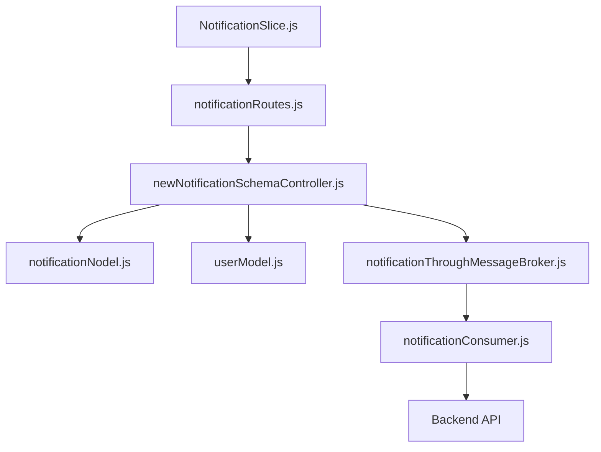

# Notification Model Schema

<cite>
**Referenced Files in This Document**
- [notificationSchema.js](file://backend/model/notificationSchema.js)
- [notificationNodel.js](file://backend/model/notificationNodel.js)
- [newNotificationSchemaController.js](file://backend/Controller/newNotificationSchemaController.js)
- [notificationRoutes.js](file://backend/router/notificationRoutes.js)
- [userModel.js](file://backend/model/userModel.js)
- [NotificationTemplete.js](file://backend/utils/NotificationTemplete.js)
- [notificationThroughMessageBroker.js](file://backend/utils/notificationThroughMessageBroker.js)
- [notificationConsumer.js](file://messageServices/controller/notificationConsumer.js)
- [NotificationSlice.js](file://frontend/src/appRedux/redux/notificationSlice/NotificationSlice.js)
</cite>

## Table of Contents
1. [Introduction](#introduction)
2. [Project Structure](#project-structure)
3. [Core Components](#core-components)
4. [Architecture Overview](#architecture-overview)
5. [Detailed Component Analysis](#detailed-component-analysis)
6. [Dependency Analysis](#dependency-analysis)
7. [Performance Considerations](#performance-considerations)
8. [Troubleshooting Guide](#troubleshooting-guide)
9. [Conclusion](#conclusion)
10. [Appendices](#appendices)

## Introduction
This document provides comprehensive data model documentation for the Notification entity schema used in the vehicle management system. It details the notification document structure, including notification types, recipients, message content, delivery status, and timestamps. The document explains validation rules for notification content, recipient targeting, and delivery tracking, along with indexing strategies for efficient retrieval and read status queries. It also documents the relationship between notifications and users, including many-to-many relationships for broadcast notifications, and provides practical examples of notification creation, delivery tracking, read status updates, and notification history management.

## Project Structure
The notification system spans multiple layers:
- Data models define the notification schema and user relationships
- Controllers manage CRUD operations and status updates
- Routes expose REST endpoints for notification management
- Utilities handle message broker integration and templates
- Frontend Redux slices manage client-side state and user interactions

**Diagram sources**
- [notificationSchema.js](file://backend/model/notificationSchema.js#L1-L13)
- [notificationNodel.js](file://backend/model/notificationNodel.js#L1-L12)
- [newNotificationSchemaController.js](file://backend/Controller/newNotificationSchemaController.js#L1-L112)
- [notificationRoutes.js](file://backend/router/notificationRoutes.js#L1-L14)
- [NotificationTemplete.js](file://backend/utils/NotificationTemplete.js#L1-L35)
- [notificationThroughMessageBroker.js](file://backend/utils/notificationThroughMessageBroker.js#L1-L69)
- [notificationConsumer.js](file://messageServices/controller/notificationConsumer.js#L1-L119)
- [NotificationSlice.js](file://frontend/src/appRedux/redux/notificationSlice/NotificationSlice.js#L1-L134)

**Section sources**
- [notificationSchema.js](file://backend/model/notificationSchema.js#L1-L13)
- [notificationNodel.js](file://backend/model/notificationNodel.js#L1-L12)
- [newNotificationSchemaController.js](file://backend/Controller/newNotificationSchemaController.js#L1-L112)
- [notificationRoutes.js](file://backend/router/notificationRoutes.js#L1-L14)
- [NotificationTemplete.js](file://backend/utils/NotificationTemplete.js#L1-L35)
- [notificationThroughMessageBroker.js](file://backend/utils/notificationThroughMessageBroker.js#L1-L69)
- [notificationConsumer.js](file://messageServices/controller/notificationConsumer.js#L1-L119)
- [NotificationSlice.js](file://frontend/src/appRedux/redux/notificationSlice/NotificationSlice.js#L1-L134)

## Core Components
This section defines the Notification entity schema and its core fields, including validation rules and relationships.

- Notification Model (legacy schema)
  - Field: userId (Object ID referencing User)
  - Field: type (String, required)
  - Field: subject (String, required)
  - Field: message (String, required)
  - Field: isRead (Boolean, default: false)
  - Field: createdAt (Date, default: current timestamp)
  - Relationship: Many-to-one with User via userId

- Notification Model (new schema)
  - Field: userId (String, required)
  - Field: type (String, required, default: "general")
  - Field: notificationId (String, required)
  - Field: rolename (String, required)
  - Field: message (String, required)
  - Field: title (String, required)
  - Field: isRead (Boolean, default: false)
  - Field: createdAt (Date, default: current timestamp)

Validation rules:
- Required fields: userId, message, title, rolename, notificationId, type
- Default values: type defaults to "general", isRead defaults to false
- Timestamps: createdAt defaults to current date/time

Indexing strategies:
- User-centric queries: Index on { userId: 1, createdAt: -1 }
- Read status queries: Index on { isRead: 1, createdAt: -1 }
- Combined indexes for frequent filters: { userId: 1, isRead: 1, createdAt: -1 }

**Section sources**
- [notificationSchema.js](file://backend/model/notificationSchema.js#L3-L10)
- [notificationNodel.js](file://backend/model/notificationNodel.js#L2-L11)
- [newNotificationSchemaController.js](file://backend/Controller/newNotificationSchemaController.js#L10-L12)
- [newNotificationSchemaController.js](file://backend/Controller/newNotificationSchemaController.js#L40-L42)

## Architecture Overview
The notification system follows a publish-subscribe pattern with message brokers for scalable delivery and a REST API for management operations.

**Diagram sources**
- [notificationThroughMessageBroker.js](file://backend/utils/notificationThroughMessageBroker.js#L33-L64)
- [notificationConsumer.js](file://messageServices/controller/notificationConsumer.js#L63-L87)
- [newNotificationSchemaController.js](file://backend/Controller/newNotificationSchemaController.js#L14-L28)

## Detailed Component Analysis

### Notification Data Model
The notification system maintains two complementary schemas to support different use cases and migration scenarios.

**Diagram sources**
- [notificationSchema.js](file://backend/model/notificationSchema.js#L3-L10)
- [notificationNodel.js](file://backend/model/notificationNodel.js#L2-L11)
- [userModel.js](file://backend/model/userModel.js#L6-L130)

Key differences between schemas:
- Legacy schema uses ObjectId for userId and includes subject field
- New schema uses String for userId and includes notificationId and title fields
- Both schemas share common fields: type, message, isRead, createdAt

**Section sources**
- [notificationSchema.js](file://backend/model/notificationSchema.js#L3-L10)
- [notificationNodel.js](file://backend/model/notificationNodel.js#L2-L11)
- [userModel.js](file://backend/model/userModel.js#L6-L130)

### Notification Creation Workflow
The system supports programmatic creation and message broker-driven creation.

**Diagram sources**
- [notificationRoutes.js](file://backend/router/notificationRoutes.js#L7-L10)
- [newNotificationSchemaController.js](file://backend/Controller/newNotificationSchemaController.js#L7-L29)
- [notificationNodel.js](file://backend/model/notificationNodel.js#L1-L12)

Validation rules during creation:
- All required fields must be present: notificationId, userId, rolename, message, title, type
- Type field defaults to "general" if not provided
- notificationId serves as a unique identifier for deduplication

**Section sources**
- [newNotificationSchemaController.js](file://backend/Controller/newNotificationSchemaController.js#L7-L29)
- [notificationNodel.js](file://backend/model/notificationNodel.js#L2-L11)

### Delivery Tracking and Status Management
The system provides granular control over notification read status with individual and bulk operations.

**Diagram sources**
- [newNotificationSchemaController.js](file://backend/Controller/newNotificationSchemaController.js#L63-L89)
- [newNotificationSchemaController.js](file://backend/Controller/newNotificationSchemaController.js#L92-L111)

Supported operations:
- Mark single notification as read/unread
- Mark all notifications as read/unread
- Automatic sorting by read status and creation time

**Section sources**
- [newNotificationSchemaController.js](file://backend/Controller/newNotificationSchemaController.js#L62-L111)

### Message Broker Integration
The system integrates with RabbitMQ for scalable notification delivery and real-time updates.

**Diagram sources**
- [notificationThroughMessageBroker.js](file://backend/utils/notificationThroughMessageBroker.js#L33-L64)
- [notificationConsumer.js](file://messageServices/controller/notificationConsumer.js#L63-L87)

Routing strategy:
- Admin notifications: notify.admin routing key
- User notifications: notify.user.{userId} routing key
- Topic exchange ensures flexible routing and binding

**Section sources**
- [notificationThroughMessageBroker.js](file://backend/utils/notificationThroughMessageBroker.js#L33-L64)
- [notificationConsumer.js](file://messageServices/controller/notificationConsumer.js#L56-L75)

### Frontend Notification Management
The frontend manages notification state using Redux Toolkit with asynchronous thunks for API interactions.

**Diagram sources**
- [NotificationSlice.js](file://frontend/src/appRedux/redux/notificationSlice/NotificationSlice.js#L5-L21)
- [NotificationSlice.js](file://frontend/src/appRedux/redux/notificationSlice/NotificationSlice.js#L24-L40)
- [NotificationSlice.js](file://frontend/src/appRedux/redux/notificationSlice/NotificationSlice.js#L43-L60)

State management:
- Maintains notificationsList, unreadCount, loading, and error states
- Provides actions for resetting state and clearing errors
- Updates UI reactively based on API responses

**Section sources**
- [NotificationSlice.js](file://frontend/src/appRedux/redux/notificationSlice/NotificationSlice.js#L62-L134)

## Dependency Analysis
The notification system exhibits clear separation of concerns with well-defined dependencies.

**Diagram sources**
- [notificationRoutes.js](file://backend/router/notificationRoutes.js#L1-L14)
- [newNotificationSchemaController.js](file://backend/Controller/newNotificationSchemaController.js#L1-L5)
- [notificationNodel.js](file://backend/model/notificationNodel.js#L1-L12)
- [userModel.js](file://backend/model/userModel.js#L1-L162)
- [notificationThroughMessageBroker.js](file://backend/utils/notificationThroughMessageBroker.js#L1-L69)
- [notificationConsumer.js](file://messageServices/controller/notificationConsumer.js#L1-L119)
- [NotificationSlice.js](file://frontend/src/appRedux/redux/notificationSlice/NotificationSlice.js#L1-L134)

Key dependencies:
- Controllers depend on models and utilities
- Routes depend on controllers
- Frontend depends on routes via API calls
- Message broker consumers depend on backend API

**Section sources**
- [notificationRoutes.js](file://backend/router/notificationRoutes.js#L1-L14)
- [newNotificationSchemaController.js](file://backend/Controller/newNotificationSchemaController.js#L1-L5)
- [notificationNodel.js](file://backend/model/notificationNodel.js#L1-L12)
- [userModel.js](file://backend/model/userModel.js#L1-L162)
- [notificationThroughMessageBroker.js](file://backend/utils/notificationThroughMessageBroker.js#L1-L69)
- [notificationConsumer.js](file://messageServices/controller/notificationConsumer.js#L1-L119)
- [NotificationSlice.js](file://frontend/src/appRedux/redux/notificationSlice/NotificationSlice.js#L1-L134)

## Performance Considerations
Optimization strategies for notification retrieval and management:

- Indexing strategy:
  - Primary index: { userId: 1, createdAt: -1 } for user-centric queries
  - Secondary index: { isRead: 1, createdAt: -1 } for read status filtering
  - Combined index: { userId: 1, isRead: 1, createdAt: -1 } for optimal sorting
  - TTL index: createdAt + TTL for automatic cleanup of old notifications

- Query optimization:
  - Use lean() queries for read-only operations to reduce memory overhead
  - Implement pagination for large notification histories
  - Leverage projection to limit returned fields for list views

- Caching considerations:
  - Cache recent notifications in Redis for frequently accessed user lists
  - Implement optimistic updates in frontend for immediate UI feedback
  - Use ETags for conditional requests to reduce bandwidth

- Scalability:
  - Message broker queuing prevents database overload during peak loads
  - Asynchronous processing decouples notification creation from user response time
  - Horizontal scaling of message consumers for high-throughput scenarios

## Troubleshooting Guide
Common issues and their resolutions:

- Authentication failures:
  - Symptom: 400 "Login is required" responses
  - Cause: Missing or invalid authentication tokens
  - Resolution: Ensure proper JWT token handling in frontend and middleware verification

- Notification not found errors:
  - Symptom: 404 "Notification not found" responses
  - Cause: Incorrect notificationId or userId mismatch
  - Resolution: Verify notificationId uniqueness and proper association with userId

- Message broker connectivity:
  - Symptom: "Producer connection lost" or "Connection closed" messages
  - Cause: Network issues or broker downtime
  - Resolution: Implement exponential backoff and monitor connection health

- Duplicate notifications:
  - Symptom: Multiple identical notifications for same event
  - Cause: Missing notificationId or duplicate message publishing
  - Resolution: Ensure unique notificationId generation and idempotent processing

- Frontend state inconsistencies:
  - Symptom: UI shows stale notification counts
  - Cause: Race conditions in state updates
  - Resolution: Use optimistic updates with proper error rollback

**Section sources**
- [newNotificationSchemaController.js](file://backend/Controller/newNotificationSchemaController.js#L36-L38)
- [newNotificationSchemaController.js](file://backend/Controller/newNotificationSchemaController.js#L81-L83)
- [notificationThroughMessageBroker.js](file://backend/utils/notificationThroughMessageBroker.js#L12-L16)
- [notificationConsumer.js](file://messageServices/controller/notificationConsumer.js#L20-L27)

## Conclusion
The notification system provides a robust, scalable solution for managing user communications in the vehicle management platform. The dual-schema approach accommodates both legacy and modern requirements while maintaining backward compatibility. The integration with message brokers ensures reliable delivery and real-time updates, while the REST API provides comprehensive management capabilities. Proper indexing and caching strategies enable efficient retrieval and status updates, and the frontend Redux integration delivers responsive user experiences. The system's modular design facilitates future enhancements and maintenance.

## Appendices

### Notification Template Definitions
The system includes predefined notification templates for common scenarios:

- Vehicle management notifications: newVehicleAdded, vehicleDelete, updateVehicle, updateGroupVehicle
- Booking notifications: new_booking
- Each template defines subject, identity, and message placeholders for dynamic content

**Section sources**
- [NotificationTemplete.js](file://backend/utils/NotificationTemplete.js#L1-L35)

### API Endpoint Reference
- POST /createnotification: Create new notification
- GET /notification: Retrieve user notifications
- POST /readNotifications: Mark single notification as read/unread
- POST /readAllNotifications: Mark all notifications as read/unread

**Section sources**
- [notificationRoutes.js](file://backend/router/notificationRoutes.js#L7-L10)