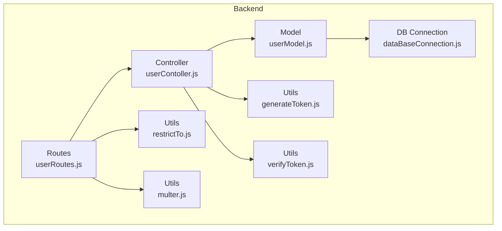
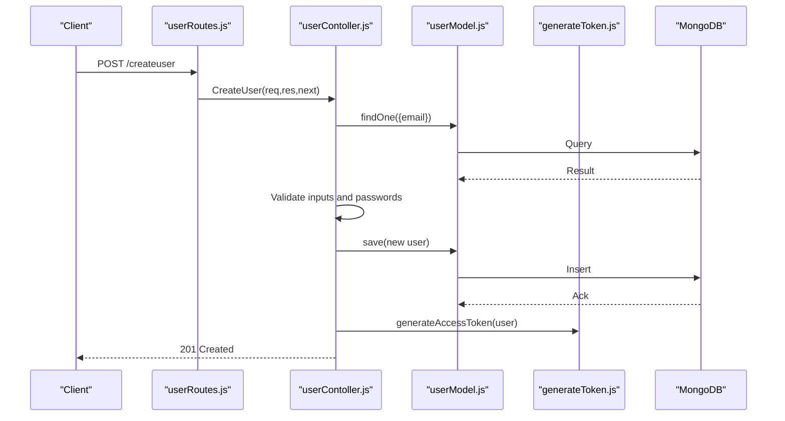
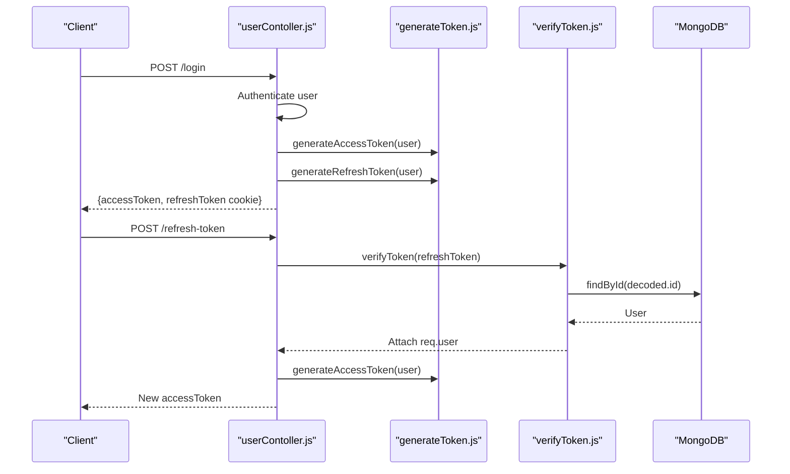
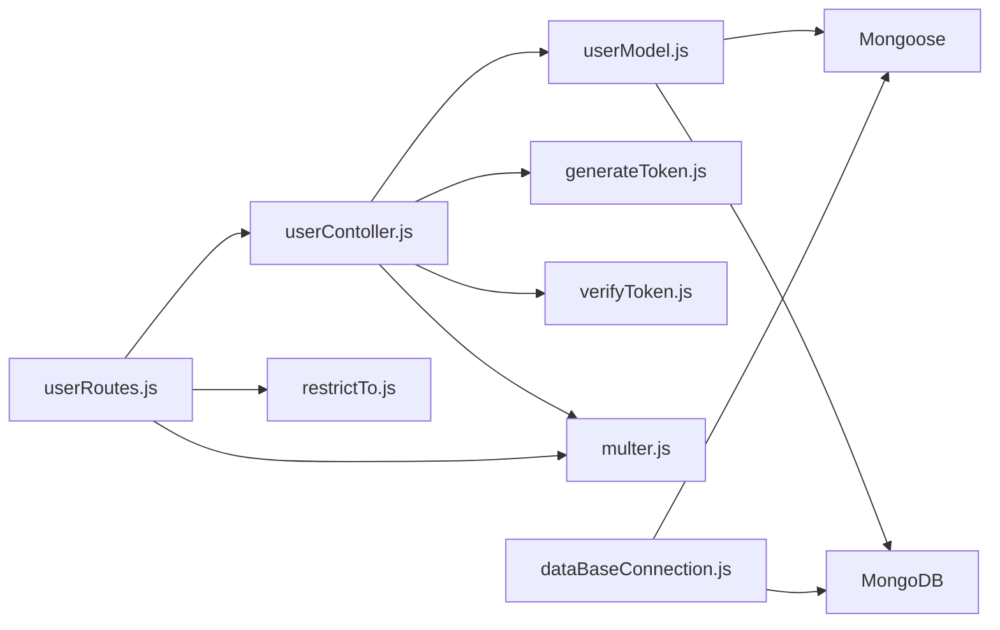

# User Model Schema

<cite>
**Referenced Files in This Document**
- [userModel.js](file://backend/model/userModel.js)
- [userContoller.js](file://backend/Controller/userContoller.js)
- [userRoutes.js](file://backend/router/userRoutes.js)
- [generateToken.js](file://backend/utils/generateToken.js)
- [verifyToken.js](file://backend/utils/verifyToken.js)
- [restrictTo.js](file://backend/utils/restrictTo.js)
- [multer.js](file://backend/utils/multer.js)
- [dataBaseConnection.js](file://backend/DatabaseConnection/dataBaseConnection.js)
</cite>

## Table of Contents
1. [Introduction](#introduction)
2. [Project Structure](#project-structure)
3. [Core Components](#core-components)
4. [Architecture Overview](#architecture-overview)
5. [Detailed Component Analysis](#detailed-component-analysis)
6. [Dependency Analysis](#dependency-analysis)
7. [Performance Considerations](#performance-considerations)
8. [Troubleshooting Guide](#troubleshooting-guide)
9. [Conclusion](#conclusion)
10. [Appendices](#appendices)

## Introduction
This document provides comprehensive data model documentation for the User entity schema used in the application. It covers the document structure, field definitions, validation rules, authentication and authorization mechanisms, indexing strategies, and operational workflows such as registration, authentication, profile updates, and role management. The goal is to enable developers and stakeholders to understand how user data is modeled, validated, stored, and accessed across the backend stack.

## Project Structure
The user model and related functionality are organized across the following layers:
- Model: Defines the Mongoose schema and instance methods for hashing passwords and generating tokens.
- Controller: Implements user operations such as registration, login, OTP handling, password reset, profile updates, and admin actions.
- Routes: Exposes REST endpoints for user operations, applying middleware for authentication, authorization, and file uploads.
- Utilities: Provide token generation/verification, role-based access control, and file upload configuration.

**Diagram sources**
- [userModel.js](file://backend/model/userModel.js#L1-L162)
- [userContoller.js](file://backend/Controller/userContoller.js#L1-L832)
- [userRoutes.js](file://backend/router/userRoutes.js#L1-L119)
- [generateToken.js](file://backend/utils/generateToken.js#L1-L28)
- [verifyToken.js](file://backend/utils/verifyToken.js#L1-L33)
- [restrictTo.js](file://backend/utils/restrictTo.js#L1-L18)
- [multer.js](file://backend/utils/multer.js#L1-L52)
- [dataBaseConnection.js](file://backend/DatabaseConnection/dataBaseConnection.js#L1-L17)

**Section sources**
- [userModel.js](file://backend/model/userModel.js#L1-L162)
- [userContoller.js](file://backend/Controller/userContoller.js#L1-L832)
- [userRoutes.js](file://backend/router/userRoutes.js#L1-L119)
- [generateToken.js](file://backend/utils/generateToken.js#L1-L28)
- [verifyToken.js](file://backend/utils/verifyToken.js#L1-L33)
- [restrictTo.js](file://backend/utils/restrictTo.js#L1-L18)
- [multer.js](file://backend/utils/multer.js#L1-L52)
- [dataBaseConnection.js](file://backend/DatabaseConnection/dataBaseConnection.js#L1-L17)

## Core Components
- User Schema: Defines the shape of user documents, including personal information, authentication credentials, profile settings, preferences, and administrative fields.
- Controller Methods: Implement user lifecycle operations including registration, login, OTP verification, password reset, profile updates, and admin-driven document verification.
- Route Handlers: Expose endpoints for user operations, enforce authentication and authorization, and manage file uploads.
- Token Utilities: Provide access and refresh token generation and verification.
- Access Control Utility: Restrict routes to specific roles (admin).
- File Upload Utility: Configure Cloudinary-backed storage for user-related files.

**Section sources**
- [userModel.js](file://backend/model/userModel.js#L6-L130)
- [userContoller.js](file://backend/Controller/userContoller.js#L24-L92)
- [userRoutes.js](file://backend/router/userRoutes.js#L21-L102)
- [generateToken.js](file://backend/utils/generateToken.js#L3-L27)
- [restrictTo.js](file://backend/utils/restrictTo.js#L3-L14)
- [multer.js](file://backend/utils/multer.js#L9-L44)

## Architecture Overview
The user data flow integrates schema validation, controller logic, route protection, and token-based authentication. The following sequence illustrates a typical user registration flow.

**Diagram sources**
- [userRoutes.js](file://backend/router/userRoutes.js#L21-L26)
- [userContoller.js](file://backend/Controller/userContoller.js#L24-L92)
- [userModel.js](file://backend/model/userModel.js#L134-L139)
- [generateToken.js](file://backend/utils/generateToken.js#L3-L14)
- [dataBaseConnection.js](file://backend/DatabaseConnection/dataBaseConnection.js#L6-L16)

## Detailed Component Analysis

### User Schema Definition
The User schema defines the document structure and validation rules. Key aspects:
- Personal Information
  - name: String, required, trimmed.
  - email: String, unique, required, trimmed, lowercased, validated as email.
  - phoneNumber: String, required, trimmed, validated as 10-digit numeric.
  - altMobileNumber: String, optional, validated as 10-digit numeric if present.
  - currentLocation: String, default "Bengaluru".
  - filePath: String, optional path to profile photo.
- Authentication Credentials
  - password: String, required, trimmed, minimum length 6.
  - userType: Enum ["user","admin"], default "user".
- Driving License Information
  - drivingLicenceNumber: String, unique, trimmed.
  - drivingLicenceFilePath: Array of Strings, default [].
  - isDLverify: Boolean, default false.
- Preferences and Settings
  - resetPasswordToken: String, default null.
  - resetPasswordExpires: Date, default null.
  - otp: Number, default null.
  - otpExpiry: Date, default null.
  - isVerified: Boolean, default false.
- Booking Metrics
  - bookingInfo: Embedded object containing:
    - totalBooking: Number, default 0.
    - cancelbooking: Number, default 0.
    - activeBooking: Number, default 0.
    - moneySpend: Number, default 0.
- Timestamps
  - timestamps enabled for createdAt/updatedAt.

Indexing
- Composite index on { isDLverify: 1, createdAt: -1 } to optimize admin queries for unverified licenses.

Instance Methods
- generateAuthToken(): Generates a JWT with user details and expiration.
- comparePassword(candidatePassword): Compares plain-text password against hashed password.

Validation Rules
- Email uniqueness enforced at schema level.
- Password minimum length enforced at schema level.
- Phone number validation ensures exactly 10 digits.
- Alternate phone number validation applies only when provided.

**Section sources**
- [userModel.js](file://backend/model/userModel.js#L6-L130)
- [userModel.js](file://backend/model/userModel.js#L131-L158)

### Controller Operations
Registration
- Validates presence of required fields and password confirmation.
- Checks email uniqueness.
- Saves user document; triggers pre-save hook to hash password.
- Sends welcome notifications and audit-related messages.

Login
- Supports login via email or phone number.
- Compares password using bcrypt.
- Issues access and refresh tokens and stores refresh token in HTTP-only cookie.

OTP Management
- sendOtpToEmail: Generates and stores a 6-digit OTP with 10-minute expiry; clears verification flag.
- verifyOtp: Validates OTP and expiry; sets isVerified and issues tokens.

Password Reset
- handleForgotPasswordSendEmail: Generates a random reset token with 1-hour expiry and sends reset link.
- resetPassword: Validates token and expiry, confirms passwords, updates password, clears reset fields.

Profile Updates
- updateUserDetails: Updates name, driving license number, alternate mobile number, and current location with validation.
- uploaddrivingLicenceDocument: Uploads driving license image and marks isDLverify false until admin review.
- uploadUserProfilePhoto: Uploads profile photo.
- downloadDrivingLicence: Returns first driving license file URL.
- downloadFile: Downloads user profile photo by ID.

Admin Actions
- drivingLiceceDocumentVerification: Marks a user’s license as verified.
- notVerifiedDrivingLicenceList: Lists users with unverified licenses.
- getAdminUsers: Retrieves all admin users.
- sendNotificationToAllAdmins: Broadcasts a message to all admin users.

Security and Cleanup
- logoutUser: Clears OTP, reset token, and verification flags; clears refresh token cookie.
- checkAuth: Confirms token validity and returns user info.

**Section sources**
- [userContoller.js](file://backend/Controller/userContoller.js#L24-L92)
- [userContoller.js](file://backend/Controller/userContoller.js#L94-L126)
- [userContoller.js](file://backend/Controller/userContoller.js#L128-L161)
- [userContoller.js](file://backend/Controller/userContoller.js#L660-L703)
- [userContoller.js](file://backend/Controller/userContoller.js#L705-L739)
- [userContoller.js](file://backend/Controller/userContoller.js#L286-L330)
- [userContoller.js](file://backend/Controller/userContoller.js#L332-L377)
- [userContoller.js](file://backend/Controller/userContoller.js#L378-L418)
- [userContoller.js](file://backend/Controller/userContoller.js#L420-L433)
- [userContoller.js](file://backend/Controller/userContoller.js#L435-L461)
- [userContoller.js](file://backend/Controller/userContoller.js#L462-L492)
- [userContoller.js](file://backend/Controller/userContoller.js#L762-L766)
- [userContoller.js](file://backend/Controller/userContoller.js#L768-L786)
- [userContoller.js](file://backend/Controller/userContoller.js#L608-L632)
- [userContoller.js](file://backend/Controller/userContoller.js#L643-L658)

### Role-Based Access Control (RBAC)
- userType field determines role ("user" or "admin").
- restrictTo middleware enforces role-based access to protected routes.
- Admin-only routes include:
  - GET /fetchDLList
  - PATCH /verifyDrivingLicenceDocument
  - GET /getalladmin
  - POST /sendnotification

**Section sources**
- [userModel.js](file://backend/model/userModel.js#L65-L70)
- [restrictTo.js](file://backend/utils/restrictTo.js#L3-L14)
- [userRoutes.js](file://backend/router/userRoutes.js#L93-L102)

### Token-Based Authentication
- Access Token: Short-lived (15 minutes), generated with user details and secret.
- Refresh Token: Long-lived (7 days), stored in HTTP-only cookie for secure session renewal.
- verifyToken middleware validates refresh tokens and attaches user to request.

**Diagram sources**
- [userContoller.js](file://backend/Controller/userContoller.js#L128-L161)
- [userContoller.js](file://backend/Controller/userContoller.js#L163-L185)
- [generateToken.js](file://backend/utils/generateToken.js#L3-L27)
- [verifyToken.js](file://backend/utils/verifyToken.js#L5-L29)

**Section sources**
- [generateToken.js](file://backend/utils/generateToken.js#L3-L27)
- [verifyToken.js](file://backend/utils/verifyToken.js#L5-L29)
- [userRoutes.js](file://backend/router/userRoutes.js#L6-L9)

### File Uploads and Storage
- Cloudinary-backed storage configured for user uploads.
- Routes support single-file uploads for profile photo and driving license.
- Uploaded file paths are stored in the user document.

**Section sources**
- [multer.js](file://backend/utils/multer.js#L9-L44)
- [userRoutes.js](file://backend/router/userRoutes.js#L70-L87)
- [userContoller.js](file://backend/Controller/userContoller.js#L332-L377)
- [userContoller.js](file://backend/Controller/userContoller.js#L378-L418)

### Validation Rules Summary
- Registration
  - Required fields: name, email, password, confirmPassword, phoneNumber.
  - Password confirmation must match.
  - Email must be unique and valid.
  - Phone number must be exactly 10 digits.
  - Alternate phone number must be exactly 10 digits if provided.
  - Password minimum length is 6.
- Profile Update
  - Alternate phone number must be exactly 10 digits if provided.
- Login
  - Supports login via email or phone number; password comparison handled securely.

**Section sources**
- [userContoller.js](file://backend/Controller/userContoller.js#L39-L50)
- [userModel.js](file://backend/model/userModel.js#L14-L46)
- [userContoller.js](file://backend/Controller/userContoller.js#L299-L313)

### Indexing Strategies
- Unique indexes
  - email: unique.
  - drivingLicenceNumber: unique.
- Composite index
  - { isDLverify: 1, createdAt: -1 }: Optimizes admin queries for unverified licenses.
- Additional considerations
  - Consider adding indexes on frequently queried fields like phoneNumber for login lookups if needed.

**Section sources**
- [userModel.js](file://backend/model/userModel.js#L16-L16)
- [userModel.js](file://backend/model/userModel.js#L49-L49)
- [userModel.js](file://backend/model/userModel.js#L131-L131)

### Example Workflows

#### User Registration
- Endpoint: POST /createuser
- Steps:
  - Validate required fields and password confirmation.
  - Check email uniqueness.
  - Save user; pre-save hook hashes password.
  - Send welcome notifications.

**Section sources**
- [userRoutes.js](file://backend/router/userRoutes.js#L21-L26)
- [userContoller.js](file://backend/Controller/userContoller.js#L24-L92)
- [userModel.js](file://backend/model/userModel.js#L134-L139)

#### Authentication Workflow
- Endpoint: POST /login
- Steps:
  - Resolve user by email or phone number.
  - Compare password.
  - Issue access and refresh tokens; store refresh token in HTTP-only cookie.

**Section sources**
- [userRoutes.js](file://backend/router/userRoutes.js#L27-L28)
- [userContoller.js](file://backend/Controller/userContoller.js#L128-L161)
- [generateToken.js](file://backend/utils/generateToken.js#L3-L27)

#### Profile Update
- Endpoint: PATCH /updateuserdetails
- Steps:
  - Validate and sanitize inputs.
  - Update fields with runValidators enabled.
  - Return updated user.

**Section sources**
- [userRoutes.js](file://backend/router/userRoutes.js#L48-L53)
- [userContoller.js](file://backend/Controller/userContoller.js#L286-L330)

#### Role Management (Admin)
- Endpoints:
  - GET /fetchDLList (admin-only)
  - PATCH /verifyDrivingLicenceDocument (admin-only)
  - GET /getalladmin
  - POST /sendnotification
- Steps:
  - Enforce role-based access using restrictTo.
  - Admin performs verification and broadcasts notifications.

**Section sources**
- [userRoutes.js](file://backend/router/userRoutes.js#L89-L102)
- [userContoller.js](file://backend/Controller/userContoller.js#L435-L461)
- [userContoller.js](file://backend/Controller/userContoller.js#L462-L492)
- [userContoller.js](file://backend/Controller/userContoller.js#L762-L766)
- [userContoller.js](file://backend/Controller/userContoller.js#L768-L786)
- [restrictTo.js](file://backend/utils/restrictTo.js#L3-L14)

## Dependency Analysis
The user model depends on Mongoose for schema definition and MongoDB for persistence. Controllers depend on the model and utilities for token handling and file uploads. Routes depend on controllers and middleware for authentication and authorization.

**Diagram sources**
- [userModel.js](file://backend/model/userModel.js#L1-L162)
- [userContoller.js](file://backend/Controller/userContoller.js#L1-L832)
- [userRoutes.js](file://backend/router/userRoutes.js#L1-L119)
- [generateToken.js](file://backend/utils/generateToken.js#L1-L28)
- [verifyToken.js](file://backend/utils/verifyToken.js#L1-L33)
- [restrictTo.js](file://backend/utils/restrictTo.js#L1-L18)
- [multer.js](file://backend/utils/multer.js#L1-L52)
- [dataBaseConnection.js](file://backend/DatabaseConnection/dataBaseConnection.js#L1-L17)

**Section sources**
- [userModel.js](file://backend/model/userModel.js#L1-L162)
- [userContoller.js](file://backend/Controller/userContoller.js#L1-L832)
- [userRoutes.js](file://backend/router/userRoutes.js#L1-L119)
- [generateToken.js](file://backend/utils/generateToken.js#L1-L28)
- [verifyToken.js](file://backend/utils/verifyToken.js#L1-L33)
- [restrictTo.js](file://backend/utils/restrictTo.js#L1-L18)
- [multer.js](file://backend/utils/multer.js#L1-L52)
- [dataBaseConnection.js](file://backend/DatabaseConnection/dataBaseConnection.js#L1-L17)

## Performance Considerations
- Indexing
  - Ensure unique indexes on email and drivingLicenceNumber.
  - Consider adding an index on phoneNumber for efficient login lookups.
- Validation
  - Schema-level validations reduce downstream errors and improve reliability.
- Token Lifetimes
  - Short-lived access tokens minimize risk; refresh tokens stored securely in HTTP-only cookies.
- File Upload Limits
  - Configured limits prevent oversized uploads; adjust as needed for policy compliance.

[No sources needed since this section provides general guidance]

## Troubleshooting Guide
Common issues and resolutions:
- Duplicate Email
  - Symptom: Registration fails with duplicate email.
  - Resolution: Ensure email uniqueness; check existing records before creation.
- Invalid Phone Number
  - Symptom: Validation error for phone number format.
  - Resolution: Ensure exactly 10 digits; remove non-digits and enforce length.
- Invalid OTP
  - Symptom: OTP verification fails.
  - Resolution: Confirm OTP matches and has not expired; resend OTP if needed.
- Expired Refresh Token
  - Symptom: Token refresh fails with expiration error.
  - Resolution: Require user to log in again to obtain a new refresh token.
- Unauthorized Access
  - Symptom: Access denied to admin-only endpoints.
  - Resolution: Ensure user has userType "admin"; verify role enforcement middleware.

**Section sources**
- [userContoller.js](file://backend/Controller/userContoller.js#L43-L46)
- [userModel.js](file://backend/model/userModel.js#L39-L45)
- [userContoller.js](file://backend/Controller/userContoller.js#L231-L237)
- [verifyToken.js](file://backend/utils/verifyToken.js#L24-L27)
- [restrictTo.js](file://backend/utils/restrictTo.js#L5-L12)

## Conclusion
The User entity schema provides a robust foundation for user data management, incorporating strong validation, secure authentication, and role-based access control. The controller and route layers implement comprehensive workflows for registration, authentication, profile management, and admin operations. Proper indexing and middleware ensure scalability and security. This documentation serves as a reference for maintaining and extending user-related functionality.

[No sources needed since this section summarizes without analyzing specific files]

## Appendices

### Field Reference
- Personal Information
  - name: String, required, trimmed.
  - email: String, unique, required, trimmed, lowercased, validated as email.
  - phoneNumber: String, required, trimmed, validated as 10-digit numeric.
  - altMobileNumber: String, optional, validated as 10-digit numeric if present.
  - currentLocation: String, default "Bengaluru".
  - filePath: String, optional.
- Authentication Credentials
  - password: String, required, trimmed, minimum length 6.
  - userType: Enum ["user","admin"], default "user".
- Driving License Information
  - drivingLicenceNumber: String, unique, trimmed.
  - drivingLicenceFilePath: Array of Strings, default [].
  - isDLverify: Boolean, default false.
- Preferences and Settings
  - resetPasswordToken: String, default null.
  - resetPasswordExpires: Date, default null.
  - otp: Number, default null.
  - otpExpiry: Date, default null.
  - isVerified: Boolean, default false.
- Booking Metrics
  - bookingInfo: Embedded object with totalBooking, cancelbooking, activeBooking, moneySpend.

**Section sources**
- [userModel.js](file://backend/model/userModel.js#L6-L128)