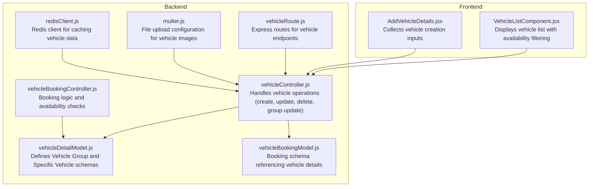
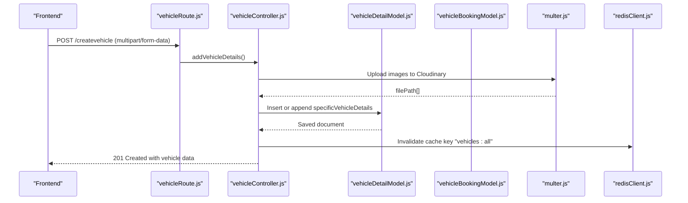
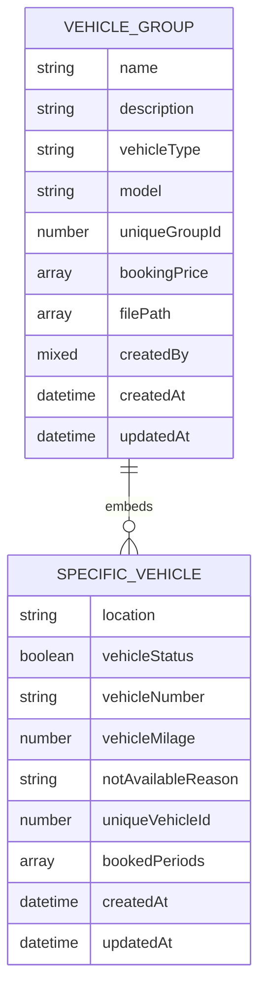
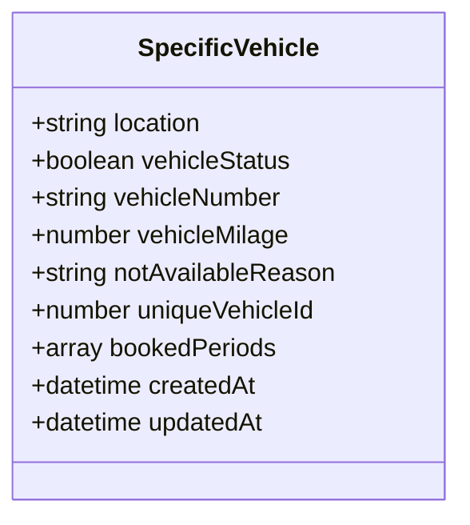
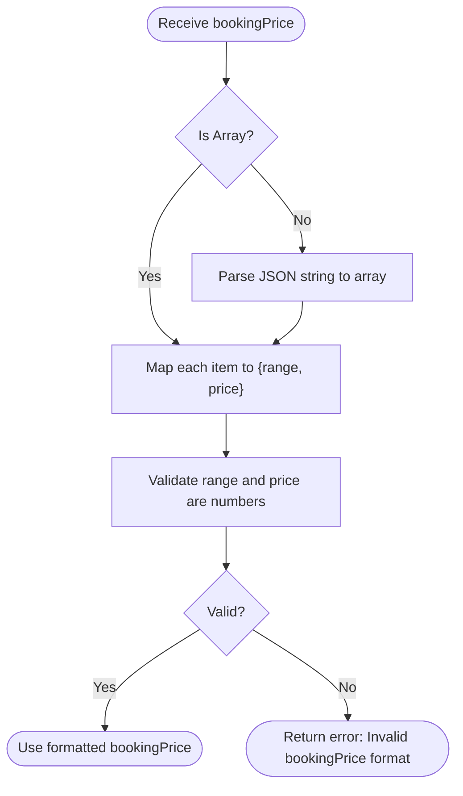
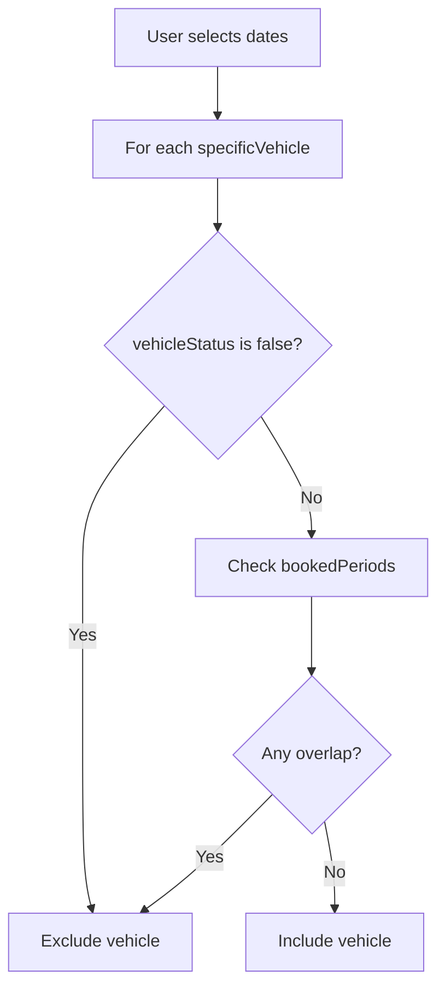
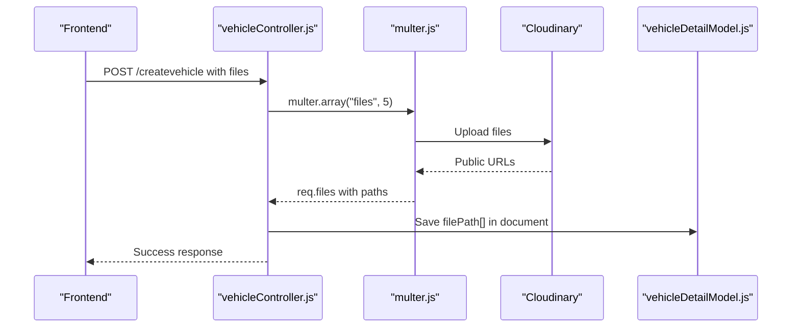
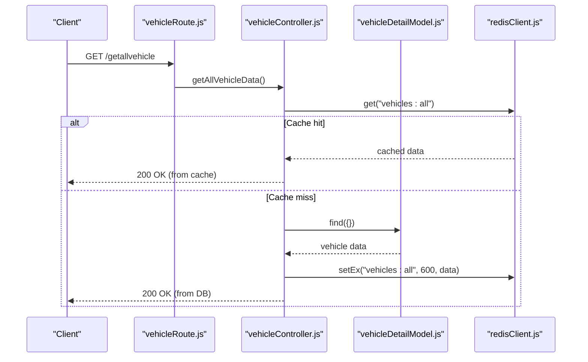
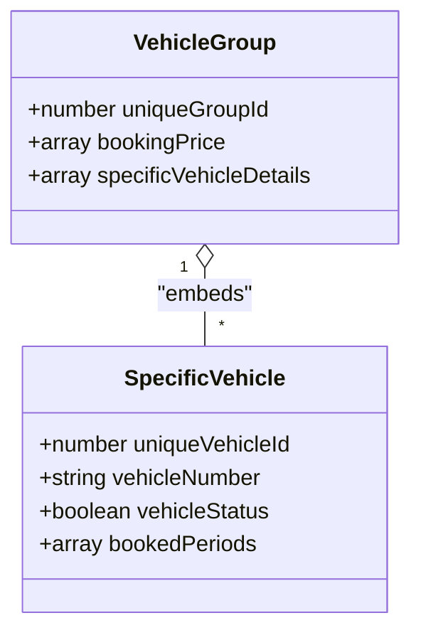
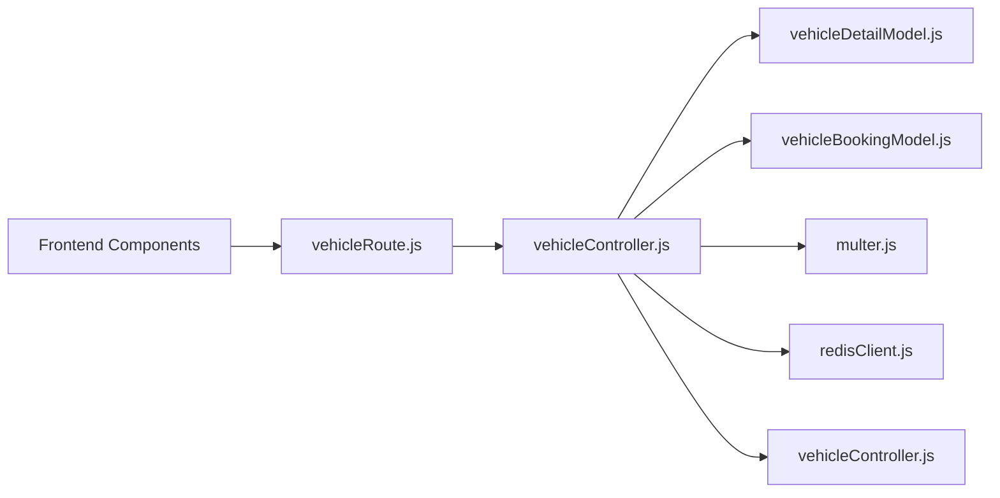

# Vehicle Model Schema

<cite>
**Referenced Files in This Document**
- [vehicleDetailModel.js](file://backend/model/vehicleDetailModel.js)
- [vehicleController.js](file://backend/Controller/vehicleController.js)
- [vehicleRoute.js](file://backend/router/vehicleRoute.js)
- [vehicleBookingModel.js](file://backend/model/vehicleBookingModel.js)
- [vehicleBookingController.js](file://backend/Controller/vehicleBookingController.js)
- [multer.js](file://backend/utils/multer.js)
- [redisClient.js](file://backend/config/redisClient.js)
- [VehicleListComponent.jsx](file://frontend/src/pages/AllvehiclePage/VehicleListComponent.jsx)
- [AddVehicleDetails.jsx](file://frontend/src/pages/addVehicle/AddVehicleDetails.jsx)
</cite>

## Table of Contents
1. [Introduction](#introduction)
2. [Project Structure](#project-structure)
3. [Core Components](#core-components)
4. [Architecture Overview](#architecture-overview)
5. [Detailed Component Analysis](#detailed-component-analysis)
6. [Dependency Analysis](#dependency-analysis)
7. [Performance Considerations](#performance-considerations)
8. [Troubleshooting Guide](#troubleshooting-guide)
9. [Conclusion](#conclusion)
10. [Appendices](#appendices)

## Introduction
This document provides comprehensive data model documentation for the Vehicle entity schema used in the vehicle rental system. It details the vehicle document structure, including vehicle group information, specific vehicle details, pricing tiers, availability status, and image references. It explains validation rules for vehicle attributes, capacity constraints, and pricing validation. It also documents indexing strategies for efficient vehicle searches and availability queries, describes the relationship between vehicle groups and individual vehicles, and provides examples of vehicle creation, update operations, and common query patterns for vehicle listings and availability checks.

## Project Structure
The vehicle model is implemented using MongoDB with Mongoose. The primary schema defines a vehicle group document that embeds multiple specific vehicle instances. Supporting controllers and routers manage CRUD operations, while the frontend components render vehicle lists and collect user inputs for vehicle creation.

**Diagram sources**
- [vehicleDetailModel.js](file://backend/model/vehicleDetailModel.js#L1-L145)
- [vehicleController.js](file://backend/Controller/vehicleController.js#L1-L824)
- [vehicleRoute.js](file://backend/router/vehicleRoute.js#L1-L42)
- [vehicleBookingModel.js](file://backend/model/vehicleBookingModel.js#L1-L105)
- [vehicleBookingController.js](file://backend/Controller/vehicleBookingController.js#L1-L200)
- [multer.js](file://backend/utils/multer.js#L1-L52)
- [redisClient.js](file://backend/config/redisClient.js#L1-L20)
- [VehicleListComponent.jsx](file://frontend/src/pages/AllvehiclePage/VehicleListComponent.jsx#L1-L224)
- [AddVehicleDetails.jsx](file://frontend/src/pages/addVehicle/AddVehicleDetails.jsx#L1-L343)

**Section sources**
- [vehicleDetailModel.js](file://backend/model/vehicleDetailModel.js#L1-L145)
- [vehicleController.js](file://backend/Controller/vehicleController.js#L1-L824)
- [vehicleRoute.js](file://backend/router/vehicleRoute.js#L1-L42)
- [vehicleBookingModel.js](file://backend/model/vehicleBookingModel.js#L1-L105)
- [vehicleBookingController.js](file://backend/Controller/vehicleBookingController.js#L1-L200)
- [multer.js](file://backend/utils/multer.js#L1-L52)
- [redisClient.js](file://backend/config/redisClient.js#L1-L20)
- [VehicleListComponent.jsx](file://frontend/src/pages/AllvehiclePage/VehicleListComponent.jsx#L1-L224)
- [AddVehicleDetails.jsx](file://frontend/src/pages/addVehicle/AddVehicleDetails.jsx#L1-L343)

## Core Components
- Vehicle Group Schema: Defines the top-level vehicle group document with metadata, pricing tiers, and embedded specific vehicle details.
- Specific Vehicle Schema: Embedded within the group, representing individual units with status, location, mileage, availability reasons, and booking periods.
- Booking Schema: References specific vehicle details for bookings, including pricing and status.
- Controllers and Routes: Manage vehicle lifecycle operations and expose endpoints for admins.
- Frontend Components: Collect inputs for vehicle creation and display filtered vehicle lists with availability checks.

**Section sources**
- [vehicleDetailModel.js](file://backend/model/vehicleDetailModel.js#L6-L145)
- [vehicleController.js](file://backend/Controller/vehicleController.js#L20-L803)
- [vehicleRoute.js](file://backend/router/vehicleRoute.js#L1-L42)
- [vehicleBookingModel.js](file://backend/model/vehicleBookingModel.js#L9-L105)
- [VehicleListComponent.jsx](file://frontend/src/pages/AllvehiclePage/VehicleListComponent.jsx#L100-L130)
- [AddVehicleDetails.jsx](file://frontend/src/pages/addVehicle/AddVehicleDetails.jsx#L29-L95)

## Architecture Overview
The system uses a hybrid approach:
- Vehicle groups are stored as documents with embedded arrays of specific vehicles.
- Availability is tracked per specific vehicle via booked periods.
- Pricing tiers are defined at the group level with multiple ranges.
- Images are uploaded via Cloudinary and referenced by file paths.
- Redis caches vehicle listings for improved performance.

**Diagram sources**
- [vehicleRoute.js](file://backend/router/vehicleRoute.js#L8-L14)
- [vehicleController.js](file://backend/Controller/vehicleController.js#L21-L203)
- [vehicleDetailModel.js](file://backend/model/vehicleDetailModel.js#L55-L105)
- [vehicleBookingModel.js](file://backend/model/vehicleBookingModel.js#L9-L66)
- [multer.js](file://backend/utils/multer.js#L25-L28)
- [redisClient.js](file://backend/config/redisClient.js#L1-L20)

## Detailed Component Analysis

### Vehicle Group Schema
The vehicle group schema encapsulates:
- Metadata: name, description, vehicleType, model, uniqueGroupId.
- Pricing: bookingPrice as an array of range/price pairs.
- Embedded specifics: specificVehicleDetails array containing per-unit attributes.
- Images: filePath array storing Cloudinary paths.
- Audit trail: createdBy mixed type and createdAt/updatedAt timestamps.

Key validations and defaults:
- vehicleType, model, name are required.
- uniqueGroupId is generated during validation for new documents.
- filePath is an array of strings.
- createdAt/updatedAt default to current time.

**Diagram sources**
- [vehicleDetailModel.js](file://backend/model/vehicleDetailModel.js#L55-L105)
- [vehicleDetailModel.js](file://backend/model/vehicleDetailModel.js#L6-L53)

**Section sources**
- [vehicleDetailModel.js](file://backend/model/vehicleDetailModel.js#L55-L105)

### Specific Vehicle Details Schema
Each specific vehicle instance includes:
- Location, status flag, vehicle number, mileage, and availability reason.
- Unique identifier for the specific vehicle.
- Booked periods array for availability windows.
- Timestamps for creation and updates.

Validation highlights:
- vehicleNumber is required and enforced at application level.
- notAvailableReason is an enum with predefined values.
- uniqueVehicleId is intended to be unique (commented pre-validate hook present).

**Diagram sources**
- [vehicleDetailModel.js](file://backend/model/vehicleDetailModel.js#L6-L53)

**Section sources**
- [vehicleDetailModel.js](file://backend/model/vehicleDetailModel.js#L6-L53)

### Pricing Tiers (bookingPrice)
Pricing is modeled as an array of range/price pairs:
- range: numeric kilometers threshold.
- price: numeric cost for the range.

Validation:
- Both range and price are required numbers.
- The frontend enforces exactly three ranges for booking price entries.

**Diagram sources**
- [vehicleController.js](file://backend/Controller/vehicleController.js#L48-L61)
- [AddVehicleDetails.jsx](file://frontend/src/pages/addVehicle/AddVehicleDetails.jsx#L29-L57)

**Section sources**
- [vehicleDetailModel.js](file://backend/model/vehicleDetailModel.js#L75-L86)
- [vehicleController.js](file://backend/Controller/vehicleController.js#L48-L61)
- [AddVehicleDetails.jsx](file://frontend/src/pages/addVehicle/AddVehicleDetails.jsx#L29-L57)

### Availability Status and Booking Periods
Availability is managed per specific vehicle:
- vehicleStatus indicates whether the unit is available.
- notAvailableReason enumerates reasons when unavailable.
- bookedPeriods stores non-overlapping date ranges when the unit is reserved.

Frontend availability filtering logic:
- Filters specific vehicles whose bookedPeriods do not overlap with user-selected dates.

**Diagram sources**
- [VehicleListComponent.jsx](file://frontend/src/pages/AllvehiclePage/VehicleListComponent.jsx#L100-L130)

**Section sources**
- [vehicleDetailModel.js](file://backend/model/vehicleDetailModel.js#L12-L43)
- [VehicleListComponent.jsx](file://frontend/src/pages/AllvehiclePage/VehicleListComponent.jsx#L100-L130)

### Image References and Uploads
Images are uploaded via Cloudinary:
- Multer configuration stores files under the "vehicles" folder.
- Limits file size to 5 MB and allows jpg, jpeg, png, pdf.
- The controller expects at least one file; otherwise, it rejects the request.
- Paths are stored in the filePath array within the vehicle group.

**Diagram sources**
- [vehicleController.js](file://backend/Controller/vehicleController.js#L63-L66)
- [multer.js](file://backend/utils/multer.js#L25-L28)
- [vehicleDetailModel.js](file://backend/model/vehicleDetailModel.js#L94-L94)

**Section sources**
- [multer.js](file://backend/utils/multer.js#L1-L52)
- [vehicleController.js](file://backend/Controller/vehicleController.js#L63-L66)
- [vehicleDetailModel.js](file://backend/model/vehicleDetailModel.js#L94-L94)

### Endpoints and Operations
- Create Vehicle: POST /createvehicle (admin-only, requires images).
- Update Vehicle: PATCH /updatevehicle/:uniqueId (admin-only).
- Delete Vehicle: DELETE /deletevehicle/:uniqueId (admin-only).
- Get All Vehicles: GET /getallvehicle (with Redis caching).
- Get by Name/Model/Type: GET endpoints for filtering.
- Update Vehicle Group: PATCH /updatevehiclegroup/:groupId (admin-only).

**Diagram sources**
- [vehicleRoute.js](file://backend/router/vehicleRoute.js#L28-L28)
- [vehicleController.js](file://backend/Controller/vehicleController.js#L211-L240)
- [redisClient.js](file://backend/config/redisClient.js#L1-L20)

**Section sources**
- [vehicleRoute.js](file://backend/router/vehicleRoute.js#L1-L42)
- [vehicleController.js](file://backend/Controller/vehicleController.js#L211-L240)
- [redisClient.js](file://backend/config/redisClient.js#L1-L20)

### Validation Rules and Constraints
- Required fields: name, vehicleType, model, vehicleNumber.
- Pricing: bookingPrice must be a valid array of {range, price} numbers.
- Images: At least one file is required.
- Uniqueness: vehicleNumber is enforced at application level; uniqueGroupId is unique at the group level.
- Enumerations: notAvailableReason must be one of the allowed values.
- Capacity constraints: The frontend enforces three pricing ranges for bookingPrice.

**Section sources**
- [vehicleController.js](file://backend/Controller/vehicleController.js#L41-L43)
- [vehicleController.js](file://backend/Controller/vehicleController.js#L48-L61)
- [vehicleDetailModel.js](file://backend/model/vehicleDetailModel.js#L16-L32)
- [vehicleDetailModel.js](file://backend/model/vehicleDetailModel.js#L27-L31)
- [AddVehicleDetails.jsx](file://frontend/src/pages/addVehicle/AddVehicleDetails.jsx#L87-L91)

### Indexing Strategies
- Vehicle Group Queries: uniqueGroupId is unique and used for group-level updates and lookups.
- Specific Vehicle Queries: uniqueVehicleId is intended to be unique (pre-validate hook commented).
- Booking Uniqueness: bookingVehicleSchema indexes uniqueBookingId for uniqueness enforcement.
- Listing Performance: Redis caching with a TTL of 10 minutes for the "vehicles:all" key.

Potential improvements:
- Add compound indexes for frequent queries (e.g., vehicleType + model, vehicleType + status).
- Add sparse indexes for optional fields if frequently queried.

**Section sources**
- [vehicleDetailModel.js](file://backend/model/vehicleDetailModel.js#L89-L93)
- [vehicleBookingModel.js](file://backend/model/vehicleBookingModel.js#L69-L72)
- [vehicleController.js](file://backend/Controller/vehicleController.js#L211-L240)

### Relationship Between Groups and Individual Vehicles
- A vehicle group document embeds an array of specific vehicle instances.
- Each specific vehicle belongs to exactly one group via the parent document’s uniqueGroupId.
- Group-level updates (e.g., pricing) apply to all specific vehicles within the group.
- Individual vehicle updates target a specific element in the array using uniqueVehicleId.

**Diagram sources**
- [vehicleDetailModel.js](file://backend/model/vehicleDetailModel.js#L89-L105)
- [vehicleDetailModel.js](file://backend/model/vehicleDetailModel.js#L6-L53)

**Section sources**
- [vehicleDetailModel.js](file://backend/model/vehicleDetailModel.js#L89-L105)
- [vehicleDetailModel.js](file://backend/model/vehicleDetailModel.js#L6-L53)

### Examples

#### Vehicle Creation
- Endpoint: POST /createvehicle
- Required fields: name, vehicleType, model, vehicleNumber, bookingPrice (three ranges), images.
- Behavior: Creates a new group if not exists; otherwise appends a new specific vehicle to the existing group.
- Post-processing: Invalidates Redis cache and sends notifications.

**Section sources**
- [vehicleRoute.js](file://backend/router/vehicleRoute.js#L8-L14)
- [vehicleController.js](file://backend/Controller/vehicleController.js#L21-L203)
- [vehicleController.js](file://backend/Controller/vehicleController.js#L170-L199)

#### Update Vehicle (Individual Unit)
- Endpoint: PATCH /updatevehicle/:uniqueId
- Fields: location, vehicleStatus, vehicleNumber, vehicleMilage, notAvailableReason.
- Behavior: Updates a specific vehicle within a group using positional operator.
- Post-processing: Invalidates Redis cache and logs audit changes.

**Section sources**
- [vehicleRoute.js](file://backend/router/vehicleRoute.js#L16-L21)
- [vehicleController.js](file://backend/Controller/vehicleController.js#L295-L446)
- [vehicleController.js](file://backend/Controller/vehicleController.js#L380-L398)

#### Update Vehicle Group
- Endpoint: PATCH /updatevehiclegroup/:groupId
- Fields: name, model, vehicleType, bookingPrice (optional).
- Behavior: Updates group-level metadata and pricing tiers.

**Section sources**
- [vehicleRoute.js](file://backend/router/vehicleRoute.js#L32-L37)
- [vehicleController.js](file://backend/Controller/vehicleController.js#L671-L800)

#### Common Query Patterns
- Get all vehicles: GET /getallvehicle (Redis-cached).
- Filter by name: GET /getvehiclebyname.
- Filter by model: GET /getvehiclebytype.
- Availability check: Frontend filters specificVehicleDetails based on bookedPeriods and selected dates.

**Section sources**
- [vehicleRoute.js](file://backend/router/vehicleRoute.js#L28-L31)
- [vehicleController.js](file://backend/Controller/vehicleController.js#L211-L291)
- [VehicleListComponent.jsx](file://frontend/src/pages/AllvehiclePage/VehicleListComponent.jsx#L100-L130)

## Dependency Analysis
- Controllers depend on models for database operations and on Redis for caching.
- Routes depend on controllers for request handling.
- Frontend components depend on controllers via API endpoints.
- Multer integrates with Cloudinary for image storage.
- Booking schema references vehicle details for transactional integrity.

**Diagram sources**
- [vehicleRoute.js](file://backend/router/vehicleRoute.js#L1-L42)
- [vehicleController.js](file://backend/Controller/vehicleController.js#L1-L824)
- [vehicleDetailModel.js](file://backend/model/vehicleDetailModel.js#L1-L145)
- [vehicleBookingModel.js](file://backend/model/vehicleBookingModel.js#L1-L105)
- [multer.js](file://backend/utils/multer.js#L1-L52)
- [redisClient.js](file://backend/config/redisClient.js#L1-L20)

**Section sources**
- [vehicleRoute.js](file://backend/router/vehicleRoute.js#L1-L42)
- [vehicleController.js](file://backend/Controller/vehicleController.js#L1-L824)
- [vehicleDetailModel.js](file://backend/model/vehicleDetailModel.js#L1-L145)
- [vehicleBookingModel.js](file://backend/model/vehicleBookingModel.js#L1-L105)
- [multer.js](file://backend/utils/multer.js#L1-L52)
- [redisClient.js](file://backend/config/redisClient.js#L1-L20)

## Performance Considerations
- Redis caching: The "vehicles:all" key is cached for 10 minutes to reduce database load for listing requests.
- Image storage: Cloudinary reduces server storage overhead and improves delivery performance.
- Indexing: Consider adding indexes for frequent filters (vehicleType + model, vehicleType + status).
- Transaction safety: All write operations use sessions to ensure atomicity.

[No sources needed since this section provides general guidance]

## Troubleshooting Guide
- Missing images: Controller returns an error if no files are uploaded.
- Invalid bookingPrice format: Controller validates and parses bookingPrice; errors are returned for invalid formats.
- Vehicle number uniqueness: Application-level uniqueness check prevents duplicates.
- Redis connectivity: Errors are logged if Redis is unreachable.

**Section sources**
- [vehicleController.js](file://backend/Controller/vehicleController.js#L63-L66)
- [vehicleController.js](file://backend/Controller/vehicleController.js#L48-L61)
- [vehicleController.js](file://backend/Controller/vehicleController.js#L74-L83)
- [redisClient.js](file://backend/config/redisClient.js#L11-L13)

## Conclusion
The Vehicle entity schema combines a flexible group-level structure with embedded specific vehicle instances to support scalable vehicle management. Pricing tiers, availability tracking, and image references are integrated into a cohesive model. Controllers enforce validation rules, maintain audit logs, and leverage Redis for performance. The frontend components provide intuitive forms and filtering for vehicle creation and availability checks.

[No sources needed since this section summarizes without analyzing specific files]

## Appendices

### Field Definitions Reference
- name: Group name (required).
- description: Optional description.
- vehicleType: Category/type of vehicle (required).
- model: Model/year (required).
- bookingPrice: Array of {range, price} pairs (required).
- specificVehicleDetails: Embedded array of per-unit details.
- uniqueGroupId: Unique group identifier (required).
- filePath: Array of Cloudinary image paths.
- createdBy: Mixed type for audit trail.
- createdAt/updatedAt: Timestamps.

**Section sources**
- [vehicleDetailModel.js](file://backend/model/vehicleDetailModel.js#L55-L105)