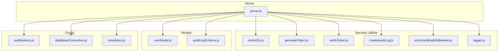
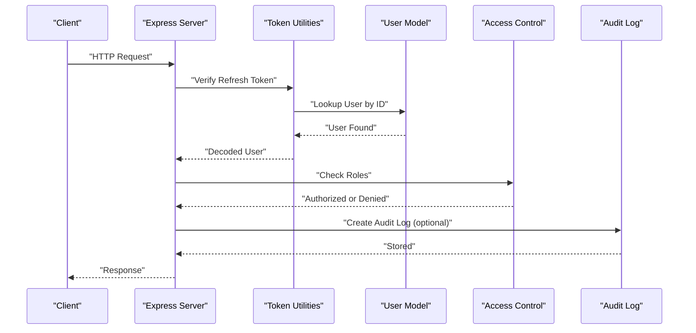
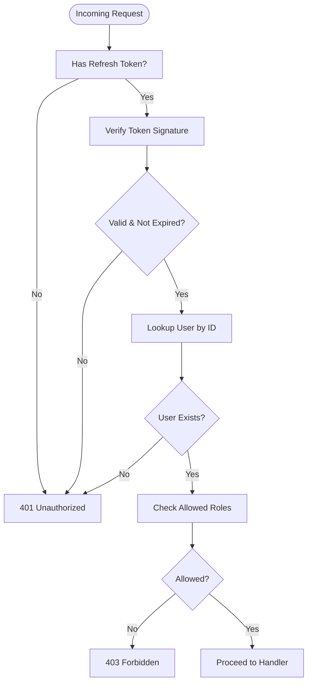
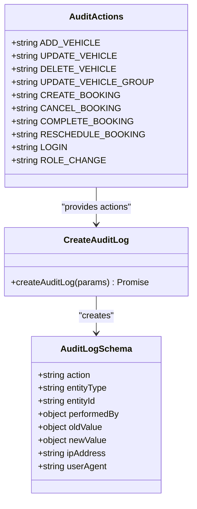
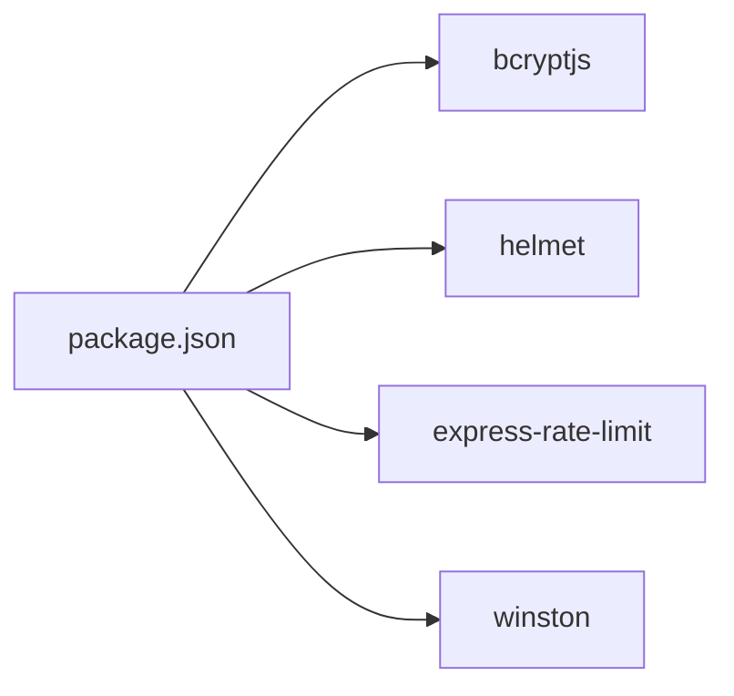

# Data Security & Compliance

<cite>
**Referenced Files in This Document**
- [dataBaseConnection.js](file://backend/DatabaseConnection/dataBaseConnection.js)
- [userModel.js](file://backend/model/userModel.js)
- [auditLogSchema.js](file://backend/model/auditLogSchema.js)
- [auditActions.js](file://backend/config/auditActions.js)
- [createAuditLog.js](file://backend/utils/createAuditLog.js)
- [restrictTo.js](file://backend/utils/restrictTo.js)
- [generateToken.js](file://backend/utils/generateToken.js)
- [verifyToken.js](file://backend/utils/verifyToken.js)
- [logger.js](file://backend/utils/logger.js)
- [errorHandlingMiddleware.js](file://backend/utils/errorHandlingMiddleware.js)
- [server.js](file://backend/server.js)
- [cloudinary.js](file://backend/config/cloudinary.js)
- [package.json](file://backend/package.json)
</cite>

## Table of Contents
1. [Introduction](#introduction)
2. [Project Structure](#project-structure)
3. [Core Components](#core-components)
4. [Architecture Overview](#architecture-overview)
5. [Detailed Component Analysis](#detailed-component-analysis)
6. [Dependency Analysis](#dependency-analysis)
7. [Performance Considerations](#performance-considerations)
8. [Troubleshooting Guide](#troubleshooting-guide)
9. [Conclusion](#conclusion)
10. [Appendices](#appendices)

## Introduction
This document provides a comprehensive overview of data security and compliance measures implemented in the Vehicle Management System backend. It focuses on encryption at rest and in transit, access control and role-based permissions, audit logging, GDPR-aligned data handling, anonymization procedures, backup and key management, secure deletion, and alignment with SOC 2 and ISO 27001. Where applicable, this document references actual source files to ground recommendations in the existing codebase.

## Project Structure
Security-relevant components are primarily located under backend/utils, backend/model, backend/config, and backend/DatabaseConnection. The server initializes environment-specific configuration, loads routes, and applies global middlewares including CORS, cookies, rate limiting, and helmet for transport security.

**Diagram sources**
- [server.js](file://backend/server.js#L1-L204)
- [restrictTo.js](file://backend/utils/restrictTo.js#L1-L18)
- [generateToken.js](file://backend/utils/generateToken.js#L1-L28)
- [verifyToken.js](file://backend/utils/verifyToken.js#L1-L33)
- [createAuditLog.js](file://backend/utils/createAuditLog.js#L1-L31)
- [errorHandlingMiddleware.js](file://backend/utils/errorHandlingMiddleware.js#L1-L233)
- [logger.js](file://backend/utils/logger.js#L1-L68)
- [userModel.js](file://backend/model/userModel.js#L1-L162)
- [auditLogSchema.js](file://backend/model/auditLogSchema.js#L1-L64)
- [auditActions.js](file://backend/config/auditActions.js#L1-L18)
- [dataBaseConnection.js](file://backend/DatabaseConnection/dataBaseConnection.js#L1-L17)
- [cloudinary.js](file://backend/config/cloudinary.js#L1-L12)

**Section sources**
- [server.js](file://backend/server.js#L1-L204)
- [package.json](file://backend/package.json#L1-L37)

## Core Components
- Authentication and Authorization
  - Token generation and refresh tokens are handled via dedicated utilities.
  - Access restriction middleware enforces role-based access control.
- Data Protection
  - Password hashing is enforced via a pre-save hook in the user model.
  - Transport security is enabled via helmet and rate limiting.
- Audit Logging
  - Centralized audit actions and schema capture entity changes with actor and metadata.
  - Audit log creation utility supports transaction sessions.
- Logging and Error Handling
  - Winston-based logger captures structured logs.
  - Global error handler normalizes operational vs unexpected errors.

**Section sources**
- [userModel.js](file://backend/model/userModel.js#L134-L158)
- [generateToken.js](file://backend/utils/generateToken.js#L3-L27)
- [verifyToken.js](file://backend/utils/verifyToken.js#L5-L28)
- [restrictTo.js](file://backend/utils/restrictTo.js#L3-L14)
- [auditActions.js](file://backend/config/auditActions.js#L1-L18)
- [auditLogSchema.js](file://backend/model/auditLogSchema.js#L3-L61)
- [createAuditLog.js](file://backend/utils/createAuditLog.js#L3-L30)
- [logger.js](file://backend/utils/logger.js#L47-L65)
- [errorHandlingMiddleware.js](file://backend/utils/errorHandlingMiddleware.js#L117-L232)

## Architecture Overview
The backend enforces transport security at the gateway and applies access control and audit logging across request lifecycles. Authentication uses JWT with separate access and refresh tokens. Authorization leverages role checks. Audit logs record significant actions with IP and user agent metadata.

**Diagram sources**
- [server.js](file://backend/server.js#L38-L76)
- [verifyToken.js](file://backend/utils/verifyToken.js#L5-L28)
- [userModel.js](file://backend/model/userModel.js#L142-L158)
- [restrictTo.js](file://backend/utils/restrictTo.js#L3-L14)
- [createAuditLog.js](file://backend/utils/createAuditLog.js#L3-L30)

## Detailed Component Analysis

### Database Encryption at Rest
- Current state: The database connection uses an environment variable for the MongoDB URL. There is no explicit encryption-at-rest configuration shown in the connection file.
- Recommendations:
  - Enable MongoDB encryption at rest via provider-managed keys (e.g., AWS KMS, Azure CMK, GCP KMS) as per organizational policy.
  - Store only encrypted data in collections; avoid plaintext sensitive fields.
  - Enforce strict network policies and VPC segmentation for the database endpoint.

**Section sources**
- [dataBaseConnection.js](file://backend/DatabaseConnection/dataBaseConnection.js#L4-L16)

### Transport Encryption (TLS/HTTPS)
- Current state: Helmet is included as a dependency; however, HTTPS termination and TLS configuration are not visible in server initialization.
- Recommendations:
  - Terminate TLS at the load balancer or reverse proxy and enforce HTTPS-only requests.
  - Configure Helmet headers for secure transport, CSP, XSS protection, and HSTS.
  - Use strong cipher suites and disable legacy protocols.

**Section sources**
- [package.json](file://backend/package.json#L16-L16)
- [server.js](file://backend/server.js#L38-L59)

### Field-Level Encryption (Sensitive Data)
- Current state: Passwords are hashed using bcrypt in a pre-save hook. No field-level encryption is implemented for other sensitive fields (e.g., phone numbers, license numbers).
- Recommendations:
  - Implement client-side encryption for sensitive fields prior to persistence.
  - Use deterministic or randomized encryption depending on query needs; maintain separate indexes for searchable encrypted fields if required.
  - Store encryption keys separately from data (key management service).

**Section sources**
- [userModel.js](file://backend/model/userModel.js#L134-L139)

### Access Control and Role-Based Permissions
- Current state: Role-based access enforcement is implemented via a middleware that checks user roles against allowed roles.
- Recommendations:
  - Define granular permissions per route/action and enforce at the controller level.
  - Integrate RBAC with audit logs to track role changes and privileged actions.
  - Rotate secrets and tokens regularly; invalidate refresh tokens on logout.

**Diagram sources**
- [verifyToken.js](file://backend/utils/verifyToken.js#L5-L28)
- [restrictTo.js](file://backend/utils/restrictTo.js#L3-L14)

**Section sources**
- [restrictTo.js](file://backend/utils/restrictTo.js#L3-L14)
- [verifyToken.js](file://backend/utils/verifyToken.js#L5-L28)

### Audit Logging Implementation
- Current state: Audit actions are centralized; the audit log schema captures actor, entity, old/new values, IP, and user agent. A utility creates audit entries with optional transaction support.
- Recommendations:
  - Enforce mandatory audit logging for all write operations and sensitive reads.
  - Retain audit logs for a compliance-mandated period; protect logs from tampering.
  - Index audit fields for efficient reporting and filtering.

**Diagram sources**
- [auditLogSchema.js](file://backend/model/auditLogSchema.js#L3-L61)
- [auditActions.js](file://backend/config/auditActions.js#L1-L18)
- [createAuditLog.js](file://backend/utils/createAuditLog.js#L3-L30)

**Section sources**
- [auditActions.js](file://backend/config/auditActions.js#L1-L18)
- [auditLogSchema.js](file://backend/model/auditLogSchema.js#L3-L61)
- [createAuditLog.js](file://backend/utils/createAuditLog.js#L3-L30)

### Data Masking Strategies
- Current state: No explicit data masking is implemented in the codebase.
- Recommendations:
  - Mask personally identifiable information (PII) in logs and responses (e.g., last 4 digits of SSN/phone).
  - Apply dynamic data masking at the API boundary for sensitive fields.
  - Use redaction libraries and sanitize logs to prevent leakage.

[No sources needed since this section provides general guidance]

### GDPR Compliance Measures
- Data minimization and purpose limitation: Collect only necessary data and publish a privacy notice.
- Consent management: Implement opt-in mechanisms for data processing and analytics; provide granular consent toggles.
- Right to erasure and portability: Provide APIs to export and delete user data upon request.
- Data breach notification: Establish automated alerts and remediation workflows.

[No sources needed since this section provides general guidance]

### Data Retention Policies and User Consent
- Retention: Define retention periods per data category; automatically purge expired records.
- Consent lifecycle: Track consent timestamps and withdrawal; honor opt-outs immediately.
- Transparency: Publish a data retention schedule and consent history.

[No sources needed since this section provides general guidance]

### Data Anonymization for Testing and Sharing
- De-identification: Remove or encrypt PII; apply generalized pseudonyms for identifiers.
- Sampling: Use stratified sampling to preserve statistical validity while protecting privacy.
- Secure sharing: Encrypt shared datasets; use access-limited channels and signed agreements.

[No sources needed since this section provides general guidance]

### Backup Security, Key Management, and Secure Deletion
- Backups: Encrypt backups at rest; store in secure, isolated storage; test restoration regularly.
- Keys: Use hardware security modules (HSMs) or managed key services; rotate keys periodically.
- Secure deletion: Overwrite deleted data blocks; use DB-native secure erase capabilities.

[No sources needed since this section provides general guidance]

### Compliance Frameworks Adherence
- SOC 2: Implement security, availability, confidentiality, and privacy criteria; document controls and monitoring.
- ISO 27001: Establish an Information Security Management System (ISMS), risk assessments, and continual improvement.
- Industry regulations: Align with applicable regional regulations (e.g., GDPR, CCPA) and sector-specific standards.

[No sources needed since this section provides general guidance]

## Dependency Analysis
Security-related dependencies include bcrypt for password hashing, helmet for transport hardening, rate limiting, and winston for logging. These are declared in the backend package manifest.

**Diagram sources**
- [package.json](file://backend/package.json#L5-L30)

**Section sources**
- [package.json](file://backend/package.json#L1-L37)

## Performance Considerations
- Token verification overhead: Offload token signing/verification to a dedicated service if traffic increases.
- Audit logging latency: Batch audit writes or use asynchronous queues for high-throughput scenarios.
- Database connection pooling: Tune pool size and timeouts as configured in the connection file.

[No sources needed since this section provides general guidance]

## Troubleshooting Guide
- Authentication failures:
  - Verify refresh token presence and expiration; confirm secret rotation and user existence.
- Authorization errors:
  - Confirm role middleware receives a populated user object and allowed roles match.
- Audit logging issues:
  - Ensure audit actions constants align with handlers and that the audit log creation utility is invoked with required fields.
- Logging and error handling:
  - Review Winston transports and environment-specific error sender logic.

**Section sources**
- [verifyToken.js](file://backend/utils/verifyToken.js#L5-L28)
- [restrictTo.js](file://backend/utils/restrictTo.js#L3-L14)
- [createAuditLog.js](file://backend/utils/createAuditLog.js#L3-L30)
- [logger.js](file://backend/utils/logger.js#L47-L65)
- [errorHandlingMiddleware.js](file://backend/utils/errorHandlingMiddleware.js#L117-L232)

## Conclusion
The Vehicle Management System implements foundational security controls such as password hashing, JWT-based authentication, role-based access control, and audit logging. To achieve robust data security and compliance, extend the implementation with transport encryption, field-level encryption, comprehensive data masking, GDPR-aligned consent and retention policies, secure backup/key management, and secure deletion. Align operational controls with SOC 2 and ISO 27001 to ensure continuous compliance and resilience.

## Appendices
- Environment variables and secrets:
  - Ensure secrets for JWT, database, and external services are managed via a secure vault and injected at runtime.
- Image storage:
  - Cloudinary integration stores media assets; ensure access control and signed URLs for protected content.

**Section sources**
- [cloudinary.js](file://backend/config/cloudinary.js#L5-L9)