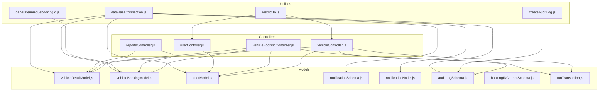
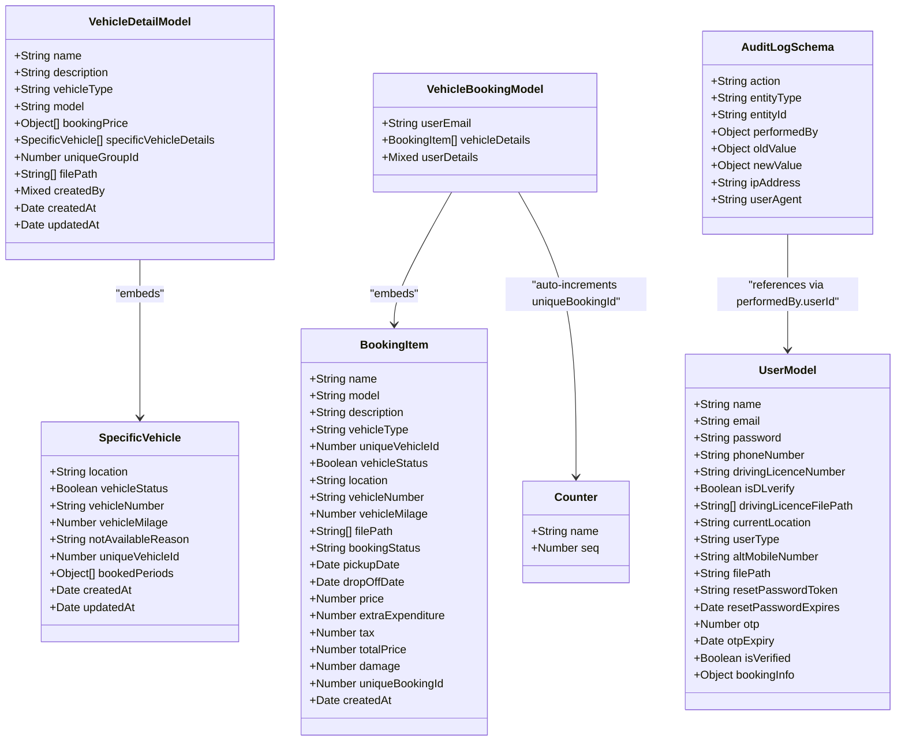
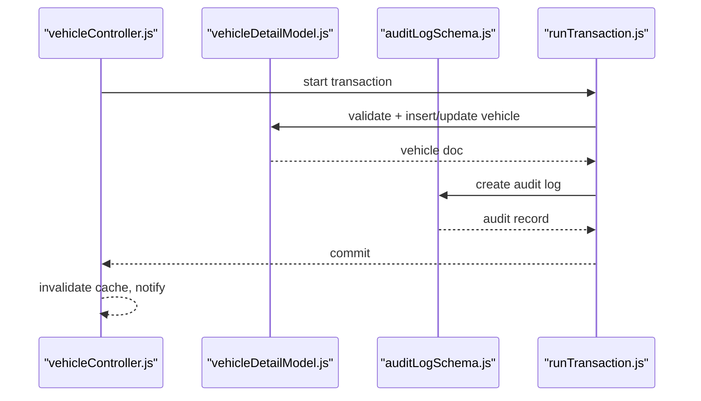
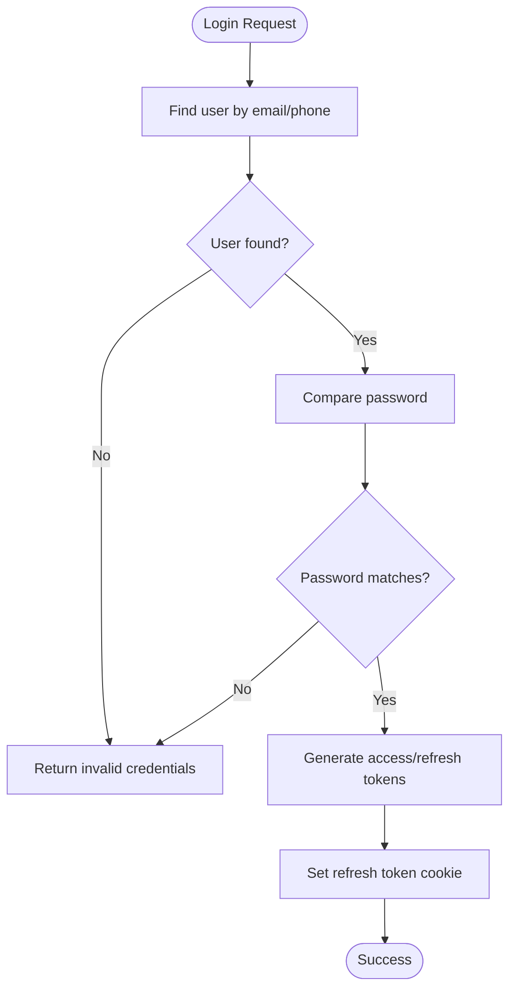
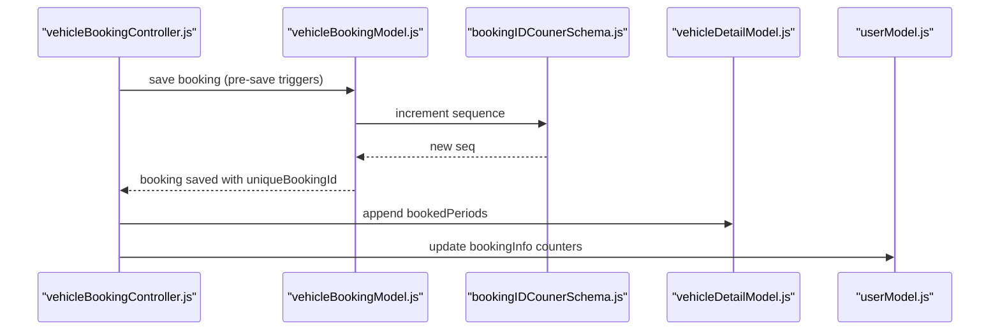
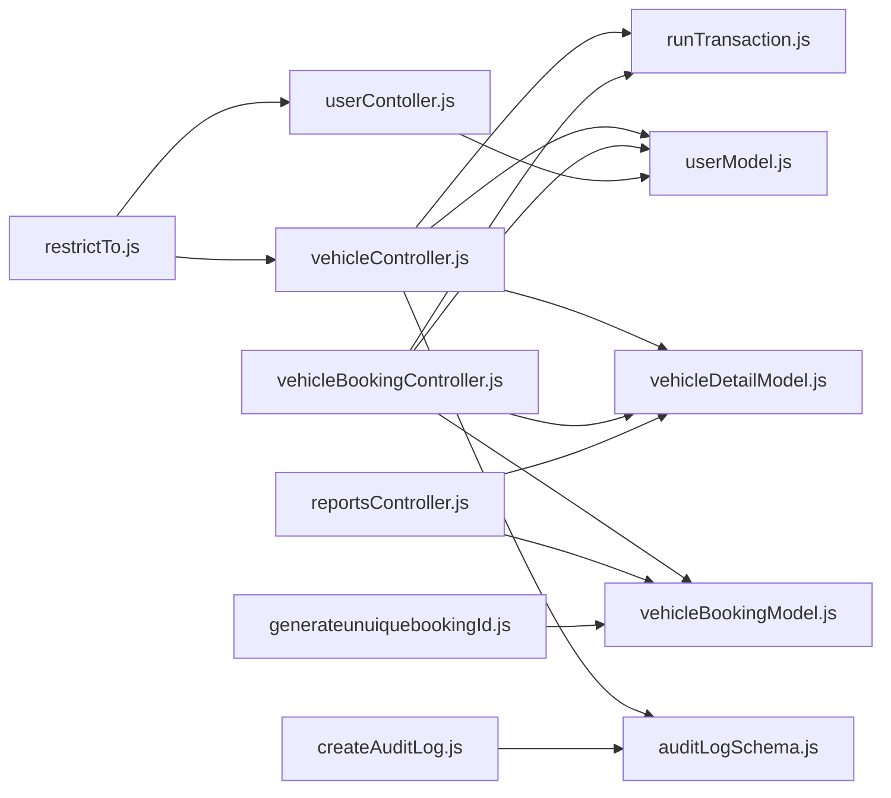
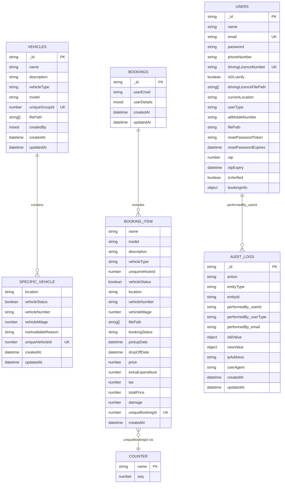

# Database Design

<cite>
**Referenced Files in This Document**
- [vehicleDetailModel.js](file://backend/model/vehicleDetailModel.js)
- [userModel.js](file://backend/model/userModel.js)
- [vehicleBookingModel.js](file://backend/model/vehicleBookingModel.js)
- [notificationSchema.js](file://backend/model/notificationSchema.js)
- [notificationNodel.js](file://backend/model/notificationNodel.js)
- [auditLogSchema.js](file://backend/model/auditLogSchema.js)
- [bookingIDCounerSchema.js](file://backend/model/bookingIDCounerSchema.js)
- [runTransaction.js](file://backend/model/runTransaction.js)
- [auditActions.js](file://backend/config/auditActions.js)
- [createAuditLog.js](file://backend/utils/createAuditLog.js)
- [dataBaseConnection.js](file://backend/DatabaseConnection/dataBaseConnection.js)
- [vehicleController.js](file://backend/Controller/vehicleController.js)
- [vehicleBookingController.js](file://backend/Controller/vehicleBookingController.js)
- [userContoller.js](file://backend/Controller/userContoller.js)
- [reportsController.js](file://backend/Controller/reportsController.js)
- [generateunuiquebookingId.js](file://backend/utils/generateunuiquebookingId.js)
- [restrictTo.js](file://backend/utils/restrictTo.js)
</cite>

## Table of Contents
1. [Introduction](#introduction)
2. [Project Structure](#project-structure)
3. [Core Components](#core-components)
4. [Architecture Overview](#architecture-overview)
5. [Detailed Component Analysis](#detailed-component-analysis)
6. [Dependency Analysis](#dependency-analysis)
7. [Performance Considerations](#performance-considerations)
8. [Troubleshooting Guide](#troubleshooting-guide)
9. [Conclusion](#conclusion)
10. [Appendices](#appendices)

## Introduction
This document describes the database design and data model for the Vehicle Management System. It focuses on the schema definitions for vehicles, users, bookings, notifications, and audit logs, along with entity relationships, constraints, indexing strategies, and operational patterns. It also covers transaction management, audit logging, and practical query examples derived from the codebase.

## Project Structure
The database layer is implemented using Mongoose ODM on top of MongoDB. Models define schemas and indexes, controllers orchestrate business logic and transactions, and utilities provide shared behaviors such as audit logging and access control.

**Diagram sources**
- [vehicleDetailModel.js](file://backend/model/vehicleDetailModel.js#L55-L105)
- [vehicleBookingModel.js](file://backend/model/vehicleBookingModel.js#L9-L66)
- [userModel.js](file://backend/model/userModel.js#L6-L130)
- [notificationSchema.js](file://backend/model/notificationSchema.js#L3-L10)
- [notificationNodel.js](file://backend/model/notificationNodel.js#L2-L11)
- [auditLogSchema.js](file://backend/model/auditLogSchema.js#L3-L61)
- [bookingIDCounerSchema.js](file://backend/model/bookingIDCounerSchema.js#L4-L14)
- [runTransaction.js](file://backend/model/runTransaction.js#L4-L18)
- [vehicleController.js](file://backend/Controller/vehicleController.js#L1-L200)
- [vehicleBookingController.js](file://backend/Controller/vehicleBookingController.js#L1-L200)
- [userContoller.js](file://backend/Controller/userContoller.js#L1-L200)
- [reportsController.js](file://backend/Controller/reportsController.js#L34-L91)
- [createAuditLog.js](file://backend/utils/createAuditLog.js#L3-L30)
- [generateunuiquebookingId.js](file://backend/utils/generateunuiquebookingId.js#L7-L20)
- [restrictTo.js](file://backend/utils/restrictTo.js#L3-L14)
- [dataBaseConnection.js](file://backend/DatabaseConnection/dataBaseConnection.js#L6-L16)

**Section sources**
- [vehicleDetailModel.js](file://backend/model/vehicleDetailModel.js#L55-L105)
- [vehicleBookingModel.js](file://backend/model/vehicleBookingModel.js#L9-L66)
- [userModel.js](file://backend/model/userModel.js#L6-L130)
- [auditLogSchema.js](file://backend/model/auditLogSchema.js#L3-L61)
- [notificationSchema.js](file://backend/model/notificationSchema.js#L3-L10)
- [notificationNodel.js](file://backend/model/notificationNodel.js#L2-L11)
- [bookingIDCounerSchema.js](file://backend/model/bookingIDCounerSchema.js#L4-L14)
- [runTransaction.js](file://backend/model/runTransaction.js#L4-L18)
- [dataBaseConnection.js](file://backend/DatabaseConnection/dataBaseConnection.js#L6-L16)

## Core Components
This section documents each model’s fields, data types, constraints, and business rules.

- Vehicles (VehicleDetailModel)
  - Fields and constraints:
    - name: String, required, trimmed
    - description: String, optional, trimmed
    - vehicleType: String, required, trimmed
    - model: String, required
    - bookingPrice: array of objects with range (Number, required) and price (Number, required)
    - specificVehicleDetails: array of embedded documents:
      - location: String, default "abc", trimmed
      - vehicleStatus: Boolean, default true
      - vehicleNumber: String, required, trimmed; unique enforced at application level
      - vehicleMilage: Number, default null, trimmed
      - notAvailableReason: Enum ["In Repair", "Accident", "Other", "Booking"], default null, trimmed
      - uniqueVehicleId: Number, unique enforced at application level
      - bookedPeriods: array of { startDate: Date, endDate: Date }
      - createdAt/updatedAt: Date defaults
    - uniqueGroupId: Number, unique, required
    - filePath: array of String
    - createdBy: Mixed
    - createdAt/updatedAt: Date defaults
  - Indexes:
    - uniqueGroupId: unique index
    - createdAt: descending index on specificVehicleDetails for sorting
  - Validation rules:
    - Pre-validate hook sets uniqueGroupId based on current timestamp
    - vehicleNumber uniqueness checked via application logic during creation/update
  - Embedding strategy:
    - specificVehicleDetails embedded within vehicle documents to avoid joins

- Users (UserModel)
  - Fields and constraints:
    - name: String, required, trimmed
    - email: String, unique, required, lowercased, validated as email
    - password: String, required, min length 6
    - phoneNumber: String, required, validated as 10 digits
    - drivingLicenceNumber: String, unique, optional
    - isDLverify: Boolean, default false
    - drivingLicenceFilePath: array of String
    - currentLocation: String, default "Bengaluru"
    - userType: Enum ["user", "admin"], default "user"
    - altMobileNumber: String, optional, validated as 10 digits if present
    - filePath: String, optional
    - resetPasswordToken/resetPasswordExpires: optional tokens for password reset
    - otp/otpExpiry: optional OTP fields
    - isVerified: Boolean, default false
    - bookingInfo: nested object with counters for totals and activity
  - Indexes:
    - compound index on { isDLverify: 1, createdAt: -1 }
  - Security:
    - Pre-save hashing via bcrypt
    - JWT generation and password comparison helpers

- Bookings (VehicleBookingModel)
  - Fields and constraints:
    - userEmail: String, required
    - vehicleDetails: array of embedded booking items:
      - name, model, description, vehicleType: String, required
      - uniqueVehicleId: Number, required
      - vehicleStatus: Boolean, required
      - location, vehicleNumber, vehicleMilage: String/Number
      - filePath: array of String
      - bookingStatus: Enum ["pending", "confirmed", "cancelled", "completed"], required
      - pickupDate/dropOffDate: Date, required
      - price, extraExpenditure, tax, totalPrice: Number, required
      - damage: Number, default 0
      - uniqueBookingId: Number, immutable, auto-generated via Counter
      - createdAt: Date default
    - userDetails: Mixed
  - Indexes:
    - unique index on vehicleDetails.uniqueBookingId
  - Auto-increment:
    - Pre-save hook increments Counter and assigns uniqueBookingId(s) to new entries

- Notifications
  - Legacy Notification (notificationSchema.js):
    - userId: ObjectId referencing User, required
    - type: String, required
    - subject: String, required
    - message: String, required
    - isRead: Boolean, default false
    - createdAt: Date default
  - New Notification (notificationNodel.js):
    - userId: String, required
    - type: String, default "general"
    - notificationId: String, default "general"
    - rolename: String, required
    - message: String, required
    - title: String, required
    - isRead: Boolean, default false
    - createdAt: Date default

- Audit Logs (auditLogSchema.js)
  - Fields and constraints:
    - action: String, required; indexed
    - entityType: String, required; indexed ("VEHICLE","BOOKING","USER")
    - entityId: String, required; indexed
    - performedBy: nested object with:
      - userId: ObjectId referencing User, required
      - userType: Enum ["admin","user"], required
      - email: String, required
    - oldValue/newValue: Object, optional
    - ipAddress: String
    - userAgent: String
  - Timestamps enabled

- Counter (bookingIDCounerSchema.js)
  - name: String, unique, required
  - seq: Number, default 0

**Section sources**
- [vehicleDetailModel.js](file://backend/model/vehicleDetailModel.js#L6-L105)
- [userModel.js](file://backend/model/userModel.js#L8-L128)
- [vehicleBookingModel.js](file://backend/model/vehicleBookingModel.js#L10-L66)
- [notificationSchema.js](file://backend/model/notificationSchema.js#L3-L10)
- [notificationNodel.js](file://backend/model/notificationNodel.js#L2-L11)
- [auditLogSchema.js](file://backend/model/auditLogSchema.js#L5-L56)
- [bookingIDCounerSchema.js](file://backend/model/bookingIDCounerSchema.js#L4-L14)

## Architecture Overview
The system uses embedded documents for vehicles and bookings to minimize cross-document joins. Transactions are used for consistency across related operations. Audit logs capture changes with IP and user agent metadata. Access control utilities enforce role-based restrictions.

**Diagram sources**
- [vehicleDetailModel.js](file://backend/model/vehicleDetailModel.js#L6-L105)
- [vehicleBookingModel.js](file://backend/model/vehicleBookingModel.js#L10-L66)
- [auditLogSchema.js](file://backend/model/auditLogSchema.js#L5-L56)
- [bookingIDCounerSchema.js](file://backend/model/bookingIDCounerSchema.js#L4-L14)

## Detailed Component Analysis

### Vehicles
- Schema highlights:
  - Embedded specificVehicleDetails enables fast reads of vehicle variants without joins.
  - Pre-validate hook generates uniqueGroupId for grouping related vehicles.
  - Application-level uniqueness enforcement for vehicleNumber and uniqueVehicleId.
- Typical operations:
  - Upsert vehicle group and append specificVehicleDetails when adding units.
  - Aggregate projections for reporting vehicle inventory.

**Diagram sources**
- [vehicleController.js](file://backend/Controller/vehicleController.js#L73-L168)
- [vehicleDetailModel.js](file://backend/model/vehicleDetailModel.js#L108-L115)
- [auditLogSchema.js](file://backend/model/auditLogSchema.js#L3-L61)
- [runTransaction.js](file://backend/model/runTransaction.js#L4-L18)

**Section sources**
- [vehicleDetailModel.js](file://backend/model/vehicleDetailModel.js#L55-L105)
- [vehicleController.js](file://backend/Controller/vehicleController.js#L73-L168)

### Users
- Schema highlights:
  - Email and phone validations, bcrypt hashing, JWT helpers.
  - Index on isDLverify and createdAt to optimize driver license verification queries.
- Typical operations:
  - Registration with image upload paths.
  - Login with dynamic credential lookup (email or phone).
  - OTP generation and expiry handling.

**Diagram sources**
- [userContoller.js](file://backend/Controller/userContoller.js#L129-L161)
- [userModel.js](file://backend/model/userModel.js#L135-L158)

**Section sources**
- [userModel.js](file://backend/model/userModel.js#L8-L128)
- [userContoller.js](file://backend/Controller/userContoller.js#L25-L92)

### Bookings
- Schema highlights:
  - Embedded booking items per user email.
  - Unique booking IDs generated via Counter to ensure global uniqueness.
  - Pre-save hook assigns IDs to pending entries.
- Typical operations:
  - Create booking with pricing and dates.
  - Block vehicle availability by appending bookedPeriods.
  - Update user booking statistics.

**Diagram sources**
- [vehicleBookingModel.js](file://backend/model/vehicleBookingModel.js#L75-L97)
- [bookingIDCounerSchema.js](file://backend/model/bookingIDCounerSchema.js#L4-L14)
- [vehicleBookingController.js](file://backend/Controller/vehicleBookingController.js#L1-L200)

**Section sources**
- [vehicleBookingModel.js](file://backend/model/vehicleBookingModel.js#L9-L66)
- [bookingIDCounerSchema.js](file://backend/model/bookingIDCounerSchema.js#L4-L14)
- [vehicleBookingController.js](file://backend/Controller/vehicleBookingController.js#L1-L200)

### Notifications
- Legacy Notification:
  - References User via ObjectId; useful for user-scoped alerts.
- New Notification:
  - Uses string userId and role-based routing; supports generalized messaging.

**Section sources**
- [notificationSchema.js](file://backend/model/notificationSchema.js#L3-L10)
- [notificationNodel.js](file://backend/model/notificationNodel.js#L2-L11)

### Audit Logs
- Schema highlights:
  - Indexed fields for action, entityType, and entityId to enable filtering.
  - Nested performedBy captures actor identity and type.
- Utilities:
  - createAuditLog supports transaction sessions for atomic audit writes.

**Section sources**
- [auditLogSchema.js](file://backend/model/auditLogSchema.js#L3-L61)
- [createAuditLog.js](file://backend/utils/createAuditLog.js#L3-L30)
- [auditActions.js](file://backend/config/auditActions.js#L1-L18)

## Dependency Analysis
- Controllers depend on models and utilities for data access and business logic.
- Transactions wrap related operations to maintain consistency.
- Audit logging is invoked after successful state changes.

**Diagram sources**
- [vehicleController.js](file://backend/Controller/vehicleController.js#L1-L200)
- [vehicleBookingController.js](file://backend/Controller/vehicleBookingController.js#L1-L200)
- [userContoller.js](file://backend/Controller/userContoller.js#L1-L200)
- [reportsController.js](file://backend/Controller/reportsController.js#L34-L91)
- [vehicleDetailModel.js](file://backend/model/vehicleDetailModel.js#L55-L105)
- [vehicleBookingModel.js](file://backend/model/vehicleBookingModel.js#L9-L66)
- [userModel.js](file://backend/model/userModel.js#L6-L130)
- [auditLogSchema.js](file://backend/model/auditLogSchema.js#L3-L61)
- [createAuditLog.js](file://backend/utils/createAuditLog.js#L3-L30)
- [generateunuiquebookingId.js](file://backend/utils/generateunuiquebookingId.js#L7-L20)
- [restrictTo.js](file://backend/utils/restrictTo.js#L3-L14)

**Section sources**
- [vehicleController.js](file://backend/Controller/vehicleController.js#L1-L200)
- [vehicleBookingController.js](file://backend/Controller/vehicleBookingController.js#L1-L200)
- [userContoller.js](file://backend/Controller/userContoller.js#L1-L200)
- [reportsController.js](file://backend/Controller/reportsController.js#L34-L91)

## Performance Considerations
- Indexing strategies:
  - uniqueGroupId on vehicles for grouping and fast lookups.
  - unique index on vehicleDetails.uniqueBookingId for booking ID uniqueness.
  - Compound index on { isDLverify: 1, createdAt: -1 } for verification queries.
  - Indexed fields on audit logs (action, entityType, entityId) for filtering.
- Aggregation pipelines:
  - Reports controller demonstrates projection and size computation for inventory reporting.
- Caching:
  - Redis cache invalidation after vehicle updates to keep views fresh.
- Timezone handling:
  - Centralized timezone setting for consistent date handling across the backend.

**Section sources**
- [vehicleDetailModel.js](file://backend/model/vehicleDetailModel.js#L108-L115)
- [vehicleBookingModel.js](file://backend/model/vehicleBookingModel.js#L69-L72)
- [userModel.js](file://backend/model/userModel.js#L131-L131)
- [auditLogSchema.js](file://backend/model/auditLogSchema.js#L8-L21)
- [reportsController.js](file://backend/Controller/reportsController.js#L57-L91)
- [vehicleController.js](file://backend/Controller/vehicleController.js#L171-L171)

## Troubleshooting Guide
- Connection failures:
  - Verify MONGOURL environment variable and connection options.
- Duplicate vehicle number errors:
  - Occur when attempting to add a vehicle with an existing number; resolve by changing the number or updating the existing record.
- Booking conflicts:
  - Ensure no overlapping bookedPeriods for the selected vehicle during the requested dates.
- Access denied:
  - Admin-only endpoints enforce role checks; verify user userType and authentication.
- Audit log not recorded:
  - Confirm that createAuditLog is invoked after successful state changes and that sessions are passed when needed.

**Section sources**
- [dataBaseConnection.js](file://backend/DatabaseConnection/dataBaseConnection.js#L6-L16)
- [vehicleController.js](file://backend/Controller/vehicleController.js#L81-L83)
- [vehicleBookingController.js](file://backend/Controller/vehicleBookingController.js#L1-L200)
- [restrictTo.js](file://backend/utils/restrictTo.js#L3-L14)
- [createAuditLog.js](file://backend/utils/createAuditLog.js#L3-L30)

## Conclusion
The Vehicle Management System employs embedded schemas for vehicles and bookings, complemented by robust transaction management, audit logging, and access control. Indexes and aggregation pipelines support efficient querying and reporting. The design balances normalization benefits with embedded document advantages for read-heavy workloads.

## Appendices

### Entity Relationship Diagram

**Diagram sources**
- [userModel.js](file://backend/model/userModel.js#L8-L128)
- [vehicleDetailModel.js](file://backend/model/vehicleDetailModel.js#L55-L105)
- [vehicleBookingModel.js](file://backend/model/vehicleBookingModel.js#L9-L66)
- [auditLogSchema.js](file://backend/model/auditLogSchema.js#L3-L61)
- [bookingIDCounerSchema.js](file://backend/model/bookingIDCounerSchema.js#L4-L14)

### Sample Data Structures
- Vehicle document
  - Top-level fields: name, description, vehicleType, model, bookingPrice, uniqueGroupId, filePath, createdBy, timestamps.
  - Embedded array: specificVehicleDetails with location, vehicleStatus, vehicleNumber, vehicleMilage, notAvailableReason, uniqueVehicleId, bookedPeriods, timestamps.
- Booking document
  - Top-level: userEmail, userDetails, timestamps.
  - Embedded array: vehicleDetails with name, model, description, vehicleType, uniqueVehicleId, vehicleStatus, location, vehicleNumber, vehicleMilage, filePath, bookingStatus, pickupDate, dropOffDate, price, extraExpenditure, tax, totalPrice, damage, uniqueBookingId, createdAt.
- User document
  - Fields: name, email, password, phoneNumber, drivingLicenceNumber, isDLverify, drivingLicenceFilePath, currentLocation, userType, altMobileNumber, filePath, resetPasswordToken, resetPasswordExpires, otp, otpExpiry, isVerified, bookingInfo, timestamps.
- Audit log document
  - Fields: action, entityType, entityId, performedBy (userId, userType, email), oldValue, newValue, ipAddress, userAgent, timestamps.

### Common Query Examples
- Get all vehicle list with counts
  - Projection and size aggregation to summarize variant counts.
- Get booking details with user info
  - Aggregation pipeline projecting nested vehicleDetails and user details.
- Find user by email or phone
  - Dynamic query based on input type.

**Section sources**
- [reportsController.js](file://backend/Controller/reportsController.js#L57-L91)
- [reportsController.js](file://backend/Controller/reportsController.js#L34-L54)
- [userContoller.js](file://backend/Controller/userContoller.js#L129-L133)