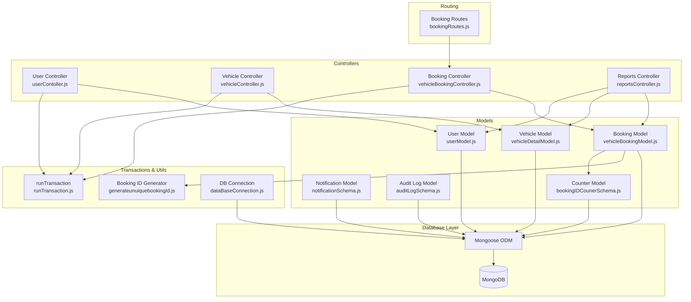
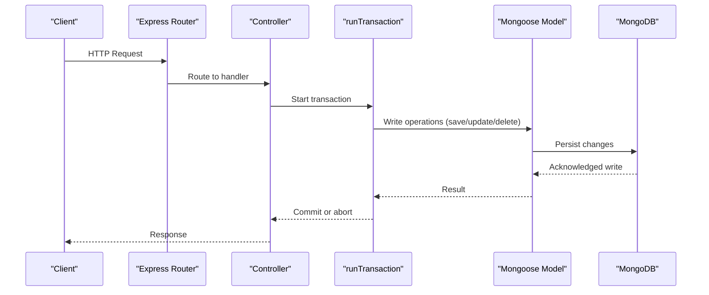
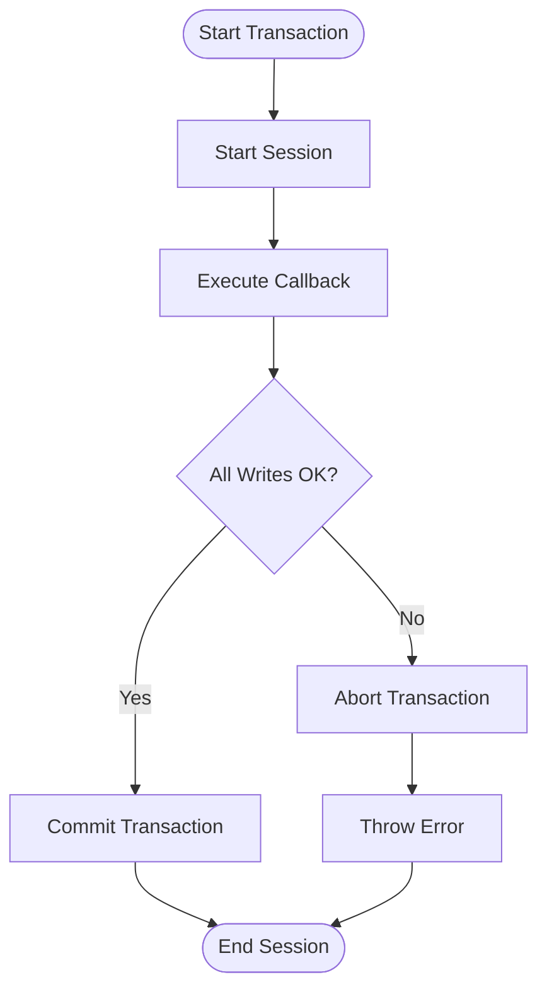
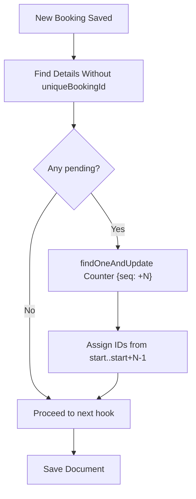
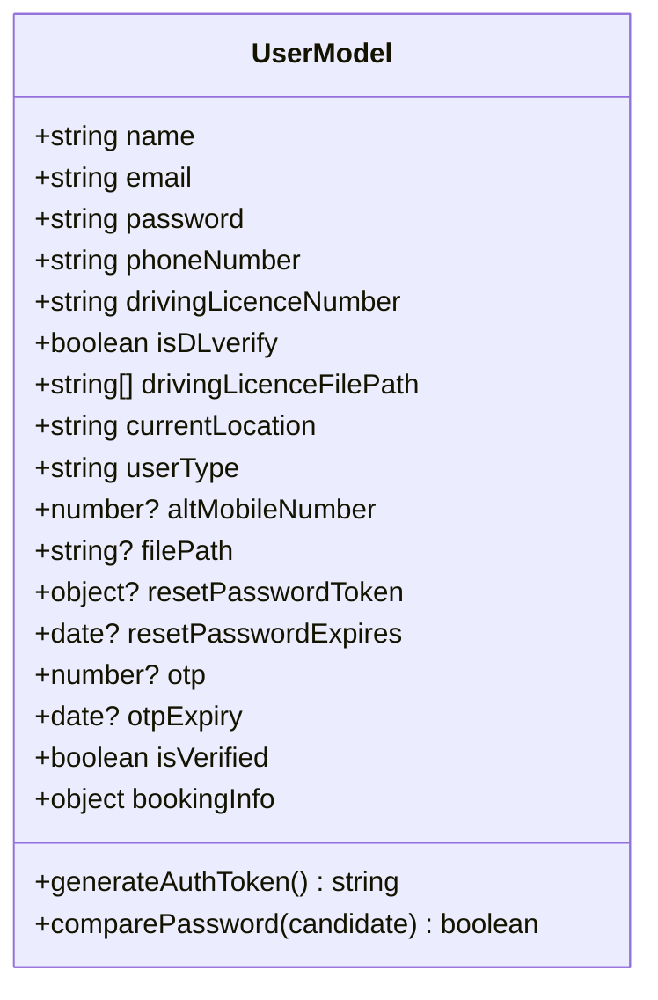
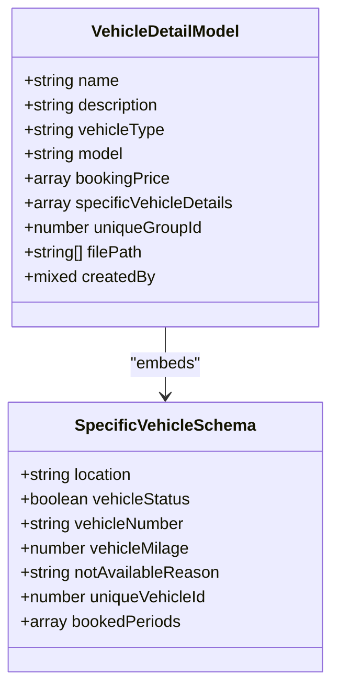
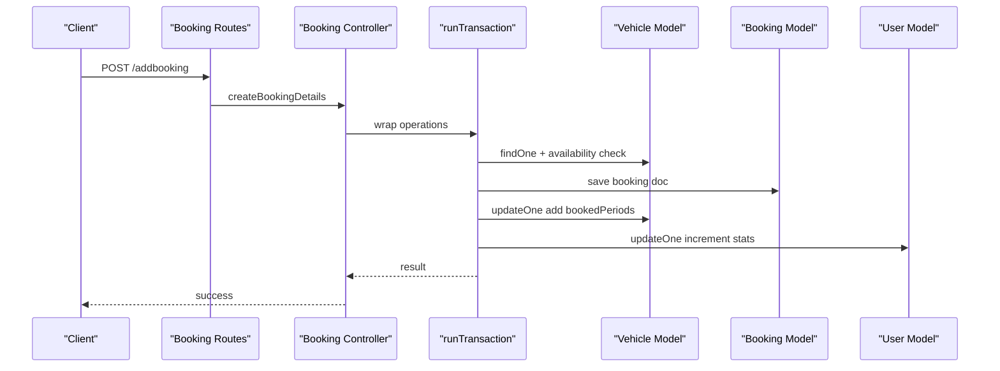
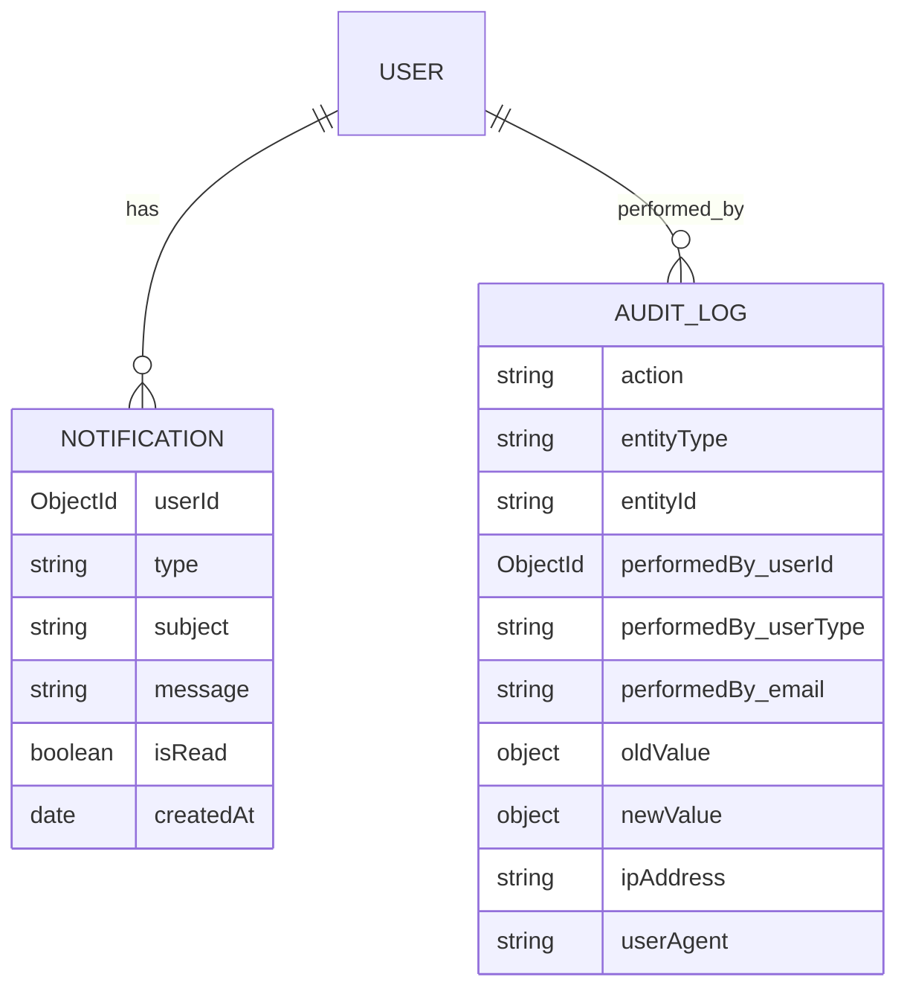
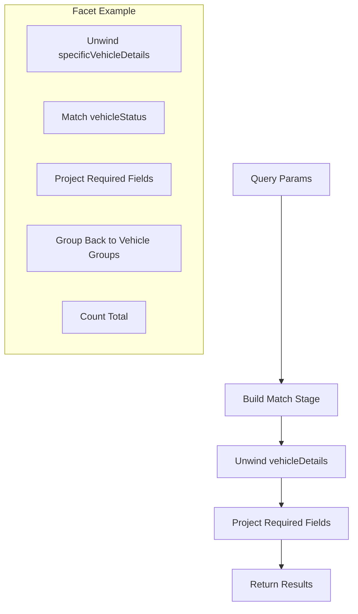
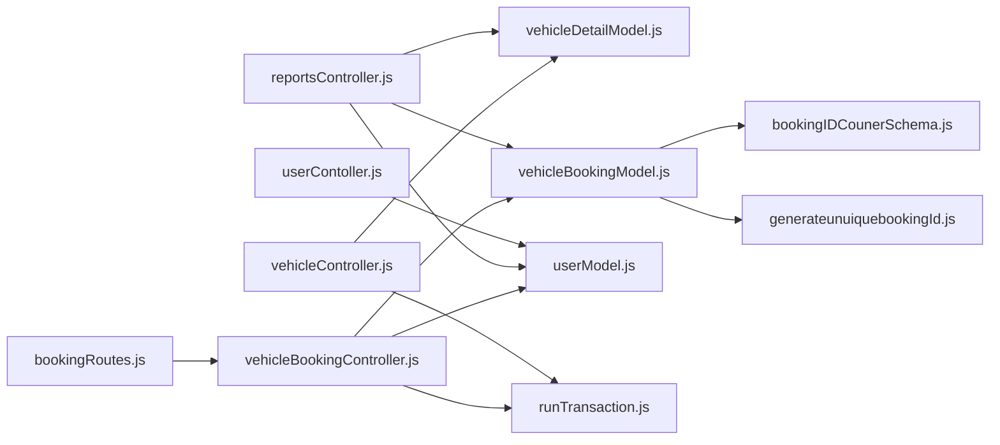

# Database Operations

<cite>
**Referenced Files in This Document**
- [dataBaseConnection.js](file://backend/DatabaseConnection/dataBaseConnection.js)
- [runTransaction.js](file://backend/model/runTransaction.js)
- [bookingIDCounerSchema.js](file://backend/model/bookingIDCounerSchema.js)
- [generateunuiquebookingId.js](file://backend/utils/generateunuiquebookingId.js)
- [vehicleBookingModel.js](file://backend/model/vehicleBookingModel.js)
- [vehicleDetailModel.js](file://backend/model/vehicleDetailModel.js)
- [userModel.js](file://backend/model/userModel.js)
- [notificationSchema.js](file://backend/model/notificationSchema.js)
- [auditLogSchema.js](file://backend/model/auditLogSchema.js)
- [vehicleBookingController.js](file://backend/Controller/vehicleBookingController.js)
- [vehicleController.js](file://backend/Controller/vehicleController.js)
- [userContoller.js](file://backend/Controller/userContoller.js)
- [reportsController.js](file://backend/Controller/reportsController.js)
- [bookingRoutes.js](file://backend/router/bookingRoutes.js)
</cite>

## Table of Contents
1. [Introduction](#introduction)
2. [Project Structure](#project-structure)
3. [Core Components](#core-components)
4. [Architecture Overview](#architecture-overview)
5. [Detailed Component Analysis](#detailed-component-analysis)
6. [Dependency Analysis](#dependency-analysis)
7. [Performance Considerations](#performance-considerations)
8. [Troubleshooting Guide](#troubleshooting-guide)
9. [Conclusion](#conclusion)
10. [Appendices](#appendices)

## Introduction
This document explains database operations in the Vehicle Management System with a focus on:
- CRUD operations across entities (users, vehicles, bookings, notifications, audit logs)
- MongoDB transaction management for consistency
- Aggregation pipelines for reporting and analytics
- Counter management for booking IDs and auto-increment sequences
- Batch operations, bulk inserts, and data migration procedures
- Performance optimization, query tuning, and indexing strategies
- Backup and recovery, archival, and maintenance procedures
- Examples of common operations with error handling and transaction rollback scenarios

## Project Structure
The backend uses Mongoose ODM with MongoDB. Controllers orchestrate business logic and call models. Transactions wrap related writes for atomicity. Aggregation pipelines power analytics and reporting.

**Diagram sources**
- [dataBaseConnection.js](file://backend/DatabaseConnection/dataBaseConnection.js#L1-L17)
- [runTransaction.js](file://backend/model/runTransaction.js#L1-L43)
- [bookingIDCounerSchema.js](file://backend/model/bookingIDCounerSchema.js#L1-L17)
- [generateunuiquebookingId.js](file://backend/utils/generateunuiquebookingId.js#L1-L23)
- [vehicleBookingModel.js](file://backend/model/vehicleBookingModel.js#L1-L105)
- [vehicleDetailModel.js](file://backend/model/vehicleDetailModel.js#L1-L145)
- [userModel.js](file://backend/model/userModel.js#L1-L162)
- [notificationSchema.js](file://backend/model/notificationSchema.js#L1-L13)
- [auditLogSchema.js](file://backend/model/auditLogSchema.js#L1-L64)
- [vehicleBookingController.js](file://backend/Controller/vehicleBookingController.js#L1-L861)
- [vehicleController.js](file://backend/Controller/vehicleController.js#L1-L824)
- [userContoller.js](file://backend/Controller/userContoller.js#L1-L832)
- [reportsController.js](file://backend/Controller/reportsController.js#L1-L641)
- [bookingRoutes.js](file://backend/router/bookingRoutes.js#L1-L31)

**Section sources**
- [dataBaseConnection.js](file://backend/DatabaseConnection/dataBaseConnection.js#L1-L17)
- [vehicleBookingController.js](file://backend/Controller/vehicleBookingController.js#L1-L861)
- [vehicleController.js](file://backend/Controller/vehicleController.js#L1-L824)
- [userContoller.js](file://backend/Controller/userContoller.js#L1-L832)
- [reportsController.js](file://backend/Controller/reportsController.js#L1-L641)
- [bookingRoutes.js](file://backend/router/bookingRoutes.js#L1-L31)

## Core Components
- Database connection and pool configuration
- Transaction wrapper for ACID consistency
- Auto-increment counter for booking IDs
- Entity models with indexes and hooks
- Controllers implementing CRUD and analytics
- Routing exposing endpoints

**Section sources**
- [dataBaseConnection.js](file://backend/DatabaseConnection/dataBaseConnection.js#L1-L17)
- [runTransaction.js](file://backend/model/runTransaction.js#L1-L43)
- [bookingIDCounerSchema.js](file://backend/model/bookingIDCounerSchema.js#L1-L17)
- [generateunuiquebookingId.js](file://backend/utils/generateunuiquebookingId.js#L1-L23)
- [vehicleBookingModel.js](file://backend/model/vehicleBookingModel.js#L1-L105)
- [vehicleDetailModel.js](file://backend/model/vehicleDetailModel.js#L1-L145)
- [userModel.js](file://backend/model/userModel.js#L1-L162)
- [notificationSchema.js](file://backend/model/notificationSchema.js#L1-L13)
- [auditLogSchema.js](file://backend/model/auditLogSchema.js#L1-L64)
- [vehicleBookingController.js](file://backend/Controller/vehicleBookingController.js#L1-L861)
- [vehicleController.js](file://backend/Controller/vehicleController.js#L1-L824)
- [userContoller.js](file://backend/Controller/userContoller.js#L1-L832)
- [reportsController.js](file://backend/Controller/reportsController.js#L1-L641)

## Architecture Overview
The system uses a layered architecture:
- Controllers handle requests, enforce auth/roles, and call models
- Models define schemas, indexes, and hooks
- Transactions wrap multi-step writes to maintain consistency
- Aggregations provide reporting and analytics
- Utilities generate IDs and manage counters

**Diagram sources**
- [vehicleBookingController.js](file://backend/Controller/vehicleBookingController.js#L288-L425)
- [vehicleController.js](file://backend/Controller/vehicleController.js#L73-L168)
- [runTransaction.js](file://backend/model/runTransaction.js#L4-L18)

## Detailed Component Analysis

### Database Connectivity and Pool Settings
- Establishes connection to MongoDB with connection pooling and selection timeouts
- Centralized in a single module for reuse across models

**Section sources**
- [dataBaseConnection.js](file://backend/DatabaseConnection/dataBaseConnection.js#L1-L17)

### Transaction Management
- Provides a reusable function to start a session, run a callback, commit or abort based on exceptions
- Ensures ACID properties for multi-step writes

**Diagram sources**
- [runTransaction.js](file://backend/model/runTransaction.js#L4-L18)

**Section sources**
- [runTransaction.js](file://backend/model/runTransaction.js#L1-L43)

### Booking ID Counter and Auto-Increment
- Separate Counter document tracks sequence per entity type
- Pre-save hook on booking model increments counter and assigns unique IDs to new entries
- Index enforces uniqueness on generated IDs

**Diagram sources**
- [vehicleBookingModel.js](file://backend/model/vehicleBookingModel.js#L75-L97)
- [bookingIDCounerSchema.js](file://backend/model/bookingIDCounerSchema.js#L1-L17)

**Section sources**
- [vehicleBookingModel.js](file://backend/model/vehicleBookingModel.js#L1-L105)
- [bookingIDCounerSchema.js](file://backend/model/bookingIDCounerSchema.js#L1-L17)
- [generateunuiquebookingId.js](file://backend/utils/generateunuiquebookingId.js#L1-L23)

### Users: CRUD and Security Hooks
- Schema defines fields, validation, and indexes
- Pre-save hook hashes passwords
- Methods for JWT generation and password comparison
- Endpoints for registration, login, profile updates, and admin actions

**Diagram sources**
- [userModel.js](file://backend/model/userModel.js#L6-L161)

**Section sources**
- [userModel.js](file://backend/model/userModel.js#L1-L162)
- [userContoller.js](file://backend/Controller/userContoller.js#L24-L92)

### Vehicles: CRUD, Availability, and Grouping
- Embedded array of specific vehicles under a vehicle group
- Pre-validate hook generates unique group IDs
- Controllers implement add, update, delete, and group updates
- Transactions ensure consistency across writes and audit logs

**Diagram sources**
- [vehicleDetailModel.js](file://backend/model/vehicleDetailModel.js#L6-L143)

**Section sources**
- [vehicleDetailModel.js](file://backend/model/vehicleDetailModel.js#L1-L145)
- [vehicleController.js](file://backend/Controller/vehicleController.js#L20-L203)

### Bookings: Multi-Entity Transactions and Status Updates
- Embedded array of vehicle details per booking
- Availability checks and blocking/unblocking of periods
- Status transitions with admin restrictions
- Transactions coordinate booking creation, cancellation, rescheduling, and completion

**Diagram sources**
- [bookingRoutes.js](file://backend/router/bookingRoutes.js#L7-L8)
- [vehicleBookingController.js](file://backend/Controller/vehicleBookingController.js#L235-L466)

**Section sources**
- [vehicleBookingController.js](file://backend/Controller/vehicleBookingController.js#L16-L466)
- [vehicleBookingModel.js](file://backend/model/vehicleBookingModel.js#L9-L104)

### Notifications and Audit Logs
- Notification schema references users and supports read/unread tracking
- Audit log schema captures actions, entities, diffs, and metadata

**Diagram sources**
- [notificationSchema.js](file://backend/model/notificationSchema.js#L1-L13)
- [auditLogSchema.js](file://backend/model/auditLogSchema.js#L1-L64)

**Section sources**
- [notificationSchema.js](file://backend/model/notificationSchema.js#L1-L13)
- [auditLogSchema.js](file://backend/model/auditLogSchema.js#L1-L64)

### Reporting and Analytics: Aggregation Pipelines
- Reports controller builds aggregations for:
  - Booking data flattened and projected
  - Vehicle lists with counts
  - User summaries
  - Availability filters and facets
  - Booking metrics segmented by time range

**Diagram sources**
- [reportsController.js](file://backend/Controller/reportsController.js#L15-L43)
- [reportsController.js](file://backend/Controller/reportsController.js#L234-L288)
- [reportsController.js](file://backend/Controller/reportsController.js#L307-L361)
- [reportsController.js](file://backend/Controller/reportsController.js#L543-L622)

**Section sources**
- [reportsController.js](file://backend/Controller/reportsController.js#L8-L641)

## Dependency Analysis
- Controllers depend on models and the transaction utility
- Models depend on Mongoose and define indexes and hooks
- Routes bind endpoints to controllers
- Utilities (counter, ID generator) are used by models and controllers

**Diagram sources**
- [bookingRoutes.js](file://backend/router/bookingRoutes.js#L1-L31)
- [vehicleBookingController.js](file://backend/Controller/vehicleBookingController.js#L1-L15)
- [vehicleController.js](file://backend/Controller/vehicleController.js#L1-L11)
- [reportsController.js](file://backend/Controller/reportsController.js#L1-L7)
- [vehicleBookingModel.js](file://backend/model/vehicleBookingModel.js#L1-L8)
- [bookingIDCounerSchema.js](file://backend/model/bookingIDCounerSchema.js#L1-L2)
- [generateunuiquebookingId.js](file://backend/utils/generateunuiquebookingId.js#L1-L2)

**Section sources**
- [vehicleBookingController.js](file://backend/Controller/vehicleBookingController.js#L1-L15)
- [vehicleController.js](file://backend/Controller/vehicleController.js#L1-L11)
- [reportsController.js](file://backend/Controller/reportsController.js#L1-L7)
- [vehicleBookingModel.js](file://backend/model/vehicleBookingModel.js#L1-L8)
- [bookingIDCounerSchema.js](file://backend/model/bookingIDCounerSchema.js#L1-L2)
- [generateunuiquebookingId.js](file://backend/utils/generateunuiquebookingId.js#L1-L2)

## Performance Considerations
- Indexes
  - Booking model enforces uniqueness on generated booking IDs
  - User model indexes select fields for verification and sorting
  - Audit log schema indexes action, entity type, and entity ID for filtering
- Aggregation optimization
  - Use unwind early when flattening arrays for filtering and projection
  - Prefer match before project to reduce document size
  - Use facet for parallel computation of list and counts
- Transactions
  - Bundle related writes to minimize contention and ensure atomicity
- Caching
  - Vehicle listing reads from Redis cache with TTL; invalidate on changes
- Connection pooling
  - Configured pool size and server selection timeout at connection time

**Section sources**
- [vehicleBookingModel.js](file://backend/model/vehicleBookingModel.js#L69-L72)
- [userModel.js](file://backend/model/userModel.js#L131-L139)
- [auditLogSchema.js](file://backend/model/auditLogSchema.js#L8-L21)
- [vehicleController.js](file://backend/Controller/vehicleController.js#L211-L240)
- [dataBaseConnection.js](file://backend/DatabaseConnection/dataBaseConnection.js#L10-L12)

## Troubleshooting Guide
Common issues and resolutions:
- Duplicate booking ID errors
  - Caused by uniqueness constraint on generated IDs; ensure counter increments and hooks run
- Transaction failures
  - Verify session is passed to all operations inside the transaction callback
  - Inspect thrown errors to trigger abort and prevent partial writes
- Availability conflicts during booking
  - Ensure availability checks exclude the current booking period and use exact date comparisons
- Cancellation and rescheduling
  - Validate cancellation windows and update booked periods atomically
- Audit logging
  - Ensure audit logs are written inside the transaction to preserve consistency

**Section sources**
- [vehicleBookingModel.js](file://backend/model/vehicleBookingModel.js#L69-L97)
- [runTransaction.js](file://backend/model/runTransaction.js#L4-L18)
- [vehicleBookingController.js](file://backend/Controller/vehicleBookingController.js#L288-L425)
- [vehicleBookingController.js](file://backend/Controller/vehicleBookingController.js#L664-L758)
- [vehicleBookingController.js](file://backend/Controller/vehicleBookingController.js#L760-L860)

## Conclusion
The Vehicle Management System implements robust database operations using Mongoose and MongoDB:
- Transactions guarantee consistency across multi-step writes
- Aggregation pipelines enable efficient reporting and analytics
- Auto-increment counters and embedded documents model real-world domains
- Indexes and caching improve query performance
- Clear separation of concerns in controllers, models, and routing simplifies maintenance and testing

## Appendices

### CRUD Operations Summary by Entity
- Users
  - Create: Registration with validation and hashing
  - Read: Profile retrieval and admin listing
  - Update: Profile and admin verification
  - Delete: Not exposed in current controllers
- Vehicles
  - Create: Add vehicle group or append specific vehicles
  - Read: List all, by name/model/type
  - Update: Update specific or group details
  - Delete: Remove specific vehicle or entire group
- Bookings
  - Create: Availability check, block slots, update user stats
  - Read: Filter by status for a user
  - Update: Cancel booking, reschedule, mark completed
- Notifications
  - Create: Send notifications via message broker
  - Read: Not exposed in current controllers
  - Update: Mark read/unread
  - Delete: Not exposed in current controllers
- Audit Logs
  - Create: Logged on write operations
  - Read: Admin dashboard pagination

**Section sources**
- [userContoller.js](file://backend/Controller/userContoller.js#L24-L92)
- [vehicleController.js](file://backend/Controller/vehicleController.js#L20-L203)
- [vehicleBookingController.js](file://backend/Controller/vehicleBookingController.js#L235-L466)
- [reportsController.js](file://backend/Controller/reportsController.js#L8-L131)

### Transaction Rollback Scenarios
- Booking creation fails mid-way
  - Transaction aborts and reverts all writes
- Cancellation fails after status change
  - Transaction aborts and restores booked periods and user stats
- Rescheduling conflicts
  - Transaction aborts when availability check fails
- Vehicle deletion removes last item
  - Entire document deleted within transaction

**Section sources**
- [vehicleBookingController.js](file://backend/Controller/vehicleBookingController.js#L288-L425)
- [vehicleBookingController.js](file://backend/Controller/vehicleBookingController.js#L506-L586)
- [vehicleBookingController.js](file://backend/Controller/vehicleBookingController.js#L664-L758)
- [vehicleController.js](file://backend/Controller/vehicleController.js#L563-L623)

### Aggregation Examples
- Flatten and filter bookings by status
- Project vehicle lists with counts
- Faceted availability lists
- Booking metrics grouped by status and date range

**Section sources**
- [reportsController.js](file://backend/Controller/reportsController.js#L15-L54)
- [reportsController.js](file://backend/Controller/reportsController.js#L57-L96)
- [reportsController.js](file://backend/Controller/reportsController.js#L234-L305)
- [reportsController.js](file://backend/Controller/reportsController.js#L307-L378)
- [reportsController.js](file://backend/Controller/reportsController.js#L533-L640)

### Backup and Recovery Procedures
- Use MongoDB native tools for logical backups (mongodump/mongorestore) and physical snapshots
- Maintain separate environments for staging and production
- Automate periodic backups with retention policies
- Test restore procedures regularly

[No sources needed since this section provides general guidance]

### Data Archival and Maintenance
- Archive old audit logs and notifications periodically
- Monitor collection sizes and set capped collections for logs if appropriate
- Rebuild stale indexes and monitor slow queries
- Rotate logs and clear temporary caches

[No sources needed since this section provides general guidance]