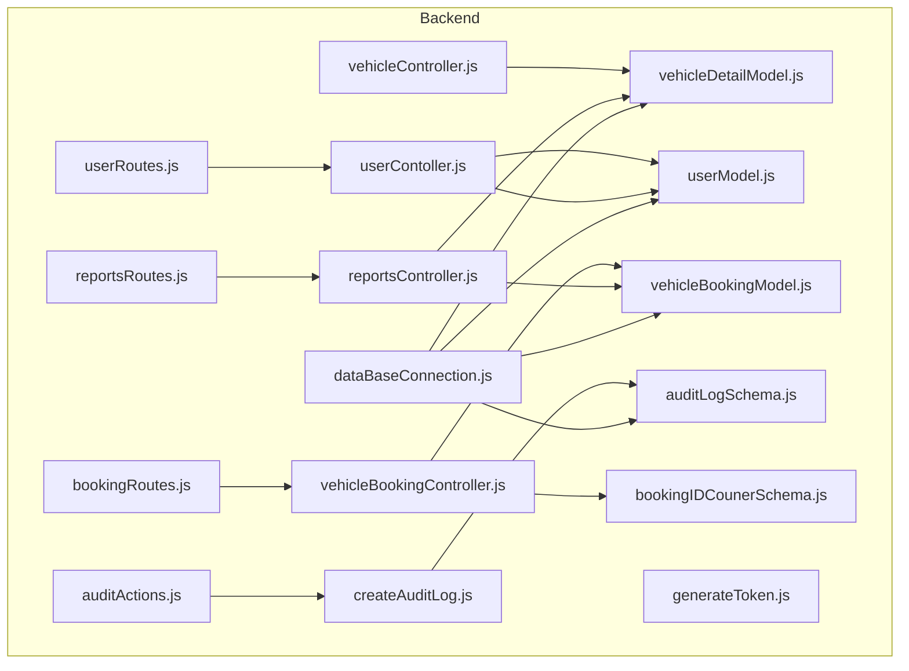
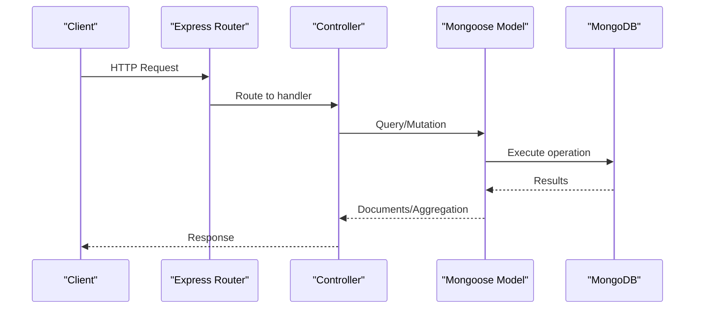
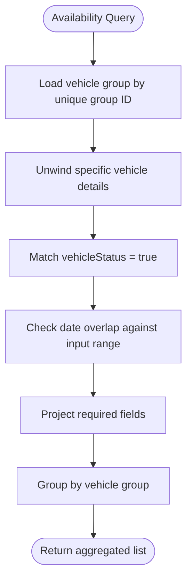
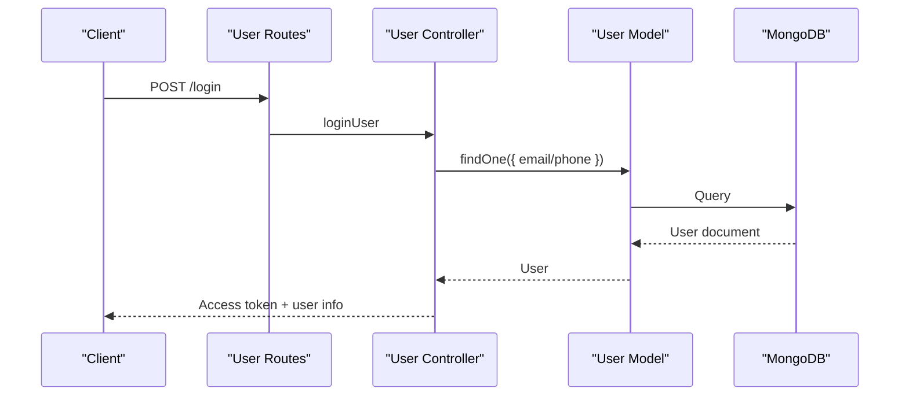
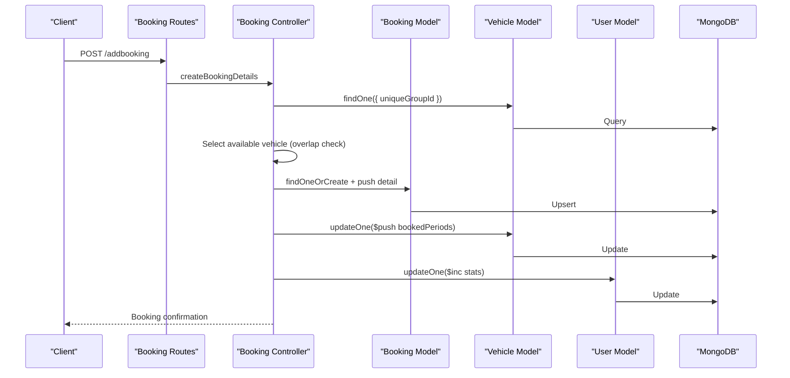
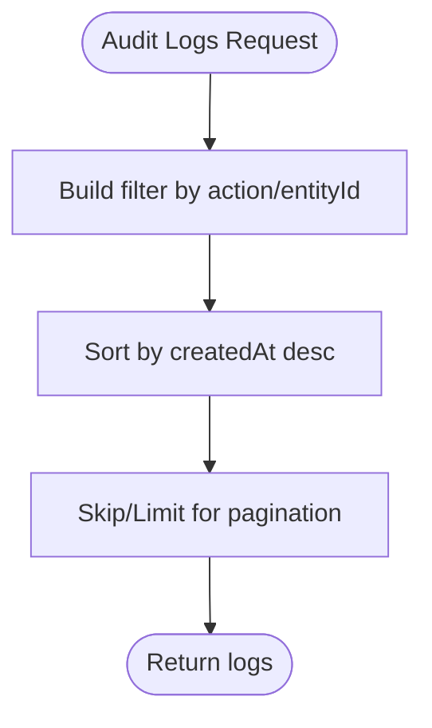
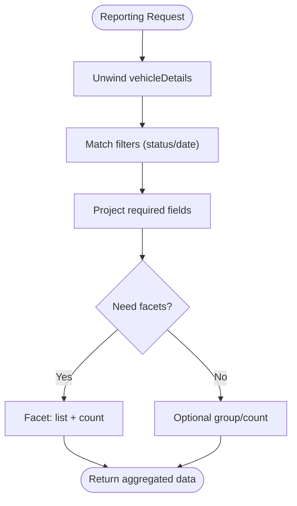
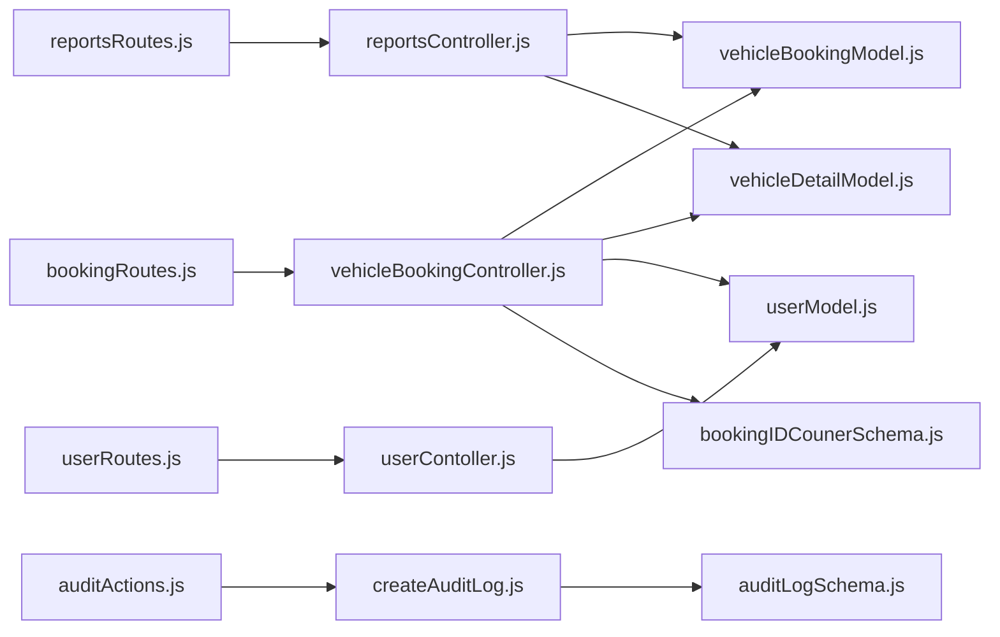

# Indexing & Performance

<cite>
**Referenced Files in This Document**
- [vehicleDetailModel.js](file://backend/model/vehicleDetailModel.js)
- [userModel.js](file://backend/model/userModel.js)
- [vehicleBookingModel.js](file://backend/model/vehicleBookingModel.js)
- [auditLogSchema.js](file://backend/model/auditLogSchema.js)
- [dataBaseConnection.js](file://backend/DatabaseConnection/dataBaseConnection.js)
- [vehicleController.js](file://backend/Controller/vehicleController.js)
- [userContoller.js](file://backend/Controller/userContoller.js)
- [vehicleBookingController.js](file://backend/Controller/vehicleBookingController.js)
- [reportsController.js](file://backend/Controller/reportsController.js)
- [bookingRoutes.js](file://backend/router/bookingRoutes.js)
- [userRoutes.js](file://backend/router/userRoutes.js)
- [reportsRoutes.js](file://backend/router/reportsRoutes.js)
- [createAuditLog.js](file://backend/utils/createAuditLog.js)
- [auditActions.js](file://backend/config/auditActions.js)
- [bookingIDCounerSchema.js](file://backend/model/bookingIDCounerSchema.js)
- [generateToken.js](file://backend/utils/generateToken.js)
</cite>

## Table of Contents
1. [Introduction](#introduction)
2. [Project Structure](#project-structure)
3. [Core Components](#core-components)
4. [Architecture Overview](#architecture-overview)
5. [Detailed Component Analysis](#detailed-component-analysis)
6. [Dependency Analysis](#dependency-analysis)
7. [Performance Considerations](#performance-considerations)
8. [Troubleshooting Guide](#troubleshooting-guide)
9. [Conclusion](#conclusion)
10. [Appendices](#appendices)

## Introduction
This document provides comprehensive guidance for database indexing strategies and performance optimization tailored to the Vehicle Management System. It focuses on:
- Indexing patterns for frequently queried fields: vehicle availability, user authentication, booking dates, and audit log timestamps
- Compound indexes for complex queries involving multiple filters and sorting criteria
- Index selection strategies for equality checks, range queries, and text searches
- Performance monitoring, execution plan analysis, and slow query identification
- Index maintenance, periodic optimization, and space management
- Partitioning and sharding considerations for large datasets
- Guidelines for index creation, modification, and removal with impact assessment
- Benchmarks and optimization case studies with before/after comparisons

## Project Structure
The system uses Mongoose ODM with MongoDB. Data models define schemas and indexes, controllers orchestrate queries, routers expose endpoints, and utilities support logging and audit trails.

**Diagram sources**
- [dataBaseConnection.js](file://backend/DatabaseConnection/dataBaseConnection.js#L1-L17)
- [vehicleController.js](file://backend/Controller/vehicleController.js#L1-L824)
- [userContoller.js](file://backend/Controller/userContoller.js#L1-L832)
- [vehicleBookingController.js](file://backend/Controller/vehicleBookingController.js#L1-L861)
- [reportsController.js](file://backend/Controller/reportsController.js#L1-L641)
- [bookingRoutes.js](file://backend/router/bookingRoutes.js#L1-L31)
- [userRoutes.js](file://backend/router/userRoutes.js#L1-L119)
- [reportsRoutes.js](file://backend/router/reportsRoutes.js#L1-L51)
- [vehicleDetailModel.js](file://backend/model/vehicleDetailModel.js#L1-L145)
- [userModel.js](file://backend/model/userModel.js#L1-L162)
- [vehicleBookingModel.js](file://backend/model/vehicleBookingModel.js#L1-L105)
- [auditLogSchema.js](file://backend/model/auditLogSchema.js#L1-L64)
- [createAuditLog.js](file://backend/utils/createAuditLog.js#L1-L31)
- [auditActions.js](file://backend/config/auditActions.js#L1-L18)
- [bookingIDCounerSchema.js](file://backend/model/bookingIDCounerSchema.js#L1-L17)
- [generateToken.js](file://backend/utils/generateToken.js#L1-L28)

**Section sources**
- [dataBaseConnection.js](file://backend/DatabaseConnection/dataBaseConnection.js#L1-L17)
- [vehicleDetailModel.js](file://backend/model/vehicleDetailModel.js#L1-L145)
- [userModel.js](file://backend/model/userModel.js#L1-L162)
- [vehicleBookingModel.js](file://backend/model/vehicleBookingModel.js#L1-L105)
- [auditLogSchema.js](file://backend/model/auditLogSchema.js#L1-L64)
- [vehicleController.js](file://backend/Controller/vehicleController.js#L1-L824)
- [userContoller.js](file://backend/Controller/userContoller.js#L1-L832)
- [vehicleBookingController.js](file://backend/Controller/vehicleBookingController.js#L1-L861)
- [reportsController.js](file://backend/Controller/reportsController.js#L1-L641)
- [bookingRoutes.js](file://backend/router/bookingRoutes.js#L1-L31)
- [userRoutes.js](file://backend/router/userRoutes.js#L1-L119)
- [reportsRoutes.js](file://backend/router/reportsRoutes.js#L1-L51)
- [createAuditLog.js](file://backend/utils/createAuditLog.js#L1-L31)
- [auditActions.js](file://backend/config/auditActions.js#L1-L18)
- [bookingIDCounerSchema.js](file://backend/model/bookingIDCounerSchema.js#L1-L17)
- [generateToken.js](file://backend/utils/generateToken.js#L1-L28)

## Core Components
- Vehicle inventory and availability: vehicle groups and specific vehicles embedded documents with availability flags and date ranges
- User management: authentication, roles, and profile information
- Booking lifecycle: creation, updates, rescheduling, and completion with date range conflict detection
- Audit trail: centralized logging of administrative and operational actions
- Reporting: aggregation pipelines for dashboards and analytics

Key indexes currently defined:
- User model: composite index on verification and creation timestamp
- Audit log: indexes on action, entity type, and entity ID for fast filtering and sorting
- Booking model: unique index on nested booking identifier field

**Section sources**
- [vehicleDetailModel.js](file://backend/model/vehicleDetailModel.js#L55-L105)
- [userModel.js](file://backend/model/userModel.js#L131-L131)
- [auditLogSchema.js](file://backend/model/auditLogSchema.js#L8-L21)
- [vehicleBookingModel.js](file://backend/model/vehicleBookingModel.js#L69-L72)

## Architecture Overview
The runtime query flow for common operations:

**Diagram sources**
- [bookingRoutes.js](file://backend/router/bookingRoutes.js#L1-L31)
- [userRoutes.js](file://backend/router/userRoutes.js#L1-L119)
- [reportsRoutes.js](file://backend/router/reportsRoutes.js#L1-L51)
- [vehicleBookingController.js](file://backend/Controller/vehicleBookingController.js#L1-L861)
- [userContoller.js](file://backend/Controller/userContoller.js#L1-L832)
- [reportsController.js](file://backend/Controller/reportsController.js#L1-L641)

## Detailed Component Analysis

### Vehicle Availability Queries
- Query patterns:
  - Find available vehicles by type or model
  - Determine availability within a date range for a group
  - List available/not-available vehicles grouped by vehicle group
- Current implementation relies on embedded arrays and in-memory filtering for date overlap checks
- Recommended indexes:
  - Compound: vehicle group identifier + vehicle status + embedded vehicle number (for uniqueness and lookup)
  - Compound: embedded vehicle status + embedded availability reason (for reporting)
  - Range: embedded booked periods start/end for efficient overlap checks (consider normalized collections for large-scale range queries)

**Diagram sources**
- [vehicleController.js](file://backend/Controller/vehicleController.js#L304-L321)
- [reportsController.js](file://backend/Controller/reportsController.js#L307-L378)

**Section sources**
- [vehicleController.js](file://backend/Controller/vehicleController.js#L304-L321)
- [reportsController.js](file://backend/Controller/reportsController.js#L307-L378)
- [vehicleDetailModel.js](file://backend/model/vehicleDetailModel.js#L38-L43)

### User Authentication and Access Control
- Query patterns:
  - Login by email or phone number
  - Fetch user profile with selective fields
  - OTP verification and password reset with token expiry checks
- Current implementation:
  - Email and phone number are used for login
  - Composite index on verification flag and creation timestamp supports admin verification lists
- Recommended indexes:
  - Unique: email
  - Unique: driving license number
  - Equality: user type for role-based filtering
  - Range: OTP expiry for cleanup jobs

**Diagram sources**
- [userRoutes.js](file://backend/router/userRoutes.js#L27-L28)
- [userContoller.js](file://backend/Controller/userContoller.js#L129-L161)
- [userModel.js](file://backend/model/userModel.js#L14-L27)

**Section sources**
- [userContoller.js](file://backend/Controller/userContoller.js#L129-L161)
- [userRoutes.js](file://backend/router/userRoutes.js#L27-L28)
- [userModel.js](file://backend/model/userModel.js#L14-L27)
- [userModel.js](file://backend/model/userModel.js#L131-L131)

### Booking Lifecycle and Date Range Queries
- Query patterns:
  - Create booking with availability validation across booked periods
  - Update booking status (cancel/reschedule)
  - Aggregate booking data by status and date ranges
- Current implementation:
  - Uses transactional updates to maintain consistency
  - Nested array of booked periods with date range overlap checks
  - Aggregation pipeline to flatten and project booking details
- Recommended indexes:
  - Unique: nested booking identifier
  - Compound: user email + nested booking identifier (for per-user booking retrieval)
  - Compound: vehicle unique ID + nested booked periods range (for fast overlap checks)
  - Range: nested booked periods start/end for efficient queries
  - Range: booking createdAt for time-bound analytics

**Diagram sources**
- [bookingRoutes.js](file://backend/router/bookingRoutes.js#L7-L8)
- [vehicleBookingController.js](file://backend/Controller/vehicleBookingController.js#L235-L466)
- [vehicleBookingModel.js](file://backend/model/vehicleBookingModel.js#L69-L72)
- [vehicleDetailModel.js](file://backend/model/vehicleDetailModel.js#L38-L43)

**Section sources**
- [vehicleBookingController.js](file://backend/Controller/vehicleBookingController.js#L235-L466)
- [vehicleBookingModel.js](file://backend/model/vehicleBookingModel.js#L69-L72)
- [vehicleDetailModel.js](file://backend/model/vehicleDetailModel.js#L38-L43)

### Audit Log Queries and Timestamp Filtering
- Query patterns:
  - Paginated retrieval sorted by creation timestamp
  - Filter by action, entity type, and entity ID
- Current implementation:
  - Indexes on action, entity type, and entity ID
  - Sorting by timestamps for recent-first views
- Recommended indexes:
  - Compound: action + entityType + createdAt (for analytics)
  - Compound: performedBy.userId + entityType + createdAt (for user-specific audit)
  - Range: createdAt for time-windowed reports

**Diagram sources**
- [auditLogSchema.js](file://backend/model/auditLogSchema.js#L8-L21)
- [userContoller.js](file://backend/Controller/userContoller.js#L789-L800)

**Section sources**
- [auditLogSchema.js](file://backend/model/auditLogSchema.js#L8-L21)
- [userContoller.js](file://backend/Controller/userContoller.js#L789-L800)

### Reporting and Aggregation Workloads
- Query patterns:
  - Flatten and project booking details for dashboards
  - Group by vehicle type for counts
  - Faceted aggregations for availability and metrics
- Current implementation:
  - Aggregation pipelines with unwind, match, project, group, facet
- Recommended indexes:
  - Compound: vehicle group ID + embedded vehicle status (for availability facets)
  - Compound: booking status + createdAt (for time-bound metrics)
  - Range: createdAt for time-window filtering

**Diagram sources**
- [reportsController.js](file://backend/Controller/reportsController.js#L15-L43)
- [reportsController.js](file://backend/Controller/reportsController.js#L500-L541)

**Section sources**
- [reportsController.js](file://backend/Controller/reportsController.js#L15-L43)
- [reportsController.js](file://backend/Controller/reportsController.js#L500-L541)
- [reportsController.js](file://backend/Controller/reportsController.js#L307-L378)
- [reportsController.js](file://backend/Controller/reportsController.js#L234-L305)

## Dependency Analysis
- Controllers depend on models for data access and on utilities for audit logging
- Routers bind endpoints to controllers
- Models define indexes and schema structures
- Utilities encapsulate cross-cutting concerns like audit logging

**Diagram sources**
- [bookingRoutes.js](file://backend/router/bookingRoutes.js#L1-L31)
- [userRoutes.js](file://backend/router/userRoutes.js#L1-L119)
- [reportsRoutes.js](file://backend/router/reportsRoutes.js#L1-L51)
- [vehicleBookingController.js](file://backend/Controller/vehicleBookingController.js#L1-L861)
- [userContoller.js](file://backend/Controller/userContoller.js#L1-L832)
- [reportsController.js](file://backend/Controller/reportsController.js#L1-L641)
- [vehicleBookingModel.js](file://backend/model/vehicleBookingModel.js#L1-L105)
- [vehicleDetailModel.js](file://backend/model/vehicleDetailModel.js#L1-L145)
- [userModel.js](file://backend/model/userModel.js#L1-L162)
- [bookingIDCounerSchema.js](file://backend/model/bookingIDCounerSchema.js#L1-L17)
- [createAuditLog.js](file://backend/utils/createAuditLog.js#L1-L31)
- [auditActions.js](file://backend/config/auditActions.js#L1-L18)

**Section sources**
- [vehicleBookingController.js](file://backend/Controller/vehicleBookingController.js#L1-L861)
- [userContoller.js](file://backend/Controller/userContoller.js#L1-L832)
- [reportsController.js](file://backend/Controller/reportsController.js#L1-L641)
- [vehicleBookingModel.js](file://backend/model/vehicleBookingModel.js#L1-L105)
- [vehicleDetailModel.js](file://backend/model/vehicleDetailModel.js#L1-L145)
- [userModel.js](file://backend/model/userModel.js#L1-L162)
- [bookingIDCounerSchema.js](file://backend/model/bookingIDCounerSchema.js#L1-L17)
- [createAuditLog.js](file://backend/utils/createAuditLog.js#L1-L31)
- [auditActions.js](file://backend/config/auditActions.js#L1-L18)

## Performance Considerations
- Index coverage for frequent filters:
  - Vehicles: vehicleType, model, uniqueGroupId, embedded vehicleStatus, embedded vehicleNumber
  - Users: email, drivingLicenceNumber, userType, isDLverify, createdAt
  - Bookings: userEmail, vehicleDetails.uniqueBookingId, vehicleDetails.uniqueVehicleId, vehicleDetails.pickupDate/dropOffDate, vehicleDetails.bookingStatus
  - Audit logs: action, entityType, entityId, performedBy.userId, createdAt
- Aggregation efficiency:
  - Prefer match early in pipelines to reduce document size before expensive operations
  - Use project to limit fields and avoid fetching unnecessary data
  - Use facet for multi-output aggregations to minimize round trips
- Write scaling:
  - Auto-increment counters for booking IDs are handled via a dedicated counter collection; ensure appropriate index on name
- Monitoring:
  - Enable slow query logging and set thresholds
  - Use explain() to analyze query plans for complex aggregations and sorts
  - Track index hit ratios and storage growth

[No sources needed since this section provides general guidance]

## Troubleshooting Guide
- Slow availability queries:
  - Add compound indexes on vehicle group ID + vehicle status + vehicle number
  - Normalize booked periods into a separate collection for efficient range queries
- Slow booking creation:
  - Ensure unique index on nested booking identifier is maintained
  - Consider adding a sparse compound index on userEmail + nested booking identifier for per-user queries
- Slow audit log retrieval:
  - Confirm indexes on action, entityType, entityId, and createdAt
  - Use time-windowed queries with createdAt to leverage index scans
- Authentication bottlenecks:
  - Ensure unique indexes on email and driving license number
  - Monitor OTP expiry cleanup jobs with appropriate TTL index on otpExpiry
- Aggregation timeouts:
  - Add sort on createdAt early in pipelines
  - Use allowDiskUse cautiously and monitor disk I/O

**Section sources**
- [vehicleDetailModel.js](file://backend/model/vehicleDetailModel.js#L38-L43)
- [userModel.js](file://backend/model/userModel.js#L14-L27)
- [userModel.js](file://backend/model/userModel.js#L47-L51)
- [vehicleBookingModel.js](file://backend/model/vehicleBookingModel.js#L69-L72)
- [auditLogSchema.js](file://backend/model/auditLogSchema.js#L8-L21)

## Conclusion
Effective indexing in MongoDB requires understanding query patterns and data distribution. For the Vehicle Management System:
- Cover equality, range, and compound filters for vehicles, users, bookings, and audit logs
- Optimize aggregation pipelines with early filtering and projection
- Plan for write-heavy workloads with auto-increment counters and transactional consistency
- Continuously monitor performance and adjust indexes based on real-world usage

[No sources needed since this section summarizes without analyzing specific files]

## Appendices

### Index Selection Matrix
- Vehicles
  - vehicleType
  - model
  - uniqueGroupId
  - specificVehicleDetails.vehicleStatus
  - specificVehicleDetails.vehicleNumber
  - specificVehicleDetails.bookedPeriods.startDate
  - specificVehicleDetails.bookedPeriods.endDate
- Users
  - email (unique)
  - drivingLicenceNumber (unique)
  - userType
  - isDLverify
  - otpExpiry (for cleanup)
- Bookings
  - userEmail
  - vehicleDetails.uniqueBookingId (unique)
  - vehicleDetails.uniqueVehicleId
  - vehicleDetails.pickupDate
  - vehicleDetails.dropOffDate
  - vehicleDetails.bookingStatus
  - vehicleDetails.createdAt
- Audit Logs
  - action
  - entityType
  - entityId
  - performedBy.userId
  - createdAt

**Section sources**
- [vehicleDetailModel.js](file://backend/model/vehicleDetailModel.js#L38-L43)
- [userModel.js](file://backend/model/userModel.js#L14-L27)
- [userModel.js](file://backend/model/userModel.js#L47-L51)
- [vehicleBookingModel.js](file://backend/model/vehicleBookingModel.js#L69-L72)
- [auditLogSchema.js](file://backend/model/auditLogSchema.js#L8-L21)

### Execution Plan Analysis Workflow
- Identify slow endpoints from monitoring
- Capture query and aggregation statements
- Run explain() with executionStats for:
  - find queries with filters and sorts
  - aggregation pipelines with stages
- Review:
  - Index scans vs collection scans
  - Returned documents vs examined documents
  - Stage-wise costs and I/O
- Suggest index adjustments and re-run explain()

[No sources needed since this section provides general guidance]

### Maintenance and Optimization Checklist
- Monthly
  - Review slow query logs and re-run explain() on top offenders
  - Rebuild stale indexes if fragmentation is observed
- Quarterly
  - Evaluate unused indexes and remove
  - Assess cardinality and adjust index selectivity
  - Review aggregation pipeline efficiency
- Annually
  - Consider partitioning strategies for large collections (e.g., time-based)
  - Evaluate sharding keys aligned with query patterns

[No sources needed since this section provides general guidance]