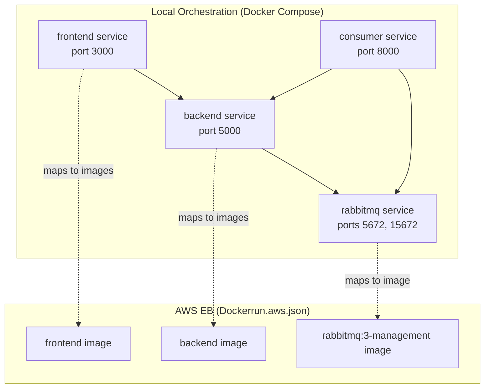
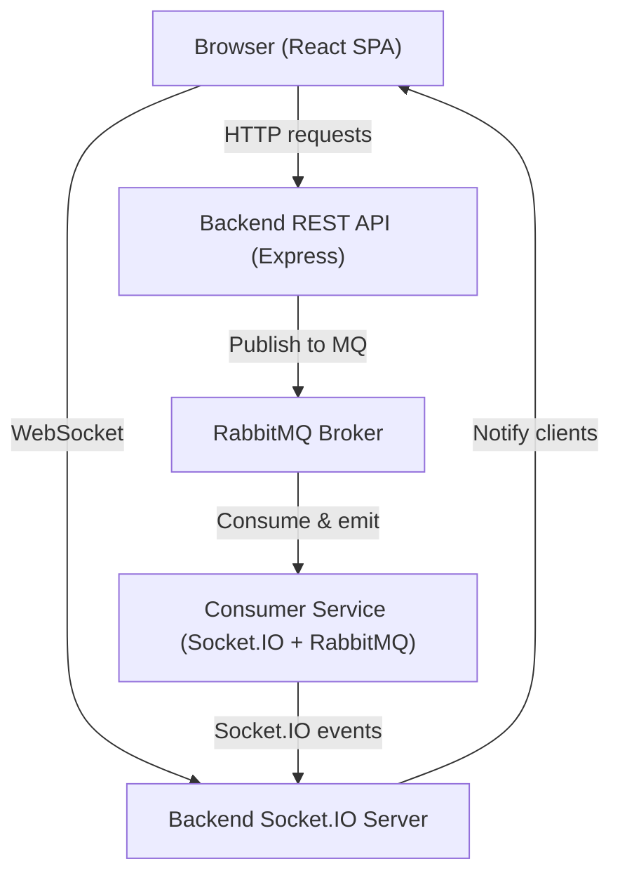
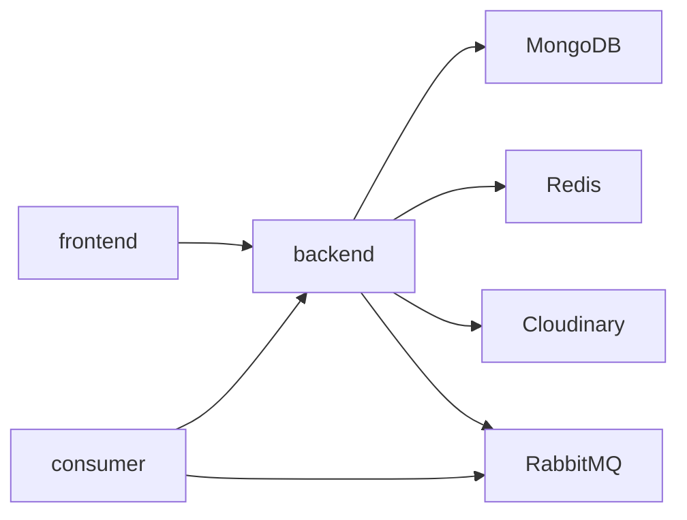

# Deployment & DevOps

<cite>
**Referenced Files in This Document**
- [docker-compose.yml](file://docker-compose.yml)
- [Dockerrun.aws.json](file://Dockerrun.aws.json)
- [backend/Dockerfile](file://backend/Dockerfile)
- [frontend/Dockerfile](file://frontend/Dockerfile)
- [messageServices/Dockerfile](file://messageServices/Dockerfile)
- [.github/workflows/main.yml](file://.github/workflows/main.yml)
- [backend/package.json](file://backend/package.json)
- [frontend/package.json](file://frontend/package.json)
- [messageServices/package.json](file://messageServices/package.json)
- [backend/server.js](file://backend/server.js)
- [messageServices/server.js](file://messageServices/server.js)
- [backend/DatabaseConnection/dataBaseConnection.js](file://backend/DatabaseConnection/dataBaseConnection.js)
- [backend/config/cloudinary.js](file://backend/config/cloudinary.js)
- [backend/config/redisClient.js](file://backend/config/redisClient.js)
</cite>

## Table of Contents
1. [Introduction](#introduction)
2. [Project Structure](#project-structure)
3. [Core Components](#core-components)
4. [Architecture Overview](#architecture-overview)
5. [Detailed Component Analysis](#detailed-component-analysis)
6. [Dependency Analysis](#dependency-analysis)
7. [Performance Considerations](#performance-considerations)
8. [Troubleshooting Guide](#troubleshooting-guide)
9. [Conclusion](#conclusion)
10. [Appendices](#appendices)

## Introduction
This document provides comprehensive deployment and DevOps guidance for the Vehicle Management System. It covers containerization strategies for the frontend, backend, and message service, Docker Compose orchestration for local development and production, AWS Elastic Beanstalk deployment via Dockerrun.aws.json, CI/CD pipeline recommendations, monitoring and logging, health checks, rollback procedures, and security considerations for production.

## Project Structure
The repository is organized into three primary services:
- Frontend: React application built and served statically
- Backend: Node.js/Express API with MongoDB, Redis, and Cloudinary integrations
- Message Services: Node.js service consuming RabbitMQ and emitting Socket.IO events

Local orchestration is managed via Docker Compose, while AWS Elastic Beanstalk uses Dockerrun.aws.json to define container images and port mappings. GitHub Actions automates deployments to a self-hosted EC2 environment.

**Diagram sources**
- [docker-compose.yml](file://docker-compose.yml#L3-L52)
- [Dockerrun.aws.json](file://Dockerrun.aws.json#L3-L41)

**Section sources**
- [docker-compose.yml](file://docker-compose.yml#L1-L54)
- [Dockerrun.aws.json](file://Dockerrun.aws.json#L1-L47)

## Core Components
- Frontend service: Built with npm and served via a static HTTP server. Exposed on port 3000.
- Backend service: Node.js/Express server with Socket.IO, CORS, rate limiting, helmet, and MongoDB connectivity. Exposed on port 5000.
- RabbitMQ service: Management UI included for operational visibility.
- Consumer service: Node.js service listening to RabbitMQ queues and emitting Socket.IO events to frontend clients. Exposed on port 8000.

Environment variables are injected via Docker Compose and GitHub Actions. Secrets are stored in repository secrets and written to .env files during CI.

**Section sources**
- [frontend/Dockerfile](file://frontend/Dockerfile#L1-L23)
- [backend/Dockerfile](file://backend/Dockerfile#L1-L13)
- [messageServices/Dockerfile](file://messageServices/Dockerfile#L1-L14)
- [docker-compose.yml](file://docker-compose.yml#L3-L52)
- [.github/workflows/main.yml](file://.github/workflows/main.yml#L16-L99)

## Architecture Overview
The system comprises three containers orchestrated locally and deployed on AWS Elastic Beanstalk. The backend exposes REST APIs and Socket.IO endpoints. The consumer service subscribes to RabbitMQ exchanges/queues and emits real-time notifications via Socket.IO. The frontend consumes both REST and WebSocket connections.

**Diagram sources**
- [backend/server.js](file://backend/server.js#L34-L76)
- [messageServices/server.js](file://messageServices/server.js#L9-L26)
- [docker-compose.yml](file://docker-compose.yml#L13-L51)

## Detailed Component Analysis

### Frontend Containerization
- Base image: Node 18 Alpine
- Build lifecycle:
  - Install dependencies
  - Build production bundle
  - Serve with a static HTTP server
- Port exposure: 3000
- Environment variables:
  - API URL configured for local development pointing to backend service

Operational notes:
- The frontend Dockerfile performs a production build and serves statically, suitable for containerized deployment.
- For production, consider an external reverse proxy (e.g., Nginx) to serve assets and handle TLS termination.

**Section sources**
- [frontend/Dockerfile](file://frontend/Dockerfile#L1-L23)
- [docker-compose.yml](file://docker-compose.yml#L4-L11)

### Backend Containerization
- Base image: Node 18 Alpine
- Build lifecycle:
  - Copy and install dependencies
  - Copy application code
- Port exposure: 5000
- Runtime behavior:
  - Loads environment-specific .env file based on NODE_ENV
  - Initializes CORS, middleware, Socket.IO, routes, and error handling
  - Connects to MongoDB using Mongoose with connection pooling and timeouts
  - Integrates Redis and Cloudinary via environment-configured clients

Security and hardening:
- Uses helmet for HTTP header security.
- Rate limiting and sanitization are declared as dependencies; ensure configuration is applied in production.
- CORS origin is controlled by environment variable.

**Section sources**
- [backend/Dockerfile](file://backend/Dockerfile#L1-L13)
- [backend/server.js](file://backend/server.js#L1-L204)
- [backend/DatabaseConnection/dataBaseConnection.js](file://backend/DatabaseConnection/dataBaseConnection.js#L1-L17)
- [backend/config/redisClient.js](file://backend/config/redisClient.js#L1-L20)
- [backend/config/cloudinary.js](file://backend/config/cloudinary.js#L1-L12)

### Message Services Containerization
- Base image: Node 18 Alpine
- Build lifecycle:
  - Copy and install dependencies
  - Copy application code
- Port exposure: 8000
- Runtime behavior:
  - Configures Socket.IO and registers connection handlers
  - Subscribes to RabbitMQ queues and emits Socket.IO events to registered user/admin rooms
  - Provides a basic health endpoint

Operational notes:
- The consumer depends on RabbitMQ availability and backend notification endpoint URL.
- Socket.IO CORS is permissive in development; tighten origins in production.

**Section sources**
- [messageServices/Dockerfile](file://messageServices/Dockerfile#L1-L14)
- [messageServices/server.js](file://messageServices/server.js#L1-L84)

### Docker Compose Orchestration (Local Development)
- Services:
  - frontend: maps host port 3000 to container port 3000; depends on backend
  - backend: maps host port 5000 to container port 5000; depends on rabbitmq
  - rabbitmq: exposes 5672 and 15672; default credentials set
  - consumer: maps host port 8000 to container port 8000; depends on rabbitmq and backend
- Environment variables:
  - RabbitMQ URL, SMTP settings, sender credentials, and backend service URL are provided to services

Health checks:
- No explicit health checks are defined in the compose file. Consider adding healthcheck directives for readiness/liveness.

**Section sources**
- [docker-compose.yml](file://docker-compose.yml#L1-L54)

### AWS Elastic Beanstalk Deployment (Dockerrun.aws.json)
- Container definitions:
  - frontend: exposes container port 3000
  - backend: exposes container port 5000
  - rabbitmq: exposes container ports 5672 and 15672
- Notes:
  - EB runs containers directly without orchestrating inter-service dependencies
  - Ensure environment variables are configured in EB Console or via configuration files
  - Consider externalizing RabbitMQ and MongoDB to managed services for production stability

**Section sources**
- [Dockerrun.aws.json](file://Dockerrun.aws.json#L1-L47)

### CI/CD Pipeline (GitHub Actions)
- Trigger: pushes to main branch
- Self-hosted runner with Node 22
- Steps:
  - Checkout code
  - Setup Node.js and cache dependencies
  - Ensure RabbitMQ container is running on the host
  - Install and run backend with PM2
  - Install and build frontend, deploy to Nginx static folder

Recommendations:
- Store sensitive environment variables in GitHub Secrets and write them to .env files during CI.
- Introduce automated tests (unit/integration) before deployment steps.
- Add rollback strategy (PM2 ecosystem files and version pinning).
- Use separate environments (staging/production) with distinct secret sets.

**Section sources**
- [.github/workflows/main.yml](file://.github/workflows/main.yml#L1-L99)

## Dependency Analysis
Runtime dependencies across services:
- Backend depends on:
  - MongoDB (via Mongoose)
  - Redis (via redis client)
  - Cloudinary (via configured SDK)
  - RabbitMQ (via amqplib)
- Frontend communicates with backend REST and Socket.IO endpoints.
- Consumer depends on RabbitMQ and backend notification endpoint.

**Diagram sources**
- [backend/server.js](file://backend/server.js#L10-L36)
- [backend/DatabaseConnection/dataBaseConnection.js](file://backend/DatabaseConnection/dataBaseConnection.js#L1-L17)
- [backend/config/redisClient.js](file://backend/config/redisClient.js#L1-L20)
- [backend/config/cloudinary.js](file://backend/config/cloudinary.js#L1-L12)
- [messageServices/server.js](file://messageServices/server.js#L1-L84)

**Section sources**
- [backend/package.json](file://backend/package.json#L1-L37)
- [frontend/package.json](file://frontend/package.json#L1-L63)
- [messageServices/package.json](file://messageServices/package.json#L1-L22)

## Performance Considerations
- Backend:
  - Connection pooling and server selection timeouts are configured for MongoDB.
  - Consider enabling compression and connection keep-alive for Socket.IO.
  - Tune rate limits and sanitization middleware for production traffic.
- Frontend:
  - Serve via a CDN or reverse proxy for caching and reduced latency.
- RabbitMQ:
  - Use dedicated managed queue service in production for reliability and scaling.
- Consumer:
  - Ensure durable queues and proper acknowledgment handling.
  - Scale horizontally if throughput increases.

[No sources needed since this section provides general guidance]

## Troubleshooting Guide
Common deployment issues and resolutions:
- RabbitMQ not reachable:
  - Verify container is running and ports are exposed.
  - Confirm RabbitMQ URL and credentials in environment variables.
- MongoDB connection failures:
  - Check MONGOURL and network connectivity.
  - Review connection timeout and pool settings.
- Redis errors:
  - Validate REDIS_URL and network access.
  - Monitor Redis client error logs.
- Frontend not loading:
  - Ensure API URL points to backend service hostname/port.
  - Confirm static asset serving and Nginx configuration.
- Socket.IO disconnections:
  - Verify CORS origins and transport settings.
  - Check consumer registration and room join events.

**Section sources**
- [backend/server.js](file://backend/server.js#L38-L64)
- [backend/DatabaseConnection/dataBaseConnection.js](file://backend/DatabaseConnection/dataBaseConnection.js#L1-L17)
- [backend/config/redisClient.js](file://backend/config/redisClient.js#L1-L20)
- [messageServices/server.js](file://messageServices/server.js#L34-L53)

## Conclusion
The Vehicle Management System is container-ready with clear separation of concerns across frontend, backend, and message services. Local development is streamlined with Docker Compose, while AWS Elastic Beanstalk supports containerized deployment. The GitHub Actions workflow automates deployments to a self-hosted EC2 environment. To enhance production readiness, introduce health checks, robust monitoring/logging, hardened security configurations, and managed services for databases and messaging.

[No sources needed since this section summarizes without analyzing specific files]

## Appendices

### Health Checks and Readiness
- Backend:
  - Add a GET endpoint returning application and dependency status.
  - Example path: GET /api/health
- RabbitMQ:
  - Use management plugin endpoints for cluster status.
- Redis:
  - Use PING command via client to confirm connectivity.
- Consumer:
  - Emit periodic heartbeat events and expose a health endpoint.

**Section sources**
- [backend/server.js](file://backend/server.js#L74-L76)
- [messageServices/server.js](file://messageServices/server.js#L28-L29)

### Monitoring and Logging
- Backend:
  - Winston logger configured; ensure structured logs and log level tuning.
  - Integrate metrics (e.g., Prometheus) and APM (e.g., New Relic/DataDog).
- Frontend:
  - Centralize error reporting (e.g., Sentry).
- RabbitMQ:
  - Monitor queue lengths, consumer lag, and broker metrics via management UI.
- Consumer:
  - Track processed messages and error rates.

**Section sources**
- [backend/package.json](file://backend/package.json#L30-L31)
- [messageServices/package.json](file://messageServices/package.json#L16-L19)

### Rollback Procedures
- GitHub Actions:
  - Pin application versions and maintain PM2 ecosystem files.
  - Use rollback commands to switch to previous versions.
- AWS Elastic Beanstalk:
  - Use application versions and environment swap to roll back quickly.
- Database:
  - Maintain backups and migration scripts for safe rollbacks.

**Section sources**
- [.github/workflows/main.yml](file://.github/workflows/main.yml#L66-L70)

### Security Considerations
- TLS:
  - Terminate TLS at a reverse proxy or load balancer; configure SSL certificates.
- Secrets:
  - Store secrets in repository secrets and environment-specific files.
- Network:
  - Restrict RabbitMQ and MongoDB access to internal networks.
  - Use private subnets and security groups in AWS.
- CORS and Headers:
  - Tighten CORS origins and apply security headers via helmet.
- Authentication:
  - Enforce HTTPS and secure cookies in production.

**Section sources**
- [backend/server.js](file://backend/server.js#L38-L59)
- [backend/package.json](file://backend/package.json#L15-L17)

### Load Balancing Setup
- AWS:
  - Place EB environment behind Application Load Balancer.
  - Enable multi-AZ and autoscaling groups.
- Internal:
  - Use Nginx or Traefik for local load balancing across replicas.

[No sources needed since this section provides general guidance]