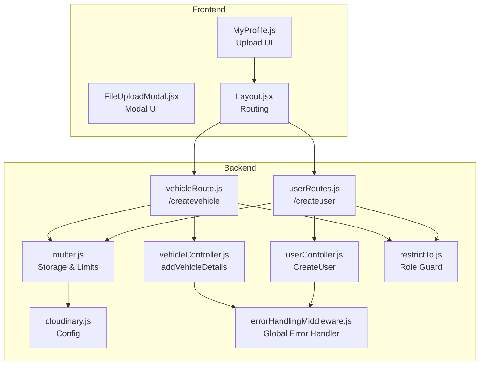
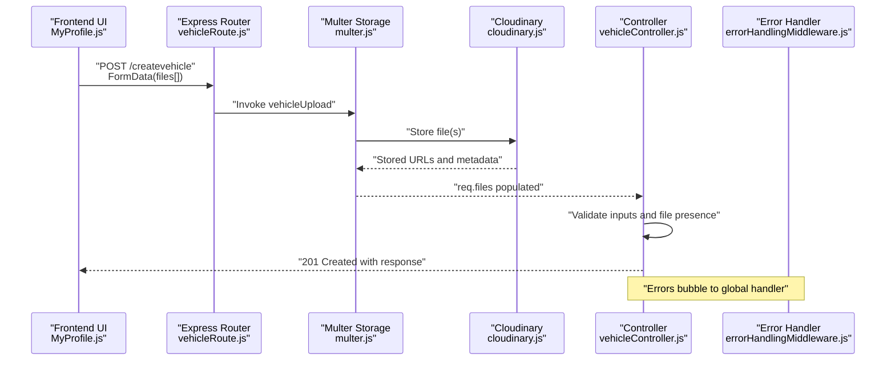
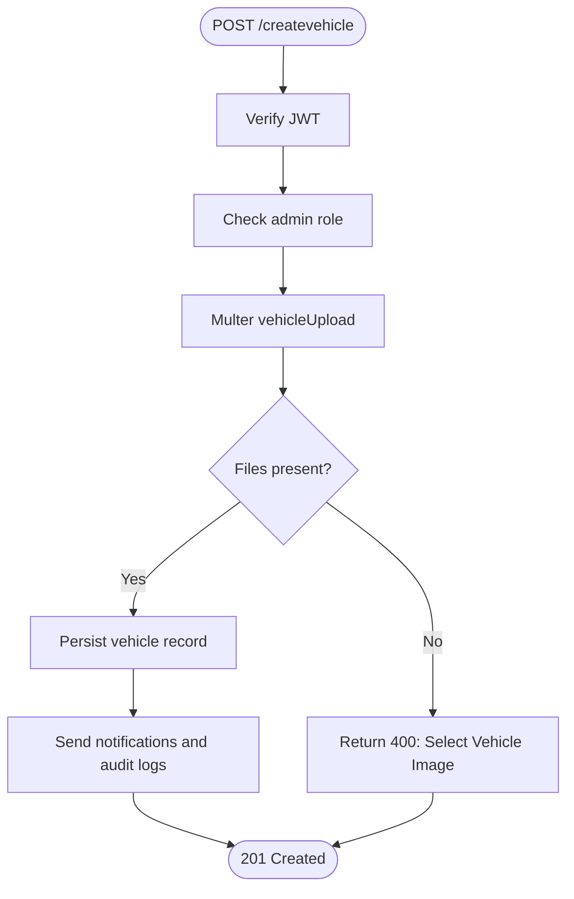
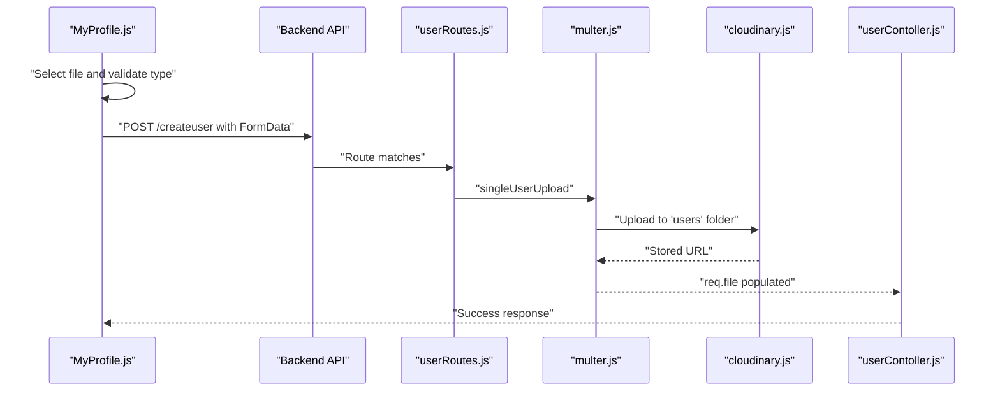
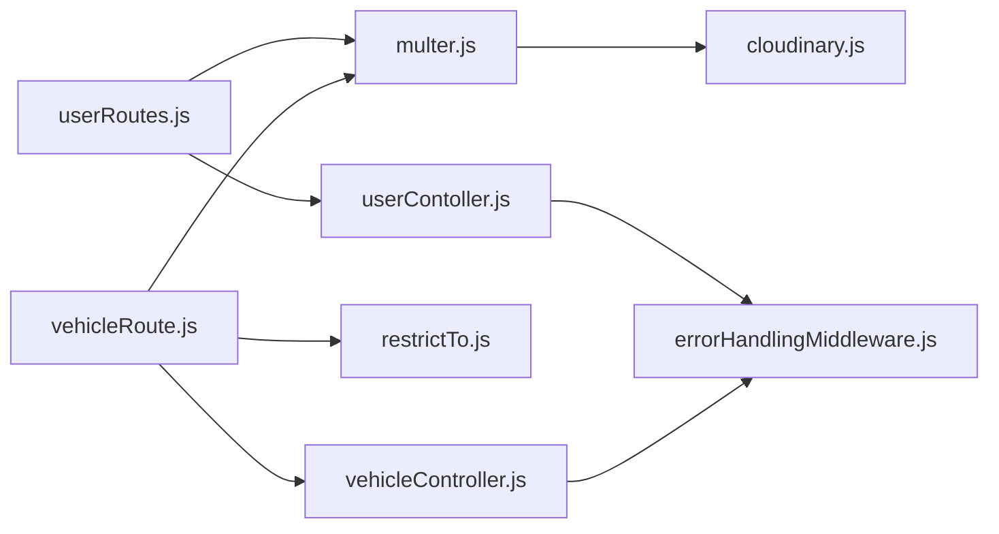

# File Upload & Cloudinary Integration

<cite>
**Referenced Files in This Document**
- [cloudinary.js](file://backend/config/cloudinary.js)
- [multer.js](file://backend/utils/multer.js)
- [vehicleRoute.js](file://backend/router/vehicleRoute.js)
- [userRoutes.js](file://backend/router/userRoutes.js)
- [vehicleController.js](file://backend/Controller/vehicleController.js)
- [userContoller.js](file://backend/Controller/userContoller.js)
- [errorHandlingMiddleware.js](file://backend/utils/errorHandlingMiddleware.js)
- [restrictTo.js](file://backend/utils/restrictTo.js)
- [MyProfile.js](file://frontend/src/comoponent/navBar/MyProfile.js)
- [FileUploadModal.jsx](file://frontend/src/comoponent/navBar/FileUploadModal.jsx)
- [Layout.jsx](file://frontend/src/comoponent/layout/Layout.jsx)
</cite>

## Table of Contents
1. [Introduction](#introduction)
2. [Project Structure](#project-structure)
3. [Core Components](#core-components)
4. [Architecture Overview](#architecture-overview)
5. [Detailed Component Analysis](#detailed-component-analysis)
6. [Dependency Analysis](#dependency-analysis)
7. [Performance Considerations](#performance-considerations)
8. [Troubleshooting Guide](#troubleshooting-guide)
9. [Conclusion](#conclusion)

## Introduction
This document explains the file upload and Cloudinary integration system used to manage vehicle and user-related assets. It covers the backend configuration with Multer and Cloudinary, validation rules, size limits, security controls, and the end-to-end upload workflow from frontend selection to Cloudinary storage. It also documents error handling, admin management considerations, and performance/cost optimization strategies.

## Project Structure
The upload system spans backend configuration and routing, controller logic, and frontend components:
- Backend configuration: Cloudinary credentials and Multer storage setup
- Backend routes: Expose upload endpoints guarded by authentication and role checks
- Controllers: Process uploaded files, enforce validation, and persist metadata
- Frontend components: Provide upload UI, validation, and feedback

**Diagram sources**
- [vehicleRoute.js](file://backend/router/vehicleRoute.js#L1-L42)
- [userRoutes.js](file://backend/router/userRoutes.js#L1-L41)
- [vehicleController.js](file://backend/Controller/vehicleController.js#L21-L203)
- [userContoller.js](file://backend/Controller/userContoller.js#L25-L92)
- [multer.js](file://backend/utils/multer.js#L1-L52)
- [cloudinary.js](file://backend/config/cloudinary.js#L1-L12)
- [errorHandlingMiddleware.js](file://backend/utils/errorHandlingMiddleware.js#L117-L233)
- [restrictTo.js](file://backend/utils/restrictTo.js#L1-L17)
- [MyProfile.js](file://frontend/src/comoponent/navBar/MyProfile.js#L318-L689)
- [FileUploadModal.jsx](file://frontend/src/comoponent/navBar/FileUploadModal.jsx#L1-L27)
- [Layout.jsx](file://frontend/src/comoponent/layout/Layout.jsx#L1-L136)

**Section sources**
- [cloudinary.js](file://backend/config/cloudinary.js#L1-L12)
- [multer.js](file://backend/utils/multer.js#L1-L52)
- [vehicleRoute.js](file://backend/router/vehicleRoute.js#L1-L42)
- [userRoutes.js](file://backend/router/userRoutes.js#L1-L41)
- [vehicleController.js](file://backend/Controller/vehicleController.js#L21-L203)
- [userContoller.js](file://backend/Controller/userContoller.js#L25-L92)
- [errorHandlingMiddleware.js](file://backend/utils/errorHandlingMiddleware.js#L117-L233)
- [restrictTo.js](file://backend/utils/restrictTo.js#L1-L17)
- [MyProfile.js](file://frontend/src/comoponent/navBar/MyProfile.js#L318-L689)
- [FileUploadModal.jsx](file://frontend/src/comoponent/navBar/FileUploadModal.jsx#L1-L27)
- [Layout.jsx](file://frontend/src/comoponent/layout/Layout.jsx#L1-L136)

## Core Components
- Cloudinary configuration: Centralized credentials and client initialization
- Multer storage: Dynamic Cloudinary storage with folder scoping, allowed formats, and unique public IDs
- Route guards: Authentication and role-based access control
- Controllers: Validate inputs, enforce file presence, and handle transaction-safe persistence
- Frontend upload UI: File selection, validation, and user feedback

Key capabilities:
- Supported formats: jpg, jpeg, png, pdf
- Size limits:
  - Vehicles: up to 5 MB per file
  - Users (bulk): up to 2 MB per file
  - Users (single): up to 10 MB per file
- Security:
  - Role restriction to admin for vehicle uploads
  - JWT-based authentication enforced via middleware
  - Allowed formats and size limits enforced by Multer/Cloudinary storage
- Storage:
  - Vehicles stored under the "vehicles" folder
  - Users stored under the "users" folder
  - Public IDs generated as timestamp-original filename prefix

**Section sources**
- [cloudinary.js](file://backend/config/cloudinary.js#L1-L12)
- [multer.js](file://backend/utils/multer.js#L9-L20)
- [multer.js](file://backend/utils/multer.js#L25-L44)
- [vehicleRoute.js](file://backend/router/vehicleRoute.js#L8-L14)
- [userRoutes.js](file://backend/router/userRoutes.js#L21-L26)
- [vehicleController.js](file://backend/Controller/vehicleController.js#L63-L66)
- [userContoller.js](file://backend/Controller/userContoller.js#L37-L38)

## Architecture Overview
The upload pipeline integrates frontend selection, backend validation, and Cloudinary storage. The following sequence diagram maps the actual code paths.

**Diagram sources**
- [vehicleRoute.js](file://backend/router/vehicleRoute.js#L8-L14)
- [multer.js](file://backend/utils/multer.js#L25-L28)
- [cloudinary.js](file://backend/config/cloudinary.js#L5-L9)
- [vehicleController.js](file://backend/Controller/vehicleController.js#L63-L66)
- [errorHandlingMiddleware.js](file://backend/utils/errorHandlingMiddleware.js#L213-L233)

## Detailed Component Analysis

### Cloudinary Configuration
- Initializes the Cloudinary SDK using environment variables for cloud name, API key, and API secret
- Exports the configured client for use by Multer storage

Security and reliability:
- Credentials are loaded from environment variables
- Uses Cloudinary v2 client

**Section sources**
- [cloudinary.js](file://backend/config/cloudinary.js#L1-L12)

### Multer Storage and Validation
- Dynamic Cloudinary storage factory supports configurable folder names
- Allowed formats: jpg, jpeg, png, pdf
- Unique public IDs generated using timestamp plus original filename prefix
- Size limits:
  - Vehicle uploads: 5 MB
  - User bulk uploads: 2 MB
  - User single uploads: 10 MB
- Two upload strategies:
  - Array of files for vehicles
  - Optional single-file upload for user profile photos

Operational notes:
- Public ID generation avoids collisions and preserves readability
- Folder-based organization simplifies asset management

**Section sources**
- [multer.js](file://backend/utils/multer.js#L9-L20)
- [multer.js](file://backend/utils/multer.js#L25-L44)

### Vehicle Upload Endpoint
- Route: POST /createvehicle
- Guards: JWT verification and admin role restriction
- Middleware: vehicleUpload (Multer with Cloudinary storage)
- Controller logic:
  - Validates required inputs
  - Ensures at least one file is present
  - Persists vehicle record with file paths
  - Emits notifications and audit logs

**Diagram sources**
- [vehicleRoute.js](file://backend/router/vehicleRoute.js#L8-L14)
- [vehicleController.js](file://backend/Controller/vehicleController.js#L41-L66)

**Section sources**
- [vehicleRoute.js](file://backend/router/vehicleRoute.js#L1-L42)
- [vehicleController.js](file://backend/Controller/vehicleController.js#L21-L203)

### User Upload Endpoint
- Route: POST /createuser
- Guards: JWT verification and optional single-file upload
- Middleware: singleUserUpload (Multer with Cloudinary storage)
- Controller logic:
  - Uses req.file for single-file uploads
  - Stores file path in user record

Frontend integration:
- The profile page demonstrates file selection, client-side validation, and submission

**Section sources**
- [userRoutes.js](file://backend/router/userRoutes.js#L21-L26)
- [userContoller.js](file://backend/Controller/userContoller.js#L25-L92)
- [MyProfile.js](file://frontend/src/comoponent/navBar/MyProfile.js#L318-L366)

### Frontend Upload Components
- MyProfile.js:
  - File selection and drag-and-drop area
  - Client-side validation for image types (JPEG/PNG)
  - Submission via API endpoint with FormData
  - Toast notifications for success/failure
- FileUploadModal.jsx:
  - Reusable modal container for upload UI
- Layout.jsx:
  - Routes and navigation for admin and user pages

**Diagram sources**
- [MyProfile.js](file://frontend/src/comoponent/navBar/MyProfile.js#L326-L366)
- [userRoutes.js](file://backend/router/userRoutes.js#L21-L26)
- [multer.js](file://backend/utils/multer.js#L41-L44)
- [cloudinary.js](file://backend/config/cloudinary.js#L5-L9)
- [userContoller.js](file://backend/Controller/userContoller.js#L37-L38)

**Section sources**
- [MyProfile.js](file://frontend/src/comoponent/navBar/MyProfile.js#L318-L689)
- [FileUploadModal.jsx](file://frontend/src/comoponent/navBar/FileUploadModal.jsx#L1-L27)
- [Layout.jsx](file://frontend/src/comoponent/layout/Layout.jsx#L1-L136)

## Dependency Analysis
- vehicleRoute depends on:
  - vehicleController for business logic
  - multer vehicleUpload for file handling
  - verifyToken and restrictTo for security
- userRoutes depends on:
  - userContoller for user creation
  - multer singleUserUpload for profile photo
  - verifyToken and restrictTo for security
- multer depends on:
  - cloudinary client for storage
- controllers depend on:
  - AppError and catchAsync for error handling
  - Redis client for caching invalidation
- errorHandlingMiddleware centralizes error responses

**Diagram sources**
- [vehicleRoute.js](file://backend/router/vehicleRoute.js#L1-L42)
- [userRoutes.js](file://backend/router/userRoutes.js#L1-L41)
- [vehicleController.js](file://backend/Controller/vehicleController.js#L1-L20)
- [userContoller.js](file://backend/Controller/userContoller.js#L1-L25)
- [multer.js](file://backend/utils/multer.js#L1-L52)
- [cloudinary.js](file://backend/config/cloudinary.js#L1-L12)
- [errorHandlingMiddleware.js](file://backend/utils/errorHandlingMiddleware.js#L117-L233)
- [restrictTo.js](file://backend/utils/restrictTo.js#L1-L17)

**Section sources**
- [vehicleRoute.js](file://backend/router/vehicleRoute.js#L1-L42)
- [userRoutes.js](file://backend/router/userRoutes.js#L1-L41)
- [vehicleController.js](file://backend/Controller/vehicleController.js#L1-L20)
- [userContoller.js](file://backend/Controller/userContoller.js#L1-L25)
- [multer.js](file://backend/utils/multer.js#L1-L52)
- [cloudinary.js](file://backend/config/cloudinary.js#L1-L12)
- [errorHandlingMiddleware.js](file://backend/utils/errorHandlingMiddleware.js#L117-L233)
- [restrictTo.js](file://backend/utils/restrictTo.js#L1-L17)

## Performance Considerations
- CDN optimization:
  - Cloudinary delivers assets via CDN; ensure appropriate delivery settings (e.g., responsive breakpoints, compression) in Cloudinary transformations
- Cost management:
  - Monitor total storage and bandwidth usage in Cloudinary console
  - Use folder organization ("vehicles", "users") to track costs by category
- Upload performance:
  - Keep file sizes within configured limits to reduce upload time and storage costs
  - Consider client-side compression for images before upload
- Caching:
  - Controllers already invalidate caches on updates; ensure CDN cache policies align with content updates

[No sources needed since this section provides general guidance]

## Troubleshooting Guide
Common issues and resolutions:
- Validation errors:
  - Missing files for vehicle uploads: Controller enforces presence and returns 400
  - Mismatched confirm passwords or missing required fields for user registration
- Size limit exceeded:
  - Multer/Cloudinary storage rejects files larger than configured limits
- Unauthorized access:
  - Admin-only endpoints return 403 if userType is not admin
- Network/storage failures:
  - Global error handler returns structured responses; inspect logs for underlying causes

Operational tips:
- Inspect logs for CastError, ValidationError, JWT errors, and operational errors
- Confirm environment variables for Cloudinary credentials are set
- Verify allowed formats and size limits match frontend expectations

**Section sources**
- [vehicleController.js](file://backend/Controller/vehicleController.js#L41-L66)
- [userContoller.js](file://backend/Controller/userContoller.js#L39-L50)
- [restrictTo.js](file://backend/utils/restrictTo.js#L3-L14)
- [errorHandlingMiddleware.js](file://backend/utils/errorHandlingMiddleware.js#L213-L233)

## Conclusion
The file upload system leverages Multer with Cloudinary for secure, scalable asset storage. Clear validation rules, size limits, and role-based access control ensure robustness. The frontend provides intuitive upload experiences with immediate feedback. By organizing assets by folder and monitoring Cloudinary usage, teams can maintain performance and manage costs effectively.