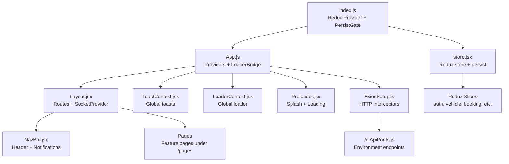
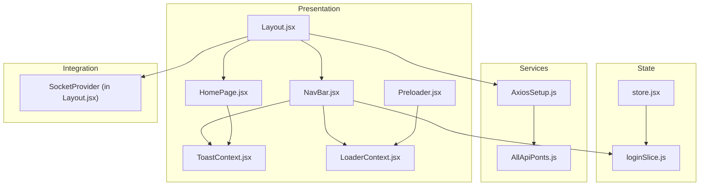
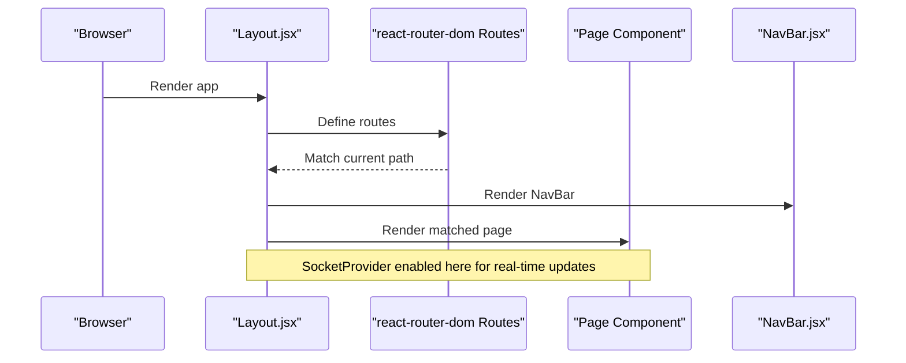
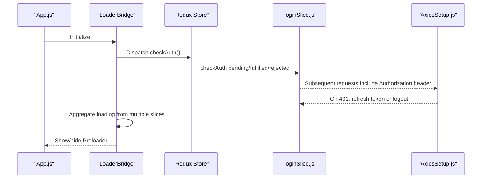
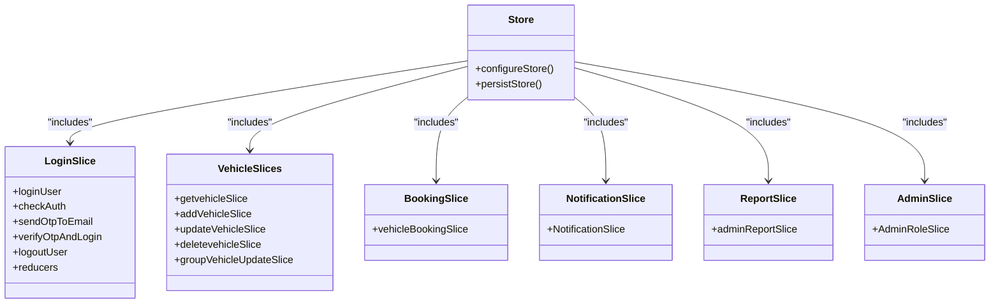
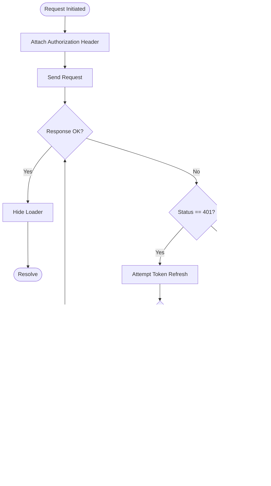
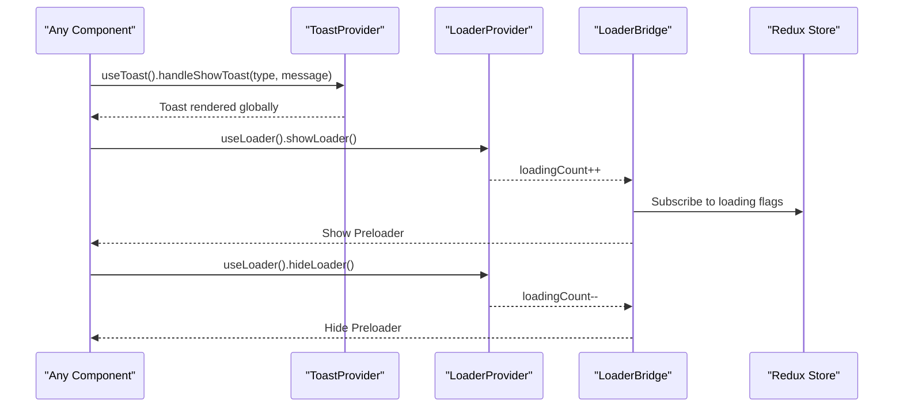
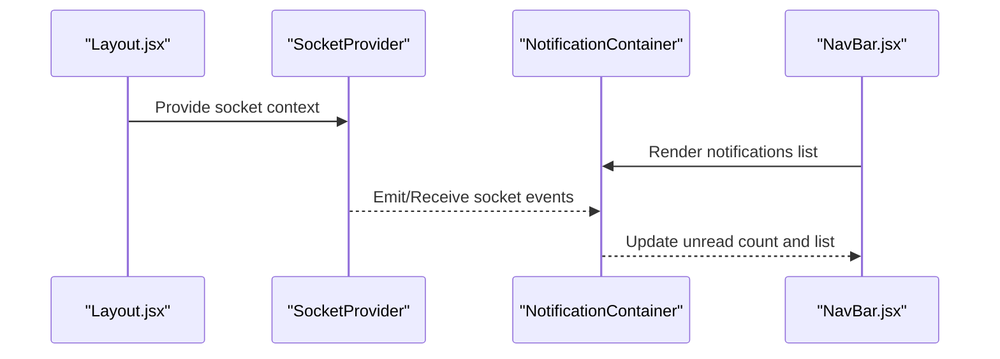
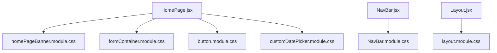
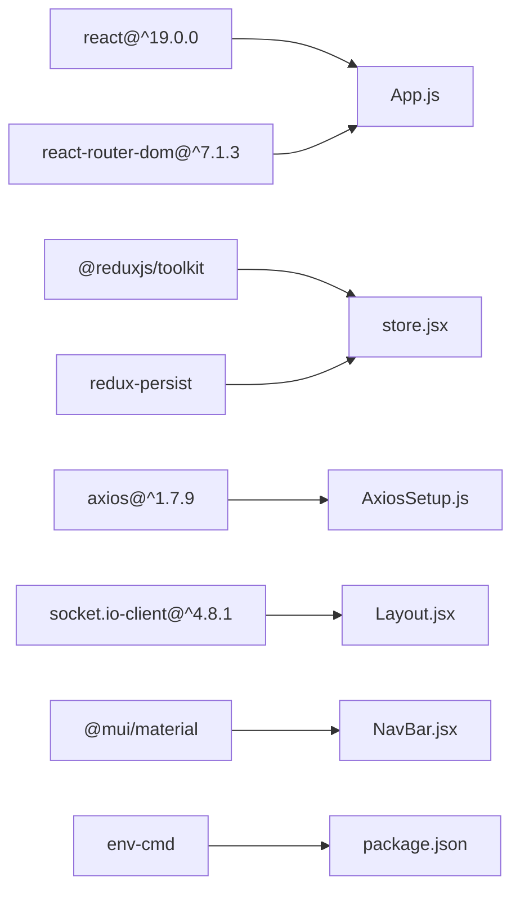

# Frontend Architecture

<cite>
**Referenced Files in This Document**
- [App.js](file://frontend/src/App.js)
- [index.js](file://frontend/src/index.js)
- [store.jsx](file://frontend/src/appRedux/store.jsx)
- [loginSlice.js](file://frontend/src/appRedux/redux/authSlice/loginSlice.js)
- [AxiosSetup.js](file://frontend/src/axiosInterceptors/AxiosSetup.js)
- [AllApiPonts.js](file://frontend/src/APIPoints/AllApiPonts.js)
- [Layout.jsx](file://frontend/src/comoponent/layout/Layout.jsx)
- [NavBar.jsx](file://frontend/src/comoponent/navBar/NavBar.jsx)
- [ToastContext.jsx](file://frontend/src/ContextApi/ToastContext.jsx)
- [LoaderContext.jsx](file://frontend/src/ContextApi/LoaderContext.jsx)
- [Preloader.jsx](file://frontend/src/preLoader/Preloader.jsx)
- [HomePage.jsx](file://frontend/src/pages/homePage/HomePage.jsx)
- [performLogout.js](file://frontend/src/utils/performLogout.js)
- [package.json](file://frontend/package.json)
</cite>

## Table of Contents
1. [Introduction](#introduction)
2. [Project Structure](#project-structure)
3. [Core Components](#core-components)
4. [Architecture Overview](#architecture-overview)
5. [Detailed Component Analysis](#detailed-component-analysis)
6. [Dependency Analysis](#dependency-analysis)
7. [Performance Considerations](#performance-considerations)
8. [Troubleshooting Guide](#troubleshooting-guide)
9. [Conclusion](#conclusion)
10. [Appendices](#appendices)

## Introduction
This document describes the frontend architecture of a React 19.0 application built with modern patterns for routing, state management, styling, real-time updates, and API communication. It covers component hierarchy, Redux Toolkit usage, Material UI styling strategy, responsive design, context-based global state, loaders and notifications, lifecycle management, error handling, and build/deployment preparation. Accessibility, cross-browser compatibility, and mobile responsiveness considerations are addressed throughout.

## Project Structure
The frontend is organized around feature-based modules with clear separation of concerns:
- Application bootstrap and providers in the root entry
- Routing and page composition in the layout component
- Redux slices for domain-specific state
- Context providers for global UI state (toasts, loaders)
- Interceptors for HTTP communication
- Styling via CSS Modules and Material UI components
- Real-time updates via Socket.IO (via a provider in the layout)
- Pages and reusable components under dedicated folders

**Diagram sources**
- [index.js](file://frontend/src/index.js#L1-L18)
- [App.js](file://frontend/src/App.js#L1-L79)
- [Layout.jsx](file://frontend/src/comoponent/layout/Layout.jsx#L1-L136)
- [NavBar.jsx](file://frontend/src/comoponent/navBar/NavBar.jsx#L1-L252)
- [ToastContext.jsx](file://frontend/src/ContextApi/ToastContext.jsx#L1-L29)
- [LoaderContext.jsx](file://frontend/src/ContextApi/LoaderContext.jsx#L1-L19)
- [Preloader.jsx](file://frontend/src/preLoader/Preloader.jsx#L1-L69)
- [store.jsx](file://frontend/src/appRedux/store.jsx#L1-L62)
- [AxiosSetup.js](file://frontend/src/axiosInterceptors/AxiosSetup.js#L1-L214)
- [AllApiPonts.js](file://frontend/src/APIPoints/AllApiPonts.js#L1-L3)

**Section sources**
- [index.js](file://frontend/src/index.js#L1-L18)
- [App.js](file://frontend/src/App.js#L1-L79)
- [Layout.jsx](file://frontend/src/comoponent/layout/Layout.jsx#L1-L136)
- [store.jsx](file://frontend/src/appRedux/store.jsx#L1-L62)

## Core Components
- Providers and bootstrapping:
  - Redux store and persistence are initialized at the root and wrapped with PersistGate to hydrate persisted state before rendering.
  - Global providers for toasts and loaders wrap the application to enable cross-component access.
- Authentication and session management:
  - A dedicated Redux slice handles login, OTP, logout, and session checks. An interceptor manages token refresh and redirects on unauthorized responses.
- Routing and layout:
  - Centralized routing with nested routes for pages, protected navigation, and a shared layout with header, footer, and socket-enabled context.
- UI and UX:
  - Toast notifications and a loader context provide consistent feedback.
  - A splash preloader is shown during initial auth checks and while async operations are pending.

**Section sources**
- [index.js](file://frontend/src/index.js#L1-L18)
- [App.js](file://frontend/src/App.js#L1-L79)
- [loginSlice.js](file://frontend/src/appRedux/redux/authSlice/loginSlice.js#L1-L213)
- [AxiosSetup.js](file://frontend/src/axiosInterceptors/AxiosSetup.js#L1-L214)
- [Layout.jsx](file://frontend/src/comoponent/layout/Layout.jsx#L1-L136)
- [ToastContext.jsx](file://frontend/src/ContextApi/ToastContext.jsx#L1-L29)
- [LoaderContext.jsx](file://frontend/src/ContextApi/LoaderContext.jsx#L1-L19)
- [Preloader.jsx](file://frontend/src/preLoader/Preloader.jsx#L1-L69)

## Architecture Overview
The frontend follows a layered architecture:
- Presentation layer: React components, Material UI components, and CSS Modules
- State layer: Redux Toolkit slices and persisted reducers
- Services layer: Axios interceptors for HTTP communication and environment-driven endpoints
- Integration layer: Socket.IO provider wired into the layout for real-time updates
- Infrastructure: Environment scripts and browser support configuration

**Diagram sources**
- [Layout.jsx](file://frontend/src/comoponent/layout/Layout.jsx#L1-L136)
- [NavBar.jsx](file://frontend/src/comoponent/navBar/NavBar.jsx#L1-L252)
- [HomePage.jsx](file://frontend/src/pages/homePage/HomePage.jsx#L1-L241)
- [ToastContext.jsx](file://frontend/src/ContextApi/ToastContext.jsx#L1-L29)
- [LoaderContext.jsx](file://frontend/src/ContextApi/LoaderContext.jsx#L1-L19)
- [Preloader.jsx](file://frontend/src/preLoader/Preloader.jsx#L1-L69)
- [store.jsx](file://frontend/src/appRedux/store.jsx#L1-L62)
- [loginSlice.js](file://frontend/src/appRedux/redux/authSlice/loginSlice.js#L1-L213)
- [AxiosSetup.js](file://frontend/src/axiosInterceptors/AxiosSetup.js#L1-L214)
- [AllApiPonts.js](file://frontend/src/APIPoints/AllApiPonts.js#L1-L3)

## Detailed Component Analysis

### Routing and Layout
- The layout component defines all routes and renders the shared header, pages, and footer. It wraps the entire routing tree with a socket provider for real-time capabilities.
- Navigation guards and conditional rendering are handled at the route level (for example, redirecting unauthenticated users to the home page for certain routes).

**Diagram sources**
- [Layout.jsx](file://frontend/src/comoponent/layout/Layout.jsx#L1-L136)
- [NavBar.jsx](file://frontend/src/comoponent/navBar/NavBar.jsx#L1-L252)

**Section sources**
- [Layout.jsx](file://frontend/src/comoponent/layout/Layout.jsx#L1-L136)

### Authentication and Session Lifecycle
- The authentication flow uses Redux async thunks for login, OTP, logout, and session checks. The loader bridge aggregates loading states from multiple slices to drive a single global loader.
- On page load, a check-auth operation is dispatched to restore session state. Unauthorized responses trigger token refresh logic and eventual logout.

**Diagram sources**
- [App.js](file://frontend/src/App.js#L1-L79)
- [loginSlice.js](file://frontend/src/appRedux/redux/authSlice/loginSlice.js#L1-L213)
- [AxiosSetup.js](file://frontend/src/axiosInterceptors/AxiosSetup.js#L1-L214)

**Section sources**
- [App.js](file://frontend/src/App.js#L1-L79)
- [loginSlice.js](file://frontend/src/appRedux/redux/authSlice/loginSlice.js#L1-L213)
- [AxiosSetup.js](file://frontend/src/axiosInterceptors/AxiosSetup.js#L1-L214)

### State Management with Redux Toolkit
- The store composes multiple slices for auth, vehicles, bookings, notifications, reports, and admin data. Only the login slice is persisted to maintain session state across sessions.
- Serializability checks are configured to ignore Redux Persist actions.

**Diagram sources**
- [store.jsx](file://frontend/src/appRedux/store.jsx#L1-L62)
- [loginSlice.js](file://frontend/src/appRedux/redux/authSlice/loginSlice.js#L1-L213)

**Section sources**
- [store.jsx](file://frontend/src/appRedux/store.jsx#L1-L62)
- [loginSlice.js](file://frontend/src/appRedux/redux/authSlice/loginSlice.js#L1-L213)

### HTTP Communication and Token Refresh
- Axios is configured with interceptors to attach Authorization headers, show/hide loaders, and handle 401 responses by attempting a token refresh. On failure, the client clears persisted and local state and navigates to the login page.

**Diagram sources**
- [AxiosSetup.js](file://frontend/src/axiosInterceptors/AxiosSetup.js#L1-L214)
- [AllApiPonts.js](file://frontend/src/APIPoints/AllApiPonts.js#L1-L3)

**Section sources**
- [AxiosSetup.js](file://frontend/src/axiosInterceptors/AxiosSetup.js#L1-L214)
- [AllApiPonts.js](file://frontend/src/APIPoints/AllApiPonts.js#L1-L3)

### Context API for Global State (Toasts and Loaders)
- ToastProvider exposes a centralized toast mechanism to any component via a hook.
- LoaderProvider maintains a counter-based global loader state, synchronized with Redux loading flags.

**Diagram sources**
- [ToastContext.jsx](file://frontend/src/ContextApi/ToastContext.jsx#L1-L29)
- [LoaderContext.jsx](file://frontend/src/ContextApi/LoaderContext.jsx#L1-L19)
- [App.js](file://frontend/src/App.js#L1-L79)

**Section sources**
- [ToastContext.jsx](file://frontend/src/ContextApi/ToastContext.jsx#L1-L29)
- [LoaderContext.jsx](file://frontend/src/ContextApi/LoaderContext.jsx#L1-L19)
- [App.js](file://frontend/src/App.js#L1-L79)

### Real-Time Updates with Socket.IO
- The layout wraps the routing tree with a SocketProvider, enabling real-time updates for notifications and other dynamic content. Components can subscribe to socket events and update state accordingly.

**Diagram sources**
- [Layout.jsx](file://frontend/src/comoponent/layout/Layout.jsx#L1-L136)
- [NavBar.jsx](file://frontend/src/comoponent/navBar/NavBar.jsx#L1-L252)

**Section sources**
- [Layout.jsx](file://frontend/src/comoponent/layout/Layout.jsx#L1-L136)
- [NavBar.jsx](file://frontend/src/comoponent/navBar/NavBar.jsx#L1-L252)

### Component Composition and Styling Strategy
- Component composition emphasizes small, focused components with shared layouts and headers.
- Styling uses CSS Modules for scoped styles and Material UI components for standardized UI elements. Responsive design is achieved through modular CSS and component-level layout adjustments.

**Diagram sources**
- [HomePage.jsx](file://frontend/src/pages/homePage/HomePage.jsx#L1-L241)
- [NavBar.jsx](file://frontend/src/comoponent/navBar/NavBar.jsx#L1-L252)
- [Layout.jsx](file://frontend/src/comoponent/layout/Layout.jsx#L1-L136)

**Section sources**
- [HomePage.jsx](file://frontend/src/pages/homePage/HomePage.jsx#L1-L241)
- [NavBar.jsx](file://frontend/src/comoponent/navBar/NavBar.jsx#L1-L252)
- [Layout.jsx](file://frontend/src/comoponent/layout/Layout.jsx#L1-L136)

### Accessibility, Cross-Browser Compatibility, and Mobile Responsiveness
- Accessibility: Components use semantic HTML and focus management (e.g., dropdowns). Ensure ARIA attributes and keyboard navigation are added where missing.
- Cross-browser compatibility: The project targets modern browsers with a production browserslist configuration excluding very old clients.
- Mobile responsiveness: CSS Modules and layout containers adapt to screen sizes; ensure media queries and flex/grid usage are consistent across components.

**Section sources**
- [package.json](file://frontend/package.json#L50-L61)

## Dependency Analysis
The frontend depends on:
- React 19 and React Router v7 for UI and routing
- Redux Toolkit and Redux Persist for state management
- Axios for HTTP requests with interceptors
- Socket.IO client for real-time updates
- Material UI for components and styling
- Environment scripts for development and production builds

**Diagram sources**
- [App.js](file://frontend/src/App.js#L1-L79)
- [store.jsx](file://frontend/src/appRedux/store.jsx#L1-L62)
- [AxiosSetup.js](file://frontend/src/axiosInterceptors/AxiosSetup.js#L1-L214)
- [Layout.jsx](file://frontend/src/comoponent/layout/Layout.jsx#L1-L136)
- [package.json](file://frontend/package.json#L1-L63)

**Section sources**
- [package.json](file://frontend/package.json#L1-L63)

## Performance Considerations
- Minimize re-renders by selecting only necessary state in components and using memoization where appropriate.
- Lazy-load heavy components and images to improve initial load times.
- Debounce or throttle frequent UI interactions (e.g., date/time pickers).
- Keep Redux state normalized and avoid storing large objects unnecessarily.
- Use CSS Modules and scoped styles to prevent cascade-related performance issues.
- Monitor bundle size and split code using dynamic imports for routes.

## Troubleshooting Guide
- Authentication failures:
  - Verify environment variables for API endpoints and socket URLs.
  - Confirm that the interceptor attaches Authorization headers and handles 401 responses.
  - Ensure persisted login state is cleared on logout and token refresh failures.
- Toast and loader issues:
  - Confirm providers are wrapping the application root.
  - Check that loader counts are balanced (show/hide pairs).
- Real-time updates:
  - Verify the SocketProvider is mounted in the layout and socket connections are established.
- Build and deployment:
  - Use environment scripts to build for production and ensure environment files are present.
  - Validate browserslist configuration for supported clients.

**Section sources**
- [AxiosSetup.js](file://frontend/src/axiosInterceptors/AxiosSetup.js#L1-L214)
- [performLogout.js](file://frontend/src/utils/performLogout.js#L1-L40)
- [ToastContext.jsx](file://frontend/src/ContextApi/ToastContext.jsx#L1-L29)
- [LoaderContext.jsx](file://frontend/src/ContextApi/LoaderContext.jsx#L1-L19)
- [Layout.jsx](file://frontend/src/comoponent/layout/Layout.jsx#L1-L136)
- [package.json](file://frontend/package.json#L37-L43)

## Conclusion
The frontend employs a clean, layered architecture with Redux Toolkit for state, Context API for global UI concerns, Axios interceptors for robust HTTP communication, and Socket.IO for real-time updates. The layout-centric routing and modular CSS strategy promote maintainability and scalability. By following the outlined practices and troubleshooting steps, teams can ensure reliable performance, accessibility, and cross-browser compatibility.

## Appendices
- Environment configuration:
  - Development and production scripts use env-cmd to load environment files.
  - API server URL and socket server URL are loaded from environment variables.
- Build and deployment:
  - Production builds are prepared via scripts that source production environment files.
  - Ensure environment files are included in deployment artifacts.

**Section sources**
- [package.json](file://frontend/package.json#L37-L43)
- [AllApiPonts.js](file://frontend/src/APIPoints/AllApiPonts.js#L1-L3)