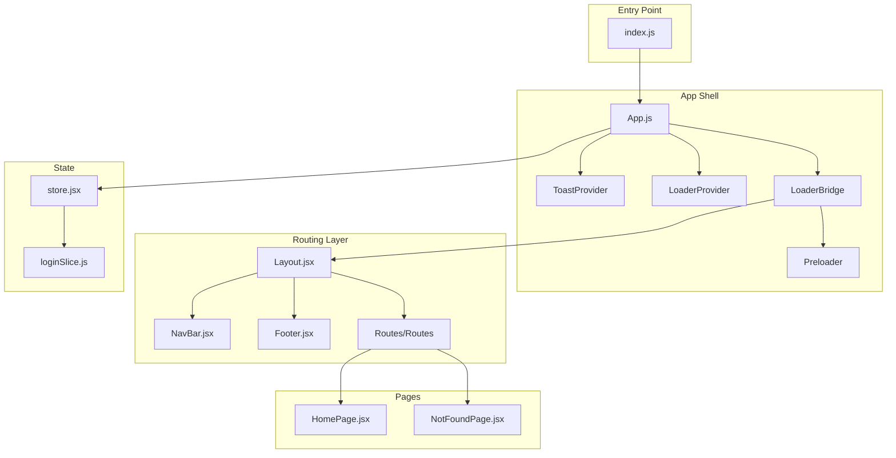
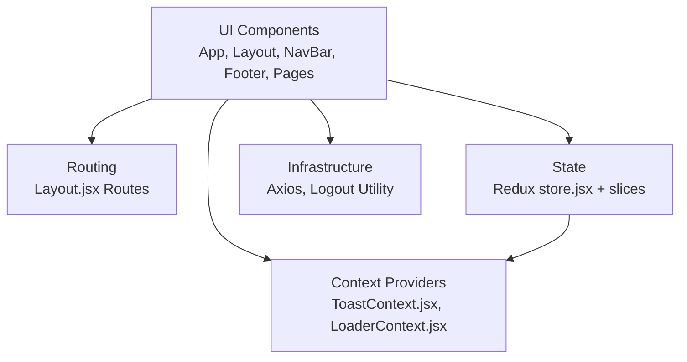
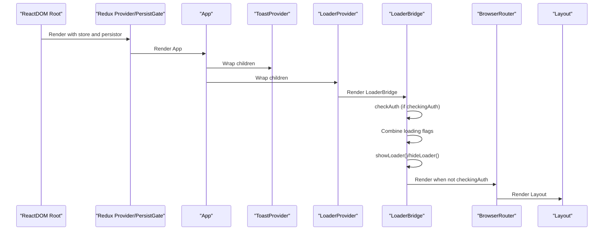
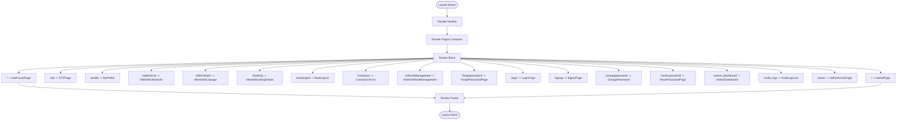
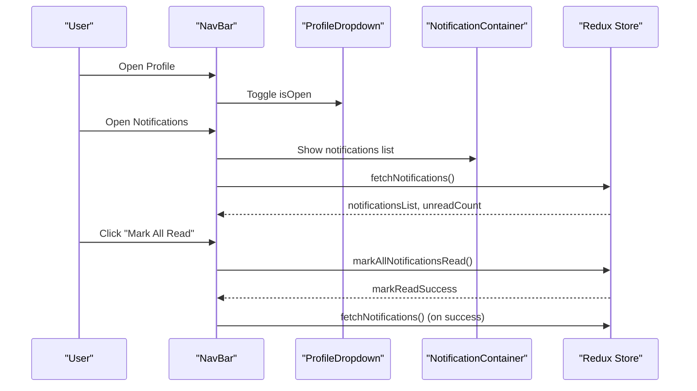
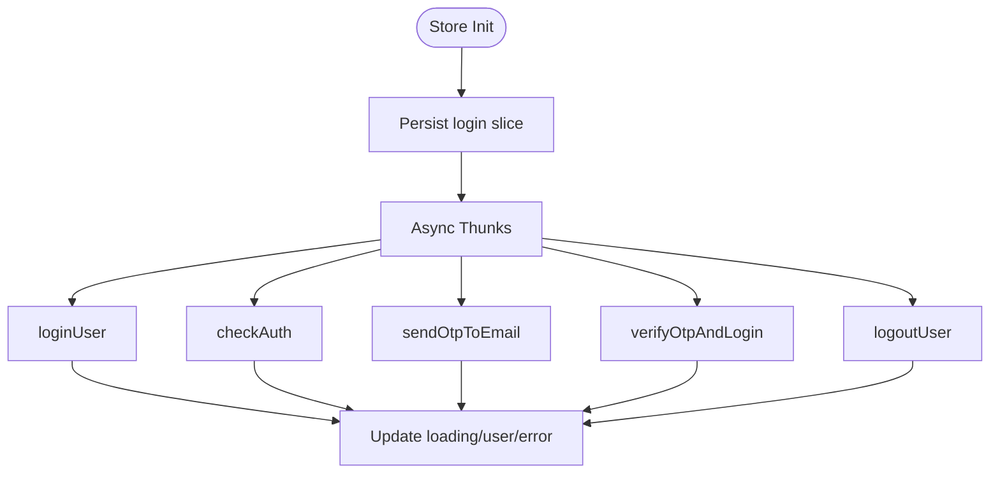
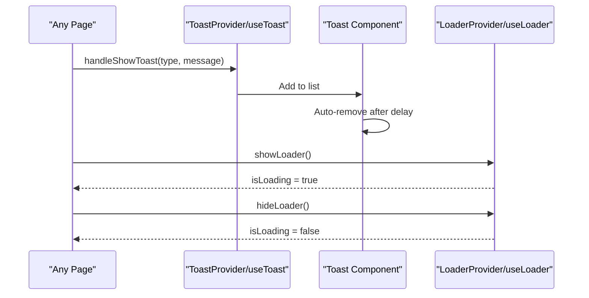
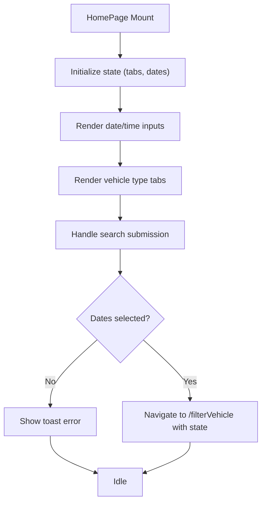
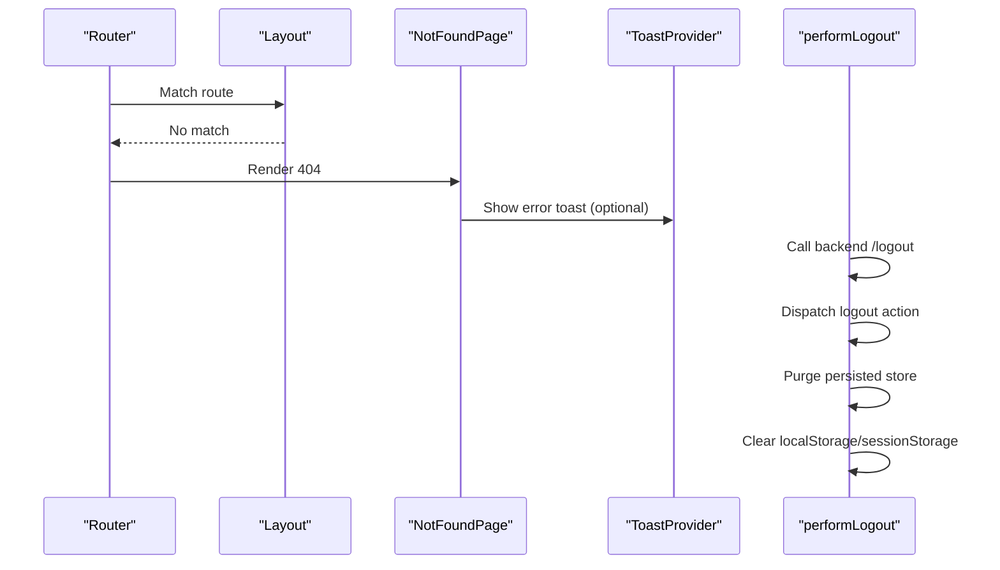
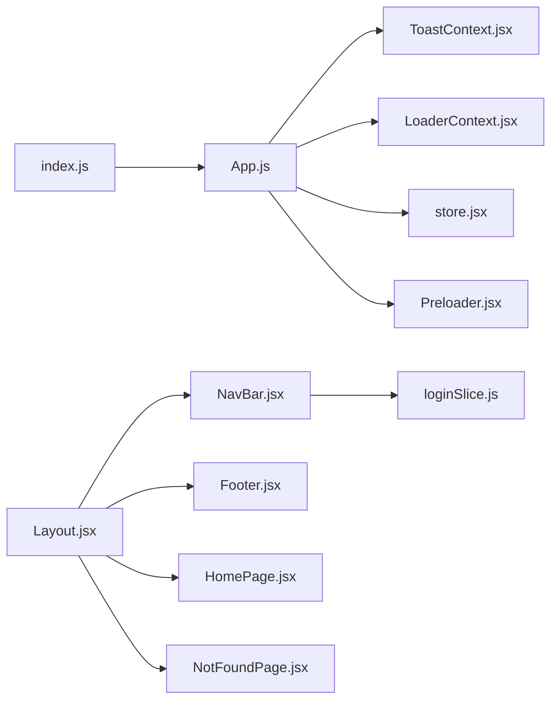

# React Application Structure

<cite>
**Referenced Files in This Document**
- [App.js](file://frontend/src/App.js)
- [index.js](file://frontend/src/index.js)
- [Layout.jsx](file://frontend/src/comoponent/layout/Layout.jsx)
- [NavBar.jsx](file://frontend/src/comoponent/navBar/NavBar.jsx)
- [Footer.jsx](file://frontend/src/pages/footer/Footer.jsx)
- [HomePage.jsx](file://frontend/src/pages/homePage/HomePage.jsx)
- [store.jsx](file://frontend/src/appRedux/store.jsx)
- [ToastContext.jsx](file://frontend/src/ContextApi/ToastContext.jsx)
- [LoaderContext.jsx](file://frontend/src/ContextApi/LoaderContext.jsx)
- [Preloader.jsx](file://frontend/src/preLoader/Preloader.jsx)
- [NotFoundPage.jsx](file://frontend/src/errorPage/NotFoundPage.jsx)
- [performLogout.js](file://frontend/src/utils/performLogout.js)
- [toast.jsx](file://frontend/src/comoponent/toaster/toast/toast.jsx)
- [loginSlice.js](file://frontend/src/appRedux/redux/authSlice/loginSlice.js)
</cite>

## Table of Contents
1. [Introduction](#introduction)
2. [Project Structure](#project-structure)
3. [Core Components](#core-components)
4. [Architecture Overview](#architecture-overview)
5. [Detailed Component Analysis](#detailed-component-analysis)
6. [Dependency Analysis](#dependency-analysis)
7. [Performance Considerations](#performance-considerations)
8. [Troubleshooting Guide](#troubleshooting-guide)
9. [Conclusion](#conclusion)
10. [Appendices](#appendices)

## Introduction
This document explains the React 19.0 application structure for the vehicle rental platform. It covers component hierarchy, file organization, routing, layout, navigation, state management via Redux, context providers for toasts and loaders, error handling, and performance practices. It also outlines naming conventions, folder structure, and development workflow patterns derived from the codebase.

## Project Structure
The frontend is organized by feature and layer:
- Entry point renders the Redux Provider and persisted store, then mounts the App shell.
- App wraps the entire app with toast and loader providers and orchestrates preloading and authentication checks.
- Layout composes the global navigation, page routes, and footer.
- Pages are grouped by feature folders (e.g., homePage, adminDashboard, bookingList).
- Shared components live under comoponent (e.g., navBar, layout, toaster).
- State is centralized using Redux Toolkit slices and persisted partially with redux-persist.
- Utilities include axios interceptors, logout helpers, and shared helpers.

**Diagram sources**
- [index.js](file://frontend/src/index.js#L1-L18)
- [App.js](file://frontend/src/App.js#L1-L79)
- [Layout.jsx](file://frontend/src/comoponent/layout/Layout.jsx#L1-L136)
- [NavBar.jsx](file://frontend/src/comoponent/navBar/NavBar.jsx#L1-L252)
- [Footer.jsx](file://frontend/src/pages/footer/Footer.jsx#L1-L21)
- [HomePage.jsx](file://frontend/src/pages/homePage/HomePage.jsx#L1-L241)
- [NotFoundPage.jsx](file://frontend/src/errorPage/NotFoundPage.jsx#L1-L29)
- [store.jsx](file://frontend/src/appRedux/store.jsx#L1-L62)
- [loginSlice.js](file://frontend/src/appRedux/redux/authSlice/loginSlice.js#L1-L213)

**Section sources**
- [index.js](file://frontend/src/index.js#L1-L18)
- [App.js](file://frontend/src/App.js#L1-L79)
- [Layout.jsx](file://frontend/src/comoponent/layout/Layout.jsx#L1-L136)

## Core Components
- App shell and providers: App wraps the app with Redux Provider and PersistGate, then composes ToastProvider and LoaderProvider. A LoaderBridge component listens to Redux loading flags and toggles a Preloader while checking authentication and coordinating loader visibility.
- Layout: Centralizes routing, socket provider, and renders NavBar and Footer around routed pages.
- Navigation: NavBar handles logo navigation, contact/dashboard links, notifications dropdown, and profile actions.
- State: Redux store configured with persisted login slice and multiple domain slices. Async thunks manage auth flows.
- Toast and Loader: Context-based systems provide global toast notifications and loader stacking.
- Pages: HomePage composes search form and carousels; NotFoundPage handles 404.

**Section sources**
- [App.js](file://frontend/src/App.js#L1-L79)
- [Layout.jsx](file://frontend/src/comoponent/layout/Layout.jsx#L1-L136)
- [NavBar.jsx](file://frontend/src/comoponent/navBar/NavBar.jsx#L1-L252)
- [store.jsx](file://frontend/src/appRedux/store.jsx#L1-L62)
- [loginSlice.js](file://frontend/src/appRedux/redux/authSlice/loginSlice.js#L1-L213)
- [ToastContext.jsx](file://frontend/src/ContextApi/ToastContext.jsx#L1-L29)
- [LoaderContext.jsx](file://frontend/src/ContextApi/LoaderContext.jsx#L1-L19)
- [Preloader.jsx](file://frontend/src/preLoader/Preloader.jsx#L1-L69)
- [HomePage.jsx](file://frontend/src/pages/homePage/HomePage.jsx#L1-L241)
- [NotFoundPage.jsx](file://frontend/src/errorPage/NotFoundPage.jsx#L1-L29)

## Architecture Overview
The app follows a layered architecture:
- Presentation layer: App, Layout, NavBar, Footer, Pages.
- Routing layer: Layout defines routes and delegates rendering.
- State layer: Redux store with persisted login slice and domain slices.
- Context layer: Toast and Loader contexts provide cross-cutting concerns.
- Infrastructure: Axios interceptors, logout utility, and preloader.

**Diagram sources**
- [App.js](file://frontend/src/App.js#L1-L79)
- [Layout.jsx](file://frontend/src/comoponent/layout/Layout.jsx#L1-L136)
- [store.jsx](file://frontend/src/appRedux/store.jsx#L1-L62)
- [ToastContext.jsx](file://frontend/src/ContextApi/ToastContext.jsx#L1-L29)
- [LoaderContext.jsx](file://frontend/src/ContextApi/LoaderContext.jsx#L1-L19)
- [performLogout.js](file://frontend/src/utils/performLogout.js#L1-L40)

## Detailed Component Analysis

### App Shell and Authentication Bridge
- App initializes Redux Provider and PersistGate, then wraps children with ToastProvider and LoaderProvider.
- LoaderBridge:
  - Subscribes to multiple Redux loading flags (login, OTP, vehicle list, booking).
  - Toggles Preloader visibility based on combined loading state.
  - Dispatches checkAuth during initial render if needed.
  - Renders BrowserRouter and Layout after authentication check completes.

**Diagram sources**
- [index.js](file://frontend/src/index.js#L1-L18)
- [App.js](file://frontend/src/App.js#L1-L79)
- [Layout.jsx](file://frontend/src/comoponent/layout/Layout.jsx#L1-L136)

**Section sources**
- [App.js](file://frontend/src/App.js#L1-L79)
- [index.js](file://frontend/src/index.js#L1-L18)

### Layout and Routing System
- Layout composes:
  - SocketProvider (wrapped around pages).
  - NavBar inside a dedicated container.
  - A Routes block with multiple routes for home, OTP, profile, vehicle management, admin dashboard, and a catch-all 404.
  - Footer below the page content area.
- Routes include conditional rendering for protected or role-specific pages.

**Diagram sources**
- [Layout.jsx](file://frontend/src/comoponent/layout/Layout.jsx#L1-L136)

**Section sources**
- [Layout.jsx](file://frontend/src/comoponent/layout/Layout.jsx#L1-L136)

### Navigation Bar and Profile/Notifications
- NavBar provides:
  - Logo navigation to home.
  - Conditional buttons for admin/user roles.
  - Notifications dropdown with unread count and “mark all read”.
  - Profile dropdown with menu items and logout.
- Uses Redux to fetch notifications and update unread counts.
- Click-outside handlers close dropdowns.

**Diagram sources**
- [NavBar.jsx](file://frontend/src/comoponent/navBar/NavBar.jsx#L1-L252)

**Section sources**
- [NavBar.jsx](file://frontend/src/comoponent/navBar/NavBar.jsx#L1-L252)

### State Initialization and Authentication Flow
- Redux store:
  - Configured with multiple slices (login, vehicles, bookings, notifications, admin).
  - Only the login slice is persisted with a blacklist of transient fields.
- loginSlice manages:
  - Async thunks for login, OTP, logout, and auth check.
  - Pending/fulfilled/rejected transitions update loading flags and user state.
  - Actions to clear user and reset login state.

**Diagram sources**
- [store.jsx](file://frontend/src/appRedux/store.jsx#L1-L62)
- [loginSlice.js](file://frontend/src/appRedux/redux/authSlice/loginSlice.js#L1-L213)

**Section sources**
- [store.jsx](file://frontend/src/appRedux/store.jsx#L1-L62)
- [loginSlice.js](file://frontend/src/appRedux/redux/authSlice/loginSlice.js#L1-L213)

### Toast and Loader Systems
- ToastProvider:
  - Exposes a hook to show toasts globally.
  - Mounts a single Toast component that auto-hides entries after a delay.
- LoaderProvider:
  - Maintains a counter for active loaders and exposes show/hide functions.
- LoaderBridge integrates loader visibility with Redux loading flags.

**Diagram sources**
- [ToastContext.jsx](file://frontend/src/ContextApi/ToastContext.jsx#L1-L29)
- [toast.jsx](file://frontend/src/comoponent/toaster/toast/toast.jsx#L1-L75)
- [LoaderContext.jsx](file://frontend/src/ContextApi/LoaderContext.jsx#L1-L19)
- [App.js](file://frontend/src/App.js#L1-L79)

**Section sources**
- [ToastContext.jsx](file://frontend/src/ContextApi/ToastContext.jsx#L1-L29)
- [toast.jsx](file://frontend/src/comoponent/toaster/toast/toast.jsx#L1-L75)
- [LoaderContext.jsx](file://frontend/src/ContextApi/LoaderContext.jsx#L1-L19)
- [App.js](file://frontend/src/App.js#L1-L79)

### Page-Level Components and Composition Patterns
- HomePage:
  - Composes date/time pickers, tabs, and a search form.
  - Validates inputs and navigates to filtered vehicle list with state.
  - Integrates with Redux user data and toast context.
- Footer:
  - Minimal static footer with links.
- NotFoundPage:
  - Catch-all 404 page with styled shapes and a link back to home.

**Diagram sources**
- [HomePage.jsx](file://frontend/src/pages/homePage/HomePage.jsx#L1-L241)
- [Footer.jsx](file://frontend/src/pages/footer/Footer.jsx#L1-L21)
- [NotFoundPage.jsx](file://frontend/src/errorPage/NotFoundPage.jsx#L1-L29)

**Section sources**
- [HomePage.jsx](file://frontend/src/pages/homePage/HomePage.jsx#L1-L241)
- [Footer.jsx](file://frontend/src/pages/footer/Footer.jsx#L1-L21)
- [NotFoundPage.jsx](file://frontend/src/errorPage/NotFoundPage.jsx#L1-L29)

### Error Boundary and Global Error Handling
- NotFoundPage serves as a route-level fallback for unmatched URLs.
- Toast system surfaces Redux errors and backend errors as user-facing messages.
- performLogout centralizes cleanup of auth state and storage.

**Diagram sources**
- [Layout.jsx](file://frontend/src/comoponent/layout/Layout.jsx#L1-L136)
- [NotFoundPage.jsx](file://frontend/src/errorPage/NotFoundPage.jsx#L1-L29)
- [ToastContext.jsx](file://frontend/src/ContextApi/ToastContext.jsx#L1-L29)
- [performLogout.js](file://frontend/src/utils/performLogout.js#L1-L40)

**Section sources**
- [Layout.jsx](file://frontend/src/comoponent/layout/Layout.jsx#L1-L136)
- [NotFoundPage.jsx](file://frontend/src/errorPage/NotFoundPage.jsx#L1-L29)
- [ToastContext.jsx](file://frontend/src/ContextApi/ToastContext.jsx#L1-L29)
- [performLogout.js](file://frontend/src/utils/performLogout.js#L1-L40)

## Dependency Analysis
- Entry point depends on Redux store and persistence.
- App depends on providers and LoaderBridge.
- Layout depends on routing, socket provider, NavBar, and Footer.
- NavBar depends on Redux for user and notifications, and on context for toasts.
- Pages depend on Redux and context for state and UX feedback.
- Toast and Loader contexts are consumed widely across components.

**Diagram sources**
- [index.js](file://frontend/src/index.js#L1-L18)
- [App.js](file://frontend/src/App.js#L1-L79)
- [Layout.jsx](file://frontend/src/comoponent/layout/Layout.jsx#L1-L136)
- [NavBar.jsx](file://frontend/src/comoponent/navBar/NavBar.jsx#L1-L252)
- [Footer.jsx](file://frontend/src/pages/footer/Footer.jsx#L1-L21)
- [HomePage.jsx](file://frontend/src/pages/homePage/HomePage.jsx#L1-L241)
- [NotFoundPage.jsx](file://frontend/src/errorPage/NotFoundPage.jsx#L1-L29)
- [store.jsx](file://frontend/src/appRedux/store.jsx#L1-L62)
- [loginSlice.js](file://frontend/src/appRedux/redux/authSlice/loginSlice.js#L1-L213)
- [ToastContext.jsx](file://frontend/src/ContextApi/ToastContext.jsx#L1-L29)
- [LoaderContext.jsx](file://frontend/src/ContextApi/LoaderContext.jsx#L1-L19)
- [Preloader.jsx](file://frontend/src/preLoader/Preloader.jsx#L1-L69)

**Section sources**
- [index.js](file://frontend/src/index.js#L1-L18)
- [App.js](file://frontend/src/App.js#L1-L79)
- [Layout.jsx](file://frontend/src/comoponent/layout/Layout.jsx#L1-L136)
- [NavBar.jsx](file://frontend/src/comoponent/navBar/NavBar.jsx#L1-L252)
- [store.jsx](file://frontend/src/appRedux/store.jsx#L1-L62)

## Performance Considerations
- LoaderBridge aggregates multiple loading flags and uses a single Preloader, reducing re-renders.
- Toast auto-cleanup removes entries after a fixed interval, preventing memory bloat.
- Persisted login slice avoids unnecessary re-computation of sensitive auth state.
- Consider memoizing expensive props passed to child components and using React.lazy for large page bundles if code-splitting is desired.

[No sources needed since this section provides general guidance]

## Troubleshooting Guide
- Authentication not persisting after refresh:
  - Verify persisted login slice configuration and blacklist fields.
- Toasts not appearing:
  - Ensure ToastProvider wraps the component tree and that handleShowToast is invoked.
- Loader not hiding:
  - Confirm all async operations reduce the loader count and that LoaderBridge subscribes to the correct Redux flags.
- Logout does not clear state:
  - Use performLogout to call backend logout, dispatch Redux logout, purge persisted store, and clear client storage.

**Section sources**
- [store.jsx](file://frontend/src/appRedux/store.jsx#L1-L62)
- [ToastContext.jsx](file://frontend/src/ContextApi/ToastContext.jsx#L1-L29)
- [LoaderContext.jsx](file://frontend/src/ContextApi/LoaderContext.jsx#L1-L19)
- [performLogout.js](file://frontend/src/utils/performLogout.js#L1-L40)

## Conclusion
The application employs a clean separation of concerns: routing and layout orchestration, Redux for state, and context providers for cross-cutting UX features. The structure supports scalability through feature-based folders, predictable state updates via Redux Toolkit, and robust user feedback via toasts and loaders. Adopting code-splitting and memoization can further improve performance.

[No sources needed since this section summarizes without analyzing specific files]

## Appendices

### Component Naming Conventions and Folder Organization
- Feature-based grouping:
  - Pages: pages/<FeatureName>/
  - Shared components: comoponent/<Category>/ (e.g., navBar, layout, toaster)
  - State slices: appRedux/redux/<sliceName>/
  - Context APIs: ContextApi/
  - Utilities: utils/
- File naming:
  - PascalCase for components (e.g., HomePage.jsx).
  - kebab-case for module CSS (e.g., customDatePicker.module.css).
  - Constants and utilities in camelCase (e.g., performLogout.js).

[No sources needed since this section provides general guidance]