# Real-time Communication Frontend

<cite>
**Referenced Files in This Document**
- [App.js](file://frontend/src/App.js)
- [Layout.jsx](file://frontend/src/comoponent/layout/Layout.jsx)
- [NotificationContentAPI.jsx](file://frontend/src/ContextApi/NotificationContentAPI.jsx)
- [ToastContext.jsx](file://frontend/src/ContextApi/ToastContext.jsx)
- [Toast.jsx](file://frontend/src/comoponent/toaster/toast/toast.jsx)
- [showToast.jsx](file://frontend/src/comoponent/toaster/showToast/showToast.jsx)
- [LoaderContext.jsx](file://frontend/src/ContextApi/LoaderContext.jsx)
- [LoaderHandler.js](file://frontend/src/ContextApi/LoaderHandler.js)
- [NotificationContainer.jsx](file://frontend/src/comoponent/navBar/NotificationContainer.jsx)
- [NotificationSlice.js](file://frontend/src/appRedux/redux/notificationSlice/NotificationSlice.js)
- [store.jsx](file://frontend/src/appRedux/store.jsx)
- [AllApiPonts.js](file://frontend/src/APIPoints/AllApiPonts.js)
- [AxiosSetup.js](file://frontend/src/axiosInterceptors/AxiosSetup.js)
- [getTimeDifference.jsx](file://frontend/src/utils/getTimeDifference.jsx)
</cite>

## Table of Contents
1. [Introduction](#introduction)
2. [Project Structure](#project-structure)
3. [Core Components](#core-components)
4. [Architecture Overview](#architecture-overview)
5. [Detailed Component Analysis](#detailed-component-analysis)
6. [Dependency Analysis](#dependency-analysis)
7. [Performance Considerations](#performance-considerations)
8. [Troubleshooting Guide](#troubleshooting-guide)
9. [Conclusion](#conclusion)

## Introduction
This document explains the frontend real-time communication system, focusing on:
- Socket.IO integration for live updates
- Context API for global state sharing (toasts, loaders)
- Notification handling architecture (live and persisted)
- Real-time data synchronization patterns and Redux integration
- Component subscription patterns and provider setup
- Error handling, reconnection strategies, and fallback mechanisms
- Notification template rendering and user preference handling
- Performance considerations for frequent updates and connection optimization

## Project Structure
The real-time system spans three primary areas:
- Socket.IO client and context provider for live notifications
- Context providers for toast and loader management
- Redux store and slices for persisted notification state and actions

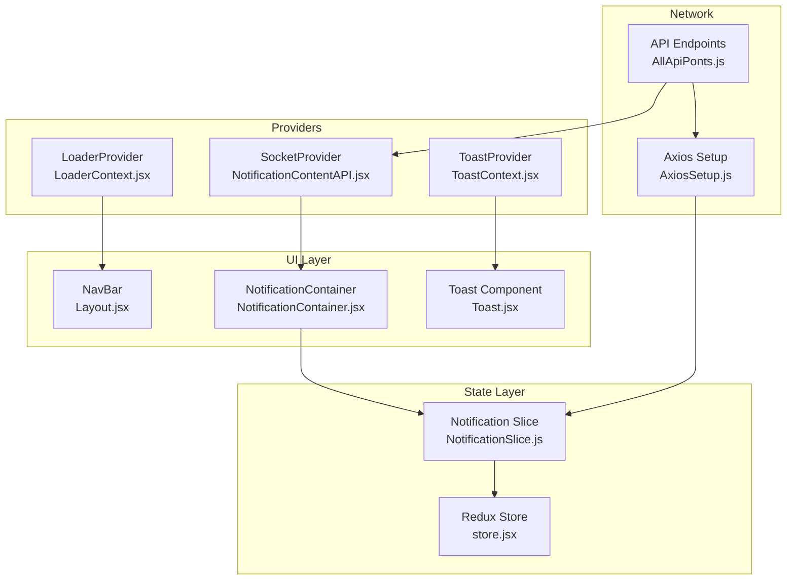

**Diagram sources**
- [App.js](file://frontend/src/App.js#L68-L79)
- [Layout.jsx](file://frontend/src/comoponent/layout/Layout.jsx#L45-L124)
- [NotificationContentAPI.jsx](file://frontend/src/ContextApi/NotificationContentAPI.jsx#L10-L57)
- [ToastContext.jsx](file://frontend/src/ContextApi/ToastContext.jsx#L9-L25)
- [Toast.jsx](file://frontend/src/comoponent/toaster/toast/toast.jsx#L7-L71)
- [LoaderContext.jsx](file://frontend/src/ContextApi/LoaderContext.jsx#L5-L16)
- [NotificationContainer.jsx](file://frontend/src/comoponent/navBar/NotificationContainer.jsx#L15-L112)
- [NotificationSlice.js](file://frontend/src/appRedux/redux/notificationSlice/NotificationSlice.js#L71-L127)
- [store.jsx](file://frontend/src/appRedux/store.jsx#L38-L57)
- [AxiosSetup.js](file://frontend/src/axiosInterceptors/AxiosSetup.js#L110-L213)
- [AllApiPonts.js](file://frontend/src/APIPoints/AllApiPonts.js#L1-L3)

**Section sources**
- [App.js](file://frontend/src/App.js#L68-L79)
- [Layout.jsx](file://frontend/src/comoponent/layout/Layout.jsx#L45-L124)
- [NotificationContentAPI.jsx](file://frontend/src/ContextApi/NotificationContentAPI.jsx#L10-L57)
- [ToastContext.jsx](file://frontend/src/ContextApi/ToastContext.jsx#L9-L25)
- [Toast.jsx](file://frontend/src/comoponent/toaster/toast/toast.jsx#L7-L71)
- [LoaderContext.jsx](file://frontend/src/ContextApi/LoaderContext.jsx#L5-L16)
- [NotificationContainer.jsx](file://frontend/src/comoponent/navBar/NotificationContainer.jsx#L15-L112)
- [NotificationSlice.js](file://frontend/src/appRedux/redux/notificationSlice/NotificationSlice.js#L71-L127)
- [store.jsx](file://frontend/src/appRedux/store.jsx#L38-L57)
- [AxiosSetup.js](file://frontend/src/axiosInterceptors/AxiosSetup.js#L110-L213)
- [AllApiPonts.js](file://frontend/src/APIPoints/AllApiPonts.js#L1-L3)

## Core Components
- Socket.IO Provider and Context
  - Establishes WebSocket connection, registers users/admins, listens for live notifications, and exposes notifications to consumers.
  - See [NotificationContentAPI.jsx](file://frontend/src/ContextApi/NotificationContentAPI.jsx#L10-L57).
- Toast Context and Toast Component
  - Provides a global toast service and renders persistent toasts with auto-dismiss.
  - See [ToastContext.jsx](file://frontend/src/ContextApi/ToastContext.jsx#L9-L25), [Toast.jsx](file://frontend/src/comoponent/toaster/toast/toast.jsx#L7-L71), [showToast.jsx](file://frontend/src/comoponent/toaster/showToast/showToast.jsx#L1-L26).
- Loader Context
  - Centralized loading state management via a simple counter with show/hide helpers.
  - See [LoaderContext.jsx](file://frontend/src/ContextApi/LoaderContext.jsx#L5-L16).
- Notification Container
  - Displays live notifications from Socket.IO and persisted notifications from Redux; handles per-notification read actions and error-toasting.
  - See [NotificationContainer.jsx](file://frontend/src/comoponent/navBar/NotificationContainer.jsx#L15-L112).
- Redux Notification Slice
  - Manages fetching, marking read, and error handling for notifications; integrates with persisted store.
  - See [NotificationSlice.js](file://frontend/src/appRedux/redux/notificationSlice/NotificationSlice.js#L71-L127), [store.jsx](file://frontend/src/appRedux/store.jsx#L38-L57).
- Application Bootstrap
  - Wraps the app with providers and orchestrates loader visibility based on Redux state.
  - See [App.js](file://frontend/src/App.js#L68-L79).

**Section sources**
- [NotificationContentAPI.jsx](file://frontend/src/ContextApi/NotificationContentAPI.jsx#L10-L57)
- [ToastContext.jsx](file://frontend/src/ContextApi/ToastContext.jsx#L9-L25)
- [Toast.jsx](file://frontend/src/comoponent/toaster/toast/toast.jsx#L7-L71)
- [showToast.jsx](file://frontend/src/comoponent/toaster/showToast/showToast.jsx#L1-L26)
- [LoaderContext.jsx](file://frontend/src/ContextApi/LoaderContext.jsx#L5-L16)
- [NotificationContainer.jsx](file://frontend/src/comoponent/navBar/NotificationContainer.jsx#L15-L112)
- [NotificationSlice.js](file://frontend/src/appRedux/redux/notificationSlice/NotificationSlice.js#L71-L127)
- [store.jsx](file://frontend/src/appRedux/store.jsx#L38-L57)
- [App.js](file://frontend/src/App.js#L68-L79)

## Architecture Overview
The system combines real-time updates via Socket.IO with persisted state via Redux. Providers are mounted at the top level to share state across the app.

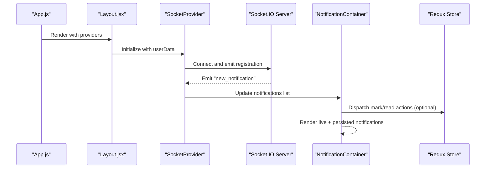

**Diagram sources**
- [App.js](file://frontend/src/App.js#L68-L79)
- [Layout.jsx](file://frontend/src/comoponent/layout/Layout.jsx#L45-L124)
- [NotificationContentAPI.jsx](file://frontend/src/ContextApi/NotificationContentAPI.jsx#L15-L51)
- [NotificationContainer.jsx](file://frontend/src/comoponent/navBar/NotificationContainer.jsx#L15-L112)
- [NotificationSlice.js](file://frontend/src/appRedux/redux/notificationSlice/NotificationSlice.js#L71-L127)

## Detailed Component Analysis

### Socket.IO Integration and Live Updates
- Connection lifecycle
  - Creates a Socket.IO client with WebSocket transport and limited reconnection attempts.
  - Registers either admin or user rooms upon connect using user data.
- Event handling
  - Listens for "new_notification" and prepends incoming notifications to the live list.
  - Disconnect events are logged; cleanup disconnects the socket on unmount.
- Provider consumption
  - Exposes notifications and setters to child components via context.

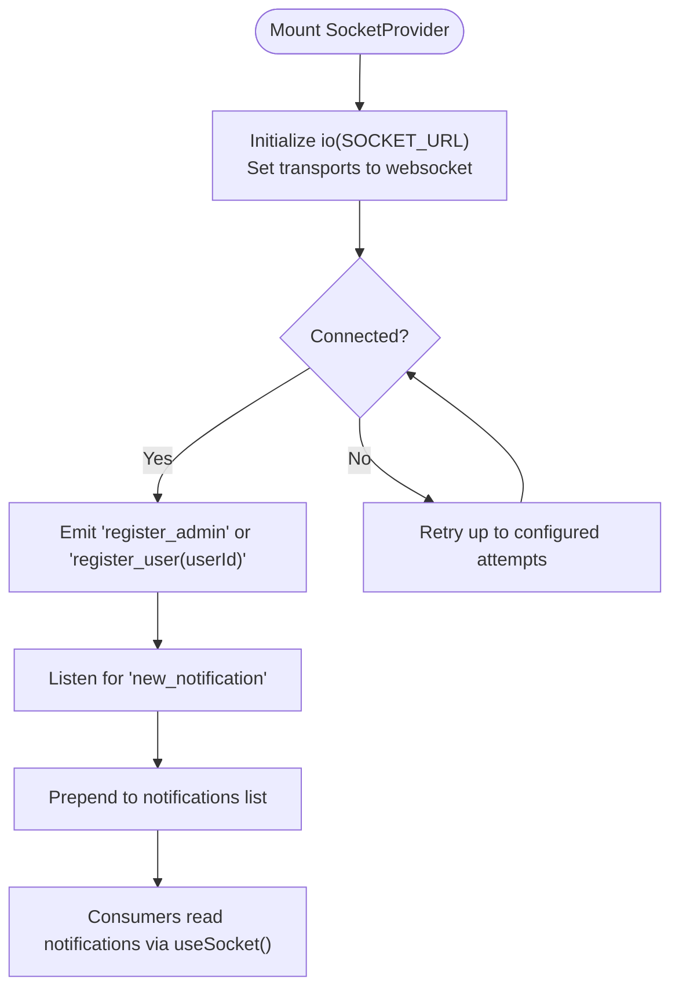

**Diagram sources**
- [NotificationContentAPI.jsx](file://frontend/src/ContextApi/NotificationContentAPI.jsx#L15-L51)

**Section sources**
- [NotificationContentAPI.jsx](file://frontend/src/ContextApi/NotificationContentAPI.jsx#L10-L57)
- [AllApiPonts.js](file://frontend/src/APIPoints/AllApiPonts.js#L1-L3)

### Context API: Toast and Loader Management
- ToastProvider
  - Maintains a list of toasts and exposes a helper to enqueue new toasts.
  - Always mounts the Toast component to render toasts at a fixed position.
- Toast Component
  - Renders toasts with auto-dismiss timers and manual close buttons.
- LoaderProvider
  - Tracks a numeric loading counter; show/hide adjust the counter safely.
- LoaderHandler
  - Global reference updated by LoaderProvider to coordinate with Axios interceptors.

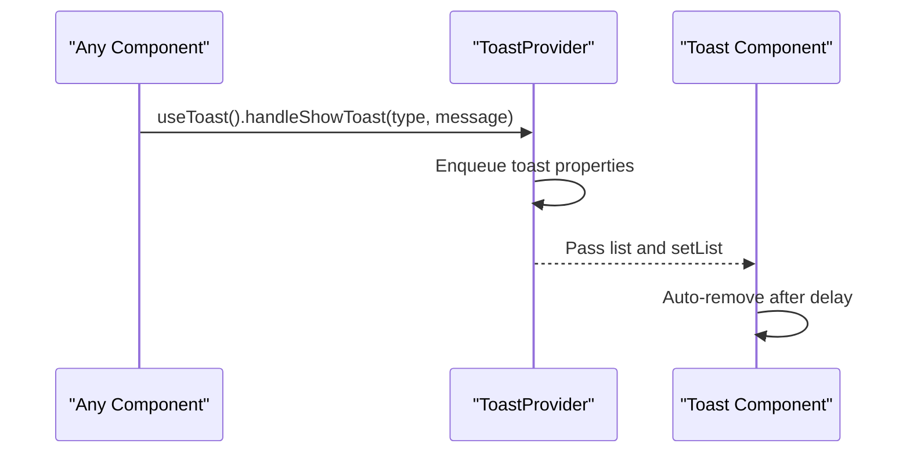

**Diagram sources**
- [ToastContext.jsx](file://frontend/src/ContextApi/ToastContext.jsx#L9-L25)
- [Toast.jsx](file://frontend/src/comoponent/toaster/toast/toast.jsx#L7-L71)
- [showToast.jsx](file://frontend/src/comoponent/toaster/showToast/showToast.jsx#L1-L26)

**Section sources**
- [ToastContext.jsx](file://frontend/src/ContextApi/ToastContext.jsx#L9-L25)
- [Toast.jsx](file://frontend/src/comoponent/toaster/toast/toast.jsx#L7-L71)
- [showToast.jsx](file://frontend/src/comoponent/toaster/showToast/showToast.jsx#L1-L26)
- [LoaderContext.jsx](file://frontend/src/ContextApi/LoaderContext.jsx#L5-L16)
- [LoaderHandler.js](file://frontend/src/ContextApi/LoaderHandler.js#L1-L6)

### Notification Handling Architecture
- Live vs persisted notifications
  - Live notifications arrive via Socket.IO and are shown immediately.
  - Persisted notifications are fetched via Redux and displayed alongside live ones.
- Error propagation
  - Errors from Redux actions trigger toast notifications and clear the error state.
- Per-notification read actions
  - Clicking a persisted notification triggers a Redux thunk to mark it read and update counts.

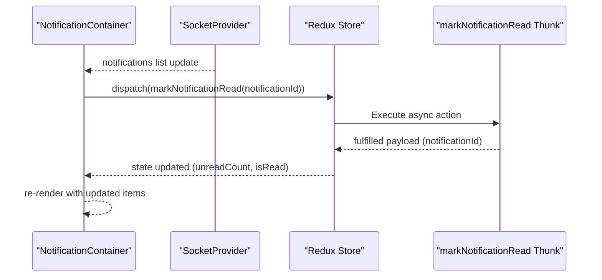

**Diagram sources**
- [NotificationContainer.jsx](file://frontend/src/comoponent/navBar/NotificationContainer.jsx#L15-L112)
- [NotificationContentAPI.jsx](file://frontend/src/ContextApi/NotificationContentAPI.jsx#L37-L40)
- [NotificationSlice.js](file://frontend/src/appRedux/redux/notificationSlice/NotificationSlice.js#L24-L40)

**Section sources**
- [NotificationContainer.jsx](file://frontend/src/comoponent/navBar/NotificationContainer.jsx#L15-L112)
- [NotificationSlice.js](file://frontend/src/appRedux/redux/notificationSlice/NotificationSlice.js#L71-L127)

### Redux Store and Notification Slice
- Store configuration
  - Configures reducers and persistence for selected slices; notification slice is included.
- Notification slice
  - Async thunks for fetching and marking notifications read.
  - Reducers manage loading, errors, unread counts, and success flags.
  - Common matcher handles rejected actions globally.

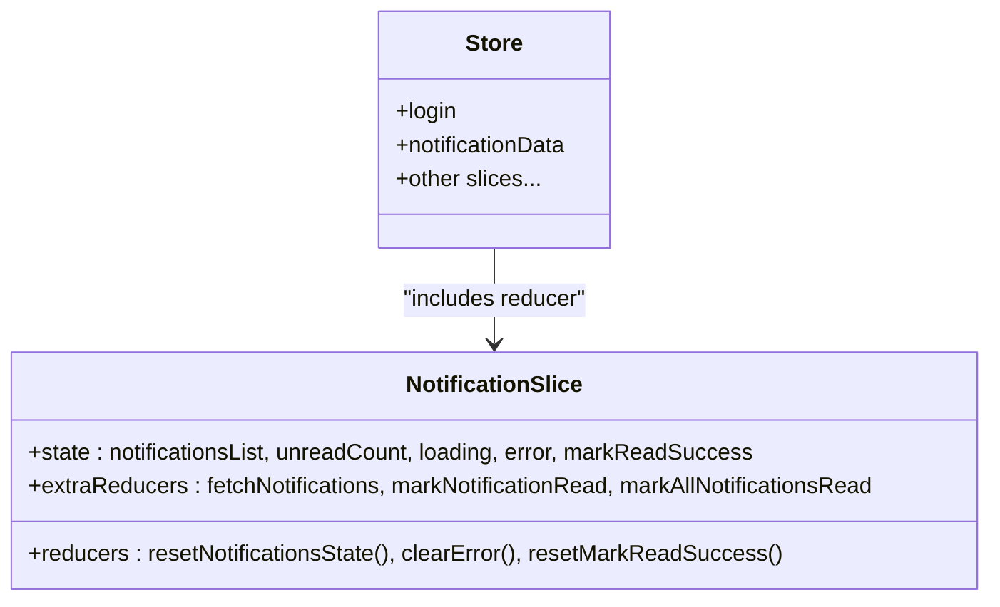

**Diagram sources**
- [NotificationSlice.js](file://frontend/src/appRedux/redux/notificationSlice/NotificationSlice.js#L71-L127)
- [store.jsx](file://frontend/src/appRedux/store.jsx#L38-L57)

**Section sources**
- [store.jsx](file://frontend/src/appRedux/store.jsx#L38-L57)
- [NotificationSlice.js](file://frontend/src/appRedux/redux/notificationSlice/NotificationSlice.js#L71-L127)

### Provider Setup and Component Subscription Patterns
- App-level providers
  - ToastProvider and LoaderProvider wrap the entire app; LoaderBridge subscribes to Redux loading flags and toggles loader accordingly.
- SocketProvider placement
  - Mounted inside Layout and receives user data from Redux to register the correct room.
- Consumer usage
  - NotificationContainer consumes both live notifications from Socket.IO and persisted notifications from Redux.

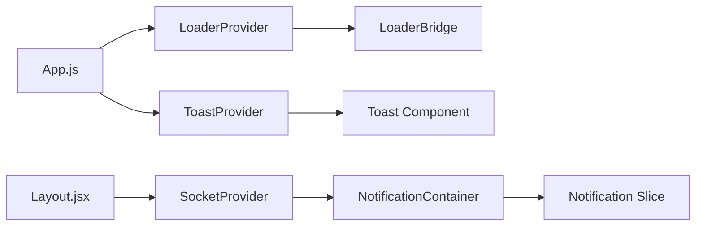

**Diagram sources**
- [App.js](file://frontend/src/App.js#L68-L79)
- [Layout.jsx](file://frontend/src/comoponent/layout/Layout.jsx#L45-L124)
- [NotificationContainer.jsx](file://frontend/src/comoponent/navBar/NotificationContainer.jsx#L15-L112)
- [NotificationContentAPI.jsx](file://frontend/src/ContextApi/NotificationContentAPI.jsx#L10-L57)

**Section sources**
- [App.js](file://frontend/src/App.js#L68-L79)
- [Layout.jsx](file://frontend/src/comoponent/layout/Layout.jsx#L45-L124)
- [NotificationContainer.jsx](file://frontend/src/comoponent/navBar/NotificationContainer.jsx#L15-L112)

### Notification Template Rendering and User Preference Handling
- Live notification display
  - Incoming notifications are prepended to the live list and rendered with read indicators and timestamps.
- Timestamp utility
  - Relative time calculation for display.
- User preference handling
  - Read/unread state is persisted via Redux; clicking a notification marks it read and updates unread counts.

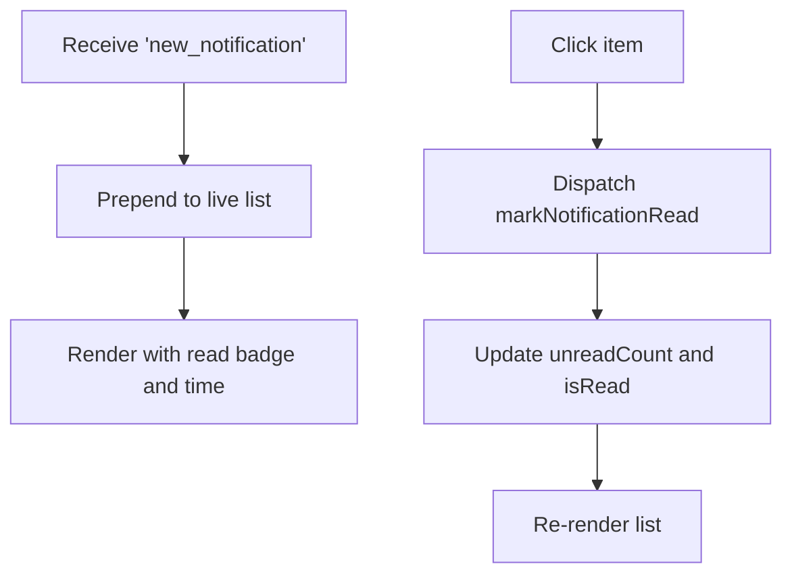

**Diagram sources**
- [NotificationContentAPI.jsx](file://frontend/src/ContextApi/NotificationContentAPI.jsx#L37-L40)
- [NotificationContainer.jsx](file://frontend/src/comoponent/navBar/NotificationContainer.jsx#L15-L112)
- [NotificationSlice.js](file://frontend/src/appRedux/redux/notificationSlice/NotificationSlice.js#L98-L108)
- [getTimeDifference.jsx](file://frontend/src/utils/getTimeDifference.jsx#L3-L24)

**Section sources**
- [NotificationContentAPI.jsx](file://frontend/src/ContextApi/NotificationContentAPI.jsx#L37-L40)
- [NotificationContainer.jsx](file://frontend/src/comoponent/navBar/NotificationContainer.jsx#L15-L112)
- [NotificationSlice.js](file://frontend/src/appRedux/redux/notificationSlice/NotificationSlice.js#L98-L108)
- [getTimeDifference.jsx](file://frontend/src/utils/getTimeDifference.jsx#L3-L24)

### Real-time Data Synchronization Patterns and State Updates
- Live updates
  - Socket.IO emits "new_notification"; provider updates local state; consumers re-render instantly.
- Persistence
  - Redux fetches persisted notifications; reducers update lists and unread counts.
- Action-driven updates
  - Mark-read actions update both live and persisted lists consistently.

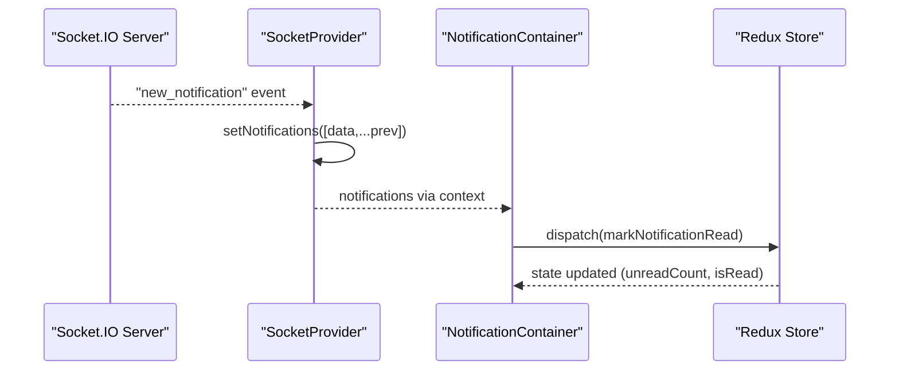

**Diagram sources**
- [NotificationContentAPI.jsx](file://frontend/src/ContextApi/NotificationContentAPI.jsx#L37-L40)
- [NotificationContainer.jsx](file://frontend/src/comoponent/navBar/NotificationContainer.jsx#L15-L112)
- [NotificationSlice.js](file://frontend/src/appRedux/redux/notificationSlice/NotificationSlice.js#L98-L108)

**Section sources**
- [NotificationContentAPI.jsx](file://frontend/src/ContextApi/NotificationContentAPI.jsx#L37-L40)
- [NotificationContainer.jsx](file://frontend/src/comoponent/navBar/NotificationContainer.jsx#L15-L112)
- [NotificationSlice.js](file://frontend/src/appRedux/redux/notificationSlice/NotificationSlice.js#L98-L108)

### Error Handling, Reconnection Strategies, and Fallback Mechanisms
- Socket.IO reconnection
  - Configured with limited attempts and WebSocket transport for reliability.
- Error propagation to UI
  - Redux rejected actions set error state; NotificationContainer displays toasts and clears errors.
- Token refresh and loader coordination
  - Axios interceptors coordinate token refresh and loader visibility; loader handler is updated by the LoaderProvider.

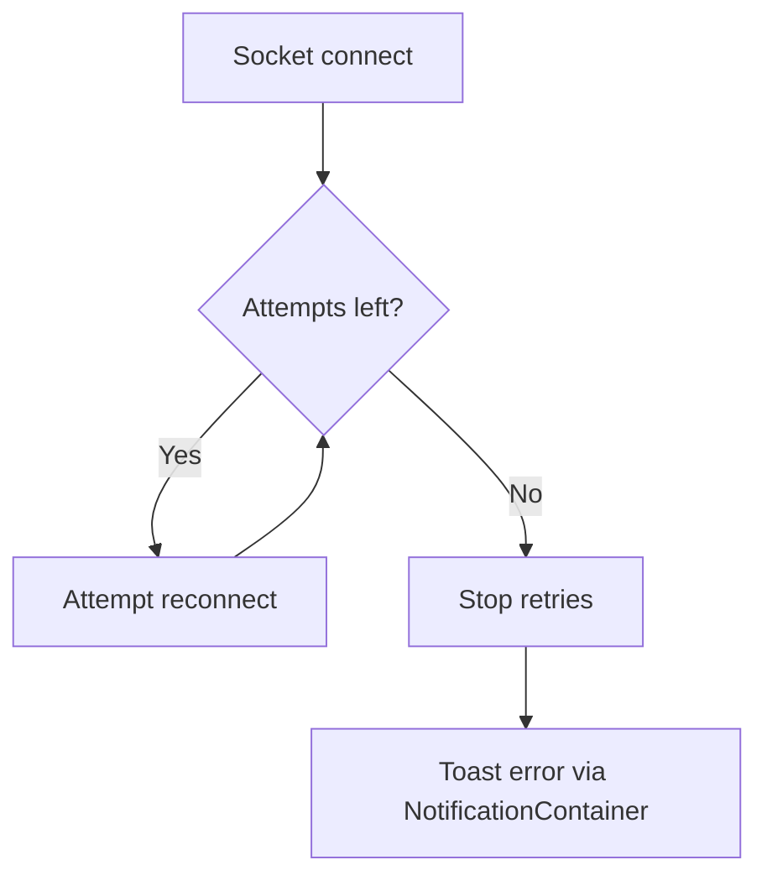

**Diagram sources**
- [NotificationContentAPI.jsx](file://frontend/src/ContextApi/NotificationContentAPI.jsx#L17-L20)
- [NotificationContainer.jsx](file://frontend/src/comoponent/navBar/NotificationContainer.jsx#L20-L25)
- [AxiosSetup.js](file://frontend/src/axiosInterceptors/AxiosSetup.js#L146-L210)
- [LoaderHandler.js](file://frontend/src/ContextApi/LoaderHandler.js#L1-L6)

**Section sources**
- [NotificationContentAPI.jsx](file://frontend/src/ContextApi/NotificationContentAPI.jsx#L17-L20)
- [NotificationContainer.jsx](file://frontend/src/comoponent/navBar/NotificationContainer.jsx#L20-L25)
- [AxiosSetup.js](file://frontend/src/axiosInterceptors/AxiosSetup.js#L146-L210)
- [LoaderHandler.js](file://frontend/src/ContextApi/LoaderHandler.js#L1-L6)

## Dependency Analysis
- Provider hierarchy
  - App wraps providers; Layout mounts SocketProvider with user data; consumers use hooks to access context.
- Redux integration
  - NotificationContainer dispatches actions that update the persisted notification state.
- Network dependencies
  - Socket.IO URL and HTTP API base URL are externalized via environment variables.

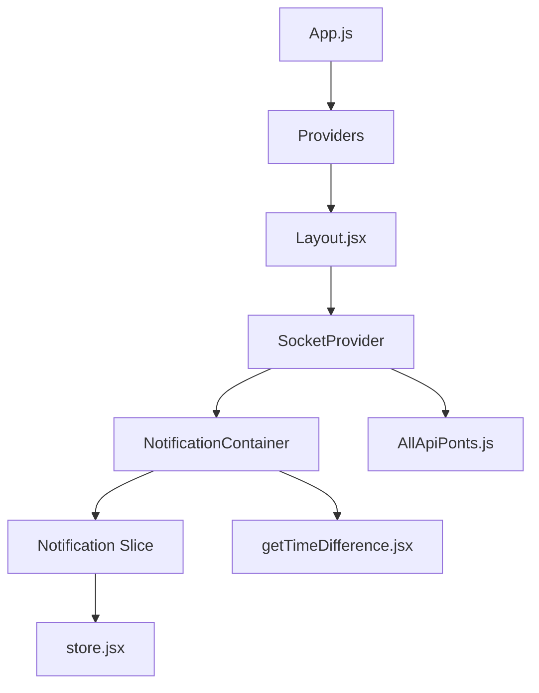

**Diagram sources**
- [App.js](file://frontend/src/App.js#L68-L79)
- [Layout.jsx](file://frontend/src/comoponent/layout/Layout.jsx#L45-L124)
- [NotificationContentAPI.jsx](file://frontend/src/ContextApi/NotificationContentAPI.jsx#L7)
- [NotificationContainer.jsx](file://frontend/src/comoponent/navBar/NotificationContainer.jsx#L15-L112)
- [NotificationSlice.js](file://frontend/src/appRedux/redux/notificationSlice/NotificationSlice.js#L71-L127)
- [store.jsx](file://frontend/src/appRedux/store.jsx#L38-L57)
- [AllApiPonts.js](file://frontend/src/APIPoints/AllApiPonts.js#L1-L3)
- [getTimeDifference.jsx](file://frontend/src/utils/getTimeDifference.jsx#L3-L24)

**Section sources**
- [App.js](file://frontend/src/App.js#L68-L79)
- [Layout.jsx](file://frontend/src/comoponent/layout/Layout.jsx#L45-L124)
- [NotificationContentAPI.jsx](file://frontend/src/ContextApi/NotificationContentAPI.jsx#L7)
- [NotificationContainer.jsx](file://frontend/src/comoponent/navBar/NotificationContainer.jsx#L15-L112)
- [NotificationSlice.js](file://frontend/src/appRedux/redux/notificationSlice/NotificationSlice.js#L71-L127)
- [store.jsx](file://frontend/src/appRedux/store.jsx#L38-L57)
- [AllApiPonts.js](file://frontend/src/APIPoints/AllApiPonts.js#L1-L3)
- [getTimeDifference.jsx](file://frontend/src/utils/getTimeDifference.jsx#L3-L24)

## Performance Considerations
- Minimizing re-renders
  - Keep the notifications list immutable and use efficient array prepend for live updates.
- Toast lifecycle
  - Auto-dismiss timers remove toasts efficiently; avoid excessive concurrent toasts to prevent stacking.
- Loader management
  - Use a single counter to avoid redundant loader renders; batch related operations to reduce flicker.
- Socket transport
  - Prefer WebSocket transport and limit reconnection attempts to balance resilience and resource usage.
- Redux updates
  - Normalize notification IDs and update only changed fields to reduce selector work.
- Memory management
  - Clear timeouts and disconnect sockets on unmount; avoid retaining stale references in timers or listeners.

## Troubleshooting Guide
- Socket connection fails
  - Verify environment variables for the Socket.IO URL and network accessibility.
  - Check reconnection attempts and transport settings.
- Notifications not appearing
  - Confirm user/admin registration events are emitted after connect.
  - Ensure the consumer is subscribed via the Socket context hook.
- Toasts not visible
  - Confirm ToastProvider is mounted at the top level and always renders the Toast component.
- Loader not showing
  - Ensure LoaderBridge subscribes to Redux loading flags and that loader handler is updated by the provider.
- Token refresh errors
  - Inspect Axios interceptors for proper error handling and redirection logic.

**Section sources**
- [NotificationContentAPI.jsx](file://frontend/src/ContextApi/NotificationContentAPI.jsx#L17-L20)
- [ToastContext.jsx](file://frontend/src/ContextApi/ToastContext.jsx#L21-L23)
- [LoaderContext.jsx](file://frontend/src/ContextApi/LoaderContext.jsx#L8-L9)
- [AxiosSetup.js](file://frontend/src/axiosInterceptors/AxiosSetup.js#L146-L210)

## Conclusion
The frontend real-time communication system integrates Socket.IO for live updates with Redux for persisted state and Context APIs for global UI concerns. The design emphasizes:
- Immediate live feedback via Socket.IO
- Reliable persisted state via Redux
- Centralized UI services for toasts and loaders
- Robust provider setup and consumer patterns
- Practical error handling and performance-conscious updates