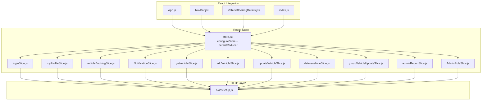
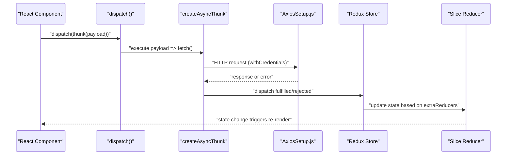
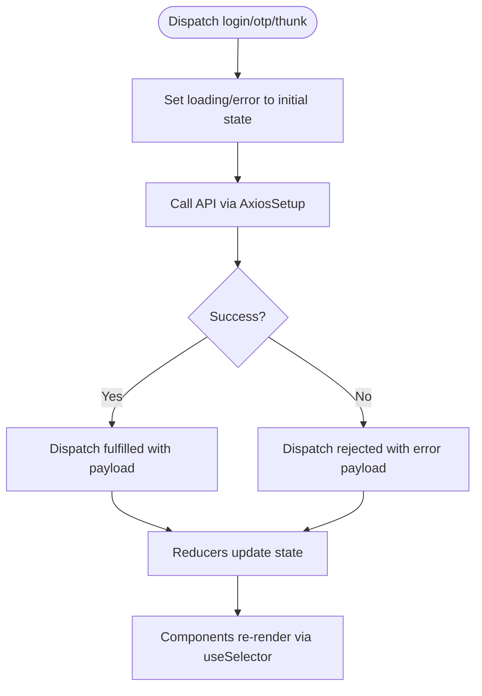
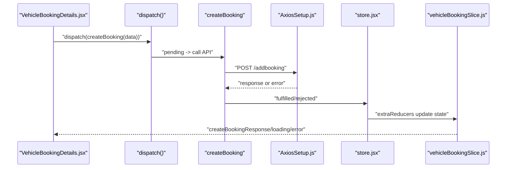
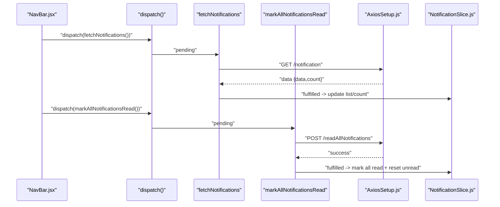
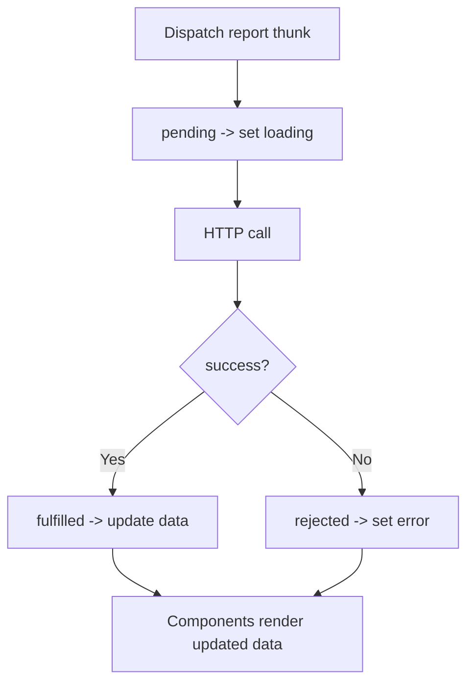
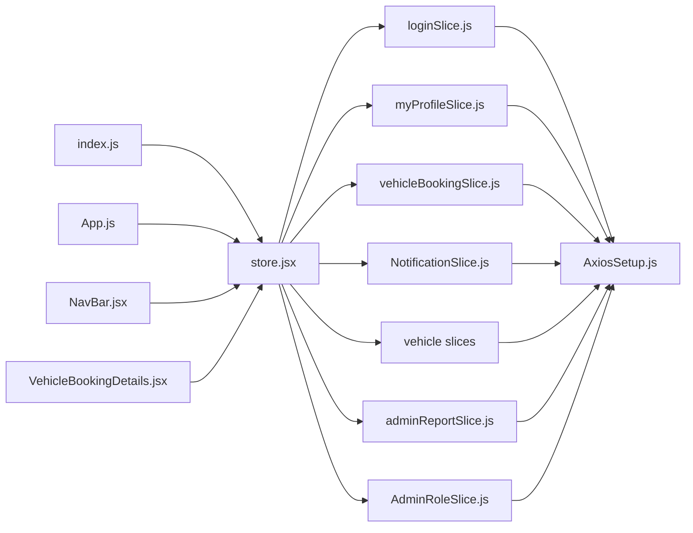

# Redux State Management

<cite>
**Referenced Files in This Document**
- [store.jsx](file://frontend/src/appRedux/store.jsx)
- [loginSlice.js](file://frontend/src/appRedux/redux/authSlice/loginSlice.js)
- [myProfileSlice.js](file://frontend/src/appRedux/redux/authSlice/myProfileSlice.js)
- [vehicleBookingSlice.js](file://frontend/src/appRedux/redux/bookingSlice/vehicleBookingSlice.js)
- [NotificationSlice.js](file://frontend/src/appRedux/redux/notificationSlice/NotificationSlice.js)
- [addVehicleSlice.js](file://frontend/src/appRedux/redux/vehicleSlice/addVehicleSlice.js)
- [getvehicleSlice.js](file://frontend/src/appRedux/redux/vehicleSlice/getvehicleSlice.js)
- [updateVehicleSlice.js](file://frontend/src/appRedux/redux/vehicleSlice/updateVehicleSlice.js)
- [deletevehicleSlice.js](file://frontend/src/appRedux/redux/vehicleSlice/deletevehicleSlice.js)
- [groupVehicleUpdateSlice.js](file://frontend/src/appRedux/redux/vehicleSlice/groupVehicleUpdateSlice.js)
- [adminReportSlice.js](file://frontend/src/appRedux/redux/reportSlice/adminReportSlice.js)
- [AdminRoleSlice.js](file://frontend/src/appRedux/redux/adminSlice/AdminRoleSlice.js)
- [AxiosSetup.js](file://frontend/src/axiosInterceptors/AxiosSetup.js)
- [App.js](file://frontend/src/App.js)
- [NavBar.jsx](file://frontend/src/comoponent/navBar/NavBar.jsx)
- [VehicleBookingDetails.jsx](file://frontend/src/pages/VehicleBookingPage/VehicleBookingDetails.jsx)
- [index.js](file://frontend/src/index.js)
</cite>

## Table of Contents
1. [Introduction](#introduction)
2. [Project Structure](#project-structure)
3. [Core Components](#core-components)
4. [Architecture Overview](#architecture-overview)
5. [Detailed Component Analysis](#detailed-component-analysis)
6. [Dependency Analysis](#dependency-analysis)
7. [Performance Considerations](#performance-considerations)
8. [Troubleshooting Guide](#troubleshooting-guide)
9. [Conclusion](#conclusion)
10. [Appendices](#appendices)

## Introduction
This document explains the Redux Toolkit state management system used in the vehicle management application. It covers store configuration, slice architecture, async thunk patterns, and integration with React components. It also documents state normalization, selectors, persistence strategies, error handling, loading states, optimistic updates, middleware usage, debugging, and performance optimization. Practical examples are linked to concrete source files for traceability.

## Project Structure
The Redux implementation resides under frontend/src/appRedux and is composed of:
- A central store configured with Redux Persist for selective persistence
- Feature slices for authentication, user profile, vehicle operations, booking management, notifications, admin reports, and admin role handling
- An Axios client with interceptors for authentication and token refresh

**Diagram sources**
- [store.jsx](file://frontend/src/appRedux/store.jsx#L38-L61)
- [loginSlice.js](file://frontend/src/appRedux/redux/authSlice/loginSlice.js#L92-L212)
- [myProfileSlice.js](file://frontend/src/appRedux/redux/authSlice/myProfileSlice.js#L82-L201)
- [vehicleBookingSlice.js](file://frontend/src/appRedux/redux/bookingSlice/vehicleBookingSlice.js#L83-L203)
- [NotificationSlice.js](file://frontend/src/appRedux/redux/notificationSlice/NotificationSlice.js#L71-L134)
- [getvehicleSlice.js](file://frontend/src/appRedux/redux/vehicleSlice/getvehicleSlice.js#L19-L52)
- [addVehicleSlice.js](file://frontend/src/appRedux/redux/vehicleSlice/addVehicleSlice.js#L19-L52)
- [updateVehicleSlice.js](file://frontend/src/appRedux/redux/vehicleSlice/updateVehicleSlice.js#L19-L53)
- [deletevehicleSlice.js](file://frontend/src/appRedux/redux/vehicleSlice/deletevehicleSlice.js#L19-L52)
- [groupVehicleUpdateSlice.js](file://frontend/src/appRedux/redux/vehicleSlice/groupVehicleUpdateSlice.js#L22-L55)
- [adminReportSlice.js](file://frontend/src/appRedux/redux/reportSlice/adminReportSlice.js#L133-L233)
- [AdminRoleSlice.js](file://frontend/src/appRedux/redux/adminSlice/AdminRoleSlice.js#L41-L106)
- [AxiosSetup.js](file://frontend/src/axiosInterceptors/AxiosSetup.js#L110-L214)
- [App.js](file://frontend/src/App.js#L1-L78)
- [NavBar.jsx](file://frontend/src/comoponent/navBar/NavBar.jsx#L1-L252)
- [VehicleBookingDetails.jsx](file://frontend/src/pages/VehicleBookingPage/VehicleBookingDetails.jsx#L1-L372)
- [index.js](file://frontend/src/index.js#L1-L17)

**Section sources**
- [store.jsx](file://frontend/src/appRedux/store.jsx#L1-L62)
- [index.js](file://frontend/src/index.js#L1-L17)

## Core Components
- Store configuration with Redux Toolkit and Redux Persist
  - Centralized store creation with per-slice reducers
  - Persist configuration for the login slice with a blacklist of transient fields
  - Serializable checks disabled for persistence lifecycle actions
- Slice architecture
  - Each slice encapsulates state, reducers, and async thunks for a domain
  - Async thunks use createAsyncThunk and standard pending/fulfilled/rejected transitions
  - Reset helpers are provided to clear transient state
- HTTP integration
  - Axios client configured with credentials and interceptors for token refresh and loader handling

Key implementation references:
- Store and persistence: [store.jsx](file://frontend/src/appRedux/store.jsx#L28-L61)
- Axios client and interceptors: [AxiosSetup.js](file://frontend/src/axiosInterceptors/AxiosSetup.js#L110-L214)

**Section sources**
- [store.jsx](file://frontend/src/appRedux/store.jsx#L28-L61)
- [AxiosSetup.js](file://frontend/src/axiosInterceptors/AxiosSetup.js#L110-L214)

## Architecture Overview
The Redux architecture follows a unidirectional data flow:
- React components dispatch async thunks or actions
- Async thunks perform HTTP requests via the Axios client
- On fulfillment, reducers update normalized state
- Components subscribe to state via useSelector and re-render

**Diagram sources**
- [loginSlice.js](file://frontend/src/appRedux/redux/authSlice/loginSlice.js#L5-L90)
- [vehicleBookingSlice.js](file://frontend/src/appRedux/redux/bookingSlice/vehicleBookingSlice.js#L24-L78)
- [AxiosSetup.js](file://frontend/src/axiosInterceptors/AxiosSetup.js#L110-L214)
- [store.jsx](file://frontend/src/appRedux/store.jsx#L38-L61)

## Detailed Component Analysis

### Authentication Slices
- loginSlice
  - Async thunks: loginUser, checkAuth, sendOtpToEmail, logoutUser, verifyOtpAndLogin
  - Transient loaders: loading, otpLoading, logoutLoading
  - Auth state: user, response, error, otpResponse, otpError
  - Reset helpers: resetLoginState, setUser, clearUser
  - Extra reducers handle pending/fulfilled/rejected transitions for each thunk
- myProfileSlice
  - Async thunks: fetchUserProfileInfo, updateProfileDetails, uploadDrivingLicenceImage, verifyDrivingLicenceDocument
  - Dedicated state branches for each operation with loading/error/response fields
  - Reset helpers for each branch

Practical examples:
- Dispatching login and handling response: [loginSlice.js](file://frontend/src/appRedux/redux/authSlice/loginSlice.js#L5-L90)
- Fetching and updating profile: [myProfileSlice.js](file://frontend/src/appRedux/redux/authSlice/myProfileSlice.js#L8-L76)

**Diagram sources**
- [loginSlice.js](file://frontend/src/appRedux/redux/authSlice/loginSlice.js#L127-L208)
- [myProfileSlice.js](file://frontend/src/appRedux/redux/authSlice/myProfileSlice.js#L133-L190)

**Section sources**
- [loginSlice.js](file://frontend/src/appRedux/redux/authSlice/loginSlice.js#L5-L213)
- [myProfileSlice.js](file://frontend/src/appRedux/redux/authSlice/myProfileSlice.js#L8-L201)

### Booking Management
- vehicleBookingSlice
  - Async thunks: getBookingListData, createBooking, updateBookingData, CompletedRideBookingData
  - State: bookingListData, create/update responses, and loading/error flags
  - Reset helpers: resetBookingState, resetCreateBookingState, resetUpdateBookingState, resetUpdateCompleteBookingState
- Integration example
  - Vehicle booking page dispatches createBooking and navigates on success: [VehicleBookingDetails.jsx](file://frontend/src/pages/VehicleBookingPage/VehicleBookingDetails.jsx#L116-L144)

**Diagram sources**
- [vehicleBookingSlice.js](file://frontend/src/appRedux/redux/bookingSlice/vehicleBookingSlice.js#L24-L78)
- [VehicleBookingDetails.jsx](file://frontend/src/pages/VehicleBookingPage/VehicleBookingDetails.jsx#L116-L144)
- [AxiosSetup.js](file://frontend/src/axiosInterceptors/AxiosSetup.js#L110-L214)
- [store.jsx](file://frontend/src/appRedux/store.jsx#L38-L61)

**Section sources**
- [vehicleBookingSlice.js](file://frontend/src/appRedux/redux/bookingSlice/vehicleBookingSlice.js#L7-L203)
- [VehicleBookingDetails.jsx](file://frontend/src/pages/VehicleBookingPage/VehicleBookingDetails.jsx#L116-L144)

### Vehicle Operations
- getvehicleSlice: fetches vehicle list
- addVehicleSlice: creates a new vehicle
- updateVehicleSlice: updates a single vehicle
- deletevehicleSlice: deletes a vehicle
- groupVehicleUpdateSlice: bulk update vehicles by group
- Each slice follows the same pattern: async thunk, state fields, reset helper, and extraReducers transitions

```mermaid
classDiagram
class VehicleSlice {
+state : vehicleList, loading, error
+reducers : resetVehicleDataState()
+extraReducers : pending/fulfilled/rejected
}
class AddVehicleSlice {
+state : addVehicleResponse, error, loading
+reducers : resetAddVehicleDataState()
}
class UpdateVehicleSlice {
+state : updateVehicleResponse, updateVehicleLoading, updateVehicleError
+reducers : resetUpdateVehicleState()
}
class DeleteVehicleSlice {
+state : deleteResponse, deleteVehicleLoading, deleteVehicleError
+reducers : resetDeleteVehicleState()
}
class GroupVehicleUpdateSlice {
+state : updateVehicleGroupResponse, updateVehicleGroupLoading, updateVehicleGroupError
+reducers : resetUpdateGroupVehicleState()
}
```

**Diagram sources**
- [getvehicleSlice.js](file://frontend/src/appRedux/redux/vehicleSlice/getvehicleSlice.js#L19-L52)
- [addVehicleSlice.js](file://frontend/src/appRedux/redux/vehicleSlice/addVehicleSlice.js#L19-L52)
- [updateVehicleSlice.js](file://frontend/src/appRedux/redux/vehicleSlice/updateVehicleSlice.js#L19-L53)
- [deletevehicleSlice.js](file://frontend/src/appRedux/redux/vehicleSlice/deletevehicleSlice.js#L19-L52)
- [groupVehicleUpdateSlice.js](file://frontend/src/appRedux/redux/vehicleSlice/groupVehicleUpdateSlice.js#L22-L55)

**Section sources**
- [getvehicleSlice.js](file://frontend/src/appRedux/redux/vehicleSlice/getvehicleSlice.js#L4-L52)
- [addVehicleSlice.js](file://frontend/src/appRedux/redux/vehicleSlice/addVehicleSlice.js#L5-L52)
- [updateVehicleSlice.js](file://frontend/src/appRedux/redux/vehicleSlice/updateVehicleSlice.js#L4-L53)
- [deletevehicleSlice.js](file://frontend/src/appRedux/redux/vehicleSlice/deletevehicleSlice.js#L4-L52)
- [groupVehicleUpdateSlice.js](file://frontend/src/appRedux/redux/vehicleSlice/groupVehicleUpdateSlice.js#L3-L55)

### Notification Handling
- NotificationSlice
  - Async thunks: fetchNotifications, markNotificationRead, markAllNotificationsRead
  - State: notificationsList, unreadCount, loading, error, markReadSuccess
  - Optimistic updates: mark read/unread updates are applied immediately; a follow-up fetch refreshes the list
- Integration example
  - NavBar integrates notifications, marks all read, and displays unread count: [NavBar.jsx](file://frontend/src/comoponent/navBar/NavBar.jsx#L78-L105)

**Diagram sources**
- [NotificationSlice.js](file://frontend/src/appRedux/redux/notificationSlice/NotificationSlice.js#L5-L61)
- [NavBar.jsx](file://frontend/src/comoponent/navBar/NavBar.jsx#L78-L105)
- [AxiosSetup.js](file://frontend/src/axiosInterceptors/AxiosSetup.js#L110-L214)

**Section sources**
- [NotificationSlice.js](file://frontend/src/appRedux/redux/notificationSlice/NotificationSlice.js#L4-L134)
- [NavBar.jsx](file://frontend/src/comoponent/navBar/NavBar.jsx#L78-L105)

### Admin Reports and Role Management
- adminReportSlice
  - Async thunks: fetchReportBookingData, fetchAllVehicleListData, fetchAllUserListData, fetchNotAvailableVehicleData, fetchAvailableVehicleData, fetchVehicleTypeCount, fetchAdminBookingMetrics
  - State: lists and metrics plus shared loading/error
  - Reset helper: resetAdminReportState
- AdminRoleSlice
  - Async thunks: fetchDLlistdata, handleDLApproval
  - State: userDlDataList and approval response/error/loading
  - Reset helper: resetfetchDLDataList

**Diagram sources**
- [adminReportSlice.js](file://frontend/src/appRedux/redux/reportSlice/adminReportSlice.js#L12-L229)
- [AdminRoleSlice.js](file://frontend/src/appRedux/redux/adminSlice/AdminRoleSlice.js#L4-L101)

**Section sources**
- [adminReportSlice.js](file://frontend/src/appRedux/redux/reportSlice/adminReportSlice.js#L11-L233)
- [AdminRoleSlice.js](file://frontend/src/appRedux/redux/adminSlice/AdminRoleSlice.js#L4-L106)

## Dependency Analysis
- Store depends on all slice reducers and persists only the login slice
- Slices depend on the Axios client for HTTP operations
- React components depend on Redux hooks and dispatch thunks/actions
- Interceptors manage token refresh and loader visibility across requests

**Diagram sources**
- [index.js](file://frontend/src/index.js#L6-L16)
- [store.jsx](file://frontend/src/appRedux/store.jsx#L38-L61)
- [AxiosSetup.js](file://frontend/src/axiosInterceptors/AxiosSetup.js#L110-L214)
- [App.js](file://frontend/src/App.js#L1-L78)
- [NavBar.jsx](file://frontend/src/comoponent/navBar/NavBar.jsx#L1-L252)
- [VehicleBookingDetails.jsx](file://frontend/src/pages/VehicleBookingPage/VehicleBookingDetails.jsx#L1-L372)

**Section sources**
- [store.jsx](file://frontend/src/appRedux/store.jsx#L38-L61)
- [AxiosSetup.js](file://frontend/src/axiosInterceptors/AxiosSetup.js#L110-L214)
- [index.js](file://frontend/src/index.js#L6-L16)

## Performance Considerations
- Prefer normalized state shapes to minimize re-renders and simplify updates
- Use reset helpers to clear transient state and avoid memory leaks
- Debounce or batch UI-triggered thunks when appropriate
- Keep persisted slices minimal (already done for login)
- Use memoization in selectors for derived data
- Avoid unnecessary deep equality checks in components

[No sources needed since this section provides general guidance]

## Troubleshooting Guide
Common issues and resolutions:
- Token refresh failures
  - The Axios interceptor handles 401 responses by attempting a refresh and purging persisted login on failure
  - Ensure the backend refresh endpoint is reachable and credentials are enabled
  - Reference: [AxiosSetup.js](file://frontend/src/axiosInterceptors/AxiosSetup.js#L141-L211)
- Loading indicators not appearing
  - The App component aggregates loading flags from multiple slices and toggles a global loader
  - Verify that loading flags are properly set in slices
  - Reference: [App.js](file://frontend/src/App.js#L19-L50)
- Notifications not updating
  - After marking notifications read, trigger a refetch to refresh the list
  - Reference: [NavBar.jsx](file://frontend/src/comoponent/navBar/NavBar.jsx#L96-L101)
- Logout does not clear persisted state
  - The NavBar explicitly purges persisted storage on logout
  - Reference: [NavBar.jsx](file://frontend/src/comoponent/navBar/NavBar.jsx#L36-L39)

**Section sources**
- [AxiosSetup.js](file://frontend/src/axiosInterceptors/AxiosSetup.js#L141-L211)
- [App.js](file://frontend/src/App.js#L19-L50)
- [NavBar.jsx](file://frontend/src/comoponent/navBar/NavBar.jsx#L36-L39)
- [NavBar.jsx](file://frontend/src/comoponent/navBar/NavBar.jsx#L96-L101)

## Conclusion
The Redux Toolkit implementation organizes state by domain slices, leverages async thunks for side effects, and integrates seamlessly with React via hooks. Persistence is selectively applied, and the Axios interceptors provide robust authentication and token refresh. The architecture supports scalable growth with clear patterns for state normalization, selectors, optimistic updates, and performance optimization.

[No sources needed since this section summarizes without analyzing specific files]

## Appendices

### Best Practices
- Slice organization
  - Group related state and thunks into cohesive slices
  - Keep reducers pure and deterministic
- Action naming conventions
  - Use descriptive action types: "domain/verbNoun"
  - Align thunk names with HTTP endpoints and intent
- State shape design
  - Normalize entities and lists
  - Separate loading/error/response into dedicated fields
- Async patterns
  - Always handle pending/fulfilled/rejected transitions
  - Use rejectWithValue to propagate server errors
- Selectors
  - Create memoized selectors for derived data
  - Avoid inline object/array creation in selectors
- Debugging
  - Use Redux DevTools to inspect dispatched actions and state changes
  - Enable serializable checks during development
- Performance
  - Minimize state updates and avoid excessive re-renders
  - Persist only essential slices and prune transient fields

[No sources needed since this section provides general guidance]