# Styling and Components

<cite>
**Referenced Files in This Document**
- [App.css](file://frontend/src/App.css)
- [index.css](file://frontend/src/index.css)
- [Layout.jsx](file://frontend/src/comoponent/layout/Layout.jsx)
- [layout.module.css](file://frontend/src/comoponent/layout/layout.module.css)
- [NavBar.jsx](file://frontend/src/comoponent/navBar/NavBar.jsx)
- [NavBar.module.css](file://frontend/src/comoponent/navBar/NavBar.module.css)
- [HomePage.jsx](file://frontend/src/pages/homePage/HomePage.jsx)
- [customDatePicker.module.css](file://frontend/src/pages/homePage/customDatePicker.module.css)
- [AddVehicleDetails.jsx](file://frontend/src/pages/addVehicle/AddVehicleDetails.jsx)
- [CustomAddVehicle.module.css](file://frontend/src/pages/addVehicle/CustomAddVehicle.module.css)
- [DashBoard.module.css](file://frontend/src/pages/adminDashboard/DashBoard.module.css)
- [ToastContext.jsx](file://frontend/src/ContextApi/ToastContext.jsx)
- [toast.jsx](file://frontend/src/comoponent/toaster/toast/toast.jsx)
- [toast.module.css](file://frontend/src/comoponent/toaster/toast/toast.module.css)
- [formContainer.module.css](file://frontend/src/Css/formContainer.module.css)
- [button.module.css](file://frontend/src/Css/button.module.css)
- [main.module.css](file://frontend/src/Css/main.module.css)
</cite>

## Table of Contents
1. [Introduction](#introduction)
2. [Project Structure](#project-structure)
3. [Core Components](#core-components)
4. [Architecture Overview](#architecture-overview)
5. [Detailed Component Analysis](#detailed-component-analysis)
6. [Dependency Analysis](#dependency-analysis)
7. [Performance Considerations](#performance-considerations)
8. [Troubleshooting Guide](#troubleshooting-guide)
9. [Conclusion](#conclusion)
10. [Appendices](#appendices)

## Introduction
This document explains the frontend styling and component system, focusing on CSS Modules architecture, component-specific styling patterns, and responsive design. It documents the main styling approach using CSS Modules, component-level stylesheets, and global theme management. It also covers Material UI integration, custom component styling, design system consistency, form styling patterns, button variations, interactive element design, toast notification styling, modal components, and the layout system. Finally, it addresses responsive design principles, mobile-first approach, cross-browser compatibility, best practices, naming conventions, maintainability strategies, and performance optimization.

## Project Structure
The frontend uses a component-driven architecture with dedicated CSS Modules per component. Global resets and base fonts are centralized in shared CSS files. Layout, navigation, forms, buttons, modals, and toasts are styled via modular CSS with consistent naming and responsive breakpoints.

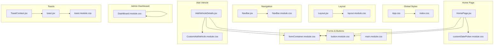

**Diagram sources**
- [App.css](file://frontend/src/App.css#L1-L14)
- [index.css](file://frontend/src/index.css#L1-L16)
- [Layout.jsx](file://frontend/src/comoponent/layout/Layout.jsx#L1-L136)
- [layout.module.css](file://frontend/src/comoponent/layout/layout.module.css#L1-L156)
- [NavBar.jsx](file://frontend/src/comoponent/navBar/NavBar.jsx#L1-L252)
- [NavBar.module.css](file://frontend/src/comoponent/navBar/NavBar.module.css#L1-L539)
- [HomePage.jsx](file://frontend/src/pages/homePage/HomePage.jsx#L1-L241)
- [customDatePicker.module.css](file://frontend/src/pages/homePage/customDatePicker.module.css#L1-L112)
- [AddVehicleDetails.jsx](file://frontend/src/pages/addVehicle/AddVehicleDetails.jsx#L1-L344)
- [CustomAddVehicle.module.css](file://frontend/src/pages/addVehicle/CustomAddVehicle.module.css#L1-L83)
- [DashBoard.module.css](file://frontend/src/pages/adminDashboard/DashBoard.module.css#L1-L678)
- [ToastContext.jsx](file://frontend/src/ContextApi/ToastContext.jsx#L1-L29)
- [toast.jsx](file://frontend/src/comoponent/toaster/toast/toast.jsx#L1-L75)
- [toast.module.css](file://frontend/src/comoponent/toaster/toast/toast.module.css#L1-L94)
- [formContainer.module.css](file://frontend/src/Css/formContainer.module.css#L1-L153)
- [button.module.css](file://frontend/src/Css/button.module.css#L1-L40)
- [main.module.css](file://frontend/src/Css/main.module.css#L1-L131)

**Section sources**
- [App.css](file://frontend/src/App.css#L1-L14)
- [index.css](file://frontend/src/index.css#L1-L16)
- [Layout.jsx](file://frontend/src/comoponent/layout/Layout.jsx#L1-L136)
- [layout.module.css](file://frontend/src/comoponent/layout/layout.module.css#L1-L156)
- [NavBar.jsx](file://frontend/src/comoponent/navBar/NavBar.jsx#L1-L252)
- [NavBar.module.css](file://frontend/src/comoponent/navBar/NavBar.module.css#L1-L539)
- [HomePage.jsx](file://frontend/src/pages/homePage/HomePage.jsx#L1-L241)
- [customDatePicker.module.css](file://frontend/src/pages/homePage/customDatePicker.module.css#L1-L112)
- [AddVehicleDetails.jsx](file://frontend/src/pages/addVehicle/AddVehicleDetails.jsx#L1-L344)
- [CustomAddVehicle.module.css](file://frontend/src/pages/addVehicle/CustomAddVehicle.module.css#L1-L83)
- [DashBoard.module.css](file://frontend/src/pages/adminDashboard/DashBoard.module.css#L1-L678)
- [ToastContext.jsx](file://frontend/src/ContextApi/ToastContext.jsx#L1-L29)
- [toast.jsx](file://frontend/src/comoponent/toaster/toast/toast.jsx#L1-L75)
- [toast.module.css](file://frontend/src/comoponent/toaster/toast/toast.module.css#L1-L94)
- [formContainer.module.css](file://frontend/src/Css/formContainer.module.css#L1-L153)
- [button.module.css](file://frontend/src/Css/button.module.css#L1-L40)
- [main.module.css](file://frontend/src/Css/main.module.css#L1-L131)

## Core Components
- Global resets and typography: Centralized in App.css and index.css to normalize baseline styles and fonts.
- Layout container: Layout.jsx orchestrates the page scaffold with header, content area, and footer using layout.module.css.
- Navigation bar: NavBar.jsx integrates icons, dropdowns, notifications, and profile menus styled via NavBar.module.css.
- Forms and inputs: Shared formContainer.module.css defines consistent form groups, labels, inputs, file upload areas, and visibility toggles.
- Buttons: Shared button.module.css provides primary gradient buttons and text buttons with hover effects.
- Home page search: HomePage.jsx composes a date/time picker form with customDatePicker.module.css and applies shared form/button styles.
- Add vehicle form: AddVehicleDetails.jsx uses CustomAddVehicle.module.css for form card styling and integrates shared form/button modules.
- Admin dashboard: DashBoard.module.css defines KPI cards, charts, tables, quick actions, and modal animations.
- Toast notifications: ToastContext.jsx provides a global toast provider; toast.jsx renders animated toasts with toast.module.css.

**Section sources**
- [App.css](file://frontend/src/App.css#L1-L14)
- [index.css](file://frontend/src/index.css#L1-L16)
- [Layout.jsx](file://frontend/src/comoponent/layout/Layout.jsx#L1-L136)
- [layout.module.css](file://frontend/src/comoponent/layout/layout.module.css#L1-L156)
- [NavBar.jsx](file://frontend/src/comoponent/navBar/NavBar.jsx#L1-L252)
- [NavBar.module.css](file://frontend/src/comoponent/navBar/NavBar.module.css#L1-L539)
- [HomePage.jsx](file://frontend/src/pages/homePage/HomePage.jsx#L1-L241)
- [customDatePicker.module.css](file://frontend/src/pages/homePage/customDatePicker.module.css#L1-L112)
- [AddVehicleDetails.jsx](file://frontend/src/pages/addVehicle/AddVehicleDetails.jsx#L1-L344)
- [CustomAddVehicle.module.css](file://frontend/src/pages/addVehicle/CustomAddVehicle.module.css#L1-L83)
- [DashBoard.module.css](file://frontend/src/pages/adminDashboard/DashBoard.module.css#L1-L678)
- [ToastContext.jsx](file://frontend/src/ContextApi/ToastContext.jsx#L1-L29)
- [toast.jsx](file://frontend/src/comoponent/toaster/toast/toast.jsx#L1-L75)
- [toast.module.css](file://frontend/src/comoponent/toaster/toast/toast.module.css#L1-L94)
- [formContainer.module.css](file://frontend/src/Css/formContainer.module.css#L1-L153)
- [button.module.css](file://frontend/src/Css/button.module.css#L1-L40)

## Architecture Overview
The styling architecture follows a component-centric CSS Modules pattern with global resets and modular styles per feature. Components import their local styles and share common modules for forms and buttons. The layout module coordinates the overall page structure, while the toast system provides unobtrusive feedback.

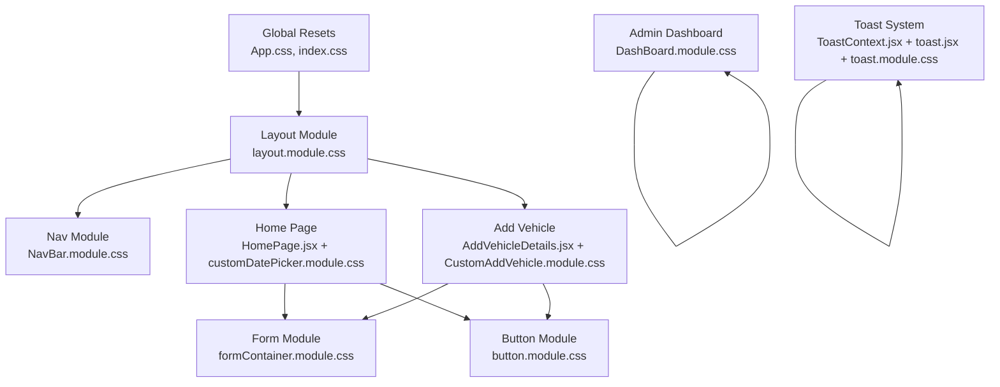

**Diagram sources**
- [App.css](file://frontend/src/App.css#L1-L14)
- [index.css](file://frontend/src/index.css#L1-L16)
- [layout.module.css](file://frontend/src/comoponent/layout/layout.module.css#L1-L156)
- [NavBar.module.css](file://frontend/src/comoponent/navBar/NavBar.module.css#L1-L539)
- [formContainer.module.css](file://frontend/src/Css/formContainer.module.css#L1-L153)
- [button.module.css](file://frontend/src/Css/button.module.css#L1-L40)
- [HomePage.jsx](file://frontend/src/pages/homePage/HomePage.jsx#L1-L241)
- [customDatePicker.module.css](file://frontend/src/pages/homePage/customDatePicker.module.css#L1-L112)
- [AddVehicleDetails.jsx](file://frontend/src/pages/addVehicle/AddVehicleDetails.jsx#L1-L344)
- [CustomAddVehicle.module.css](file://frontend/src/pages/addVehicle/CustomAddVehicle.module.css#L1-L83)
- [DashBoard.module.css](file://frontend/src/pages/adminDashboard/DashBoard.module.css#L1-L678)
- [ToastContext.jsx](file://frontend/src/ContextApi/ToastContext.jsx#L1-L29)
- [toast.jsx](file://frontend/src/comoponent/toaster/toast/toast.jsx#L1-L75)
- [toast.module.css](file://frontend/src/comoponent/toaster/toast/toast.module.css#L1-L94)

## Detailed Component Analysis

### Layout System
- Purpose: Provides a consistent page scaffold with a fixed header, scrollable content area, and footer.
- Implementation: Layout.jsx wraps routes and injects the navigation and footer containers bound to layout.module.css classes.
- Responsiveness: Uses viewport units and percentage-based margins; includes media queries for smaller screens.

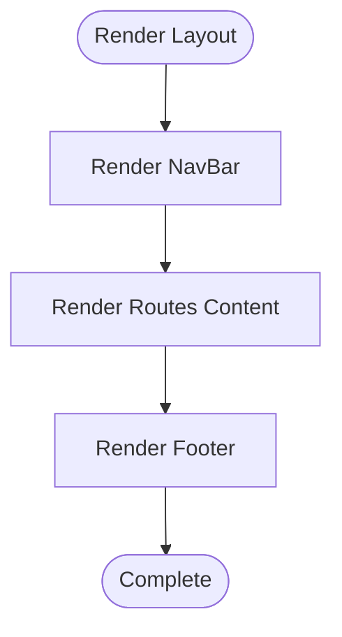

**Diagram sources**
- [Layout.jsx](file://frontend/src/comoponent/layout/Layout.jsx#L31-L136)
- [layout.module.css](file://frontend/src/comoponent/layout/layout.module.css#L1-L156)

**Section sources**
- [Layout.jsx](file://frontend/src/comoponent/layout/Layout.jsx#L1-L136)
- [layout.module.css](file://frontend/src/comoponent/layout/layout.module.css#L1-L156)

### Navigation Bar and Dropdowns
- Purpose: Hosts branding, navigation links, notifications, and user profile dropdown.
- Styling: NavBar.module.css defines notification bell, dropdown menu, icons, badges, and animations.
- Interactions: Controlled via refs and event handlers to toggle visibility and close on outside clicks.

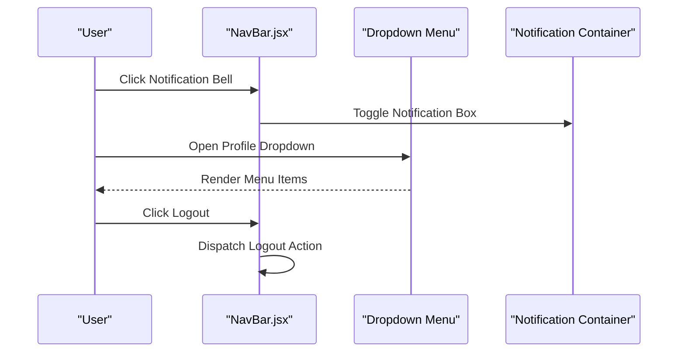

**Diagram sources**
- [NavBar.jsx](file://frontend/src/comoponent/navBar/NavBar.jsx#L1-L252)
- [NavBar.module.css](file://frontend/src/comoponent/navBar/NavBar.module.css#L1-L539)

**Section sources**
- [NavBar.jsx](file://frontend/src/comoponent/navBar/NavBar.jsx#L1-L252)
- [NavBar.module.css](file://frontend/src/comoponent/navBar/NavBar.module.css#L1-L539)

### Form Styling Patterns
- Purpose: Provide reusable form layouts, labels, inputs, file upload areas, and password visibility toggles.
- Implementation: formContainer.module.css defines form groups, focus states, file upload zones, and input wrappers with icons.
- Usage: HomePage.jsx and AddVehicleDetails.jsx compose forms using shared classes and component-specific overrides.

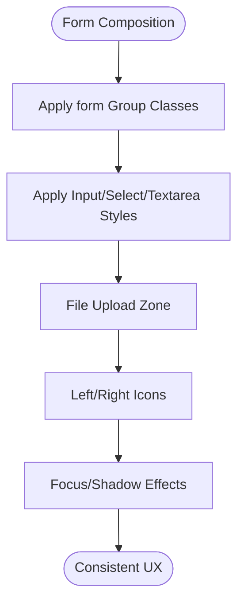

**Diagram sources**
- [formContainer.module.css](file://frontend/src/Css/formContainer.module.css#L1-L153)
- [HomePage.jsx](file://frontend/src/pages/homePage/HomePage.jsx#L126-L225)
- [AddVehicleDetails.jsx](file://frontend/src/pages/addVehicle/AddVehicleDetails.jsx#L158-L336)

**Section sources**
- [formContainer.module.css](file://frontend/src/Css/formContainer.module.css#L1-L153)
- [HomePage.jsx](file://frontend/src/pages/homePage/HomePage.jsx#L126-L225)
- [AddVehicleDetails.jsx](file://frontend/src/pages/addVehicle/AddVehicleDetails.jsx#L158-L336)

### Button Variations
- Purpose: Provide primary gradient buttons and text buttons with hover transitions.
- Implementation: button.module.css defines container, content, and text button variants with shadows and gradients.
- Usage: HomePage.jsx and AddVehicleDetails.jsx apply button classes to submit controls.

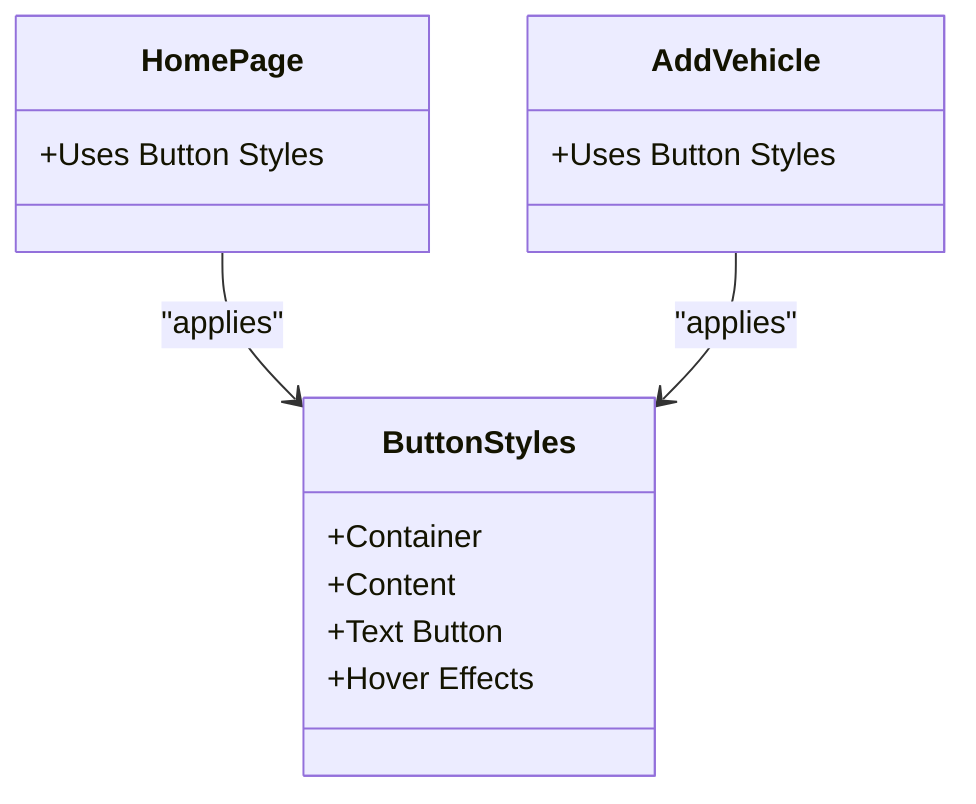

**Diagram sources**
- [button.module.css](file://frontend/src/Css/button.module.css#L1-L40)
- [HomePage.jsx](file://frontend/src/pages/homePage/HomePage.jsx#L214-L224)
- [AddVehicleDetails.jsx](file://frontend/src/pages/addVehicle/AddVehicleDetails.jsx#L327-L335)

**Section sources**
- [button.module.css](file://frontend/src/Css/button.module.css#L1-L40)
- [HomePage.jsx](file://frontend/src/pages/homePage/HomePage.jsx#L214-L224)
- [AddVehicleDetails.jsx](file://frontend/src/pages/addVehicle/AddVehicleDetails.jsx#L327-L335)

### Interactive Elements and Animations
- Notification bell: NavBar.module.css includes a ring animation for the bell icon.
- Dropdowns: Fade-in slide animation for menu appearance.
- Toast notifications: Slide-in animation for toast entries.

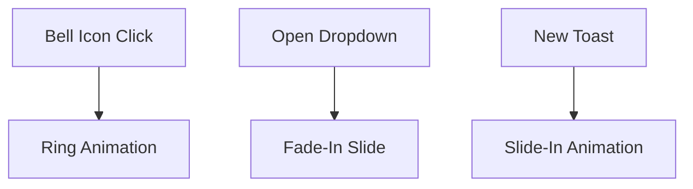

**Diagram sources**
- [NavBar.module.css](file://frontend/src/comoponent/navBar/NavBar.module.css#L125-L147)
- [DashBoard.module.css](file://frontend/src/pages/adminDashboard/DashBoard.module.css#L314-L334)
- [toast.module.css](file://frontend/src/comoponent/toaster/toast/toast.module.css#L84-L92)

**Section sources**
- [NavBar.module.css](file://frontend/src/comoponent/navBar/NavBar.module.css#L125-L147)
- [DashBoard.module.css](file://frontend/src/pages/adminDashboard/DashBoard.module.css#L314-L334)
- [toast.module.css](file://frontend/src/comoponent/toaster/toast/toast.module.css#L84-L92)

### Toast Notification Styling
- Provider: ToastContext.jsx manages a global toast list and exposes a handler.
- Component: toast.jsx renders toasts with dynamic positioning and auto-dismiss timers.
- Styles: toast.module.css defines container, content, and animation classes.

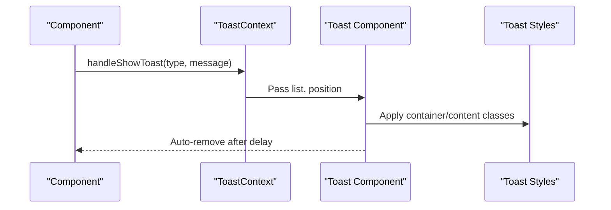

**Diagram sources**
- [ToastContext.jsx](file://frontend/src/ContextApi/ToastContext.jsx#L1-L29)
- [toast.jsx](file://frontend/src/comoponent/toaster/toast/toast.jsx#L1-L75)
- [toast.module.css](file://frontend/src/comoponent/toaster/toast/toast.module.css#L1-L94)

**Section sources**
- [ToastContext.jsx](file://frontend/src/ContextApi/ToastContext.jsx#L1-L29)
- [toast.jsx](file://frontend/src/comoponent/toaster/toast/toast.jsx#L1-L75)
- [toast.module.css](file://frontend/src/comoponent/toaster/toast/toast.module.css#L1-L94)

### Modal Components
- Dashboard modals: DashBoard.module.css defines overlay and modal animations, sizing, and content layout.
- Audit logs modal: Additional overlay and container styles for detailed views.

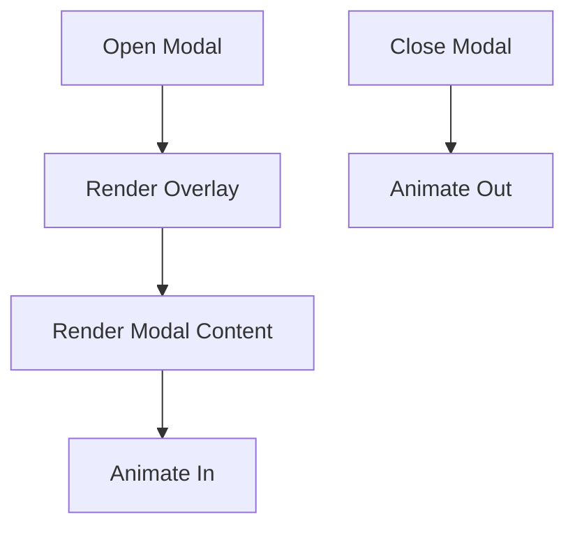

**Diagram sources**
- [DashBoard.module.css](file://frontend/src/pages/adminDashboard/DashBoard.module.css#L259-L334)
- [DashBoard.module.css](file://frontend/src/pages/adminDashboard/DashBoard.module.css#L484-L512)

**Section sources**
- [DashBoard.module.css](file://frontend/src/pages/adminDashboard/DashBoard.module.css#L259-L334)
- [DashBoard.module.css](file://frontend/src/pages/adminDashboard/DashBoard.module.css#L484-L512)

### Home Page Search Form
- Purpose: Provide a tabbed date/time selection form with labels and inputs.
- Styling: customDatePicker.module.css defines container, tabs, sections, and input labels; HomePage.jsx composes shared form and button modules.

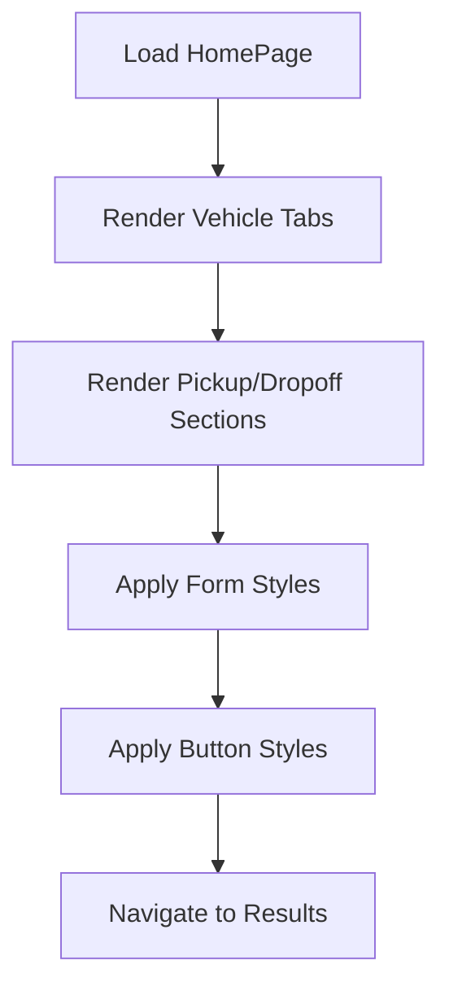

**Diagram sources**
- [HomePage.jsx](file://frontend/src/pages/homePage/HomePage.jsx#L104-L225)
- [customDatePicker.module.css](file://frontend/src/pages/homePage/customDatePicker.module.css#L1-L112)
- [formContainer.module.css](file://frontend/src/Css/formContainer.module.css#L1-L153)
- [button.module.css](file://frontend/src/Css/button.module.css#L1-L40)

**Section sources**
- [HomePage.jsx](file://frontend/src/pages/homePage/HomePage.jsx#L104-L225)
- [customDatePicker.module.css](file://frontend/src/pages/homePage/customDatePicker.module.css#L1-L112)
- [formContainer.module.css](file://frontend/src/Css/formContainer.module.css#L1-L153)
- [button.module.css](file://frontend/src/Css/button.module.css#L1-L40)

### Add Vehicle Form
- Purpose: Collect vehicle details, images, and pricing ranges with validation feedback.
- Styling: CustomAddVehicle.module.css defines the form card, header, and pricing rows; integrates shared form and button modules.

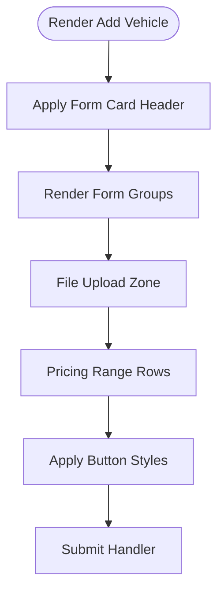

**Diagram sources**
- [AddVehicleDetails.jsx](file://frontend/src/pages/addVehicle/AddVehicleDetails.jsx#L148-L340)
- [CustomAddVehicle.module.css](file://frontend/src/pages/addVehicle/CustomAddVehicle.module.css#L1-L83)
- [formContainer.module.css](file://frontend/src/Css/formContainer.module.css#L1-L153)
- [button.module.css](file://frontend/src/Css/button.module.css#L1-L40)

**Section sources**
- [AddVehicleDetails.jsx](file://frontend/src/pages/addVehicle/AddVehicleDetails.jsx#L148-L340)
- [CustomAddVehicle.module.css](file://frontend/src/pages/addVehicle/CustomAddVehicle.module.css#L1-L83)
- [formContainer.module.css](file://frontend/src/Css/formContainer.module.css#L1-L153)
- [button.module.css](file://frontend/src/Css/button.module.css#L1-L40)

### Admin Dashboard
- Purpose: Present KPIs, charts, tables, and quick actions with responsive grids.
- Styling: DashBoard.module.css defines nav tabs, cards, grids, tables, badges, and modal animations.

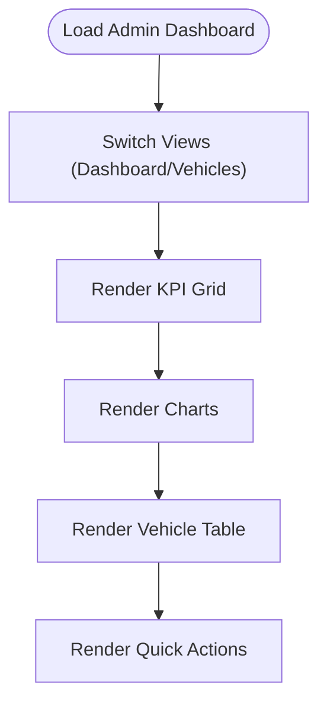

**Diagram sources**
- [DashBoard.module.css](file://frontend/src/pages/adminDashboard/DashBoard.module.css#L1-L678)
- [AdminDashBoard.jsx](file://frontend/src/pages/adminDashboard/AdminDashBoard.jsx#L1-L308)

**Section sources**
- [DashBoard.module.css](file://frontend/src/pages/adminDashboard/DashBoard.module.css#L1-L678)
- [AdminDashBoard.jsx](file://frontend/src/pages/adminDashboard/AdminDashBoard.jsx#L1-L308)

## Dependency Analysis
- Component-to-style coupling: Each component imports its local CSS module and may import shared modules for forms/buttons.
- Global dependencies: App.css and index.css provide base resets and fonts used across components.
- Toast dependency: ToastContext.jsx is a provider that injects a toast renderer into the tree.

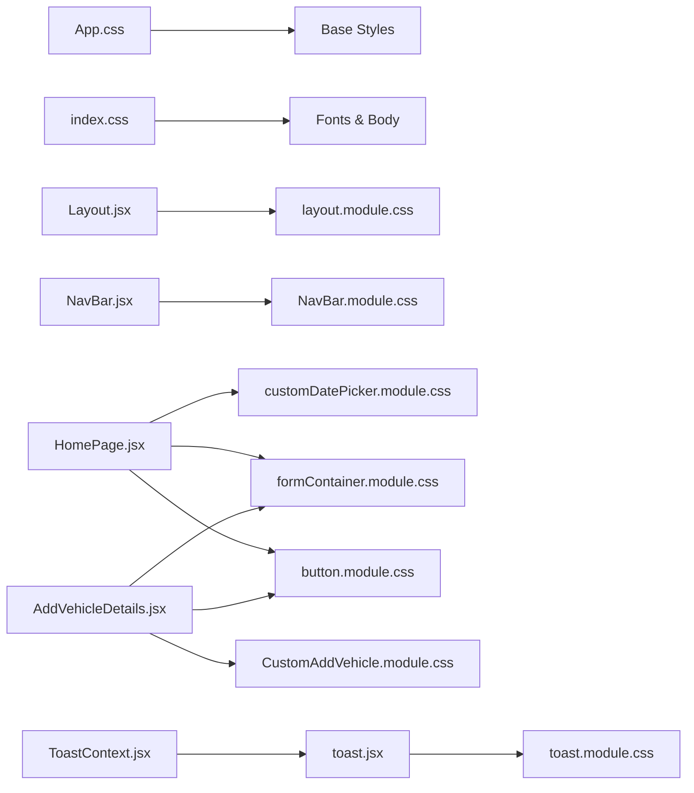

**Diagram sources**
- [App.css](file://frontend/src/App.css#L1-L14)
- [index.css](file://frontend/src/index.css#L1-L16)
- [Layout.jsx](file://frontend/src/comoponent/layout/Layout.jsx#L1-L136)
- [layout.module.css](file://frontend/src/comoponent/layout/layout.module.css#L1-L156)
- [NavBar.jsx](file://frontend/src/comoponent/navBar/NavBar.jsx#L1-L252)
- [NavBar.module.css](file://frontend/src/comoponent/navBar/NavBar.module.css#L1-L539)
- [HomePage.jsx](file://frontend/src/pages/homePage/HomePage.jsx#L1-L241)
- [customDatePicker.module.css](file://frontend/src/pages/homePage/customDatePicker.module.css#L1-L112)
- [AddVehicleDetails.jsx](file://frontend/src/pages/addVehicle/AddVehicleDetails.jsx#L1-L344)
- [CustomAddVehicle.module.css](file://frontend/src/pages/addVehicle/CustomAddVehicle.module.css#L1-L83)
- [ToastContext.jsx](file://frontend/src/ContextApi/ToastContext.jsx#L1-L29)
- [toast.jsx](file://frontend/src/comoponent/toaster/toast/toast.jsx#L1-L75)
- [toast.module.css](file://frontend/src/comoponent/toaster/toast/toast.module.css#L1-L94)
- [formContainer.module.css](file://frontend/src/Css/formContainer.module.css#L1-L153)
- [button.module.css](file://frontend/src/Css/button.module.css#L1-L40)

**Section sources**
- [App.css](file://frontend/src/App.css#L1-L14)
- [index.css](file://frontend/src/index.css#L1-L16)
- [Layout.jsx](file://frontend/src/comoponent/layout/Layout.jsx#L1-L136)
- [layout.module.css](file://frontend/src/comoponent/layout/layout.module.css#L1-L156)
- [NavBar.jsx](file://frontend/src/comoponent/navBar/NavBar.jsx#L1-L252)
- [NavBar.module.css](file://frontend/src/comoponent/navBar/NavBar.module.css#L1-L539)
- [HomePage.jsx](file://frontend/src/pages/homePage/HomePage.jsx#L1-L241)
- [customDatePicker.module.css](file://frontend/src/pages/homePage/customDatePicker.module.css#L1-L112)
- [AddVehicleDetails.jsx](file://frontend/src/pages/addVehicle/AddVehicleDetails.jsx#L1-L344)
- [CustomAddVehicle.module.css](file://frontend/src/pages/addVehicle/CustomAddVehicle.module.css#L1-L83)
- [ToastContext.jsx](file://frontend/src/ContextApi/ToastContext.jsx#L1-L29)
- [toast.jsx](file://frontend/src/comoponent/toaster/toast/toast.jsx#L1-L75)
- [toast.module.css](file://frontend/src/comoponent/toaster/toast/toast.module.css#L1-L94)
- [formContainer.module.css](file://frontend/src/Css/formContainer.module.css#L1-L153)
- [button.module.css](file://frontend/src/Css/button.module.css#L1-L40)

## Performance Considerations
- CSS Modules scoping reduces specificity and avoids global conflicts, improving maintainability and reducing reflows.
- Prefer class composition over deeply nested selectors to minimize cascade costs.
- Use CSS custom properties sparingly; current code relies on direct values for colors and spacing.
- Keep animations lightweight (as seen in bell ring and toast slide) to avoid jank on lower-end devices.
- Media queries are strategically placed to prevent excessive recalculations during layout shifts.

[No sources needed since this section provides general guidance]

## Troubleshooting Guide
- Toast not appearing: Verify ToastProvider is mounted at the root and handleShowToast is called from a component using useToast.
- Form input focus styles not visible: Ensure formContainer.module.css is imported and inputs receive focus states.
- Button hover effects missing: Confirm button.module.css is applied to the button element.
- Layout gaps or overflow: Review layout.module.css margins and heights; adjust for mobile breakpoints.
- Notification dropdown not closing: Check outside-click logic in NavBar.jsx and ensure refs are correctly attached.

**Section sources**
- [ToastContext.jsx](file://frontend/src/ContextApi/ToastContext.jsx#L1-L29)
- [toast.jsx](file://frontend/src/comoponent/toaster/toast/toast.jsx#L1-L75)
- [formContainer.module.css](file://frontend/src/Css/formContainer.module.css#L1-L153)
- [button.module.css](file://frontend/src/Css/button.module.css#L1-L40)
- [layout.module.css](file://frontend/src/comoponent/layout/layout.module.css#L1-L156)
- [NavBar.jsx](file://frontend/src/comoponent/navBar/NavBar.jsx#L120-L136)

## Conclusion
The frontend employs a robust CSS Modules-based styling system with shared form and button modules, component-specific overrides, and global resets. The layout, navigation, forms, buttons, toasts, and modals are consistently styled and responsive. Following the documented patterns ensures maintainability, scalability, and a cohesive design system across the application.

[No sources needed since this section summarizes without analyzing specific files]

## Appendices

### Responsive Design Principles
- Mobile-first approach: Styles define base layouts and progressively enhance for larger screens.
- Breakpoints: Media queries adjust paddings, grids, and typography for tablets and phones.
- Flexible containers: Percentage widths and viewport units adapt to various screen sizes.

**Section sources**
- [layout.module.css](file://frontend/src/comoponent/layout/layout.module.css#L127-L155)
- [DashBoard.module.css](file://frontend/src/pages/adminDashboard/DashBoard.module.css#L388-L392)
- [customDatePicker.module.css](file://frontend/src/pages/homePage/customDatePicker.module.css#L672-L676)

### Cross-Browser Compatibility
- Normalize base styles via App.css and index.css to reduce inconsistencies.
- Avoid vendor-prefixed properties unless necessary; rely on modern CSS support.
- Test animations and transforms across browsers; current animations use widely supported features.

**Section sources**
- [App.css](file://frontend/src/App.css#L1-L14)
- [index.css](file://frontend/src/index.css#L1-L16)
- [toast.module.css](file://frontend/src/comoponent/toaster/toast/toast.module.css#L84-L92)

### Styling Best Practices and Naming Conventions
- Use kebab-case for CSS class names and descriptive prefixes indicating component scope (e.g., navbar, toast).
- Keep component styles co-located with components; import local CSS Modules alongside component logic.
- Favor composition over deep nesting; use utility-like classes for common patterns (e.g., form groups).
- Maintain a shared palette and spacing tokens in CSS Modules for consistency.

**Section sources**
- [NavBar.module.css](file://frontend/src/comoponent/navBar/NavBar.module.css#L1-L539)
- [toast.module.css](file://frontend/src/comoponent/toaster/toast/toast.module.css#L1-L94)
- [DashBoard.module.css](file://frontend/src/pages/adminDashboard/DashBoard.module.css#L1-L678)

### Guidelines for Adding New Styles
- Create a new CSS Module for component-specific styles; import and apply classes in the component.
- Reuse shared modules (formContainer.module.css, button.module.css) for common patterns.
- Add media queries near the bottom of the module to keep selectors readable.
- Use semantic class names and avoid magic numbers; define constants in CSS where appropriate.

**Section sources**
- [formContainer.module.css](file://frontend/src/Css/formContainer.module.css#L1-L153)
- [button.module.css](file://frontend/src/Css/button.module.css#L1-L40)
- [layout.module.css](file://frontend/src/comoponent/layout/layout.module.css#L120-L131)

### Performance Optimization Through Efficient CSS Usage
- Minimize repaints by animating transform and opacity rather than layout-affecting properties.
- Avoid overly specific selectors; prefer class-based targeting.
- Consolidate repeated styles into shared modules to reduce bundle size.
- Remove unused styles periodically to keep CSS lean.

**Section sources**
- [NavBar.module.css](file://frontend/src/comoponent/navBar/NavBar.module.css#L125-L147)
- [DashBoard.module.css](file://frontend/src/pages/adminDashboard/DashBoard.module.css#L314-L334)
- [toast.module.css](file://frontend/src/comoponent/toaster/toast/toast.module.css#L84-L92)