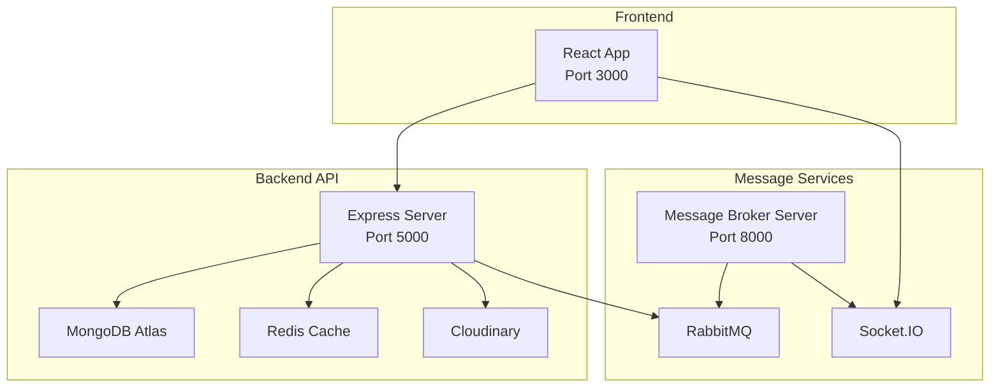

# Getting Started

<cite>
**Referenced Files in This Document**
- [docker-compose.yml](file://docker-compose.yml)
- [backend/package.json](file://backend/package.json)
- [frontend/package.json](file://frontend/package.json)
- [messageServices/package.json](file://messageServices/package.json)
- [backend/server.js](file://backend/server.js)
- [frontend/src/APIPoints/AllApiPonts.js](file://frontend/src/APIPoints/AllApiPonts.js)
- [messageServices/server.js](file://messageServices/server.js)
- [backend/config/cloudinary.js](file://backend/config/cloudinary.js)
- [backend/config/redisClient.js](file://backend/config/redisClient.js)
- [backend/DatabaseConnection/dataBaseConnection.js](file://backend/DatabaseConnection/dataBaseConnection.js)
- [frontend/.env.development](file://frontend/.env.development)
- [frontend/.env.production](file://frontend/.env.production)
- [backend/.env.development](file://backend/.env.development)
- [backend/.env.production](file://backend/.env.production)
- [messageServices/.env](file://messageServices/.env)
- [frontend/src/axiosInterceptors/AxiosSetup.js](file://frontend/src/axiosInterceptors/AxiosSetup.js)
</cite>

## Table of Contents
1. [Introduction](#introduction)
2. [Prerequisites](#prerequisites)
3. [Environment Setup](#environment-setup)
4. [Installation Instructions](#installation-instructions)
5. [Environment Variables](#environment-variables)
6. [Service Configuration](#service-configuration)
7. [Database Initialization](#database-initialization)
8. [Redis Cache Configuration](#redis-cache-configuration)
9. [File Upload Setup](#file-upload-setup)
10. [Verification Steps](#verification-steps)
11. [Basic Usage Scenarios](#basic-usage-scenarios)
12. [Architecture Overview](#architecture-overview)
13. [Troubleshooting Guide](#troubleshooting-guide)
14. [Conclusion](#conclusion)

## Introduction
This guide helps you set up and run the Vehicle Management System locally and in production. The system consists of:
- A backend API server built with Node.js and Express
- A frontend React application
- A message services component for notifications via RabbitMQ and Socket.IO
- Supporting infrastructure: MongoDB Atlas for data persistence, Redis for caching, and Cloudinary for image storage

## Prerequisites
Ensure the following tools and accounts are ready before proceeding:
- Node.js (LTS recommended) for running the backend and frontend applications
- Docker and Docker Compose for containerized deployment
- MongoDB Atlas account and cluster for database connectivity
- RabbitMQ service (either local or managed, e.g., CloudAMQP)
- Cloudinary account for image uploads
- Redis instance (local or managed) for caching

## Environment Setup
Set up your local environment variables for development and production. The system loads environment-specific files:
- Backend loads `.env.development` or `.env.production` based on the `NODE_ENV` value
- Frontend loads `.env.development` or `.env.production` using `env-cmd`
- Message services load `.env` for configuration

Key environment files:
- Backend: [backend/.env.development](file://backend/.env.development#L1-L27), [backend/.env.production](file://backend/.env.production#L1-L21)
- Frontend: [frontend/.env.development](file://frontend/.env.development#L1-L6), [frontend/.env.production](file://frontend/.env.production#L1-L5)
- Message Services: [messageServices/.env](file://messageServices/.env#L1-L13)

**Section sources**
- [backend/server.js](file://backend/server.js#L1-L9)
- [frontend/package.json](file://frontend/package.json#L37-L43)
- [messageServices/package.json](file://messageServices/package.json#L6-L8)

## Installation Instructions

### Development Environment
Follow these steps to run all services locally:

1. **Clone the repository** and navigate to the project root directory.

2. **Start services with Docker Compose**
   - Use the provided compose file to build and run containers for frontend, backend, RabbitMQ, and message services.
   - Compose configuration: [docker-compose.yml](file://docker-compose.yml#L1-L54)

3. **Verify service ports**
   - Frontend: http://localhost:3000
   - Backend API: http://localhost:5000
   - RabbitMQ management: http://localhost:15672
   - Message services: http://localhost:8000

4. **Run scripts locally (alternative)**
   - Backend: Install dependencies and start in development mode
     - Dependencies: [backend/package.json](file://backend/package.json#L1-L37)
     - Scripts: [backend/server.js](file://backend/server.js#L32-L34)
   - Frontend: Install dependencies and start in development mode
     - Dependencies: [frontend/package.json](file://frontend/package.json#L1-L63)
     - Scripts: [frontend/package.json](file://frontend/package.json#L37-L43)
   - Message Services: Install dependencies and start
     - Dependencies: [messageServices/package.json](file://messageServices/package.json#L1-L22)
     - Scripts: [messageServices/server.js](file://messageServices/server.js#L9-L26)

**Section sources**
- [docker-compose.yml](file://docker-compose.yml#L1-L54)
- [backend/package.json](file://backend/package.json#L32-L34)
- [frontend/package.json](file://frontend/package.json#L37-L43)
- [messageServices/package.json](file://messageServices/package.json#L6-L8)

### Production Environment
For production deployment:
- Build images using the provided Dockerfiles in each service directory
- Update environment variables in production files:
  - Backend: [backend/.env.production](file://backend/.env.production#L1-L21)
  - Frontend: [frontend/.env.production](file://frontend/.env.production#L1-L5)
  - Message Services: [messageServices/.env](file://messageServices/.env#L1-L13)
- Deploy using your preferred container orchestration platform

**Section sources**
- [backend/.env.production](file://backend/.env.production#L1-L21)
- [frontend/.env.production](file://frontend/.env.production#L1-L5)
- [messageServices/.env](file://messageServices/.env#L1-L13)

## Environment Variables
Configure the following environment variables for each service:

### Backend API Server
Required variables:
- Database connection: MONGOURL
- CORS origin: FRONTEND
- Port: PORT
- JWT secrets: JWT_SECRET, JWT_REFRESH_SECRET
- RabbitMQ URL: RABBITMQURL
- Redis URL: REDIS_URL
- Cloudinary credentials: CLOUDINARY_CLOUD_NAME, CLOUDINARY_API_KEY, CLOUDINARY_API_SECRET

Reference files:
- [backend/.env.development](file://backend/.env.development#L5-L19)
- [backend/.env.production](file://backend/.env.production#L6-L17)
- [backend/DatabaseConnection/dataBaseConnection.js](file://backend/DatabaseConnection/dataBaseConnection.js#L4-L16)
- [backend/config/redisClient.js](file://backend/config/redisClient.js#L3-L5)
- [backend/config/cloudinary.js](file://backend/config/cloudinary.js#L5-L9)

**Section sources**
- [backend/.env.development](file://backend/.env.development#L5-L19)
- [backend/.env.production](file://backend/.env.production#L6-L17)
- [backend/DatabaseConnection/dataBaseConnection.js](file://backend/DatabaseConnection/dataBaseConnection.js#L4-L16)
- [backend/config/redisClient.js](file://backend/config/redisClient.js#L3-L5)
- [backend/config/cloudinary.js](file://backend/config/cloudinary.js#L5-L9)

### Frontend React Application
Required variables:
- API server URL: REACT_APP_API_SERVER_URL
- Socket server URL: SOCKET_URL

Reference files:
- [frontend/.env.development](file://frontend/.env.development#L1-L6)
- [frontend/.env.production](file://frontend/.env.production#L1-L5)
- [frontend/src/APIPoints/AllApiPonts.js](file://frontend/src/APIPoints/AllApiPonts.js#L1-L3)

**Section sources**
- [frontend/.env.development](file://frontend/.env.development#L1-L6)
- [frontend/.env.production](file://frontend/.env.production#L1-L5)
- [frontend/src/APIPoints/AllApiPonts.js](file://frontend/src/APIPoints/AllApiPonts.js#L1-L3)

### Message Services
Required variables:
- Port: PORT
- RabbitMQ URL: RABBITMQURL
- Dead Letter Queue name: DLQ_NAME
- Email settings: MAIL_HOST, MAIL_PORT, SENDER_MAIL_ID, MAIL_PASS
- Backend service URL: BACKEND_SERVICE_URL

Reference files:
- [messageServices/.env](file://messageServices/.env#L1-L13)
- [messageServices/server.js](file://messageServices/server.js#L9-L26)

**Section sources**
- [messageServices/.env](file://messageServices/.env#L1-L13)
- [messageServices/server.js](file://messageServices/server.js#L9-L26)

## Service Configuration

### Backend API Server
- Express server initialization and middleware setup
- CORS configuration for frontend origin
- Socket.IO integration for real-time notifications
- Static file serving for uploaded assets
- Route registration for user, vehicle, booking, reports, and notifications
- Health check endpoint and global error handling

Key references:
- [backend/server.js](file://backend/server.js#L34-L76)
- [backend/server.js](file://backend/server.js#L196-L203)

**Section sources**
- [backend/server.js](file://backend/server.js#L34-L76)
- [backend/server.js](file://backend/server.js#L196-L203)

### Frontend React Application
- Axios client configured with base URL from environment
- Interceptors for authentication tokens and loading states
- API endpoints configuration for server communication

Key references:
- [frontend/src/APIPoints/AllApiPonts.js](file://frontend/src/APIPoints/AllApiPonts.js#L1-L3)
- [frontend/src/axiosInterceptors/AxiosSetup.js](file://frontend/src/axiosInterceptors/AxiosSetup.js#L110-L113)
- [frontend/src/axiosInterceptors/AxiosSetup.js](file://frontend/src/axiosInterceptors/AxiosSetup.js#L126-L139)
- [frontend/src/axiosInterceptors/AxiosSetup.js](file://frontend/src/axiosInterceptors/AxiosSetup.js#L141-L211)

**Section sources**
- [frontend/src/APIPoints/AllApiPonts.js](file://frontend/src/APIPoints/AllApiPonts.js#L1-L3)
- [frontend/src/axiosInterceptors/AxiosSetup.js](file://frontend/src/axiosInterceptors/AxiosSetup.js#L110-L113)
- [frontend/src/axiosInterceptors/AxiosSetup.js](file://frontend/src/axiosInterceptors/AxiosSetup.js#L126-L139)
- [frontend/src/axiosInterceptors/AxiosSetup.js](file://frontend/src/axiosInterceptors/AxiosSetup.js#L141-L211)

### Message Services
- Express server with Socket.IO for real-time notifications
- RabbitMQ consumers for user and admin notifications
- Routes for notification management
- Health check endpoint

Key references:
- [messageServices/server.js](file://messageServices/server.js#L1-L84)

**Section sources**
- [messageServices/server.js](file://messageServices/server.js#L1-L84)

## Database Initialization
Initialize the MongoDB database using the connection module:
- Connection URL is loaded from environment variables
- Connection options include pool size and timeout settings

References:
- [backend/DatabaseConnection/dataBaseConnection.js](file://backend/DatabaseConnection/dataBaseConnection.js#L4-L16)

Notes:
- The backend server includes commented seed endpoints for vehicles and users; uncomment and run them to populate initial data during development.

**Section sources**
- [backend/DatabaseConnection/dataBaseConnection.js](file://backend/DatabaseConnection/dataBaseConnection.js#L4-L16)
- [backend/server.js](file://backend/server.js#L138-L194)

## Redis Cache Configuration
Configure Redis for caching:
- Redis client connects using REDIS_URL from environment
- Connection events log success or errors

References:
- [backend/config/redisClient.js](file://backend/config/redisClient.js#L3-L17)

**Section sources**
- [backend/config/redisClient.js](file://backend/config/redisClient.js#L3-L17)

## File Upload Setup
Configure Cloudinary for image uploads:
- Cloudinary SDK is initialized with credentials from environment variables
- Multer and Cloudinary storage are used for file uploads

References:
- [backend/config/cloudinary.js](file://backend/config/cloudinary.js#L5-L9)
- [backend/package.json](file://backend/package.json#L24-L24)

**Section sources**
- [backend/config/cloudinary.js](file://backend/config/cloudinary.js#L5-L9)
- [backend/package.json](file://backend/package.json#L24-L24)

## Verification Steps
After starting all services, verify the following:
- Frontend: Access http://localhost:3000 and confirm the application loads
- Backend: Access http://localhost:5000 and verify the base endpoint responds
- RabbitMQ: Access http://localhost:15672 and confirm the management UI is available
- Message Services: Access http://localhost:8000 and verify the health endpoint responds
- Database: Confirm successful connection logs in the backend container
- Redis: Confirm "Redis connected" logs in the backend container
- Cloudinary: Verify uploads succeed using the configured credentials

Compose configuration for service orchestration:
- [docker-compose.yml](file://docker-compose.yml#L1-L54)

**Section sources**
- [docker-compose.yml](file://docker-compose.yml#L1-L54)

## Basic Usage Scenarios

### User Registration
- Navigate to the sign-up page in the frontend
- Submit the registration form
- Verify successful user creation via backend routes

### Vehicle Browsing
- Browse available vehicles in the frontend
- Filter and search vehicles as supported by the UI

### Booking Creation
- Select a vehicle and initiate the booking process
- Complete the booking form and submit
- Receive real-time notifications via Socket.IO and RabbitMQ

Note: These scenarios assume the frontend UI and backend routes are functioning as configured.

## Architecture Overview
The system follows a microservice-like architecture with three main components communicating through RabbitMQ and Socket.IO.

**Diagram sources**
- [docker-compose.yml](file://docker-compose.yml#L3-L52)
- [backend/server.js](file://backend/server.js#L38-L64)
- [messageServices/server.js](file://messageServices/server.js#L13-L21)

## Troubleshooting Guide
Common issues and resolutions:
- Database connection failures: Verify MONGOURL and network connectivity
  - Reference: [backend/DatabaseConnection/dataBaseConnection.js](file://backend/DatabaseConnection/dataBaseConnection.js#L4-L16)
- Redis connection errors: Check REDIS_URL and Redis availability
  - Reference: [backend/config/redisClient.js](file://backend/config/redisClient.js#L11-L13)
- Cloudinary upload errors: Validate CLOUDINARY credentials
  - Reference: [backend/config/cloudinary.js](file://backend/config/cloudinary.js#L5-L9)
- CORS errors: Ensure FRONTEND matches the actual frontend origin
  - Reference: [backend/server.js](file://backend/server.js#L38-L59)
- RabbitMQ connectivity: Confirm RABBITMQURL and service availability
  - Reference: [backend/server.js](file://backend/server.js#L10-L10), [messageServices/.env](file://messageServices/.env#L2-L3)
- Socket.IO connection issues: Verify SOCKET_URL and backend Socket.IO setup
  - Reference: [frontend/.env.development](file://frontend/.env.development#L4-L4), [frontend/src/axiosInterceptors/AxiosSetup.js](file://frontend/src/axiosInterceptors/AxiosSetup.js#L110-L113)

**Section sources**
- [backend/DatabaseConnection/dataBaseConnection.js](file://backend/DatabaseConnection/dataBaseConnection.js#L4-L16)
- [backend/config/redisClient.js](file://backend/config/redisClient.js#L11-L13)
- [backend/config/cloudinary.js](file://backend/config/cloudinary.js#L5-L9)
- [backend/server.js](file://backend/server.js#L38-L59)
- [messageServices/.env](file://messageServices/.env#L2-L3)
- [frontend/.env.development](file://frontend/.env.development#L4-L4)
- [frontend/src/axiosInterceptors/AxiosSetup.js](file://frontend/src/axiosInterceptors/AxiosSetup.js#L110-L113)

## Conclusion
You now have the foundational knowledge to set up, configure, and run the Vehicle Management System locally and in production. Use the environment variables and configuration files referenced here to tailor the system to your infrastructure. For further customization, explore the service-specific configurations and Docker Compose setup.