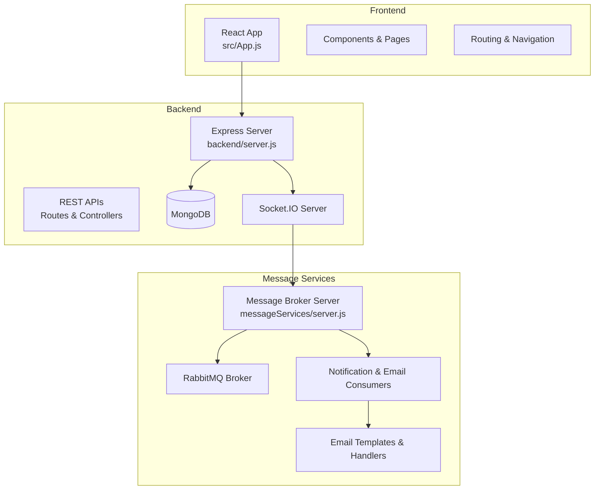
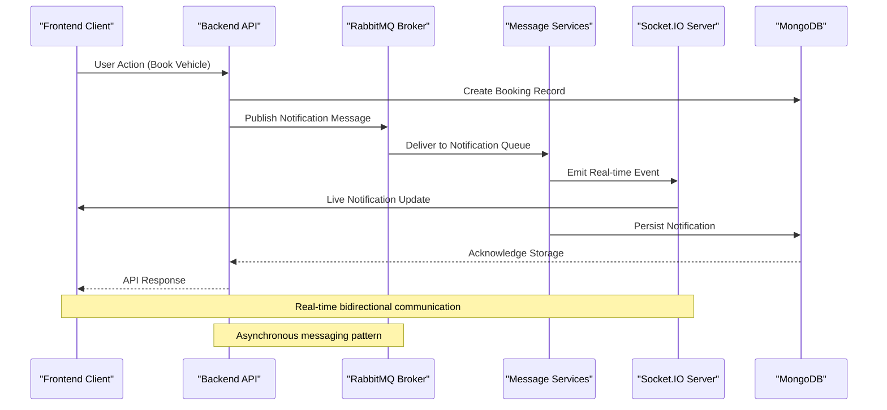
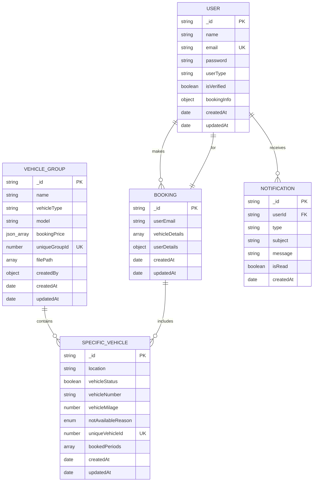
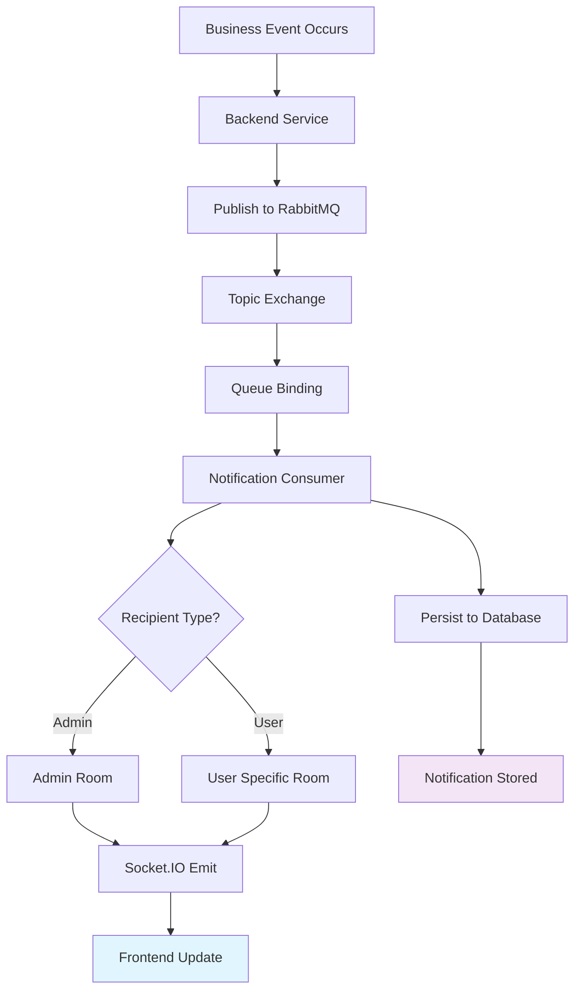
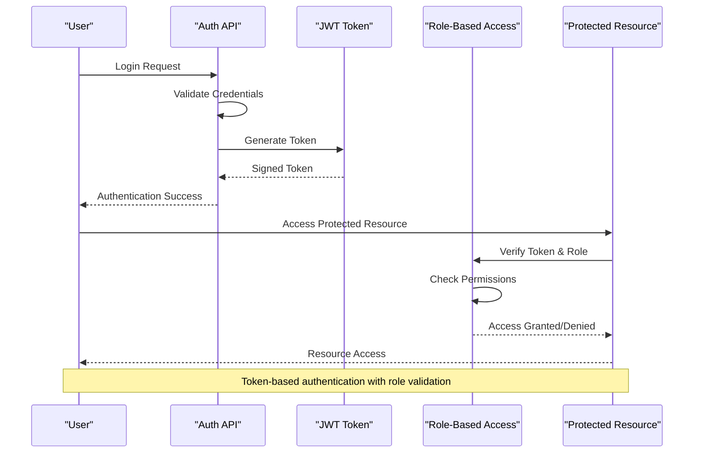
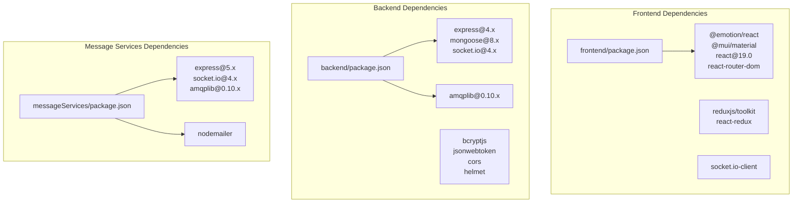

# Project Overview

<cite>
**Referenced Files in This Document**
- [server.js](file://backend/server.js)
- [dataBaseConnection.js](file://backend/DatabaseConnection/dataBaseConnection.js)
- [userModel.js](file://backend/model/userModel.js)
- [vehicleDetailModel.js](file://backend/model/vehicleDetailModel.js)
- [vehicleBookingModel.js](file://backend/model/vehicleBookingModel.js)
- [notificationSchema.js](file://backend/model/notificationSchema.js)
- [MessageService.js](file://backend/NotificationServices/MessageService.js)
- [notificationThroughMessageBroker.js](file://backend/utils/notificationThroughMessageBroker.js)
- [notificationConsumer.js](file://messageServices/controller/notificationConsumer.js)
- [rabbitmqConsumer.js](file://messageServices/controller/rabbitmqConsumer.js)
- [server.js](file://messageServices/server.js)
- [package.json](file://backend/package.json)
- [package.json](file://frontend/package.json)
- [package.json](file://messageServices/package.json)
- [App.js](file://frontend/src/App.js)
- [notificationRoutes.js](file://backend/router/notificationRoutes.js)
</cite>

## Table of Contents
1. [Introduction](#introduction)
2. [Project Structure](#project-structure)
3. [Core Components](#core-components)
4. [Architecture Overview](#architecture-overview)
5. [Detailed Component Analysis](#detailed-component-analysis)
6. [Dependency Analysis](#dependency-analysis)
7. [Performance Considerations](#performance-considerations)
8. [Troubleshooting Guide](#troubleshooting-guide)
9. [Conclusion](#conclusion)

## Introduction
The Vehicle Management System is a complete vehicle rental management solution designed to streamline vehicle inventory management, user authentication, booking workflows, and real-time notifications. It leverages modern technologies to deliver a scalable, secure, and responsive platform for managing vehicle rentals with automated communication and role-based access control.

The system integrates:
- React 19.0 frontend for a dynamic user interface
- Node.js/Express backend for robust API services
- MongoDB for flexible data storage
- RabbitMQ for asynchronous messaging and decoupled workflows
- Socket.IO for real-time notifications and live updates

Key benefits include automated notifications, role-based access control, and a scalable microservices design that separates concerns and enables independent scaling of components.

## Project Structure
The project follows a modular monorepo-like structure with three primary services:
- Backend service: Core APIs, business logic, and database connectivity
- Frontend service: React-based user interface with Redux state management
- Message Services: RabbitMQ-based notification and email processing service

**Diagram sources**
- [server.js](file://backend/server.js#L34-L76)
- [server.js](file://messageServices/server.js#L1-L84)
- [App.js](file://frontend/src/App.js#L1-L79)

**Section sources**
- [server.js](file://backend/server.js#L1-L204)
- [server.js](file://messageServices/server.js#L1-L84)
- [App.js](file://frontend/src/App.js#L1-L79)

## Core Components
The system comprises several core components working together to provide a seamless vehicle rental experience:

### Database Layer
- **MongoDB Connection**: Centralized connection management with connection pooling and timeout configurations
- **User Model**: Comprehensive user schema with role-based access control and authentication support
- **Vehicle Model**: Embedded document structure for vehicle groups and individual vehicles
- **Booking Model**: Transaction-aware booking management with unique ID generation
- **Notification Model**: Persistent notification storage with read/unread status tracking

### Backend Services
- **Express Server**: CORS-enabled server with Socket.IO integration for real-time communication
- **REST API Routes**: Modular routing for user management, vehicle inventory, bookings, and notifications
- **Authentication Middleware**: Token verification and role-based access control
- **Utility Services**: Password hashing, JWT token generation, and error handling middleware

### Message Broker System
- **RabbitMQ Integration**: Asynchronous messaging for notifications and email processing
- **Notification Consumers**: Role-specific notification delivery to users and admins
- **Email Consumers**: Template-driven email processing for various system events
- **Dead Letter Exchanges**: Reliable message processing with retry mechanisms

### Frontend Application
- **React 19.0**: Modern React application with hooks, context providers, and component composition
- **Redux Toolkit**: State management with slices for authentication, bookings, vehicles, and notifications
- **Real-time Updates**: Socket.IO integration for live notification delivery
- **Responsive Design**: Material-UI components with custom styling modules

**Section sources**
- [dataBaseConnection.js](file://backend/DatabaseConnection/dataBaseConnection.js#L1-L17)
- [userModel.js](file://backend/model/userModel.js#L1-L162)
- [vehicleDetailModel.js](file://backend/model/vehicleDetailModel.js#L1-L145)
- [vehicleBookingModel.js](file://backend/model/vehicleBookingModel.js#L1-L105)
- [notificationSchema.js](file://backend/model/notificationSchema.js#L1-L13)

## Architecture Overview
The system employs a distributed architecture with clear separation of concerns and asynchronous communication patterns:

**Diagram sources**
- [server.js](file://backend/server.js#L52-L60)
- [notificationThroughMessageBroker.js](file://backend/utils/notificationThroughMessageBroker.js#L33-L64)
- [notificationConsumer.js](file://messageServices/controller/notificationConsumer.js#L63-L87)

The architecture supports:
- **Scalable Microservices**: Independent scaling of backend, message services, and frontend
- **Asynchronous Processing**: Non-blocking operations through RabbitMQ queues
- **Real-time Communication**: WebSocket connections for instant updates
- **Resilient Messaging**: Dead letter exchanges and retry mechanisms
- **Role-based Access Control**: User roles and permission enforcement

## Detailed Component Analysis

### Database Schema Design
The system uses MongoDB with carefully designed schemas for optimal performance and data integrity:

**Diagram sources**
- [userModel.js](file://backend/model/userModel.js#L6-L130)
- [vehicleDetailModel.js](file://backend/model/vehicleDetailModel.js#L55-L105)
- [vehicleBookingModel.js](file://backend/model/vehicleBookingModel.js#L9-L66)
- [notificationSchema.js](file://backend/model/notificationSchema.js#L3-L10)

### Notification System Architecture
The notification system implements a sophisticated multi-tier approach:

**Diagram sources**
- [notificationThroughMessageBroker.js](file://backend/utils/notificationThroughMessageBroker.js#L33-L64)
- [notificationConsumer.js](file://messageServices/controller/notificationConsumer.js#L37-L91)

### Authentication and Authorization Flow
The system implements comprehensive authentication and role-based access control:

**Diagram sources**
- [userModel.js](file://backend/model/userModel.js#L142-L158)
- [userModel.js](file://backend/model/userModel.js#L65-L70)

**Section sources**
- [userModel.js](file://backend/model/userModel.js#L1-L162)
- [vehicleDetailModel.js](file://backend/model/vehicleDetailModel.js#L1-L145)
- [vehicleBookingModel.js](file://backend/model/vehicleBookingModel.js#L1-L105)
- [notificationSchema.js](file://backend/model/notificationSchema.js#L1-L13)

## Dependency Analysis
The system maintains clean dependency boundaries with well-defined interfaces:

**Diagram sources**
- [package.json](file://frontend/package.json#L1-L63)
- [package.json](file://backend/package.json#L1-L37)
- [package.json](file://messageServices/package.json#L1-L22)

Key dependency characteristics:
- **Frontend**: Modern React ecosystem with Material-UI for consistent UI components
- **Backend**: Express framework with comprehensive middleware stack for security and validation
- **Message Services**: Lightweight service focused on messaging and email processing
- **Shared Libraries**: Consistent use of RabbitMQ client library across services

**Section sources**
- [package.json](file://frontend/package.json#L1-L63)
- [package.json](file://backend/package.json#L1-L37)
- [package.json](file://messageServices/package.json#L1-L22)

## Performance Considerations
The system incorporates several performance optimization strategies:

### Database Optimization
- **Connection Pooling**: Configured with appropriate pool sizes for concurrent operations
- **Indexing Strategy**: Strategic indexing on frequently queried fields like email, booking IDs, and user types
- **Embedded Documents**: Efficient embedding of vehicle details within vehicle groups to reduce joins
- **Timestamp Management**: Consistent timezone handling and optimized date queries

### Message Broker Efficiency
- **Persistent Messages**: Ensures reliable delivery with durability settings
- **Dead Letter Queues**: Automatic retry mechanism with configurable attempts
- **Topic Routing**: Flexible routing patterns for different notification types
- **Heartbeat Configuration**: Optimized connection health checks for CloudAMQP compatibility

### Real-time Communication
- **Room-based Broadcasting**: Efficient user/admin targeting with Socket.IO rooms
- **Connection Management**: Graceful reconnection handling and error recovery
- **Memory Optimization**: Proper cleanup of socket connections and event listeners

## Troubleshooting Guide
Common issues and their resolutions:

### Connection Issues
- **Database Connection Failures**: Check MongoDB connection string and network accessibility
- **RabbitMQ Connectivity**: Verify broker availability and heartbeat configurations
- **Socket.IO Disconnections**: Monitor connection health and reconnection timeouts

### Authentication Problems
- **Token Validation Errors**: Ensure JWT secret consistency across services
- **Role-based Access Denied**: Verify user roles and permission mappings
- **Password Hashing Issues**: Check bcrypt configuration and salt rounds

### Message Delivery Failures
- **Notification Not Received**: Check RabbitMQ queue bindings and routing keys
- **Email Delivery Issues**: Verify SMTP configuration and template rendering
- **Dead Letter Queue Accumulation**: Monitor retry limits and error patterns

### Performance Bottlenecks
- **Slow Database Queries**: Review indexing strategy and query patterns
- **High Memory Usage**: Monitor connection pools and proper resource cleanup
- **Message Backlog**: Scale message service instances and optimize processing logic

**Section sources**
- [dataBaseConnection.js](file://backend/DatabaseConnection/dataBaseConnection.js#L1-L17)
- [notificationConsumer.js](file://messageServices/controller/notificationConsumer.js#L16-L35)
- [server.js](file://backend/server.js#L18-L18)

## Conclusion
The Vehicle Management System represents a comprehensive, modern solution for vehicle rental management with robust architecture and scalable design. Its key strengths include:

- **Complete Feature Set**: End-to-end vehicle management with inventory, booking, and notification capabilities
- **Modern Technology Stack**: Leveraging proven technologies for reliability and maintainability
- **Scalable Architecture**: Microservices design enabling independent scaling and deployment
- **Real-time Capabilities**: Instant notifications and live updates for enhanced user experience
- **Security Focus**: Comprehensive authentication, authorization, and data protection measures

The system provides a solid foundation for vehicle rental operations with clear extensibility points and maintainable code architecture suitable for enterprise-scale deployments.