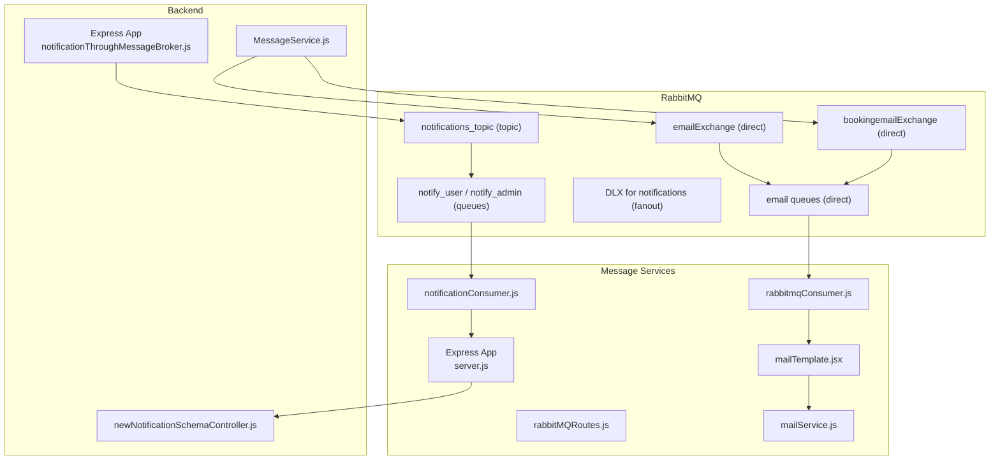
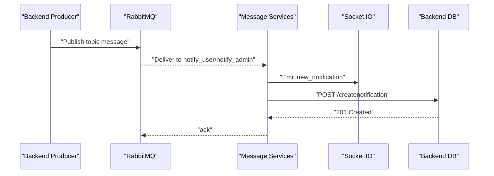
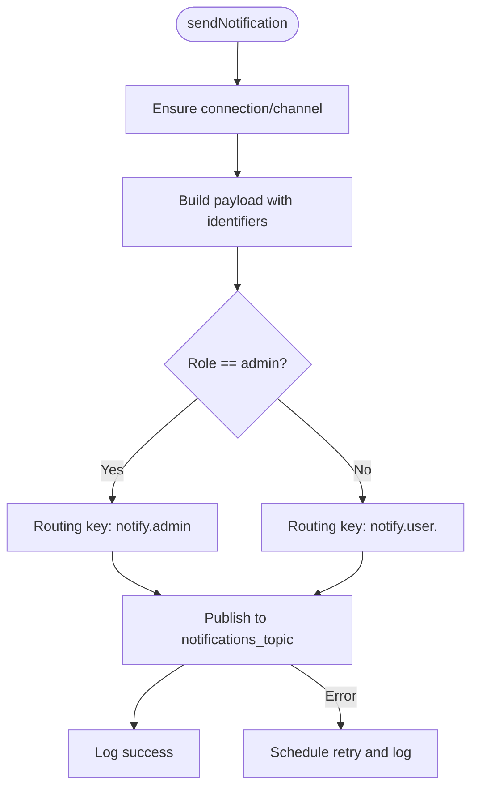
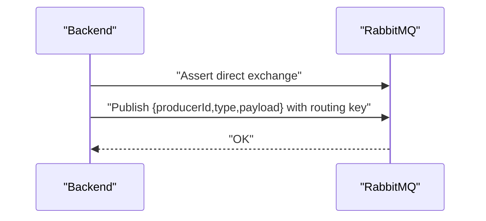
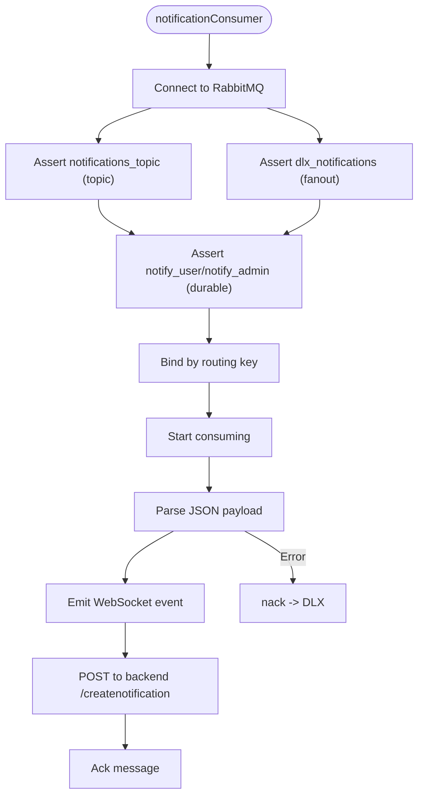
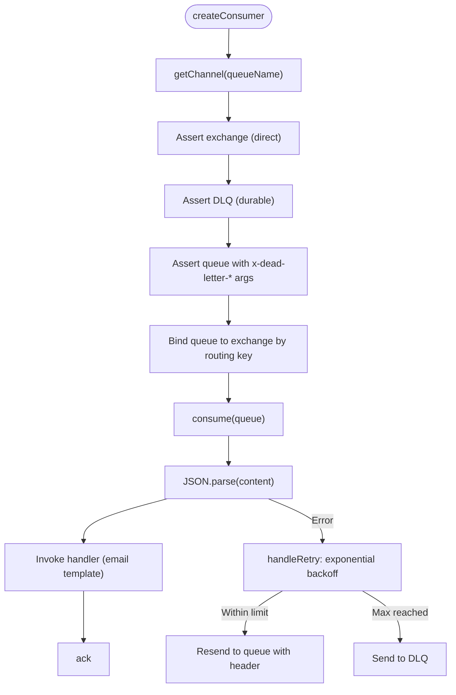
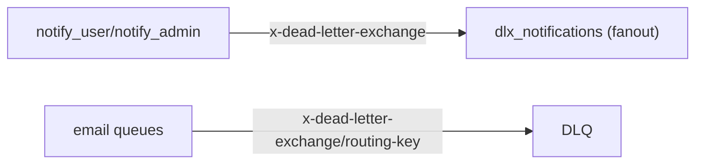
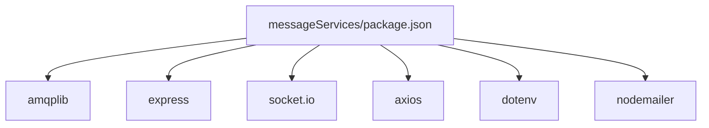

# Message Broker System

<cite>
**Referenced Files in This Document**
- [server.js](file://messageServices/server.js)
- [rabbitmqConsumer.js](file://messageServices/controller/rabbitmqConsumer.js)
- [notificationConsumer.js](file://messageServices/controller/notificationConsumer.js)
- [rabbitMQRoutes.js](file://messageServices/routes/rabbitMQRoutes.js)
- [rabbitmqProducer.js](file://messageServices/controller/rabbitmqProducer.js)
- [mailTemplate.jsx](file://messageServices/utils/mailTemplate.jsx)
- [mailService.js](file://messageServices/utils/mailService.js)
- [notificationThroughMessageBroker.js](file://backend/utils/notificationThroughMessageBroker.js)
- [MessageService.js](file://backend/NotificationServices/MessageService.js)
- [newNotificationSchemaController.js](file://backend/Controller/newNotificationSchemaController.js)
- [docker-compose.yml](file://docker-compose.yml)
- [package.json](file://messageServices/package.json)
</cite>

## Table of Contents
1. [Introduction](#introduction)
2. [Project Structure](#project-structure)
3. [Core Components](#core-components)
4. [Architecture Overview](#architecture-overview)
5. [Detailed Component Analysis](#detailed-component-analysis)
6. [Dependency Analysis](#dependency-analysis)
7. [Performance Considerations](#performance-considerations)
8. [Troubleshooting Guide](#troubleshooting-guide)
9. [Conclusion](#conclusion)
10. [Appendices](#appendices)

## Introduction
This document describes the RabbitMQ-based message broker system used to decouple backend database changes from notification delivery. It covers the producer-consumer architecture, queue and exchange configuration, dead letter handling, routing strategies, retry mechanisms, and the separate message services microservice. It also documents monitoring approaches, queue inspection tools, and performance optimization for high-throughput messaging, along with ordering guarantees, idempotency patterns, and error handling strategies.

## Project Structure
The system comprises:
- Backend service that emits notifications on a topic exchange and enqueues email tasks on direct exchanges.
- A dedicated message services microservice that consumes queues, handles retries, and delivers notifications via WebSocket and persists them to the backend.
- Docker Compose orchestrating RabbitMQ, backend, and message services.

**Diagram sources**
- [server.js](file://messageServices/server.js#L1-L84)
- [notificationThroughMessageBroker.js](file://backend/utils/notificationThroughMessageBroker.js#L1-L69)
- [MessageService.js](file://backend/NotificationServices/MessageService.js#L1-L65)
- [rabbitmqConsumer.js](file://messageServices/controller/rabbitmqConsumer.js#L1-L216)
- [notificationConsumer.js](file://messageServices/controller/notificationConsumer.js#L1-L119)
- [rabbitMQRoutes.js](file://messageServices/routes/rabbitMQRoutes.js#L1-L26)
- [mailTemplate.jsx](file://messageServices/utils/mailTemplate.jsx#L1-L792)
- [mailService.js](file://messageServices/utils/mailService.js#L1-L16)
- [newNotificationSchemaController.js](file://backend/Controller/newNotificationSchemaController.js#L1-L112)

**Section sources**
- [docker-compose.yml](file://docker-compose.yml#L1-L54)
- [package.json](file://messageServices/package.json#L1-L22)

## Core Components
- Backend notification producer: publishes topic messages for user/admin notifications.
- Backend email producer: publishes direct messages for email tasks with structured payloads.
- Notification consumer (message services): subscribes to topic exchange, routes per role, retries with dead letter exchange, emits WebSocket events, and persists to backend.
- Email consumers (message services): subscribe to direct exchanges, parse payloads, and send emails via SMTP.
- Routing: topic routing for notifications, direct routing for emails, dead letter exchanges for both.

**Section sources**
- [notificationThroughMessageBroker.js](file://backend/utils/notificationThroughMessageBroker.js#L1-L69)
- [MessageService.js](file://backend/NotificationServices/MessageService.js#L1-L65)
- [notificationConsumer.js](file://messageServices/controller/notificationConsumer.js#L1-L119)
- [rabbitmqConsumer.js](file://messageServices/controller/rabbitmqConsumer.js#L1-L216)

## Architecture Overview
The system separates concerns:
- Producers live in the backend and emit domain events as messages.
- Consumers in the message services microservice handle delivery, retries, and persistence.
- Dead letter exchanges capture failed messages for later inspection and remediation.
- WebSocket broadcasting ensures real-time UI updates.

**Diagram sources**
- [notificationThroughMessageBroker.js](file://backend/utils/notificationThroughMessageBroker.js#L33-L64)
- [notificationConsumer.js](file://messageServices/controller/notificationConsumer.js#L63-L90)
- [newNotificationSchemaController.js](file://backend/Controller/newNotificationSchemaController.js#L7-L29)

## Detailed Component Analysis

### Backend Notification Producer
- Connects to RabbitMQ and asserts a durable topic exchange.
- Builds a structured payload with identifiers and timestamps.
- Publishes to routing keys based on role (admin vs user-specific).
- Retries publishing on failure with exponential backoff.

**Diagram sources**
- [notificationThroughMessageBroker.js](file://backend/utils/notificationThroughMessageBroker.js#L33-L64)

**Section sources**
- [notificationThroughMessageBroker.js](file://backend/utils/notificationThroughMessageBroker.js#L1-L69)

### Backend Email Producer
- Connects to RabbitMQ and asserts direct exchanges for email and booking-related tasks.
- Wraps email data in a standardized payload with metadata.
- Publishes with persistence enabled.

**Diagram sources**
- [MessageService.js](file://backend/NotificationServices/MessageService.js#L36-L60)

**Section sources**
- [MessageService.js](file://backend/NotificationServices/MessageService.js#L1-L65)

### Notification Consumer (Message Services)
- Establishes a durable connection and channel.
- Asserts topic exchange and fanout dead letter exchange.
- Creates queues with dead letter exchange arguments.
- Binds queues by routing pattern (admin vs user.*).
- On successful processing: emits WebSocket events and posts to backend.
- On failure: nacks to move to dead letter exchange.

**Diagram sources**
- [notificationConsumer.js](file://messageServices/controller/notificationConsumer.js#L37-L91)

**Section sources**
- [notificationConsumer.js](file://messageServices/controller/notificationConsumer.js#L1-L119)

### Email Consumers (Message Services)
- Maintains a shared connection and per-queue channels.
- Asserts exchanges and queues with dead letter arguments.
- Consumes messages, parses payload, and invokes templated handlers.
- Implements exponential backoff retry and moves to DLQ on max retries.

**Diagram sources**
- [rabbitmqConsumer.js](file://messageServices/controller/rabbitmqConsumer.js#L85-L130)
- [rabbitmqConsumer.js](file://messageServices/controller/rabbitmqConsumer.js#L61-L83)

**Section sources**
- [rabbitmqConsumer.js](file://messageServices/controller/rabbitmqConsumer.js#L1-L216)

### Dead Letter Exchange Handling
- Notifications: queue configured with dead letter exchange argument; on nack, message routed to DLX.
- Emails: queues configured with dead letter exchange and routing key; on max retries, moved to DLQ.
- DLX for notifications is fanout; email consumers define per-queue DLQ names.

**Diagram sources**
- [notificationConsumer.js](file://messageServices/controller/notificationConsumer.js#L47-L53)
- [rabbitmqConsumer.js](file://messageServices/controller/rabbitmqConsumer.js#L99-L105)

**Section sources**
- [notificationConsumer.js](file://messageServices/controller/notificationConsumer.js#L44-L53)
- [rabbitmqConsumer.js](file://messageServices/controller/rabbitmqConsumer.js#L96-L105)

### Message Serialization and Routing Strategies
- Topic routing for notifications: routing keys include role and user scope.
- Direct routing for emails: routing keys mapped to specific tasks.
- Payload structure includes metadata (producerId, type, timestamp) and a payload object for handlers.

**Section sources**
- [notificationThroughMessageBroker.js](file://backend/utils/notificationThroughMessageBroker.js#L33-L54)
- [MessageService.js](file://backend/NotificationServices/MessageService.js#L36-L54)
- [rabbitmqConsumer.js](file://messageServices/controller/rabbitmqConsumer.js#L133-L204)

### Retry Mechanisms for Failed Deliveries
- Notification consumer: nack moves to DLX; backend save uses retries with backoff.
- Email consumers: exponential backoff with max retries; on exhaustion, send to DLQ.

**Section sources**
- [notificationConsumer.js](file://messageServices/controller/notificationConsumer.js#L82-L116)
- [rabbitmqConsumer.js](file://messageServices/controller/rabbitmqConsumer.js#L61-L83)

### Examples of Producer, Consumer, and Queue Management
- Producer examples:
  - Backend notification producer: [notificationThroughMessageBroker.js](file://backend/utils/notificationThroughMessageBroker.js#L33-L64)
  - Backend email producer: [MessageService.js](file://backend/NotificationServices/MessageService.js#L36-L60)
- Consumer examples:
  - Notification consumer: [notificationConsumer.js](file://messageServices/controller/notificationConsumer.js#L37-L91)
  - Email consumers: [rabbitmqConsumer.js](file://messageServices/controller/rabbitmqConsumer.js#L133-L213)
- Queue management:
  - Assert exchanges and queues with durability and dead letter arguments: [notificationConsumer.js](file://messageServices/controller/notificationConsumer.js#L41-L53), [rabbitmqConsumer.js](file://messageServices/controller/rabbitmqConsumer.js#L96-L105)

**Section sources**
- [notificationThroughMessageBroker.js](file://backend/utils/notificationThroughMessageBroker.js#L1-L69)
- [MessageService.js](file://backend/NotificationServices/MessageService.js#L1-L65)
- [notificationConsumer.js](file://messageServices/controller/notificationConsumer.js#L1-L119)
- [rabbitmqConsumer.js](file://messageServices/controller/rabbitmqConsumer.js#L1-L216)

## Dependency Analysis
- messageServices depends on amqplib, express, socket.io, axios, dotenv, nodemailer.
- Backend producers depend on amqplib and environment variables for RabbitMQ URL.
- Consumers depend on mail templates and SMTP transport.

**Diagram sources**
- [package.json](file://messageServices/package.json#L11-L20)

**Section sources**
- [package.json](file://messageServices/package.json#L1-L22)

## Performance Considerations
- Connection reuse: maintain long-lived connections and channels to reduce overhead.
- Per-queue channels: dedicated channels per consumer queue improve throughput isolation.
- Persistence: enable persistent delivery for reliability; consider batching where appropriate.
- Backoff strategies: exponential backoff reduces thundering herds during outages.
- Monitoring: use RabbitMQ management UI and metrics to track queue lengths, consumer lag, and error rates.
- Scaling: horizontally scale consumers behind the same queue for parallelism; for topic routing, consider sharding by routing key prefix.

[No sources needed since this section provides general guidance]

## Troubleshooting Guide
- Connection failures:
  - Verify RabbitMQ URL and credentials in environment variables.
  - Check heartbeat settings for cloud providers.
- Consumer not receiving messages:
  - Confirm exchange and queue assertions and bindings.
  - Validate routing keys match binding patterns.
- Messages stuck in DLQ:
  - Inspect DLQ contents and fix underlying handler errors.
  - Replay messages after corrections.
- Backend persistence failures:
  - Review retries and logs; ensure backend endpoint is reachable.

**Section sources**
- [notificationConsumer.js](file://messageServices/controller/notificationConsumer.js#L16-L35)
- [rabbitmqConsumer.js](file://messageServices/controller/rabbitmqConsumer.js#L30-L48)
- [docker-compose.yml](file://docker-compose.yml#L19-L49)

## Conclusion
The system leverages RabbitMQ topic and direct exchanges to decouple producers and consumers, ensuring reliable delivery and scalability. Dead letter exchanges provide robust error handling, while WebSocket broadcasting enables real-time user notifications. With proper monitoring and retry strategies, the system supports high-throughput messaging under production loads.

[No sources needed since this section summarizes without analyzing specific files]

## Appendices

### Monitoring and Queue Inspection Tools
- RabbitMQ Management UI: inspect queues, exchanges, bindings, and DLQs.
- Metrics: consumer lag, message rates, memory and disk usage.
- Logging: integrate structured logging for observability.

[No sources needed since this section provides general guidance]

### Message Ordering Guarantees and Idempotency Patterns
- Ordering: per-queue FIFO; for cross-partition ordering, use a single queue or partition by user ID.
- Idempotency: use notificationId in payloads to deduplicate backend writes; validate uniqueness before persisting.

[No sources needed since this section provides general guidance]