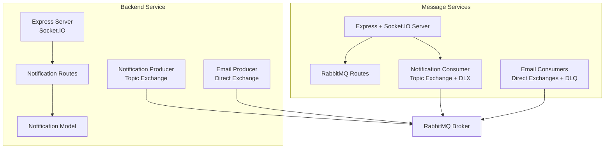
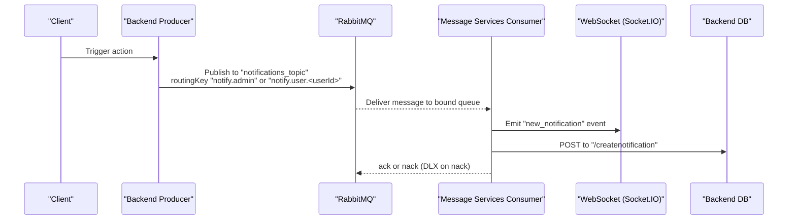
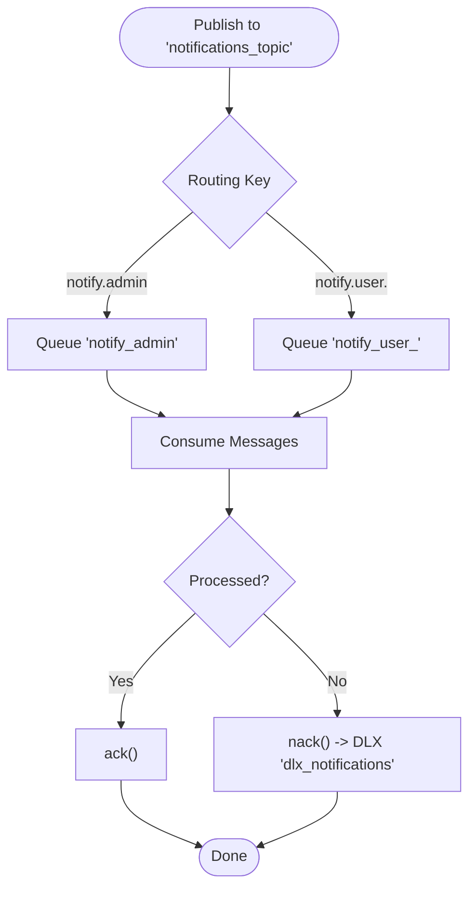
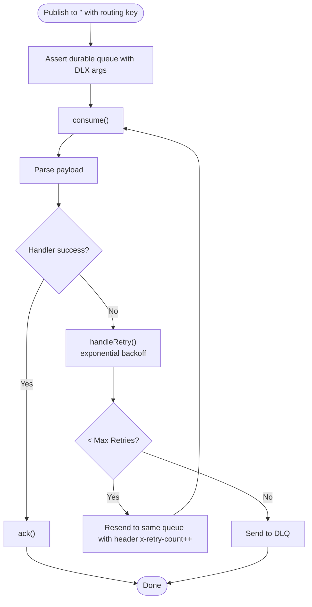
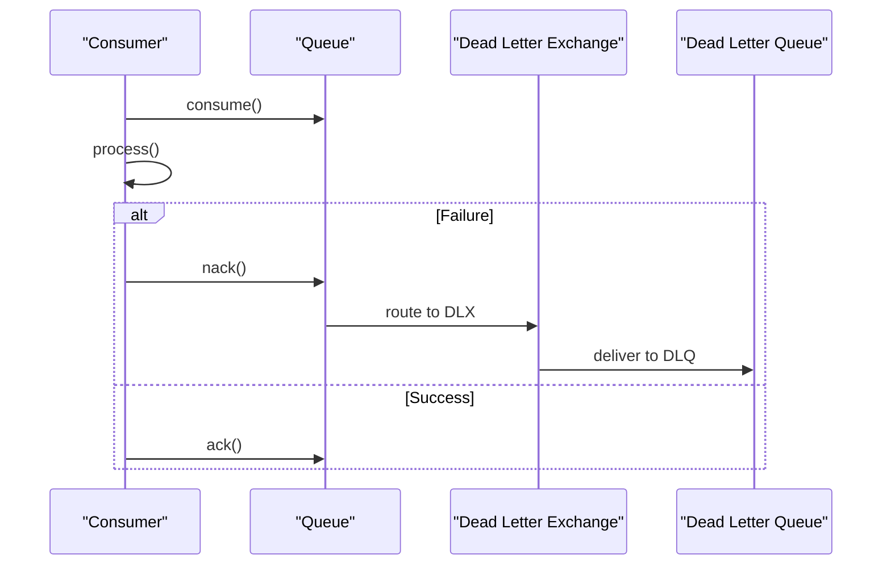
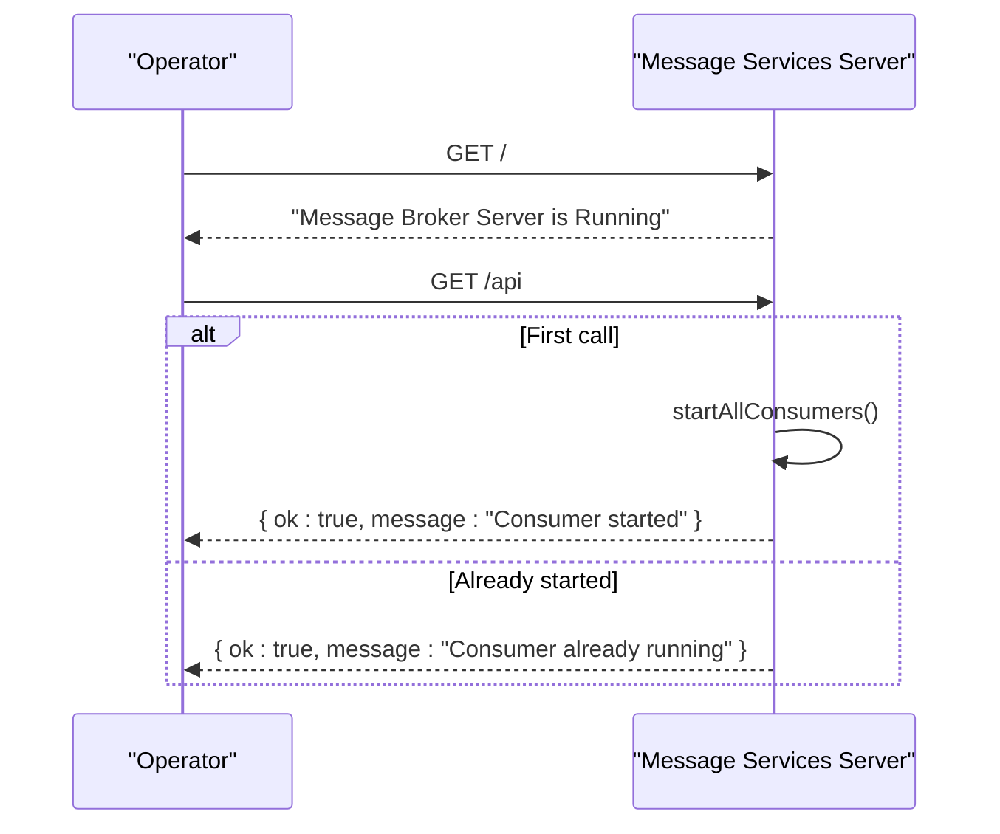
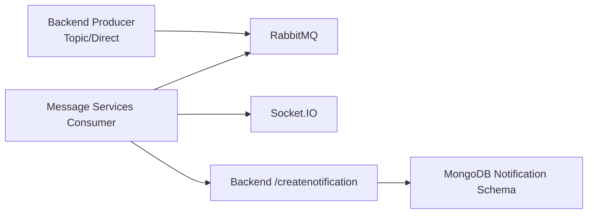

# Queue Management

<cite>
**Referenced Files in This Document**
- [rabbitmqConsumer.js](file://messageServices/controller/rabbitmqConsumer.js)
- [notificationConsumer.js](file://messageServices/controller/notificationConsumer.js)
- [rabbitMQRoutes.js](file://messageServices/routes/rabbitMQRoutes.js)
- [server.js](file://messageServices/server.js)
- [notificationThroughMessageBroker.js](file://backend/utils/notificationThroughMessageBroker.js)
- [MessageService.js](file://backend/NotificationServices/MessageService.js)
- [docker-compose.yml](file://docker-compose.yml)
- [notificationRoutes.js](file://backend/router/notificationRoutes.js)
- [notificationSchema.js](file://backend/model/notificationSchema.js)
</cite>

## Table of Contents
1. [Introduction](#introduction)
2. [Project Structure](#project-structure)
3. [Core Components](#core-components)
4. [Architecture Overview](#architecture-overview)
5. [Detailed Component Analysis](#detailed-component-analysis)
6. [Dependency Analysis](#dependency-analysis)
7. [Performance Considerations](#performance-considerations)
8. [Troubleshooting Guide](#troubleshooting-guide)
9. [Conclusion](#conclusion)
10. [Appendices](#appendices)

## Introduction
This document explains the RabbitMQ queue management and routing configuration used for notification delivery and email processing in the system. It covers:
- Exchange types and routing patterns
- Dead letter exchange (DLX) setup and retry mechanisms
- Queue durability and persistence
- Health checks and runtime controls
- Monitoring and administration guidance
- Scaling and performance strategies for high-volume scenarios

## Project Structure
The message broker system spans two services:
- A dedicated message services module that consumes notifications and emails
- The backend service that produces notifications and persists notifications to MongoDB

**Diagram sources**
- [server.js](file://messageServices/server.js#L1-L84)
- [rabbitMQRoutes.js](file://messageServices/routes/rabbitMQRoutes.js#L1-L26)
- [notificationConsumer.js](file://messageServices/controller/notificationConsumer.js#L1-L119)
- [rabbitmqConsumer.js](file://messageServices/controller/rabbitmqConsumer.js#L1-L216)
- [notificationThroughMessageBroker.js](file://backend/utils/notificationThroughMessageBroker.js#L1-L69)
- [MessageService.js](file://backend/NotificationServices/MessageService.js#L1-L65)

**Section sources**
- [server.js](file://messageServices/server.js#L1-L84)
- [docker-compose.yml](file://docker-compose.yml#L1-L54)

## Core Components
- Notification producers (topic exchange) in the backend publish messages to routing keys like notify.admin and notify.user.<userId>.
- Notification consumers in the message services subscribe to queues bound by role-based routing keys and forward messages to WebSocket clients and persist to the backend.
- Email producers (direct exchange) publish email tasks to routing keys such as task.newvehicleadded, which are consumed by dedicated email consumers.
- Dead letter exchanges and dead letter queues are configured to isolate failed messages after retries.

**Section sources**
- [notificationThroughMessageBroker.js](file://backend/utils/notificationThroughMessageBroker.js#L1-L69)
- [notificationConsumer.js](file://messageServices/controller/notificationConsumer.js#L1-L119)
- [MessageService.js](file://backend/NotificationServices/MessageService.js#L1-L65)
- [rabbitmqConsumer.js](file://messageServices/controller/rabbitmqConsumer.js#L1-L216)

## Architecture Overview
The system uses two primary exchanges:
- Topic exchange for real-time notifications
- Direct exchange for email tasks

Queues are durable and use dead lettering for failure handling. Consumers acknowledge processed messages and move failed messages to dead letter destinations.

**Diagram sources**
- [notificationThroughMessageBroker.js](file://backend/utils/notificationThroughMessageBroker.js#L33-L64)
- [notificationConsumer.js](file://messageServices/controller/notificationConsumer.js#L37-L91)
- [notificationRoutes.js](file://backend/router/notificationRoutes.js#L7-L10)

## Detailed Component Analysis

### Notification Delivery Pipeline (Topic Exchange)
- Exchange: notifications_topic (topic)
- Routing:
  - notify.admin for admin broadcasts
  - notify.user.<userId> for targeted user notifications
- Consumer behavior:
  - Creates durable exchange and queue
  - Binds queue to exchange with role-specific routing keys
  - On successful processing, acknowledges; on error, nacks to DLX
- DLX: fanout exchange configured for dead lettering

**Diagram sources**
- [notificationConsumer.js](file://messageServices/controller/notificationConsumer.js#L37-L91)
- [notificationThroughMessageBroker.js](file://backend/utils/notificationThroughMessageBroker.js#L33-L64)

**Section sources**
- [notificationConsumer.js](file://messageServices/controller/notificationConsumer.js#L1-L119)
- [notificationThroughMessageBroker.js](file://backend/utils/notificationThroughMessageBroker.js#L1-L69)

### Email Task Pipeline (Direct Exchange)
- Exchange: emailExchange and bookingemailExchange (direct)
- Routing keys:
  - task.newvehicleadded, task.vehicleUpdated, task.vehicleDeleted, task.usercreated, task.sendotp, task.userPasswordChanged, task.forgotPassword, task.contactus
  - bookingtask.userbookedvehicle, bookingtask.userbookedvehiclestatusupdate
- Consumer behavior:
  - Asserts exchange and durable queues
  - Declares dead letter queue per main queue (x-dead-letter-exchange and x-dead-letter-routing-key)
  - Parses payload and invokes email handlers
  - Retries with exponential backoff; moves to DLQ after max retries

**Diagram sources**
- [rabbitmqConsumer.js](file://messageServices/controller/rabbitmqConsumer.js#L62-L83)
- [rabbitmqConsumer.js](file://messageServices/controller/rabbitmqConsumer.js#L96-L130)

**Section sources**
- [rabbitmqConsumer.js](file://messageServices/controller/rabbitmqConsumer.js#L1-L216)

### Dead Letter Exchange and Retry Mechanisms
- Notification pipeline:
  - Queue argument sets dead letter exchange to a fanout DLX
  - On processing errors, message is nacked and routed to DLX
- Email pipeline:
  - Queue argument sets dead letter exchange to empty (default exchange) and routing key to the DLQ name
  - Retry uses exponential backoff with a configurable max retry count; after max retries, message is sent to DLQ

**Diagram sources**
- [notificationConsumer.js](file://messageServices/controller/notificationConsumer.js#L82-L84)
- [rabbitmqConsumer.js](file://messageServices/controller/rabbitmqConsumer.js#L77-L83)

**Section sources**
- [notificationConsumer.js](file://messageServices/controller/notificationConsumer.js#L1-L119)
- [rabbitmqConsumer.js](file://messageServices/controller/rabbitmqConsumer.js#L1-L216)

### Queue Persistence and Durability
- All queues are declared durable to survive broker restarts.
- Messages are published as persistent to ensure durability on disk.
- Exchanges are durable to preserve bindings and routing after restarts.

**Section sources**
- [notificationConsumer.js](file://messageServices/controller/notificationConsumer.js#L42-L53)
- [rabbitmqConsumer.js](file://messageServices/controller/rabbitmqConsumer.js#L96-L105)
- [MessageService.js](file://backend/NotificationServices/MessageService.js#L36-L60)
- [notificationThroughMessageBroker.js](file://backend/utils/notificationThroughMessageBroker.js#L21-L54)

### Health Checks and Runtime Controls
- Message services health endpoint:
  - GET "/" returns a simple status message indicating the server is running
- Consumer lifecycle:
  - GET "/api" starts all consumers once; subsequent calls indicate consumers are already running
- Backend health:
  - The backend exposes a base route "/" and notification routes for CRUD operations

**Diagram sources**
- [server.js](file://messageServices/server.js#L28-L29)
- [rabbitMQRoutes.js](file://messageServices/routes/rabbitMQRoutes.js#L9-L23)

**Section sources**
- [server.js](file://messageServices/server.js#L1-L84)
- [rabbitMQRoutes.js](file://messageServices/routes/rabbitMQRoutes.js#L1-L26)

### Queue Administration and Monitoring Guidance
Note: The following commands are administrative examples. Use your RabbitMQ management interface or CLI to inspect queues and DLQs.

- Declare exchanges and queues (conceptual steps):
  - Declare topic exchange for notifications
  - Declare direct exchanges for email tasks
  - Declare durable queues with dead letter arguments
  - Bind queues to exchanges with appropriate routing keys
- Inspect queue depths:
  - Use management UI or CLI to observe queue length and consumer counts
- Manage message backlog:
  - Increase consumer concurrency by scaling the message services container
  - Adjust prefetch count to balance load across consumers
  - Monitor DLQs and replay messages after resolving issues
- Health checks:
  - Verify connectivity to RabbitMQ using the health endpoints
  - Confirm consumers are active and processing messages

[No sources needed since this section provides general guidance]

## Dependency Analysis
- Backend producers depend on RabbitMQ connectivity and exchange definitions.
- Message services consumers depend on durable queues and DLX configuration.
- Notification persistence depends on backend routes and MongoDB model.

**Diagram sources**
- [notificationThroughMessageBroker.js](file://backend/utils/notificationThroughMessageBroker.js#L33-L64)
- [notificationConsumer.js](file://messageServices/controller/notificationConsumer.js#L37-L91)
- [notificationRoutes.js](file://backend/router/notificationRoutes.js#L7-L10)
- [notificationSchema.js](file://backend/model/notificationSchema.js#L1-L13)

**Section sources**
- [notificationThroughMessageBroker.js](file://backend/utils/notificationThroughMessageBroker.js#L1-L69)
- [notificationConsumer.js](file://messageServices/controller/notificationConsumer.js#L1-L119)
- [notificationRoutes.js](file://backend/router/notificationRoutes.js#L1-L14)
- [notificationSchema.js](file://backend/model/notificationSchema.js#L1-L13)

## Performance Considerations
- Use durable and persistent messages for reliability under load.
- Prefer topic exchange for scalable fan-out notifications; bind queues per role to reduce unnecessary processing.
- Implement prefetch limits to control concurrent processing per channel.
- Scale horizontally by running multiple instances of the message services container; each instance manages its own channel and consumes from the same queues.
- Separate high-throughput workloads (emails vs. notifications) onto distinct exchanges and queues to avoid contention.
- Monitor queue depths and consumer lag; adjust container replicas and resource limits accordingly.

[No sources needed since this section provides general guidance]

## Troubleshooting Guide
Common issues and remedies:
- Consumers not starting:
  - Call the consumer route to initialize; ensure RabbitMQ URL is correct
- Messages stuck in queues:
  - Inspect DLQs for failed messages; resolve root causes and replay messages
- Connection drops:
  - Both producers and consumers implement reconnect logic; verify network and credentials
- Duplicate deliveries:
  - Ensure idempotent handlers and proper acknowledgment/nack behavior
- Backend save failures:
  - Notification consumer retries against backend; confirm backend availability and route correctness

**Section sources**
- [rabbitMQRoutes.js](file://messageServices/routes/rabbitMQRoutes.js#L9-L23)
- [notificationConsumer.js](file://messageServices/controller/notificationConsumer.js#L16-L35)
- [notificationConsumer.js](file://messageServices/controller/notificationConsumer.js#L94-L116)
- [notificationThroughMessageBroker.js](file://backend/utils/notificationThroughMessageBroker.js#L8-L30)

## Conclusion
The system employs a robust, durable, and resilient message broker architecture:
- Topic exchange for scalable notification delivery with role-based routing
- Direct exchange for reliable email task processing
- Dead lettering and retry mechanisms for fault tolerance
- Clear health endpoints and operational controls for runtime management

[No sources needed since this section summarizes without analyzing specific files]

## Appendices

### Environment and Deployment Notes
- RabbitMQ URL and credentials are provided via environment variables in the compose file.
- Backend and message services containers depend on the RabbitMQ service.

**Section sources**
- [docker-compose.yml](file://docker-compose.yml#L19-L49)