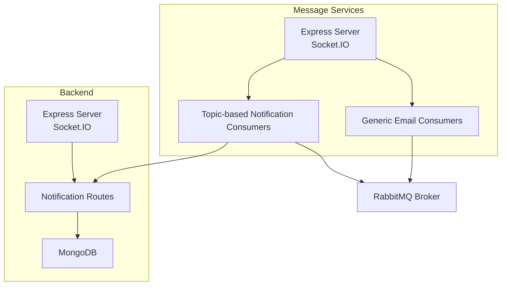
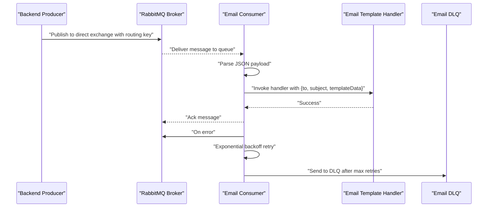
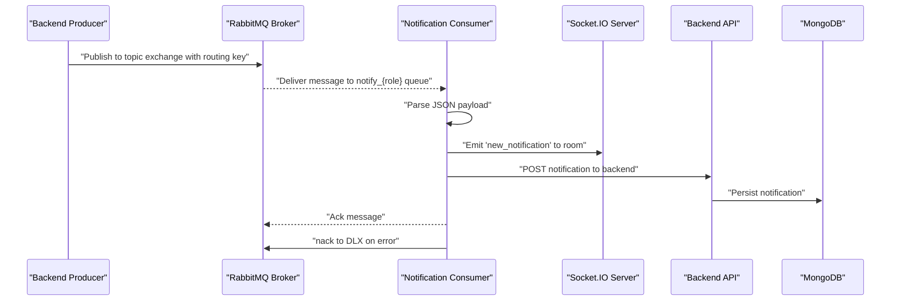
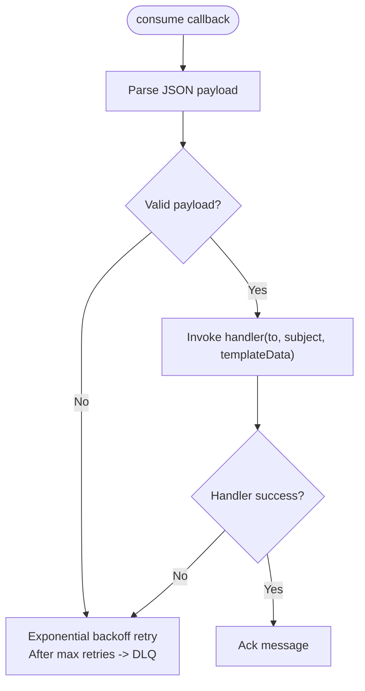
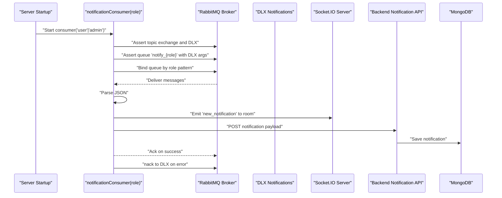
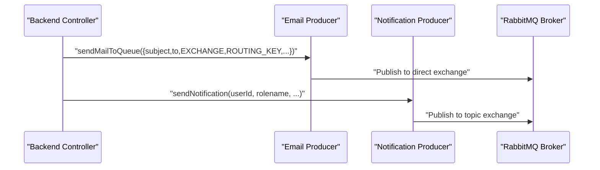
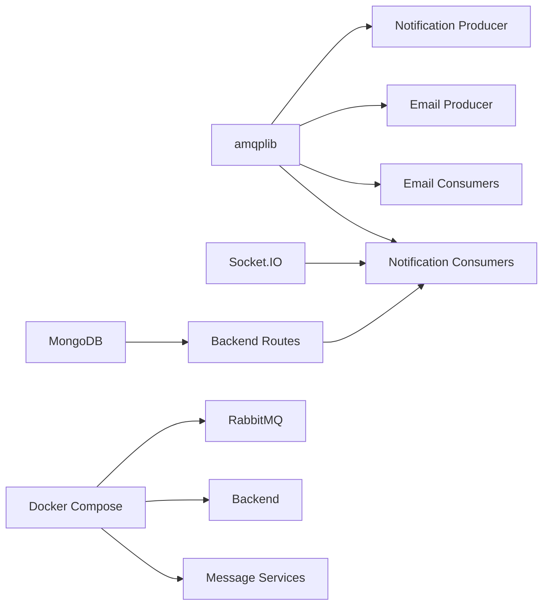

# RabbitMQ Consumers

<cite>
**Referenced Files in This Document**
- [rabbitmqConsumer.js](file://messageServices/controller/rabbitmqConsumer.js)
- [notificationConsumer.js](file://messageServices/controller/notificationConsumer.js)
- [notificationThroughMessageBroker.js](file://backend/utils/notificationThroughMessageBroker.js)
- [MessageService.js](file://backend/NotificationServices/MessageService.js)
- [server.js (messageServices)](file://messageServices/server.js)
- [rabbitMQRoutes.js](file://messageServices/routes/rabbitMQRoutes.js)
- [server.js (backend)](file://backend/server.js)
- [docker-compose.yml](file://docker-compose.yml)
- [mailTemplate.jsx](file://messageServices/utils/mailTemplate.jsx)
- [notificationRoutes.js](file://backend/router/notificationRoutes.js)
- [notificationSchema.js](file://backend/model/notificationSchema.js)
</cite>

## Table of Contents
1. [Introduction](#introduction)
2. [Project Structure](#project-structure)
3. [Core Components](#core-components)
4. [Architecture Overview](#architecture-overview)
5. [Detailed Component Analysis](#detailed-component-analysis)
6. [Dependency Analysis](#dependency-analysis)
7. [Performance Considerations](#performance-considerations)
8. [Troubleshooting Guide](#troubleshooting-guide)
9. [Conclusion](#conclusion)
10. [Appendices](#appendices)

## Introduction
This document explains the RabbitMQ consumer architecture and message processing pipeline used for two domains:
- Email notifications (based on direct exchanges and routing keys)
- Real-time user/admin notifications (based on topic exchanges, room-based routing, and WebSocket delivery)

It covers consumer registration, connection establishment, message acknowledgment, dual-consumer model, room-based routing, delivery guarantees, deserialization and error handling, dead letter exchange processing, lifecycle and reconnection, load balancing, and performance tuning.

## Project Structure
The system comprises:
- A dedicated message services application hosting RabbitMQ consumers and a WebSocket server
- A backend application exposing REST APIs and persisting notifications
- A Docker Compose setup orchestrating RabbitMQ, backend, and consumer services

**Diagram sources**
- [server.js (messageServices)](file://messageServices/server.js#L1-L84)
- [rabbitmqConsumer.js](file://messageServices/controller/rabbitmqConsumer.js#L1-L216)
- [notificationConsumer.js](file://messageServices/controller/notificationConsumer.js#L1-L119)
- [notificationThroughMessageBroker.js](file://backend/utils/notificationThroughMessageBroker.js#L1-L69)
- [server.js (backend)](file://backend/server.js#L1-L204)
- [docker-compose.yml](file://docker-compose.yml#L1-L54)

**Section sources**
- [server.js (messageServices)](file://messageServices/server.js#L1-L84)
- [server.js (backend)](file://backend/server.js#L1-L204)
- [docker-compose.yml](file://docker-compose.yml#L1-L54)

## Core Components
- Generic email consumers: consume from direct exchanges, parse JSON payloads, and dispatch to templated email handlers. They use per-queue dead-letter exchanges and exponential backoff retry logic.
- Topic-based notification consumers: consume from a topic exchange, route by role and user room, emit WebSocket events, and persist notifications to the backend.
- Producers: backend producers publish to direct exchanges for emails and to a topic exchange for notifications.

Key responsibilities:
- Connection management and reconnection
- Queue and exchange assertions with durability
- Dead lettering and retries
- Ack/nack semantics
- Room-based routing and WebSocket emission
- Backend persistence of notifications

**Section sources**
- [rabbitmqConsumer.js](file://messageServices/controller/rabbitmqConsumer.js#L1-L216)
- [notificationConsumer.js](file://messageServices/controller/notificationConsumer.js#L1-L119)
- [notificationThroughMessageBroker.js](file://backend/utils/notificationThroughMessageBroker.js#L1-L69)
- [MessageService.js](file://backend/NotificationServices/MessageService.js#L1-L65)

## Architecture Overview
The system implements a dual-consumer model:
- Email consumers: one consumer per routing key, each with its own queue and DLQ
- Notification consumers: one consumer per role (admin/user), each with its own queue bound to the topic exchange

**Diagram sources**
- [rabbitmqConsumer.js](file://messageServices/controller/rabbitmqConsumer.js#L85-L130)
- [mailTemplate.jsx](file://messageServices/utils/mailTemplate.jsx#L1-L792)

**Diagram sources**
- [notificationConsumer.js](file://messageServices/controller/notificationConsumer.js#L37-L91)
- [notificationThroughMessageBroker.js](file://backend/utils/notificationThroughMessageBroker.js#L33-L64)
- [notificationRoutes.js](file://backend/router/notificationRoutes.js#L1-L14)
- [notificationSchema.js](file://backend/model/notificationSchema.js#L1-L13)

## Detailed Component Analysis

### Generic Email Consumers
- Registration: A list of consumers defines exchange, routing key, queue, DLQ, and handler. Each consumer is created via a generic factory that asserts exchange, queue with DLX arguments, binds queue to exchange, and starts consuming.
- Deserialization: Messages are expected to be JSON with a payload containing subject, to, and templateData.
- Acknowledgment: On successful handler completion, the message is acknowledged; otherwise, exponential backoff retry is applied, and after max retries, the message is sent to the DLQ.
- Delivery guarantees: Durable exchanges and queues, persistent publishing, and DLX ensure messages are not lost.

**Diagram sources**
- [rabbitmqConsumer.js](file://messageServices/controller/rabbitmqConsumer.js#L109-L124)
- [rabbitmqConsumer.js](file://messageServices/controller/rabbitmqConsumer.js#L61-L83)

**Section sources**
- [rabbitmqConsumer.js](file://messageServices/controller/rabbitmqConsumer.js#L85-L130)
- [rabbitmqConsumer.js](file://messageServices/controller/rabbitmqConsumer.js#L132-L211)
- [mailTemplate.jsx](file://messageServices/utils/mailTemplate.jsx#L1-L792)

### Notification Consumers (Dual-Consumer Model)
- Registration: Two consumers are started at server boot, one for admin and one for user roles.
- Routing: Queues bind to the topic exchange using routing patterns: admin-specific and user wildcard pattern. Messages are routed to notify_admin and notify_user.{userId}.
- Room-based delivery: The Socket.IO server manages rooms for admin and user-specific rooms. The consumer emits to the appropriate room upon receiving a message.
- Persistence: The consumer posts the notification payload to the backend API, which persists it to MongoDB.
- Acknowledgment: On success, the message is acknowledged; on failure, it is nacked to the dead letter exchange.

**Diagram sources**
- [server.js (messageServices)](file://messageServices/server.js#L58-L62)
- [notificationConsumer.js](file://messageServices/controller/notificationConsumer.js#L37-L91)
- [notificationRoutes.js](file://backend/router/notificationRoutes.js#L1-L14)
- [notificationSchema.js](file://backend/model/notificationSchema.js#L1-L13)

**Section sources**
- [server.js (messageServices)](file://messageServices/server.js#L58-L62)
- [notificationConsumer.js](file://messageServices/controller/notificationConsumer.js#L37-L91)
- [notificationRoutes.js](file://backend/router/notificationRoutes.js#L1-L14)
- [notificationSchema.js](file://backend/model/notificationSchema.js#L1-L13)

### Producers
- Email producer: Sends messages to a direct exchange with routing keys mapped to tasks. Uses persistent delivery and ensures channel initialization.
- Notification producer: Publishes to a topic exchange with routing keys derived from role and user ID. Also initializes channel and exchange.

**Diagram sources**
- [MessageService.js](file://backend/NotificationServices/MessageService.js#L36-L60)
- [notificationThroughMessageBroker.js](file://backend/utils/notificationThroughMessageBroker.js#L33-L64)

**Section sources**
- [MessageService.js](file://backend/NotificationServices/MessageService.js#L1-L65)
- [notificationThroughMessageBroker.js](file://backend/utils/notificationThroughMessageBroker.js#L1-L69)

## Dependency Analysis
- Consumers depend on:
  - amqplib for RabbitMQ connectivity
  - Environment variables for RabbitMQ URL and backend service URL
  - Handlers for email templates and Socket.IO for real-time delivery
- Producers depend on:
  - amqplib for publishing
  - Backend routes for persistence
- Docker Compose ties services together and exposes ports for local development.

**Diagram sources**
- [rabbitmqConsumer.js](file://messageServices/controller/rabbitmqConsumer.js#L1-L216)
- [notificationConsumer.js](file://messageServices/controller/notificationConsumer.js#L1-L119)
- [notificationThroughMessageBroker.js](file://backend/utils/notificationThroughMessageBroker.js#L1-L69)
- [MessageService.js](file://backend/NotificationServices/MessageService.js#L1-L65)
- [server.js (messageServices)](file://messageServices/server.js#L1-L84)
- [server.js (backend)](file://backend/server.js#L1-L204)
- [docker-compose.yml](file://docker-compose.yml#L1-L54)

**Section sources**
- [docker-compose.yml](file://docker-compose.yml#L1-L54)

## Performance Considerations
- Prefetch and concurrency:
  - Current consumers do not explicitly set prefetch. Consider configuring channel-level prefetch to balance throughput and fairness across multiple consumers.
  - For high-volume queues, increase prefetch count to reduce round-trips and improve throughput.
- Memory management:
  - Long-running consumers should avoid retaining large buffers or accumulating state. Keep handlers stateless and acknowledge promptly.
- Heartbeats:
  - Connection heartbeats are configured differently per service. Ensure consistent and appropriate heartbeat intervals for stability.
- Backpressure:
  - Use separate queues per routing key or role to prevent hot-spotting and enable horizontal scaling.
- Persistence:
  - Persistent messages ensure durability but add latency. Evaluate trade-offs based on SLAs.

[No sources needed since this section provides general guidance]

## Troubleshooting Guide
Common issues and remedies:
- Connection failures:
  - Consumers reconnect automatically on close/error. Monitor logs for repeated reconnection attempts indicating broker unavailability.
- Message not delivered:
  - Verify exchange and queue durability, binding keys, and routing keys. Confirm DLX bindings and DLQ consumption.
- Malformed messages:
  - Consumers catch parsing errors and either retry or move to DLQ. Inspect DLQ content and fix producer payload format.
- Duplicate deliveries:
  - Ensure idempotent handlers and consider deduplication at the producer or consumer level.
- Backend persistence failures:
  - Notification consumer retries up to a maximum number of attempts before nacking to DLX. Investigate backend availability and payload correctness.

**Section sources**
- [rabbitmqConsumer.js](file://messageServices/controller/rabbitmqConsumer.js#L34-L48)
- [notificationConsumer.js](file://messageServices/controller/notificationConsumer.js#L16-L35)
- [notificationConsumer.js](file://messageServices/controller/notificationConsumer.js#L88-L91)

## Conclusion
The system implements a robust, scalable RabbitMQ-based notification pipeline with:
- Clear separation between email and real-time notification consumers
- Strong delivery guarantees via durable exchanges/queues, persistent messages, and DLX
- Idiomatic retry/backoff and error handling
- Room-based routing and WebSocket emission for real-time updates
- Producer-side routing aligned with consumer expectations

With minor adjustments to prefetch and heartbeat tuning, the architecture supports high-throughput, low-latency delivery across multiple consumer instances.

## Appendices

### Consumer Lifecycle and Startup
- Email consumers:
  - Started at module load via a factory that iterates over a consumers list and creates a consumer per entry.
  - Each consumer asserts exchange, queue with DLX arguments, binds queue, and starts consuming.
- Notification consumers:
  - Started at server boot for both admin and user roles.
  - Each consumer asserts topic exchange and DLX, creates a role-specific queue, binds according to routing rules, and consumes.

**Section sources**
- [rabbitmqConsumer.js](file://messageServices/controller/rabbitmqConsumer.js#L206-L216)
- [rabbitmqConsumer.js](file://messageServices/controller/rabbitmqConsumer.js#L132-L211)
- [server.js (messageServices)](file://messageServices/server.js#L58-L62)

### Message Acknowledgment Patterns
- Email consumers:
  - Ack on success; on error, apply exponential backoff retry and move to DLQ after max retries.
- Notification consumers:
  - Ack on success; on error, nack with requeue disabled to send to DLX.

**Section sources**
- [rabbitmqConsumer.js](file://messageServices/controller/rabbitmqConsumer.js#L118-L123)
- [rabbitmqConsumer.js](file://messageServices/controller/rabbitmqConsumer.js#L61-L83)
- [notificationConsumer.js](file://messageServices/controller/notificationConsumer.js#L80-L84)

### Dead Letter Exchange Processing
- Email consumers:
  - Per-queue DLX configured via queue arguments; messages are retried with increasing delays and moved to DLQ after max retries.
- Notification consumers:
  - Dedicated DLX exchange; failed messages are nacked to DLX for inspection and manual intervention.

**Section sources**
- [rabbitmqConsumer.js](file://messageServices/controller/rabbitmqConsumer.js#L99-L105)
- [notificationConsumer.js](file://messageServices/controller/notificationConsumer.js#L44-L53)
- [notificationConsumer.js](file://messageServices/controller/notificationConsumer.js#L82-L84)

### Room-Based Message Routing and Delivery Guarantees
- Topic exchange routing:
  - Admin notifications use a fixed routing key; user notifications use a pattern with user ID.
- Room-based delivery:
  - Socket.IO rooms for admin and user-specific IDs ensure targeted delivery.
- Persistence:
  - Backend API persists notifications to MongoDB for retrieval and read status tracking.

**Section sources**
- [notificationConsumer.js](file://messageServices/controller/notificationConsumer.js#L56-L60)
- [server.js (messageServices)](file://messageServices/server.js#L34-L53)
- [notificationRoutes.js](file://backend/router/notificationRoutes.js#L1-L14)
- [notificationSchema.js](file://backend/model/notificationSchema.js#L1-L13)

### Graceful Shutdown Procedures
- Current implementation focuses on reconnection and basic lifecycle. For graceful shutdown:
  - Close channels and connections on SIGTERM/SIGINT signals
  - Drain in-flight messages and wait for handlers to finish
  - Persist offsets for at-least-once semantics if needed

[No sources needed since this section provides general guidance]