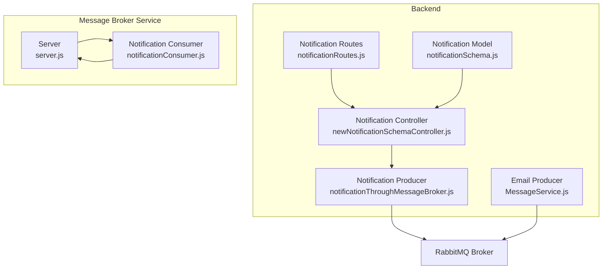
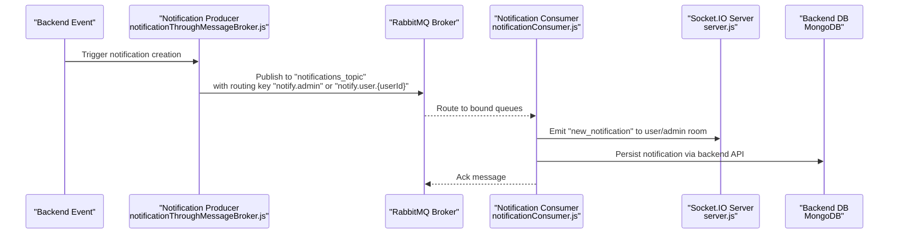
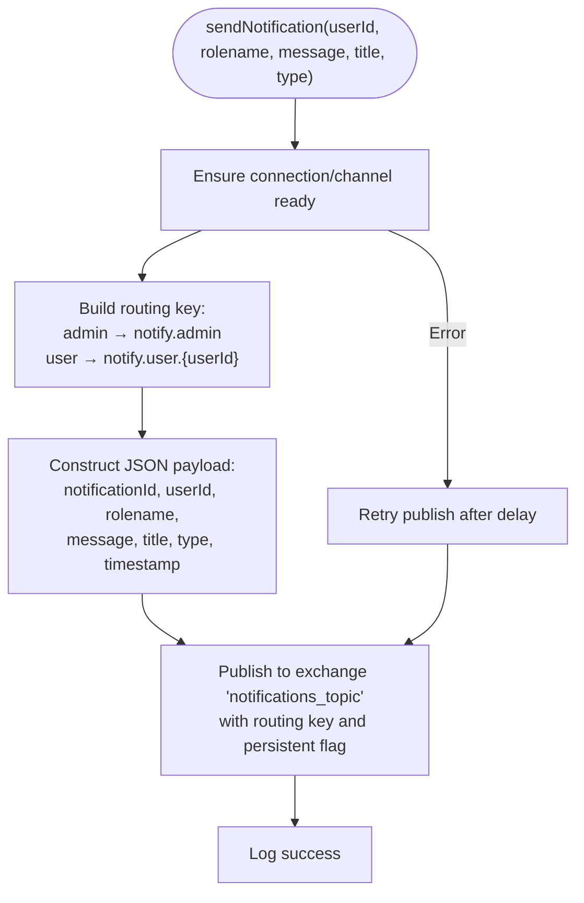
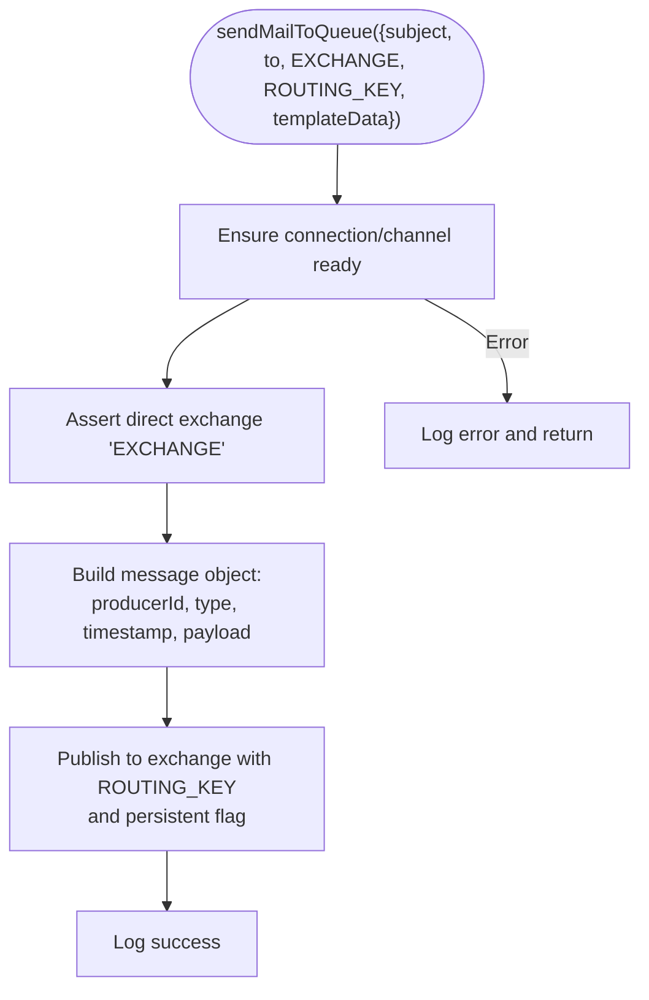
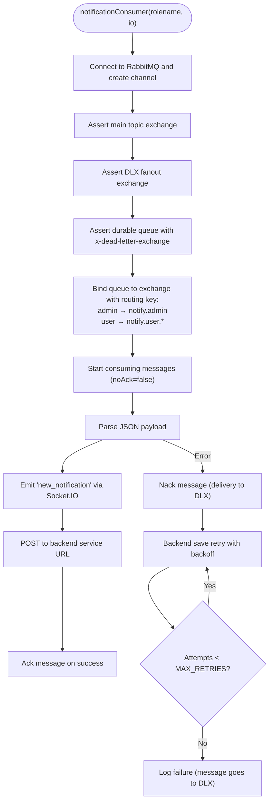
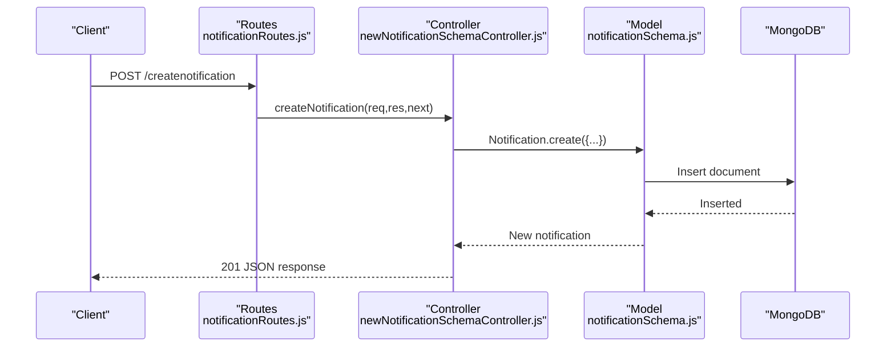
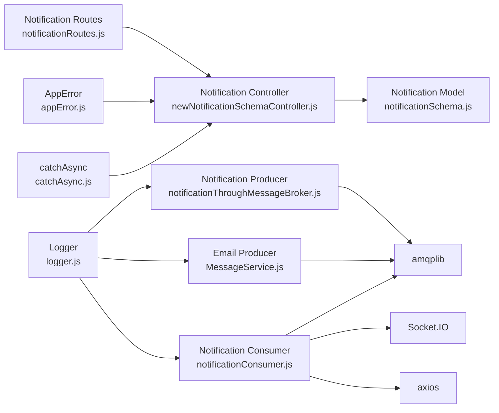

# RabbitMQ Producers

<cite>
**Referenced Files in This Document**
- [rabbitmqProducer.js](file://messageServices/controller/rabbitmqProducer.js)
- [notificationThroughMessageBroker.js](file://backend/utils/notificationThroughMessageBroker.js)
- [MessageService.js](file://backend/NotificationServices/MessageService.js)
- [notificationConsumer.js](file://messageServices/controller/notificationConsumer.js)
- [server.js](file://messageServices/server.js)
- [newNotificationSchemaController.js](file://backend/Controller/newNotificationSchemaController.js)
- [notificationRoutes.js](file://backend/router/notificationRoutes.js)
- [notificationSchema.js](file://backend/model/notificationSchema.js)
- [logger.js](file://backend/utils/logger.js)
- [appError.js](file://backend/utils/appError.js)
- [catchAsync.js](file://backend/utils/catchAsync.js)
</cite>

## Table of Contents
1. [Introduction](#introduction)
2. [Project Structure](#project-structure)
3. [Core Components](#core-components)
4. [Architecture Overview](#architecture-overview)
5. [Detailed Component Analysis](#detailed-component-analysis)
6. [Dependency Analysis](#dependency-analysis)
7. [Performance Considerations](#performance-considerations)
8. [Troubleshooting Guide](#troubleshooting-guide)
9. [Conclusion](#conclusion)
10. [Appendices](#appendices)

## Introduction
This document explains the RabbitMQ producer implementation in the vehicle management system with a focus on notification production. It covers how backend actions trigger message production, producer configuration and connection management, message serialization, integration with the notification system (including exchanges, routing keys, queues, and bindings), error handling and retry strategies, dead letter queue integration, and practical examples for initialization, publishing, and connection recovery. It also outlines performance optimization and monitoring approaches for high-throughput message production.

## Project Structure
The RabbitMQ producers are implemented across two primary areas:
- Backend producers: notification and email producers that publish messages to RabbitMQ exchanges.
- Message broker service: a dedicated microservice that hosts consumers and WebSocket broadcasting for real-time delivery.

**Diagram sources**
- [notificationThroughMessageBroker.js](file://backend/utils/notificationThroughMessageBroker.js#L1-L69)
- [MessageService.js](file://backend/NotificationServices/MessageService.js#L1-L65)
- [newNotificationSchemaController.js](file://backend/Controller/newNotificationSchemaController.js#L1-L112)
- [notificationRoutes.js](file://backend/router/notificationRoutes.js#L1-L14)
- [notificationSchema.js](file://backend/model/notificationSchema.js#L1-L13)
- [server.js](file://messageServices/server.js#L1-L84)
- [notificationConsumer.js](file://messageServices/controller/notificationConsumer.js#L1-L119)

**Section sources**
- [notificationThroughMessageBroker.js](file://backend/utils/notificationThroughMessageBroker.js#L1-L69)
- [MessageService.js](file://backend/NotificationServices/MessageService.js#L1-L65)
- [server.js](file://messageServices/server.js#L1-L84)
- [notificationConsumer.js](file://messageServices/controller/notificationConsumer.js#L1-L119)
- [newNotificationSchemaController.js](file://backend/Controller/newNotificationSchemaController.js#L1-L112)
- [notificationRoutes.js](file://backend/router/notificationRoutes.js#L1-L14)
- [notificationSchema.js](file://backend/model/notificationSchema.js#L1-L13)

## Core Components
- Notification producer (topic exchange): Publishes notification messages to a topic exchange with routing keys based on role and user.
- Email producer (direct exchange): Publishes email tasks to a direct exchange with a fixed routing key.
- Notification consumer: Declares exchanges, queues, binds them, consumes messages, emits WebSocket events, persists to backend, and integrates with a dead letter exchange for retries.
- Backend notification persistence: Stores notifications in MongoDB via a dedicated controller and model.

Key responsibilities:
- Producer configuration: Connection lifecycle, channel creation, exchange assertions, and message publishing.
- Serialization: JSON payload construction and buffer conversion.
- Routing: Topic-based routing keys for admin and user-specific channels.
- Reliability: Persistent messages, dead letter exchanges, and retry logic.
- Monitoring: Console logs for connection, publish, and processing events.

**Section sources**
- [notificationThroughMessageBroker.js](file://backend/utils/notificationThroughMessageBroker.js#L1-L69)
- [MessageService.js](file://backend/NotificationServices/MessageService.js#L1-L65)
- [notificationConsumer.js](file://messageServices/controller/notificationConsumer.js#L1-L119)
- [newNotificationSchemaController.js](file://backend/Controller/newNotificationSchemaController.js#L1-L112)
- [notificationSchema.js](file://backend/model/notificationSchema.js#L1-L13)

## Architecture Overview
The system uses a publish-subscribe pattern with RabbitMQ:
- Backend producers publish notification and email messages to exchanges.
- Consumers bind queues to exchanges using routing keys and fan out messages to WebSocket clients.
- A dead letter exchange handles failed deliveries with retries and eventual archival.

**Diagram sources**
- [notificationThroughMessageBroker.js](file://backend/utils/notificationThroughMessageBroker.js#L33-L64)
- [notificationConsumer.js](file://messageServices/controller/notificationConsumer.js#L37-L91)
- [server.js](file://messageServices/server.js#L34-L53)
- [newNotificationSchemaController.js](file://backend/Controller/newNotificationSchemaController.js#L7-L29)

## Detailed Component Analysis

### Notification Producer (Topic Exchange)
- Connection management: Establishes a long-lived connection and channel, reconnects on close/error, and asserts the topic exchange on first use.
- Routing keys: Role-based routing ("notify.admin" for admins, "notify.user.{userId}" for users).
- Payload: JSON object containing notification metadata and timestamp; serialized to Buffer.
- Persistence: Messages published as persistent to survive broker restarts.

**Diagram sources**
- [notificationThroughMessageBroker.js](file://backend/utils/notificationThroughMessageBroker.js#L33-L64)

**Section sources**
- [notificationThroughMessageBroker.js](file://backend/utils/notificationThroughMessageBroker.js#L1-L69)

### Email Producer (Direct Exchange)
- Connection management: Similar long-lived connection and channel with reconnect on close/error.
- Exchange: Asserts a durable direct exchange.
- Routing: Uses a fixed routing key for email tasks.
- Payload: Enriched message object with producer identity, type, timestamp, and payload fields.

**Diagram sources**
- [MessageService.js](file://backend/NotificationServices/MessageService.js#L36-L60)

**Section sources**
- [MessageService.js](file://backend/NotificationServices/MessageService.js#L1-L65)

### Notification Consumer (Topic Exchange + Dead Letter Queue)
- Exchanges: Declares the main topic exchange and a dead letter fanout exchange.
- Queues: Creates durable queues with dead letter exchange argument; binds admin queue to "notify.admin" and user queue to "notify.user.*".
- Consumption: Consumes messages, emits WebSocket events to user/admin rooms, and persists to backend via HTTP calls.
- Retry and DLQ: On processing failure, nacks the message to route to DLX; backend save retries with exponential backoff; after max attempts, logs failure.

**Diagram sources**
- [notificationConsumer.js](file://messageServices/controller/notificationConsumer.js#L37-L116)

**Section sources**
- [notificationConsumer.js](file://messageServices/controller/notificationConsumer.js#L1-L119)
- [server.js](file://messageServices/server.js#L1-L84)

### Backend Notification Persistence
- Controller: Validates required fields, creates notification documents, and returns structured responses.
- Routes: Exposes endpoints for creating and retrieving notifications.
- Model: Defines schema for notifications stored in MongoDB.

**Diagram sources**
- [notificationRoutes.js](file://backend/router/notificationRoutes.js#L7-L10)
- [newNotificationSchemaController.js](file://backend/Controller/newNotificationSchemaController.js#L7-L29)
- [notificationSchema.js](file://backend/model/notificationSchema.js#L1-L13)

**Section sources**
- [newNotificationSchemaController.js](file://backend/Controller/newNotificationSchemaController.js#L1-L112)
- [notificationRoutes.js](file://backend/router/notificationRoutes.js#L1-L14)
- [notificationSchema.js](file://backend/model/notificationSchema.js#L1-L13)

### Producer Initialization Examples
- Notification producer initialization: Establishes connection, asserts exchange, and exposes a function to publish notifications.
- Email producer initialization: Establishes connection, asserts exchange, and exposes a function to publish emails.

Practical references:
- [notificationThroughMessageBroker.js](file://backend/utils/notificationThroughMessageBroker.js#L8-L30)
- [MessageService.js](file://backend/NotificationServices/MessageService.js#L9-L34)

**Section sources**
- [notificationThroughMessageBroker.js](file://backend/utils/notificationThroughMessageBroker.js#L1-L69)
- [MessageService.js](file://backend/NotificationServices/MessageService.js#L1-L65)

### Message Publishing Examples
- Notification publishing: Builds routing key based on role, serializes payload, publishes to topic exchange with persistent delivery.
- Email publishing: Builds enriched payload, publishes to direct exchange with persistent delivery.

Practical references:
- [notificationThroughMessageBroker.js](file://backend/utils/notificationThroughMessageBroker.js#L33-L64)
- [MessageService.js](file://backend/NotificationServices/MessageService.js#L36-L60)

**Section sources**
- [notificationThroughMessageBroker.js](file://backend/utils/notificationThroughMessageBroker.js#L33-L64)
- [MessageService.js](file://backend/NotificationServices/MessageService.js#L36-L60)

### Connection Recovery Strategies
- Proactive reconnection: On connection close/error, clears cached connection/channel and retries after a delay.
- Idempotent initialization: Guards against duplicate connections/channels by checking existence before creation.

Practical references:
- [notificationThroughMessageBroker.js](file://backend/utils/notificationThroughMessageBroker.js#L8-L30)
- [MessageService.js](file://backend/NotificationServices/MessageService.js#L9-L34)
- [notificationConsumer.js](file://messageServices/controller/notificationConsumer.js#L17-L35)

**Section sources**
- [notificationThroughMessageBroker.js](file://backend/utils/notificationThroughMessageBroker.js#L8-L30)
- [MessageService.js](file://backend/NotificationServices/MessageService.js#L9-L34)
- [notificationConsumer.js](file://messageServices/controller/notificationConsumer.js#L17-L35)

### Error Handling, Retry, and Dead Letter Queue
- Producer-level: Logs publish failures and retries immediately with a short delay.
- Consumer-level: On processing errors, nacks the message to route to DLX; backend save retries with incremental backoff up to a maximum number of attempts.
- DLX: Configured as a fanout exchange; messages are routed to a dead letter queue for inspection and manual intervention.

Practical references:
- [notificationThroughMessageBroker.js](file://backend/utils/notificationThroughMessageBroker.js#L57-L63)
- [notificationConsumer.js](file://messageServices/controller/notificationConsumer.js#L82-L116)

**Section sources**
- [notificationThroughMessageBroker.js](file://backend/utils/notificationThroughMessageBroker.js#L57-L63)
- [notificationConsumer.js](file://messageServices/controller/notificationConsumer.js#L82-L116)

## Dependency Analysis
- Backend producers depend on RabbitMQ client library and environment configuration for connection URL.
- Consumers depend on the same library and Socket.IO for real-time delivery.
- Backend notification persistence depends on Express routes, controllers, and Mongoose models.
- Logging and error handling utilities support observability and operational reliability.

**Diagram sources**
- [notificationThroughMessageBroker.js](file://backend/utils/notificationThroughMessageBroker.js#L1)
- [MessageService.js](file://backend/NotificationServices/MessageService.js#L2)
- [notificationConsumer.js](file://messageServices/controller/notificationConsumer.js#L1-L3)
- [server.js](file://messageServices/server.js#L3-L5)
- [newNotificationSchemaController.js](file://backend/Controller/newNotificationSchemaController.js#L1-L5)
- [notificationSchema.js](file://backend/model/notificationSchema.js#L1-L2)
- [notificationRoutes.js](file://backend/router/notificationRoutes.js#L1-L2)
- [logger.js](file://backend/utils/logger.js#L1-L2)
- [appError.js](file://backend/utils/appError.js#L1-L2)
- [catchAsync.js](file://backend/utils/catchAsync.js#L1-L2)

**Section sources**
- [notificationThroughMessageBroker.js](file://backend/utils/notificationThroughMessageBroker.js#L1-L69)
- [MessageService.js](file://backend/NotificationServices/MessageService.js#L1-L65)
- [notificationConsumer.js](file://messageServices/controller/notificationConsumer.js#L1-L119)
- [server.js](file://messageServices/server.js#L1-L84)
- [newNotificationSchemaController.js](file://backend/Controller/newNotificationSchemaController.js#L1-L112)
- [notificationRoutes.js](file://backend/router/notificationRoutes.js#L1-L14)
- [notificationSchema.js](file://backend/model/notificationSchema.js#L1-L13)
- [logger.js](file://backend/utils/logger.js#L1-L68)
- [appError.js](file://backend/utils/appError.js#L1-L12)
- [catchAsync.js](file://backend/utils/catchAsync.js#L1-L6)

## Performance Considerations
- Connection reuse: Maintain a single connection and channel per producer to reduce overhead.
- Persistent messages: Enable persistence for reliability; consider batching to reduce disk writes.
- Heartbeats: Configure appropriate heartbeat intervals for long-running connections.
- Backpressure: Monitor consumer lag and scale consumers horizontally.
- Serialization cost: Keep payloads compact; avoid unnecessary fields.
- Monitoring: Track publish rates, ack/nack ratios, and DLQ growth.

[No sources needed since this section provides general guidance]

## Troubleshooting Guide
Common issues and remedies:
- Connection drops: Verify heartbeat settings and network stability; ensure reconnection logic is active.
- Publish failures: Confirm exchange assertions and routing key correctness; check producer logs for retry attempts.
- Consumer backlog: Inspect queue depths and DLX queue; adjust concurrency and retry parameters.
- Backend save failures: Review retry backoff and maximum attempts; validate backend service availability.

Operational references:
- [notificationThroughMessageBroker.js](file://backend/utils/notificationThroughMessageBroker.js#L8-L30)
- [MessageService.js](file://backend/NotificationServices/MessageService.js#L9-L34)
- [notificationConsumer.js](file://messageServices/controller/notificationConsumer.js#L17-L35)
- [logger.js](file://backend/utils/logger.js#L47-L65)

**Section sources**
- [notificationThroughMessageBroker.js](file://backend/utils/notificationThroughMessageBroker.js#L8-L30)
- [MessageService.js](file://backend/NotificationServices/MessageService.js#L9-L34)
- [notificationConsumer.js](file://messageServices/controller/notificationConsumer.js#L17-L35)
- [logger.js](file://backend/utils/logger.js#L47-L65)

## Conclusion
The RabbitMQ producers in the vehicle management system are designed for reliability and scalability. They leverage topic and direct exchanges, persistent messaging, and robust connection management. The consumer pipeline integrates WebSocket delivery and a dead letter queue for resilient processing. By following the outlined patterns for initialization, publishing, error handling, and monitoring, teams can maintain high throughput while ensuring message delivery guarantees.

[No sources needed since this section summarizes without analyzing specific files]

## Appendices

### Producer Configuration Checklist
- Environment variables: RABBITMQURL, optional heartbeat parameters.
- Exchange declarations: Topic exchange for notifications, direct exchange for emails.
- Routing keys: Admin vs user-specific keys; wildcard binding for user queues.
- Persistence: Enable persistent delivery for critical messages.
- Connection lifecycle: Long-lived connections with automatic reconnection.

**Section sources**
- [notificationThroughMessageBroker.js](file://backend/utils/notificationThroughMessageBroker.js#L3-L30)
- [MessageService.js](file://backend/NotificationServices/MessageService.js#L4-L34)

### Consumer Setup Checklist
- Exchanges: Assert main topic and DLX fanout exchanges.
- Queues: Durable queues with dead letter exchange argument.
- Bindings: Role-based bindings for admin and user queues.
- Retry policy: Max attempts and backoff strategy for backend saves.
- Ack/Nack: Manual acknowledgments with negative acknowledgment on errors.

**Section sources**
- [notificationConsumer.js](file://messageServices/controller/notificationConsumer.js#L40-L91)
- [notificationConsumer.js](file://messageServices/controller/notificationConsumer.js#L94-L116)