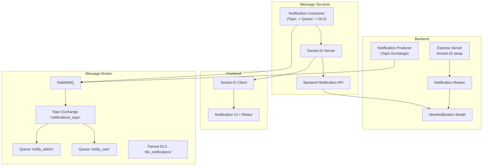
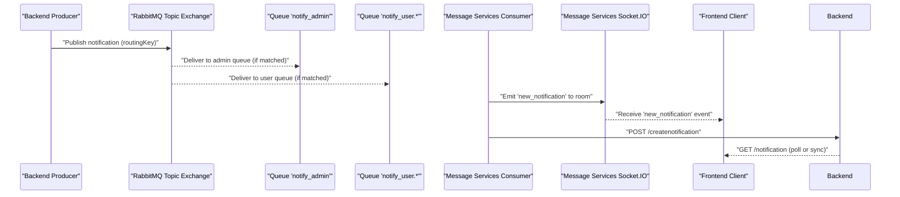
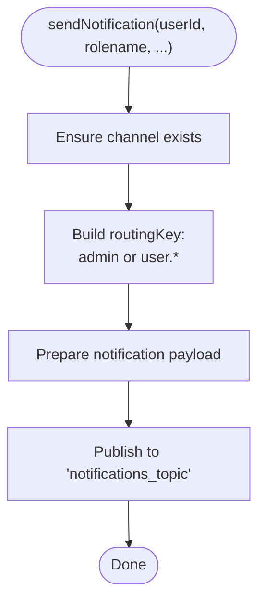
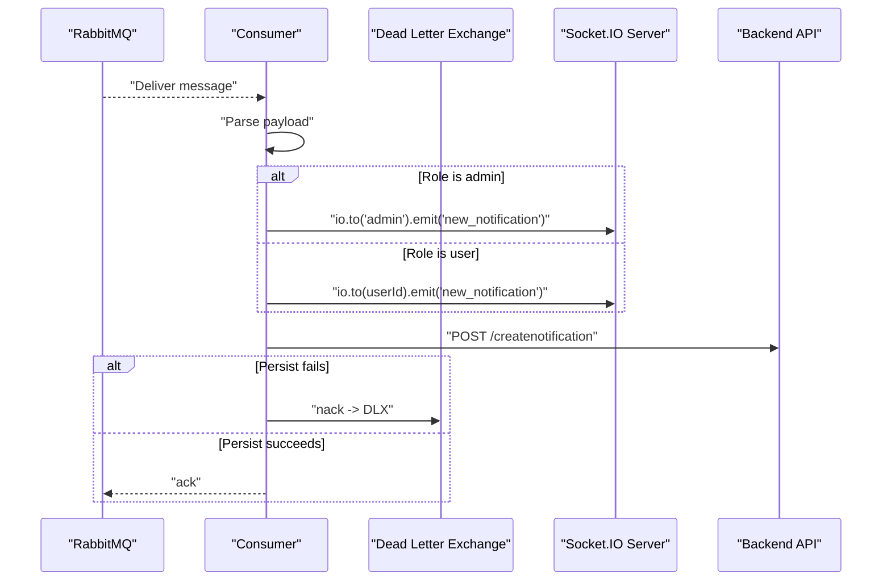
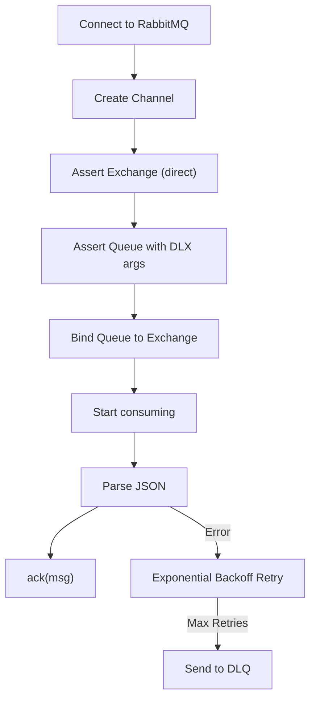
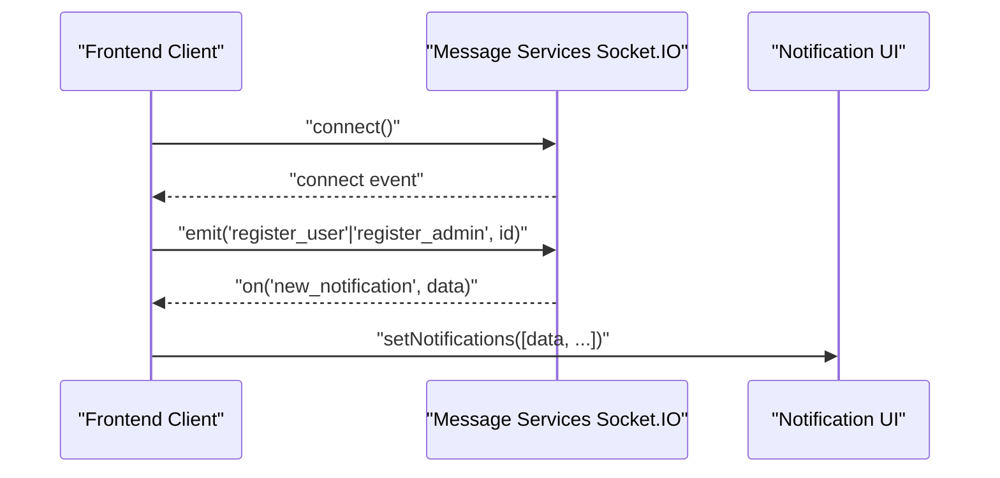
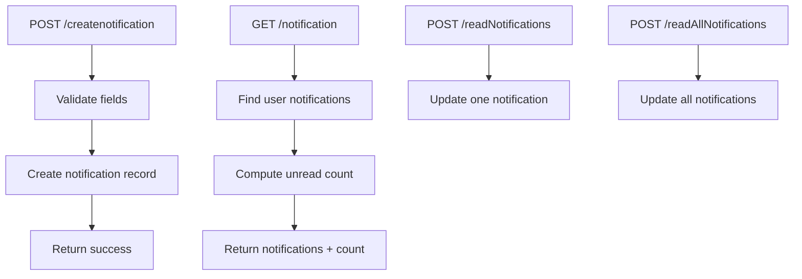
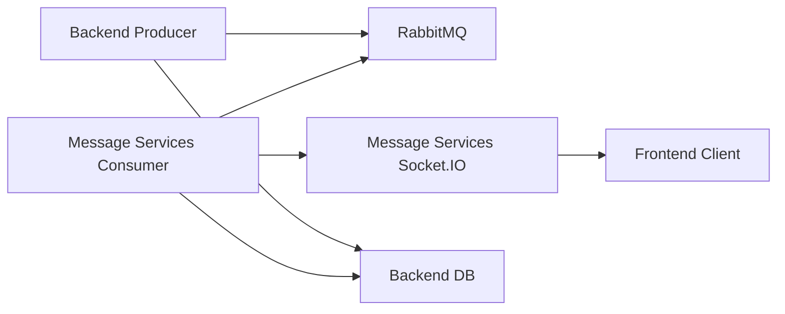

# Real-time Communication

<cite>
**Referenced Files in This Document**
- [backend/server.js](file://backend/server.js)
- [messageServices/server.js](file://messageServices/server.js)
- [backend/utils/notificationThroughMessageBroker.js](file://backend/utils/notificationThroughMessageBroker.js)
- [backend/NotificationServices/MessageService.js](file://backend/NotificationServices/MessageService.js)
- [messageServices/controller/rabbitmqConsumer.js](file://messageServices/controller/rabbitmqConsumer.js)
- [messageServices/controller/notificationConsumer.js](file://messageServices/controller/notificationConsumer.js)
- [backend/router/notificationRoutes.js](file://backend/router/notificationRoutes.js)
- [backend/model/notificationNodel.js](file://backend/model/notificationNodel.js)
- [frontend/src/ContextApi/NotificationContentAPI.jsx](file://frontend/src/ContextApi/NotificationContentAPI.jsx)
- [frontend/src/comoponent/navBar/NotificationContainer.jsx](file://frontend/src/comoponent/navBar/NotificationContainer.jsx)
- [frontend/src/appRedux/redux/notificationSlice/notificationSlice.js](file://frontend/src/appRedux/redux/notificationSlice/notificationSlice.js)
- [docker-compose.yml](file://docker-compose.yml)
- [backend/.env.development](file://backend/.env.development)
- [messageServices/.env](file://messageServices/.env)
</cite>

## Table of Contents
1. [Introduction](#introduction)
2. [Project Structure](#project-structure)
3. [Core Components](#core-components)
4. [Architecture Overview](#architecture-overview)
5. [Detailed Component Analysis](#detailed-component-analysis)
6. [Dependency Analysis](#dependency-analysis)
7. [Performance Considerations](#performance-considerations)
8. [Troubleshooting Guide](#troubleshooting-guide)
9. [Conclusion](#conclusion)
10. [Appendices](#appendices)

## Introduction
This document explains the real-time communication system built with a dual-channel approach:
- Socket.IO for direct, low-latency WebSocket-based live updates to clients.
- RabbitMQ for asynchronous, reliable message processing and delivery.

It documents the end-to-end message flow from database-driven events through RabbitMQ exchanges and queues to Socket.IO clients. It also covers connection management, room-based communication, event handling, configuration, consumer-producer patterns, dead letter exchange handling, retry mechanisms, and practical examples such as real-time notifications, booking status updates, and admin alerts. Finally, it outlines performance, scaling, and monitoring strategies.

## Project Structure
The system spans three primary areas:
- Backend service: Express server with Socket.IO, REST routes for notifications, and RabbitMQ producers.
- Message services: Dedicated service for consuming RabbitMQ messages and emitting Socket.IO events.
- Frontend: React application with Socket.IO client, Redux for state, and UI components for notifications.

**Diagram sources**
- [backend/server.js](file://backend/server.js#L34-L60)
- [backend/router/notificationRoutes.js](file://backend/router/notificationRoutes.js#L1-L14)
- [backend/model/notificationNodel.js](file://backend/model/notificationNodel.js#L1-L12)
- [backend/utils/notificationThroughMessageBroker.js](file://backend/utils/notificationThroughMessageBroker.js#L33-L64)
- [messageServices/server.js](file://messageServices/server.js#L34-L53)
- [messageServices/controller/notificationConsumer.js](file://messageServices/controller/notificationConsumer.js#L37-L91)
- [messageServices/controller/rabbitmqConsumer.js](file://messageServices/controller/rabbitmqConsumer.js#L86-L130)
- [frontend/src/ContextApi/NotificationContentAPI.jsx](file://frontend/src/ContextApi/NotificationContentAPI.jsx#L10-L51)

**Section sources**
- [backend/server.js](file://backend/server.js#L34-L60)
- [messageServices/server.js](file://messageServices/server.js#L34-L53)
- [docker-compose.yml](file://docker-compose.yml#L1-L54)

## Core Components
- Backend Socket.IO server and middleware setup for CORS and static file serving.
- RabbitMQ producer that publishes notifications to a topic exchange with routing keys per role/user.
- Message services Socket.IO server with room-based registration and consumers for admin and user notifications.
- Frontend Socket.IO client registering users/admins into rooms and listening for live events.
- Backend notification REST endpoints persisting notifications to MongoDB and exposing read APIs.
- Dead letter exchange handling and retry logic for robust delivery.

**Section sources**
- [backend/server.js](file://backend/server.js#L34-L60)
- [backend/utils/notificationThroughMessageBroker.js](file://backend/utils/notificationThroughMessageBroker.js#L33-L64)
- [messageServices/server.js](file://messageServices/server.js#L34-L53)
- [messageServices/controller/notificationConsumer.js](file://messageServices/controller/notificationConsumer.js#L37-L91)
- [backend/router/notificationRoutes.js](file://backend/router/notificationRoutes.js#L1-L14)
- [backend/model/notificationNodel.js](file://backend/model/notificationNodel.js#L1-L12)
- [frontend/src/ContextApi/NotificationContentAPI.jsx](file://frontend/src/ContextApi/NotificationContentAPI.jsx#L10-L51)

## Architecture Overview
The system uses a hybrid real-time architecture:
- Producers (backend) publish notification events to a topic exchange with routing keys for admin or user-specific topics.
- Consumers subscribe to queues bound to those routing keys, process messages, emit Socket.IO events to the appropriate rooms, and persist notifications to the backend database.
- Clients connect via Socket.IO, register themselves into rooms, and receive live updates instantly.

**Diagram sources**
- [backend/utils/notificationThroughMessageBroker.js](file://backend/utils/notificationThroughMessageBroker.js#L33-L64)
- [messageServices/controller/notificationConsumer.js](file://messageServices/controller/notificationConsumer.js#L63-L87)
- [messageServices/server.js](file://messageServices/server.js#L34-L53)
- [backend/router/notificationRoutes.js](file://backend/router/notificationRoutes.js#L1-L14)

## Detailed Component Analysis

### Backend Producer (RabbitMQ Topic Exchange)
- Connects to RabbitMQ and asserts a durable topic exchange for notifications.
- Builds routing keys based on role or user scope and publishes persistent messages.
- Includes automatic reconnect and publish retry logic.

**Diagram sources**
- [backend/utils/notificationThroughMessageBroker.js](file://backend/utils/notificationThroughMessageBroker.js#L33-L64)

**Section sources**
- [backend/utils/notificationThroughMessageBroker.js](file://backend/utils/notificationThroughMessageBroker.js#L33-L64)

### Message Services Consumer and Socket.IO Emitter
- Establishes a RabbitMQ connection and channel, asserts a topic exchange and a fanout dead letter exchange.
- Creates role-scoped queues with dead letter arguments and binds them to the exchange with appropriate routing keys.
- Consumes messages, emits Socket.IO events to admin or user rooms, and persists notifications via backend API with retry logic.

**Diagram sources**
- [messageServices/controller/notificationConsumer.js](file://messageServices/controller/notificationConsumer.js#L37-L91)
- [messageServices/server.js](file://messageServices/server.js#L34-L53)
- [backend/router/notificationRoutes.js](file://backend/router/notificationRoutes.js#L1-L14)

**Section sources**
- [messageServices/controller/notificationConsumer.js](file://messageServices/controller/notificationConsumer.js#L37-L91)
- [messageServices/server.js](file://messageServices/server.js#L34-L53)

### RabbitMQ Email Consumers (Supporting Infrastructure)
- Demonstrates a reusable consumer pattern with dead letter exchanges, exponential backoff, and per-queue channels.
- Handles multiple routing keys for different tasks and supports DLQ routing.

**Diagram sources**
- [messageServices/controller/rabbitmqConsumer.js](file://messageServices/controller/rabbitmqConsumer.js#L86-L130)

**Section sources**
- [messageServices/controller/rabbitmqConsumer.js](file://messageServices/controller/rabbitmqConsumer.js#L86-L130)

### Frontend Socket.IO Client and UI
- Initializes a Socket.IO client, connects to the message services server, registers user/admin into rooms upon connection, listens for live notifications, and updates UI state.
- Redux slice manages fetching, marking read, and unread counts.

**Diagram sources**
- [frontend/src/ContextApi/NotificationContentAPI.jsx](file://frontend/src/ContextApi/NotificationContentAPI.jsx#L10-L51)
- [frontend/src/comoponent/navBar/NotificationContainer.jsx](file://frontend/src/comoponent/navBar/NotificationContainer.jsx#L15-L63)

**Section sources**
- [frontend/src/ContextApi/NotificationContentAPI.jsx](file://frontend/src/ContextApi/NotificationContentAPI.jsx#L10-L51)
- [frontend/src/appRedux/redux/notificationSlice/notificationSlice.js](file://frontend/src/appRedux/redux/notificationSlice/notificationSlice.js#L5-L60)

### Backend Notification Persistence
- REST endpoints create, fetch, and mark notifications as read/unread.
- Uses a dedicated notification model for storing live notification metadata.

**Diagram sources**
- [backend/router/notificationRoutes.js](file://backend/router/notificationRoutes.js#L1-L14)
- [backend/Controller/newNotificationSchemaController.js](file://backend/Controller/newNotificationSchemaController.js#L6-L111)
- [backend/model/notificationNodel.js](file://backend/model/notificationNodel.js#L1-L12)

**Section sources**
- [backend/router/notificationRoutes.js](file://backend/router/notificationRoutes.js#L1-L14)
- [backend/Controller/newNotificationSchemaController.js](file://backend/Controller/newNotificationSchemaController.js#L6-L111)
- [backend/model/notificationNodel.js](file://backend/model/notificationNodel.js#L1-L12)

## Dependency Analysis
- Backend producer depends on RabbitMQ connectivity and publishes to a topic exchange.
- Message services consumer depends on RabbitMQ and emits to Socket.IO rooms.
- Frontend client depends on the message services Socket.IO server and backend REST endpoints.
- Docker Compose orchestrates backend, RabbitMQ, and message services, wiring environment variables for connectivity.

**Diagram sources**
- [backend/utils/notificationThroughMessageBroker.js](file://backend/utils/notificationThroughMessageBroker.js#L33-L64)
- [messageServices/controller/notificationConsumer.js](file://messageServices/controller/notificationConsumer.js#L37-L91)
- [messageServices/server.js](file://messageServices/server.js#L34-L53)
- [frontend/src/ContextApi/NotificationContentAPI.jsx](file://frontend/src/ContextApi/NotificationContentAPI.jsx#L10-L51)

**Section sources**
- [docker-compose.yml](file://docker-compose.yml#L1-L54)
- [backend/.env.development](file://backend/.env.development#L1-L27)
- [messageServices/.env](file://messageServices/.env#L1-L13)

## Performance Considerations
- Use topic exchanges for flexible routing and per-user scoping.
- Employ durable queues and persistent messages for reliability.
- Implement exponential backoff and dead letter exchanges to prevent message loss under transient failures.
- Keep Socket.IO connections alive with reconnection attempts and room-based targeting to minimize broadcast overhead.
- Offload heavy processing to consumers and keep producers/publishers lightweight.
- Scale horizontally by adding more consumer instances and load-balancing Socket.IO servers if needed.

## Troubleshooting Guide
Common issues and remedies:
- RabbitMQ connectivity errors: Verify URLs and heartbeat settings; ensure auto-reconnect logic triggers.
- Missing notifications: Confirm routing keys match roles/users and queues are bound correctly; check DLX routing.
- Socket.IO not receiving events: Ensure clients emit registration events and rooms are joined; verify CORS settings.
- Backend persistence failures: Inspect retry logic and backend endpoint availability; monitor DLX queues.

**Section sources**
- [backend/utils/notificationThroughMessageBroker.js](file://backend/utils/notificationThroughMessageBroker.js#L8-L30)
- [messageServices/controller/notificationConsumer.js](file://messageServices/controller/notificationConsumer.js#L16-L35)
- [frontend/src/ContextApi/NotificationContentAPI.jsx](file://frontend/src/ContextApi/NotificationContentAPI.jsx#L15-L51)

## Conclusion
The system combines Socket.IO for real-time responsiveness and RabbitMQ for reliable asynchronous messaging. The dual-channel design ensures scalability, resilience, and a smooth user experience for notifications, booking updates, and admin alerts. Proper configuration, dead letter handling, and retry strategies contribute to robustness, while clear separation of concerns enables maintainable growth.

## Appendices

### Configuration Details
- Backend environment variables:
  - RABBITMQURL, FRONTEND origin, JWT secrets, MongoDB URL, Redis URL, Cloudinary credentials.
- Message services environment variables:
  - RABBITMQURL, BACKEND_SERVICE_URL, SMTP settings for email consumers, DLQ name.
- Docker Compose:
  - Defines services for frontend, backend, RabbitMQ, and consumer; exposes ports and sets environment variables.

**Section sources**
- [backend/.env.development](file://backend/.env.development#L1-L27)
- [messageServices/.env](file://messageServices/.env#L1-L13)
- [docker-compose.yml](file://docker-compose.yml#L1-L54)

### Examples
- Real-time notifications:
  - Backend producer publishes a notification; consumer emits to the user’s room; frontend displays immediately.
- Booking status updates:
  - Backend publishes a booking-related notification; consumer emits to the user’s room; frontend updates UI.
- Admin alerts:
  - Backend publishes an admin notification; consumer emits to the admin room; frontend displays in admin UI.

**Section sources**
- [backend/utils/notificationThroughMessageBroker.js](file://backend/utils/notificationThroughMessageBroker.js#L33-L64)
- [messageServices/controller/notificationConsumer.js](file://messageServices/controller/notificationConsumer.js#L63-L87)
- [frontend/src/ContextApi/NotificationContentAPI.jsx](file://frontend/src/ContextApi/NotificationContentAPI.jsx#L36-L40)