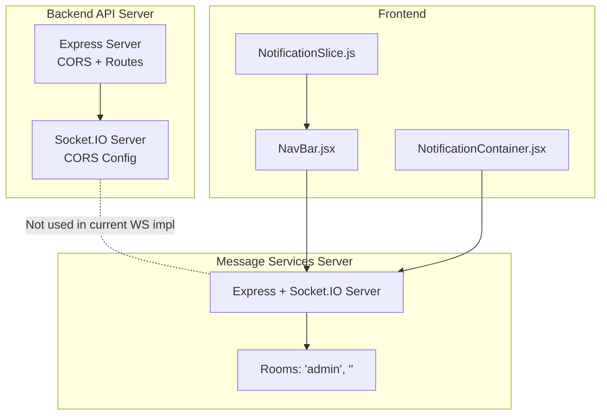
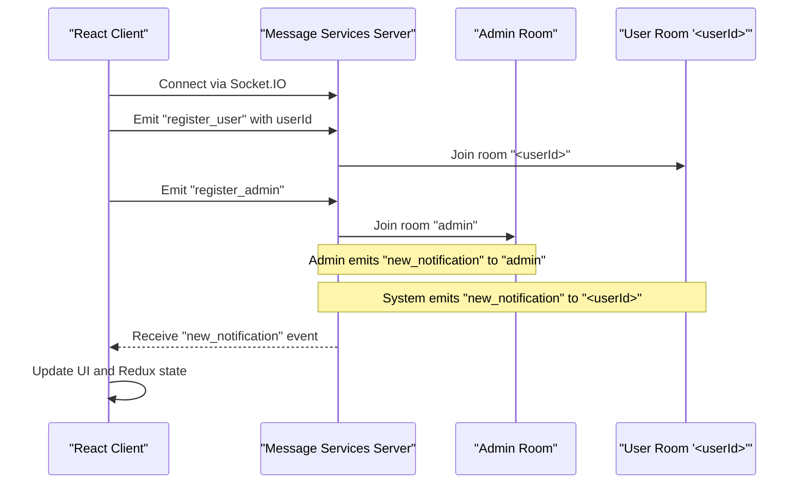
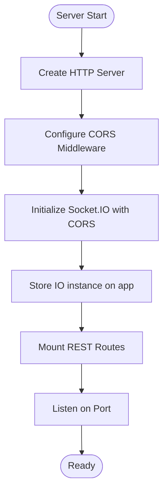
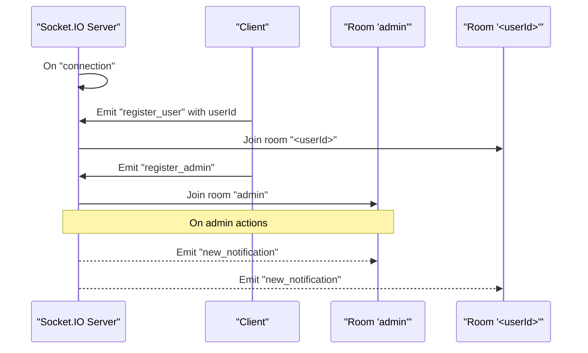
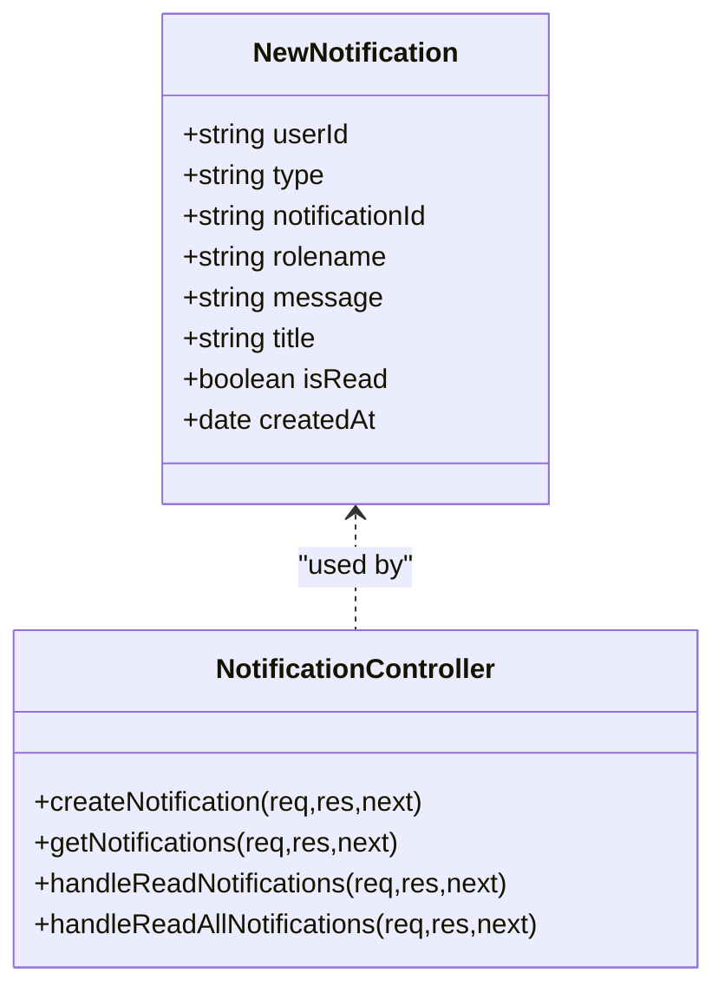
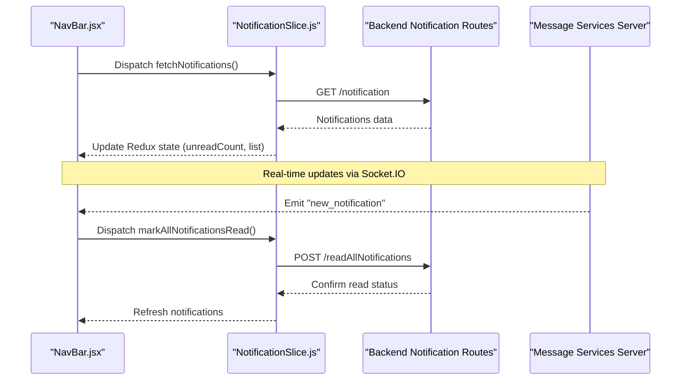
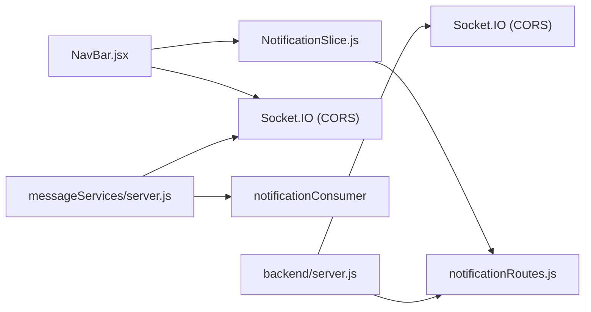

# WebSocket Implementation

<cite>
**Referenced Files in This Document**
- [server.js](file://backend/server.js)
- [server.js](file://messageServices/server.js)
- [notificationRoutes.js](file://backend/router/notificationRoutes.js)
- [newNotificationSchemaController.js](file://backend/Controller/newNotificationSchemaController.js)
- [notificationSchema.js](file://backend/model/notificationSchema.js)
- [notificationNodel.js](file://backend/model/notificationNodel.js)
- [NavBar.jsx](file://frontend/src/comoponent/navBar/NavBar.jsx)
- [NotificationSlice.js](file://frontend/src/appRedux/redux/notificationSlice/NotificationSlice.js)
- [ToastContext.jsx](file://frontend/src/ContextApi/ToastContext.jsx)
- [NotificationContainer.jsx](file://frontend/src/comoponent/navBar/NotificationContainer.jsx)
</cite>

## Table of Contents
1. [Introduction](#introduction)
2. [Project Structure](#project-structure)
3. [Core Components](#core-components)
4. [Architecture Overview](#architecture-overview)
5. [Detailed Component Analysis](#detailed-component-analysis)
6. [Dependency Analysis](#dependency-analysis)
7. [Performance Considerations](#performance-considerations)
8. [Troubleshooting Guide](#troubleshooting-guide)
9. [Conclusion](#conclusion)

## Introduction
This document explains the WebSocket implementation using Socket.IO in the project. It covers the server-side setup with CORS configuration, connection handling, and room-based communication patterns. It also documents the client-side integration in React components, including connection establishment, event listeners, and real-time data updates. The notification system is detailed, showing how booking status changes, admin alerts, and system messages are delivered in real-time. Examples of socket event handling, room joining/leaving logic, and connection error handling are included, along with performance considerations, scaling strategies, and troubleshooting guidance.

## Project Structure
The WebSocket implementation spans two primary areas:
- Backend HTTP server with Socket.IO configured and CORS enabled
- Dedicated message services server that hosts Socket.IO for real-time notifications and rooms
- Frontend React components that connect to the message services server and render notifications

**Diagram sources**
- [server.js](file://backend/server.js#L38-L59)
- [server.js](file://messageServices/server.js#L13-L18)
- [NavBar.jsx](file://frontend/src/comoponent/navBar/NavBar.jsx#L183-L232)

**Section sources**
- [server.js](file://backend/server.js#L38-L59)
- [server.js](file://messageServices/server.js#L13-L18)

## Core Components
- Backend API server initializes Socket.IO with CORS and exposes REST routes for notifications.
- Message services server runs a dedicated Socket.IO instance, manages rooms ("admin", "<userId>"), and emits real-time notifications to clients.
- Frontend React components integrate with the message services server via Socket.IO client, listen for real-time events, and update the UI accordingly.

Key implementation highlights:
- CORS configuration for both servers ensures cross-origin requests are permitted.
- Room-based communication enables targeted delivery to admins and individual users.
- Notification CRUD endpoints support fetching, marking read/unread, and listing notifications.

**Section sources**
- [server.js](file://backend/server.js#L38-L59)
- [server.js](file://messageServices/server.js#L13-L18)
- [notificationRoutes.js](file://backend/router/notificationRoutes.js#L1-L14)
- [newNotificationSchemaController.js](file://backend/Controller/newNotificationSchemaController.js#L1-L112)

## Architecture Overview
The WebSocket architecture separates concerns:
- Backend API server handles REST APIs and integrates Socket.IO for potential future use.
- Message services server is the authoritative real-time engine for notifications and rooms.
- Frontend connects to the message services server to receive live updates and interact with notifications.

**Diagram sources**
- [server.js](file://messageServices/server.js#L34-L53)
- [NavBar.jsx](file://frontend/src/comoponent/navBar/NavBar.jsx#L183-L232)

## Detailed Component Analysis

### Backend API Server (Socket.IO Setup and CORS)
- Initializes an HTTP server and attaches Socket.IO with CORS allowing credentials and specific methods.
- Exposes REST routes for notifications and integrates error handling middleware.
- Stores the Socket.IO instance on the Express app for later access by other modules.

**Diagram sources**
- [server.js](file://backend/server.js#L34-L76)

**Section sources**
- [server.js](file://backend/server.js#L38-L59)
- [server.js](file://backend/server.js#L66-L76)

### Message Services Server (Rooms and Events)
- Creates a dedicated HTTP server and Socket.IO instance with permissive CORS for development.
- Handles "connection" events to register users and admins into rooms.
- Emits "new_notification" events to targeted rooms for real-time updates.

**Diagram sources**
- [server.js](file://messageServices/server.js#L34-L53)

**Section sources**
- [server.js](file://messageServices/server.js#L13-L18)
- [server.js](file://messageServices/server.js#L34-L53)

### Notification Model and Controller
- Two notification schemas exist: a legacy schema and a newer schema with additional fields.
- The controller supports creating notifications, fetching user notifications, and marking notifications as read/unread.

**Diagram sources**
- [notificationNodel.js](file://backend/model/notificationNodel.js#L1-L12)
- [newNotificationSchemaController.js](file://backend/Controller/newNotificationSchemaController.js#L1-L112)

**Section sources**
- [notificationNodel.js](file://backend/model/notificationNodel.js#L1-L12)
- [newNotificationSchemaController.js](file://backend/Controller/newNotificationSchemaController.js#L1-L112)

### Frontend Integration (React Components)
- NavBar listens for Redux state changes and triggers notification fetches.
- NotificationContainer renders notifications and integrates with ToastContext for error feedback.
- Redux slice orchestrates fetching, marking read/unread, and updating counts.

**Diagram sources**
- [NavBar.jsx](file://frontend/src/comoponent/navBar/NavBar.jsx#L80-L101)
- [notificationRoutes.js](file://backend/router/notificationRoutes.js#L8-L10)
- [server.js](file://messageServices/server.js#L34-L53)

**Section sources**
- [NavBar.jsx](file://frontend/src/comoponent/navBar/NavBar.jsx#L80-L101)
- [notificationRoutes.js](file://backend/router/notificationRoutes.js#L8-L10)
- [ToastContext.jsx](file://frontend/src/ContextApi/ToastContext.jsx)

## Dependency Analysis
- Backend API server depends on Socket.IO and CORS middleware; it mounts notification routes.
- Message services server depends on Socket.IO and RabbitMQ consumers for emitting notifications.
- Frontend depends on Redux slices and React components to manage and display notifications.

**Diagram sources**
- [server.js](file://backend/server.js#L38-L59)
- [server.js](file://messageServices/server.js#L13-L18)
- [notificationRoutes.js](file://backend/router/notificationRoutes.js#L1-L14)

**Section sources**
- [server.js](file://backend/server.js#L38-L59)
- [server.js](file://messageServices/server.js#L13-L18)
- [notificationRoutes.js](file://backend/router/notificationRoutes.js#L1-L14)

## Performance Considerations
- Connection pooling and scaling:
  - Use a reverse proxy/load balancer to distribute WebSocket connections across multiple message services instances.
  - Implement sticky sessions if stateful rooms are required; otherwise, centralize room state in Redis for multi-instance deployments.
  - Monitor connection counts and memory usage; consider graceful disconnects and reconnection strategies.
- Event throughput:
  - Batch frequent updates (e.g., bulk read operations) to reduce network overhead.
  - Use efficient serialization and avoid sending redundant data.
- Resource optimization:
  - Limit per-client message rates and implement rate limiting on the server.
  - Close unused rooms and clean up stale subscriptions on logout or idle timeouts.

## Troubleshooting Guide
Common WebSocket issues and debugging techniques:
- Connection refused or blocked by CORS:
  - Verify CORS origin and credentials settings match the frontend URL and headers.
  - Ensure the Socket.IO server is reachable from the browser and ports are open.
- Rooms not receiving messages:
  - Confirm clients emit "register_user" with the correct userId and "register_admin" for admin room.
  - Check that the server emits "new_notification" to the intended room targets.
- No real-time updates in the UI:
  - Ensure the frontend listens for "new_notification" events and updates Redux state.
  - Validate that notification fetches occur after read operations to refresh the UI.
- Error handling:
  - Use ToastContext to surface errors from notification fetch/mark-read operations.
  - Implement retry logic for transient failures and log meaningful error messages.

**Section sources**
- [server.js](file://messageServices/server.js#L34-L53)
- [NavBar.jsx](file://frontend/src/comoponent/navBar/NavBar.jsx#L89-L101)
- [ToastContext.jsx](file://frontend/src/ContextApi/ToastContext.jsx)

## Conclusion
The project implements a robust WebSocket-based notification system using Socket.IO. The backend API server integrates Socket.IO with CORS, while a dedicated message services server manages rooms and real-time events. The frontend React components connect to the message services server, listen for real-time updates, and maintain synchronized notification state. By following the documented patterns for room management, event handling, and error management, teams can extend the system to support broader real-time features such as booking status updates and admin alerts.