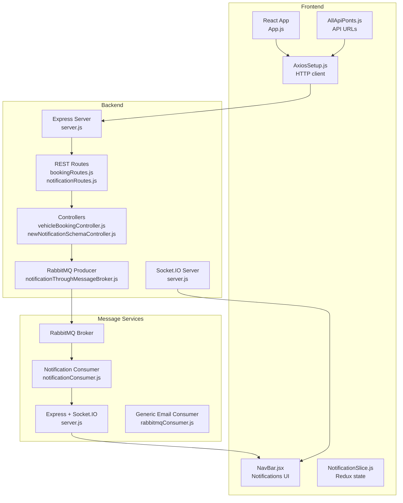
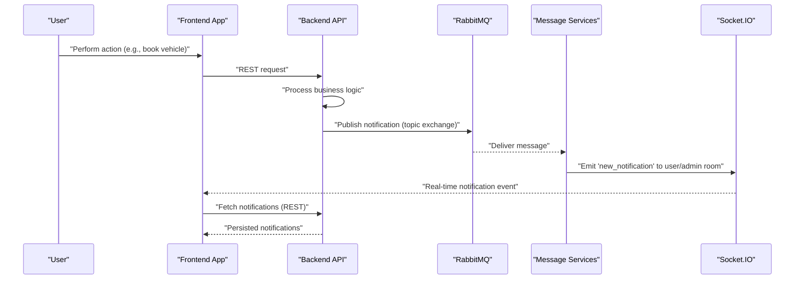
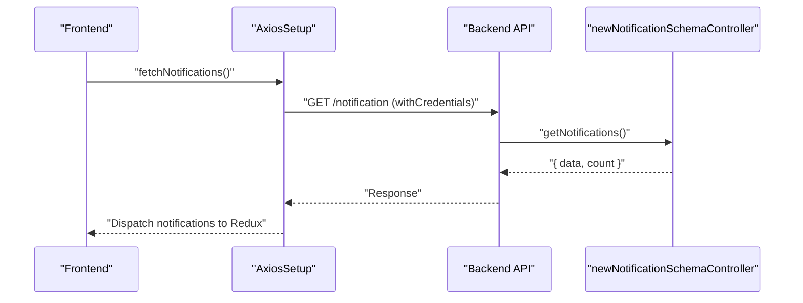
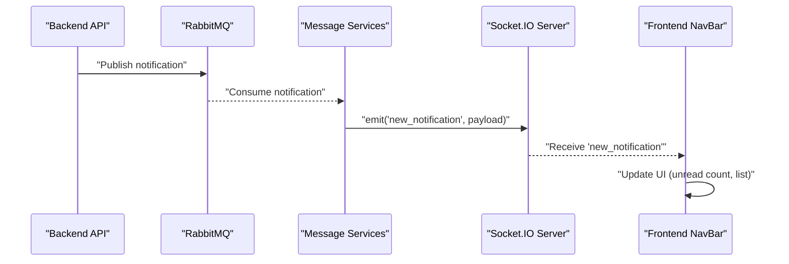
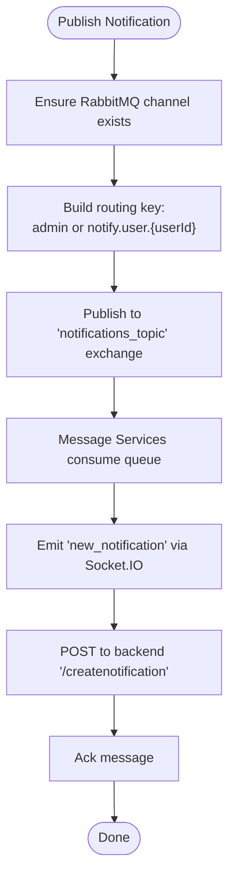
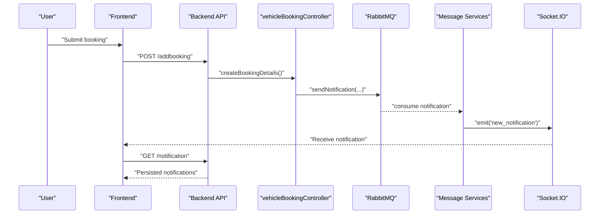
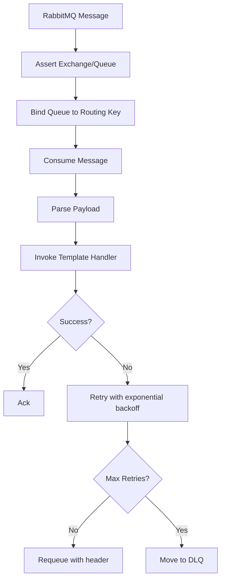
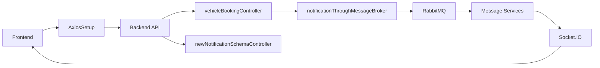

# Component Interactions

<cite>
**Referenced Files in This Document**
- [server.js](file://backend/server.js)
- [server.js](file://messageServices/server.js)
- [AllApiPonts.js](file://frontend/src/APIPoints/AllApiPonts.js)
- [AxiosSetup.js](file://frontend/src/axiosInterceptors/AxiosSetup.js)
- [NavBar.jsx](file://frontend/src/comoponent/navBar/NavBar.jsx)
- [NotificationSlice.js](file://frontend/src/appRedux/redux/notificationSlice/NotificationSlice.js)
- [App.js](file://frontend/src/App.js)
- [bookingRoutes.js](file://backend/router/bookingRoutes.js)
- [notificationRoutes.js](file://backend/router/notificationRoutes.js)
- [vehicleBookingController.js](file://backend/Controller/vehicleBookingController.js)
- [newNotificationSchemaController.js](file://backend/Controller/newNotificationSchemaController.js)
- [notificationThroughMessageBroker.js](file://backend/utils/notificationThroughMessageBroker.js)
- [notificationConsumer.js](file://messageServices/controller/notificationConsumer.js)
- [rabbitmqConsumer.js](file://messageServices/controller/rabbitmqConsumer.js)
</cite>

## Table of Contents
1. [Introduction](#introduction)
2. [Project Structure](#project-structure)
3. [Core Components](#core-components)
4. [Architecture Overview](#architecture-overview)
5. [Detailed Component Analysis](#detailed-component-analysis)
6. [Dependency Analysis](#dependency-analysis)
7. [Performance Considerations](#performance-considerations)
8. [Troubleshooting Guide](#troubleshooting-guide)
9. [Conclusion](#conclusion)

## Introduction
This document explains how the Vehicle Management System coordinates frontend React components with backend services using REST APIs, WebSocket connections, and RabbitMQ message exchanges. It details bidirectional communication flows for real-time notifications, booking updates, and admin alerts, and documents how the main API server coordinates with the message services for asynchronous operations. Sequence diagrams illustrate typical user workflows such as vehicle booking, payment processing, and notification delivery. Event-driven patterns and error handling/retry mechanisms in distributed communications are covered, along with the role of Socket.IO and its integration with RabbitMQ.

## Project Structure
The system comprises:
- Backend API server (Express) with REST endpoints and Socket.IO for real-time updates
- Message services server (Express + Socket.IO) consuming RabbitMQ topics and emitting real-time events
- Frontend React application using Redux Toolkit for state and Axios interceptors for authenticated HTTP calls
- RabbitMQ-based asynchronous messaging for notifications and emails

**Diagram sources**
- [server.js](file://backend/server.js#L34-L76)
- [server.js](file://messageServices/server.js#L1-L84)
- [AllApiPonts.js](file://frontend/src/APIPoints/AllApiPonts.js#L1-L3)
- [AxiosSetup.js](file://frontend/src/axiosInterceptors/AxiosSetup.js#L110-L214)
- [NavBar.jsx](file://frontend/src/comoponent/navBar/NavBar.jsx#L1-L252)
- [NotificationSlice.js](file://frontend/src/appRedux/redux/notificationSlice/NotificationSlice.js#L1-L134)
- [bookingRoutes.js](file://backend/router/bookingRoutes.js#L1-L31)
- [notificationRoutes.js](file://backend/router/notificationRoutes.js#L1-L14)
- [vehicleBookingController.js](file://backend/Controller/vehicleBookingController.js#L1-L861)
- [newNotificationSchemaController.js](file://backend/Controller/newNotificationSchemaController.js#L1-L112)
- [notificationThroughMessageBroker.js](file://backend/utils/notificationThroughMessageBroker.js#L1-L69)
- [notificationConsumer.js](file://messageServices/controller/notificationConsumer.js#L1-L119)
- [rabbitmqConsumer.js](file://messageServices/controller/rabbitmqConsumer.js#L1-L216)

**Section sources**
- [server.js](file://backend/server.js#L34-L76)
- [server.js](file://messageServices/server.js#L1-L84)
- [AllApiPonts.js](file://frontend/src/APIPoints/AllApiPonts.js#L1-L3)
- [AxiosSetup.js](file://frontend/src/axiosInterceptors/AxiosSetup.js#L110-L214)
- [NavBar.jsx](file://frontend/src/comoponent/navBar/NavBar.jsx#L1-L252)
- [NotificationSlice.js](file://frontend/src/appRedux/redux/notificationSlice/NotificationSlice.js#L1-L134)
- [bookingRoutes.js](file://backend/router/bookingRoutes.js#L1-L31)
- [notificationRoutes.js](file://backend/router/notificationRoutes.js#L1-L14)
- [vehicleBookingController.js](file://backend/Controller/vehicleBookingController.js#L1-L861)
- [newNotificationSchemaController.js](file://backend/Controller/newNotificationSchemaController.js#L1-L112)
- [notificationThroughMessageBroker.js](file://backend/utils/notificationThroughMessageBroker.js#L1-L69)
- [notificationConsumer.js](file://messageServices/controller/notificationConsumer.js#L1-L119)
- [rabbitmqConsumer.js](file://messageServices/controller/rabbitmqConsumer.js#L1-L216)

## Core Components
- Backend API server
  - Initializes CORS, middleware, Socket.IO, routes, and error handling
  - Exposes REST endpoints for bookings and notifications
- Message services server
  - Consumes RabbitMQ topic exchanges for notifications and emails
  - Emits real-time events via Socket.IO to registered user/admin rooms
- Frontend React application
  - Provides authenticated HTTP client with interceptors
  - Manages notifications state via Redux slices
  - Renders notification UI and triggers fetch/mark-read actions

Key integration points:
- REST endpoints for notifications and bookings
- RabbitMQ producer in backend for publishing notifications
- RabbitMQ consumers in message services for delivering notifications and emails
- Socket.IO bridges for real-time updates

**Section sources**
- [server.js](file://backend/server.js#L34-L76)
- [server.js](file://messageServices/server.js#L1-L84)
- [AxiosSetup.js](file://frontend/src/axiosInterceptors/AxiosSetup.js#L110-L214)
- [NotificationSlice.js](file://frontend/src/appRedux/redux/notificationSlice/NotificationSlice.js#L1-L134)

## Architecture Overview
The system follows an event-driven architecture:
- Controllers trigger asynchronous tasks (publishing notifications to RabbitMQ)
- Message services consume RabbitMQ messages, emit Socket.IO events, and persist notifications to the backend database
- Frontend subscribes to Socket.IO events and fetches persisted notifications via REST

**Diagram sources**
- [vehicleBookingController.js](file://backend/Controller/vehicleBookingController.js#L431-L457)
- [notificationThroughMessageBroker.js](file://backend/utils/notificationThroughMessageBroker.js#L33-L64)
- [notificationConsumer.js](file://messageServices/controller/notificationConsumer.js#L63-L87)
- [server.js](file://messageServices/server.js#L34-L53)
- [notificationRoutes.js](file://backend/router/notificationRoutes.js#L7-L10)
- [newNotificationSchemaController.js](file://backend/Controller/newNotificationSchemaController.js#L32-L60)

## Detailed Component Analysis

### REST API Communication (Frontend ↔ Backend)
- Frontend uses a configured Axios instance with credentials enabled for authenticated requests.
- The API server sets CORS and registers routes for user, vehicle, booking, reports, and notifications.
- Notifications are fetched and marked read/unread via dedicated endpoints.

**Diagram sources**
- [AxiosSetup.js](file://frontend/src/axiosInterceptors/AxiosSetup.js#L110-L214)
- [notificationRoutes.js](file://backend/router/notificationRoutes.js#L7-L10)
- [newNotificationSchemaController.js](file://backend/Controller/newNotificationSchemaController.js#L32-L60)
- [NotificationSlice.js](file://frontend/src/appRedux/redux/notificationSlice/NotificationSlice.js#L5-L21)

**Section sources**
- [AxiosSetup.js](file://frontend/src/axiosInterceptors/AxiosSetup.js#L110-L214)
- [notificationRoutes.js](file://backend/router/notificationRoutes.js#L7-L10)
- [newNotificationSchemaController.js](file://backend/Controller/newNotificationSchemaController.js#L32-L60)
- [NotificationSlice.js](file://frontend/src/appRedux/redux/notificationSlice/NotificationSlice.js#L5-L21)

### Real-Time Notifications (Socket.IO)
- Backend initializes Socket.IO with CORS matching the frontend origin.
- Message services server registers user/admin rooms and emits real-time events upon receiving RabbitMQ messages.
- Frontend NavBar subscribes to notifications and renders unread counts and lists.

**Diagram sources**
- [server.js](file://backend/server.js#L52-L60)
- [server.js](file://messageServices/server.js#L34-L53)
- [notificationConsumer.js](file://messageServices/controller/notificationConsumer.js#L63-L87)
- [NavBar.jsx](file://frontend/src/comoponent/navBar/NavBar.jsx#L78-L101)

**Section sources**
- [server.js](file://backend/server.js#L52-L60)
- [server.js](file://messageServices/server.js#L34-L53)
- [notificationConsumer.js](file://messageServices/controller/notificationConsumer.js#L63-L87)
- [NavBar.jsx](file://frontend/src/comoponent/navBar/NavBar.jsx#L78-L101)

### RabbitMQ Message Exchanges and Consumers
- Backend publishes notifications to a durable topic exchange with routing keys per role/user.
- Message services consume from queues bound to topic routing keys, emit Socket.IO events, and persist notifications to the backend database via a dedicated endpoint.
- Generic email consumers handle multiple routing keys with dead letter exchanges and exponential backoff.

**Diagram sources**
- [notificationThroughMessageBroker.js](file://backend/utils/notificationThroughMessageBroker.js#L33-L64)
- [notificationConsumer.js](file://messageServices/controller/notificationConsumer.js#L37-L91)
- [notificationRoutes.js](file://backend/router/notificationRoutes.js#L7-L10)
- [newNotificationSchemaController.js](file://backend/Controller/newNotificationSchemaController.js#L6-L29)

**Section sources**
- [notificationThroughMessageBroker.js](file://backend/utils/notificationThroughMessageBroker.js#L1-L69)
- [notificationConsumer.js](file://messageServices/controller/notificationConsumer.js#L1-L119)
- [rabbitmqConsumer.js](file://messageServices/controller/rabbitmqConsumer.js#L1-L216)
- [notificationRoutes.js](file://backend/router/notificationRoutes.js#L7-L10)
- [newNotificationSchemaController.js](file://backend/Controller/newNotificationSchemaController.js#L6-L29)

### Booking Workflow and Notification Delivery
- On booking creation/update/cancellation, the backend runs database transactions and publishes notifications to RabbitMQ.
- Message services deliver real-time notifications to users/admins and persist them to MongoDB.
- Frontend fetches notifications and marks them read/unread.

**Diagram sources**
- [bookingRoutes.js](file://backend/router/bookingRoutes.js#L7-L28)
- [vehicleBookingController.js](file://backend/Controller/vehicleBookingController.js#L235-L466)
- [notificationThroughMessageBroker.js](file://backend/utils/notificationThroughMessageBroker.js#L33-L64)
- [notificationConsumer.js](file://messageServices/controller/notificationConsumer.js#L63-L87)
- [server.js](file://messageServices/server.js#L34-L53)
- [notificationRoutes.js](file://backend/router/notificationRoutes.js#L7-L10)
- [newNotificationSchemaController.js](file://backend/Controller/newNotificationSchemaController.js#L32-L60)

**Section sources**
- [bookingRoutes.js](file://backend/router/bookingRoutes.js#L7-L28)
- [vehicleBookingController.js](file://backend/Controller/vehicleBookingController.js#L235-L466)
- [notificationThroughMessageBroker.js](file://backend/utils/notificationThroughMessageBroker.js#L33-L64)
- [notificationConsumer.js](file://messageServices/controller/notificationConsumer.js#L63-L87)
- [server.js](file://messageServices/server.js#L34-L53)
- [notificationRoutes.js](file://backend/router/notificationRoutes.js#L7-L10)
- [newNotificationSchemaController.js](file://backend/Controller/newNotificationSchemaController.js#L32-L60)

### Email Notifications via RabbitMQ
- The message services include a generic consumer that processes multiple routing keys for emails (e.g., booking confirmations, status updates).
- Consumers assert exchanges/queues, bind queues, and process messages with retry logic and dead letter queues.

**Diagram sources**
- [rabbitmqConsumer.js](file://messageServices/controller/rabbitmqConsumer.js#L85-L130)
- [rabbitmqConsumer.js](file://messageServices/controller/rabbitmqConsumer.js#L132-L211)

**Section sources**
- [rabbitmqConsumer.js](file://messageServices/controller/rabbitmqConsumer.js#L1-L216)

## Dependency Analysis
- Frontend depends on AxiosSetup for authenticated HTTP calls and Redux slices for state management.
- Backend depends on Socket.IO for real-time updates and RabbitMQ utilities for asynchronous notifications.
- Message services depend on RabbitMQ consumers and Socket.IO to bridge events to the frontend.
- Controllers orchestrate transactional operations and publish to RabbitMQ.

**Diagram sources**
- [AxiosSetup.js](file://frontend/src/axiosInterceptors/AxiosSetup.js#L110-L214)
- [vehicleBookingController.js](file://backend/Controller/vehicleBookingController.js#L1-L861)
- [newNotificationSchemaController.js](file://backend/Controller/newNotificationSchemaController.js#L1-L112)
- [notificationThroughMessageBroker.js](file://backend/utils/notificationThroughMessageBroker.js#L1-L69)
- [server.js](file://messageServices/server.js#L1-L84)
- [server.js](file://backend/server.js#L34-L76)

**Section sources**
- [AxiosSetup.js](file://frontend/src/axiosInterceptors/AxiosSetup.js#L110-L214)
- [vehicleBookingController.js](file://backend/Controller/vehicleBookingController.js#L1-L861)
- [newNotificationSchemaController.js](file://backend/Controller/newNotificationSchemaController.js#L1-L112)
- [notificationThroughMessageBroker.js](file://backend/utils/notificationThroughMessageBroker.js#L1-L69)
- [server.js](file://messageServices/server.js#L1-L84)
- [server.js](file://backend/server.js#L34-L76)

## Performance Considerations
- Asynchronous notifications via RabbitMQ decouple high-frequency operations from synchronous HTTP responses, improving latency and throughput.
- Socket.IO rooms minimize broadcast overhead by targeting specific user/admin contexts.
- Dead letter exchanges and retry logic in consumers reduce message loss under transient failures.
- Transactional writes in controllers ensure data consistency for critical operations like booking creation and cancellations.

## Troubleshooting Guide
Common issues and remedies:
- Socket.IO connection errors
  - Verify CORS origins match between backend and message services servers.
  - Ensure clients register user/admin rooms to receive targeted events.
- RabbitMQ connectivity
  - Producer/consumer auto-reconnect loops handle temporary disconnections; monitor logs for repeated reconnect attempts.
  - Topic routing keys must match roles/users; incorrect keys prevent delivery.
- Notification persistence failures
  - Message services retry to backend API with bounded attempts; excessive failures indicate backend downtime or invalid payloads.
- Frontend notification state
  - Redux thunks handle fetch/mark-read; ensure credentials are included in Axios requests and that refresh token logic does not block legitimate requests.

**Section sources**
- [server.js](file://backend/server.js#L38-L60)
- [server.js](file://messageServices/server.js#L13-L53)
- [notificationThroughMessageBroker.js](file://backend/utils/notificationThroughMessageBroker.js#L8-L30)
- [notificationConsumer.js](file://messageServices/controller/notificationConsumer.js#L17-L35)
- [AxiosSetup.js](file://frontend/src/axiosInterceptors/AxiosSetup.js#L110-L214)
- [NotificationSlice.js](file://frontend/src/appRedux/redux/notificationSlice/NotificationSlice.js#L5-L21)

## Conclusion
The Vehicle Management System integrates REST APIs, RabbitMQ, and Socket.IO to provide a responsive, event-driven platform. Frontend components communicate with backend services via authenticated HTTP calls and receive real-time updates through Socket.IO. Asynchronous messaging ensures reliable delivery of notifications and emails, while transactional controllers maintain data integrity during critical operations. The documented flows and diagrams serve as a blueprint for extending the system with additional workflows and monitoring improvements.