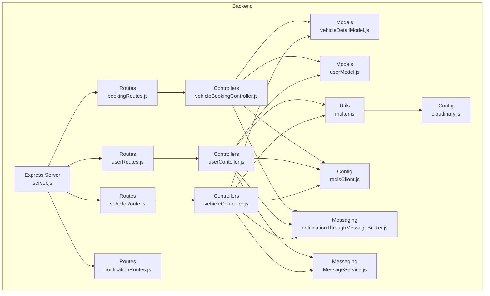
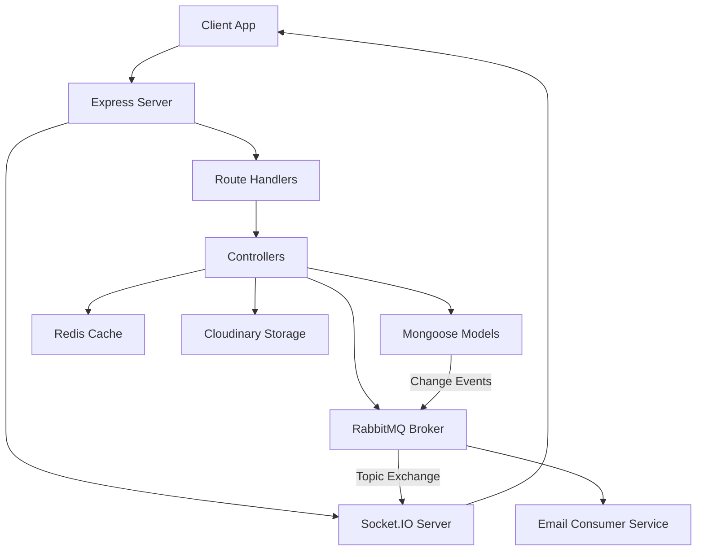
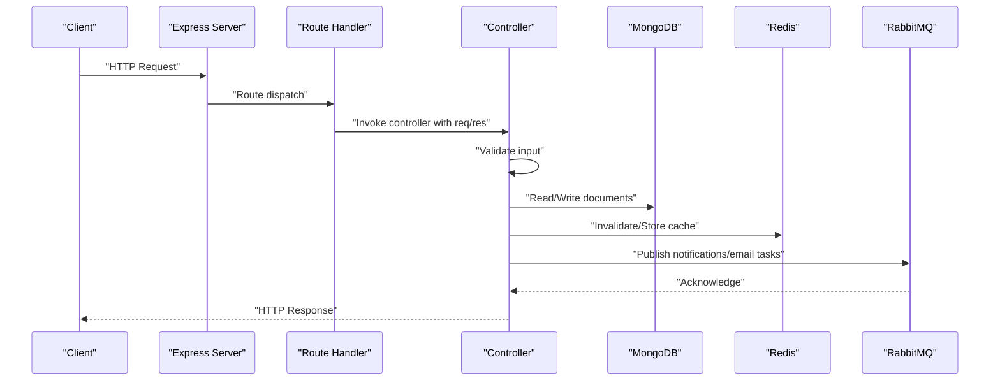
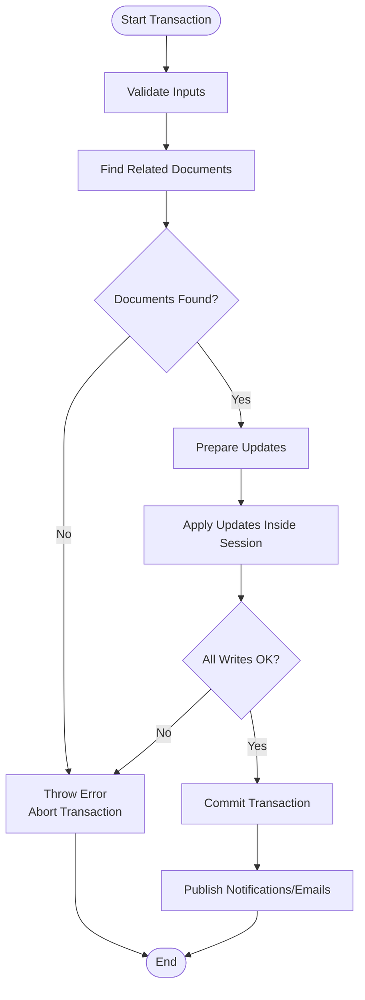
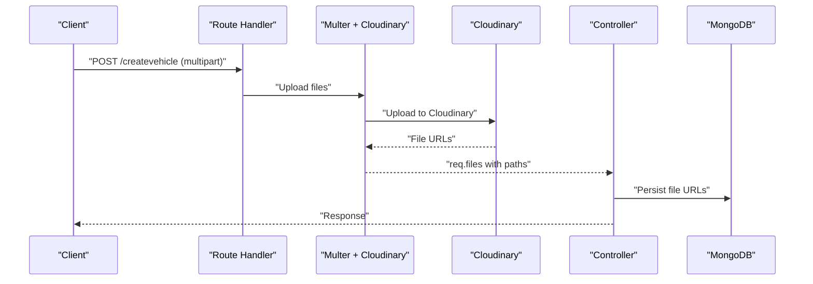
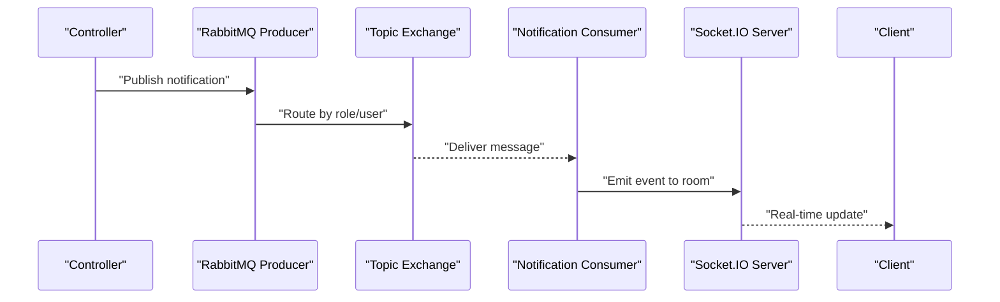
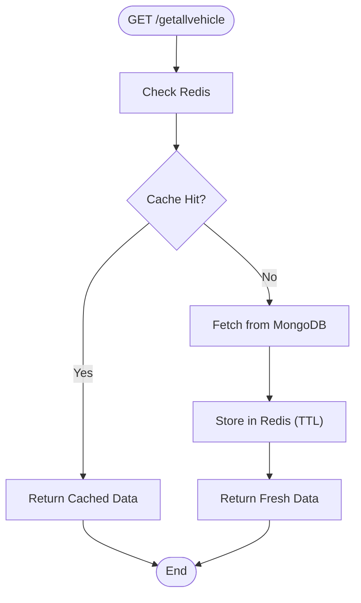
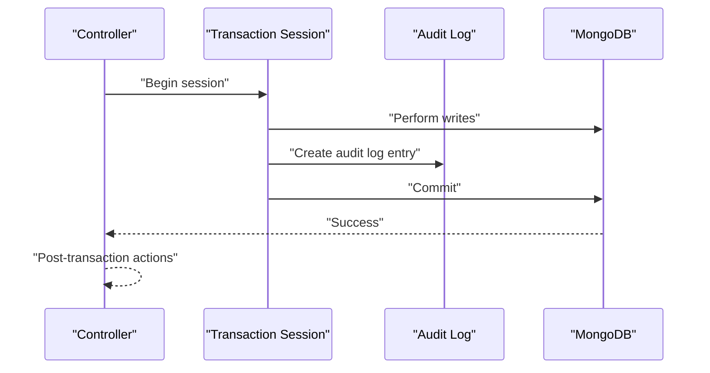
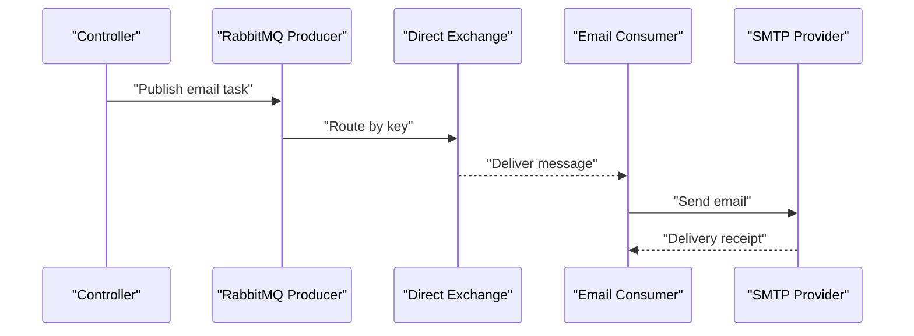
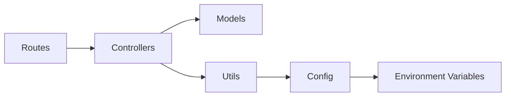

# Data Flow Architecture

<cite>
**Referenced Files in This Document**
- [server.js](file://backend/server.js)
- [vehicleRoute.js](file://backend/router/vehicleRoute.js)
- [userRoutes.js](file://backend/router/userRoutes.js)
- [bookingRoutes.js](file://backend/router/bookingRoutes.js)
- [notificationRoutes.js](file://backend/router/notificationRoutes.js)
- [vehicleController.js](file://backend/Controller/vehicleController.js)
- [userContoller.js](file://backend/Controller/userContoller.js)
- [vehicleBookingController.js](file://backend/Controller/vehicleBookingController.js)
- [vehicleDetailModel.js](file://backend/model/vehicleDetailModel.js)
- [userModel.js](file://backend/model/userModel.js)
- [multer.js](file://backend/utils/multer.js)
- [cloudinary.js](file://backend/config/cloudinary.js)
- [redisClient.js](file://backend/config/redisClient.js)
- [notificationThroughMessageBroker.js](file://backend/utils/notificationThroughMessageBroker.js)
- [MessageService.js](file://backend/NotificationServices/MessageService.js)
</cite>

## Table of Contents
1. [Introduction](#introduction)
2. [Project Structure](#project-structure)
3. [Core Components](#core-components)
4. [Architecture Overview](#architecture-overview)
5. [Detailed Component Analysis](#detailed-component-analysis)
6. [Dependency Analysis](#dependency-analysis)
7. [Performance Considerations](#performance-considerations)
8. [Troubleshooting Guide](#troubleshooting-guide)
9. [Conclusion](#conclusion)

## Introduction
This document describes the end-to-end data flow architecture of the Vehicle Management System. It covers request handling, authentication and authorization, validation, business logic execution, database transactions, caching, file uploads with Cloudinary, asynchronous messaging via RabbitMQ, real-time notifications through Socket.IO, audit logging, and error handling. The goal is to provide a comprehensive understanding of how data moves through the system from user requests to persistence and external integrations.

## Project Structure
The backend is organized around Express routes, controllers, Mongoose models, utilities, and configuration modules. The server initializes middleware, Socket.IO, routes, and error handling. Utility modules encapsulate file upload, Redis caching, RabbitMQ messaging, and JWT token generation.

**Diagram sources**
- [server.js](file://backend/server.js#L34-L76)
- [vehicleRoute.js](file://backend/router/vehicleRoute.js#L1-L42)
- [userRoutes.js](file://backend/router/userRoutes.js#L1-L119)
- [bookingRoutes.js](file://backend/router/bookingRoutes.js#L1-L31)
- [notificationRoutes.js](file://backend/router/notificationRoutes.js#L1-L14)
- [vehicleController.js](file://backend/Controller/vehicleController.js#L1-L203)
- [userContoller.js](file://backend/Controller/userContoller.js#L1-L92)
- [vehicleBookingController.js](file://backend/Controller/vehicleBookingController.js#L1-L466)
- [vehicleDetailModel.js](file://backend/model/vehicleDetailModel.js#L1-L145)
- [userModel.js](file://backend/model/userModel.js#L1-L162)
- [multer.js](file://backend/utils/multer.js#L1-L52)
- [cloudinary.js](file://backend/config/cloudinary.js#L1-L12)
- [redisClient.js](file://backend/config/redisClient.js#L1-L20)
- [notificationThroughMessageBroker.js](file://backend/utils/notificationThroughMessageBroker.js#L1-L69)
- [MessageService.js](file://backend/NotificationServices/MessageService.js#L1-L65)

**Section sources**
- [server.js](file://backend/server.js#L34-L76)
- [vehicleRoute.js](file://backend/router/vehicleRoute.js#L1-L42)
- [userRoutes.js](file://backend/router/userRoutes.js#L1-L119)
- [bookingRoutes.js](file://backend/router/bookingRoutes.js#L1-L31)
- [notificationRoutes.js](file://backend/router/notificationRoutes.js#L1-L14)

## Core Components
- Express server and HTTP server initialization, CORS, cookies, body parsing, Socket.IO setup, static file serving, global error handler, and route registration.
- Route modules define endpoints for vehicles, users, bookings, and notifications with middleware for authentication, role restrictions, and file uploads.
- Controllers implement business logic, validation, transaction management, audit logging, notifications, and email queuing.
- Models define embedded arrays for vehicle variants and user-related metadata.
- Utilities handle file uploads to Cloudinary, Redis client, RabbitMQ producers/consumers, JWT generation, and async error handling.

**Section sources**
- [server.js](file://backend/server.js#L1-L204)
- [vehicleController.js](file://backend/Controller/vehicleController.js#L1-L203)
- [userContoller.js](file://backend/Controller/userContoller.js#L1-L92)
- [vehicleBookingController.js](file://backend/Controller/vehicleBookingController.js#L1-L466)
- [vehicleDetailModel.js](file://backend/model/vehicleDetailModel.js#L1-L145)
- [userModel.js](file://backend/model/userModel.js#L1-L162)
- [multer.js](file://backend/utils/multer.js#L1-L52)
- [redisClient.js](file://backend/config/redisClient.js#L1-L20)
- [notificationThroughMessageBroker.js](file://backend/utils/notificationThroughMessageBroker.js#L1-L69)
- [MessageService.js](file://backend/NotificationServices/MessageService.js#L1-L65)

## Architecture Overview
The system follows a layered architecture:
- Presentation Layer: Express routes and Socket.IO for real-time updates.
- Application Layer: Controllers orchestrate business logic, validation, transactions, and external integrations.
- Persistence Layer: MongoDB via Mongoose models with embedded arrays for vehicle variants.
- Integration Layer: Cloudinary for image storage, Redis for caching, RabbitMQ for asynchronous messaging, and Socket.IO for real-time notifications.

**Diagram sources**
- [server.js](file://backend/server.js#L34-L76)
- [vehicleController.js](file://backend/Controller/vehicleController.js#L170-L203)
- [userContoller.js](file://backend/Controller/userContoller.js#L65-L91)
- [vehicleBookingController.js](file://backend/Controller/vehicleBookingController.js#L430-L466)
- [vehicleDetailModel.js](file://backend/model/vehicleDetailModel.js#L55-L105)
- [redisClient.js](file://backend/config/redisClient.js#L1-L20)
- [multer.js](file://backend/utils/multer.js#L25-L44)
- [notificationThroughMessageBroker.js](file://backend/utils/notificationThroughMessageBroker.js#L33-L64)
- [MessageService.js](file://backend/NotificationServices/MessageService.js#L36-L60)

## Detailed Component Analysis

### Request/Response Flow and Authentication
- Authentication: JWT-based access tokens and refresh tokens; refresh token stored as an HTTP-only cookie. Middleware verifies tokens and attaches user context to requests.
- Authorization: Role-based access control restricts administrative endpoints.
- Validation: Controllers validate request bodies and enforce business rules; errors are returned via a centralized error handling middleware.

**Diagram sources**
- [server.js](file://backend/server.js#L38-L64)
- [userRoutes.js](file://backend/router/userRoutes.js#L21-L26)
- [vehicleRoute.js](file://backend/router/vehicleRoute.js#L8-L14)
- [bookingRoutes.js](file://backend/router/bookingRoutes.js#L7-L7)
- [userContoller.js](file://backend/Controller/userContoller.js#L25-L92)
- [vehicleController.js](file://backend/Controller/vehicleController.js#L21-L203)
- [vehicleBookingController.js](file://backend/Controller/vehicleBookingController.js#L235-L466)

**Section sources**
- [userRoutes.js](file://backend/router/userRoutes.js#L1-L119)
- [vehicleRoute.js](file://backend/router/vehicleRoute.js#L1-L42)
- [bookingRoutes.js](file://backend/router/bookingRoutes.js#L1-L31)
- [server.js](file://backend/server.js#L38-L64)

### Transaction Management for Complex Operations
- Vehicle and booking operations use MongoDB transactions to maintain atomicity across collections and nested arrays.
- Controllers wrap critical sections in transaction blocks, ensuring that related updates (e.g., booking creation, vehicle availability, user stats) succeed or fail together.
- Post-transaction actions (notifications and emails) occur outside the transaction to avoid long-running operations inside the session.

**Diagram sources**
- [vehicleController.js](file://backend/Controller/vehicleController.js#L73-L168)
- [vehicleBookingController.js](file://backend/Controller/vehicleBookingController.js#L288-L425)

**Section sources**
- [vehicleController.js](file://backend/Controller/vehicleController.js#L73-L168)
- [vehicleBookingController.js](file://backend/Controller/vehicleBookingController.js#L288-L425)

### File Upload and Cloudinary Integration
- Multer integrates with Cloudinary storage to upload vehicle and user images to dedicated folders.
- Upload middleware supports arrays for multiple files and single file uploads with size limits.
- Uploaded files are stored in Cloudinary and URLs are persisted in models.

**Diagram sources**
- [vehicleRoute.js](file://backend/router/vehicleRoute.js#L8-L14)
- [userRoutes.js](file://backend/router/userRoutes.js#L69-L82)
- [multer.js](file://backend/utils/multer.js#L25-L44)
- [cloudinary.js](file://backend/config/cloudinary.js#L5-L9)
- [vehicleController.js](file://backend/Controller/vehicleController.js#L63-L67)
- [userContoller.js](file://backend/Controller/userContoller.js#L333-L377)

**Section sources**
- [multer.js](file://backend/utils/multer.js#L1-L52)
- [cloudinary.js](file://backend/config/cloudinary.js#L1-L12)
- [vehicleController.js](file://backend/Controller/vehicleController.js#L63-L67)
- [userContoller.js](file://backend/Controller/userContoller.js#L333-L377)

### Real-Time Notifications via RabbitMQ and Socket.IO
- Controllers publish structured notifications to a topic exchange keyed by role/user.
- A consumer service subscribes to the exchange and forwards events to Socket.IO rooms.
- Socket.IO server broadcasts updates to connected clients based on routing keys.

**Diagram sources**
- [notificationThroughMessageBroker.js](file://backend/utils/notificationThroughMessageBroker.js#L33-L64)
- [server.js](file://backend/server.js#L52-L60)

**Section sources**
- [notificationThroughMessageBroker.js](file://backend/utils/notificationThroughMessageBroker.js#L1-L69)
- [server.js](file://backend/server.js#L52-L60)

### Data Transformation Patterns and Caching Strategies
- Controllers implement transformations for pricing arrays and timestamps.
- Redis caching stores frequently accessed vehicle lists with TTL to reduce DB load.
- Cache invalidation occurs after write operations to ensure freshness.

**Diagram sources**
- [vehicleController.js](file://backend/Controller/vehicleController.js#L211-L240)
- [redisClient.js](file://backend/config/redisClient.js#L1-L20)

**Section sources**
- [vehicleController.js](file://backend/Controller/vehicleController.js#L211-L240)
- [redisClient.js](file://backend/config/redisClient.js#L1-L20)

### Audit Logging Throughout the Pipeline
- Controllers capture before/after states during updates and persist audit logs with action types and user context.
- Audit logs are written within transactions to maintain consistency.

**Diagram sources**
- [vehicleController.js](file://backend/Controller/vehicleController.js#L153-L165)
- [vehicleBookingController.js](file://backend/Controller/vehicleBookingController.js#L585-L585)

**Section sources**
- [vehicleController.js](file://backend/Controller/vehicleController.js#L153-L165)
- [vehicleBookingController.js](file://backend/Controller/vehicleBookingController.js#L585-L585)

### Email Delivery Pipeline
- Controllers queue emails by publishing to direct exchanges with routing keys.
- A dedicated consumer service consumes messages and sends emails asynchronously.

**Diagram sources**
- [MessageService.js](file://backend/NotificationServices/MessageService.js#L36-L60)
- [userContoller.js](file://backend/Controller/userContoller.js#L65-L91)
- [vehicleController.js](file://backend/Controller/vehicleController.js#L176-L198)

**Section sources**
- [MessageService.js](file://backend/NotificationServices/MessageService.js#L1-L65)
- [userContoller.js](file://backend/Controller/userContoller.js#L65-L91)
- [vehicleController.js](file://backend/Controller/vehicleController.js#L176-L198)

## Dependency Analysis
- Controllers depend on models for data access and on utilities for uploads, caching, and messaging.
- Routes depend on controllers and middleware for authentication and authorization.
- Messaging utilities depend on RabbitMQ configuration and environment variables.
- Redis client depends on environment configuration.

**Diagram sources**
- [vehicleController.js](file://backend/Controller/vehicleController.js#L1-L20)
- [userContoller.js](file://backend/Controller/userContoller.js#L1-L20)
- [vehicleBookingController.js](file://backend/Controller/vehicleBookingController.js#L1-L15)
- [multer.js](file://backend/utils/multer.js#L1-L52)
- [redisClient.js](file://backend/config/redisClient.js#L1-L20)
- [notificationThroughMessageBroker.js](file://backend/utils/notificationThroughMessageBroker.js#L1-L69)
- [MessageService.js](file://backend/NotificationServices/MessageService.js#L1-L65)

**Section sources**
- [vehicleController.js](file://backend/Controller/vehicleController.js#L1-L20)
- [userContoller.js](file://backend/Controller/userContoller.js#L1-L20)
- [vehicleBookingController.js](file://backend/Controller/vehicleBookingController.js#L1-L15)
- [multer.js](file://backend/utils/multer.js#L1-L52)
- [redisClient.js](file://backend/config/redisClient.js#L1-L20)
- [notificationThroughMessageBroker.js](file://backend/utils/notificationThroughMessageBroker.js#L1-L69)
- [MessageService.js](file://backend/NotificationServices/MessageService.js#L1-L65)

## Performance Considerations
- Use Redis caching for read-heavy endpoints to reduce database load.
- Batch operations and minimize round-trips within transactions.
- Optimize Cloudinary uploads with appropriate file sizes and formats.
- Monitor RabbitMQ queue depths and consumer lag to prevent backpressure.
- Implement circuit breakers and retries for external services.

## Troubleshooting Guide
- Authentication failures: Verify JWT secret, token expiration, and cookie settings.
- Upload issues: Check Cloudinary credentials and folder permissions; validate file size and format constraints.
- Transaction errors: Review MongoDB transaction timeouts and ensure all writes occur within the session.
- Cache misses: Confirm Redis connectivity and TTL configuration; invalidate cache after writes.
- Messaging failures: Inspect RabbitMQ connectivity, exchange/routing key configuration, and consumer logs.

**Section sources**
- [server.js](file://backend/server.js#L38-L64)
- [cloudinary.js](file://backend/config/cloudinary.js#L5-L9)
- [redisClient.js](file://backend/config/redisClient.js#L7-L13)
- [notificationThroughMessageBroker.js](file://backend/utils/notificationThroughMessageBroker.js#L8-L30)
- [MessageService.js](file://backend/NotificationServices/MessageService.js#L9-L34)

## Conclusion
The Vehicle Management System employs a robust, layered architecture with clear separation of concerns. Transactions ensure data consistency for complex operations, Redis enhances performance, Cloudinary streamlines media handling, and RabbitMQ decouples real-time notifications and email delivery. Together, these components deliver a scalable and maintainable data flow from user requests to persistence and external integrations.