# Deployment Topology

<cite>
**Referenced Files in This Document**
- [docker-compose.yml](file://docker-compose.yml)
- [Dockerrun.aws.json](file://Dockerrun.aws.json)
- [backend/Dockerfile](file://backend/Dockerfile)
- [frontend/Dockerfile](file://frontend/Dockerfile)
- [messageServices/Dockerfile](file://messageServices/Dockerfile)
- [backend/server.js](file://backend/server.js)
- [backend/config/redisClient.js](file://backend/config/redisClient.js)
- [backend/DatabaseConnection/dataBaseConnection.js](file://backend/DatabaseConnection/dataBaseConnection.js)
- [backend/config/cloudinary.js](file://backend/config/cloudinary.js)
- [messageServices/server.js](file://messageServices/server.js)
- [messageServices/controller/rabbitmqConsumer.js](file://messageServices/controller/rabbitmqConsumer.js)
- [.github/workflows/main.yml](file://.github/workflows/main.yml)
- [frontend/src/APIPoints/AllApiPonts.js](file://frontend/src/APIPoints/AllApiPonts.js)
- [backend/package.json](file://backend/package.json)
- [frontend/package.json](file://frontend/package.json)
</cite>

## Table of Contents
1. [Introduction](#introduction)
2. [Project Structure](#project-structure)
3. [Core Components](#core-components)
4. [Architecture Overview](#architecture-overview)
5. [Detailed Component Analysis](#detailed-component-analysis)
6. [Dependency Analysis](#dependency-analysis)
7. [Performance Considerations](#performance-considerations)
8. [Troubleshooting Guide](#troubleshooting-guide)
9. [Conclusion](#conclusion)
10. [Appendices](#appendices)

## Introduction
This document describes the deployment topology and infrastructure architecture of the Vehicle Management System. It covers the multi-container Docker-based development setup using docker-compose, the AWS Elastic Beanstalk deployment configuration via Dockerrun.aws.json, and the CI/CD pipeline that automates deployments to a self-managed EC2 host. The system comprises three primary services: a frontend React application, a Node.js backend API, and a dedicated message service for asynchronous notifications powered by RabbitMQ. Additional infrastructure components include MongoDB for persistence and Redis for caching, with Cloudinary for media storage.

## Project Structure
The repository is organized into three main applications and deployment configuration files:
- backend: Node.js REST API with Express, Socket.IO, MongoDB, Redis, and Cloudinary integrations
- frontend: React SPA built with create-react-app and served statically
- messageServices: Node.js service consuming RabbitMQ messages and emitting Socket.IO events
- Deployment configs: docker-compose.yml for local orchestration and Dockerrun.aws.json for EB deployment
- CI/CD: GitHub Actions workflow for automated deployment to EC2

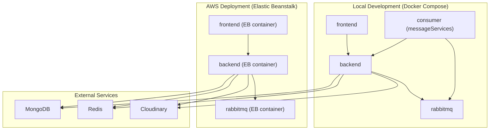

**Diagram sources**
- [docker-compose.yml](file://docker-compose.yml#L3-L52)
- [Dockerrun.aws.json](file://Dockerrun.aws.json#L3-L41)
- [backend/server.js](file://backend/server.js#L17-L18)
- [backend/config/redisClient.js](file://backend/config/redisClient.js#L3-L5)
- [backend/config/cloudinary.js](file://backend/config/cloudinary.js#L5-L8)

**Section sources**
- [docker-compose.yml](file://docker-compose.yml#L1-L54)
- [Dockerrun.aws.json](file://Dockerrun.aws.json#L1-L47)

## Core Components
- Frontend (React): Built and served statically on port 3000. Environment variables define the backend API endpoint and optional notification server.
- Backend (Express): Exposes REST APIs, handles uploads, integrates with MongoDB, Redis, and Cloudinary. It also initializes Socket.IO for real-time features.
- Message Service: Consumes RabbitMQ exchanges/queues for notifications and emits Socket.IO events to registered clients.
- RabbitMQ: Provides asynchronous messaging with durable exchanges, queues, and dead-letter queues configured per routing key.
- Infrastructure:
  - MongoDB: Connection configured via MONGOURL environment variable
  - Redis: Client configured via REDIS_URL environment variable
  - Cloudinary: Media storage configured via CLOUDINARY_* environment variables

**Section sources**
- [frontend/Dockerfile](file://frontend/Dockerfile#L1-L23)
- [backend/Dockerfile](file://backend/Dockerfile#L1-L13)
- [messageServices/Dockerfile](file://messageServices/Dockerfile#L1-L14)
- [frontend/src/APIPoints/AllApiPonts.js](file://frontend/src/APIPoints/AllApiPonts.js#L1-L3)
- [backend/server.js](file://backend/server.js#L17-L18)
- [backend/config/redisClient.js](file://backend/config/redisClient.js#L3-L5)
- [backend/config/cloudinary.js](file://backend/config/cloudinary.js#L5-L8)
- [messageServices/server.js](file://messageServices/server.js#L9-L21)
- [messageServices/controller/rabbitmqConsumer.js](file://messageServices/controller/rabbitmqConsumer.js#L18-L25)

## Architecture Overview
The system follows a microservice-like containerization pattern:
- frontend: Stateless web client
- backend: API gateway and business logic
- messageServices: Asynchronous notification processor
- rabbitmq: Message broker for decoupled communication
- MongoDB: Primary data store
- Redis: Caching layer
- Cloudinary: File/media storage

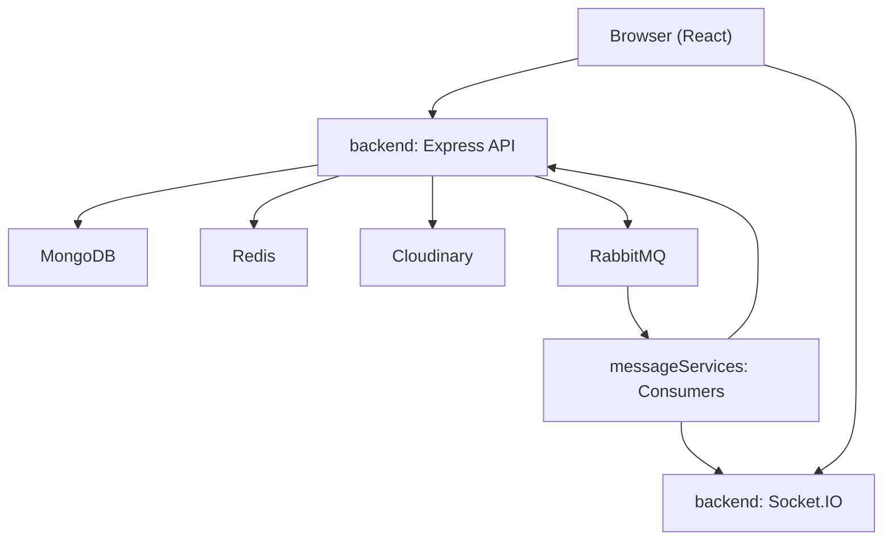

**Diagram sources**
- [backend/server.js](file://backend/server.js#L38-L64)
- [backend/DatabaseConnection/dataBaseConnection.js](file://backend/DatabaseConnection/dataBaseConnection.js#L4-L16)
- [backend/config/redisClient.js](file://backend/config/redisClient.js#L3-L5)
- [backend/config/cloudinary.js](file://backend/config/cloudinary.js#L5-L8)
- [messageServices/server.js](file://messageServices/server.js#L34-L53)
- [messageServices/controller/rabbitmqConsumer.js](file://messageServices/controller/rabbitmqConsumer.js#L86-L130)

## Detailed Component Analysis

### Docker Orchestration (Development)
- Services:
  - frontend: Builds from ./frontend, exposes port 3000, sets REACT_APP_API_URL to http://localhost:5000, depends_on backend
  - backend: Builds from ./backend, exposes port 5000, sets PORT and RabbitMQ connection string, depends_on rabbitmq
  - rabbitmq: Official RabbitMQ image with management plugin, exposes 5672 and 15672, sets default user/pass
  - consumer: Builds from ./messageServices, exposes port 8000, sets PORT and RabbitMQ connection string, depends_on rabbitmq and backend

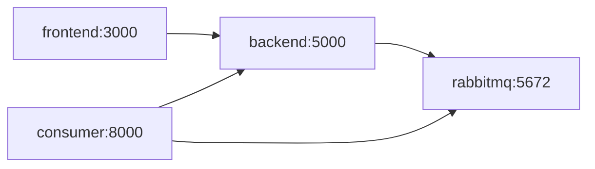

**Diagram sources**
- [docker-compose.yml](file://docker-compose.yml#L4-L52)

**Section sources**
- [docker-compose.yml](file://docker-compose.yml#L3-L52)

### AWS Elastic Beanstalk Deployment (Dockerrun.aws.json)
- Container definitions:
  - frontend: image "frontend", essential, port 3000
  - backend: image "backend", essential, port 5000
  - rabbitmq: image "rabbitmq:3-management", essential=false, ports 5672, 15672
- Notes:
  - The EB configuration does not include explicit environment variables for MongoDB, Redis, or Cloudinary credentials. These would need to be provided via EB environment properties or linked services in a full production EB environment.

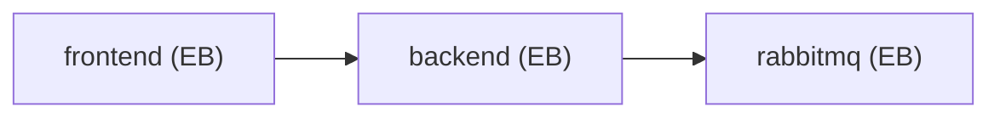

**Diagram sources**
- [Dockerrun.aws.json](file://Dockerrun.aws.json#L3-L41)

**Section sources**
- [Dockerrun.aws.json](file://Dockerrun.aws.json#L1-L47)

### CI/CD Pipeline (GitHub Actions)
- Workflow triggers on pushes to main branch
- Self-hosted runner executes steps:
  - Ensures RabbitMQ container is running locally
  - Installs backend dependencies and writes .env with production variables and RABBITMQ_URL pointing to localhost
  - Starts backend using PM2
  - Installs and builds frontend, deploys built assets to /var/www/html

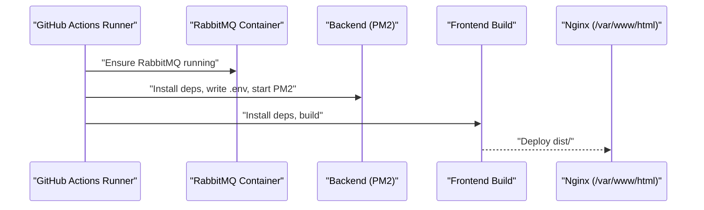

**Diagram sources**
- [.github/workflows/main.yml](file://.github/workflows/main.yml#L32-L70)
- [.github/workflows/main.yml](file://.github/workflows/main.yml#L75-L99)

**Section sources**
- [.github/workflows/main.yml](file://.github/workflows/main.yml#L1-L99)

### Backend API Containerization
- Base image: node:18-alpine
- Working directory: /app
- Installs dependencies from package*.json
- Copies application code
- Starts with npm start
- Exposes port 5000

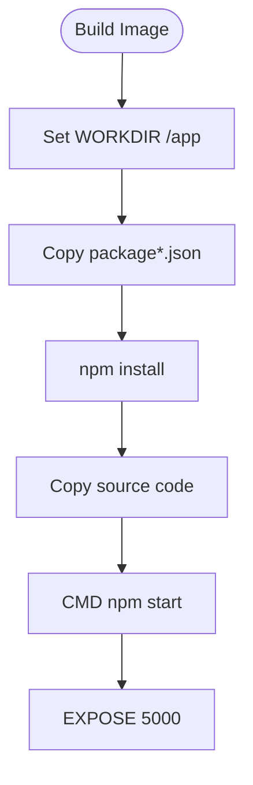

**Diagram sources**
- [backend/Dockerfile](file://backend/Dockerfile#L1-L13)

**Section sources**
- [backend/Dockerfile](file://backend/Dockerfile#L1-L13)
- [backend/package.json](file://backend/package.json#L32-L35)

### Frontend Containerization
- Base image: node:18-alpine
- Installs dependencies
- Copies source code
- Builds production bundle with npm run build
- Serves with static server (serve -s build)
- Exposes port 3000

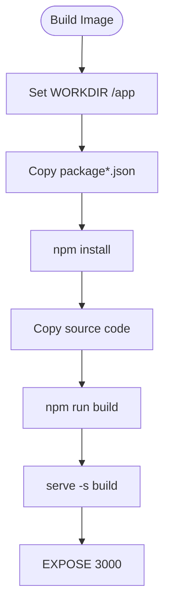

**Diagram sources**
- [frontend/Dockerfile](file://frontend/Dockerfile#L1-L23)

**Section sources**
- [frontend/Dockerfile](file://frontend/Dockerfile#L1-L23)
- [frontend/package.json](file://frontend/package.json#L37-L43)

### Message Service Containerization
- Base image: node:18-alpine
- Installs dependencies
- Copies source code
- Starts with node server.js
- Exposes port 8000

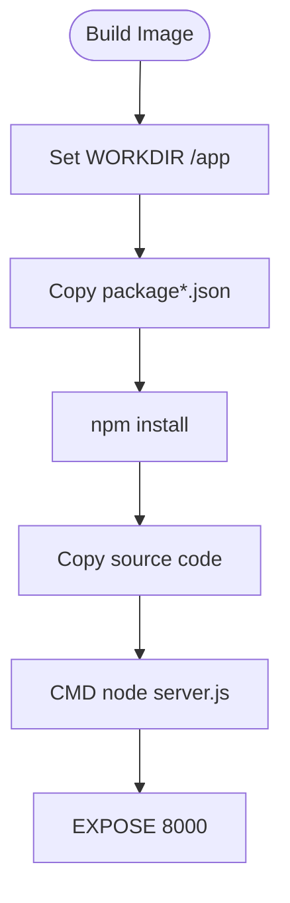

**Diagram sources**
- [messageServices/Dockerfile](file://messageServices/Dockerfile#L1-L14)

**Section sources**
- [messageServices/Dockerfile](file://messageServices/Dockerfile#L1-L14)

### Backend Application Entrypoint and Integrations
- Loads environment-specific .env file based on NODE_ENV
- Initializes CORS, cookies, body parsing, and Socket.IO with shared CORS settings
- Registers API routes for users, vehicles, bookings, reports, and notifications
- Serves uploaded files from backend/uploads
- Connects to MongoDB via MONGOURL
- Exposes health check route (commented)
- Starts HTTP server on configurable PORT

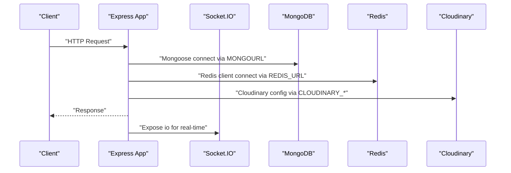

**Diagram sources**
- [backend/server.js](file://backend/server.js#L3-L64)
- [backend/server.js](file://backend/server.js#L17-L18)
- [backend/DatabaseConnection/dataBaseConnection.js](file://backend/DatabaseConnection/dataBaseConnection.js#L4-L16)
- [backend/config/redisClient.js](file://backend/config/redisClient.js#L3-L5)
- [backend/config/cloudinary.js](file://backend/config/cloudinary.js#L5-L8)

**Section sources**
- [backend/server.js](file://backend/server.js#L1-L204)
- [backend/DatabaseConnection/dataBaseConnection.js](file://backend/DatabaseConnection/dataBaseConnection.js#L1-L17)
- [backend/config/redisClient.js](file://backend/config/redisClient.js#L1-L20)
- [backend/config/cloudinary.js](file://backend/config/cloudinary.js#L1-L12)

### Message Service and RabbitMQ Integration
- Socket.IO server listens on port 8000 with CORS
- Registers user/admin rooms and emits notifications to respective rooms
- Consumes RabbitMQ exchanges for multiple routing keys (e.g., task.* and bookingtask.*)
- Uses durable exchanges and queues with dead-letter queues per routing key
- Implements exponential backoff retry with a maximum retry count before moving to DLQ
- Supports multiple consumers started concurrently

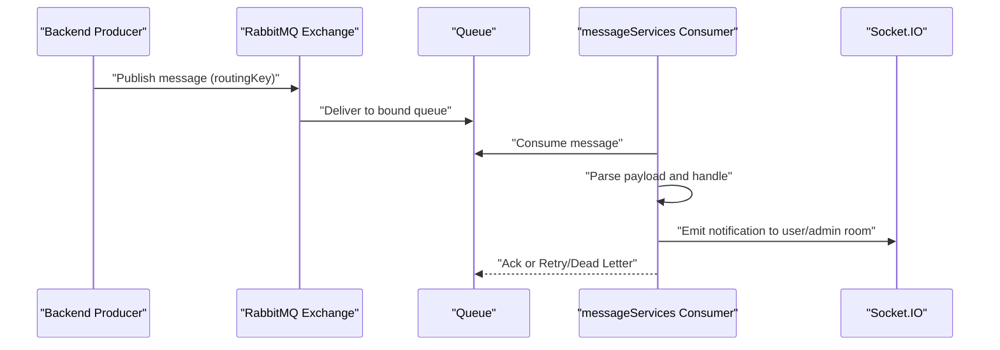

**Diagram sources**
- [messageServices/server.js](file://messageServices/server.js#L34-L53)
- [messageServices/controller/rabbitmqConsumer.js](file://messageServices/controller/rabbitmqConsumer.js#L86-L130)
- [messageServices/controller/rabbitmqConsumer.js](file://messageServices/controller/rabbitmqConsumer.js#L62-L83)

**Section sources**
- [messageServices/server.js](file://messageServices/server.js#L1-L84)
- [messageServices/controller/rabbitmqConsumer.js](file://messageServices/controller/rabbitmqConsumer.js#L1-L216)

### Frontend Environment and API Endpoints
- Environment variables:
  - REACT_APP_API_SERVER_URL: Used by frontend to determine the backend API base URL
  - REACT_APP_API_SOCKET_URL: Optional notification server endpoint
- The frontend reads these variables at runtime to configure API calls and Socket.IO connections.

**Section sources**
- [frontend/src/APIPoints/AllApiPonts.js](file://frontend/src/APIPoints/AllApiPonts.js#L1-L3)

## Dependency Analysis
- Internal dependencies:
  - backend depends on MongoDB, Redis, Cloudinary, and RabbitMQ
  - frontend communicates with backend REST API and optionally a notification server
  - messageServices consumes RabbitMQ and emits Socket.IO events to backend
- External dependencies:
  - RabbitMQ for asynchronous messaging
  - MongoDB for persistence
  - Redis for caching
  - Cloudinary for media storage

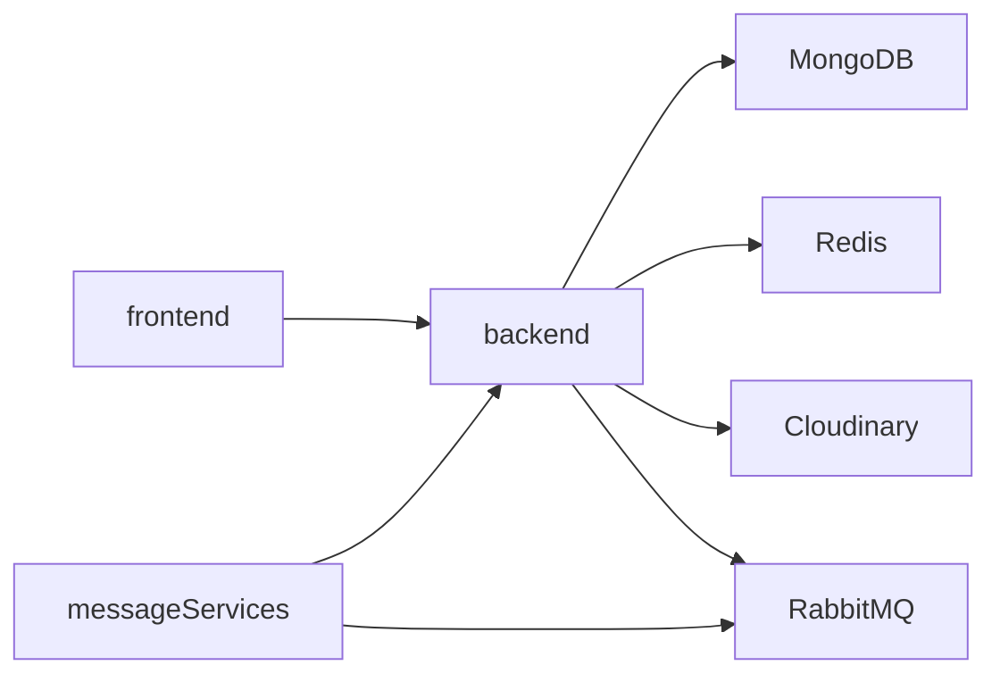

**Diagram sources**
- [backend/server.js](file://backend/server.js#L17-L18)
- [backend/config/redisClient.js](file://backend/config/redisClient.js#L3-L5)
- [backend/config/cloudinary.js](file://backend/config/cloudinary.js#L5-L8)
- [messageServices/server.js](file://messageServices/server.js#L34-L53)
- [messageServices/controller/rabbitmqConsumer.js](file://messageServices/controller/rabbitmqConsumer.js#L86-L130)

**Section sources**
- [backend/package.json](file://backend/package.json#L2-L31)
- [frontend/package.json](file://frontend/package.json#L5-L36)

## Performance Considerations
- Container sizing and resource limits:
  - Define CPU and memory limits per service in docker-compose for predictable performance
  - Use separate containers for backend and consumer to scale independently
- Database and caching:
  - Tune MongoDB connection pool size and timeouts
  - Use Redis for session caching and rate limiting
- Message throughput:
  - Increase RabbitMQ prefetch count for consumers
  - Monitor queue depths and DLQ growth
- Static asset delivery:
  - Serve frontend via a CDN or reverse proxy for improved latency and bandwidth utilization
- Horizontal scaling:
  - Run multiple backend instances behind a load balancer
  - Scale consumers horizontally to handle bursts in notification volume

## Troubleshooting Guide
- RabbitMQ connectivity:
  - Verify RABBITMQURL in backend and consumer containers points to the rabbitmq service hostname and port
  - Confirm default credentials match those set in docker-compose
- MongoDB connection:
  - Ensure MONGOURL is set and reachable from the backend container
  - Check network connectivity between backend and MongoDB
- Redis connectivity:
  - Confirm REDIS_URL is set and Redis is reachable from backend
- Cloudinary configuration:
  - Validate CLOUDINARY_CLOUD_NAME, API_KEY, and API_SECRET are present
- Health checks:
  - Use backend’s base route to confirm API availability
  - Use message service’s root route to confirm notification service availability
- Logs:
  - Inspect container logs for RabbitMQ connection errors, DB connection failures, and Redis errors

**Section sources**
- [docker-compose.yml](file://docker-compose.yml#L17-L24)
- [backend/DatabaseConnection/dataBaseConnection.js](file://backend/DatabaseConnection/dataBaseConnection.js#L4-L16)
- [backend/config/redisClient.js](file://backend/config/redisClient.js#L11-L13)
- [backend/config/cloudinary.js](file://backend/config/cloudinary.js#L5-L8)
- [messageServices/controller/rabbitmqConsumer.js](file://messageServices/controller/rabbitmqConsumer.js#L36-L44)

## Conclusion
The Vehicle Management System employs a clear multi-container architecture with distinct roles for frontend, backend, and message services, orchestrated via Docker Compose for development and Dockerrun.aws.json for AWS Elastic Beanstalk. The backend integrates MongoDB, Redis, and Cloudinary, while RabbitMQ enables asynchronous notifications. The CI/CD pipeline automates deployments to a self-managed EC2 host. For production, consider adding resource limits, horizontal scaling, centralized logging, and a CDN for static assets.

## Appendices

### Environment Variables Reference
- Backend:
  - PORT: API server port
  - RABBITMQURL: RabbitMQ connection string
  - MONGOURL: MongoDB connection string
  - REDIS_URL: Redis connection string
  - FRONTEND: Allowed origin for CORS
  - CLOUDINARY_*: Cloudinary credentials
- Frontend:
  - REACT_APP_API_SERVER_URL: Backend API base URL
  - REACT_APP_API_SOCKET_URL: Optional notification server URL
- Message Service:
  - PORT: Notification service port
  - RABBITMQURL: RabbitMQ connection string
  - BACKEND_SERVICE_URL: Endpoint for creating notifications

**Section sources**
- [docker-compose.yml](file://docker-compose.yml#L17-L49)
- [backend/server.js](file://backend/server.js#L4-L9)
- [frontend/src/APIPoints/AllApiPonts.js](file://frontend/src/APIPoints/AllApiPonts.js#L1-L3)
- [messageServices/server.js](file://messageServices/server.js#L9-L21)