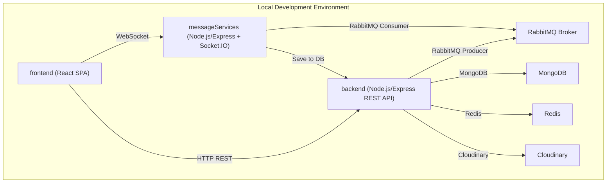
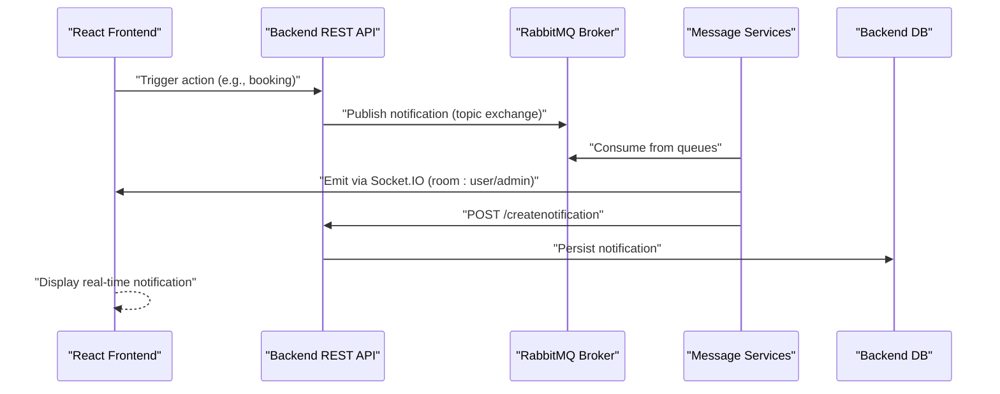
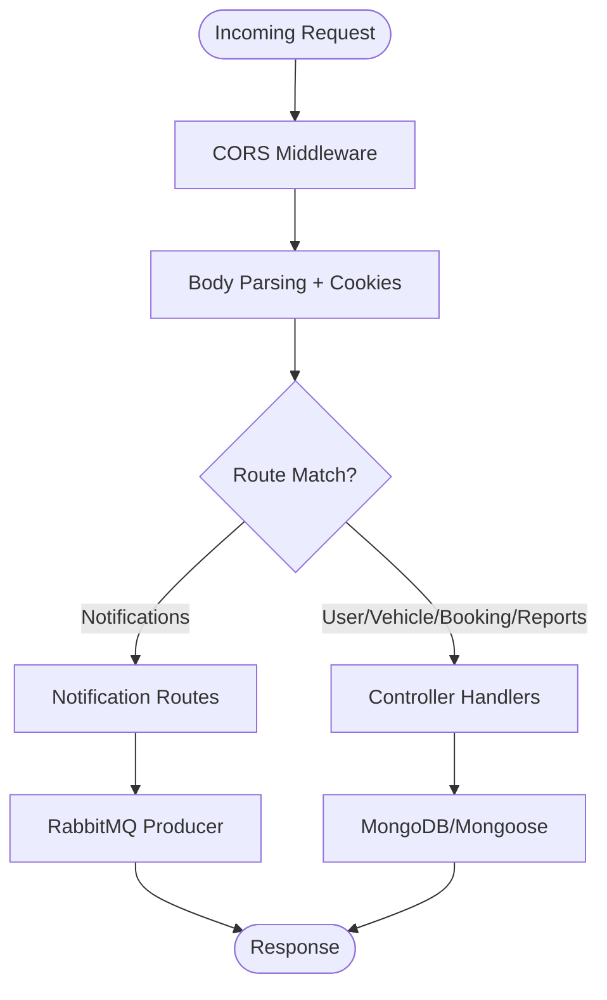
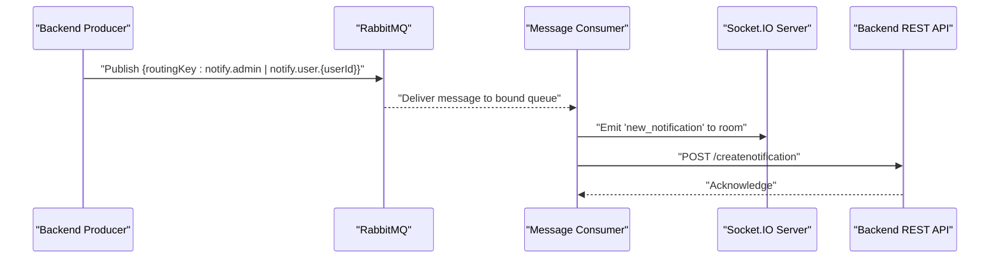
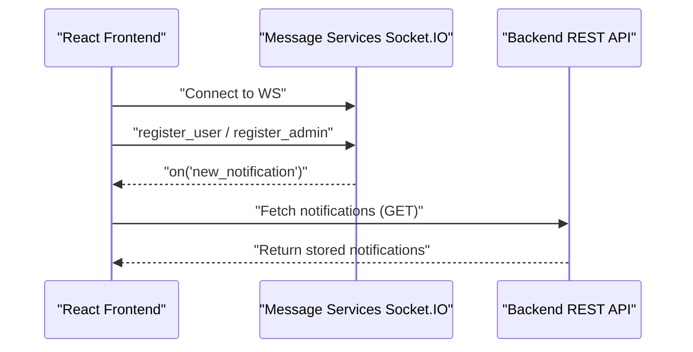
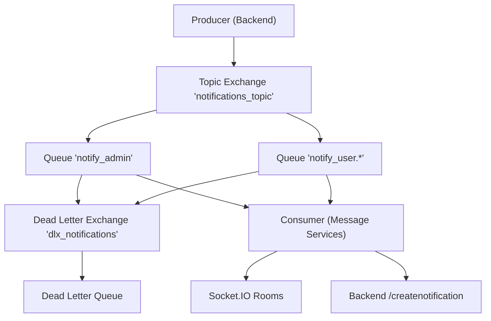
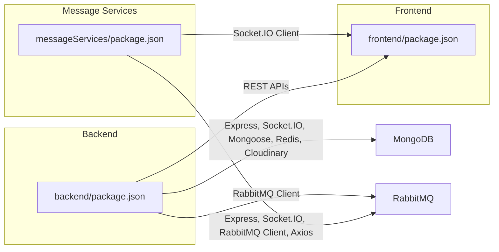

# Overall System Architecture

<cite>
**Referenced Files in This Document**
- [backend/server.js](file://backend/server.js)
- [backend/router/notificationRoutes.js](file://backend/router/notificationRoutes.js)
- [backend/utils/notificationThroughMessageBroker.js](file://backend/utils/notificationThroughMessageBroker.js)
- [backend/DatabaseConnection/dataBaseConnection.js](file://backend/DatabaseConnection/dataBaseConnection.js)
- [backend/config/cloudinary.js](file://backend/config/cloudinary.js)
- [backend/config/redisClient.js](file://backend/config/redisClient.js)
- [messageServices/server.js](file://messageServices/server.js)
- [messageServices/controller/notificationConsumer.js](file://messageServices/controller/notificationConsumer.js)
- [messageServices/routes/rabbitMQRoutes.js](file://messageServices/routes/rabbitMQRoutes.js)
- [frontend/src/App.js](file://frontend/src/App.js)
- [frontend/src/APIPoints/AllApiPonts.js](file://frontend/src/APIPoints/AllApiPonts.js)
- [frontend/src/ContextApi/NotificationContentAPI.jsx](file://frontend/src/ContextApi/NotificationContentAPI.jsx)
- [docker-compose.yml](file://docker-compose.yml)
- [backend/package.json](file://backend/package.json)
- [messageServices/package.json](file://messageServices/package.json)
- [frontend/package.json](file://frontend/package.json)
</cite>

## Table of Contents
1. [Introduction](#introduction)
2. [Project Structure](#project-structure)
3. [Core Components](#core-components)
4. [Architecture Overview](#architecture-overview)
5. [Detailed Component Analysis](#detailed-component-analysis)
6. [Dependency Analysis](#dependency-analysis)
7. [Performance Considerations](#performance-considerations)
8. [Troubleshooting Guide](#troubleshooting-guide)
9. [Conclusion](#conclusion)

## Introduction
This document describes the overall system architecture of the Vehicle Management System. The system follows a three-tier microservices architecture:
- Main backend API server built with Node.js/Express that exposes REST APIs, manages vehicle bookings, user management, reporting, and notifications.
- Separate message services built with Node.js/Express and Socket.IO that consume RabbitMQ messages and emit real-time notifications to clients via WebSocket.
- React frontend application that integrates with both REST APIs and WebSocket channels for real-time updates.

The architecture emphasizes scalability and fault isolation by separating concerns into distinct services, enabling independent scaling of the API server, message services, and frontend. RabbitMQ is used as the messaging backbone for decoupled, reliable notification delivery. MongoDB is used for persistence, Redis for caching, and Cloudinary for media storage.

## Project Structure
The repository is organized into three primary directories:
- backend: Contains the main REST API server, routers, controllers, models, utilities, and configuration for database, Redis, and Cloudinary.
- messageServices: Contains the message broker service responsible for consuming RabbitMQ notifications and emitting real-time events via Socket.IO.
- frontend: Contains the React SPA with Redux Toolkit for state management, Socket.IO client integration, and API endpoints configuration.

**Diagram sources**
- [docker-compose.yml](file://docker-compose.yml#L1-L54)
- [backend/server.js](file://backend/server.js#L1-L204)
- [messageServices/server.js](file://messageServices/server.js#L1-L84)
- [backend/utils/notificationThroughMessageBroker.js](file://backend/utils/notificationThroughMessageBroker.js#L1-L69)
- [messageServices/controller/notificationConsumer.js](file://messageServices/controller/notificationConsumer.js#L1-L119)
- [backend/DatabaseConnection/dataBaseConnection.js](file://backend/DatabaseConnection/dataBaseConnection.js#L1-L17)
- [backend/config/redisClient.js](file://backend/config/redisClient.js#L1-L20)
- [backend/config/cloudinary.js](file://backend/config/cloudinary.js#L1-L12)

**Section sources**
- [docker-compose.yml](file://docker-compose.yml#L1-L54)
- [backend/server.js](file://backend/server.js#L1-L204)
- [messageServices/server.js](file://messageServices/server.js#L1-L84)
- [frontend/src/App.js](file://frontend/src/App.js#L1-L79)

## Core Components
- Backend API Server
  - Initializes Express, configures CORS, cookies, body parsing, and Socket.IO for real-time capabilities.
  - Exposes REST routes for user, vehicle, booking, reports, and notifications.
  - Manages database connections and serves static upload files.
  - Provides centralized error handling middleware.

- Message Services
  - Runs an Express server with Socket.IO to emit real-time notifications.
  - Consumes RabbitMQ messages for admin and user-specific topics.
  - Registers users/admins into dedicated rooms and emits notifications via WebSocket.
  - Sends persisted notifications to the backend endpoint for database storage.

- Frontend Application
  - React SPA bootstrapped with Redux Toolkit for state management.
  - Integrates Socket.IO client to subscribe to user/admin rooms and receive live updates.
  - Uses environment-driven API endpoints for backend and notification servers.

- Messaging and Persistence
  - RabbitMQ topic exchange publishes notifications with routing keys for admin and user-specific channels.
  - Dead letter exchanges and queues ensure resilience and retries.
  - MongoDB stores application data; Redis provides caching; Cloudinary stores images.

**Section sources**
- [backend/server.js](file://backend/server.js#L34-L76)
- [backend/router/notificationRoutes.js](file://backend/router/notificationRoutes.js#L1-L14)
- [messageServices/server.js](file://messageServices/server.js#L9-L53)
- [messageServices/controller/notificationConsumer.js](file://messageServices/controller/notificationConsumer.js#L37-L91)
- [frontend/src/ContextApi/NotificationContentAPI.jsx](file://frontend/src/ContextApi/NotificationContentAPI.jsx#L10-L51)
- [backend/utils/notificationThroughMessageBroker.js](file://backend/utils/notificationThroughMessageBroker.js#L32-L64)
- [backend/DatabaseConnection/dataBaseConnection.js](file://backend/DatabaseConnection/dataBaseConnection.js#L4-L16)
- [backend/config/redisClient.js](file://backend/config/redisClient.js#L1-L20)
- [backend/config/cloudinary.js](file://backend/config/cloudinary.js#L4-L9)

## Architecture Overview
The system employs a decoupled, event-driven design:
- Producers (backend) publish notifications to a RabbitMQ topic exchange with role-based routing keys.
- Consumers (message services) bind queues to the exchange and forward notifications to Socket.IO rooms.
- Clients subscribe to user/admin rooms and receive real-time updates.
- Persisted notifications are saved to the backend database via a dedicated endpoint.

**Diagram sources**
- [backend/utils/notificationThroughMessageBroker.js](file://backend/utils/notificationThroughMessageBroker.js#L32-L64)
- [messageServices/controller/notificationConsumer.js](file://messageServices/controller/notificationConsumer.js#L63-L87)
- [messageServices/server.js](file://messageServices/server.js#L34-L53)
- [backend/router/notificationRoutes.js](file://backend/router/notificationRoutes.js#L7-L10)

## Detailed Component Analysis

### Backend API Server
Responsibilities:
- REST endpoints for user, vehicle, booking, reports, and notifications.
- Centralized CORS, cookie parsing, and body parsing middleware.
- Socket.IO integration for real-time features.
- Static file serving for uploads.
- Global error handling middleware.

Key implementation patterns:
- Modular routing with dedicated route files.
- Middleware-first configuration for consistent request processing.
- Socket.IO server attached to the HTTP server for shared CORS settings.

**Diagram sources**
- [backend/server.js](file://backend/server.js#L38-L71)
- [backend/router/notificationRoutes.js](file://backend/router/notificationRoutes.js#L1-L14)
- [backend/utils/notificationThroughMessageBroker.js](file://backend/utils/notificationThroughMessageBroker.js#L32-L64)

**Section sources**
- [backend/server.js](file://backend/server.js#L34-L76)
- [backend/server.js](file://backend/server.js#L18-L28)
- [backend/server.js](file://backend/server.js#L66-L71)

### Message Services
Responsibilities:
- Establish Socket.IO server for real-time communication.
- Consume RabbitMQ messages for admin and user-specific topics.
- Emit notifications to registered user/admin rooms.
- Retry saving notifications to backend with exponential backoff.

Key implementation patterns:
- Topic exchange with routing keys for admin and user-specific channels.
- Dead letter exchange and queue arguments for resilience.
- Room-based Socket.IO broadcasting for targeted delivery.

**Diagram sources**
- [messageServices/controller/notificationConsumer.js](file://messageServices/controller/notificationConsumer.js#L37-L91)
- [messageServices/server.js](file://messageServices/server.js#L34-L53)
- [backend/router/notificationRoutes.js](file://backend/router/notificationRoutes.js#L7-L10)

**Section sources**
- [messageServices/server.js](file://messageServices/server.js#L9-L53)
- [messageServices/controller/notificationConsumer.js](file://messageServices/controller/notificationConsumer.js#L16-L91)

### Frontend Application
Responsibilities:
- React SPA with Redux Toolkit for state management.
- Socket.IO client integration to subscribe to user/admin rooms.
- Environment-driven API endpoints for backend and notification servers.

Key implementation patterns:
- Socket provider registers user/admin rooms upon connection.
- Real-time notifications appended to state and rendered in UI.
- Loader and toast contexts enhance UX during async operations.

**Diagram sources**
- [frontend/src/ContextApi/NotificationContentAPI.jsx](file://frontend/src/ContextApi/NotificationContentAPI.jsx#L15-L40)
- [frontend/src/APIPoints/AllApiPonts.js](file://frontend/src/APIPoints/AllApiPonts.js#L1-L3)
- [backend/router/notificationRoutes.js](file://backend/router/notificationRoutes.js#L8-L10)

**Section sources**
- [frontend/src/App.js](file://frontend/src/App.js#L19-L65)
- [frontend/src/ContextApi/NotificationContentAPI.jsx](file://frontend/src/ContextApi/NotificationContentAPI.jsx#L10-L51)
- [frontend/src/APIPoints/AllApiPonts.js](file://frontend/src/APIPoints/AllApiPonts.js#L1-L3)

### Messaging Pipeline (RabbitMQ)
Responsibilities:
- Topic exchange for flexible routing to admin and user-specific queues.
- Dead letter exchange for failed deliveries.
- Persistent messages and acknowledgments for reliability.

Implementation highlights:
- Routing keys: admin vs user-specific.
- Queue arguments configure dead letter exchange.
- Retry logic for backend persistence.

**Diagram sources**
- [backend/utils/notificationThroughMessageBroker.js](file://backend/utils/notificationThroughMessageBroker.js#L21-L30)
- [messageServices/controller/notificationConsumer.js](file://messageServices/controller/notificationConsumer.js#L44-L60)
- [messageServices/controller/notificationConsumer.js](file://messageServices/controller/notificationConsumer.js#L93-L116)

**Section sources**
- [backend/utils/notificationThroughMessageBroker.js](file://backend/utils/notificationThroughMessageBroker.js#L8-L30)
- [messageServices/controller/notificationConsumer.js](file://messageServices/controller/notificationConsumer.js#L37-L60)

## Dependency Analysis
Technology stack and service dependencies:
- Backend API server depends on Express, Socket.IO, Mongoose, Redis, Cloudinary, and RabbitMQ client.
- Message services depend on Express, Socket.IO, RabbitMQ client, and Axios for backend calls.
- Frontend depends on React, Redux Toolkit, Socket.IO client, and Material UI.

External dependencies:
- MongoDB for persistence.
- Redis for caching.
- Cloudinary for media storage.
- RabbitMQ for messaging.

**Diagram sources**
- [backend/package.json](file://backend/package.json#L1-L37)
- [messageServices/package.json](file://messageServices/package.json#L1-L22)
- [frontend/package.json](file://frontend/package.json#L1-L63)

**Section sources**
- [backend/package.json](file://backend/package.json#L1-L37)
- [messageServices/package.json](file://messageServices/package.json#L1-L22)
- [frontend/package.json](file://frontend/package.json#L1-L63)

## Performance Considerations
- Asynchronous messaging with RabbitMQ enables loose coupling and horizontal scaling of producers and consumers.
- Socket.IO with WebSocket transport provides low-latency, bidirectional communication for real-time notifications.
- Redis caching can reduce database load for frequently accessed data.
- Cloudinary optimizes media delivery and reduces CDN latency.
- Database connection pooling and timeouts improve stability under load.

## Troubleshooting Guide
Common issues and resolutions:
- RabbitMQ connectivity failures
  - Verify RabbitMQ URL and credentials in environment variables.
  - Confirm exchange and queue assertions and bindings.
  - Monitor dead letter exchange and queues for failed messages.

- Socket.IO connection problems
  - Ensure CORS settings match frontend origin.
  - Validate room registration events for user/admin.
  - Check reconnection attempts and transport preferences.

- Backend persistence errors
  - Confirm the notification creation endpoint is reachable.
  - Review retry logic and maximum attempts for backend calls.
  - Inspect database connectivity and collection permissions.

**Section sources**
- [messageServices/controller/notificationConsumer.js](file://messageServices/controller/notificationConsumer.js#L16-L35)
- [messageServices/controller/notificationConsumer.js](file://messageServices/controller/notificationConsumer.js#L88-L91)
- [frontend/src/ContextApi/NotificationContentAPI.jsx](file://frontend/src/ContextApi/NotificationContentAPI.jsx#L15-L40)
- [backend/router/notificationRoutes.js](file://backend/router/notificationRoutes.js#L7-L10)

## Conclusion
The Vehicle Management System’s three-tier architecture separates concerns effectively: the backend REST API handles business logic and persistence, the message services manage real-time notifications via RabbitMQ and Socket.IO, and the React frontend delivers a responsive user experience. This design supports scalability, fault isolation, and maintainability, aligning with the system’s requirements for real-time communication and robust vehicle management workflows.