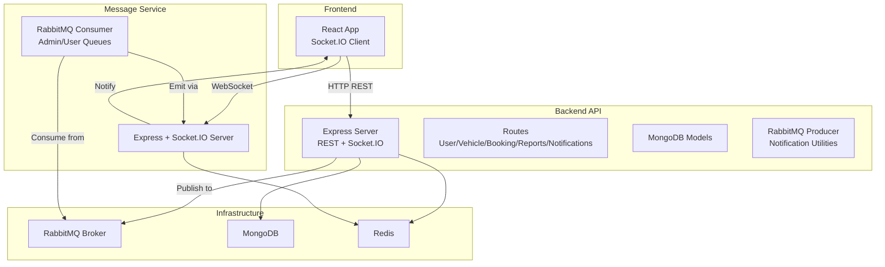
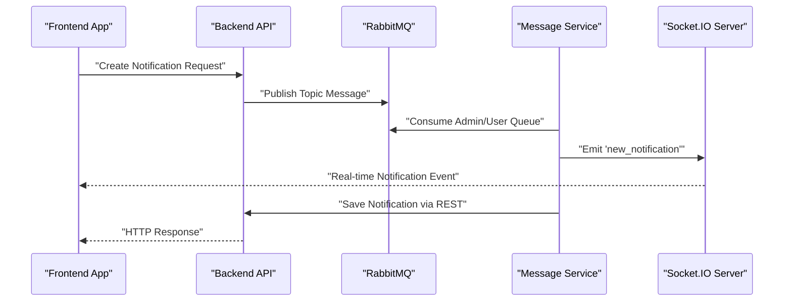
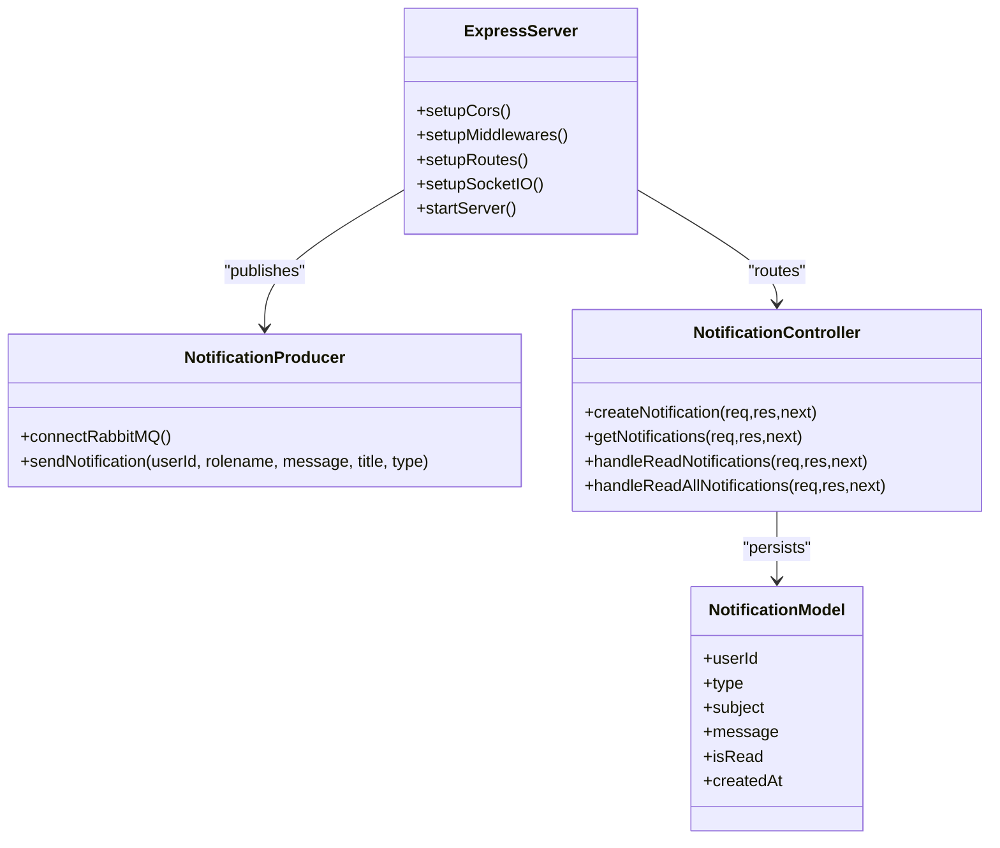
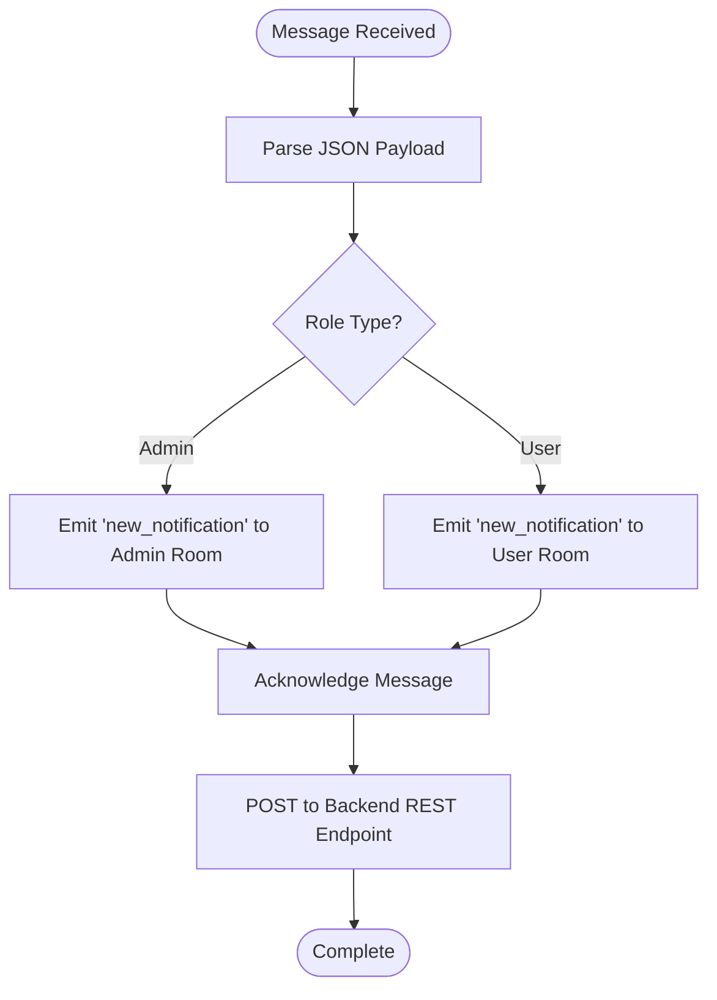
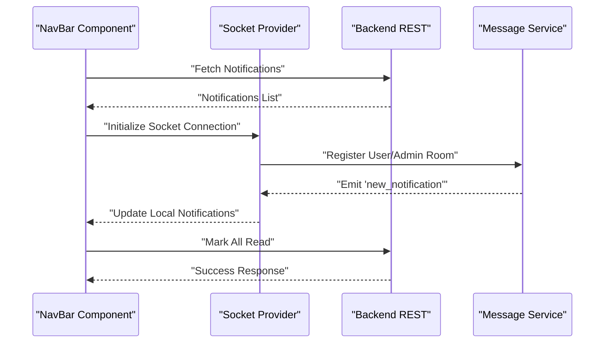
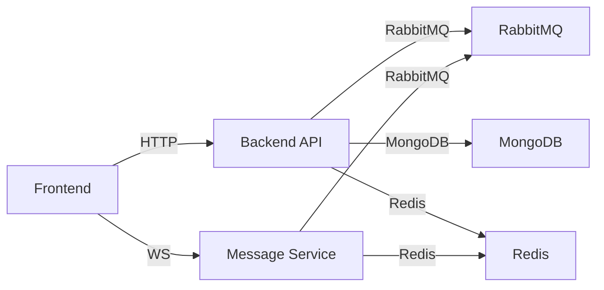

# System Architecture

<cite>
**Referenced Files in This Document**
- [server.js](file://backend/server.js)
- [docker-compose.yml](file://docker-compose.yml)
- [backend/package.json](file://backend/package.json)
- [frontend/package.json](file://frontend/package.json)
- [messageServices/package.json](file://messageServices/package.json)
- [backend/Dockerfile](file://backend/Dockerfile)
- [frontend/Dockerfile](file://frontend/Dockerfile)
- [backend/.env.development](file://backend/.env.development)
- [backend/router/notificationRoutes.js](file://backend/router/notificationRoutes.js)
- [backend/utils/notificationThroughMessageBroker.js](file://backend/utils/notificationThroughMessageBroker.js)
- [backend/NotificationServices/MessageService.js](file://backend/NotificationServices/MessageService.js)
- [backend/model/notificationSchema.js](file://backend/model/notificationSchema.js)
- [backend/Controller/newNotificationSchemaController.js](file://backend/Controller/newNotificationSchemaController.js)
- [messageServices/server.js](file://messageServices/server.js)
- [messageServices/controller/notificationConsumer.js](file://messageServices/controller/notificationConsumer.js)
- [frontend/src/APIPoints/AllApiPonts.js](file://frontend/src/APIPoints/AllApiPonts.js)
- [frontend/src/ContextApi/NotificationContentAPI.jsx](file://frontend/src/ContextApi/NotificationContentAPI.jsx)
- [frontend/src/comoponent/navBar/NavBar.jsx](file://frontend/src/comoponent/navBar/NavBar.jsx)
</cite>

## Table of Contents
1. [Introduction](#introduction)
2. [Project Structure](#project-structure)
3. [Core Components](#core-components)
4. [Architecture Overview](#architecture-overview)
5. [Detailed Component Analysis](#detailed-component-analysis)
6. [Dependency Analysis](#dependency-analysis)
7. [Performance Considerations](#performance-considerations)
8. [Troubleshooting Guide](#troubleshooting-guide)
9. [Conclusion](#conclusion)
10. [Appendices](#appendices)

## Introduction
This document describes the architecture of the Vehicle Management System, a three-service solution comprising:
- A main backend API service built with Node.js and Express
- A dedicated notification/message service powered by RabbitMQ and Socket.IO
- A React-based frontend application communicating via REST and WebSocket

The system implements a microservices pattern by separating notification delivery into its own service for scalability and resilience. It uses RabbitMQ for asynchronous messaging, MongoDB for persistence, Redis for caching, and Socket.IO for real-time updates. Infrastructure is containerized with Docker and orchestrated via docker-compose, with deployment targets supporting local development and cloud environments.

## Project Structure
The repository is organized into three primary services and shared configuration:
- backend: REST API, business logic, models, routes, utilities, and message producer integration
- messageServices: RabbitMQ consumers, Socket.IO server, and notification routing
- frontend: React SPA with Redux, Socket.IO client, and UI components
- docker-compose.yml: orchestration of frontend, backend, messageServices, and RabbitMQ
- Environment-specific configuration and Dockerfiles for each service

**Diagram sources**
- [server.js](file://backend/server.js#L34-L76)
- [messageServices/server.js](file://messageServices/server.js#L1-L84)
- [backend/utils/notificationThroughMessageBroker.js](file://backend/utils/notificationThroughMessageBroker.js#L1-L69)
- [messageServices/controller/notificationConsumer.js](file://messageServices/controller/notificationConsumer.js#L1-L119)
- [backend/model/notificationSchema.js](file://backend/model/notificationSchema.js#L1-L13)

**Section sources**
- [docker-compose.yml](file://docker-compose.yml#L1-L54)
- [backend/Dockerfile](file://backend/Dockerfile#L1-L13)
- [frontend/Dockerfile](file://frontend/Dockerfile#L1-L23)

## Core Components
- Backend API (Node.js/Express):
  - REST endpoints for user, vehicle, booking, reports, and notifications
  - Socket.IO integration for real-time capabilities
  - MongoDB connectivity and Redis cache integration
  - RabbitMQ producer utilities for asynchronous notifications
- Message Service (Node.js/Express):
  - RabbitMQ consumers for admin and user notifications
  - Socket.IO server emitting real-time events to registered clients
  - REST endpoint for health checks and optional testing
- Frontend (React):
  - REST-driven navigation and state via Redux
  - Real-time notifications via Socket.IO client
  - Notification dropdown and actions (mark read/all)

Key technologies:
- Backend: Express, Mongoose, Socket.IO, amqplib, winston, helmet, cors, bcrypt, jwt
- Message Service: Express, amqplib, nodemailer, socket.io
- Frontend: React, Redux Toolkit, react-router, socket.io-client, Material UI
- Infrastructure: Docker, docker-compose, RabbitMQ, MongoDB, Redis

**Section sources**
- [backend/package.json](file://backend/package.json#L1-L37)
- [frontend/package.json](file://frontend/package.json#L1-L63)
- [messageServices/package.json](file://messageServices/package.json#L1-L22)

## Architecture Overview
The system follows a microservices pattern with clear separation of concerns:
- Backend API handles business logic and persistence
- Message Service decouples notification delivery from the API for scalability
- Frontend consumes both REST APIs and WebSocket streams

**Diagram sources**
- [backend/utils/notificationThroughMessageBroker.js](file://backend/utils/notificationThroughMessageBroker.js#L33-L64)
- [messageServices/controller/notificationConsumer.js](file://messageServices/controller/notificationConsumer.js#L63-L87)
- [messageServices/server.js](file://messageServices/server.js#L34-L53)
- [backend/router/notificationRoutes.js](file://backend/router/notificationRoutes.js#L7-L10)
- [backend/Controller/newNotificationSchemaController.js](file://backend/Controller/newNotificationSchemaController.js#L7-L29)

## Detailed Component Analysis

### Backend API Service
Responsibilities:
- Expose REST endpoints for CRUD operations and domain logic
- Manage authentication and authorization middleware
- Integrate with MongoDB for persistence and Redis for caching
- Produce RabbitMQ messages for notifications
- Support real-time features via Socket.IO

**Diagram sources**
- [server.js](file://backend/server.js#L34-L76)
- [backend/utils/notificationThroughMessageBroker.js](file://backend/utils/notificationThroughMessageBroker.js#L8-L30)
- [backend/Controller/newNotificationSchemaController.js](file://backend/Controller/newNotificationSchemaController.js#L1-L112)
- [backend/model/notificationSchema.js](file://backend/model/notificationSchema.js#L1-L13)

**Section sources**
- [server.js](file://backend/server.js#L1-L204)
- [backend/router/notificationRoutes.js](file://backend/router/notificationRoutes.js#L1-L14)
- [backend/Controller/newNotificationSchemaController.js](file://backend/Controller/newNotificationSchemaController.js#L1-L112)
- [backend/model/notificationSchema.js](file://backend/model/notificationSchema.js#L1-L13)
- [backend/utils/notificationThroughMessageBroker.js](file://backend/utils/notificationThroughMessageBroker.js#L1-L69)

### Message Service (Notification Delivery)
Responsibilities:
- Consume RabbitMQ messages for admin and user notifications
- Emit real-time events to connected clients via Socket.IO
- Persist notifications through a REST call to the backend
- Implement retry logic and dead-letter exchange handling

**Diagram sources**
- [messageServices/controller/notificationConsumer.js](file://messageServices/controller/notificationConsumer.js#L63-L91)
- [messageServices/server.js](file://messageServices/server.js#L34-L53)
- [backend/router/notificationRoutes.js](file://backend/router/notificationRoutes.js#L7-L10)

**Section sources**
- [messageServices/server.js](file://messageServices/server.js#L1-L84)
- [messageServices/controller/notificationConsumer.js](file://messageServices/controller/notificationConsumer.js#L1-L119)
- [backend/NotificationServices/MessageService.js](file://backend/NotificationServices/MessageService.js#L1-L65)

### Frontend Application
Responsibilities:
- Present UI and manage user interactions
- Fetch notifications via REST and display counts
- Subscribe to real-time notifications via Socket.IO
- Provide actions to mark notifications as read

**Diagram sources**
- [frontend/src/comoponent/navBar/NavBar.jsx](file://frontend/src/comoponent/navBar/NavBar.jsx#L82-L105)
- [frontend/src/ContextApi/NotificationContentAPI.jsx](file://frontend/src/ContextApi/NotificationContentAPI.jsx#L15-L51)
- [frontend/src/APIPoints/AllApiPonts.js](file://frontend/src/APIPoints/AllApiPonts.js#L1-L3)
- [backend/router/notificationRoutes.js](file://backend/router/notificationRoutes.js#L8-L10)

**Section sources**
- [frontend/src/comoponent/navBar/NavBar.jsx](file://frontend/src/comoponent/navBar/NavBar.jsx#L1-L252)
- [frontend/src/ContextApi/NotificationContentAPI.jsx](file://frontend/src/ContextApi/NotificationContentAPI.jsx#L1-L61)
- [frontend/src/APIPoints/AllApiPonts.js](file://frontend/src/APIPoints/AllApiPonts.js#L1-L3)

## Dependency Analysis
External dependencies and runtime relationships:
- Backend depends on MongoDB for persistence, Redis for caching, and RabbitMQ for messaging
- Message Service depends on RabbitMQ and Socket.IO for delivery and real-time updates
- Frontend communicates with both REST endpoints and WebSocket channels
- docker-compose orchestrates service startup order and inter-service networking

**Diagram sources**
- [docker-compose.yml](file://docker-compose.yml#L3-L53)
- [backend/.env.development](file://backend/.env.development#L1-L27)

**Section sources**
- [docker-compose.yml](file://docker-compose.yml#L1-L54)
- [backend/.env.development](file://backend/.env.development#L1-L27)

## Performance Considerations
- Asynchronous messaging: RabbitMQ decouples notification generation from UI delivery, improving throughput and resilience
- Real-time updates: Socket.IO minimizes latency for live notifications compared to polling
- Caching: Redis can reduce repeated reads for frequently accessed data
- Scalability: Separate message service allows independent scaling of notification delivery
- Containerization: Docker images optimize resource usage and deployment consistency

[No sources needed since this section provides general guidance]

## Troubleshooting Guide
Common issues and resolutions:
- RabbitMQ connectivity failures:
  - Verify broker URL and credentials in environment variables
  - Confirm exchanges and queues exist and bindings are correct
- Socket.IO disconnections:
  - Check CORS configuration and transport settings
  - Ensure rooms registration occurs after connection
- Backend notification persistence errors:
  - Validate REST endpoint availability and response codes
  - Confirm retry logic and dead-letter exchange handling
- Frontend notification visibility:
  - Confirm Socket.IO client initialization and room registration
  - Verify Redux state updates and UI rendering

**Section sources**
- [backend/utils/notificationThroughMessageBroker.js](file://backend/utils/notificationThroughMessageBroker.js#L16-L35)
- [messageServices/controller/notificationConsumer.js](file://messageServices/controller/notificationConsumer.js#L16-L35)
- [frontend/src/ContextApi/NotificationContentAPI.jsx](file://frontend/src/ContextApi/NotificationContentAPI.jsx#L15-L51)

## Conclusion
The Vehicle Management System employs a clean three-service architecture with a scalable microservice for notifications. By leveraging RabbitMQ for asynchronous messaging and Socket.IO for real-time updates, the system achieves responsiveness and reliability. Containerization simplifies deployment and enables horizontal scaling. The documented boundaries and flows support maintainability and future enhancements.

[No sources needed since this section summarizes without analyzing specific files]

## Appendices

### Technology Stack Decisions
- Backend: Node.js/Express for rapid API development, Mongoose for ODM, Socket.IO for real-time features
- Messaging: RabbitMQ for reliable, decoupled notification delivery
- Frontend: React with Redux for state management and Material UI for components
- DevOps: Docker for containerization and docker-compose for orchestration

**Section sources**
- [backend/package.json](file://backend/package.json#L1-L37)
- [frontend/package.json](file://frontend/package.json#L1-L63)
- [messageServices/package.json](file://messageServices/package.json#L1-L22)

### Infrastructure Requirements
- Containers:
  - frontend: serves static build via a static server
  - backend: runs Node.js application exposing port 5000
  - messageServices: runs Node.js application exposing port 8000
  - rabbitmq: exposes ports 5672 and 15672 for AMQP and management
- Networking:
  - Services communicate via internal Docker networks
  - Frontend proxies API requests to backend
- Environment variables:
  - RabbitMQ URL, MongoDB connection string, Redis URL, Cloudinary credentials, SMTP settings

**Section sources**
- [docker-compose.yml](file://docker-compose.yml#L1-L54)
- [backend/Dockerfile](file://backend/Dockerfile#L1-L13)
- [frontend/Dockerfile](file://frontend/Dockerfile#L1-L23)
- [backend/.env.development](file://backend/.env.development#L1-L27)

### Security, Monitoring, and Disaster Recovery
- Security:
  - Helmet and rate limiting applied in backend
  - JWT-based authentication and token verification
  - CORS configured per environment
- Monitoring:
  - Winston logging integrated in backend utilities
  - Socket.IO connection events for diagnostics
- Disaster Recovery:
  - Dead letter exchanges for failed message processing
  - Retry mechanisms with exponential backoff
  - Persistent queues and message durability

**Section sources**
- [backend/package.json](file://backend/package.json#L15-L16)
- [backend/utils/notificationThroughMessageBroker.js](file://backend/utils/notificationThroughMessageBroker.js#L58-L64)
- [messageServices/controller/notificationConsumer.js](file://messageServices/controller/notificationConsumer.js#L11-L116)