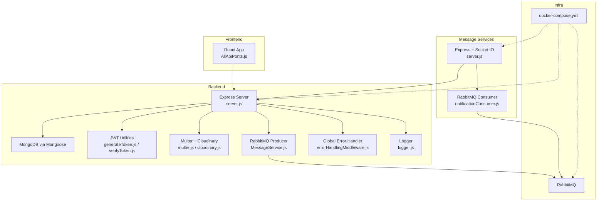
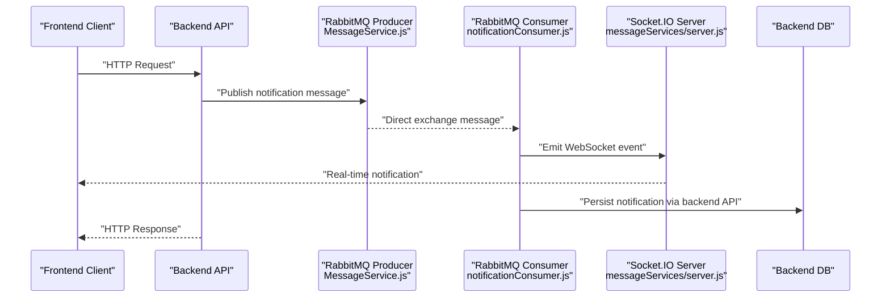
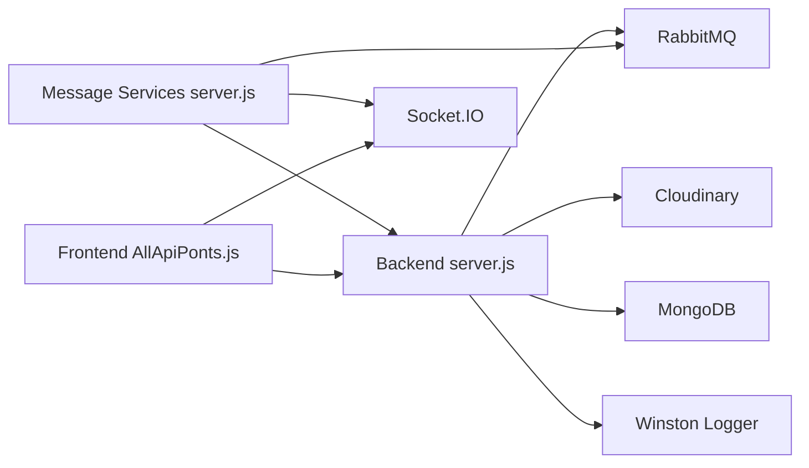

# Troubleshooting & FAQ

<cite>
**Referenced Files in This Document**
- [server.js](file://backend/server.js)
- [dataBaseConnection.js](file://backend/DatabaseConnection/dataBaseConnection.js)
- [errorHandlingMiddleware.js](file://backend/utils/errorHandlingMiddleware.js)
- [logger.js](file://backend/utils/logger.js)
- [generateToken.js](file://backend/utils/generateToken.js)
- [verifyToken.js](file://backend/utils/verifyToken.js)
- [multer.js](file://backend/utils/multer.js)
- [cloudinary.js](file://backend/config/cloudinary.js)
- [MessageService.js](file://backend/NotificationServices/MessageService.js)
- [notificationConsumer.js](file://messageServices/controller/notificationConsumer.js)
- [server.js](file://messageServices/server.js)
- [docker-compose.yml](file://docker-compose.yml)
- [AllApiPonts.js](file://frontend/src/APIPoints/AllApiPonts.js)
</cite>

## Table of Contents
1. [Introduction](#introduction)
2. [Project Structure](#project-structure)
3. [Core Components](#core-components)
4. [Architecture Overview](#architecture-overview)
5. [Detailed Component Analysis](#detailed-component-analysis)
6. [Dependency Analysis](#dependency-analysis)
7. [Performance Considerations](#performance-considerations)
8. [Troubleshooting Guide](#troubleshooting-guide)
9. [Conclusion](#conclusion)
10. [Appendices](#appendices)

## Introduction
This document provides comprehensive troubleshooting guidance and FAQs for the Vehicle Management System. It focuses on diagnosing and resolving common issues across the backend API, frontend client, file upload pipeline, and real-time notification service. It also covers error handling, logging, monitoring, security, and operational best practices for production deployments.

## Project Structure
The system comprises:
- Backend API server with routes, controllers, models, utilities, and middleware
- MongoDB connection and Mongoose configuration
- JWT-based authentication utilities
- Multer-based Cloudinary integration for file uploads
- RabbitMQ-based asynchronous messaging and a dedicated consumer service
- Frontend client that communicates with the backend and connects to a WebSocket server

**Diagram sources**
- [server.js](file://backend/server.js#L1-L204)
- [dataBaseConnection.js](file://backend/DatabaseConnection/dataBaseConnection.js#L1-L17)
- [generateToken.js](file://backend/utils/generateToken.js#L1-L28)
- [verifyToken.js](file://backend/utils/verifyToken.js#L1-L33)
- [multer.js](file://backend/utils/multer.js#L1-L52)
- [cloudinary.js](file://backend/config/cloudinary.js#L1-L12)
- [MessageService.js](file://backend/NotificationServices/MessageService.js#L1-L65)
- [errorHandlingMiddleware.js](file://backend/utils/errorHandlingMiddleware.js#L1-L233)
- [logger.js](file://backend/utils/logger.js#L1-L68)
- [server.js](file://messageServices/server.js#L1-L84)
- [notificationConsumer.js](file://messageServices/controller/notificationConsumer.js#L1-L119)
- [docker-compose.yml](file://docker-compose.yml#L1-L54)

**Section sources**
- [server.js](file://backend/server.js#L1-L204)
- [docker-compose.yml](file://docker-compose.yml#L1-L54)

## Core Components
- Backend API server initializes environment-specific configuration, CORS, middlewares, Socket.IO, routes, and error handling.
- Database connection uses Mongoose with pool sizing and server selection timeouts.
- Authentication relies on refresh tokens verified against a secret and persisted user lookup.
- File uploads leverage Multer with Cloudinary storage and strict size limits.
- Messaging uses RabbitMQ with durable exchanges and queues, dead letter exchanges, and a consumer that emits WebSocket events and persists notifications.
- Logging uses Winston with caller info and file/console transports.

**Section sources**
- [server.js](file://backend/server.js#L1-L204)
- [dataBaseConnection.js](file://backend/DatabaseConnection/dataBaseConnection.js#L1-L17)
- [generateToken.js](file://backend/utils/generateToken.js#L1-L28)
- [verifyToken.js](file://backend/utils/verifyToken.js#L1-L33)
- [multer.js](file://backend/utils/multer.js#L1-L52)
- [cloudinary.js](file://backend/config/cloudinary.js#L1-L12)
- [MessageService.js](file://backend/NotificationServices/MessageService.js#L1-L65)
- [notificationConsumer.js](file://messageServices/controller/notificationConsumer.js#L1-L119)
- [logger.js](file://backend/utils/logger.js#L1-L68)

## Architecture Overview
The system integrates REST APIs, WebSocket-based real-time notifications, and asynchronous messaging. The frontend communicates with the backend over HTTP and with the message service over WebSocket. RabbitMQ decouples notification delivery and persistence.

**Diagram sources**
- [MessageService.js](file://backend/NotificationServices/MessageService.js#L1-L65)
- [notificationConsumer.js](file://messageServices/controller/notificationConsumer.js#L1-L119)
- [server.js](file://messageServices/server.js#L1-L84)
- [server.js](file://backend/server.js#L1-L204)

## Detailed Component Analysis

### Database Connectivity
Common symptoms:
- Application fails to start or responds slowly during boot
- Queries timeout or fail intermittently

Root causes and checks:
- Verify MONGOURL environment variable and connectivity
- Confirm pool size and server selection timeout settings
- Monitor connection establishment logs

Diagnostic steps:
- Confirm environment loading and connection block executes
- Review connection logs for errors
- Validate network reachability to MongoDB host

Operational tips:
- Keep maxPoolSize appropriate for workload
- Use serverSelectionTimeoutMS to detect slow networks early

**Section sources**
- [dataBaseConnection.js](file://backend/DatabaseConnection/dataBaseConnection.js#L1-L17)
- [server.js](file://backend/server.js#L1-L204)

### Authentication Failures
Symptoms:
- 401/403 responses on protected routes
- Token expiration prompts
- Refresh token verification errors

Root causes:
- Missing or invalid refresh token cookie
- Token signature mismatch or expired token
- User not found after token decoding

Diagnostic steps:
- Inspect cookies for refreshToken presence
- Verify JWT_REFRESH_SECRET correctness
- Confirm user exists in DB for decoded token ID
- Check token expiry and clock skew

Resolution:
- Ensure clients persist refreshToken securely
- Rotate secrets carefully and redeploy consistently
- Align system clocks across services

**Section sources**
- [verifyToken.js](file://backend/utils/verifyToken.js#L1-L33)
- [generateToken.js](file://backend/utils/generateToken.js#L1-L28)

### File Upload Errors (Images/Documents)
Symptoms:
- Uploads fail with size or format errors
- Cloudinary upload failures
- Multer configuration mismatches

Root causes:
- File size exceeding configured limits
- Unsupported file format
- Cloudinary credentials misconfiguration
- Network issues to Cloudinary

Diagnostic steps:
- Confirm allowed formats and size limits
- Validate CLOUDINARY_* environment variables
- Check Cloudinary response logs
- Verify network access from backend container

Resolution:
- Adjust limits per business needs
- Correct Cloudinary credentials
- Retry uploads with stable connectivity

**Section sources**
- [multer.js](file://backend/utils/multer.js#L1-L52)
- [cloudinary.js](file://backend/config/cloudinary.js#L1-L12)

### Real-Time Communication Issues
Symptoms:
- Notifications not received via WebSocket
- Socket.IO connection drops
- Role-based routing incorrect

Root causes:
- Incorrect room registration (user/admin)
- RabbitMQ consumer not connected
- Backend API not reachable from consumer
- Socket.IO CORS misconfiguration

Diagnostic steps:
- Verify register_user/register_admin events
- Check consumer logs for connection and binding
- Confirm BACKEND_SERVICE_URL availability
- Validate CORS settings for Socket.IO

Resolution:
- Ensure clients emit register events with correct IDs
- Restart consumer and backend services
- Fix CORS origins and credentials

**Section sources**
- [server.js](file://messageServices/server.js#L1-L84)
- [notificationConsumer.js](file://messageServices/controller/notificationConsumer.js#L1-L119)

### Backend API Errors
Symptoms:
- Unexpected 500 responses
- Operational vs. unexpected errors
- Validation and cast errors

Root causes:
- Unhandled exceptions
- Validation failures
- Cast errors for ObjectId-like fields
- Duplicate key violations

Diagnostic steps:
- Inspect global error handler behavior
- Review logger output for stacks
- Check NODE_ENV to confirm dev/prod behavior
- Validate request payloads and IDs

Resolution:
- Add explicit error handling around async calls
- Normalize input validation and sanitization
- Distinguish operational vs. unexpected errors

**Section sources**
- [errorHandlingMiddleware.js](file://backend/utils/errorHandlingMiddleware.js#L1-L233)
- [logger.js](file://backend/utils/logger.js#L1-L68)
- [server.js](file://backend/server.js#L1-L204)

### Frontend State and Communication Issues
Symptoms:
- API calls failing silently
- Incorrect base URLs
- Socket connection not established

Root causes:
- Wrong REACT_APP_API_SERVER_URL
- Missing or incorrect Socket.IO server URL
- CORS mismatch between frontend and backend

Diagnostic steps:
- Verify environment variables in frontend build/runtime
- Confirm API and Socket endpoints resolve
- Check browser console/network tab for errors

Resolution:
- Set correct environment variables in deployment
- Ensure frontend and backend CORS align
- Validate reverse proxy or ingress configuration

**Section sources**
- [AllApiPonts.js](file://frontend/src/APIPoints/AllApiPonts.js#L1-L3)
- [server.js](file://backend/server.js#L1-L204)
- [server.js](file://messageServices/server.js#L1-L84)

## Dependency Analysis
Key external dependencies and their roles:
- RabbitMQ: asynchronous notifications and dead-letter handling
- Cloudinary: image/document storage
- MongoDB/Mongoose: primary data store
- Socket.IO: real-time bidirectional communication
- Winston: structured logging

**Diagram sources**
- [server.js](file://backend/server.js#L1-L204)
- [server.js](file://messageServices/server.js#L1-L84)
- [AllApiPonts.js](file://frontend/src/APIPoints/AllApiPonts.js#L1-L3)

**Section sources**
- [docker-compose.yml](file://docker-compose.yml#L1-L54)

## Performance Considerations
- Slow queries
  - Use indexes on frequent filters and joins
  - Analyze query plans and avoid N+1 patterns
  - Batch writes and reads appropriately
- Memory leaks
  - Avoid retaining references in long-lived closures
  - Close database connections and channels on shutdown
- Scaling issues
  - Increase pool sizes and replicas judiciously
  - Use horizontal scaling for consumers and backend pods
  - Optimize upload sizes and Cloudinary caching

[No sources needed since this section provides general guidance]

## Troubleshooting Guide

### Database Connection Problems
Symptoms:
- Startup errors or immediate disconnects
- Intermittent timeouts

Checks:
- Confirm MONGOURL correctness
- Validate network and credentials
- Inspect connection logs for errors

Resolution:
- Fix environment variables
- Ensure MongoDB is reachable
- Adjust serverSelectionTimeoutMS if needed

**Section sources**
- [dataBaseConnection.js](file://backend/DatabaseConnection/dataBaseConnection.js#L1-L17)

### Authentication Failures
Symptoms:
- 401/403 responses
- Token expired or invalid

Checks:
- Verify refreshToken cookie presence
- Confirm JWT_REFRESH_SECRET alignment
- Ensure user exists for token ID

Resolution:
- Re-authenticate and refresh tokens
- Rotate secrets carefully
- Align system clocks

**Section sources**
- [verifyToken.js](file://backend/utils/verifyToken.js#L1-L33)
- [generateToken.js](file://backend/utils/generateToken.js#L1-L28)

### File Upload Errors
Symptoms:
- Size/format errors
- Cloudinary failures

Checks:
- Validate file size and allowed formats
- Confirm CLOUDINARY_* variables
- Check network to Cloudinary

Resolution:
- Adjust limits or compress assets
- Correct credentials
- Retry after connectivity restored

**Section sources**
- [multer.js](file://backend/utils/multer.js#L1-L52)
- [cloudinary.js](file://backend/config/cloudinary.js#L1-L12)

### Real-Time Communication Issues
Symptoms:
- No notifications delivered
- Socket disconnects

Checks:
- Ensure register_user/register_admin events
- Verify consumer connection and bindings
- Confirm backend API reachability

Resolution:
- Emit register events with correct IDs
- Restart consumer/backend
- Fix CORS and origins

**Section sources**
- [server.js](file://messageServices/server.js#L1-L84)
- [notificationConsumer.js](file://messageServices/controller/notificationConsumer.js#L1-L119)

### Backend API Errors
Symptoms:
- 500 errors, missing messages
- Validation/cast errors

Checks:
- Inspect global error handler behavior
- Review logger output
- Validate request payloads

Resolution:
- Add try/catch around async code
- Normalize validation
- Distinguish operational vs. unexpected errors

**Section sources**
- [errorHandlingMiddleware.js](file://backend/utils/errorHandlingMiddleware.js#L1-L233)
- [logger.js](file://backend/utils/logger.js#L1-L68)

### Frontend State Issues
Symptoms:
- API calls fail
- Socket not connecting

Checks:
- Verify REACT_APP_API_SERVER_URL
- Confirm Socket server URL
- Check CORS and network tab

Resolution:
- Set correct environment variables
- Align CORS
- Validate endpoints

**Section sources**
- [AllApiPonts.js](file://frontend/src/APIPoints/AllApiPonts.js#L1-L3)

### Message Service Problems
Symptoms:
- Messages not emitted
- DLX accumulation

Checks:
- Confirm RabbitMQ connectivity
- Verify exchanges/queues/bindings
- Check consumer retry logic and backend API

Resolution:
- Restart consumer and broker
- Ack/nack handling and DLX routing
- Retry backend calls with backoff

**Section sources**
- [MessageService.js](file://backend/NotificationServices/MessageService.js#L1-L65)
- [notificationConsumer.js](file://messageServices/controller/notificationConsumer.js#L1-L119)

### Error Code References
- 400: Validation or duplicate field errors handled by the global error handler
- 401: Unauthorized due to missing/invalid/expired refresh token
- 403: Token expired (explicitly handled)
- 500: Unexpected operational errors logged as “UNEXPECTED ERROR”

**Section sources**
- [errorHandlingMiddleware.js](file://backend/utils/errorHandlingMiddleware.js#L1-L233)
- [verifyToken.js](file://backend/utils/verifyToken.js#L1-L33)

### Log Analysis Techniques
- Use logger output to correlate request IDs and stacks
- Filter by level and timestamp
- Extract caller info from logs for precise source identification

**Section sources**
- [logger.js](file://backend/utils/logger.js#L1-L68)

### Diagnostic Commands
- Health checks
  - Backend base route: GET /
  - Message service base route: GET /
- RabbitMQ
  - Management UI: http://<host>:15672
  - Queues and exchanges inspection
- Container logs
  - docker compose logs backend
  - docker compose logs consumer
  - docker compose logs rabbitmq

**Section sources**
- [server.js](file://backend/server.js#L74-L76)
- [server.js](file://messageServices/server.js#L29-L29)
- [docker-compose.yml](file://docker-compose.yml#L1-L54)

### Monitoring and Alerting Strategies
- Metrics
  - HTTP request latency and error rates
  - RabbitMQ queue lengths and consumer lag
  - Database connection pool usage
- Logs
  - Centralized logging with Winston
  - Structured logs with caller info
- Alerts
  - High error rates and timeouts
  - Queue backlog growth
  - DB connection failures

[No sources needed since this section provides general guidance]

### Security-Related Issues and Permission Problems
- JWT secrets must be strong and identical across services
- Refresh tokens should be stored securely (sameSite, secure flags)
- CORS must be restricted to trusted origins
- File uploads should enforce size/format constraints
- RabbitMQ credentials and network isolation

**Section sources**
- [generateToken.js](file://backend/utils/generateToken.js#L1-L28)
- [verifyToken.js](file://backend/utils/verifyToken.js#L1-L33)
- [server.js](file://backend/server.js#L38-L59)
- [multer.js](file://backend/utils/multer.js#L1-L52)

### Configuration Errors
- Environment variables must match across backend, consumer, and RabbitMQ
- Frontend environment variables must point to correct backend and Socket servers
- Docker Compose must expose ports and link services

**Section sources**
- [docker-compose.yml](file://docker-compose.yml#L1-L54)
- [AllApiPonts.js](file://frontend/src/APIPoints/AllApiPonts.js#L1-L3)

### Step-by-Step Resolution Guides

- Database connectivity not established
  1. Verify MONGOURL
  2. Check network and credentials
  3. Review connection logs
  4. Adjust timeouts if needed

- Authentication failing
  1. Confirm refreshToken cookie
  2. Validate JWT_REFRESH_SECRET
  3. Ensure user exists
  4. Rotate secrets carefully and redeploy

- File upload failing
  1. Check file size/format limits
  2. Validate Cloudinary credentials
  3. Retry after connectivity fix

- Notifications not received
  1. Emit register_user/register_admin
  2. Verify consumer connection
  3. Confirm backend API reachability
  4. Fix CORS and restart services

- Backend API 500 errors
  1. Inspect global error handler
  2. Review logger output
  3. Add explicit error handling
  4. Distinguish operational vs. unexpected

- Frontend API/socket issues
  1. Verify environment variables
  2. Check endpoints and CORS
  3. Validate reverse proxy

**Section sources**
- [dataBaseConnection.js](file://backend/DatabaseConnection/dataBaseConnection.js#L1-L17)
- [verifyToken.js](file://backend/utils/verifyToken.js#L1-L33)
- [multer.js](file://backend/utils/multer.js#L1-L52)
- [notificationConsumer.js](file://messageServices/controller/notificationConsumer.js#L1-L119)
- [errorHandlingMiddleware.js](file://backend/utils/errorHandlingMiddleware.js#L1-L233)
- [AllApiPonts.js](file://frontend/src/APIPoints/AllApiPonts.js#L1-L3)

### Escalation Procedures
- For unhandled operational errors, escalate to backend team with logs and request IDs
- For RabbitMQ issues, escalate to DevOps with queue metrics and consumer logs
- For frontend integration issues, escalate to frontend team with network traces

[No sources needed since this section provides general guidance]

## Conclusion
This guide consolidates practical troubleshooting steps, diagnostic techniques, and resolution strategies for the Vehicle Management System. By following the structured approaches outlined here—covering database, authentication, uploads, messaging, and frontend integration—you can quickly isolate and resolve most incidents. Adopt the recommended monitoring, security, and configuration practices to prevent recurring issues and maintain a robust production environment.

## Appendices

### Frequently Asked Questions
- Why do I see 401 errors after refreshing the page?
  - Likely due to missing or expired refreshToken. Re-authenticate and ensure cookies are set properly.
- Why are images not uploading?
  - Check file size/format limits and Cloudinary credentials.
- Why do notifications not appear in real time?
  - Ensure register_user/register_admin events are emitted and consumer is connected.
- How do I check if RabbitMQ is healthy?
  - Use the management UI and inspect queues/exchanges.
- How do I scale the notification service?
  - Scale consumer pods horizontally and monitor queue backlog.

[No sources needed since this section provides general guidance]