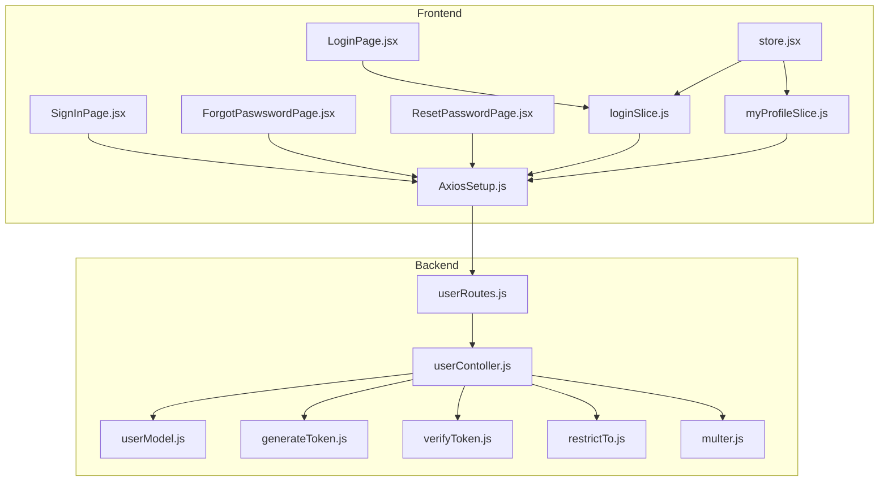
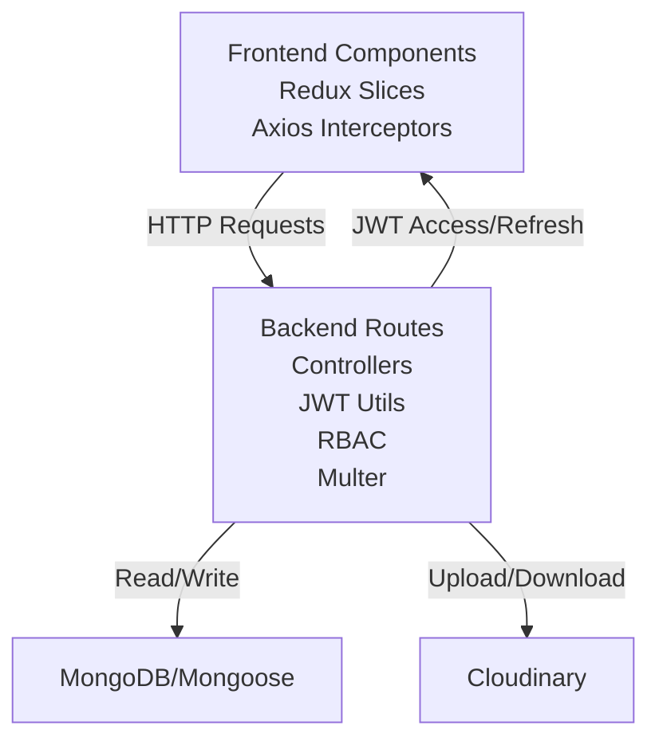
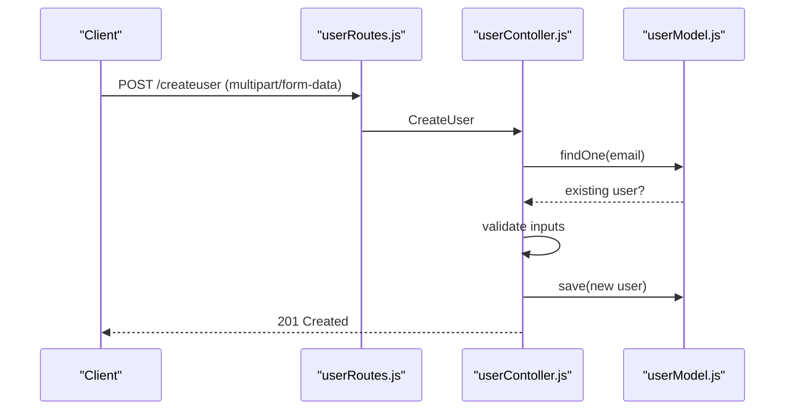
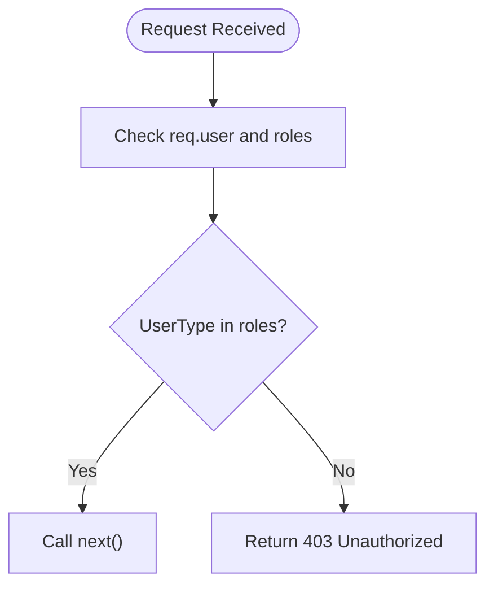
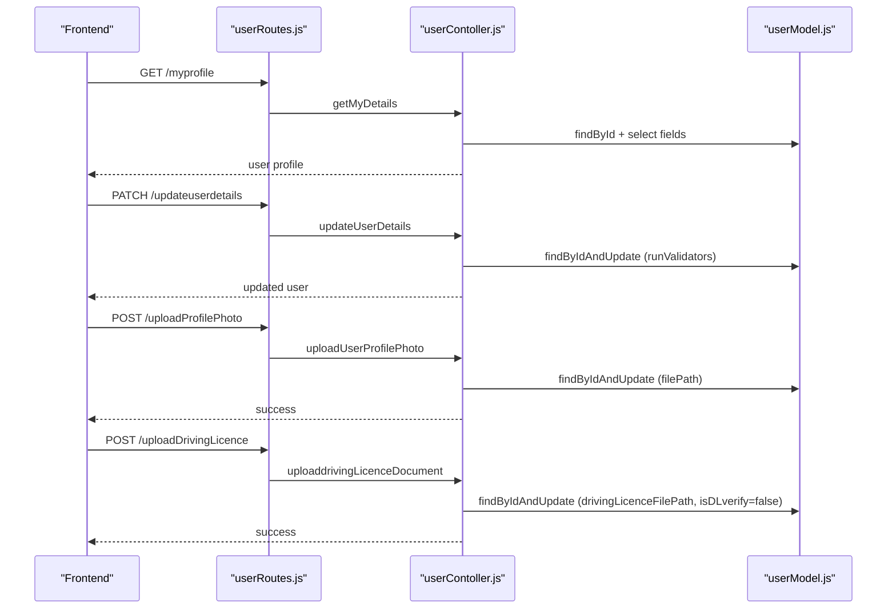
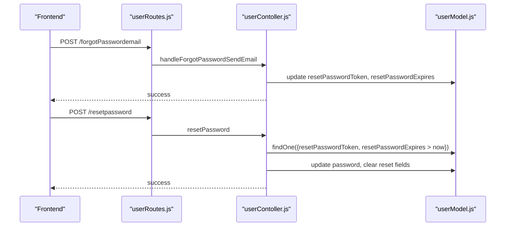
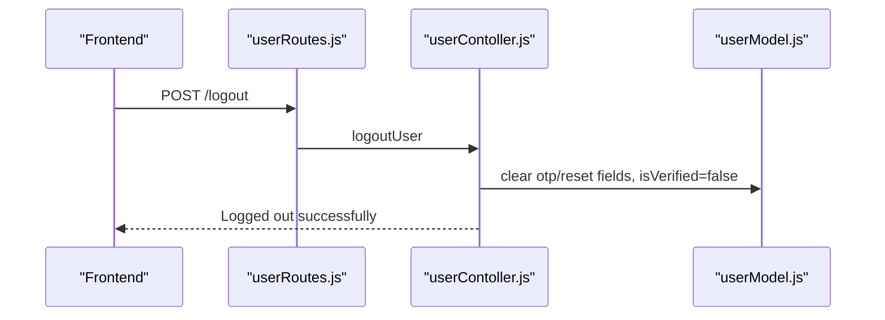
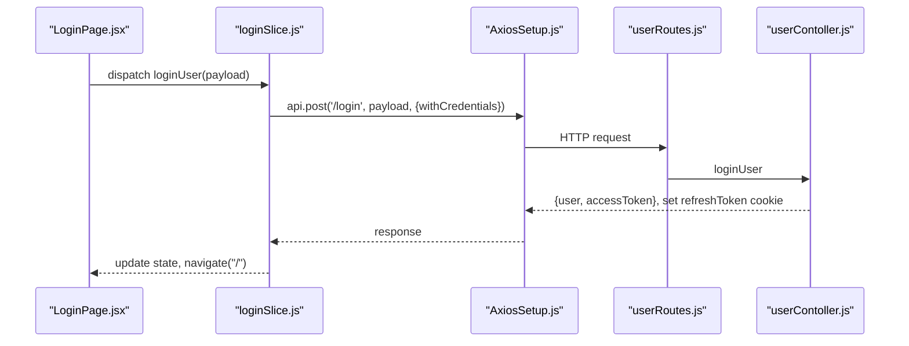
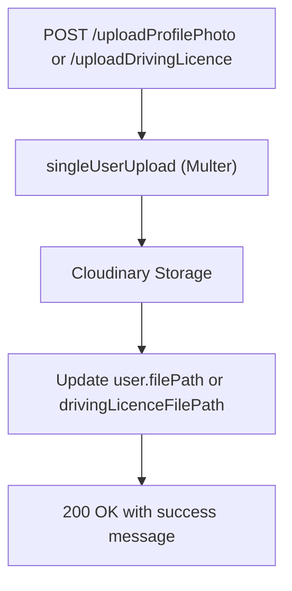
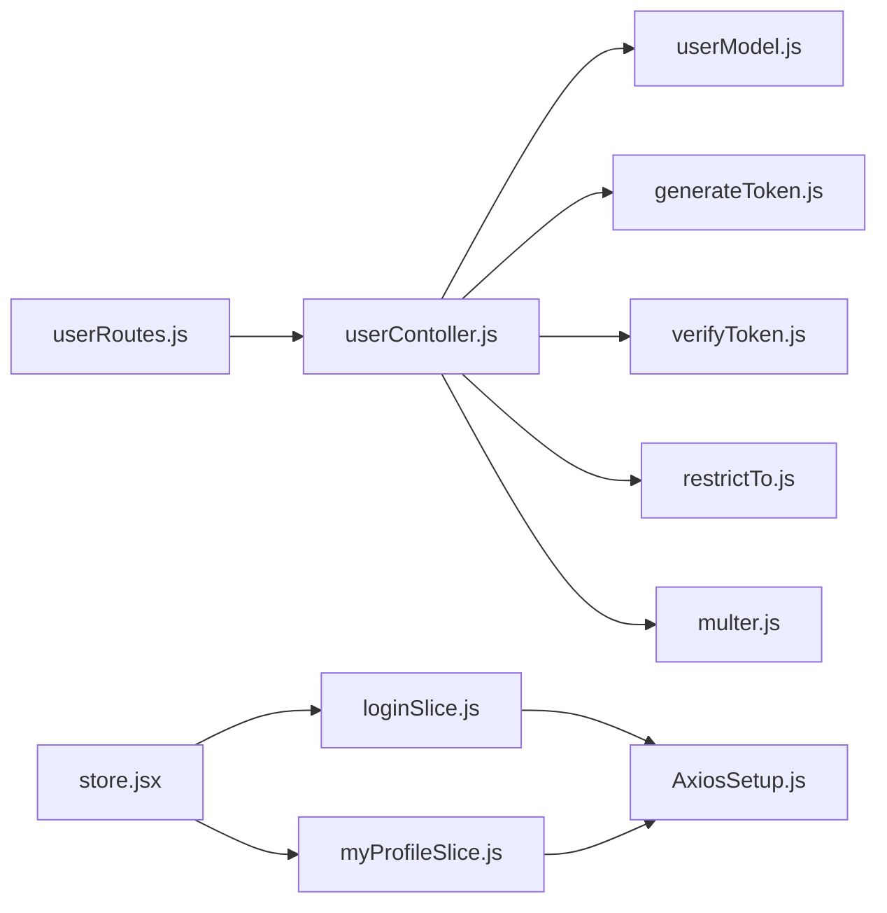

# User Management

<cite>
**Referenced Files in This Document**
- [userModel.js](file://backend/model/userModel.js)
- [userContoller.js](file://backend/Controller/userContoller.js)
- [userRoutes.js](file://backend/router/userRoutes.js)
- [generateToken.js](file://backend/utils/generateToken.js)
- [verifyToken.js](file://backend/utils/verifyToken.js)
- [restrictTo.js](file://backend/utils/restrictTo.js)
- [multer.js](file://backend/utils/multer.js)
- [loginSlice.js](file://frontend/src/appRedux/redux/authSlice/loginSlice.js)
- [myProfileSlice.js](file://frontend/src/appRedux/redux/authSlice/myProfileSlice.js)
- [store.jsx](file://frontend/src/appRedux/store.jsx)
- [AxiosSetup.js](file://frontend/src/axiosInterceptors/AxiosSetup.js)
- [LoginPage.jsx](file://frontend/src/comoponent/loginPage/LoginPage.jsx)
- [SignInPage.jsx](file://frontend/src/comoponent/signUpPage/SignInPage.jsx)
- [ForgotPaswswordPage.jsx](file://frontend/src/comoponent/forgotPassword/ForgotPaswswordPage.jsx)
- [ResetPasswordPage.jsx](file://frontend/src/comoponent/forgotPassword/ResetPasswordPage.jsx)
</cite>

## Table of Contents
1. [Introduction](#introduction)
2. [Project Structure](#project-structure)
3. [Core Components](#core-components)
4. [Architecture Overview](#architecture-overview)
5. [Detailed Component Analysis](#detailed-component-analysis)
6. [Dependency Analysis](#dependency-analysis)
7. [Performance Considerations](#performance-considerations)
8. [Troubleshooting Guide](#troubleshooting-guide)
9. [Conclusion](#conclusion)
10. [Appendices](#appendices)

## Introduction
This document provides comprehensive documentation for the user management system, covering user registration, authentication, email verification, password handling, JWT token lifecycle, role-based access control (RBAC), profile management, password recovery, OTP verification, session management, and frontend-backend integration via Redux. It explains the end-to-end flows from frontend login to backend validation and state synchronization, along with security measures, validation rules, and user experience considerations.

## Project Structure
The user management system spans backend and frontend:
- Backend: Express routes, controllers, models, utilities for JWT generation/verification, RBAC, file upload integration, and MongoDB/Mongoose schema.
- Frontend: Redux slices for authentication and profile, Axios interceptor for token refresh and request/response handling, and React components for login, sign-up, OTP, and password recovery.



**Diagram sources**
- [AxiosSetup.js](file://frontend/src/axiosInterceptors/AxiosSetup.js#L110-L214)
- [loginSlice.js](file://frontend/src/appRedux/redux/authSlice/loginSlice.js#L1-L213)
- [myProfileSlice.js](file://frontend/src/appRedux/redux/authSlice/myProfileSlice.js#L1-L201)
- [store.jsx](file://frontend/src/appRedux/store.jsx#L1-L62)
- [LoginPage.jsx](file://frontend/src/comoponent/loginPage/LoginPage.jsx#L1-L229)
- [SignInPage.jsx](file://frontend/src/comoponent/signUpPage/SignInPage.jsx#L1-L223)
- [ForgotPaswswordPage.jsx](file://frontend/src/comoponent/forgotPassword/ForgotPaswswordPage.jsx#L1-L88)
- [ResetPasswordPage.jsx](file://frontend/src/comoponent/forgotPassword/ResetPasswordPage.jsx#L1-L129)
- [userRoutes.js](file://backend/router/userRoutes.js#L1-L119)
- [userContoller.js](file://backend/Controller/userContoller.js#L1-L832)
- [userModel.js](file://backend/model/userModel.js#L1-L162)
- [generateToken.js](file://backend/utils/generateToken.js#L1-L28)
- [verifyToken.js](file://backend/utils/verifyToken.js#L1-L33)
- [restrictTo.js](file://backend/utils/restrictTo.js#L1-L18)
- [multer.js](file://backend/utils/multer.js#L1-L52)

**Section sources**
- [userRoutes.js](file://backend/router/userRoutes.js#L1-L119)
- [userContoller.js](file://backend/Controller/userContoller.js#L1-L832)
- [userModel.js](file://backend/model/userModel.js#L1-L162)
- [generateToken.js](file://backend/utils/generateToken.js#L1-L28)
- [verifyToken.js](file://backend/utils/verifyToken.js#L1-L33)
- [restrictTo.js](file://backend/utils/restrictTo.js#L1-L18)
- [multer.js](file://backend/utils/multer.js#L1-L52)
- [loginSlice.js](file://frontend/src/appRedux/redux/authSlice/loginSlice.js#L1-L213)
- [myProfileSlice.js](file://frontend/src/appRedux/redux/authSlice/myProfileSlice.js#L1-L201)
- [store.jsx](file://frontend/src/appRedux/store.jsx#L1-L62)
- [AxiosSetup.js](file://frontend/src/axiosInterceptors/AxiosSetup.js#L110-L214)
- [LoginPage.jsx](file://frontend/src/comoponent/loginPage/LoginPage.jsx#L1-L229)
- [SignInPage.jsx](file://frontend/src/comoponent/signUpPage/SignInPage.jsx#L1-L223)
- [ForgotPaswswordPage.jsx](file://frontend/src/comoponent/forgotPassword/ForgotPaswswordPage.jsx#L1-L88)
- [ResetPasswordPage.jsx](file://frontend/src/comoponent/forgotPassword/ResetPasswordPage.jsx#L1-L129)

## Core Components
- User Model: Defines schema, validation rules, password hashing, JWT generation, and password comparison.
- Controllers: Implement registration, login, OTP send/verify, password change/reset, profile updates, file uploads, logout, and protected routes.
- Routes: Expose endpoints with middleware for authentication, authorization, and file uploads.
- Authentication Utilities: JWT access/refresh token generation and verification middleware.
- RBAC: Role restriction middleware for admin-only endpoints.
- File Upload: Multer with Cloudinary integration for profile and driving license documents.
- Frontend Redux: Authentication and profile slices, persistent store, and Axios interceptors for token refresh and error handling.
- Frontend Components: Login, sign-up, OTP, and password recovery UI flows.

**Section sources**
- [userModel.js](file://backend/model/userModel.js#L1-L162)
- [userContoller.js](file://backend/Controller/userContoller.js#L1-L832)
- [userRoutes.js](file://backend/router/userRoutes.js#L1-L119)
- [generateToken.js](file://backend/utils/generateToken.js#L1-L28)
- [verifyToken.js](file://backend/utils/verifyToken.js#L1-L33)
- [restrictTo.js](file://backend/utils/restrictTo.js#L1-L18)
- [multer.js](file://backend/utils/multer.js#L1-L52)
- [loginSlice.js](file://frontend/src/appRedux/redux/authSlice/loginSlice.js#L1-L213)
- [myProfileSlice.js](file://frontend/src/appRedux/redux/authSlice/myProfileSlice.js#L1-L201)
- [store.jsx](file://frontend/src/appRedux/store.jsx#L1-L62)
- [AxiosSetup.js](file://frontend/src/axiosInterceptors/AxiosSetup.js#L110-L214)

## Architecture Overview
The system uses a layered architecture:
- Presentation Layer: React components and Redux slices.
- Application Layer: Axios interceptors and Redux async thunks.
- Domain Layer: Backend controllers and route handlers.
- Infrastructure Layer: JWT utilities, RBAC, file upload, and database model.



**Diagram sources**
- [AxiosSetup.js](file://frontend/src/axiosInterceptors/AxiosSetup.js#L110-L214)
- [loginSlice.js](file://frontend/src/appRedux/redux/authSlice/loginSlice.js#L1-L213)
- [myProfileSlice.js](file://frontend/src/appRedux/redux/authSlice/myProfileSlice.js#L1-L201)
- [userRoutes.js](file://backend/router/userRoutes.js#L1-L119)
- [userContoller.js](file://backend/Controller/userContoller.js#L1-L832)
- [generateToken.js](file://backend/utils/generateToken.js#L1-L28)
- [verifyToken.js](file://backend/utils/verifyToken.js#L1-L33)
- [restrictTo.js](file://backend/utils/restrictTo.js#L1-L18)
- [multer.js](file://backend/utils/multer.js#L1-L52)
- [userModel.js](file://backend/model/userModel.js#L1-L162)

## Detailed Component Analysis

### User Registration
- Endpoint: POST /createuser with rate limiting and file upload middleware.
- Validation: Required fields, password confirmation, phone number length, email format.
- Persistence: Hashes password via pre-save hook, saves user, sends welcome email and notification.



**Diagram sources**
- [userRoutes.js](file://backend/router/userRoutes.js#L21-L26)
- [userContoller.js](file://backend/Controller/userContoller.js#L25-L92)
- [userModel.js](file://backend/model/userModel.js#L134-L139)

**Section sources**
- [userRoutes.js](file://backend/router/userRoutes.js#L12-L26)
- [userContoller.js](file://backend/Controller/userContoller.js#L25-L92)
- [userModel.js](file://backend/model/userModel.js#L28-L46)

### Authentication and JWT Lifecycle
- Login: Accepts email/phone, compares password, generates access and refresh tokens, sets HTTP-only refresh cookie.
- Access token: Short-lived (15m) signed payload; refresh token: long-lived (7d) stored in HTTP-only cookie.
- Token verification: Middleware verifies refresh token, attaches user to request, enforces expiration and invalidation.

```mermaid
sequenceDiagram
participant FE as "Frontend"
participant RT as "userRoutes.js"
participant CTRL as "userContoller.js"
participant JWT as "generateToken.js"
participant VT as "verifyToken.js"
FE->>RT : POST /login
RT->>CTRL : loginUser
CTRL->>CTRL : comparePassword
CTRL->>JWT : generateAccessToken
CTRL->>JWT : generateRefreshToken
CTRL-->>FE : {user, accessToken}; set refreshToken cookie
FE->>RT : Subsequent requests with Authorization : Bearer
RT->>VT : verifyToken (middleware)
VT-->>RT : attach req.user
RT-->>FE : Protected resource
```

**Diagram sources**
- [userRoutes.js](file://backend/router/userRoutes.js#L27-L44)
- [userContoller.js](file://backend/Controller/userContoller.js#L129-L185)
- [generateToken.js](file://backend/utils/generateToken.js#L3-L27)
- [verifyToken.js](file://backend/utils/verifyToken.js#L5-L29)

**Section sources**
- [userContoller.js](file://backend/Controller/userContoller.js#L129-L185)
- [generateToken.js](file://backend/utils/generateToken.js#L1-L28)
- [verifyToken.js](file://backend/utils/verifyToken.js#L1-L33)

### Email Verification and OTP Flow
- Send OTP: Generates 6-digit OTP with 10-minute expiry, stores in user record, sends templated email.
- Verify OTP: Validates OTP and expiry, clears OTP fields, marks user as verified, issues access/refresh tokens.

```mermaid
sequenceDiagram
participant FE as "Frontend"
participant RT as "userRoutes.js"
participant CTRL as "userContoller.js"
participant M as "userModel.js"
FE->>RT : POST /sendOtp
RT->>CTRL : sendOtpToEmail
CTRL->>M : update otp, otpExpiry
CTRL-->>FE : success
FE->>RT : POST /verifyOtp
RT->>CTRL : verifyOtp
CTRL->>M : validate otp/expiry
CTRL->>CTRL : clear otp, set isVerified=true
CTRL-->>FE : {user, accessToken}; set refreshToken cookie
```

**Diagram sources**
- [userRoutes.js](file://backend/router/userRoutes.js#L63-L67)
- [userContoller.js](file://backend/Controller/userContoller.js#L95-L126)
- [userContoller.js](file://backend/Controller/userContoller.js#L219-L269)
- [userModel.js](file://backend/model/userModel.js#L97-L108)

**Section sources**
- [userContoller.js](file://backend/Controller/userContoller.js#L95-L126)
- [userContoller.js](file://backend/Controller/userContoller.js#L219-L269)
- [userModel.js](file://backend/model/userModel.js#L97-L108)

### Role-Based Access Control (RBAC)
- Restrict middleware checks user type against allowed roles and returns 403 unauthorized if mismatch.
- Applied to admin-only endpoints like driving license verification and admin notifications.



**Diagram sources**
- [restrictTo.js](file://backend/utils/restrictTo.js#L3-L15)
- [userRoutes.js](file://backend/router/userRoutes.js#L93-L101)

**Section sources**
- [restrictTo.js](file://backend/utils/restrictTo.js#L1-L18)
- [userRoutes.js](file://backend/router/userRoutes.js#L90-L102)

### Profile Management
- Retrieve profile: GET /myprofile returns selected fields.
- Update details: PATCH /updateuserdetails validates alternate mobile number and runs validators.
- Upload profile photo: POST /uploadProfilePhoto with single file upload middleware.
- Upload driving license: POST /uploadDrivingLicence with single file upload middleware.
- Download file: POST /download/:id serves file via file path.
- Admin verification: PATCH /verifyDrivingLicenceDocument toggles verification flag.



**Diagram sources**
- [userRoutes.js](file://backend/router/userRoutes.js#L47-L87)
- [userContoller.js](file://backend/Controller/userContoller.js#L271-L418)
- [userModel.js](file://backend/model/userModel.js#L85-L108)

**Section sources**
- [userRoutes.js](file://backend/router/userRoutes.js#L47-L87)
- [userContoller.js](file://backend/Controller/userContoller.js#L271-L418)
- [userModel.js](file://backend/model/userModel.js#L85-L108)

### Password Recovery and Reset
- Forgot password: POST /forgotPasswordemail generates a 60-minute reset token and sends email with reset link.
- Reset password: POST /resetpassword validates token and expiry, ensures password confirmation match, updates password.



**Diagram sources**
- [userRoutes.js](file://backend/router/userRoutes.js#L54-L59)
- [userContoller.js](file://backend/Controller/userContoller.js#L660-L739)
- [userModel.js](file://backend/model/userModel.js#L89-L96)

**Section sources**
- [userRoutes.js](file://backend/router/userRoutes.js#L54-L59)
- [userContoller.js](file://backend/Controller/userContoller.js#L660-L739)
- [userModel.js](file://backend/model/userModel.js#L89-L96)

### Session Management and Logout
- Logout: Clears OTP, reset token, and verification flags, clears refresh token cookie.
- Frontend logout: Calls backend /logout, dispatches Redux actions to clear state.



**Diagram sources**
- [userRoutes.js](file://backend/router/userRoutes.js#L40-L41)
- [userContoller.js](file://backend/Controller/userContoller.js#L608-L632)

**Section sources**
- [userRoutes.js](file://backend/router/userRoutes.js#L40-L41)
- [userContoller.js](file://backend/Controller/userContoller.js#L608-L632)

### Frontend Authentication Flow and Redux State Management
- Login: Async thunk posts credentials, stores user and response; navigates on success.
- Check auth: Async thunk validates session on app load.
- OTP: Sends OTP to email, navigates to OTP page; verifies OTP and logs in.
- Logout: Posts to backend, clears Redux state.
- Axios interceptor: Adds Authorization header with access token, refreshes token on 401, redirects on failure.



**Diagram sources**
- [LoginPage.jsx](file://frontend/src/comoponent/loginPage/LoginPage.jsx#L52-L72)
- [loginSlice.js](file://frontend/src/appRedux/redux/authSlice/loginSlice.js#L5-L18)
- [AxiosSetup.js](file://frontend/src/axiosInterceptors/AxiosSetup.js#L164-L184)
- [userRoutes.js](file://backend/router/userRoutes.js#L27-L28)
- [userContoller.js](file://backend/Controller/userContoller.js#L129-L161)

**Section sources**
- [loginSlice.js](file://frontend/src/appRedux/redux/authSlice/loginSlice.js#L1-L213)
- [AxiosSetup.js](file://frontend/src/axiosInterceptors/AxiosSetup.js#L110-L214)
- [LoginPage.jsx](file://frontend/src/comoponent/loginPage/LoginPage.jsx#L1-L229)
- [store.jsx](file://frontend/src/appRedux/store.jsx#L29-L35)

### File Upload Integration
- Multer with Cloudinary storage configured for user uploads (profile photo and driving license).
- Routes enforce single file upload for profile and license documents.



**Diagram sources**
- [userRoutes.js](file://backend/router/userRoutes.js#L70-L87)
- [multer.js](file://backend/utils/multer.js#L41-L44)
- [userContoller.js](file://backend/Controller/userContoller.js#L378-L418)
- [userModel.js](file://backend/model/userModel.js#L85-L108)

**Section sources**
- [userRoutes.js](file://backend/router/userRoutes.js#L70-L87)
- [multer.js](file://backend/utils/multer.js#L1-L52)
- [userContoller.js](file://backend/Controller/userContoller.js#L378-L418)
- [userModel.js](file://backend/model/userModel.js#L85-L108)

## Dependency Analysis
- Controllers depend on model for persistence, JWT utilities for tokens, and RBAC for authorization.
- Routes compose middleware: authentication, authorization, file upload, and rate limiting.
- Frontend Redux slices depend on Axios interceptor for network calls and store for state persistence.



**Diagram sources**
- [userRoutes.js](file://backend/router/userRoutes.js#L1-L119)
- [userContoller.js](file://backend/Controller/userContoller.js#L1-L832)
- [userModel.js](file://backend/model/userModel.js#L1-L162)
- [generateToken.js](file://backend/utils/generateToken.js#L1-L28)
- [verifyToken.js](file://backend/utils/verifyToken.js#L1-L33)
- [restrictTo.js](file://backend/utils/restrictTo.js#L1-L18)
- [multer.js](file://backend/utils/multer.js#L1-L52)
- [loginSlice.js](file://frontend/src/appRedux/redux/authSlice/loginSlice.js#L1-L213)
- [myProfileSlice.js](file://frontend/src/appRedux/redux/authSlice/myProfileSlice.js#L1-L201)
- [store.jsx](file://frontend/src/appRedux/store.jsx#L1-L62)
- [AxiosSetup.js](file://frontend/src/axiosInterceptors/AxiosSetup.js#L110-L214)

**Section sources**
- [userRoutes.js](file://backend/router/userRoutes.js#L1-L119)
- [userContoller.js](file://backend/Controller/userContoller.js#L1-L832)
- [loginSlice.js](file://frontend/src/appRedux/redux/authSlice/loginSlice.js#L1-L213)
- [myProfileSlice.js](file://frontend/src/appRedux/redux/authSlice/myProfileSlice.js#L1-L201)
- [store.jsx](file://frontend/src/appRedux/store.jsx#L1-L62)
- [AxiosSetup.js](file://frontend/src/axiosInterceptors/AxiosSetup.js#L110-L214)

## Performance Considerations
- Token lifetimes: Access token short-lived reduces exposure; refresh token stored securely in HTTP-only cookie.
- Rate limiting: Registration endpoint limited to mitigate abuse.
- File size limits: Multer configured to constrain upload sizes for profile and license documents.
- Selective field retrieval: Profile queries limit returned fields to reduce payload size.

[No sources needed since this section provides general guidance]

## Troubleshooting Guide
- Invalid credentials: Returned when email/phone not found or password mismatch during login.
- OTP errors: Invalid OTP, expired OTP, or missing user triggers appropriate error responses.
- Token errors: Expired or invalid refresh token leads to 403; frontend interceptor handles refresh attempts and redirects on failure.
- File upload errors: Missing file or unauthorized user triggers validation errors.
- Logout cleanup: Ensure refresh token cookie is cleared and user fields reset.

**Section sources**
- [userContoller.js](file://backend/Controller/userContoller.js#L134-L139)
- [userContoller.js](file://backend/Controller/userContoller.js#L231-L237)
- [AxiosSetup.js](file://frontend/src/axiosInterceptors/AxiosSetup.js#L164-L184)
- [userContoller.js](file://backend/Controller/userContoller.js#L387-L390)
- [userContoller.js](file://backend/Controller/userContoller.js#L622-L626)

## Conclusion
The user management system integrates robust backend controllers, JWT-based authentication, RBAC, and secure file uploads with a cohesive frontend powered by Redux and Axios interceptors. The documented flows cover registration, login, OTP verification, password recovery, profile management, and session handling, ensuring security, scalability, and a smooth user experience.

[No sources needed since this section summarizes without analyzing specific files]

## Appendices
- Security highlights:
  - Password hashing via bcrypt pre-save hook.
  - Access token short-lived; refresh token stored in HTTP-only cookie.
  - Email-based OTP with expiry and verification.
  - Admin-only endpoints guarded by RBAC middleware.
  - Multer with Cloudinary for controlled file uploads.

[No sources needed since this section provides general guidance]