# Booking System

<cite>
**Referenced Files in This Document**
- [vehicleBookingModel.js](file://backend/model/vehicleBookingModel.js)
- [vehicleDetailModel.js](file://backend/model/vehicleDetailModel.js)
- [vehicleBookingController.js](file://backend/Controller/vehicleBookingController.js)
- [bookingRoutes.js](file://backend/router/bookingRoutes.js)
- [vehicleBookingSlice.js](file://frontend/src/appRedux/redux/bookingSlice/vehicleBookingSlice.js)
- [VehicleBookingDetails.jsx](file://frontend/src/pages/VehicleBookingPage/VehicleBookingDetails.jsx)
- [server.js](file://backend/server.js)
- [notificationThroughMessageBroker.js](file://backend/utils/notificationThroughMessageBroker.js)
- [runTransaction.js](file://backend/model/runTransaction.js)
- [auditLogSchema.js](file://backend/model/auditLogSchema.js)
- [createAuditLog.js](file://backend/utils/createAuditLog.js)
- [errorHandlingMiddleware.js](file://backend/utils/errorHandlingMiddleware.js)
</cite>

## Table of Contents
1. [Introduction](#introduction)
2. [Project Structure](#project-structure)
3. [Core Components](#core-components)
4. [Architecture Overview](#architecture-overview)
5. [Detailed Component Analysis](#detailed-component-analysis)
6. [Dependency Analysis](#dependency-analysis)
7. [Performance Considerations](#performance-considerations)
8. [Troubleshooting Guide](#troubleshooting-guide)
9. [Conclusion](#conclusion)
10. [Appendices](#appendices)

## Introduction
This document describes the vehicle booking system end-to-end. It covers the booking workflow from vehicle selection through reservation confirmation, availability checking algorithms, conflict resolution for overlapping reservations, creation and modification of bookings, cancellation with refund/partial calculations, notification workflows, booking model schema, list management, analytics, Redux state management, real-time updates via Socket.IO, and RabbitMQ integration for asynchronous notifications.

## Project Structure
The system comprises:
- Backend: Express server, Mongoose models, controllers, routers, utilities, and middleware
- Frontend: React application with Redux Toolkit slices for booking operations
- Messaging: RabbitMQ producer for notifications
- Real-time: Socket.IO server integrated into the backend

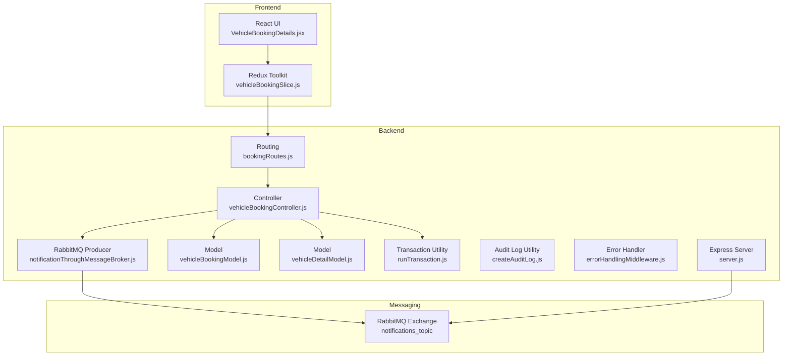

**Diagram sources**
- [server.js](file://backend/server.js#L34-L76)
- [bookingRoutes.js](file://backend/router/bookingRoutes.js#L1-L31)
- [vehicleBookingController.js](file://backend/Controller/vehicleBookingController.js#L1-L861)
- [vehicleBookingModel.js](file://backend/model/vehicleBookingModel.js#L1-L105)
- [vehicleDetailModel.js](file://backend/model/vehicleDetailModel.js#L1-L145)
- [runTransaction.js](file://backend/model/runTransaction.js#L1-L43)
- [notificationThroughMessageBroker.js](file://backend/utils/notificationThroughMessageBroker.js#L1-L69)
- [errorHandlingMiddleware.js](file://backend/utils/errorHandlingMiddleware.js#L1-L233)

**Section sources**
- [server.js](file://backend/server.js#L34-L76)
- [bookingRoutes.js](file://backend/router/bookingRoutes.js#L1-L31)

## Core Components
- Booking Model: Embeds per-vehicle booking details with unique booking identifiers, pricing, and timestamps.
- Vehicle Model: Stores vehicle groups with embedded specific vehicles and their booked periods.
- Controller: Implements booking creation, cancellation, rescheduling, and completion with MongoDB transactions.
- Frontend Redux: Async thunks for booking actions and state management.
- Notifications: RabbitMQ producer for sending notifications.
- Transactions: Utility to wrap multiple DB operations atomically.

**Section sources**
- [vehicleBookingModel.js](file://backend/model/vehicleBookingModel.js#L9-L104)
- [vehicleDetailModel.js](file://backend/model/vehicleDetailModel.js#L6-L105)
- [vehicleBookingController.js](file://backend/Controller/vehicleBookingController.js#L235-L466)
- [vehicleBookingSlice.js](file://frontend/src/appRedux/redux/bookingSlice/vehicleBookingSlice.js#L1-L203)
- [notificationThroughMessageBroker.js](file://backend/utils/notificationThroughMessageBroker.js#L1-L69)
- [runTransaction.js](file://backend/model/runTransaction.js#L1-L43)

## Architecture Overview
The booking lifecycle spans frontend UI, Redux actions, backend routes/controllers, models, transactions, and messaging.

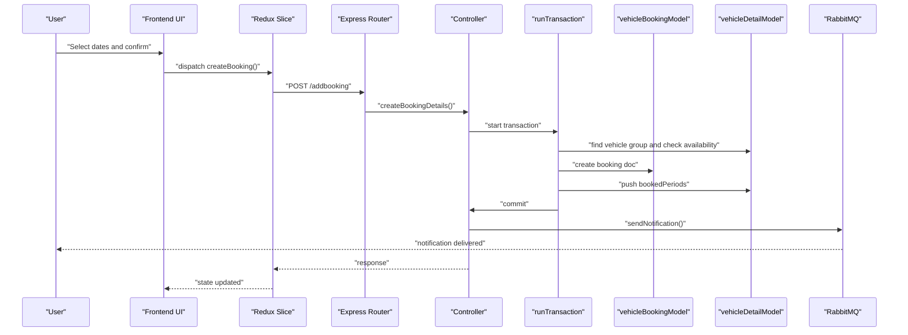

**Diagram sources**
- [VehicleBookingDetails.jsx](file://frontend/src/pages/VehicleBookingPage/VehicleBookingDetails.jsx#L115-L144)
- [vehicleBookingSlice.js](file://frontend/src/appRedux/redux/bookingSlice/vehicleBookingSlice.js#L24-L37)
- [bookingRoutes.js](file://backend/router/bookingRoutes.js#L7-L7)
- [vehicleBookingController.js](file://backend/Controller/vehicleBookingController.js#L235-L466)
- [runTransaction.js](file://backend/model/runTransaction.js#L4-L18)
- [vehicleDetailModel.js](file://backend/model/vehicleDetailModel.js#L38-L43)
- [vehicleBookingModel.js](file://backend/model/vehicleBookingModel.js#L16-L59)
- [notificationThroughMessageBroker.js](file://backend/utils/notificationThroughMessageBroker.js#L33-L64)

## Detailed Component Analysis

### Booking Model Schema
The booking document embeds an array of vehicle-specific booking entries. Each entry includes:
- Customer and vehicle metadata
- Pricing fields: base price, extra expenditure, tax, total price
- Unique identifiers: uniqueBookingId, uniqueVehicleId
- Status and timestamps
- Availability blocking via vehicle model’s bookedPeriods

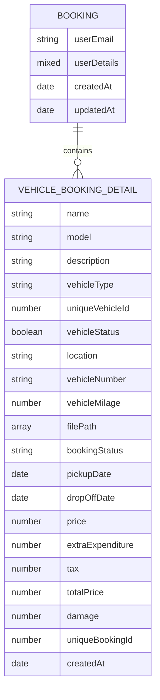

**Diagram sources**
- [vehicleBookingModel.js](file://backend/model/vehicleBookingModel.js#L9-L66)

**Section sources**
- [vehicleBookingModel.js](file://backend/model/vehicleBookingModel.js#L9-L104)

### Vehicle Model Schema and Availability
Each vehicle group stores embedded specific vehicles with:
- Unique identifiers and status
- Location, registration number, mileage
- Booked periods array used for overlap checks

Availability is enforced by ensuring no overlap exists between requested dates and existing bookedPeriods.

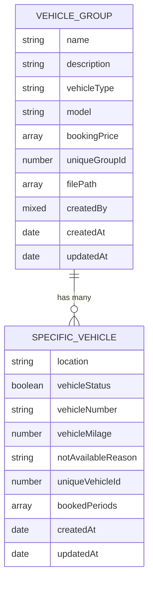

**Diagram sources**
- [vehicleDetailModel.js](file://backend/model/vehicleDetailModel.js#L55-L105)

**Section sources**
- [vehicleDetailModel.js](file://backend/model/vehicleDetailModel.js#L6-L145)

### Booking Creation Workflow
- Validation: Required fields, date ordering, user authorization
- Transaction: Atomicity across booking creation, vehicle period blocking, and user stats update
- Availability: Confirms no overlapping periods for the selected vehicle
- Persistence: Saves booking document and updates vehicle’s bookedPeriods
- Notifications: Sends internal notification and emails via RabbitMQ exchange

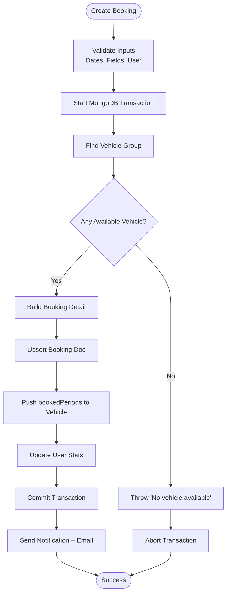

**Diagram sources**
- [vehicleBookingController.js](file://backend/Controller/vehicleBookingController.js#L235-L466)
- [runTransaction.js](file://backend/model/runTransaction.js#L4-L18)
- [vehicleDetailModel.js](file://backend/model/vehicleDetailModel.js#L38-L43)
- [notificationThroughMessageBroker.js](file://backend/utils/notificationThroughMessageBroker.js#L33-L64)

**Section sources**
- [vehicleBookingController.js](file://backend/Controller/vehicleBookingController.js#L235-L466)
- [runTransaction.js](file://backend/model/runTransaction.js#L1-L43)

### Availability Checking and Conflict Resolution
- Overlap detection uses interval overlap logic against bookedPeriods
- Conflict resolution: if overlap exists, return “No available vehicle” error
- On successful booking, push the new period; on cancellation/reschedule, pull/remove old period and push new period

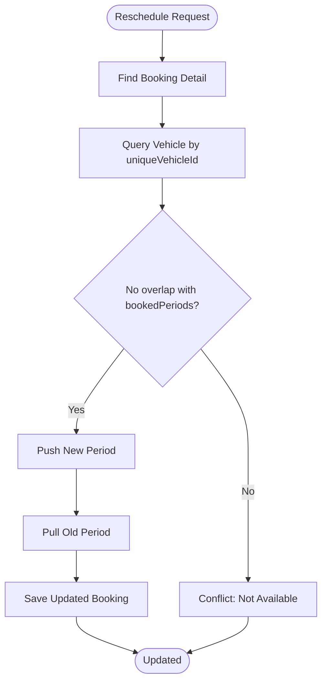

**Diagram sources**
- [vehicleBookingController.js](file://backend/Controller/vehicleBookingController.js#L664-L758)
- [vehicleDetailModel.js](file://backend/model/vehicleDetailModel.js#L38-L43)

**Section sources**
- [vehicleBookingController.js](file://backend/Controller/vehicleBookingController.js#L664-L758)

### Booking Modification Workflows
- Rescheduling: Validates new slot availability, blocks new slot, removes old slot, updates booking dates
- Completion: Admin-only endpoint to mark booking as completed within transaction boundaries

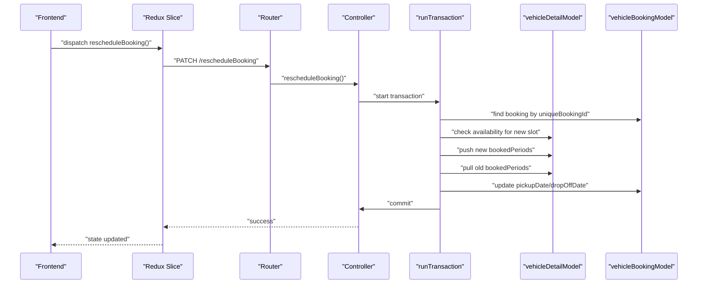

**Diagram sources**
- [vehicleBookingController.js](file://backend/Controller/vehicleBookingController.js#L664-L758)
- [runTransaction.js](file://backend/model/runTransaction.js#L4-L18)

**Section sources**
- [vehicleBookingController.js](file://backend/Controller/vehicleBookingController.js#L664-L758)

### Booking Cancellation Procedures
- Authorization: Admin can cancel any booking; user can cancel within allowed window
- Window calculation: Cancellation allowed if more than threshold hours remain before pickup
- Atomicity: Cancels booking, frees vehicle slot, decrements user stats
- Notifications: Sends internal notification and email

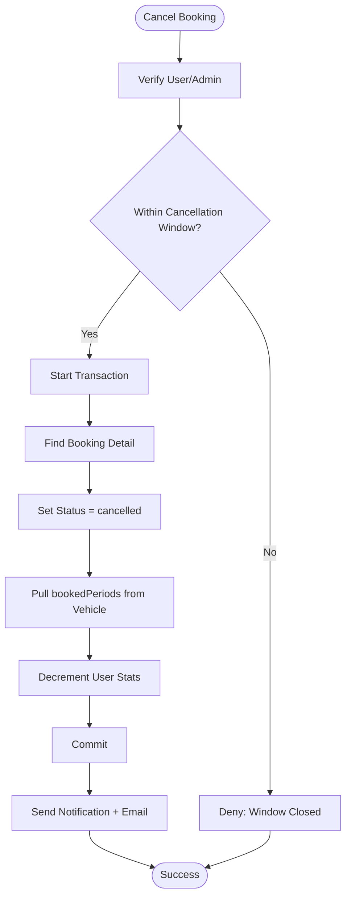

**Diagram sources**
- [vehicleBookingController.js](file://backend/Controller/vehicleBookingController.js#L480-L632)
- [runTransaction.js](file://backend/model/runTransaction.js#L4-L18)
- [notificationThroughMessageBroker.js](file://backend/utils/notificationThroughMessageBroker.js#L56-L64)

**Section sources**
- [vehicleBookingController.js](file://backend/Controller/vehicleBookingController.js#L470-L632)

### Booking Model Schema Details
- Embedded vehicleDetails array with per-entry pricing and status
- Index on uniqueBookingId for uniqueness enforcement
- Auto-incremented uniqueBookingId generation via a counter document

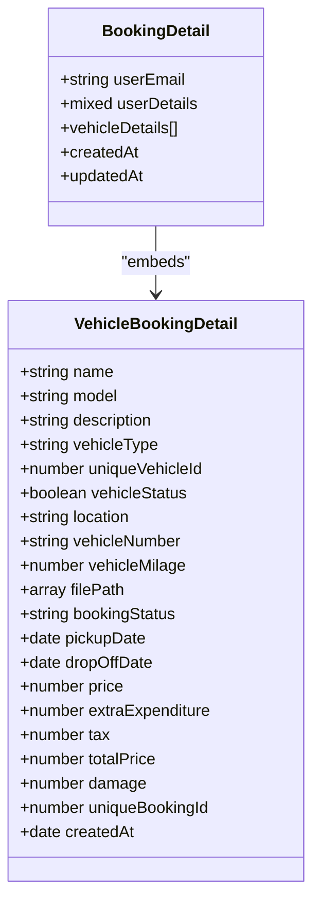

**Diagram sources**
- [vehicleBookingModel.js](file://backend/model/vehicleBookingModel.js#L9-L66)

**Section sources**
- [vehicleBookingModel.js](file://backend/model/vehicleBookingModel.js#L68-L97)

### Frontend Booking UI and Redux State Management
- UI collects dates, calculates price breakdown, and dispatches createBooking thunk
- Redux slice defines async thunks for create, cancel, complete, and fetch operations
- State tracks loading, success messages, and errors for each operation

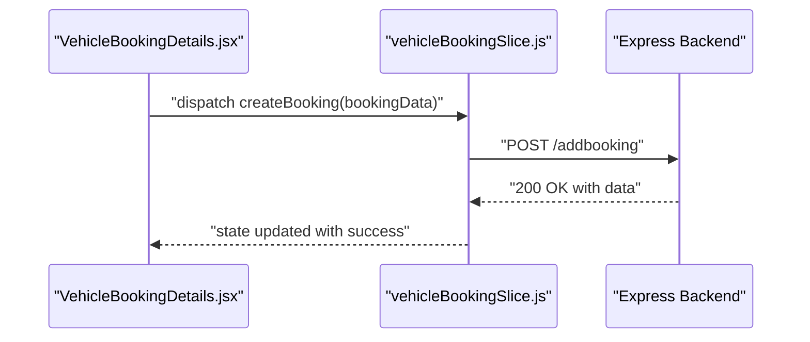

**Diagram sources**
- [VehicleBookingDetails.jsx](file://frontend/src/pages/VehicleBookingPage/VehicleBookingDetails.jsx#L115-L144)
- [vehicleBookingSlice.js](file://frontend/src/appRedux/redux/bookingSlice/vehicleBookingSlice.js#L24-L37)
- [bookingRoutes.js](file://backend/router/bookingRoutes.js#L7-L7)

**Section sources**
- [VehicleBookingDetails.jsx](file://frontend/src/pages/VehicleBookingPage/VehicleBookingDetails.jsx#L1-L372)
- [vehicleBookingSlice.js](file://frontend/src/appRedux/redux/bookingSlice/vehicleBookingSlice.js#L1-L203)

### Real-time Updates via Socket.IO
- Socket.IO server is initialized and attached to the HTTP server
- Frontend can integrate listeners to receive live updates on booking events

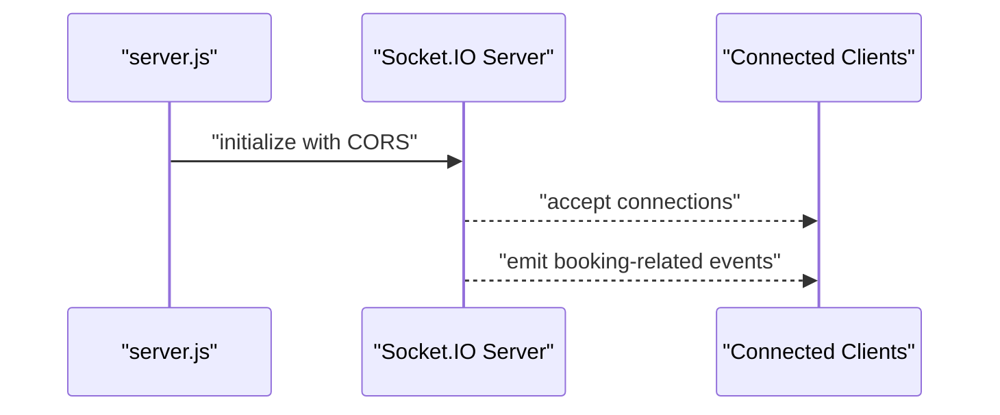

**Diagram sources**
- [server.js](file://backend/server.js#L52-L60)

**Section sources**
- [server.js](file://backend/server.js#L52-L60)

### RabbitMQ Integration for Notifications
- Producer connects to RabbitMQ, asserts topic exchange, publishes persistent notifications
- Routing keys differ for admin vs user targets

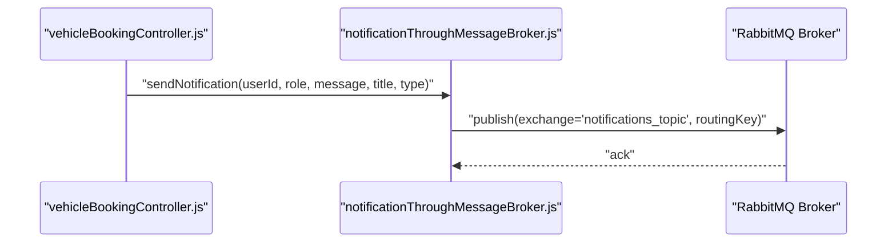

**Diagram sources**
- [vehicleBookingController.js](file://backend/Controller/vehicleBookingController.js#L431-L457)
- [notificationThroughMessageBroker.js](file://backend/utils/notificationThroughMessageBroker.js#L33-L64)

**Section sources**
- [notificationThroughMessageBroker.js](file://backend/utils/notificationThroughMessageBroker.js#L1-L69)
- [vehicleBookingController.js](file://backend/Controller/vehicleBookingController.js#L431-L457)

### Booking List Management and History
- Endpoint retrieves a user’s booking details; optional status filtering
- Frontend Redux slice fetches and stores booking lists

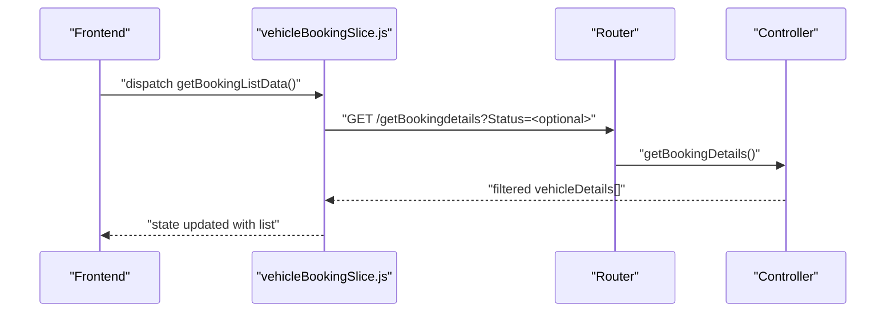

**Diagram sources**
- [vehicleBookingSlice.js](file://frontend/src/appRedux/redux/bookingSlice/vehicleBookingSlice.js#L7-L19)
- [bookingRoutes.js](file://backend/router/bookingRoutes.js#L8-L12)
- [vehicleBookingController.js](file://backend/Controller/vehicleBookingController.js#L635-L662)

**Section sources**
- [vehicleBookingController.js](file://backend/Controller/vehicleBookingController.js#L635-L662)
- [vehicleBookingSlice.js](file://frontend/src/appRedux/redux/bookingSlice/vehicleBookingSlice.js#L7-L19)

### Audit Trails
- Audit log schema captures action, entity type, identifiers, performer, and IP/user agent
- Utilities support transaction-aware audit logging

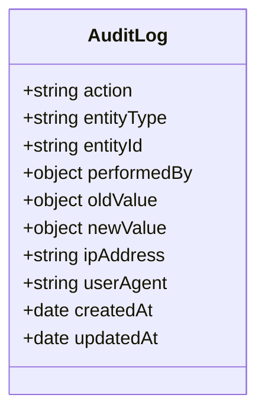

**Diagram sources**
- [auditLogSchema.js](file://backend/model/auditLogSchema.js#L3-L61)

**Section sources**
- [auditLogSchema.js](file://backend/model/auditLogSchema.js#L1-L64)
- [createAuditLog.js](file://backend/utils/createAuditLog.js#L1-L31)

## Dependency Analysis
- Controllers depend on models, transaction utility, and notification utilities
- Frontend Redux slices depend on backend routes
- Server integrates Socket.IO and exposes routes

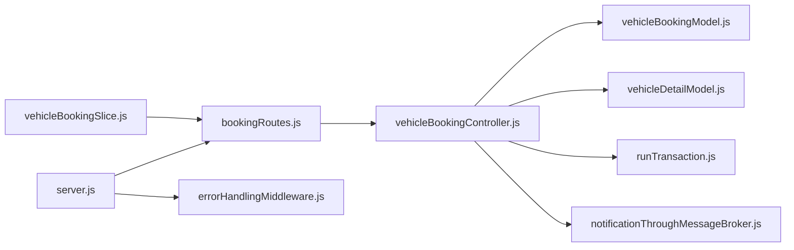

**Diagram sources**
- [vehicleBookingSlice.js](file://frontend/src/appRedux/redux/bookingSlice/vehicleBookingSlice.js#L1-L203)
- [bookingRoutes.js](file://backend/router/bookingRoutes.js#L1-L31)
- [vehicleBookingController.js](file://backend/Controller/vehicleBookingController.js#L1-L861)
- [vehicleBookingModel.js](file://backend/model/vehicleBookingModel.js#L1-L105)
- [vehicleDetailModel.js](file://backend/model/vehicleDetailModel.js#L1-L145)
- [runTransaction.js](file://backend/model/runTransaction.js#L1-L43)
- [notificationThroughMessageBroker.js](file://backend/utils/notificationThroughMessageBroker.js#L1-L69)
- [server.js](file://backend/server.js#L34-L76)
- [errorHandlingMiddleware.js](file://backend/utils/errorHandlingMiddleware.js#L1-L233)

**Section sources**
- [vehicleBookingController.js](file://backend/Controller/vehicleBookingController.js#L1-L861)
- [vehicleBookingSlice.js](file://frontend/src/appRedux/redux/bookingSlice/vehicleBookingSlice.js#L1-L203)

## Performance Considerations
- Use MongoDB indexes on frequently queried fields (e.g., uniqueBookingId, uniqueVehicleId) to speed up lookups
- Batch vehicle availability queries when scaling
- Limit concurrent booking requests per vehicle to reduce contention
- Use transactions judiciously; keep them short-lived to minimize lock duration
- Offload heavy computations (e.g., pricing) to the frontend or precompute ranges to reduce backend load

## Troubleshooting Guide
Common issues and resolutions:
- Duplicate booking conflict: Ensure uniqueBookingId uniqueness and proper transaction usage
- Availability mismatch: Verify interval overlap logic and timezone handling
- Cancellation denied: Confirm cancellation window rules and user/admin permissions
- Notification delivery failures: Check RabbitMQ connectivity and exchange assertions
- Error handling: Centralized error handler formats operational vs unexpected errors

**Section sources**
- [vehicleBookingController.js](file://backend/Controller/vehicleBookingController.js#L470-L632)
- [errorHandlingMiddleware.js](file://backend/utils/errorHandlingMiddleware.js#L117-L232)
- [notificationThroughMessageBroker.js](file://backend/utils/notificationThroughMessageBroker.js#L8-L30)

## Conclusion
The booking system enforces strong consistency via MongoDB transactions, robust availability checks, and a clear separation of concerns across frontend and backend. RabbitMQ and Socket.IO enable scalable notifications and real-time updates. Extending the system should focus on audit coverage, analytics hooks, and capacity planning aligned with vehicle group sizes and demand patterns.

## Appendices

### API Definitions
- POST /addbooking
  - Authenticated user creates a booking with pickupDate, dropOffDate, price, extraExpenditure, tax, totalPrice, uniqueGroupId, bookingStatus
  - Returns created booking document
- GET /getBookingdetails?Status=<optional>
  - Returns user’s booking details, optionally filtered by status
- PATCH /updateBookingDetails
  - Cancels a booking by setting status to cancelled (with cancellation window checks)
- PATCH /rescheduleBooking
  - Reschedules booking dates after availability verification
- PATCH /completeBooking (admin-only)
  - Marks a booking as completed

**Section sources**
- [bookingRoutes.js](file://backend/router/bookingRoutes.js#L7-L28)

### Common Scenarios
- New booking: Select dates, compute price, submit via Redux thunk, receive success and notification
- Reschedule: Choose new dates, verify availability, update booking
- Cancel: Within allowed window, admin can cancel immediately; otherwise enforce window rules
- Completion: Admin marks ride as completed

**Section sources**
- [VehicleBookingDetails.jsx](file://frontend/src/pages/VehicleBookingPage/VehicleBookingDetails.jsx#L115-L144)
- [vehicleBookingController.js](file://backend/Controller/vehicleBookingController.js#L664-L800)