# Vehicle Management System

<cite>
**Referenced Files in This Document**
- [server.js](file://backend/server.js)
- [vehicleRoute.js](file://backend/router/vehicleRoute.js)
- [bookingRoutes.js](file://backend/router/bookingRoutes.js)
- [vehicleDetailModel.js](file://backend/model/vehicleDetailModel.js)
- [vehicleBookingModel.js](file://backend/model/vehicleBookingModel.js)
- [bookingIDCounerSchema.js](file://backend/model/bookingIDCounerSchema.js)
- [vehicleController.js](file://backend/Controller/vehicleController.js)
- [vehicleBookingController.js](file://backend/Controller/vehicleBookingController.js)
- [runTransaction.js](file://backend/model/runTransaction.js)
- [notificationThroughMessageBroker.js](file://backend/utils/notificationThroughMessageBroker.js)
- [MessageService.js](file://backend/NotificationServices/MessageService.js)
- [auditActions.js](file://backend/config/auditActions.js)
- [generateunuiquebookingId.js](file://backend/utils/generateunuiquebookingId.js)
- [package.json](file://backend/package.json)
</cite>

## Table of Contents
1. [Introduction](#introduction)
2. [Project Structure](#project-structure)
3. [Core Components](#core-components)
4. [Architecture Overview](#architecture-overview)
5. [Detailed Component Analysis](#detailed-component-analysis)
6. [Dependency Analysis](#dependency-analysis)
7. [Performance Considerations](#performance-considerations)
8. [Troubleshooting Guide](#troubleshooting-guide)
9. [Conclusion](#conclusion)
10. [Appendices](#appendices)

## Introduction
This document describes the vehicle management and booking system. It covers vehicle CRUD operations (creation, modification, deletion, and group updates), pricing management, availability checking, inventory tracking, and the booking lifecycle (selection, confirmation, modification, cancellation, completion). It also documents transaction management, conflict resolution for overlapping reservations, capacity planning, and integration with the notification system.

## Project Structure
The backend is an Express.js application with:
- Routes for vehicles and bookings
- Controllers implementing business logic
- Mongoose models for persistence
- Utilities for transactions, notifications, and unique identifiers
- RabbitMQ-based asynchronous messaging for notifications and emails

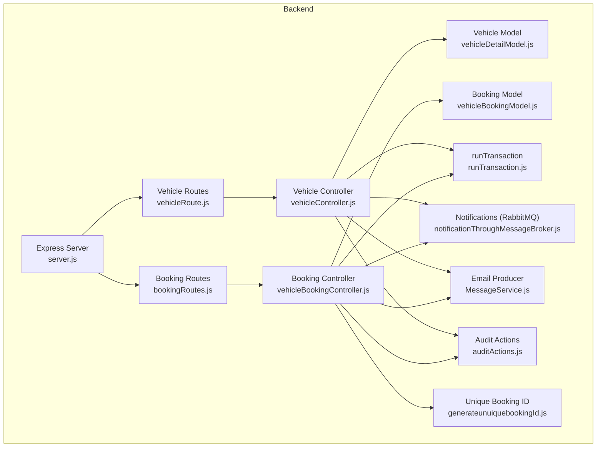

**Diagram sources**
- [server.js](file://backend/server.js#L34-L76)
- [vehicleRoute.js](file://backend/router/vehicleRoute.js#L1-L42)
- [bookingRoutes.js](file://backend/router/bookingRoutes.js#L1-L31)
- [vehicleController.js](file://backend/Controller/vehicleController.js#L21-L203)
- [vehicleBookingController.js](file://backend/Controller/vehicleBookingController.js#L235-L466)
- [vehicleDetailModel.js](file://backend/model/vehicleDetailModel.js#L55-L105)
- [vehicleBookingModel.js](file://backend/model/vehicleBookingModel.js#L9-L66)
- [runTransaction.js](file://backend/model/runTransaction.js#L4-L18)
- [notificationThroughMessageBroker.js](file://backend/utils/notificationThroughMessageBroker.js#L33-L64)
- [MessageService.js](file://backend/NotificationServices/MessageService.js#L36-L60)
- [auditActions.js](file://backend/config/auditActions.js#L1-L18)
- [generateunuiquebookingId.js](file://backend/utils/generateunuiquebookingId.js#L7-L20)

**Section sources**
- [server.js](file://backend/server.js#L34-L76)
- [vehicleRoute.js](file://backend/router/vehicleRoute.js#L1-L42)
- [bookingRoutes.js](file://backend/router/bookingRoutes.js#L1-L31)

## Core Components
- Vehicle model: embeds per-vehicle details under a vehicle group, tracks availability periods and pricing tiers.
- Booking model: stores per-vehicle booking entries with unique booking IDs and status.
- Controllers: enforce validations, manage transactions, and integrate with notifications and emails.
- Transactions: wrap related operations to maintain consistency.
- Notifications: publish to RabbitMQ topics for real-time alerts and email queuing.

**Section sources**
- [vehicleDetailModel.js](file://backend/model/vehicleDetailModel.js#L55-L105)
- [vehicleBookingModel.js](file://backend/model/vehicleBookingModel.js#L9-L66)
- [vehicleController.js](file://backend/Controller/vehicleController.js#L21-L203)
- [vehicleBookingController.js](file://backend/Controller/vehicleBookingController.js#L235-L466)
- [runTransaction.js](file://backend/model/runTransaction.js#L4-L18)
- [notificationThroughMessageBroker.js](file://backend/utils/notificationThroughMessageBroker.js#L33-L64)
- [MessageService.js](file://backend/NotificationServices/MessageService.js#L36-L60)

## Architecture Overview
The system uses Express with Mongoose and RabbitMQ. Controllers orchestrate requests, models define schemas, and transactions ensure atomicity. Notifications and emails are decoupled via message brokers.

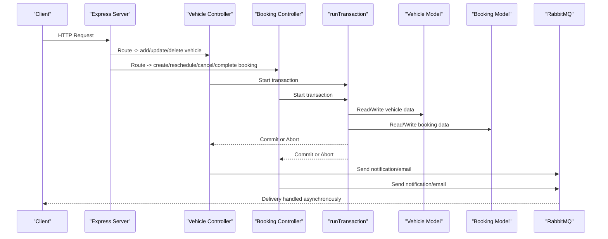

**Diagram sources**
- [server.js](file://backend/server.js#L66-L71)
- [vehicleController.js](file://backend/Controller/vehicleController.js#L73-L168)
- [vehicleBookingController.js](file://backend/Controller/vehicleBookingController.js#L288-L425)
- [runTransaction.js](file://backend/model/runTransaction.js#L4-L18)
- [vehicleDetailModel.js](file://backend/model/vehicleDetailModel.js#L55-L105)
- [vehicleBookingModel.js](file://backend/model/vehicleBookingModel.js#L9-L66)
- [notificationThroughMessageBroker.js](file://backend/utils/notificationThroughMessageBroker.js#L33-L64)
- [MessageService.js](file://backend/NotificationServices/MessageService.js#L36-L60)

## Detailed Component Analysis

### Vehicle CRUD Operations
- Creation: Validates inputs, formats pricing, enforces uniqueness, and appends or creates vehicle records within a transaction. Emits notifications and updates audit logs.
- Modification: Updates specific vehicle attributes and logs differences for audit.
- Deletion: Removes a specific vehicle from a group; if the group becomes empty, deletes the group. Updates audit logs and notifies admins.
- Group updates: Updates shared group fields (pricing, name, model, type) within a transaction and logs changes.

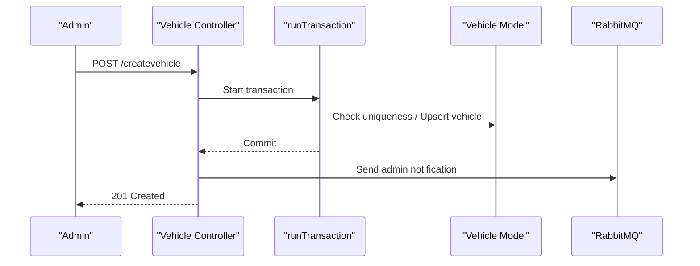

**Diagram sources**
- [vehicleController.js](file://backend/Controller/vehicleController.js#L21-L203)
- [runTransaction.js](file://backend/model/runTransaction.js#L4-L18)
- [vehicleDetailModel.js](file://backend/model/vehicleDetailModel.js#L55-L105)
- [notificationThroughMessageBroker.js](file://backend/utils/notificationThroughMessageBroker.js#L33-L64)

**Section sources**
- [vehicleController.js](file://backend/Controller/vehicleController.js#L21-L203)
- [vehicleController.js](file://backend/Controller/vehicleController.js#L294-L446)
- [vehicleController.js](file://backend/Controller/vehicleController.js#L552-L667)
- [vehicleController.js](file://backend/Controller/vehicleController.js#L669-L800)

### Pricing Management and Inventory Tracking
- Pricing tiers: Stored as arrays of range/price pairs per vehicle group. Controllers accept arrays or JSON-encoded arrays and normalize to numbers.
- Inventory tracking: Per-vehicle embedded array tracks availability periods. Bookings append date ranges; cancellations remove them.

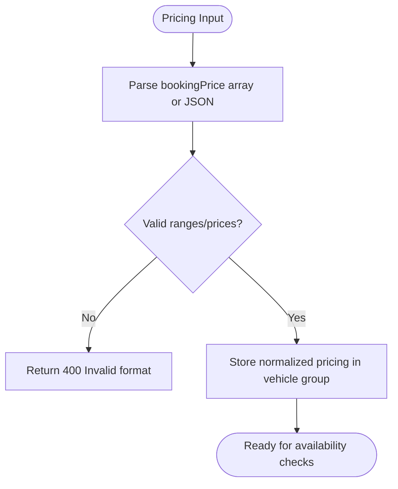

**Diagram sources**
- [vehicleController.js](file://backend/Controller/vehicleController.js#L48-L61)
- [vehicleDetailModel.js](file://backend/model/vehicleDetailModel.js#L75-L86)

**Section sources**
- [vehicleController.js](file://backend/Controller/vehicleController.js#L48-L61)
- [vehicleDetailModel.js](file://backend/model/vehicleDetailModel.js#L75-L86)

### Availability Checking and Conflict Resolution
- Availability check: Iterates through specific vehicles in a group and verifies no overlap with existing bookedPeriods for the requested interval.
- Overlap detection: Uses inclusive interval overlap logic to detect conflicts.
- Conflict resolution: Throws errors when no vehicle is available or when rescheduling conflicts with existing bookings.

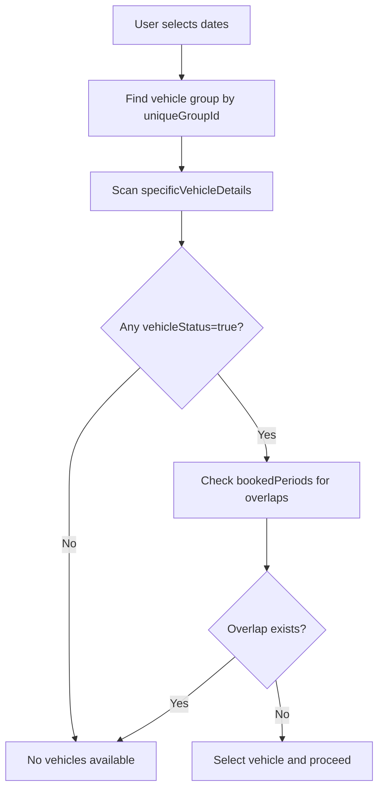

**Diagram sources**
- [vehicleBookingController.js](file://backend/Controller/vehicleBookingController.js#L304-L321)
- [vehicleDetailModel.js](file://backend/model/vehicleDetailModel.js#L38-L43)

**Section sources**
- [vehicleBookingController.js](file://backend/Controller/vehicleBookingController.js#L304-L321)
- [vehicleDetailModel.js](file://backend/model/vehicleDetailModel.js#L38-L43)

### Booking Workflow: Creation, Confirmation, Rescheduling, Completion
- Creation: Validates inputs, ensures user exists, finds an available vehicle in the group, constructs booking details, persists within a transaction, blocks vehicle dates, updates user stats, and sends notifications and emails.
- Confirmation: Status transitions occur via separate endpoints; creation sets initial status and emits notifications.
- Rescheduling: Validates availability for the new slot, blocks the new period, removes the old period atomically, and updates the booking.
- Completion: Admin marks booking as completed, decrements active booking count, and notifies the user.

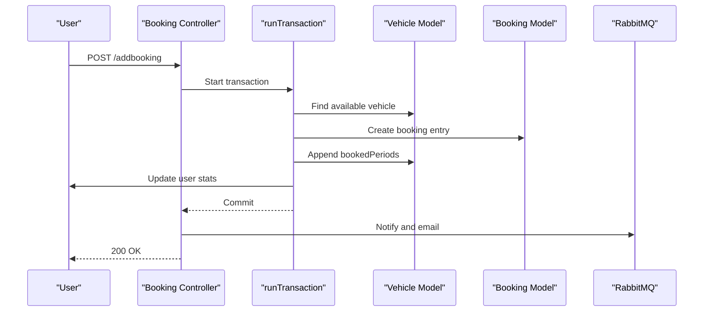

**Diagram sources**
- [vehicleBookingController.js](file://backend/Controller/vehicleBookingController.js#L235-L466)
- [runTransaction.js](file://backend/model/runTransaction.js#L4-L18)
- [vehicleDetailModel.js](file://backend/model/vehicleDetailModel.js#L38-L43)
- [vehicleBookingModel.js](file://backend/model/vehicleBookingModel.js#L9-L66)
- [notificationThroughMessageBroker.js](file://backend/utils/notificationThroughMessageBroker.js#L33-L64)
- [MessageService.js](file://backend/NotificationServices/MessageService.js#L36-L60)

**Section sources**
- [vehicleBookingController.js](file://backend/Controller/vehicleBookingController.js#L235-L466)
- [vehicleBookingController.js](file://backend/Controller/vehicleBookingController.js#L664-L758)
- [vehicleBookingController.js](file://backend/Controller/vehicleBookingController.js#L760-L860)

### Booking Cancellation and Refund Handling
- Cancellation policy: Allows cancellation only if the pickup is at least 12 hours later; admins can cancel anytime.
- Atomic cancellation: Marks booking as cancelled, frees the vehicle slot, decrements user stats, and notifies the user.
- Refunds: Not implemented in code; user stats reflect financial adjustments by decrementing spent amount.

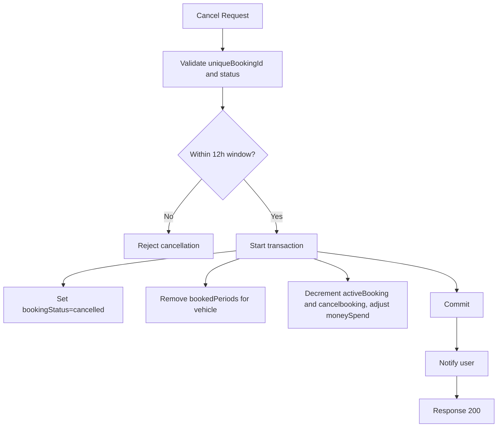

**Diagram sources**
- [vehicleBookingController.js](file://backend/Controller/vehicleBookingController.js#L480-L632)
- [vehicleDetailModel.js](file://backend/model/vehicleDetailModel.js#L38-L43)

**Section sources**
- [vehicleBookingController.js](file://backend/Controller/vehicleBookingController.js#L470-L476)
- [vehicleBookingController.js](file://backend/Controller/vehicleBookingController.js#L480-L632)

### Vehicle Grouping Strategies and Fleet Management
- Grouping: Vehicles are grouped under a unique group ID with shared metadata and pricing; specific vehicles carry per-unit details.
- Fleet operations: Group updates modify shared attributes; bulk-like operations are supported via group-level updates.

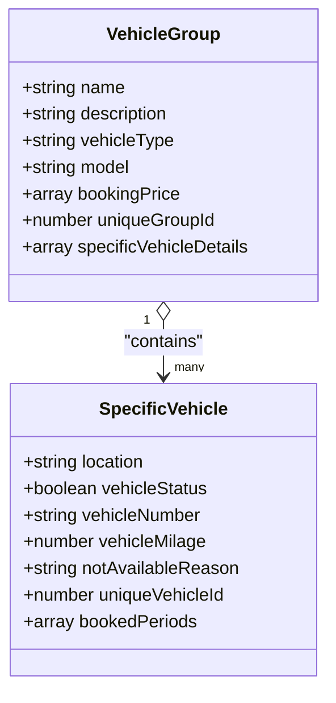

**Diagram sources**
- [vehicleDetailModel.js](file://backend/model/vehicleDetailModel.js#L55-L105)

**Section sources**
- [vehicleDetailModel.js](file://backend/model/vehicleDetailModel.js#L55-L105)
- [vehicleController.js](file://backend/Controller/vehicleController.js#L669-L800)

### Maintenance Scheduling Integration
- Maintenance reasons: Vehicles can be marked with reasons including "In Repair".
- Integration pattern: Use the notAvailableReason field and vehicleStatus to mark vehicles unavailable during maintenance windows; availability checks exclude vehicles with conflicting reasons.

**Section sources**
- [vehicleDetailModel.js](file://backend/model/vehicleDetailModel.js#L27-L32)
- [vehicleBookingController.js](file://backend/Controller/vehicleBookingController.js#L304-L321)

### Transaction Management and Audit Logs
- Transactions: Wraps related reads/writes in a single session to ensure atomicity.
- Audit actions: Centralized constants define actions for vehicles, bookings, and user/admin events.

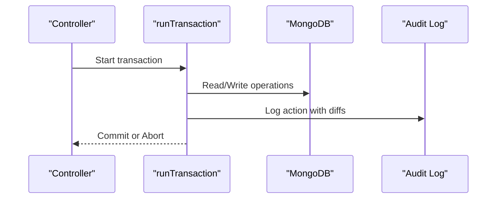

**Diagram sources**
- [runTransaction.js](file://backend/model/runTransaction.js#L4-L18)
- [auditActions.js](file://backend/config/auditActions.js#L1-L18)
- [vehicleController.js](file://backend/Controller/vehicleController.js#L153-L165)
- [vehicleBookingController.js](file://backend/Controller/vehicleBookingController.js#L506-L585)

**Section sources**
- [runTransaction.js](file://backend/model/runTransaction.js#L4-L18)
- [auditActions.js](file://backend/config/auditActions.js#L1-L18)
- [vehicleController.js](file://backend/Controller/vehicleController.js#L153-L165)
- [vehicleBookingController.js](file://backend/Controller/vehicleBookingController.js#L506-L585)

### Capacity Planning Features
- Shared pricing tiers enable dynamic rate modeling per group.
- Group-level updates allow fleet-wide pricing changes.
- Availability scanning across specific vehicles supports capacity planning by date ranges.

**Section sources**
- [vehicleDetailModel.js](file://backend/model/vehicleDetailModel.js#L75-L86)
- [vehicleController.js](file://backend/Controller/vehicleController.js#L671-L781)
- [vehicleBookingController.js](file://backend/Controller/vehicleBookingController.js#L304-L321)

### Notification and Email Integration Patterns
- Notifications: Published to a topic exchange with routing keys based on role/user.
- Emails: Queued via a direct exchange with routing keys for templates.
- Reliability: Connections auto-retry; messages are persisted.

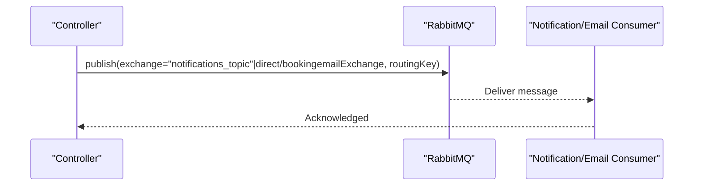

**Diagram sources**
- [notificationThroughMessageBroker.js](file://backend/utils/notificationThroughMessageBroker.js#L33-L64)
- [MessageService.js](file://backend/NotificationServices/MessageService.js#L36-L60)

**Section sources**
- [notificationThroughMessageBroker.js](file://backend/utils/notificationThroughMessageBroker.js#L33-L64)
- [MessageService.js](file://backend/NotificationServices/MessageService.js#L36-L60)

## Dependency Analysis
External dependencies include Express, Mongoose, RabbitMQ client, Redis, and others. The backend registers routes, connects to MongoDB, and exposes endpoints for vehicles and bookings.

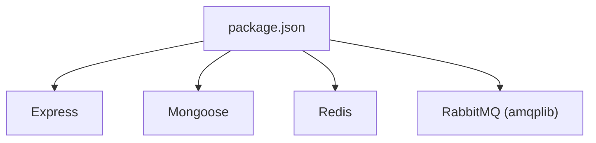

**Diagram sources**
- [package.json](file://backend/package.json#L2-L31)

**Section sources**
- [package.json](file://backend/package.json#L2-L31)
- [server.js](file://backend/server.js#L18-L204)

## Performance Considerations
- Caching: Vehicle listings are cached in Redis with TTL to reduce DB load.
- Batch operations: Vehicle seeding demonstrates batching inserts to avoid memory pressure.
- Indexes: Unique indexes on booking IDs and vehicle numbers improve lookup performance.
- Asynchronous notifications: Offloads work to RabbitMQ consumers to keep request latency low.

**Section sources**
- [vehicleController.js](file://backend/Controller/vehicleController.js#L211-L240)
- [server.js](file://backend/server.js#L85-L133)
- [vehicleBookingModel.js](file://backend/model/vehicleBookingModel.js#L68-L72)

## Troubleshooting Guide
- Vehicle creation errors: Ensure required fields are present and vehicle number is unique; check pricing format.
- Booking failures: Verify dates are valid and vehicle is available; confirm user exists.
- Cancellation errors: Ensure sufficient time before pickup; admin overrides allowed.
- Transaction failures: Inspect logs for aborts; verify session usage in controllers.
- Notification/email delivery: Confirm RabbitMQ connectivity and exchange/routing key configuration.

**Section sources**
- [vehicleController.js](file://backend/Controller/vehicleController.js#L37-L43)
- [vehicleBookingController.js](file://backend/Controller/vehicleBookingController.js#L252-L263)
- [vehicleBookingController.js](file://backend/Controller/vehicleBookingController.js#L538-L544)
- [runTransaction.js](file://backend/model/runTransaction.js#L13-L17)
- [notificationThroughMessageBroker.js](file://backend/utils/notificationThroughMessageBroker.js#L8-L30)
- [MessageService.js](file://backend/NotificationServices/MessageService.js#L9-L34)

## Conclusion
The system provides robust vehicle and booking management with strong consistency via transactions, efficient caching, and scalable asynchronous notifications. Availability checks prevent conflicts, while grouping enables fleet-wide operations. Extending refund handling and integrating maintenance scheduling can further enhance operational workflows.

## Appendices

### API Endpoints Summary
- Vehicles
  - POST /vehicle/createvehicle (admin)
  - PATCH /vehicle/updatevehicle/:uniqueId (admin)
  - DELETE /vehicle/deletevehicle/:uniqueId (admin)
  - GET /vehicle/getallvehicle
  - GET /vehicle/getvehiclebyname
  - GET /vehicle/getvehicledatabymodel
  - GET /vehicle/getvehiclebytype
  - PATCH /vehicle/updatevehiclegroup/:groupId (admin)
- Bookings
  - POST /booking/addbooking
  - GET /booking/getBookingdetails
  - PATCH /booking/updateBookingDetails
  - PATCH /booking/rescheduleBooking
  - PATCH /booking/completeBooking (admin)

**Section sources**
- [vehicleRoute.js](file://backend/router/vehicleRoute.js#L8-L37)
- [bookingRoutes.js](file://backend/router/bookingRoutes.js#L7-L28)

### Unique Booking ID Generation
- Daily counter with YYMMDD prefix; padded to three digits.

**Section sources**
- [generateunuiquebookingId.js](file://backend/utils/generateunuiquebookingId.js#L7-L20)
- [vehicleBookingModel.js](file://backend/model/vehicleBookingModel.js#L74-L97)