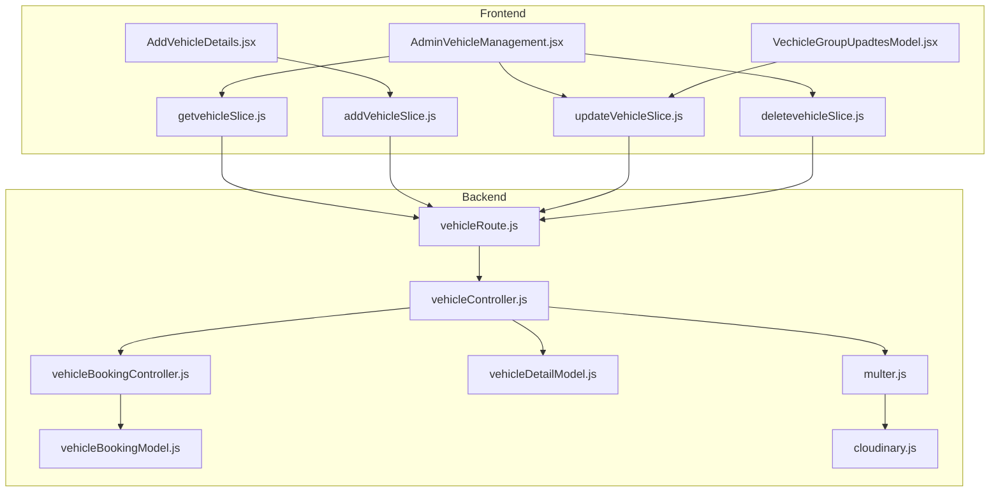
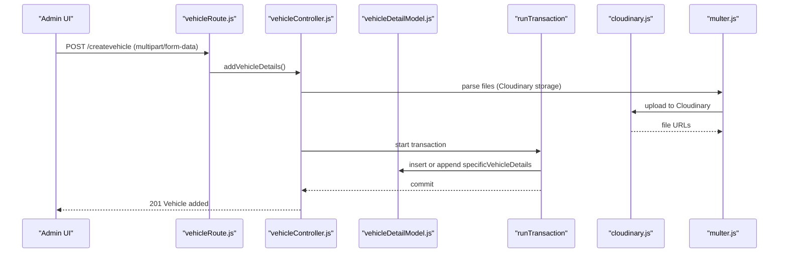
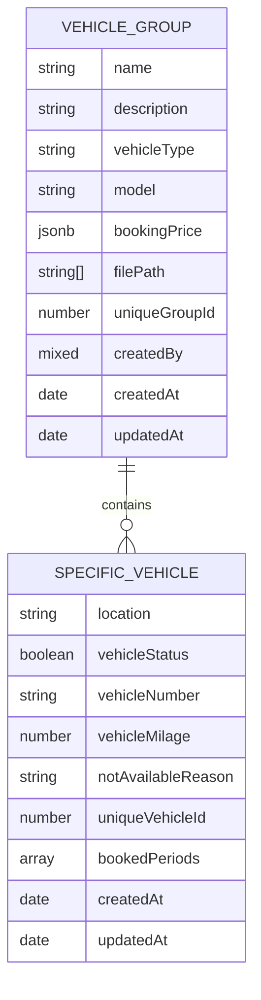
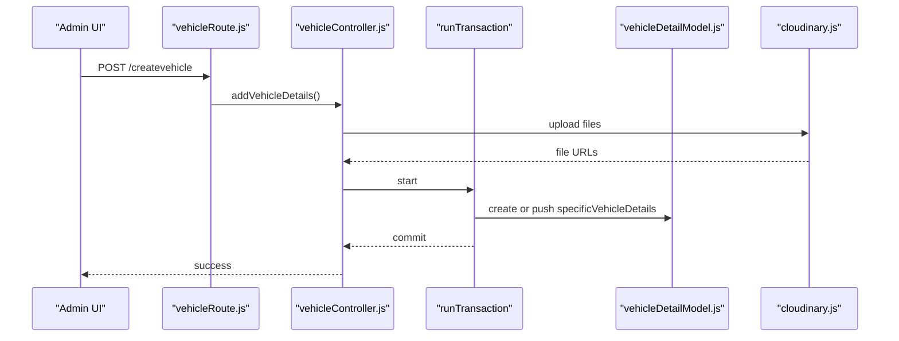
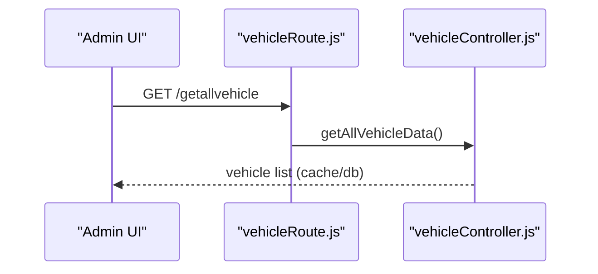
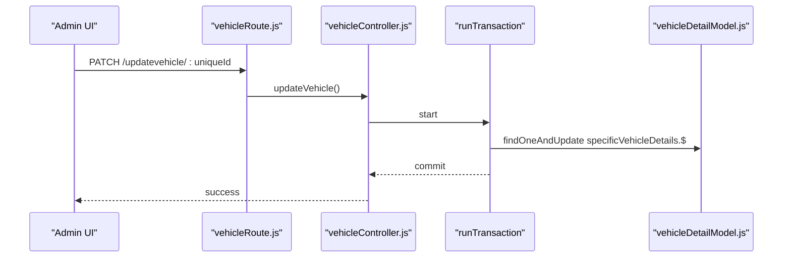
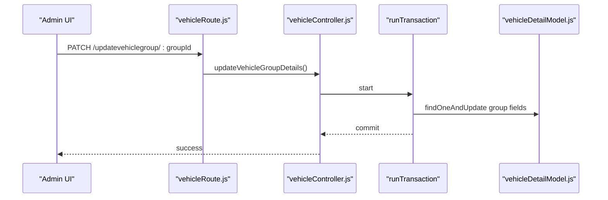
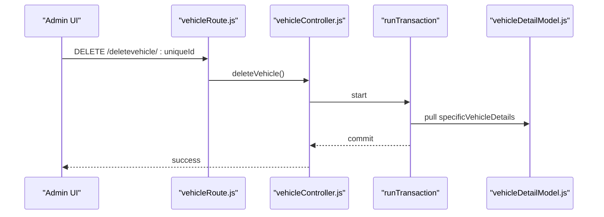
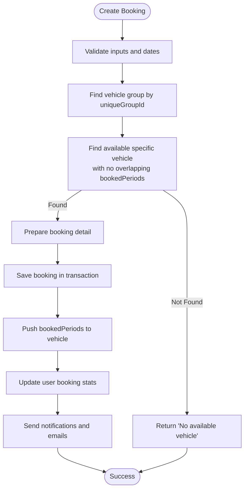
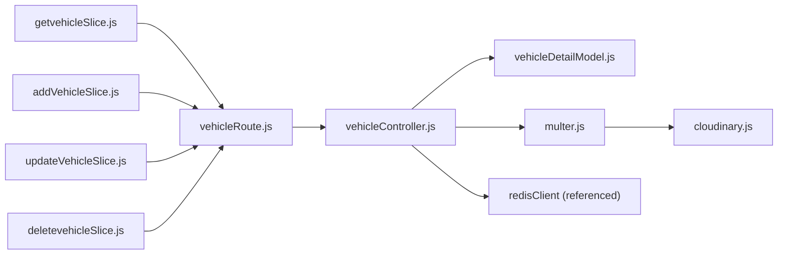

# Vehicle Operations

<cite>
**Referenced Files in This Document**
- [vehicleDetailModel.js](file://backend/model/vehicleDetailModel.js)
- [vehicleController.js](file://backend/Controller/vehicleController.js)
- [vehicleRoute.js](file://backend/router/vehicleRoute.js)
- [multer.js](file://backend/utils/multer.js)
- [cloudinary.js](file://backend/config/cloudinary.js)
- [vehicleBookingModel.js](file://backend/model/vehicleBookingModel.js)
- [vehicleBookingController.js](file://backend/Controller/vehicleBookingController.js)
- [AdminVehicleManagement.jsx](file://frontend/src/pages/vehicleManagementPage/AdminVehicleManagement.jsx)
- [AddVehicleDetails.jsx](file://frontend/src/pages/addVehicle/AddVehicleDetails.jsx)
- [VechicleGroupUpadtesModel.jsx](file://frontend/src/pages/vehicleManagementPage/VechicleGroupUpadtesModel.jsx)
- [getvehicleSlice.js](file://frontend/src/appRedux/redux/vehicleSlice/getvehicleSlice.js)
- [addVehicleSlice.js](file://frontend/src/appRedux/redux/vehicleSlice/addVehicleSlice.js)
- [updateVehicleSlice.js](file://frontend/src/appRedux/redux/vehicleSlice/updateVehicleSlice.js)
- [deletevehicleSlice.js](file://frontend/src/appRedux/redux/vehicleSlice/deletevehicleSlice.js)
</cite>

## Table of Contents
1. [Introduction](#introduction)
2. [Project Structure](#project-structure)
3. [Core Components](#core-components)
4. [Architecture Overview](#architecture-overview)
5. [Detailed Component Analysis](#detailed-component-analysis)
6. [Dependency Analysis](#dependency-analysis)
7. [Performance Considerations](#performance-considerations)
8. [Troubleshooting Guide](#troubleshooting-guide)
9. [Conclusion](#conclusion)
10. [Appendices](#appendices)

## Introduction
This document explains the end-to-end vehicle operations within the vehicle management system. It covers vehicle CRUD (Create, Read, Update, Delete), pricing tiers, fleet grouping, batch operations, categorization, detail model schema, image upload integration with Cloudinary, status management, filtering/search capabilities, admin management interface, bulk updates, inventory tracking, and integration with the booking system for availability validation.

## Project Structure
The system is split into:
- Backend (Node.js + Express + MongoDB/Mongoose):
  - Controllers for vehicle and booking operations
  - Models for vehicle and booking data
  - Routes exposing REST endpoints
  - Utilities for file upload and Cloudinary integration
- Frontend (React + Redux Toolkit):
  - Admin UI for managing vehicles and groups
  - Redux slices for vehicle CRUD operations
  - Forms for adding/editing vehicles and groups

**Diagram sources**
- [vehicleRoute.js](file://backend/router/vehicleRoute.js#L1-L42)
- [vehicleController.js](file://backend/Controller/vehicleController.js#L1-L824)
- [vehicleDetailModel.js](file://backend/model/vehicleDetailModel.js#L1-L145)
- [multer.js](file://backend/utils/multer.js#L1-L52)
- [cloudinary.js](file://backend/config/cloudinary.js#L1-L12)
- [vehicleBookingController.js](file://backend/Controller/vehicleBookingController.js#L1-L861)
- [vehicleBookingModel.js](file://backend/model/vehicleBookingModel.js#L1-L105)
- [AdminVehicleManagement.jsx](file://frontend/src/pages/vehicleManagementPage/AdminVehicleManagement.jsx#L1-L517)
- [AddVehicleDetails.jsx](file://frontend/src/pages/addVehicle/AddVehicleDetails.jsx#L1-L344)
- [VechicleGroupUpadtesModel.jsx](file://frontend/src/pages/vehicleManagementPage/VechicleGroupUpadtesModel.jsx#L1-L336)
- [getvehicleSlice.js](file://frontend/src/appRedux/redux/vehicleSlice/getvehicleSlice.js#L1-L52)
- [addVehicleSlice.js](file://frontend/src/appRedux/redux/vehicleSlice/addVehicleSlice.js#L1-L52)
- [updateVehicleSlice.js](file://frontend/src/appRedux/redux/vehicleSlice/updateVehicleSlice.js#L1-L53)
- [deletevehicleSlice.js](file://frontend/src/appRedux/redux/vehicleSlice/deletevehicleSlice.js#L1-L52)

**Section sources**
- [vehicleRoute.js](file://backend/router/vehicleRoute.js#L1-L42)
- [vehicleController.js](file://backend/Controller/vehicleController.js#L1-L824)
- [vehicleDetailModel.js](file://backend/model/vehicleDetailModel.js#L1-L145)
- [multer.js](file://backend/utils/multer.js#L1-L52)
- [cloudinary.js](file://backend/config/cloudinary.js#L1-L12)
- [vehicleBookingController.js](file://backend/Controller/vehicleBookingController.js#L1-L861)
- [vehicleBookingModel.js](file://backend/model/vehicleBookingModel.js#L1-L105)
- [AdminVehicleManagement.jsx](file://frontend/src/pages/vehicleManagementPage/AdminVehicleManagement.jsx#L1-L517)
- [AddVehicleDetails.jsx](file://frontend/src/pages/addVehicle/AddVehicleDetails.jsx#L1-L344)
- [VechicleGroupUpadtesModel.jsx](file://frontend/src/pages/vehicleManagementPage/VechicleGroupUpadtesModel.jsx#L1-L336)
- [getvehicleSlice.js](file://frontend/src/appRedux/redux/vehicleSlice/getvehicleSlice.js#L1-L52)
- [addVehicleSlice.js](file://frontend/src/appRedux/redux/vehicleSlice/addVehicleSlice.js#L1-L52)
- [updateVehicleSlice.js](file://frontend/src/appRedux/redux/vehicleSlice/updateVehicleSlice.js#L1-L53)
- [deletevehicleSlice.js](file://frontend/src/appRedux/redux/vehicleSlice/deletevehicleSlice.js#L1-L52)

## Core Components
- Vehicle detail model with embedded specific vehicle details and pricing tiers
- Vehicle controller with transactional CRUD and audit logging
- Route handlers enforcing admin-only access and file upload middleware
- Frontend admin page with filters, stats, and modals for single/group updates
- Redux slices orchestrating async vehicle operations
- Cloudinary integration for secure image uploads
- Booking controller integrating availability checks with vehicle slots

**Section sources**
- [vehicleDetailModel.js](file://backend/model/vehicleDetailModel.js#L55-L105)
- [vehicleController.js](file://backend/Controller/vehicleController.js#L20-L203)
- [vehicleRoute.js](file://backend/router/vehicleRoute.js#L8-L37)
- [AdminVehicleManagement.jsx](file://frontend/src/pages/vehicleManagementPage/AdminVehicleManagement.jsx#L71-L517)
- [getvehicleSlice.js](file://frontend/src/appRedux/redux/vehicleSlice/getvehicleSlice.js#L4-L16)
- [addVehicleSlice.js](file://frontend/src/appRedux/redux/vehicleSlice/addVehicleSlice.js#L5-L16)
- [updateVehicleSlice.js](file://frontend/src/appRedux/redux/vehicleSlice/updateVehicleSlice.js#L4-L16)
- [deletevehicleSlice.js](file://frontend/src/appRedux/redux/vehicleSlice/deletevehicleSlice.js#L4-L16)
- [multer.js](file://backend/utils/multer.js#L25-L28)
- [cloudinary.js](file://backend/config/cloudinary.js#L5-L9)
- [vehicleBookingController.js](file://backend/Controller/vehicleBookingController.js#L235-L466)

## Architecture Overview
The system follows a layered architecture:
- Presentation layer: React components and Redux slices
- Application layer: Express routes and controllers
- Domain layer: Mongoose models for vehicles and bookings
- Infrastructure: Multer + Cloudinary for images, Redis caching, audit logs, notifications, and transactions

**Diagram sources**
- [vehicleRoute.js](file://backend/router/vehicleRoute.js#L8-L14)
- [vehicleController.js](file://backend/Controller/vehicleController.js#L21-L203)
- [vehicleDetailModel.js](file://backend/model/vehicleDetailModel.js#L55-L105)
- [multer.js](file://backend/utils/multer.js#L25-L28)
- [cloudinary.js](file://backend/config/cloudinary.js#L5-L9)

## Detailed Component Analysis

### Vehicle Detail Model Schema
The vehicle document embeds multiple specific vehicle instances and supports pricing tiers per group. It includes:
- Group-level fields: name, description, vehicleType, model, bookingPrice tiers, filePaths, uniqueGroupId, createdBy
- Specific vehicle fields: location, vehicleStatus, vehicleNumber, vehicleMilage, notAvailableReason, uniqueVehicleId, bookedPeriods, timestamps
- Embedded arrays: specificVehicleDetails and bookingPrice
- Hooks: uniqueGroupId generation on validation

**Diagram sources**
- [vehicleDetailModel.js](file://backend/model/vehicleDetailModel.js#L55-L105)
- [vehicleDetailModel.js](file://backend/model/vehicleDetailModel.js#L6-L53)

**Section sources**
- [vehicleDetailModel.js](file://backend/model/vehicleDetailModel.js#L55-L105)
- [vehicleDetailModel.js](file://backend/model/vehicleDetailModel.js#L107-L123)

### Vehicle CRUD Operations

#### Create Vehicle
- Endpoint: POST /createvehicle (admin-only)
- Validates required fields and pricing tiers
- Uploads images via Cloudinary and stores file paths
- Transactionally inserts a new vehicle group or appends a specific vehicle to an existing group
- Generates uniqueGroupId on validation
- Emits audit log and notifications

**Diagram sources**
- [vehicleRoute.js](file://backend/router/vehicleRoute.js#L8-L14)
- [vehicleController.js](file://backend/Controller/vehicleController.js#L21-L203)
- [vehicleDetailModel.js](file://backend/model/vehicleDetailModel.js#L55-L105)
- [cloudinary.js](file://backend/config/cloudinary.js#L5-L9)

**Section sources**
- [vehicleController.js](file://backend/Controller/vehicleController.js#L21-L203)
- [vehicleRoute.js](file://backend/router/vehicleRoute.js#L8-L14)
- [vehicleDetailModel.js](file://backend/model/vehicleDetailModel.js#L107-L123)

#### Read Vehicles
- GET /getallvehicle returns cached or database-backed vehicle lists
- GET /getvehiclebyname, /getvehicledatabymodel, /getvehiclebytype support filtering

**Diagram sources**
- [vehicleRoute.js](file://backend/router/vehicleRoute.js#L28-L31)
- [vehicleController.js](file://backend/Controller/vehicleController.js#L211-L240)

**Section sources**
- [vehicleController.js](file://backend/Controller/vehicleController.js#L211-L240)
- [vehicleRoute.js](file://backend/router/vehicleRoute.js#L28-L31)

#### Update Vehicle (Single)
- PATCH /updatevehicle/:uniqueId (admin-only)
- Transactionally updates specificVehicleDetails fields and records diffs for audit

**Diagram sources**
- [vehicleRoute.js](file://backend/router/vehicleRoute.js#L16-L21)
- [vehicleController.js](file://backend/Controller/vehicleController.js#L295-L446)
- [vehicleDetailModel.js](file://backend/model/vehicleDetailModel.js#L38-L43)

**Section sources**
- [vehicleController.js](file://backend/Controller/vehicleController.js#L295-L446)
- [vehicleRoute.js](file://backend/router/vehicleRoute.js#L16-L21)

#### Update Vehicle Group (Batch)
- PATCH /updatevehiclegroup/:groupId (admin-only)
- Updates group-level fields and pricing tiers atomically

**Diagram sources**
- [vehicleRoute.js](file://backend/router/vehicleRoute.js#L32-L37)
- [vehicleController.js](file://backend/Controller/vehicleController.js#L671-L800)
- [vehicleDetailModel.js](file://backend/model/vehicleDetailModel.js#L55-L105)

**Section sources**
- [vehicleController.js](file://backend/Controller/vehicleController.js#L671-L800)
- [vehicleRoute.js](file://backend/router/vehicleRoute.js#L32-L37)

#### Delete Vehicle (Single)
- DELETE /deletevehicle/:uniqueId (admin-only)
- Removes specificVehicleDetails; deletes entire group if empty
- Records audit log and notifies admin

**Diagram sources**
- [vehicleRoute.js](file://backend/router/vehicleRoute.js#L22-L27)
- [vehicleController.js](file://backend/Controller/vehicleController.js#L552-L667)
- [vehicleDetailModel.js](file://backend/model/vehicleDetailModel.js#L87-L105)

**Section sources**
- [vehicleController.js](file://backend/Controller/vehicleController.js#L552-L667)
- [vehicleRoute.js](file://backend/router/vehicleRoute.js#L22-L27)

### Vehicle Grouping Strategies and Fleet Management
- Group vehicles by name, model, vehicleType with a shared uniqueGroupId
- Embed specificVehicleDetails for per-unit attributes (location, status, number, mileage, availability slots)
- Supports batch updates to group metadata and pricing tiers
- Admin UI displays grouped vehicles, stats, and filters

**Section sources**
- [vehicleDetailModel.js](file://backend/model/vehicleDetailModel.js#L55-L105)
- [AdminVehicleManagement.jsx](file://frontend/src/pages/vehicleManagementPage/AdminVehicleManagement.jsx#L198-L247)
- [VechicleGroupUpadtesModel.jsx](file://frontend/src/pages/vehicleManagementPage/VechicleGroupUpadtesModel.jsx#L34-L109)

### Batch Vehicle Operations
- Group update endpoint allows changing name, model, vehicleType, and bookingPrice tiers in one call
- Frontend modal enables editing multiple fields and saving changes

**Section sources**
- [vehicleController.js](file://backend/Controller/vehicleController.js#L671-L800)
- [VechicleGroupUpadtesModel.jsx](file://frontend/src/pages/vehicleManagementPage/VechicleGroupUpadtesModel.jsx#L84-L109)

### Vehicle Categorization Systems
- Categorization by vehicleType (e.g., Bike, Scooty)
- Filtering by model and type supported by backend endpoints

**Section sources**
- [vehicleDetailModel.js](file://backend/model/vehicleDetailModel.js#L66-L74)
- [vehicleController.js](file://backend/Controller/vehicleController.js#L276-L291)
- [vehicleController.js](file://backend/Controller/vehicleController.js#L258-L274)

### Vehicle Detail Model Schema
- Group-level: name, description, vehicleType, model, bookingPrice tiers, filePaths, uniqueGroupId, createdBy, timestamps
- Specific vehicle-level: location, vehicleStatus, vehicleNumber, vehicleMilage, notAvailableReason, uniqueVehicleId, bookedPeriods, timestamps
- Availability tracking: bookedPeriods array of { startDate, endDate }
- Maintenance: notAvailableReason enum supports reasons like “In Repair”, “Accident”, “Other”, “Booking”

**Section sources**
- [vehicleDetailModel.js](file://backend/model/vehicleDetailModel.js#L55-L105)
- [vehicleDetailModel.js](file://backend/model/vehicleDetailModel.js#L6-L53)

### Pricing Structures
- bookingPrice is an array of { range: km, price: INR } entries
- Three fixed tiers enforced during creation and editable via group update
- UI enforces three tiers and numeric-only inputs

**Section sources**
- [vehicleDetailModel.js](file://backend/model/vehicleDetailModel.js#L75-L86)
- [AddVehicleDetails.jsx](file://frontend/src/pages/addVehicle/AddVehicleDetails.jsx#L29-L57)
- [VechicleGroupUpadtesModel.jsx](file://frontend/src/pages/vehicleManagementPage/VechicleGroupUpadtesModel.jsx#L45-L74)

### Vehicle Image Upload Integration with Cloudinary
- Multer configured with CloudinaryStorage for vehicles folder
- Max 5MB per image, allowed formats: jpg, jpeg, png, pdf
- Public IDs generated using timestamp + original filename
- Uploaded file paths stored in filePaths

**Section sources**
- [multer.js](file://backend/utils/multer.js#L9-L28)
- [cloudinary.js](file://backend/config/cloudinary.js#L5-L9)
- [vehicleController.js](file://backend/Controller/vehicleController.js#L63-L66)

### Vehicle Status Management
- vehicleStatus: Boolean indicating availability
- notAvailableReason: Enumerated reason when unavailable
- Status display logic: Available, Booked, Unavailable based on vehicleStatus and bookedPeriods

**Section sources**
- [vehicleDetailModel.js](file://backend/model/vehicleDetailModel.js#L12-L32)
- [AdminVehicleManagement.jsx](file://frontend/src/pages/vehicleManagementPage/AdminVehicleManagement.jsx#L220-L232)

### Vehicle Filtering and Search Capabilities
- Frontend filters: search by vehicle number or uniqueVehicleId, status (Available/Booked/Unavailable), location
- Backend endpoints: by name, model, type

**Section sources**
- [AdminVehicleManagement.jsx](file://frontend/src/pages/vehicleManagementPage/AdminVehicleManagement.jsx#L200-L217)
- [vehicleController.js](file://backend/Controller/vehicleController.js#L243-L291)

### Admin Vehicle Management Interface
- Displays grouped vehicles, stats (Total, Available, Booked, Unavailable)
- Pricing tiers grid
- Filters and actions (Edit, Delete)
- Modals for single and group updates

**Section sources**
- [AdminVehicleManagement.jsx](file://frontend/src/pages/vehicleManagementPage/AdminVehicleManagement.jsx#L248-L517)
- [VechicleGroupUpadtesModel.jsx](file://frontend/src/pages/vehicleManagementPage/VechicleGroupUpadtesModel.jsx#L124-L336)

### Bulk Operations for Vehicle Updates
- Group update endpoint supports batch changes to metadata and pricing tiers
- Redux slice handles async updates and notifications

**Section sources**
- [vehicleController.js](file://backend/Controller/vehicleController.js#L671-L800)
- [updateVehicleSlice.js](file://frontend/src/appRedux/redux/vehicleSlice/updateVehicleSlice.js#L4-L16)

### Vehicle Inventory Tracking
- Redis caching for vehicle lists with TTL
- Cache invalidation on create/update/delete
- Stats computed client-side from filtered specificVehicleDetails

**Section sources**
- [vehicleController.js](file://backend/Controller/vehicleController.js#L211-L240)
- [vehicleController.js](file://backend/Controller/vehicleController.js#L379-L380)
- [vehicleController.js](file://backend/Controller/vehicleController.js#L594-L595)
- [AdminVehicleManagement.jsx](file://frontend/src/pages/vehicleManagementPage/AdminVehicleManagement.jsx#L234-L246)

### Integration with Booking System for Availability Validation
- Booking creation validates availability by checking overlap of bookedPeriods
- Transactional block/unblock of vehicle slots
- Maintains user booking statistics

**Diagram sources**
- [vehicleBookingController.js](file://backend/Controller/vehicleBookingController.js#L235-L466)
- [vehicleBookingModel.js](file://backend/model/vehicleBookingModel.js#L75-L97)

**Section sources**
- [vehicleBookingController.js](file://backend/Controller/vehicleBookingController.js#L235-L466)
- [vehicleBookingModel.js](file://backend/model/vehicleBookingModel.js#L9-L66)

## Dependency Analysis
- Routes depend on controllers and middleware (auth and admin restrictions)
- Controllers depend on models, transactions, audit logging, notifications, and Redis
- Frontend Redux slices depend on Axios interceptors and route to backend
- Image upload depends on Multer and Cloudinary configuration

**Diagram sources**
- [vehicleRoute.js](file://backend/router/vehicleRoute.js#L1-L42)
- [vehicleController.js](file://backend/Controller/vehicleController.js#L1-L18)
- [vehicleDetailModel.js](file://backend/model/vehicleDetailModel.js#L1-L145)
- [multer.js](file://backend/utils/multer.js#L1-L52)
- [cloudinary.js](file://backend/config/cloudinary.js#L1-L12)
- [getvehicleSlice.js](file://frontend/src/appRedux/redux/vehicleSlice/getvehicleSlice.js#L1-L52)
- [addVehicleSlice.js](file://frontend/src/appRedux/redux/vehicleSlice/addVehicleSlice.js#L1-L52)
- [updateVehicleSlice.js](file://frontend/src/appRedux/redux/vehicleSlice/updateVehicleSlice.js#L1-L53)
- [deletevehicleSlice.js](file://frontend/src/appRedux/redux/vehicleSlice/deletevehicleSlice.js#L1-L52)

**Section sources**
- [vehicleRoute.js](file://backend/router/vehicleRoute.js#L1-L42)
- [vehicleController.js](file://backend/Controller/vehicleController.js#L1-L18)
- [vehicleDetailModel.js](file://backend/model/vehicleDetailModel.js#L1-L145)
- [multer.js](file://backend/utils/multer.js#L1-L52)
- [cloudinary.js](file://backend/config/cloudinary.js#L1-L12)
- [getvehicleSlice.js](file://frontend/src/appRedux/redux/vehicleSlice/getvehicleSlice.js#L1-L52)
- [addVehicleSlice.js](file://frontend/src/appRedux/redux/vehicleSlice/addVehicleSlice.js#L1-L52)
- [updateVehicleSlice.js](file://frontend/src/appRedux/redux/vehicleSlice/updateVehicleSlice.js#L1-L53)
- [deletevehicleSlice.js](file://frontend/src/appRedux/redux/vehicleSlice/deletevehicleSlice.js#L1-L52)

## Performance Considerations
- Redis caching for vehicle lists with 10-minute TTL reduces DB load
- Transactional writes ensure atomicity for create/append/update/delete
- Multer limits file size to control upload overhead
- Frontend filtering avoids unnecessary network requests by rendering locally

[No sources needed since this section provides general guidance]

## Troubleshooting Guide
Common error scenarios and handling:
- Authentication/Authorization: Admin-only endpoints return 401/403 if missing or unauthorized
- Validation errors: Missing required fields or invalid bookingPrice format return 400
- Vehicle uniqueness: Duplicate vehicleNumber triggers uniqueness error
- Vehicle not found: Update/delete by uniqueId returns 404
- Availability conflicts: Booking creation fails if no vehicle available for requested dates
- Cache invalidation: After write operations, Redis cache keys are invalidated

**Section sources**
- [vehicleController.js](file://backend/Controller/vehicleController.js#L37-L43)
- [vehicleController.js](file://backend/Controller/vehicleController.js#L81-L83)
- [vehicleController.js](file://backend/Controller/vehicleController.js#L324-L331)
- [vehicleController.js](file://backend/Controller/vehicleController.js#L570-L577)
- [vehicleBookingController.js](file://backend/Controller/vehicleBookingController.js#L319-L321)

## Conclusion
The vehicle management system provides robust CRUD operations with transactional safety, Redis caching, and Cloudinary image integration. It supports fleet grouping, batch updates, and integrates tightly with the booking system to enforce availability. The admin interface offers comprehensive controls for managing vehicles, viewing inventory stats, and applying filters.

## Appendices

### API Endpoints Summary
- POST /createvehicle (admin-only, multipart): Create vehicle or append specific vehicle
- PATCH /updatevehicle/:uniqueId (admin-only): Update specific vehicle
- DELETE /deletevehicle/:uniqueId (admin-only): Delete specific vehicle or group
- GET /getallvehicle: Retrieve vehicle list (cache/db)
- GET /getvehiclebyname, /getvehicledatabymodel, /getvehiclebytype: Filtered retrieval
- PATCH /updatevehiclegroup/:groupId (admin-only): Batch update group metadata and pricing

**Section sources**
- [vehicleRoute.js](file://backend/router/vehicleRoute.js#L8-L37)